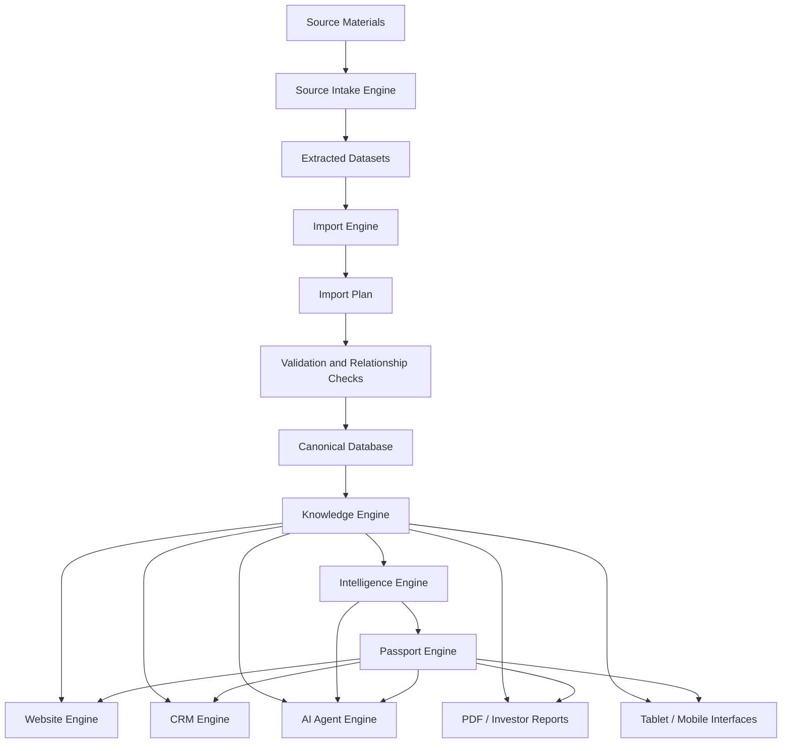

# Forever Brain Architecture v1.0

Task ID: ARCH-001

Status: Official top-level architecture specification

Date: 2026-07-09

## Purpose

Forever Brain is the top-level architecture for the Forever platform. It defines how source materials become validated project knowledge, deterministic intelligence, canonical Forever Passports, public website experiences, CRM workflows, and future AI Agent interactions.

The architecture follows the Forever principle:

```text
One Engine, Many Interfaces
```

The same source-backed knowledge should power every interface. Forever must not create separate truths for the website, Passport, CRM, reports, mobile app, tablet mode, or future AI workflows.

## 1. Overall Platform Architecture

Forever is a verified real-estate decision platform organized around five durable layers:

1. Source Material Layer
2. Import Engine Layer
3. Knowledge Layer
4. Intelligence and Passport Layer
5. Interface Layer

The platform begins with developer and project source material, not UI copy. Source material is classified, extracted, validated, planned, and eventually persisted into canonical database records. Those records then become the basis for explainable Intelligence, the Forever Passport, website pages, CRM workflows, investor outputs, and AI Agent answers.

Current implementation status:

- The public website, Project Detail Engine, deterministic Intelligence Core, and Passport UI MVP exist.
- Supabase is the application database and long-term canonical persistence layer.
- Import Engine RC3 supports source package validation and dry-run planning for Project, Buildings, Units, and Price History.
- RC3 intentionally blocks execute mode for the expanded Project + Buildings + Units + Price History stage until write-path, rollback, audit, and currency policy are approved.
- RC4.4–RC5.1 (2026-07-11/12) completed a different slice of this architecture than Section 11 originally sequenced: instead of first hardening Import Engine execute mode, the work built the Knowledge Engine's source-backed foundation chain (source registry → extraction pipeline → canonical project database → cross-source validation → knowledge graph → readiness) and proved it end to end on two real projects (Coralina, Modeva) through a generic engine, `src/features/forever-project-knowledge`. This is architecture only — no persistence, no public route, no database write — inspectable at internal `noindex` routes (`/internal/coralina`, `/internal/projects/$slug`). See `docs/RC5_1_PROJECT_KNOWLEDGE_PLATFORM.md` and Section 11's note below.
- Media, documents, source records, Intelligence persistence, Passport snapshots, CRM writes, website canonical read-model migration, and AI Agent workflows are future phases.

## 2. Core Engines and Responsibilities

### Source Intake Engine

The Source Intake Engine is the operational process for organizing raw project material under:

```text
forever-data/projects/{project_slug}/
```

Responsibilities:

- Maintain `manifest.json`.
- Maintain `import-status.json`.
- Classify source files into standard folders.
- Preserve original source material.
- Keep missing facts missing.
- Prepare extracted JSON files for validation and import planning.

### Import Engine

The Import Engine turns one validated project package into a deterministic import plan.

Responsibilities:

- Load and validate the manifest.
- Load extracted datasets.
- Validate package readiness.
- Block incomplete packages before planning.
- Create canonical Project, Building, Unit, and Price History plans.
- Validate relationships, duplicates, orphan records, numeric values, and price dates.
- Run dry-run without creating a Supabase client.
- Prepare rollback intent for future execute mode.
- Keep database writes isolated in the database layer.

Current RC3 scope:

- Project planning.
- Building planning.
- Unit planning.
- Price History planning.
- Dry-run validation.
- Execute mode blocked for the expanded stage.

### Knowledge Engine

The Knowledge Engine is the canonical source-backed knowledge layer. It is the future owner of fact-level provenance, source graph records, evidence relationships, validation artifacts, and reusable project knowledge.

Responsibilities:

- Store canonical project facts.
- Connect facts to source evidence.
- Track completeness and verification state.
- Expose reusable knowledge to Intelligence, Passport, Website, CRM, reports, and AI Agents.
- Prevent unstored assumptions from entering recommendations.

Current status:

- The data standard defines the Knowledge target.
- Canonical database foundations exist or are prepared through additive migrations.
- A full source graph and fact-level provenance system is not yet implemented.

### Intelligence Engine

The Intelligence Engine produces explainable project evaluation outputs from structured project data.

Responsibilities:

- Generate deterministic scores and verdicts.
- Identify strengths, weaknesses, risks, buyer fit, rental strategy, exit strategy, and investment horizon.
- Preserve source fields and source values used for every output.
- Avoid AI-only or unstored assumptions.

Current status:

- The current Intelligence layer is deterministic and rules-based.
- No active AI implementation is part of the current production Intelligence flow.
- Future Intelligence persistence strategy is not yet finalized.

### Passport Engine

The Passport Engine creates the canonical project identity summary used across all Forever interfaces.

Responsibilities:

- Produce one canonical Forever Passport per project.
- Combine project identity, scores, verdict, buyer profile, recommendations, risks, and verification dates.
- Serialize Passport data for website, tablet, CRM, PDF, mobile, and verification flows.
- Preserve source metadata and verification policy.

Current status:

- Passport mapper, serializer, and Passport UI MVP exist.
- Passport snapshot persistence is a future architecture decision.

### Website Engine

The Website Engine presents verified project knowledge to buyers and advisors.

Responsibilities:

- Render project listing, Discovery, and Project Detail experiences.
- Display Project Detail, Passport, Intelligence, media, units, documents, and contact flows.
- Avoid making public claims beyond source-backed knowledge.

Current status:

- The website uses display-oriented compatibility data and reusable Project Detail Engine components.
- Normalized canonical tables are not yet the primary website read model.

### CRM Engine

The CRM Engine connects verified project knowledge to buyer and advisor workflows.

Responsibilities:

- Use canonical project, unit, price, Passport, and Intelligence data in lead workflows.
- Support buyer-fit matching, advisor notes, follow-up context, and sales workflow state.
- Keep buyer data separate from project truth.
- Use availability and price history as source-backed context, not manually duplicated facts.

Current status:

- CRM integration is a future milestone.
- Lead storage exists in the broader database foundation, but CRM workflows are not yet the primary interface.

### AI Agent Engine

The AI Agent Engine is a future interaction layer over Forever Knowledge.

Responsibilities:

- Answer questions using only source-backed knowledge, validation artifacts, and approved generated outputs.
- Cite or reference evidence where possible.
- Distinguish known facts, missing facts, warnings, and assumptions.
- Support internal workflows such as intake review, advisor prep, buyer Q&A, and project comparison.
- Avoid database writes unless routed through approved tools and validation gates.

Current status:

- No AI Agent implementation is active.
- Future AI Agent behavior depends on Knowledge Engine provenance, validation artifacts, and read-safe interfaces.

## 3. Data Flow from Source Materials to User Experience

The canonical data flow is:

```text
Developer/source materials
  -> Project source package
  -> Extracted JSON datasets
  -> Manifest and readiness validation
  -> Import plan
  -> Relationship validation
  -> Canonical database records
  -> Knowledge records and source evidence
  -> Intelligence outputs
  -> Forever Passport
  -> Website, CRM, reports, mobile, tablet, and AI Agents
```

RC3 currently reaches dry-run import planning and validation for Project, Buildings, Units, and Price History. The full Knowledge -> Intelligence -> Passport -> multi-interface flow is the target architecture and must be built incrementally without weakening source-backed guarantees.

## 4. Engine Interaction Diagram



Boundary rule:

- Import Engine validates and plans source-backed data.
- Knowledge Engine owns reusable truth and evidence.
- Intelligence Engine interprets structured truth.
- Passport Engine summarizes canonical project identity.
- Interfaces consume these outputs; they do not become sources of project truth.

## 5. Single Source of Truth Principles

Forever must preserve one canonical truth for every project.

Principles:

- Source materials are the origin of project facts.
- Canonical database records are the durable application truth after validation and import.
- Knowledge records connect facts to source evidence.
- Intelligence outputs must derive from stored structured data.
- Passport is the canonical project summary, not a separate data model with independent facts.
- Website, CRM, reports, mobile, tablet, and AI Agents must read from canonical records or approved read models.
- Missing facts remain `null`, absent, blocked, or explicitly unknown.
- `SOURCE_PENDING` must never be converted into a real fact.
- No interface may silently override canonical project facts.
- Human edits to project facts must pass through the same validation and audit principles as imports.

## 6. Import -> Knowledge -> Intelligence -> Passport -> Website Flow

The primary Forever Brain flow is:

```text
Import
  -> Knowledge
  -> Intelligence
  -> Passport
  -> Website
```

### Import

The Import Engine receives one project package. It validates readiness, creates an import plan, validates relationships, and eventually writes canonical records only after dry-run passes and execute mode is approved.

### Knowledge

Canonical imported records become source-backed project knowledge. Future Knowledge Engine work should add source records, fact-level evidence, validation artifacts, and completeness scoring.

### Intelligence

The Intelligence Engine consumes structured project knowledge. It generates deterministic scores, recommendations, verdicts, strengths, weaknesses, and risks. It must not depend on fields that are not stored or traceable.

### Passport

The Passport Engine consumes project knowledge and Intelligence outputs to produce one canonical Forever Passport. Passport should become the portable identity layer for website, CRM, reports, mobile, tablet, and AI Agent contexts.

### Website

The website consumes Project Detail data, Passport, Intelligence, media, documents, unit inventory, and price history through stable read models. Future website work should reduce dual-model drift by migrating display behavior toward canonical imported records.

## 7. CRM Interaction

CRM must interact with Forever Brain as a consumer of verified knowledge, not as a competing source of project truth.

CRM may own:

- Leads.
- Buyer profiles.
- Advisor notes.
- Follow-up state.
- Buyer preferences.
- Inquiry history.
- Deal workflow state.

CRM must consume:

- Canonical project identity.
- Unit availability and price history.
- Passport summary.
- Intelligence recommendations.
- Verification status and warnings.
- Source-backed buyer-fit signals.

CRM must not own:

- Project facts.
- Developer facts.
- Location facts.
- Unit inventory truth.
- Price history truth.
- Passport truth.
- Intelligence truth.

Future CRM extension points:

- Buyer-to-project fit scoring.
- Advisor preparation summaries.
- Availability change alerts.
- Verified project comparison packets.
- Lead-specific Passport/report exports.
- CRM-safe read APIs or database views.

## 8. AI Agent Interaction

AI Agents may become an interface over Forever Brain, but they must operate under stricter evidence rules than ordinary chat tools.

Allowed AI Agent behaviors:

- Answer questions using canonical Knowledge, Intelligence, and Passport data.
- Explain why a project scored a certain way.
- Compare source-backed project facts.
- Identify missing facts and validation blockers.
- Draft advisor notes from verified data.
- Prepare buyer Q&A summaries.
- Assist with source intake review.

Forbidden AI Agent behaviors:

- Inventing missing project facts.
- Treating unstored assumptions as recommendations.
- Mutating project data without an approved validation workflow.
- Writing database changes outside approved import/admin pathways.
- Presenting deterministic Intelligence as active AI analysis when it is rules-based.

AI Agent readiness requirements:

- Stable Knowledge Engine read interface.
- Fact-level source evidence.
- Machine-readable validation artifacts.
- Clear missing-fact and confidence representation.
- Audit trail for any agent-assisted write workflow.

## 9. Scalability Strategy

Forever Brain must scale across more projects, richer source packages, more interfaces, and future automation without duplicating truth.

### Data Scalability

- Use canonical normalized records for Projects, Developers, Locations, Buildings, Units, Price History, Documents, Media, Sources, Intelligence, and Passport.
- Keep extracted source packages reproducible and project-scoped.
- Add structured schema validation for extracted JSON before planning.
- Add database-level uniqueness constraints where safe.
- Preserve source evidence for every imported fact where possible.

### Import Scalability

- Decompose Import Engine stages before adding media, documents, source records, Intelligence, or Passport planning.
- Introduce a stage registry with stage-specific planners and validators.
- Use batch upserts or transaction/RPC-backed execution before re-enabling expanded execute mode.
- Persist import run artifacts and audit records.
- Support chunked or streaming validation for large inventories when needed.

### Interface Scalability

- Move website, CRM, reports, mobile, and tablet experiences toward shared read models.
- Keep Passport portable across interfaces.
- Keep Intelligence outputs versioned and explainable.
- Avoid embedding business rules directly in UI components when they belong in engines.

### Operational Scalability

- Use dry-run as the default safety gate.
- Require explicit approval before database writes.
- Keep every release branch working because the repository is connected to Lovable.
- Maintain documentation and validation reports as part of each intake milestone.

## 10. Future Extension Points

Planned extension points:

- Canonical media flow.
- Canonical document flow.
- Source graph and fact-level provenance.
- Import Engine stage registry.
- Extracted dataset schema validators.
- Import audit log and immutable validation artifacts.
- Transaction-backed execution and rollback.
- Project Intelligence persistence.
- Passport snapshot persistence.
- Website canonical read-model migration.
- CRM project and unit read APIs.
- AI Agent read interface over Knowledge.
- PDF and investor report generation.
- Tablet Booth Mode presentation metadata.
- Mobile app sync.
- Multi-currency pricing.
- Historical availability tracking.
- Geospatial scoring.
- Document OCR confidence scoring.
- Admin/project data management.

## 11. Release Evolution Roadmap (RC4-RC8)

Status note (2026-07-12): the RC4 label below was originally reserved for Import Engine execute-mode hardening. What actually shipped under RC4.4–RC4.9 and RC5.0–RC5.1 was the Knowledge Engine foundation chain described in Section 1 and `docs/RC5_1_PROJECT_KNOWLEDGE_PLATFORM.md` — architecture-only, proven on two real projects, with no persistence or execute-mode change. The RC4 exit criteria below (stage registry, schema validation, currency policy) remain undone; Import Engine execute-mode hardening is still a real, separate next step whenever it is picked up, distinct from the completed Knowledge Engine chain.

### RC4: Import Engine Hardening

Goal: make the Import Engine ready for safer expansion beyond RC3 dry-run planning.

Scope:

- Introduce an Import Stage interface or stage registry.
- Split stage-specific planning out of the large planner module.
- Add extracted JSON schema validation.
- Resolve currency policy for explicit null currency versus default `THB`.
- Add automated tests for manifest validation, blocked packages, plan creation, relationship validation, dry-run safety, and execute-mode blocking.
- Create a repeatable intake validation report template.

Exit criteria:

- Project, Building, Unit, and Price History dry-runs remain stable.
- Coralina blockers remain source-backed and visible.
- No execute-mode expansion occurs without transaction, rollback, and audit decisions.

### RC5: Execute-Mode Safety and Audit

Goal: reintroduce expanded database execution only after safety infrastructure exists.

Scope:

- Add transaction or RPC-backed execution for the expanded stage.
- Capture prior-row snapshots for rollback.
- Persist import run audit records.
- Add idempotency validation scripts.
- Add database-level uniqueness where safe.
- Keep dry-run available and non-mutating.

Exit criteria:

- Repeat imports do not create duplicates.
- Failed imports can be rolled back or safely marked failed with audit evidence.
- Execution behavior is documented and intentionally approved.

### RC6: Source, Documents, and Media

Goal: move beyond project/unit data into richer verified evidence.

Scope:

- Define canonical source, document, media, image, video, and project asset boundaries.
- Add source record planning.
- Add document planning.
- Add media planning.
- Validate duplicate documents and media assets.
- Preserve visibility, verification status, and source metadata.

Exit criteria:

- Documents and media have a single canonical path.
- Website media/document display can migrate without duplicate truth.
- Source evidence becomes available to Knowledge Engine work.

### RC7: Knowledge, Intelligence, and Passport Persistence

Goal: connect canonical imported records to reusable Intelligence and Passport outputs.

Scope:

- Add source graph and fact-level evidence identifiers.
- Define Intelligence generation and persistence policy.
- Define Passport snapshot ownership and versioning.
- Persist validation artifacts used by Intelligence and Passport.
- Add completeness scoring based on the Data Standard.

Exit criteria:

- Intelligence outputs are traceable to stored project data.
- Passport has one canonical project identity contract.
- Website and future interfaces can consume Passport without remapping facts.

### RC8: Multi-Interface Brain

Goal: expose Forever Brain safely across website, CRM, reports, tablet/mobile, and AI Agents.

Scope:

- Migrate website read models toward canonical Knowledge/Passport/Intelligence records.
- Add CRM-safe project and unit read APIs or views.
- Add report generation contracts.
- Add AI Agent read interface with evidence, confidence, and missing-fact handling.
- Add audit rules for agent-assisted write workflows.

Exit criteria:

- Website, CRM, reports, tablet/mobile, and AI Agents use the same source-backed project truth.
- AI Agents can explain and compare projects without inventing facts.
- Forever Brain supports One Engine, Many Interfaces at platform scale.

## Final Architecture Rule

Forever Brain succeeds only if every interface is downstream of validated knowledge.

The platform may have many experiences, but it must have one truth.
