# Forever CRM Architecture V1

Status: Proposal — Draft for Architect Review. Not canonical. Authorizes no implementation.
Last updated: 2026-07-28
Task ID: FOREVER-CRM-ARCH-001
Inspected main SHA: 821b3c4e2f6f82e0d4ddce86199a8ff24b44a094

**This document authorizes nothing.** It proposes no implementation, no migration, no schema change, no grant,
no RLS policy, no deployment and no production action. Every SQL block is illustrative DDL for review — none of
it is a migration. Forever Factory remains at **A0 — Propose only**. `docs/CURRENT_STAGE.md` is unchanged by this
document and remains the authority for the active task; nothing here promotes CRM into the active stage.

Companion documents:

- `docs/FOREVER_CRM_CURRENT_STATE_AUDIT.md` — the repository evidence base this document rests on.
- `docs/FOREVER_CRM_MARKET_RESEARCH.md` — the 2026 CRM and compliance research, with sources.
- `docs/FOREVER_CRM_IMPLEMENTATION_PLAN.md` — build-vs-integrate, phasing, backlog, migration, risks, Owner decisions.
- `docs/FOREVER_CRM_INDEPENDENT_REVIEW.md` — the adversarial review of this proposal and its reconciliation.
- `docs/FOREVER_CRM_EXECUTIVE_SUMMARY_RU.md` — Russian executive summary for the Owner.

Evidence tags used throughout: `[Repository fact]` `[Owner requirement]` `[Web research]` `[Inference]`
`[Recommendation]` `[Unverified assumption]`. Privacy and legal content is **architecture research, not legal
advice**; points needing a Thai-qualified privacy lawyer are flagged `[LAWYER]`.

---


---

## 1. Forever CRM product vision and boundaries

### 1.1 What the Forever CRM is

The Forever CRM is **the operational layer of Forever OS**: the surface on which a human advisor
acts on a person who has expressed interest, and the record of what was done, when, by whom, and
what happened next. `[Owner requirement]`

The repository already says this, in constitutional text: *"The CRM should become the operational
layer for leads, buyer goals, follow-up, and sales conversion."* — `docs/FOREVER_BLUEPRINT.md:249-256`
(§13 CRM, Status: Planned) `[Repository fact]`

Three sentences that should survive every future rewrite of this document:

| # | Statement | Why it is load-bearing |
|---|---|---|
| V1 | The CRM owns **relationships and work**, never **facts about the world**. | Facts belong to Forever Brain. Copying them into the CRM creates a second truth that silently drifts. `[Repository fact]` `docs/FOREVER_BRAIN_V1.md:311-319` |
| V2 | The CRM is an **interface over one engine**, not a system beside it. | `docs/FOREVER_BLUEPRINT.md:11` states One Engine, Many Interfaces and names CRM as one of the interfaces. `[Repository fact]` |
| V3 | The CRM's real political function at 3–15 people is **settling who did what**. | Every routing, assignment and stage decision must be an event a human can read back. `[Web research]` Lofty ships routing logs for exactly this: https://help.lofty.com/hc/en-us/articles/360055177831-Lead-Routing-How-to-set-up-lead-routing-rules |

### 1.2 What the Forever CRM is not

| Not this | Because |
|---|---|
| A contact database | A contact list with no next action and no read path is what Forever has today and it does not work. `public.leads` has **no SELECT policy and zero readers** — `supabase/migrations/20260704132000_create_leads.sql:27-40` grants only INSERT to `anon`/`authenticated`, and `src/lib/lead-service.ts:92` is the only `from("leads")` call in the codebase. `[Repository fact]` |
| A separate SaaS product | Triple-blocked in the repository: `docs/ROADMAP.md:144` ("Use the existing Supabase lead boundary and Advisory foundations before buying or building a large CRM"), `docs/ROADMAP.md:228`, `docs/CURRENT_STAGE.md:224`, `docs/FOREVER_STRATEGIC_NORTH_STAR.md:254`. `[Repository fact]` (D7) |
| A second Decision Engine | `src/features/navigator/core/matching.ts:8-11` states the NAV-001 §09 hard rule: *"No score, percentage, ranking, 'best project', fabricated yield, market position, verification status, or trust score is ever computed or shown."* `[Repository fact]` (D10) |
| A messaging client | Rebuilding a WhatsApp inbox is the most expensive first iteration available and the economics invert on 1 Oct 2026 when service messages become billable. `[Web research]` https://developers.facebook.com/documentation/business-messaging/whatsapp/pricing (D6) |
| A project/unit catalogue | `docs/FOREVER_BRAIN_V1.md:311-319` forbids it by name. `[Repository fact]` |
| A second staff-identity system | `public.studio_members` is the only staff identity — `supabase/migrations/20260721120000_forever_studio_v1.sql:84-93`. `[Repository fact]` (D3) |

### 1.3 The inherited boundary contract — reused verbatim

The hardest boundary question ("what may the CRM own?") **is already answered in the repository**
and does not need to be re-decided. The following is quoted verbatim from
`docs/FOREVER_BRAIN_V1.md:288-328` (§7 CRM Interaction) and is adopted unchanged as the spine of
this architecture. `[Repository fact]`

> ## 7. CRM Interaction
>
> CRM must interact with Forever Brain as a consumer of verified knowledge, not as a competing source of project truth.
>
> CRM may own:
>
> - Leads.
> - Buyer profiles.
> - Advisor notes.
> - Follow-up state.
> - Buyer preferences.
> - Inquiry history.
> - Deal workflow state.
>
> CRM must consume:
>
> - Canonical project identity.
> - Unit availability and price history.
> - Passport summary.
> - Intelligence recommendations.
> - Verification status and warnings.
> - Source-backed buyer-fit signals.
>
> CRM must not own:
>
> - Project facts.
> - Developer facts.
> - Location facts.
> - Unit inventory truth.
> - Price history truth.
> - Passport truth.
> - Intelligence truth.
>
> Future CRM extension points:
>
> - Buyer-to-project fit scoring.
> - Advisor preparation summaries.
> - Availability change alerts.
> - Verified project comparison packets.
> - Lead-specific Passport/report exports.
> - CRM-safe read APIs or database views.

**Two amendments this architecture records against the quoted text, and only two:**

1. *"Buyer-to-project fit scoring"* (listed as a future extension point at `docs/FOREVER_BRAIN_V1.md:323`)
   is **struck**. It directly contradicts `src/features/navigator/core/matching.ts:8-11`, which is
   executable, tested code and therefore the stronger authority. The CRM must never compute a fit
   score, a lead score, or a ranking. What it may do is *snapshot the deterministic `MatchReason[]`*
   the existing evaluator already produces. `[Repository fact]` `[Recommendation]` (D10)
2. *"Leads"* under **may own** is read narrowly: the CRM owns the *enquiry episode and the work on it*.
   It does not own a rival person identity. Per D1 the durable identity is `crm_contact`; `public.leads`
   stays an append-only intake event log. `[Recommendation]`

### 1.4 Position in the canonical chain

`docs/FOREVER_CORE_ARCHITECTURE.md` fixes the CRM's place in the platform workflow: `[Repository fact]`

> Visitor → Navigator → Decision Engine → Decision Profile → Forever Story → Recommendation Engine →
> Forever Passport → Advisor Workspace → **CRM** → Long-term Client Timeline

**Honest caveat on that citation.** `docs/FOREVER_CORE_ARCHITECTURE.md` is stored as escaped markdown
(headings are written `\# Forever Core Architecture`, so they do not render as headings), it is
Navigator-era RC1 text, and it is **not registered in `docs/FOREVER_DOC_INDEX.md`** — a grep for
`CORE_ARCHITECTURE` in the index returns nothing, while `docs/FOREVER_DOC_INDEX.md:88` requires every
durable document to be indexed. `[Repository fact]` Therefore: **cite `docs/FOREVER_BRAIN_V1.md` as the
operative authority for the CRM boundary**, and treat the chain above as a positional statement only,
not as a specification of any interface. `[Recommendation]`

The chain also states an order the CRM must not invert: **Advisor Workspace precedes CRM**. The
Advisory derivations are pure and test-locked (`src/features/advisory/`, and
`src/lib/advisory-public-boundary.test.ts:17-101` pins `/advisory` and `/advisory/report` as data-free
placeholders). The CRM calls them; it must not fork them, and it must not be mounted at `/advisory`.
`[Repository fact]`

### 1.5 Module boundary table (anti-absorption rules)

Read this table as the answer to "the CRM needs X — should the CRM store X?" The **anti-absorption rule**
column is what stops the CRM eating the platform. `[Recommendation]`

| Module | Owns (source of truth) | CRM reads (never writes) | Anti-absorption rule |
|---|---|---|---|
| **Forever Core / Brain** | The canonical knowledge model itself | Nothing directly; via the modules below | The CRM never adds a table whose name would make sense in Brain. If a proposed CRM table describes the *world*, it belongs to Brain. `docs/FOREVER_BRAIN_V1.md:311-319` `[Repository fact]` |
| **Project Record** | Project, developer, location, building, unit facts; `projects.slug` is the identity key | `projects(slug)` by FK; project name, status, area for display | The CRM stores the **slug**, never a copy of the name, price or status. `leads.project_slug REFERENCES public.projects(slug) ON UPDATE CASCADE ON DELETE SET NULL` already models this (`supabase/migrations/20260704132000_create_leads.sql:10`). `[Repository fact]` |
| **Unit inventory** | `units(id)`; `unit_price_history`; `price_updates`; `project_status_history` | `units(id)` by FK; live availability and price at read time | The CRM never persists a price. A UNIQUE constraint on `units(project_id, unit_code)` is **missing** and must be added alongside any unit FK, or the ingest's SELECT-then-INSERT can create duplicate units. `[Repository fact]` `[Recommendation]` |
| **Passport** | The canonical Forever Passport | Passport summary; the serialized export envelope (`src/features/passport/passport-serializer.ts`) | The CRM may persist an **immutable snapshot of what it sent a client** (Passport and Advisor Report are derived on the fly and never stored — `src/features/advisory/advisor-report.ts:252` is a pure derivation, and `docs/ADVISOR_REPORT_RC2_8.md:141-143` records that RC2.8 introduced no schema or persistence). That snapshot is a *communication record*, explicitly not Passport truth, and must be labelled as of-date. `[Repository fact]` `[Recommendation]` |
| **Advisory** | Advisor Report, Client Strategy, comparisons — all pure, deterministic, derived at read time | The derived output, called live | The CRM must not fork or extend the derivations (`src/features/advisory/client-strategy.ts:22-33` is test-locked against inventing scores, verdicts, rankings or financial figures). `[Repository fact]` |
| **Navigator** | The question vocabulary, `NavigatorAnswers`, `deriveDecisionProfile`, `evaluateCatalogue` | The pure functions, called live | The CRM persists **answer enum keys** and re-derives everything else. It never persists a `DecisionProfile` (JSON round-tripping it corrupts `budgetCeiling` — `Number.POSITIVE_INFINITY` becomes `null`). `[Repository fact]` (D10) |
| **Booth** | The in-person session: its own consent capture, its own next-action and appointment facts | The resulting enquiry + a session reference | If Booth models assignment or a scheduled consultation, the CRM **reads Booth as authoritative** rather than maintaining a second copy. `[Repository fact]` (Booth Mode 2.0 remains an open draft PR; sequencing is a dependency, not a licence to fork.) |
| **Studio** | Project data authoring and publication; `studio_members` staff identity; `studio_object_owners` ACL | Staff identity and capability; object ownership | The CRM adds **no second identity system** and **no second role table**. It extends `studio_members` with an additive boolean. `[Repository fact]` (D3) |
| **Factory** | The governance process: task packets, gates, autonomy level | Nothing at runtime | The CRM does not model Factory work items. Factory stays A0 — Propose only. `[Repository fact]` |
| **Marketing** | Campaigns, spend, channel content | Source attribution values only | The CRM stores **where a person came from**, not campaign objects. No campaign table, no spend table, no attribution model in v1. `[Recommendation]` |
| **External comms providers** (WhatsApp / email / calendar) | Message transport and message content | Nothing in v1 — outcomes are logged manually | No `whatsapp_thread_id` on any CRM row and no `wa_message` table as the only conversation store. The schema is channel-agnostic: `contact_channel(kind)` ∈ {phone, email, other} with a `channels` array on the phone row. `[Web research]` https://developers.facebook.com/documentation/business-messaging/whatsapp/solution-providers/migrate-existing-whatsapp-number-to-a-business-account/ (D6) |
| **Accounting / finance** | Invoices, commission payment, tax, payroll | Nothing | The CRM records **commission attribution** (who registered the client with which developer, and when) as an *evidence* record for dispute settlement. It never computes, invoices or reconciles money. `[Web research]` `[Recommendation]` https://www.spark.re/product/inventory |

### 1.6 Module boundary diagram

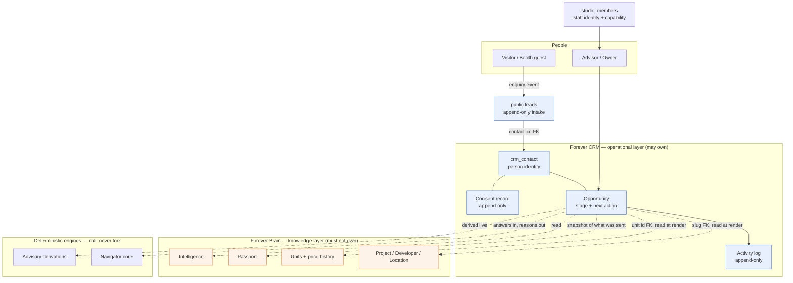

Solid arrows are writes the CRM performs. Dotted arrows are **reads only** — every one of them is a
live read or an FK, never a copy. `[Recommendation]`

### 1.7 One Engine, Many Interfaces — the single-definition register

`docs/FOREVER_BLUEPRINT.md:11` and `docs/FOREVER_STRATEGIC_NORTH_STAR.md:92` both state the principle.
Its operational consequence is a register: **for each concept, exactly one definition, in exactly one
place.** If a second definition appears anywhere, that is the defect. `[Repository fact]` `[Recommendation]`

| Concept | The one definition lives in | The CRM's relationship | Known live violation |
|---|---|---|---|
| **Guest / buyer profile** | `crm_contact` (proposed) | Owns it | `src/features/navigator/domain/models/client.ts` declares a rival `ClientModel` with its own `lifecycleStage` enum. Marked deprecate/do_not_build. `[Repository fact]` (D9) |
| **Project truth** | `public.projects` + FDB tables | Reads by slug | — |
| **Project identity** | `projects.slug` (UNIQUE) | Stores the slug | **Two incompatible display IDs exist for the same project**: `FOREVER-<SLUG>` (`src/features/passport/passport-mapper.ts:37-39`) vs the bare slug (`src/features/advisory/forever-passport.ts:302`). **Never persist a "Forever ID"** — persist slug or UUID and derive the display form. `[Repository fact]` |
| **Recommendations / match reasons** | `src/features/navigator/core/matching.ts` `evaluateCatalogue` | Calls it; snapshots `MatchReason[]` with slug + evaluation timestamp | — |
| **Shortlist** | The CRM opportunity's project/unit interest rows | Owns it | Navigator has no persisted shortlist; the website flow persists nothing at all. `[Repository fact]` |
| **Lead / enquiry history** | `public.leads` (append-only intake events) | Owns it; adds `contact_id` | Nothing reads it back today. `[Repository fact]` |
| **Contact identity (dedup key)** | `crm_contact_method(kind, normalized_value)` UNIQUE index (proposed) | Owns it | `idx_leads_email` is **non-unique** (`supabase/migrations/20260704132000_create_leads.sql:47`) → zero deduplication today. `[Repository fact]` |
| **Transaction state** | The CRM opportunity's `stage` | Owns it | `leads.status` CHECK is a rival, dead vocabulary — see §4.5. `[Repository fact]` |
| **Source attribution** | `leads.source` on the intake event, promoted to a controlled vocabulary | Owns it | `leads.source` is unconstrained `TEXT NOT NULL DEFAULT 'contact_form'` with five live values. `[Repository fact]` |
| **Evidence / verification status** | Forever Brain (Intelligence, sources, documents) | Reads and displays; never re-states | — |
| **Staff identity + capability** | `public.studio_members` | Reads | — |

### 1.8 The AI boundary

Forever's own AI contract is already written at `docs/FOREVER_BRAIN_V1.md:330-358` (§8 AI Agent
Interaction) and applies to the CRM unchanged: allowed behaviours include answering from canonical
data, explaining a score, comparing source-backed facts, identifying missing facts, drafting advisor
notes from verified data, preparing buyer Q&A summaries and assisting source intake review; forbidden
behaviours include inventing missing project facts, treating unstored assumptions as recommendations,
mutating project data outside an approved validation workflow, writing database changes outside
approved import/admin pathways, and presenting deterministic Intelligence as active AI analysis.
`[Repository fact]`

Applied to CRM operations:

| AI **may** assist with | AI **must not** do |
|---|---|
| Summarise a long conversation or a message thread into a proposed note | Send any message to a client without a human pressing send |
| Translate RU ↔ EN ↔ TH for the advisor to review before sending | Auto-translate and auto-send |
| Draft a first-response or follow-up message **into an editable box** | Change an opportunity stage |
| Structure a free-text note into the neutral structured fields | Assign, reassign or reclaim an opportunity |
| Suggest a next action and a due date | Set a next action without confirmation |
| Assist duplicate review by ranking candidate pairs for a human | Execute a merge |
| Retrieve and explain an existing Passport / Intelligence output | Create, edit or infer a project, unit, developer or price fact |
| Draft a lost-reason classification for confirmation | Write a consent record, or infer consent |
| — | **Compute a lead score, fit percentage, ranking, or "best project"** |

**The last row is D10 and it is absolute.** `src/features/navigator/core/matching.ts:8-11` states it as a
NAV-001 §09 rule in executable, test-covered code, and a CRM lead score would be exactly the
fabricated signal that rule exists to prevent. It also cannot be sneaked in as "priority", "heat",
"temperature", "engagement level" or "AI ranking" — any single derived number ordering people by
predicted value is the same object under a different label. `[Repository fact]` `[Recommendation]`

The default posture for every AI-assisted CRM write is **draft, then human confirm**. This is not
timidity; it is the same rule the repository already applies to project data, extended to people.
`[Recommendation]`

---

## 2. Role and workspace design

### 2.1 The honest baseline: Forever has two roles and no members

Before designing nine roles, state what exists. `[Repository fact]`

- `public.studio_members.role` is `TEXT NOT NULL CHECK (role IN ('owner', 'trusted_publisher'))` —
  `supabase/migrations/20260721120000_forever_studio_v1.sql:86`. Neither value is a sales role.
- The repository audit records that **production contains one Auth user and zero `studio_members` rows.**
- There is **no advisor, agent, host, coordinator or marketing role** anywhere in the schema.
- There is **no CRM UI**: `src/routes/` contains `studio.*` and `booth.tsx` and nothing lead-facing.
- `/booth` is **unauthenticated** on `main`. `source='booth'` is therefore **not** a trusted
  staff-verified signal today.

Consequence, stated plainly: **most of the roles below are future roles, and several of them are the
same person.** At current scale, "sales director", "team leader", "CRM administrator" and "marketing
staff" are one human — the Owner. Over-roleing a three-person team is a real failure mode: it produces
permission matrices nobody maintains, screens nobody opens, and an authorization surface that is
larger than the business. `[Inference]` `[Recommendation]`

Salesforce's own stated reason for making Leads private — so there is no potential for internal
competition — is an artefact of large commissioned sales floors and would be actively harmful here.
`[Web research]` https://help.salesforce.com/s/articleView?id=platform.security_sharing_owd_about.htm&language=en&type=5

### 2.2 Recommended v1 role set — build two, defer seven

| Decision | Roles |
|---|---|
| **Build in v1** | **Owner** (existing `role='owner'`) and **Advisor** (a capability, not a role — see §2.4) |
| **Defer** | Sales director, team leader, Booth Host, CRM administrator / sales coordinator, marketing staff, Studio publisher (already exists as `trusted_publisher`, no CRM capability needed), partner/referral |

Deferral is not deletion. Each deferred role below carries an explicit **promotion trigger** — the
observable condition that would justify creating it. Until the trigger fires, the role's duties are
performed by the Owner. `[Recommendation]`

### 2.3 Role matrix

Mobile requirement uses three levels: **Mobile-first** (the primary device), **Mobile-capable** (must
work on a phone but is not the primary device), **Desktop-only** (deliberately not built for phones).

| Role | v1? | Primary daily workspace | Must see | Can change | Must NOT see | Critical alerts | 3–5 common actions | Mobile | Handoff responsibility |
|---|---|---|---|---|---|---|---|---|---|
| **Owner** | **Yes** — `studio_members.role='owner'` exists | Today view + full pipeline | Everything: all opportunities, all activity, routing log, SLA breaches, consent state, DSR queue | Everything, including reassignment, merge, lost-reason override, policy rows (SLA values, reclaim window) | Nothing is hidden from Owner (documented consequence: the Owner is the only human who can see raw PII across all records, so Owner account MFA is a security control, not hygiene) | Unacknowledged enquiry past SLA; any escalation that reached the fallback; DSR due within 7 days; failed intake writes | Reassign an opportunity; close/reopen with reason; adjust a policy row; review the duplicate-candidate queue; read the routing log | Mobile-capable | Final backstop for every unclaimed enquiry — the escalation chain terminates at Owner, always |
| **Advisor / Agent / Forever Guide** | **Yes** — as `can_access_crm` boolean | **Today view**: overdue next actions, due today, next appointment, recently touched | Own assigned opportunities in full; the shared pond of unassigned enquiries; project/unit truth read live | Own opportunities: stage, next action, notes, activity outcomes, viewing records, lost reason. May claim from the pond | Other advisors' private notes; consent/DSR administration; policy rows; the audit log | New enquiry offered to them (claim window); their own next action overdue; viewing tomorrow with no confirmation; feedback not captured after a viewing | Log a contact attempt + outcome; set next action; claim from pond; record a viewing outcome; send a Passport/report snapshot | **Mobile-first** — advisors are at projects, not at desks | Must set a next action before leaving any open opportunity; must log an outcome before the SLA clock is considered stopped |
| **Sales director** | Defer | Would be: funnel + median first-response by source and by language | Team-wide pipeline, SLA compliance, routing log | Reassignment, routing rules | Consent/DSR administration | SLA breach rate crossing a threshold | Reassign; review routing; review median response time | Mobile-capable | — |
| *Promotion trigger* | — | When more than one advisor is assigned work **and** the Owner is no longer personally reading every enquiry. Until then the Owner is the sales director. `[Recommendation]` |
| **Team leader** | Defer | Would be: their team's queue | Their team's opportunities | Reassign within team | Other teams | Their team's SLA breaches | Reassign; coach on a specific record | Mobile-capable | — |
| *Promotion trigger* | — | When there are ≥ 2 teams. At 3–15 people there is one team, and a team layer is pure overhead. `[Inference]` |
| **Booth Host** | Defer | Would be: the Booth tablet (already exists as `/booth`) | The live session in front of them | Session data only | The CRM pipeline; other guests' records | None (they are in a live conversation) | Run a session; capture consent; hand off warm | Tablet-first | **The warm handoff is the whole job** — see §3.5 diagram |
| *Promotion trigger* | — | When `/booth` is actually gated behind authentication. It is not, today. Until then the Booth Host is an advisor using an ungated tablet, and Booth data must be treated as untrusted-origin. `[Repository fact]` |
| **CRM administrator / sales coordinator** | Defer | Would be: data quality + duplicate review | Duplicate candidates, source vocabulary drift, records missing next actions | Merge; correct source; correct attribution | Nothing extra | Duplicate candidate count rising; records with no next action | Merge duplicates; fix attribution; chase missing next actions | Desktop-only | Owns "the data is clean enough to trust" |
| *Promotion trigger* | — | When the duplicate-candidate view routinely holds more items than one person clears in a weekly pass. `[Recommendation]` |
| **Marketing staff** | Defer | Would be: source attribution report | Aggregate counts by source; **never** individual contact PII | Nothing in the CRM | **Individual PII, message content, notes** — marketing gets aggregates | None | Read the source report | Desktop-only | — |
| *Promotion trigger* | — | When someone outside the advisory team needs numbers. Until then the Owner reads the same report. The PII exclusion is a **PDPA design decision**, not a convenience: marketing's legitimate need is counts, and giving it row-level access widens the s37 security surface for no gain. **Architecture research, not legal advice — [LAWYER]** `[Web research]` https://www.mdes.go.th/law/detail/3577-Personal-Data-Protection-Act-B-E--2562--2019- |
| **Studio publisher / project-data staff** | **Exists** (`role='trusted_publisher'`), gets **no CRM capability** | Forever Studio | Project data | Project data | **All CRM data** | None | — | Mobile-capable (Studio shell already is) | None — this is the point: publishing project data and working buyers are separate jobs with separate blast radii `[Recommendation]` |
| **Approved partner / referral user** | **Do not build** — see §2.5 | — | — | — | — | — | — | — | — |

### 2.4 Capability model — additive boolean, not a third role (D3)

The role CHECK is not extended. A CRM capability is an **additive BOOLEAN column on
`studio_members`, defaulting FALSE**, following the accepted extension mechanism. `[Repository fact]` `[Recommendation]`

```sql
-- ILLUSTRATIVE DDL — NOT A MIGRATION. Nothing here is authorized for execution.
-- Pattern source: supabase/migrations/20260721120000_forever_studio_v1.sql:84-101
ALTER TABLE public.studio_members
  ADD COLUMN IF NOT EXISTS can_access_crm BOOLEAN NOT NULL DEFAULT false;

COMMENT ON COLUMN public.studio_members.can_access_crm IS
  'Least-privilege CRM capability. Additive and default-false: adding this column grants nobody
   anything. Authorization is re-checked live at every mutation against (is_active, can_access_crm),
   never from a role snapshot stored on a CRM row.';
```

Three properties this buys, each of which a third role value would lose: `[Inference]`

1. **Additive-safe.** Adding the column grants nobody anything. A new CHECK value would require every
   existing consumer of `role` to be re-read for correctness.
2. **Orthogonal.** An Owner who does not work leads, and a publisher who does, are both expressible.
3. **Revocable in one write**, with attribution preserved — the same reason `is_active` exists rather
   than deleting the row (`supabase/migrations/20260721120000_forever_studio_v1.sql:96-97`).

Authorization remains at the app-server boundary (D3): `createServerFn` → `requireSupabaseAuth` →
CRM membership middleware (re-reading `studio_members` live) → safe-error envelope. Every CRM table is
RLS-enabled with **no policies** and `REVOKE ALL` from `PUBLIC`/`anon`/`authenticated`; mutable tables
then `GRANT ALL` to `service_role`, while append-only tables revoke `service_role` too and grant narrowly
(§6.4.6). `[Repository fact]` `[Recommendation]`

**Forfeited defence-in-depth, recorded honestly:** without `auth.uid()` policies there is no
database-layer backstop if an app-server authorization check is ever wrong. The review trigger is
explicit: *if any browser ever needs to read CRM data directly, this decision is revisited*, and the
Supabase performance guidance (subselect-wrapped `auth.uid()`, `TO authenticated`, one permissive
policy per action, indexed policy columns) becomes the binding standard at that point.
`[Web research]` https://supabase.com/docs/guides/database/postgres/row-level-security

### 2.5 Partner / referral access — recommend AGAINST in v1

**Recommendation: do not build partner or referral user access in v1.** `[Recommendation]`

| Cost it imposes | Detail |
|---|---|
| A second authorization tier | Every CRM server function gains an "is this an internal user or a partner?" branch — the highest-risk kind of conditional to get wrong, in a system with no database-layer backstop (D3) |
| A PII disclosure surface | A partner seeing a contact record is a **disclosure to a third party** under PDPA s27, which is gated on how the data was originally collected. Every existing consent record would need to have anticipated it. **Architecture research, not legal advice — [LAWYER]** `[Web research]` https://www.mdes.go.th/law/detail/3577-Personal-Data-Protection-Act-B-E--2562--2019- |
| A data-processing agreement per partner | Cross-organisation processing needs a written arrangement before the first login, not after |
| Product surface | Partners need a different screen, not the advisor screen with fields hidden. Hiding fields on a shared screen is how PII leaks |

**What would justify building it later** — all three, not any one: `[Recommendation]`

1. A **named, contracted** partner sends referrals at a volume where email/WhatsApp handoff demonstrably
   breaks (measurable as: referrals lost or duplicated in a month), **and**
2. a **signed data-processing arrangement** and a per-partner consent wording exist, **and**
3. the referral is answerable with **a status, not a record** — i.e. the partner needs "received /
   in progress / closed", not the contact's phone number and notes.

If (3) holds, the correct build is **not partner CRM access**. It is a one-way status endpoint keyed
on a referral reference, with no PII in the response. That is a fraction of the work and none of the
risk. `[Recommendation]`

Meanwhile, the capture-time distinction is worth taking now even without partner logins: record
**registrant type** (end buyer vs co-broke partner) on the enquiry, because the two need entirely
different nurture and different commercial terms, and forcing the distinction at capture is cheaper
than cleaning it up later. `[Web research]` https://knowledge.spark.re/registration-form-settings

---

## 3. End-to-end operating journeys

### 3.1 The common path

Every source converges on one path. The sources differ only in **what data exists at entry**, **what
consent state exists at entry**, and **who acts first**.

```
capture → identity resolve → consent recorded → route/assign → acknowledge → first human contact
        → qualify → viewing → reserve → close (won | lost) → nurture / post-sale
```

Two invariants hold on every branch: `[Recommendation]`

- **Every open opportunity has a next action with a due timestamp.** This is enforced at the database
  layer, conditioned on the opportunity being open — stronger than anything the surveyed vendors ship,
  and the correct reading of the evidence that idle-time "rotting" is a poor substitute
  (`[Web research]` https://support.pipedrive.com/en/article/the-rotting-feature — rotting explicitly
  disregards the next activity date).
- **Every routing, assignment, reclaim and stage change writes an event row.** `[Web research]`
  https://help.lofty.com/hc/en-us/articles/360055177831-Lead-Routing-How-to-set-up-lead-routing-rules

### 3.2 Source-by-source model

SLA clock semantics used below (all values are **configurable policy rows, never hard-coded UI text**):
**T0** = intake row committed; **ACK** = a human or the system has acknowledged; **FHC** = first human
contact attempt *logged with an outcome*. Per D5 the runtime tick is `*/5 * * * *`, so **timestamps are
measurable to the second but escalation fires at ≤5-minute resolution.** Do not promise 2-minute
escalation on this runtime. `[Repository fact]` `[Recommendation]`

| # | Source | Entry point | Data at entry | Consent at entry | Who acts | SLA clock | First useful action | Rejoins common path at |
|---|---|---|---|---|---|---|---|---|
| 1 | **Website enquiry** | `/contact` → `ContactForm source="contact_page"` | name (one concatenated string), email, phone, country, budget label, interest, message. **No project.** | **None captured today** — no consent field exists on `public.leads` | System → pond → advisor claims | T0 → ACK, then FHC | Identity resolve on normalised phone, then call/WhatsApp | Route/assign |
| 2 | **Navigator completion (website)** | `NavigatorFlow` → "Speak with an advisor" | **Nothing persists.** Answers, story and match reasons are lost at navigation | None | Nobody — there is no record | No clock starts | *Nothing happens today* | Does not rejoin — this is gap G-A below |
| 3 | **Project-specific enquiry** | Project detail page → `ProjectContactCTA` | Would carry `projectSlug` + `source='project_detail'` | None | As #1 | As #1 | Open with the project the person was reading | Route/assign |
| 4 | **Unit enquiry** | `/contact?project=…&unit=…` | Search params are validated and rendered as text | None | As #1 | As #1 | Check live unit availability before calling | Route/assign |
| 5 | **Booth walk-in** | `/booth` tablet | Full Navigator answers + contact + `project_slug` + staff note, flattened to prose in `leads.message` | Booth v1 collects **no consent** | Booth Host, live, in person | T0 is the *end* of the session; FHC is the warm handoff itself | Warm handoff to the owning advisor **in the room** | Qualify (skips acknowledge — a human is already present) |
| 6 | **Manual agent lead** | Advisor types it in (does not exist yet) | Whatever the advisor knows | Advisor asserts the basis and records the wording used | The advisor who entered it | No ACK clock; FHC is already done | Set next action immediately | Qualify |
| 7 | **Referral** | Manual entry with `registrant_type='partner_referral'` and a referral reference | Referrer identity + referred person | **Referrer's consent does not transfer** — Forever must capture its own | Owner assigns | T0 → FHC (no automated ACK — an automated message to a referral is a bad first impression) | Human intro mentioning the referrer | Route/assign |
| 8 | **Developer Check buyer** | Evidence/order product (does not exist) | Purchaser + which developer was checked | Purchase-context consent; marketing consent **separate and default FALSE** | Owner | T0 → FHC, slower tier (they bought a report, not a viewing) | Ask whether they want advisory on that developer's projects | Qualify |
| 9 | **Returning client** | Existing `crm_contact` matched at intake | Full history | Existing consent record applies **only to the purpose it was given for** | Prior owner (permanent credit), assignment may differ | Shorter FHC target | Open a **new opportunity** on the existing contact — never reuse the closed one | Qualify |
| 10 | **Dormant-client reactivation** | A sweep, or an inbound after silence | Full history, stale preferences | Re-check marketing consent at send time, not at list-build time | Assigned advisor, else pond | FHC only | Confirm the brief is still true before recommending anything | Qualify |
| 11 | **Project/price-change re-engagement** | A change event on a project the contact is linked to | The change + the contact's recorded interest | Service-purpose consent covers a relevant update; marketing consent does not cover a campaign | System proposes, **advisor sends** | FHC | Advisor reviews the draft and sends 1:1 | Qualify |

Rows 3, 4, 6, 7, 8, 10 and 11 describe **paths that do not exist yet**. They are modelled now so the
schema does not have to change when they do. `[Recommendation]`

Note on #11: price-change automation must consume `price_updates` and `project_status_history` (both
correct shape, both currently with **zero writers**) — **never** `unit_price_history`, which is not
append-only (the ingest UPDATEs a matching row in place) and carries `source_file`/`source_page`
repository paths that must never reach a client-facing surface. `[Repository fact]`

### 3.3 Repository facts that break these journeys today

| ID | Fact | Evidence | Consequence |
|---|---|---|---|
| **G-A** | **Website Navigator completions are never persisted at all.** `NavigatorFlow` holds every answer in `useState` and its terminal action is `navigate({ to: "/contact" })` — it submits no lead and passes no context | `src/features/navigator/components/NavigatorFlow.tsx:728-731`, `:709` | The single richest buyer-intent signal Forever produces is discarded 100% of the time. The person then re-types their details into a form that captures none of it |
| **G-B** | **`/contact` never sets `project_slug`.** The route validates `?project` and `?unit`, renders them as a text chip, then calls `<ContactForm source="contact_page" />` with no slug | `src/routes/contact.tsx:14-25`, `:69` | **Project attribution is lost on every website lead.** Only Booth sets it (`src/features/navigator/core/lead.ts:126-127`) |
| **G-C** | **`ProjectContactCTA` is the only code path that would pass a slug — and it is unreached.** It is defined and exported but imported by nothing | `src/features/project-detail/components/ProjectContactCTA.tsx:5,9`; no importer in `src/` | Journey #3 does not exist in production |
| **G-D** | **Booth sessions die with the tab.** Persistence is `window.sessionStorage` under `forever.booth.session.v1` only — no localStorage fallback, no server session | `src/features/navigator/core/session.ts:205-207`; `src/features/navigator/booth/useBoothSession.ts:38-58` | A closed tab, a crashed tablet or a guest who wanders off loses the entire session |
| **G-E** | **Nothing reads a lead back.** No SELECT policy, no server function, no UI, no notification, no queue | `supabase/migrations/20260704132000_create_leads.sql:27-40`; one `from("leads")` in the codebase at `src/lib/lead-service.ts:92` | The SLA clock in §3.2 currently measures nothing, because no human is told a lead arrived |
| **G-F** | **Delivery has never been verified end-to-end.** Gate G0 records that a test lead has never been observed to arrive | PR #118 gate G0 (open draft) | Every SLA number in this document is aspirational until G0 is closed |
| **G-G** | **No deduplication.** `idx_leads_email` is non-unique; there is no constraint on any identity field | `supabase/migrations/20260704132000_create_leads.sql:47` | The same person via three channels produces three unlinked rows. Journeys #9 and #10 are unimplementable without §4 identity work |
| **G-H** | **No consent field anywhere on `public.leads`.** Twelve columns, none of them consent, lawful basis, marketing preference, notice version, locale or retention | `supabase/migrations/20260704132000_create_leads.sql:1-25` | Journeys #1, #3, #4, #5 all collect personal data with no consent record. **Architecture research, not legal advice — [LAWYER]** |
| **G-I** | **The Booth staff note lands in the same column as guest-visible content** (`leads.message`) | `src/features/navigator/core/lead.ts:107-113,130` | An internal-vs-client-visible boundary must exist **before** any client-facing surface or data-subject access request exists |

Fixing G-A and G-B is the highest-value, lowest-risk work in this entire architecture: both are
small, both are additive, and both restore data that is currently destroyed at capture time.
`[Recommendation]`

### 3.4 Does one pipeline fit all sources?

**Analysis.** The eleven sources differ on four axes: whether a human is already present (Booth: yes;
web: no), whether contact details are verified (Booth: face-to-face; web: unverified anon insert),
whether an SLA acknowledgement is appropriate (referral: no — an automated reply to a referral is a
bad first impression), and what "qualified" means (Developer Check buyer bought a report, not a
viewing). `[Inference]`

But those are differences in **entry conditions and SLA policy**, not in the sequence of states. All
eleven end in the same place: someone reserved a unit, or they did not, and either way there is a
reason and a next contact date. `[Inference]`

**Recommendation (D1, D-brief §1): ONE pipeline configured, named by a `pipeline_key` column on the
opportunity. No `crm_pipeline` / `crm_pipeline_stage` configuration tables in v1 — see the amended
CRM-ADR-11.** `[Recommendation]`

| | Rationale |
|---|---|
| Why one now | Creating multiple pipelines before one works trades a single problem for a proliferation of half-maintained processes. `[Web research]` https://support.pipedrive.com/en/article/the-rotting-feature |
| Why the column anyway | A second process does not require re-cutting the work object; it is a second value in `pipeline_key`. **It does, however, require a migration** — the stage list is a hard-coded CHECK in v1 (§6.4.2), and adding a stage means altering that constraint. The earlier claim that a second process would be "configuration, not migration" was wrong and is withdrawn in CRM-ADR-11. `[Web research]` https://docs.attio.com/docs/objects-and-lists |
| Where stage lives | On the **opportunity** (the person's participation in a process), never on the intake event. Attio's list-entry model is the ideal: stage is an attribute of participation, so a second process is a second participation, not a new column on the person. `[Web research]` https://attio.com/help/reference/attio-101/attios-data-model/understanding-attio-data-model |
| What varies per source | Entry stage, SLA policy row, whether ACK is automated, and which fields are required to advance — **not** the stage list. Per-stage required fields enforce data quality progressively: keep capture to ~3 fields, require budget/timeline only to pass `qualified`. `[Web research]` https://developers.pipedrive.com/docs/api/v1/DealFields |

### 3.5 Journey diagrams

**Booth walk-in — the warm handoff.** The point of this diagram is that the handoff is a *transaction*:
consent, then persist, then transfer ownership, then confirm out loud. If any step fails, the guest is
still standing there and can be asked again.

```mermaid
sequenceDiagram
    autonumber
    actor Guest
    participant Host as Booth Host (tablet)
    participant Booth as Booth session
    participant Intake as Intake (server fn)
    participant CRM as CRM opportunity
    actor Advisor

    Guest->>Host: Walks in
    Host->>Booth: Start session
    Note over Booth: TODAY: state lives in sessionStorage only<br/>(session.ts:205-207) — a closed tab loses everything
    Host->>Guest: Show privacy notice in guest's language
    Guest->>Host: Service consent (marketing SEPARATE, default FALSE)
    Host->>Booth: Run Navigator questions
    Booth->>Booth: deriveDecisionProfile + evaluateCatalogue (pure)
    Host->>Intake: Submit (answers as ENUM KEYS + contact + consent + project_slug)
    Note over Intake: TODAY: browser anon insert, prose blob,<br/>no consent column (create_leads.sql:1-25)
    Intake->>Intake: Normalise phone (E.164), resolve identity
    Intake->>CRM: Create/attach crm_contact; open opportunity at "qualified"
    Intake-->>Host: Confirmation (no lead id returnable — no SELECT policy)
    Host->>Advisor: Warm handoff IN THE ROOM
    Advisor->>CRM: Accept ownership; set next action + due_at
    Advisor->>Guest: "I'll send you X by Y" — stated out loud
    Note over CRM: SLA clock does NOT start:<br/>first human contact already happened
```

**Website enquiry — first response.** The point of this diagram is the escalation chain and its honest
resolution limit.

```mermaid
sequenceDiagram
    autonumber
    actor Visitor
    participant Web as /contact form
    participant Intake as Intake (server fn)
    participant Pond as Unassigned pond
    participant Tick as Scheduled tick (*/5)
    actor Advisor
    actor Owner

    Visitor->>Web: Submit enquiry
    Note over Web: TODAY: project_slug is never set<br/>(contact.tsx:69) — attribution lost
    Web->>Intake: submit(payload)
    Note over Intake: TODAY: browser anon insert direct to public.leads<br/>(lead-service.ts:92). No rate limit, no dedup, no server validation.
    Intake->>Intake: Append intake event; normalise phone; resolve identity
    Intake->>Pond: Open opportunity, unassigned, next_action_at = now + ACK target
    Intake-->>Visitor: Acknowledgement shown on screen
    Pond->>Advisor: Offer with a bounded claim window
    Note over Pond,Advisor: Claim window is capped in MINUTES, not hours.<br/>Vendor precedent caps unclaimed at 30 min max.

    alt Advisor claims and logs an outcome
        Advisor->>Pond: Claim
        Advisor->>Advisor: Log contact attempt + outcome -> first_responded_at
    else Claim window expires
        Tick->>Pond: Sweep expired offers (durable rows, never timers)
        Pond->>Owner: Escalate (fallback chain terminates at Owner)
        Note over Tick: HONEST LIMIT: cron is */5, so escalation<br/>resolves at <=5 minutes. Timestamps are exact;<br/>escalation is not. Never promise 2-minute escalation.
    end

    Advisor->>Visitor: First human contact
    Note over Advisor: Opportunity cannot be left open<br/>without a next action + due_at
```

---

## 4. State machines

### 4.1 Enquiry / opportunity lifecycle

The state machine below lives on the **CRM opportunity**, not on the intake row. Every named state except
`intake_received` is a literal value of the `crm_opportunity.stage` CHECK in §6.4.2 — the diagram and the
constraint use the same nine strings, deliberately. `intake_received` is the *pre-opportunity* state of a
`public.leads` row and is **not** a `crm_opportunity.stage` value. `[Recommendation]`

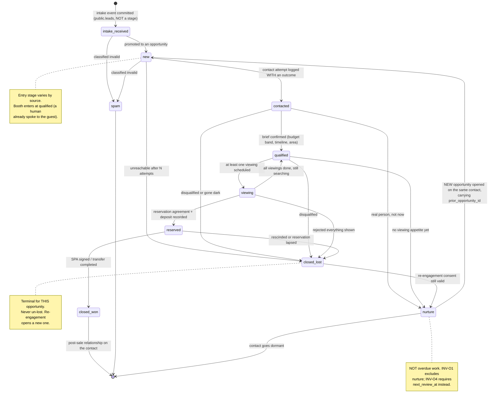

`closed_won` and `closed_lost` are terminal **for that opportunity**. A returning buyer gets a *new*
opportunity on the *same* contact. This is the whole reason D1 separates durable identity from episodic work: without
it, "reopen" means overwriting the history of the first deal. `[Recommendation]` `[Web research]`
https://developers.hubspot.com/docs/api-reference/latest/crm/objects/leads/guide

### 4.2 Transition table

`(A)` = advisor assigned to the opportunity, `(O)` = Owner, `(S)` = system/scheduled tick.
All timestamps are `timestamptz`. All events are rows in the append-only CRM event log — **not**
`audit_log`, whose writes are swallowed on failure (`recordAuditSafely`) and which therefore cannot be
an automation trigger. `[Repository fact]`

**Every stage entry is dated by a row in `crm_opportunity_stage_event` (§6.4.5), not by a per-stage
column on `crm_opportunity`.** `[Recommendation]` The "Where it is dated" column below names only
timestamps that exist in the DDL. Nine columns named `qualified_at`, `nurtured_at`, `reserved_at`,
`won_at`, `lost_at` and so on would be nine columns that drift out of agreement with the event log they
duplicate; the event log is the source of truth and the funnel metrics in §14.2 read it directly.

| From | To | Who may trigger | Precondition / validation | Where it is dated | Events emitted | Reversible? |
|---|---|---|---|---|---|---|
| — | `intake_received` | anon/system | Validation passes; intake row committed | `leads.created_at` (existing) | `enquiry.received` | No (append-only) |
| `intake_received` | `new` | S or (A) | Identity resolved; consent record exists; `next_action_at` set | `crm_opportunity.created_at` + a stage event `(NULL → new)` | `opportunity.opened`, `routing.decided` | No |
| `intake_received` | `spam` | (A)/(O) | Reason code required | stage event `(→ spam)` with `reason_code` | `enquiry.classified_spam` | Yes — reclassify; both events retained |
| `new` | `contacted` | (A) | **A contact attempt with a recorded outcome exists.** Opening a record is not contact | `crm_opportunity.first_response_at` (write-once) + stage event | `contact.attempted`, `sla.first_response_met` | No — `first_response_at` is never overwritten |
| `new` | `closed_lost` | (A)/(O) | `lost_reason_code` from the controlled vocabulary; ≥ N logged attempts for `no_response` | `crm_opportunity.closed_at` + stage event | `opportunity.lost` | Yes → `nurture` only |
| `contacted` | `qualified` | (A) | Required-to-advance fields present: budget band, timeline, area set. Registrant type set | stage event `(contacted → qualified)` | `stage.changed` | Yes → `contacted` (correction); the event is retained |
| `contacted` | `nurture` | (A) | `crm_opportunity.next_review_at` set (INV-O4); marketing consent state recorded | `crm_opportunity.next_review_at` + stage event | `stage.changed` | Yes |
| `qualified` | `viewing` | (A) | ≥ 1 `crm_viewing` in `scheduled` (see §4.4) | `crm_viewing.scheduled_at` + stage event | `viewing.scheduled`, `stage.changed` | Yes if the viewing is cancelled |
| `viewing` | `reserved` | (A) | Unit reference (`units(id)`) present; reservation date recorded; **commission attribution record created here, not at completion** | stage event `(→ reserved)`; `crm_client_registration.registered_at` when that table exists | `deal.reserved`, `attribution.registered` | Yes → `closed_lost` (rescinded) |
| `reserved` | `closed_won` | (O) | Completion evidence recorded | `crm_opportunity.closed_at` + stage event | `deal.won` | No — Owner-only correction, always audited |
| `reserved` | `closed_lost` | (A)/(O) | `lost_reason_code ∈ {rescinded, financing_or_transfer_blocked, project_unavailable}` | `crm_opportunity.closed_at` + stage event | `deal.lost` | Yes → `nurture` |
| any active | `closed_lost` | (O) | Reason required | `crm_opportunity.closed_at` + stage event | `opportunity.lost` | Yes → `nurture` |
| `closed_lost` | `nurture` | (A)/(O) | Re-engagement consent valid at the moment of transition; `next_review_at` set | `crm_opportunity.next_review_at` + stage event | `opportunity.reopened_as_nurture` | Yes |
| `nurture` | *(new opportunity)* | (A)/(O) | **A new opportunity row is created** with `prior_opportunity_id` set. The nurture record is not mutated back into `new` | the new row's `created_at` | `opportunity.opened` with `prior_opportunity_id` | n/a |
| any | *(reassigned)* | (O) | Assignment changes; **ownership does not** | `crm_assignment.assigned_at` (a new row) | `assignment.changed`, `routing.decided` | Yes |
| any | *(reclaimed)* | S | **No logged contact attempt within N hours** of assignment (activity-driven, not calendar-driven) | `crm_assignment.released_at` + a `crm_routing_log` row | `assignment.reclaimed` | Yes |

`[Recommendation]` Note the one transition that is **not** in this table: there is no `closed_lost → new`
and no "un-lost". §4.3 explains why, and INV-O5 records that a successor opportunity points backwards
rather than a predecessor being rewritten.

**On reclaim (D4) — this challenges an Owner-supplied requirement.** The Owner asked for a 21-day
ownership rule that returns a lead to the original agent on reactivation. Research found **no vendor
documentation and no industry-body standard** for it, and Follow Up Boss's own FAQ answers "can leads
auto-move to a Pond after X days?" with **no**. `[Web research]`
https://help.followupboss.com/hc/en-us/articles/360048829034-Lead-Ponds-Overview

The consequence of a calendar lock is a hoarding incentive: an agent who does nothing for twenty days
keeps the lead. The recommended alternative is Lofty's documented split —
**ownership is permanent credit; assignment is revocable work** — with reclaim driven by *activity*
(no logged contact attempt within N hours → returns to the pond).
`[Web research]` https://help.lofty.com/hc/en-us/articles/115003544406-Lead-Ownership

The 21-day rule is **not discarded**: it is implemented as a **configurable, versioned policy row** so
the Owner can retain it. The default is activity-driven. `[Recommendation]`

### 4.3 Lost reasons, reopen behaviour, audit

**Controlled vocabulary (proposed).** Free text is not a reason. Every value is stable, and
`other` requires a mandatory note. `[Recommendation]`

| Code | Meaning | Feeds back into |
|---|---|---|
| `price_above_budget` | Product fit; budget band was wrong or moved | Requirement: budget band |
| `location_mismatch` | Area rejected after seeing it | Requirement: area set |
| `product_mismatch` | Layout, size, floor, view, building quality | Requirement: attribute filters |
| `timeline_mismatch` | Completion date incompatible | Requirement: completion tolerance |
| `developer_rejected` | Buyer declined the developer specifically | Nothing automatic — advisor note |
| `project_unavailable` | Unit sold, released, project withdrawn | Inventory read, not a buyer signal |
| `financing_or_transfer_blocked` | Funds, remittance evidence, or transfer route failed | Process, not fit |
| `bought_elsewhere` | Purchased through another channel | Competitive signal |
| `no_response` | Went dark after ≥ N logged attempts | Requires the attempt count to be real |
| `not_a_buyer` | Research, press, student, vendor, job seeker | Should mostly be caught at intake |
| `duplicate` | Same human, other opportunity is canonical | Points at the surviving opportunity |
| `rescinded` | Reservation or SPA rescinded | Off-plan-specific; normal, not a failure |
| `other` | Anything else — **mandatory free-text note** | Reviewed monthly; a rising `other` count means the vocabulary is wrong |

**Reopen behaviour.** `[Recommendation]`

1. A `closed_lost` opportunity is **never un-lost.** Its `closed_at`, `lost_reason_code` and stage-event
   history are permanent.
2. Re-engagement moves it to `nurture` (the same contact, a dormant relationship, with a mandatory
   `next_review_at`) and, when real interest returns, opens a **new opportunity** carrying
   `prior_opportunity_id UUID REFERENCES crm_opportunity(id)` (§6.4.2).
3. Consequence: funnel arithmetic stays honest. A "reopened" deal cannot silently un-count a loss, and
   the second attempt is visibly a second attempt.
4. Correcting a *mistake* (wrong reason, wrong stage) is a distinct, Owner-only action that writes a
   correction event. It does not delete the original event.

**Audit requirements.** `[Recommendation]`

| Requirement | Detail |
|---|---|
| Every transition writes an event | Actor, from-state, to-state, reason, timestamp — in the **same transaction** as the state change |
| The CRM event log is the trigger substrate, not `audit_log` | `recordAuditSafely` swallows write failures, so `audit_log` cannot be relied on for anything that must not be missed. Anything that must not be missed needs a transactional outbox. `[Repository fact]` |
| Reads and exports are logged too, not just writes | Every PDPC enforcement case announced in Aug 2025 cited inadequate security measures. **Architecture research, not legal advice — [LAWYER]** `[Web research]` https://www.hsfkramer.com/notes/data/2025-posts/pdpa-fines-and-firsts-a-6-year-timeline-of-thailands-data-privacy-enforcement |
| Anonymisation must purge the audit history | Trigger-based audit rows store the exact PII in `old_record` — erasing the contact while leaving the audit trail is not erasure. `[Web research]` https://github.com/supabase/supa_audit |

### 4.4 Viewing sub-lifecycle

A viewing is its own entity with its own lifecycle, referenced by the opportunity. Collapsing it into
the opportunity stage loses the case that matters most: three viewings, two attended, one no-show.
`[Recommendation]` `[Web research]` https://helpcentre.iamproperty.com/hc/en-gb/articles/36400839368593-Viewing-and-Managing-Viewer-Feedback-for-a-Property-Viewing

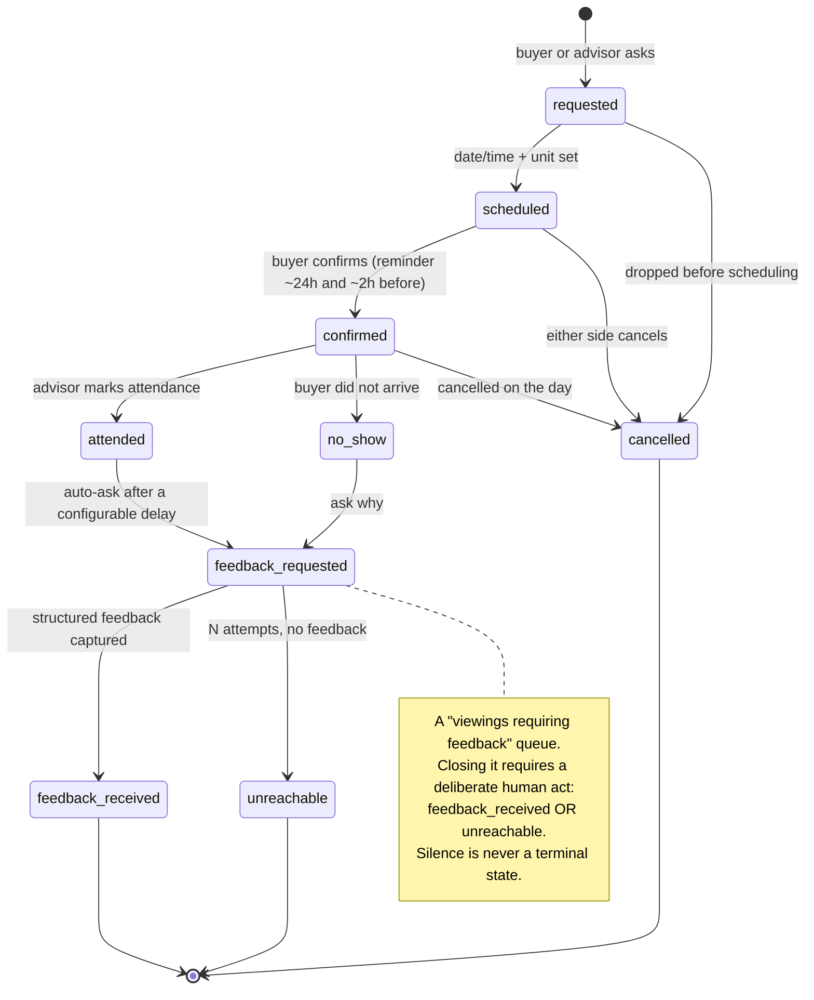

Two properties worth copying from the vendor evidence: `[Web research]`

- **Structured feedback, not a note**: ratings on location, value, layout, build quality and view, plus
  a decision field of `proceed | maybe | rejected` with a reason code drawn from the §4.3 vocabulary.
  Free text keeps nuance; the structured fields make feedback aggregatable across viewings.
  https://helpcentre.iamproperty.com/hc/en-gb/articles/36387556001553-Leaving-Viewing-Feedback-in-CRM
- **Private by default, promoted deliberately**: buyer feedback is often blunt. Internal-visible is the
  default; sharing with a developer is an explicit act by the advisor. This is the same
  internal-vs-client-visible boundary that gap **G-I** says is missing today.

Explicitly **not** built: automatic re-scoring of matches from feedback. No surveyed system documents
it, and it would be a covert scoring model — forbidden by D10. Rejection reason codes write back to the
**requirement** as an explicit human task ("too far from the beach" narrows the area set), never as a
hidden re-rank. `[Web research]` `[Recommendation]`

### 4.5 The `leads.status` conflict — a migration is required

**The two vocabularies genuinely disagree.** `[Repository fact]`

| Source | Vocabulary |
|---|---|
| `supabase/migrations/20260704132000_create_leads.sql:22-24` | `CHECK (status IN ('new','contacted','qualified','closed','spam'))` |
| `docs/ROADMAP.md:141` | `new → contacted → qualified → viewing → reserved → closed/lost` |

`viewing`, `reserved` and `lost` cannot be written today. The CHECK constraint would reject them, and
so would the RLS INSERT policy, which hard-requires `status = 'new'`
(`supabase/migrations/20260704132000_create_leads.sql:32-41`). This is not a documentation gap; it is a
constraint that must be altered by a migration before the roadmap funnel can exist in the database.
`[Repository fact]`

**But the fix is not "widen the CHECK on `leads`."** Per D1/D2: `[Recommendation]`

| Wrong fix | Why it is wrong |
|---|---|
| Add `viewing`, `reserved`, `lost` to `leads.status` | Puts *pipeline state* on an *intake event*. An intake event is a fact about a moment ("this form was submitted with these values"); a stage is a fact about an ongoing relationship. Mutating the intake row destroys the evidence of what the form actually received — which, for an evidence-led brokerage, is the one thing the table is genuinely good for |
| Same, plus assignment/notes/next-action columns | This is the accretion failure: a table where `status` means four different things depending on which code path last wrote it. `public.leads` currently has twelve columns and no read path; widening it does not fix the absence of an identity to hang off |
| Same, and mutate on every stage change | Two people enquiring twice produces two intake rows and there is no rule for which one carries "the" status |

**Correct shape.** `[Recommendation]`

- `public.leads` stays an **append-only intake event log**, keeps its shipped contract in v1 (D2), and
  gains a nullable `contact_id` FK.
- `leads.status` is retired to intake-triage semantics only (`new` / `spam`) — the values the intake
  path can legitimately assert. It is **not** the pipeline.
- The pipeline lives on the **CRM opportunity**, as `pipeline_key` plus the nine-value `stage` CHECK
  (§3.4, §6.4.2, CRM-ADR-11).
- The migration that relaxes the `leads` contract must be timestamped **strictly greater than
  `20260728160000`**, must not attempt to resolve the pre-existing `20260726120000` version collision,
  and must sequence after the open draft PRs that already touch `leads`. `[Repository fact]`

**The existing enum is dead vocabulary.** Every writer sets `status = 'new'`
(`src/lib/lead-service.ts:80-92`, and the Booth payload builder at
`src/features/navigator/core/lead.ts:116-131` maps onto the same contract), the RLS policy *requires*
`'new'` on insert, and there is no UPDATE policy, no RPC and no application code that ever transitions
it. `contacted`, `qualified`, `closed` and `spam` have never been written and cannot be. `[Repository fact]`

This is the cleanest possible evidence for the central claim of this architecture: **the problem with
Forever's CRM is not that the table is too narrow. It is that nothing reads it, nobody is told, and no
state ever changes.** Adding columns to a table nothing reads produces a wider table that nothing
reads. `[Inference]` `[Recommendation]`

---

## 5. Conceptual domain model

### 5.0 The model in one sentence

**A person is permanent; everything else that happens to them is an episode attached to that person.**

`[Recommendation]` Forever's CRM has exactly one identity spine (`crm_contact`), one dedup mechanism
(a UNIQUE index on normalized contact methods), one work object (`crm_opportunity`), and one timeline
(`crm_activity`). Every other concept in the brief is either an attribute of those four, a junction
between them, or explicitly rejected below.

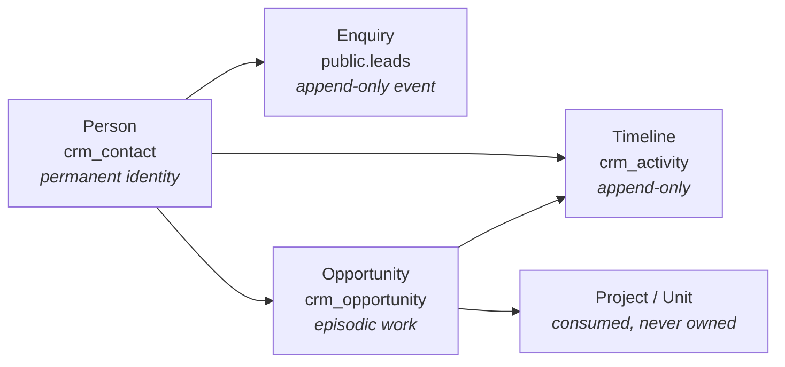

`[Repository fact]` This is the shape `docs/FOREVER_BRAIN_V1.md:288-328` already mandates: the CRM
may own leads, buyer profiles, advisor notes, follow-up state, buyer preferences, inquiry history and
deal workflow state; it must consume canonical project identity, unit availability and price history;
it must not own project, developer, location, unit-inventory, price-history, Passport or Intelligence
truth. Nothing in Part B invents a new boundary — it implements that one.

### 5.1 Concept adjudication

Every concept named in the assignment, resolved. **CORE-V1** = built in v1. **SHAPED** = designed here,
named here, but not created in v1 (so v1 does not have to be re-cut when it lands). **CONSUMED** = the
fact already exists elsewhere in Forever and the CRM references it by key. **REJECTED** = deliberately
not built, with the reason.

| Concept | Verdict | Resolution and rationale |
|---|---|---|
| **Person** | CORE-V1 `crm_contact` | `[Recommendation]` The one durable identity. Everything hangs off it. D1. |
| **Contact method** | CORE-V1 `crm_contact_method` | `[Recommendation]` Separate row per phone/email. `(kind, normalized_value)` UNIQUE **is** the dedup engine (§7). Not columns on the person — a person routinely has two phones. |
| **Household** | **REJECTED** | `[Web research]` Asserts a permanent grouping the business does not have. The same two people may be joint buyers on one unit and not on another; a household then needs its own lifecycle, merge and erasure semantics for zero gain. Joint buyers are deal-scoped: `crm_opportunity_party`. Closest official analogue is Salesforce's `AccountContactRelation` junction — a relationship *with a role*, not a container (https://developer.salesforce.com/docs/atlas.en-us.object_reference.meta/object_reference/sforce_api_objects_accountcontactrelation.htm). |
| **Organization / Company** | **REJECTED as a core object** | `[Web research]` Forever's buyers are overwhelmingly individuals. The organisations that matter are **developers**, which already exist as `public.developers` and belong to project truth, not to CRM identity. A generic Company object imports B2B assumptions (domain-based dedup, org hierarchy) that are wrong here. Revisit only if corporate/nominee purchases become routine — at that point the shape is `crm_contact.organisation_name` first, an object second. |
| **Lead (as an entity)** | **REJECTED** | `[Web research][Repository fact]` D1. HubSpot's own Leads object "must be associated with an existing contact" and is auto-deleted when its primary associations are removed (https://developers.hubspot.com/docs/api-reference/latest/crm/objects/leads/guide); Pipedrive: "A lead always has to be linked to a person or an organization or both" (https://developers.pipedrive.com/docs/api/v1/Leads); Attio has no Lead object at all (https://docs.attio.com/docs/objects-and-lists). Zoho ships a Lead Conversion Options API whose stated purpose is finding the duplicates its own lead model creates (https://www.zoho.com/crm/developer/docs/api/v8/convert-lead.html). We do not build a rival identity that must later be destructively converted. |
| **Enquiry / intake event** | CORE-V1 — **existing `public.leads`** | `[Repository fact]` D2. `public.leads` (`supabase/migrations/20260704132000_create_leads.sql:1-47`) becomes the append-only intake log with a nullable `contact_id`. It is the evidence of what the form actually received — valuable to an evidence-led brokerage — and it must keep working unchanged in v1 (§11). |
| **Client** | **REJECTED as a table** | `[Recommendation]` "Client" is a state of a person, not a different person. Derived from opportunity state, never hand-maintained. Two hand-maintained status fields that nobody reconciles is a documented anti-pattern. `[Repository fact]` A rival `ClientModel.lifecycleStage` enum exists at `src/features/navigator/domain/models/client.ts` and is marked `deprecate` by D9 — adopting it would create the second client system the mission forbids. |
| **Opportunity / Deal / Transaction** | CORE-V1 `crm_opportunity` (one object) | `[Recommendation]` Splitting "opportunity" from "deal" from "transaction" is three names for one row at three stages. One object with a `stage` column and a `pipeline_key` column reserved for a future second process. Simplicity is the product requirement. |
| **Assignment** | CORE-V1 columns, SHAPED tables | `[Web research]` D4: `owner_user_id` (permanent credit) and `assigned_user_id` (revocable work) are columns on `crm_opportunity`; Lofty documents exactly this split (https://help.lofty.com/hc/en-us/articles/115003544406-Lead-Ownership). `crm_assignment_offer` and `crm_routing_log` are SHAPED here and specified in Part C. |
| **Decision Profile** | **REJECTED as stored state** | `[Repository fact]` D10. `deriveDecisionProfile` is pure and deterministic (`src/features/navigator/core/decision-profile.ts:118-134`). Persisting the derivation creates a second source of truth that silently diverges from the code. Store answers; re-derive. §8. |
| **Interest / requirement** | CORE-V1 `crm_intent_snapshot` + opportunity FKs | `[Recommendation]` v1 models interest as (a) the Navigator answer keys and (b) a project/unit reference on the opportunity. A separate multi-brief "Requirement" object is SHAPED but not v1 — at Forever's volume one buyer has one live brief, and a second table would be empty. |
| **Shortlist** | **SHAPED, not v1** | `[Recommendation]` A shortlist is a set of (opportunity, unit) rows with an order. It is real, but it is a *sending* feature and there is no send capability. `[Repository fact]` No outbound email/SMS/WhatsApp provider exists anywhere in the repository. Building a shortlist before there is a way to deliver it produces a list nobody receives. |
| **Project** | CONSUMED — `projects(slug)` | `[Repository fact]` `leads.project_slug REFERENCES public.projects(slug) ON UPDATE CASCADE ON DELETE SET NULL` already exists (`supabase/migrations/20260704132000_create_leads.sql:10`). Slug is UNIQUE and is the CRM's project key. **Never persist a "Forever ID"** — two incompatible display formats exist for the same project. |
| **Unit** | CONSUMED — `units(id)` | `[Repository fact]` `public.units.id` UUID (`supabase/migrations/20260704055333_812d2f26-ad80-4807-b51a-bd3622cd5224.sql:78-79`) is stable across re-ingest. **Blocker:** there is no UNIQUE on `units(project_id, unit_code)` (§11.4). |
| **Activity** | CORE-V1 `crm_activity` | `[Recommendation]` One append-only table, channel enum + direction (§9.2). |
| **Message** | folded into `crm_activity` | `[Recommendation]` A message is an activity whose channel is a messenger. D6 forbids a WhatsApp-shaped schema; a separate message table would be exactly that. |
| **Note** | folded into `crm_activity` (`channel='note'`) | `[Recommendation]` A note is an activity with no counterparty. Separating them creates two timelines to merge in the UI. `[Repository fact]` The internal/guest-visible boundary is a real current defect — Booth's "internal" staff note lands in the same `leads.message` column as guest-visible content — so `crm_activity.visibility` is NOT NULL from day one. |
| **Task** | CORE-V1 `crm_task` | `[Recommendation]` The *future* half of the timeline: one row per intended next action, with `due_at`. Activity is what happened; task is what must happen. |
| **Appointment / Viewing** | folded into `crm_task` (`kind`) + `crm_activity` outcome | `[Recommendation]` A viewing is a task of kind `viewing` that resolves into an activity of channel `site_visit`. `[Web research]` Structured viewing feedback and a "viewings requiring feedback" queue are well-evidenced patterns (https://helpcentre.iamproperty.com/hc/en-gb/articles/36400839368593-Viewing-and-Managing-Viewer-Feedback-for-a-Property-Viewing) — SHAPED as `crm_viewing_feedback`, not v1. |
| **Reservation** | **SHAPED, not v1** | `[Web research]` The Thai off-plan sequence (reservation agreement → ~2% reservation deposit → SPA with ~30-day review → instalments) is dated milestones with amounts, not a stage string (https://www.fazwaz.com/advice/the-purchase-process-off-plan-vs-resale). Shaped as `crm_opportunity_milestone`; v1 records the stage and the money on the opportunity. Off-plan contract state machines with rescission and assignment are documented (https://knowledge.spark.re/contract-statuses) — adopt the vocabulary when the first real reservation exists, not before. |
| **Source / channel** | CORE-V1 `crm_intake_channel` lookup | `[Repository fact]` `leads.source` is unconstrained TEXT with five live values. §9.1 explains why a CHECK on `leads.source` is the wrong fix. |
| **Campaign** | **SHAPED, not v1** | `[Repository fact]` No UTM, referrer, click ID or session identifier is captured anywhere today, so a campaign dimension would be a table of NULLs. §9.1 defines the shape and the capture prerequisite. |
| **Consent** | CORE-V1 `crm_consent_record` | `[Owner requirement][Web research]` D8. Append-only evidential record, never a boolean. Shaped here (§6.4.3); the legal framing is Part D. **Architecture research, not legal advice.** |
| **Automation** | **REJECTED for v1** | `[Web research]` Building an automation engine before instrumenting anything is a documented failure mode; HubSpot's own re-enrolment docs describe records replaying every action from the start (https://knowledge.hubspot.com/workflows/add-re-enrollment-triggers-to-a-workflow). v1 ships the **outbox** (§9.3) that a later engine consumes. |
| **Referral** | **SHAPED, not v1** | `[Recommendation]` A referral is (a) an intake channel value and (b) an optional `referred_by_contact_id` self-FK on `crm_contact`. Both are cheap; neither justifies an object. Shaped as a nullable column so v1 does not block it. |
| **Commission attribution** | **SHAPED, not v1** | `[Web research]` Developer commission disputes are settled by who registered the client first, so the record that matters is a dated `crm_client_registration(developer_id, project_id, contact_id, registered_at, developer_reference)` created **at reservation, not at completion** (https://www.spark.re/product/inventory). `[Repository fact]` There is no reservation in the system yet and no commercial/payment capability of any kind — so v1 reserves the shape and does not build it. |
| **Lead score / fit % / ranking** | **REJECTED, permanently** | `[Repository fact]` `src/features/navigator/core/matching.ts:8-11` states as a hard NAV-001 §09 rule that no score, percentage, ranking or "best project" is ever computed or shown. A CRM score would be a new fabricated number in an evidence-led product. |

### 5.1a The canonical entity register — stated once, cited everywhere

`[Recommendation]` **This table is the single source of truth for CRM table names, tiers and DDL
ownership.** Every other section of this document — the ERD, the DDL blocks, the KPI table, the
wireframes, the ADRs and the slice scope — cites this register instead of restating a shape. If a name
appears anywhere in this document that is not in this register, the register is right and the other
occurrence is a defect.

Tier vocabulary:

| Tier | Meaning |
|---|---|
| **v1-slice1** | Created by the first vertical slice (§21.2). Five tables, and no more. |
| **v1-later** | Designed in full here with illustrative DDL, created in a slice after Slice 1. Not authorized. |
| **SHAPED** | Named and shaped so a later addition is a new table rather than a re-cut of the core. **No DDL, no columns fixed.** |
| **deferred** | Explicitly out of scope, recorded so it is not re-litigated (§20). |

| Table | Purpose (one line) | Tier | Section that owns its DDL |
|---|---|---|---|
| `crm_contact` | The durable person identity. Everything hangs off it. | v1-slice1 | §6.4.1 |
| `crm_contact_method` | One row per phone/email; `(kind, normalized_value)` UNIQUE **is** the dedup engine. | v1-slice1 | §6.4.1 |
| `crm_consent_record` | Append-only evidential consent, three-state (`granted`/`withdrawn`/`refused`). | v1-slice1 | **§16.3** (the only definition) |
| `crm_activity` | The append-only human timeline: channel + direction + outcome. | v1-slice1 | §6.4.4 |
| `crm_work_item` | The episodic unit of work: who owns it, who is assigned, what happens next, when we first responded. | v1-slice1 | §13.7 |
| `crm_opportunity` | The single episodic work object with a `stage`; **not in Slice 1** (§21.2). | v1-later | §6.4.2 |
| `crm_opportunity_party` | Joint buyers, deal-scoped and role-bearing. There is no households table. | v1-later | §6.4.2 |
| `crm_opportunity_stage_event` | Append-only stage-transition log; the source of every funnel metric. | v1-later | §6.4.5 |
| `crm_task` | The forward half of the timeline: one intended next action with a `due_at`. | v1-later | §6.4.4 |
| `crm_intent_snapshot` | Navigator answers as enum keys plus the snapshotted match reasons. Never a DecisionProfile. | v1-later | §6.4.4 |
| `crm_policy` | Versioned SLA/reclaim policy rows, so a policy change cannot rewrite history. | v1-later | §6.4.5 |
| `crm_assignment` | One row per assignment, carrying `assigned_at`, `acknowledged_at` and the policy version in force. | v1-later | §6.4.5 |
| `crm_routing_log` | Why a routing decision went the way it did — the record D4 promises. | v1-later | §6.4.5 |
| `crm_viewing` | The viewing sub-lifecycle (§4.4) as its own row, not a stage string. | v1-later | §6.4.5 |
| `crm_intake_channel` | Controlled source vocabulary as **data**, never a CHECK on `leads.source`. | v1-later | §9.1 |
| `crm_intake_channel_alias` | Maps raw `leads.source` strings onto the vocabulary; the unmapped case resolves to `unmapped`. | v1-later | §9.1 |
| `crm_outbox` | The transactional outbox. Anything that must not be lost goes here, never `audit_log`. | v1-later | **§9.3** (the only definition) |
| `crm_inbound_event` | Raw inbound webhook landing table: verify signature, INSERT, return 200. | v1-later | §12.9 |
| `crm_merge_log` | The audited record of a tombstone-and-repoint merge, with the loser's snapshot. | v1-later | §7.4 |
| `crm_suppression` | Keyed-hash suppression that outlives erasure. | v1-later | **§16.8** (the only definition) |
| `crm_dsr_request` | Data-subject requests with a generated 30-day due date. Deadline-bound (14 Sep 2026). | v1-later | §16.8 |
| `crm_privacy_notice_version` | The exact notice wording, per locale, that a consent row points at. | v1-later | §16.3 |
| `crm_processing_purpose` | The per-purpose retention and lawful-basis register. | v1-later | §16.6 |
| `crm_opportunity_milestone` | Dated reservation/SPA/instalment milestones with amounts. Needs a real reservation first. | SHAPED | — (§5.1) |
| `crm_opportunity_attribution` | The influence claim behind a North Star transaction. | SHAPED | — (§14.3 B7) |
| `crm_opportunity_shortlist` | An ordered set of (opportunity, unit) rows. A *sending* feature with no send capability. | SHAPED | — (§5.1) |
| `crm_client_registration` | Dated developer registration, created **at reservation**, for commission disputes. | SHAPED | — (§14.3 B7) |
| `crm_viewing_feedback` | Structured post-viewing feedback. Needs viewings first. | SHAPED | — (§4.4) |
| `crm_campaign` | The campaign dimension. **Prerequisite: UTM/referrer capture**, which does not exist. | SHAPED | — (§9.1) |
| `crm_assignment_offer` | Round-robin offer/decline/fallback. | SHAPED | — (§5.1) |
| `crm_sequence_enrolment` | Sequence state. Cannot exist before a send channel exists. | SHAPED | — (§13.4) |
| `crm_data_transfer_register` | One row per processor/vendor: role, data, region, transfer mechanism. Populated before signing, not after. | SHAPED | — (§16.9) |
| `crm_export` | One row per export leaving the app, with actor, row count and reason. | SHAPED | — (§15.8) |
| `public.leads` | **Existing.** The append-only intake event log; gains a nullable `contact_id` only. | v1-slice1 (one additive column) | §11.1 |

`[Recommendation]` Three names that appear in the older drafts and are **not** entities: `crm_note`
(folded into `crm_activity` with `channel='note'`), `crm_pipeline`/`crm_pipeline_stage` (one pipeline is
configured; `pipeline_key` is a column), and `crm_dup_candidates` (a query, not a table).

### 5.2 The four rejections that matter most

`[Recommendation]` If a reviewer reads only one paragraph of Part B, read this one.

1. **No separate Lead entity.** The industry's own API contracts converged on durable person + episodic
   work item; the two vendors that kept destructive conversion ship tooling to clean up the duplicates it
   creates. `[Repository fact]` This also satisfies `docs/ROADMAP.md:144` ("use the existing Supabase lead
   boundary … before buying or building a large CRM"): `public.leads` is kept, demoted to an intake log,
   and never accreted into a CRM.
2. **No households table.** Joint ownership is a property of a *deal*, not of a *family*.
3. **No Company core object.** Developers already exist; a generic Company object is B2B scar tissue.
4. **No score.** Not a lead score, not a fit percentage, not a "hotness" flag. The Navigator's own rules
   forbid it and the CRM inherits that constraint.

---

## 6. Logical data model

### 6.1 Naming: the `crm_` prefix

`[Repository fact]` The repository already namespaces subsystems by table prefix: `studio_members`,
`studio_upload_jobs`, `studio_listing_contacts`, `studio_object_owners`, `forever_import` /
`forever_execution`, and PR #102's `booth_*` namespace. `[Recommendation]` The CRM therefore takes
`crm_`. Three reasons, in order of importance:

| Reason | Consequence |
|---|---|
| A name collision with an open PR is a merge conflict in production schema, not in a file | `[Repository fact]` D-brief §"Do not claim any name in the `booth_*` namespace" — PR #102's pilot migration is already applied to a dedicated staging project. `crm_` collides with nothing on `main` or in any open PR. |
| A grep for `crm_` must return the whole subsystem | Enables the security review "every CRM table has RLS on and no policies" to be executed as one query. |
| The prefix is the blast-radius marker | Any migration touching `crm_*` is additive-only by construction; any migration touching an unprefixed table is a shared-surface change requiring Owner review. |

`[Recommendation]` One exception, deliberate: **`public.leads` keeps its name.** Renaming it would break
the shipped anon INSERT contract and the source-text test that pins it (D2).

### 6.2 Entity–relationship diagram

`[Recommendation]` Solid v1 core, plus the SHAPED entities marked so that adding them later is a new
table and not a re-cut of the core. Only entities with **no fixed columns** carry a `zz_deferred` marker;
everything with a DDL block in §6.4, §9.1, §9.3, §13.7, §16.3 or §16.8 shows its real attributes.
**Tiers are in the canonical entity register (§5.1a), not in this diagram** — the diagram shows shape,
the register shows when.

```mermaid
erDiagram
  crm_contact ||--o{ crm_contact_method : "has"
  crm_contact ||--o{ crm_consent_record : "granted"
  crm_contact ||--o{ leads : "resolved from"
  crm_contact ||--o{ crm_opportunity_party : "party to"
  crm_contact ||--o{ crm_activity : "subject of"
  crm_contact ||--o{ crm_intent_snapshot : "answered"
  crm_contact ||--o| crm_contact : "merged_into"
  crm_contact ||--o| crm_contact : "referred_by"

  crm_opportunity ||--o{ crm_opportunity_party : "has parties"
  crm_opportunity ||--o{ crm_activity : "about"
  crm_opportunity ||--o{ crm_task : "next actions"
  crm_opportunity ||--o{ crm_intent_snapshot : "captured for"
  crm_opportunity ||--o{ crm_opportunity_stage_event : "stage history"
  crm_opportunity ||--o{ crm_viewing : "viewings"
  crm_opportunity ||--o| crm_opportunity : "prior_opportunity"

  crm_work_item ||--o{ crm_assignment : "assigned via"
  crm_work_item ||--o{ crm_routing_log : "routing decisions"
  crm_policy ||--o{ crm_assignment : "version in force"
  crm_policy ||--o{ crm_opportunity_stage_event : "version in force"

  leads ||--o| crm_opportunity : "promoted to"
  crm_merge_log }o--|| crm_contact : "survivor"
  crm_outbox }o--o| crm_opportunity : "emitted by"

  projects ||--o{ crm_opportunity : "interest in"
  units ||--o{ crm_opportunity : "unit interest"
  units ||--o{ crm_viewing : "unit viewed"
  studio_members ||--o{ crm_opportunity : "owner (RESTRICT) / assignee (SET NULL)"
  studio_members ||--o{ crm_assignment : "assigned to"
  studio_members ||--o{ crm_routing_log : "chosen"

  crm_intake_channel ||--o{ leads : "classifies"
  crm_intake_channel ||--o{ crm_opportunity : "classifies"

  crm_contact {
    uuid id PK
    text display_name
    text family_name
    text given_name
    text preferred_locale
    uuid referred_by_contact_id FK
    text first_intake_channel_key FK "write-once"
    timestamptz first_seen_at "write-once"
    uuid merged_into_id FK
    timestamptz pii_erased_at
    timestamptz created_at
    timestamptz updated_at
  }
  crm_contact_method {
    uuid id PK
    uuid contact_id FK
    text kind "phone|email|other"
    text raw_value
    text normalized_value UK "UNIQUE(kind,normalized_value)"
    text match_hint
    text_array channels "whatsapp|telegram|line"
    boolean is_primary
    boolean normalization_flagged
  }
  crm_consent_record {
    uuid id PK
    uuid contact_id FK
    text purpose_key
    text lawful_basis
    boolean granted
    text notice_version
    text locale
    text method
    uuid supersedes_id FK
    timestamptz recorded_at
  }
  crm_opportunity {
    uuid id PK
    text stage "new|contacted|qualified|viewing|reserved|nurture|spam|closed_won|closed_lost"
    text pipeline_key
    uuid owner_user_id FK "studio_members.user_id - RESTRICT - permanent credit"
    text owner_display_name "write-once snapshot"
    uuid assigned_user_id FK "studio_members.user_id - SET NULL - revocable work"
    uuid prior_opportunity_id FK "re-engagement predecessor"
    text project_slug FK
    uuid unit_id FK
    text intake_channel_key FK
    bigint quoted_amount_minor
    char quoted_currency
    numeric quoted_fx_rate
    date quoted_fx_rate_date
    timestamptz first_response_at
    timestamptz next_action_at
    timestamptz next_review_at "nurture only - INV-O4"
    timestamptz closed_at
  }
  crm_opportunity_party {
    uuid opportunity_id PK_FK
    uuid contact_id PK_FK
    text role "buyer|co_buyer|advisor|representative"
    boolean is_primary
  }
  crm_activity {
    uuid id PK
    uuid contact_id FK
    uuid merged_from_contact_id FK "set by merge repointing"
    uuid opportunity_id FK
    text channel "whatsapp|telegram|line|phone|email|meeting|note|site_visit"
    text direction "inbound|outbound|internal"
    text visibility "internal|client_shareable"
    text summary
    timestamptz occurred_at
    text idempotency_key UK
  }
  crm_task {
    uuid id PK
    uuid opportunity_id FK
    text kind "follow_up|viewing|appointment|document"
    timestamptz due_at
    timestamptz completed_at
    uuid resolved_activity_id FK
  }
  crm_intent_snapshot {
    uuid id PK
    uuid contact_id FK
    uuid opportunity_id FK
    uuid lead_id FK
    jsonb navigator_answers "ENUM KEYS ONLY"
    boolean profile_is_complete
    jsonb match_reasons "with project_slug"
    timestamptz evaluated_at
    text content_fingerprint UK
  }
  crm_outbox {
    uuid id PK
    text event_type
    jsonb payload
    text idempotency_key UK
    timestamptz created_at
    timestamptz consumed_at
  }
  crm_merge_log {
    uuid id PK
    uuid surviving_contact_id FK
    uuid merged_contact_id FK
    jsonb loser_snapshot
    jsonb repointed_counts
    timestamptz merged_at
  }
  crm_suppression {
    bytea identifier_hash PK "keyed HMAC - survives erasure"
    text identifier_kind
    text reason
    timestamptz suppressed_at
    uuid source_dsr_id FK
  }
  crm_intake_channel {
    text channel_key PK
    text label
    boolean is_active
  }
  leads {
    uuid id PK
    uuid contact_id FK "NEW, nullable"
    text provenance_tier "NEW"
    text name "concatenated - lossy"
    text email
    text phone
    text source
    text project_slug FK
    text status
  }
  crm_opportunity_stage_event {
    uuid id PK
    uuid opportunity_id FK
    text from_stage
    text to_stage
    text reason_code
    uuid actor_user_id FK
    text policy_key
    int policy_version
    timestamptz occurred_at
    text idempotency_key UK
  }
  crm_policy {
    uuid id PK
    text policy_key
    int version
    jsonb settings
    timestamptz effective_from
    timestamptz superseded_at
  }
  crm_assignment {
    uuid id PK
    uuid work_item_id FK
    uuid assigned_user_id FK
    timestamptz assigned_at
    timestamptz acknowledged_at
    timestamptz first_response_at
    timestamptz released_at
    text release_reason
    int policy_version
  }
  crm_routing_log {
    uuid id PK
    uuid work_item_id FK
    timestamptz decided_at
    text rule_key
    uuid_array candidate_user_ids
    uuid chosen_user_id FK
    text outcome
    text reason_code
  }
  crm_viewing {
    uuid id PK
    uuid opportunity_id FK
    uuid unit_id FK
    text state "requested..feedback_received"
    timestamptz scheduled_at
    timestamptz attended_at
    text outcome_decision
    text outcome_reason_code
  }
  crm_work_item {
    uuid id PK
    text kind
    text subject_table
    uuid subject_id
    uuid owner_user_id FK
    uuid assigned_user_id FK
    timestamptz next_action_at
    text next_action_note
    timestamptz first_response_at
    timestamptz due_at
    text status
    text dedupe_key UK
  }
  crm_assignment_offer {
    text zz_deferred "SHAPED - offer/decline/fallback"
  }
  crm_campaign {
    text zz_deferred "SHAPED - needs UTM capture first"
  }
  crm_opportunity_milestone {
    text zz_deferred "SHAPED - needs a real reservation first"
  }
  crm_client_registration {
    text zz_deferred "SHAPED - commission attribution"
  }
  crm_viewing_feedback {
    text zz_deferred "SHAPED - needs viewings first"
  }
  crm_dsr_request {
    text zz_deferred "SHAPED - Part D, deadline-bound"
  }
```

`[Repository fact]` `projects`, `units`, `studio_members` and `leads` in this diagram are **existing**
tables. The CRM references them; it never writes project, unit or developer facts.

### 6.3 Identity rules: natural vs surrogate

| Rule | Statement | Why |
|---|---|---|
| **R-ID-1** | Every CRM table has a surrogate `uuid PRIMARY KEY DEFAULT gen_random_uuid()`. | `[Repository fact]` House convention across all 24 migrations. |
| **R-ID-2** | Every natural key is expressed as a **UNIQUE constraint or index**, never as an application rule. | `[Web research]` The `(kind, normalized_value)` UNIQUE index is the dedup engine (§7). A rule in TypeScript holds only for the code path that remembers it. |
| **R-ID-3** | Any column participating in a UNIQUE identity index is `NOT NULL`. | `[Web research]` PostgreSQL: nulls in unique columns are not considered equal by default, so a nullable identity column silently permits unlimited duplicates (https://www.postgresql.org/docs/current/indexes-unique.html). |
| **R-ID-4** | External identity is by the *other* subsystem's key: `projects(slug)`, `units(id)`, `developers(id)`. **Staff identity is `public.studio_members(user_id)`, never `auth.users(id)` directly.** | `[Repository fact]` `leads.project_slug` already does this with `ON UPDATE CASCADE`. `studio_members.user_id` is itself `ON DELETE CASCADE` to `auth.users` (`supabase/migrations/20260721120000_forever_studio_v1.sql:84`), so a CRM reference straight to `auth.users` inherits a deletion an ordinary offboarding triggers — see R-ID-8. |
| **R-ID-8** | A staff reference that carries **credit** is `ON DELETE RESTRICT` **and** is accompanied by a write-once display-name snapshot. A staff reference that carries only **attribution of an act** is `ON DELETE SET NULL`. | `[Recommendation]` Deactivation is `studio_members.is_active = false`, never a row delete, so `RESTRICT` should never fire in normal operation — it exists so that if it *would* fire, someone finds out. The snapshot is the belt: a document record of who earned the credit that survives every FK route failing. |
| **R-ID-5** | **Never persist a Forever display ID.** | `[Repository fact]` Two incompatible formats exist for the same project (`FOREVER-<SLUG>` vs the bare slug). Persist slug or UUID; derive display. |
| **R-ID-6** | `crm_opportunity_party` uses the **composite natural key** `(opportunity_id, contact_id)` as its PK. | `[Recommendation]` It is a junction; a surrogate would permit the same person twice on one deal. This choice has a direct consequence for merge (§7.5). |
| **R-ID-7** | Idempotency keys are `NOT NULL UNIQUE` on `crm_activity` and `crm_outbox`; content fingerprints are `sha256` hex with a `CHECK (~ '^[0-9a-f]{64}$')`. | `[Repository fact]` Exactly the `ingestion_batches` convention (`supabase/migrations/20260718113000_progressive_ingestion_v1.sql:373-382`). |

### 6.4 Illustrative DDL

> **Every SQL block in this document is ILLUSTRATIVE DDL — not a migration.** No file in
> `supabase/migrations/` is created, modified or implied by this document. Nothing here is authorized,
> applied, or scheduled. Version numbers shown are placeholders and are discussed in §11.3.

House conventions reproduced below and verifiable in the repository: `BEGIN;`/`COMMIT;` wrapper; a header
comment stating purpose/task/additive classification/safety boundary/DOWN reasoning
(`supabase/migrations/20260721120000_forever_studio_v1.sql:1-50`); `ENABLE ROW LEVEL SECURITY` with **no
policies**; `REVOKE ALL … FROM PUBLIC, anon, authenticated` then `GRANT ALL … TO service_role`
(`supabase/migrations/20260721123000_studio_internal_acl_hardening.sql:6-12`) — **but see §6.4.6: for
append-only tables that house convention is not sufficient and `service_role` must be in the `REVOKE`
list too**; `SET search_path = ''` on
functions (`supabase/migrations/20260722103000_studio_object_authorization.sql:35`); `set_updated_at()`
triggers (`supabase/migrations/20260704055333_812d2f26-ad80-4807-b51a-bd3622cd5224.sql:3-11`).

`[Repository fact][Recommendation]` **One honest inconsistency to record:** the shared
`public.set_updated_at()` helper is declared `SET search_path = public`
(`…20260704055333…:6`), while every function written since RC5.5D uses `SET search_path = ''`. Reusing
the shared helper (as D3 requires) means inheriting that older setting. Do **not** silently redefine the
shared helper in a CRM migration — seven existing tables depend on it. Record it as a separate hardening
item with its own task ID.

#### 6.4.1 Identity spine

```sql
-- ILLUSTRATIVE — NOT A MIGRATION. Reference DDL for FOREVER-CRM-ARCH-001 §6.4.1.
-- ============================================================================
-- PURPOSE: the canonical CRM person identity and the deduplication engine.
-- TASK: FOREVER-CRM-ARCH-001 (documentation only; A0 propose-only).
-- CLASSIFICATION: PURELY ADDITIVE. Creates new crm_* objects only. Touches no
--   existing table, no existing policy, no existing grant, no existing row.
-- SAFETY BOUNDARY: RLS ENABLED with NO POLICIES on every table below.
--   Authorization is enforced at the app-server boundary
--   (createServerFn -> requireSupabaseAuth -> CRM membership -> safe-error
--   envelope), never in the browser. No auth.uid() appears anywhere.
-- DOWN REASONING: these objects are new and hold no relocated data, so a DOWN
--   is a straight DROP in reverse dependency order — UNLESS rows exist, in
--   which case dropping crm_contact destroys funnel history that cannot be
--   reconstructed. Treat DOWN as reference only, exactly as the Studio
--   migration header does.
-- ============================================================================
BEGIN;

CREATE TABLE IF NOT EXISTS public.crm_contact (
  id                    UUID PRIMARY KEY DEFAULT gen_random_uuid(),
  given_name            TEXT,
  family_name           TEXT,
  display_name          TEXT NOT NULL,
  preferred_locale      TEXT CHECK (preferred_locale IN ('en','ru','th','zh')),
  country_code          CHAR(2),
  referred_by_contact_id UUID REFERENCES public.crm_contact(id) ON DELETE SET NULL,
  -- FIRST-TOUCH attribution (§9.1). Write-once at creation, never updated.
  -- It has to be a column on the spine because first-touch is by definition
  -- unknowable retroactively — every contact created before this column
  -- exists has a permanently unknowable first touch.
  first_intake_channel_key TEXT REFERENCES public.crm_intake_channel(channel_key),
  first_seen_at         TIMESTAMPTZ NOT NULL DEFAULT now(),
  -- Merge tombstone: the loser row survives forever with a forward pointer.
  merged_into_id        UUID REFERENCES public.crm_contact(id) ON DELETE RESTRICT,
  merged_at             TIMESTAMPTZ,
  -- Erasure marker. Anonymize in place; never DELETE (see §10).
  pii_erased_at         TIMESTAMPTZ,
  created_at            TIMESTAMPTZ NOT NULL DEFAULT now(),
  updated_at            TIMESTAMPTZ NOT NULL DEFAULT now(),
  CONSTRAINT crm_contact_display_name_not_empty
    CHECK (length(btrim(display_name)) > 0),
  CONSTRAINT crm_contact_merge_pair_complete
    CHECK ((merged_into_id IS NULL) = (merged_at IS NULL)),
  CONSTRAINT crm_contact_no_self_merge
    CHECK (merged_into_id IS NULL OR merged_into_id <> id)
);
COMMENT ON TABLE public.crm_contact IS
  'Canonical CRM person identity. RLS on with no policies; internal-only.';

REVOKE ALL ON TABLE public.crm_contact FROM PUBLIC, anon, authenticated;
GRANT ALL ON TABLE public.crm_contact TO service_role;
ALTER TABLE public.crm_contact ENABLE ROW LEVEL SECURITY;

CREATE TRIGGER trg_crm_contact_updated_at
  BEFORE UPDATE ON public.crm_contact
  FOR EACH ROW EXECUTE FUNCTION public.set_updated_at();

-- Live contacts only: a merged loser must never appear in a list.
CREATE INDEX IF NOT EXISTS idx_crm_contact_live
  ON public.crm_contact(created_at DESC) WHERE merged_into_id IS NULL;

-- ---------------------------------------------------------------------------
-- THE DEDUPLICATION ENGINE.
-- normalized_value is written by TypeScript (libphonenumber-js / lower+trim),
-- NEVER by a generated column: E.164 conversion is not immutable and needs a
-- default-region context, which a generation expression may not reference.
-- ---------------------------------------------------------------------------
CREATE TABLE IF NOT EXISTS public.crm_contact_method (
  id                     UUID PRIMARY KEY DEFAULT gen_random_uuid(),
  contact_id             UUID NOT NULL
                           REFERENCES public.crm_contact(id) ON DELETE CASCADE,
  kind                   TEXT NOT NULL CHECK (kind IN ('phone','email','other')),
  raw_value              TEXT NOT NULL,   -- exactly what the human typed
  normalized_value       TEXT NOT NULL,   -- E.164, or lower(trim(email))
  -- Non-authoritative dedup hint only (gmail dot/plus form). NEVER a match key.
  match_hint             TEXT,
  -- WhatsApp/Telegram/LINE are CAPABILITIES OF A PHONE, not identifier kinds.
  channels               TEXT[] NOT NULL DEFAULT '{}',
  is_primary             BOOLEAN NOT NULL DEFAULT false,
  -- TRUE when libphonenumber could not validate. Stored and flagged, NEVER
  -- rejected: genuinely working numbers fail validation.
  normalization_flagged  BOOLEAN NOT NULL DEFAULT false,
  verified_at            TIMESTAMPTZ,
  created_at             TIMESTAMPTZ NOT NULL DEFAULT now(),
  updated_at             TIMESTAMPTZ NOT NULL DEFAULT now(),
  CONSTRAINT crm_contact_method_normalized_not_empty
    CHECK (length(btrim(normalized_value)) > 0),
  CONSTRAINT crm_contact_method_channels_known
    CHECK (channels <@ ARRAY['whatsapp','telegram','line','sms']::TEXT[]),
  CONSTRAINT crm_contact_method_channels_phone_only
    CHECK (kind = 'phone' OR cardinality(channels) = 0)
);

-- >>> This single index IS the deduplication system. <<<
CREATE UNIQUE INDEX IF NOT EXISTS uq_crm_contact_method_identity
  ON public.crm_contact_method(kind, normalized_value);

-- At most one primary method per (contact, kind).
CREATE UNIQUE INDEX IF NOT EXISTS uq_crm_contact_method_primary
  ON public.crm_contact_method(contact_id, kind) WHERE is_primary;

CREATE INDEX IF NOT EXISTS idx_crm_contact_method_contact
  ON public.crm_contact_method(contact_id);

REVOKE ALL ON TABLE public.crm_contact_method FROM PUBLIC, anon, authenticated;
GRANT ALL ON TABLE public.crm_contact_method TO service_role;
ALTER TABLE public.crm_contact_method ENABLE ROW LEVEL SECURITY;

CREATE TRIGGER trg_crm_contact_method_updated_at
  BEFORE UPDATE ON public.crm_contact_method
  FOR EACH ROW EXECUTE FUNCTION public.set_updated_at();

COMMIT;
```

#### 6.4.2 Work object, parties and the money model

```sql
-- ILLUSTRATIVE — NOT A MIGRATION. Reference DDL for FOREVER-CRM-ARCH-001 §6.4.2.
-- PURPOSE: the single episodic work object, its parties, and CRM-owned money.
-- CLASSIFICATION: PURELY ADDITIVE.
-- SAFETY BOUNDARY: RLS on, no policies, service_role only. No auth.uid().
-- DOWN REASONING: DROP in reverse dependency order; destroys funnel history if
--   rows exist. Reference only.
BEGIN;

CREATE TABLE IF NOT EXISTS public.crm_opportunity (
  id                    UUID PRIMARY KEY DEFAULT gen_random_uuid(),

  -- Process. One pipeline is configured. The column exists so a second process
  -- does not require re-cutting this table — but adding a STAGE is still a
  -- migration, because the stage list is the CHECK below (CRM-ADR-11).
  pipeline_key          TEXT NOT NULL DEFAULT 'offplan_advisory',
  -- The stage vocabulary IS the state machine in §4.1. 'nurture' and 'spam'
  -- are not optional: without 'nurture' the only way to clear a warm-but-slow
  -- buyer off an agent's overdue list is 'closed_lost', and the entire warm
  -- pipeline gets recorded as lost within a quarter.
  stage                 TEXT NOT NULL DEFAULT 'new'
                          CHECK (stage IN ('new','contacted','qualified',
                                           'viewing','reserved','nurture',
                                           'spam','closed_won','closed_lost')),
  lost_reason_code      TEXT,

  -- A nurture record is parked, not abandoned: it carries a review date
  -- instead of a next action. See INV-O1 and INV-O4.
  next_review_at        TIMESTAMPTZ,
  -- A re-engaged buyer gets a NEW opportunity that points back at the old one.
  -- Nothing is ever un-lost (§4.3).
  prior_opportunity_id  UUID REFERENCES public.crm_opportunity(id)
                          ON DELETE SET NULL,

  -- D4: ownership is permanent credit; assignment is revocable work.
  -- R6: both point at public.studio_members(user_id), NOT auth.users. An
  -- ordinary offboarding deletes the auth user, and studio_members.user_id is
  -- ON DELETE CASCADE to auth.users
  -- (supabase/migrations/20260721120000_forever_studio_v1.sql:84) — so an
  -- ON DELETE SET NULL here would silently erase permanent credit during
  -- routine offboarding. Deactivation is is_active = false, never a row delete.
  owner_user_id         UUID REFERENCES public.studio_members(user_id)
                          ON DELETE RESTRICT,
  -- Write-once snapshot: even if every FK route later fails, the document
  -- record of who earned the credit survives.
  owner_display_name    TEXT NOT NULL,
  assigned_user_id      UUID REFERENCES public.studio_members(user_id)
                          ON DELETE SET NULL,

  -- Interest, by FK to project truth. The CRM never copies a project fact.
  project_slug          TEXT REFERENCES public.projects(slug)
                          ON UPDATE CASCADE ON DELETE SET NULL,
  unit_id               UUID REFERENCES public.units(id) ON DELETE SET NULL,

  -- Attribution (§9.1). Controlled vocabulary by FK, not a free string.
  intake_channel_key    TEXT REFERENCES public.crm_intake_channel(channel_key),
  brand                 TEXT NOT NULL DEFAULT 'forever'
                          CHECK (brand IN ('forever','sunthai')),

  -- MONEY: what FOREVER QUOTED. This is a CRM-owned fact, not project price
  -- truth. Amounts are integer minor units; THB minor unit is satang (1/100).
  quoted_amount_minor   BIGINT,
  quoted_currency       CHAR(3),
  quoted_fx_rate        NUMERIC(20,10),   -- 1 quoted_fx_base = N quoted_currency
  quoted_fx_base        CHAR(3),
  quoted_fx_rate_date   DATE,
  quoted_at             TIMESTAMPTZ,

  -- SLA measurement. Stored timestamps, not derived UI text.
  first_response_at     TIMESTAMPTZ,
  next_action_at        TIMESTAMPTZ,
  closed_at             TIMESTAMPTZ,
  created_at            TIMESTAMPTZ NOT NULL DEFAULT now(),
  updated_at            TIMESTAMPTZ NOT NULL DEFAULT now(),

  -- INV-M1: a money amount is meaningless without its currency.
  CONSTRAINT crm_opportunity_money_pair
    CHECK ((quoted_amount_minor IS NULL) = (quoted_currency IS NULL)),
  -- INV-M2: a cross-currency quote must carry a reproducible rate.
  CONSTRAINT crm_opportunity_fx_complete
    CHECK (
      quoted_currency IS NULL
      OR quoted_currency = 'THB'
      OR (quoted_fx_rate IS NOT NULL
          AND quoted_fx_base IS NOT NULL
          AND quoted_fx_rate_date IS NOT NULL)
    ),
  CONSTRAINT crm_opportunity_currency_shape
    CHECK (quoted_currency IS NULL OR quoted_currency ~ '^[A-Z]{3}$'),
  -- INV-O1: an ACTIVE opportunity must always carry an explicit next action.
  -- 'nurture' and 'spam' are excluded because neither is active work; nurture
  -- carries next_review_at instead (INV-O4).
  CONSTRAINT crm_opportunity_open_needs_next_action
    CHECK (stage IN ('closed_won','closed_lost','nurture','spam')
           OR next_action_at IS NOT NULL),
  -- INV-O4: parked is not the same as forgotten. A nurture row must name the
  -- date somebody looks at it again.
  CONSTRAINT crm_opportunity_nurture_needs_review
    CHECK (stage <> 'nurture' OR next_review_at IS NOT NULL),
  -- INV-O2: closed means dated.
  CONSTRAINT crm_opportunity_closed_is_dated
    CHECK ((stage IN ('closed_won','closed_lost')) = (closed_at IS NOT NULL)),
  -- INV-O3: a lost deal states why, from a controlled list.
  CONSTRAINT crm_opportunity_lost_has_reason
    CHECK (stage <> 'closed_lost' OR lost_reason_code IS NOT NULL),
  -- INV-O5: an opportunity never points at itself as its predecessor.
  CONSTRAINT crm_opportunity_prior_not_self
    CHECK (prior_opportunity_id IS NULL OR prior_opportunity_id <> id)
);

REVOKE ALL ON TABLE public.crm_opportunity FROM PUBLIC, anon, authenticated;
GRANT ALL ON TABLE public.crm_opportunity TO service_role;
ALTER TABLE public.crm_opportunity ENABLE ROW LEVEL SECURITY;

CREATE TRIGGER trg_crm_opportunity_updated_at
  BEFORE UPDATE ON public.crm_opportunity
  FOR EACH ROW EXECUTE FUNCTION public.set_updated_at();

CREATE INDEX IF NOT EXISTS idx_crm_opportunity_assigned_open
  ON public.crm_opportunity(assigned_user_id, next_action_at)
  WHERE stage NOT IN ('closed_won','closed_lost','nurture','spam');
-- The nurture review queue is a SEPARATE queue with a separate clock. If it
-- shares the overdue list, agents clear it with 'closed_lost' (§4.1).
CREATE INDEX IF NOT EXISTS idx_crm_opportunity_nurture_due
  ON public.crm_opportunity(next_review_at)
  WHERE stage = 'nurture';
CREATE INDEX IF NOT EXISTS idx_crm_opportunity_prior
  ON public.crm_opportunity(prior_opportunity_id)
  WHERE prior_opportunity_id IS NOT NULL;
CREATE INDEX IF NOT EXISTS idx_crm_opportunity_project
  ON public.crm_opportunity(project_slug);
CREATE INDEX IF NOT EXISTS idx_crm_opportunity_unit
  ON public.crm_opportunity(unit_id);

-- ---------------------------------------------------------------------------
-- JOINT BUYERS. Deal-scoped, role-bearing. There is NO households table.
-- ON DELETE RESTRICT on contact_id is deliberate: it makes hard-deleting a
-- contact impossible while any deal references them (see §10).
-- ---------------------------------------------------------------------------
CREATE TABLE IF NOT EXISTS public.crm_opportunity_party (
  opportunity_id UUID NOT NULL
                   REFERENCES public.crm_opportunity(id) ON DELETE CASCADE,
  contact_id     UUID NOT NULL
                   REFERENCES public.crm_contact(id) ON DELETE RESTRICT,
  role           TEXT NOT NULL DEFAULT 'buyer'
                   CHECK (role IN ('buyer','co_buyer','advisor',
                                   'representative','referrer')),
  is_primary     BOOLEAN NOT NULL DEFAULT false,
  added_at       TIMESTAMPTZ NOT NULL DEFAULT now(),
  PRIMARY KEY (opportunity_id, contact_id)     -- see R-ID-6 and §7.5
);

-- INV-P1: exactly one primary party per opportunity.
CREATE UNIQUE INDEX IF NOT EXISTS uq_crm_opportunity_party_primary
  ON public.crm_opportunity_party(opportunity_id) WHERE is_primary;
CREATE INDEX IF NOT EXISTS idx_crm_opportunity_party_contact
  ON public.crm_opportunity_party(contact_id);

REVOKE ALL ON TABLE public.crm_opportunity_party FROM PUBLIC, anon, authenticated;
GRANT ALL ON TABLE public.crm_opportunity_party TO service_role;
ALTER TABLE public.crm_opportunity_party ENABLE ROW LEVEL SECURITY;

COMMIT;
```

##### Why permanent credit needs `studio_members`, `RESTRICT` and a name snapshot

`[Repository fact][Recommendation]` D4's whole bargain with agents is: *assignment is revocable, credit is
permanent.* An earlier draft wrote `owner_user_id UUID REFERENCES auth.users(id) ON DELETE SET NULL`,
which silently breaks that bargain during **ordinary offboarding**:

| Step | What happens | Evidence |
|---|---|---|
| An agent leaves and their Auth user is deleted | `studio_members.user_id` is `ON DELETE CASCADE` to `auth.users`, so the membership row goes too | `[Repository fact]` `supabase/migrations/20260721120000_forever_studio_v1.sql:84` |
| `owner_user_id` was `REFERENCES auth.users(id) ON DELETE SET NULL` | Every opportunity that agent ever owned is silently set to `NULL` | `[Inference]` This is not an edge case; it is the routine path |
| Result | The permanent credit D4 promised is gone, and no error was raised | `[Inference]` A promise that fails quietly is worse than one that was never made |

Three changes, all in the DDL above:

1. **Point at `public.studio_members(user_id)`, not `auth.users(id)`** — CRM staff identity is Studio
   membership (CRM-ADR-15), so the FK should say so.
2. **`ON DELETE RESTRICT` on `owner_user_id`** — deleting an owner is now an error someone has to look
   at, not a silent data loss. `assigned_user_id` stays `ON DELETE SET NULL`, because assignment is
   *supposed* to be revocable.
3. **`owner_display_name TEXT NOT NULL`, stamped at creation and never updated** — the belt to the FK's
   braces. Write-once is enforced at the server boundary and by a test, **not** by a constraint;
   `[Recommendation]` a `BEFORE UPDATE` trigger raising on a changed `owner_display_name` is the cheap
   database-level option if the boundary proves insufficient, and it should be added the first time a
   name is observed to change.

`[Recommendation]` **The operational rule this depends on, stated so it cannot be forgotten:
deactivating a member is `studio_members.is_active = false`. It is never a row delete, and it is never an
`auth.users` delete.** If that rule is broken, `RESTRICT` turns offboarding into a support incident —
which is the intended failure mode, and vastly better than losing the record of who earned a commission.

##### Why money is a schema decision, not a display concern

`[Web research][Recommendation]` No examined real-estate CRM (Spark, Follow Up Boss, Lofty) documents
multi-currency support; they are North-America-centric. Forever quotes THB to buyers who think in USD,
EUR and RUB. Four consequences make this structural:

| Failure if money is a single `numeric` + a display formatter | Structural fix |
|---|---|
| A quote cannot be reproduced. "We quoted 12,500,000 THB" means nothing six months later if the client remembers "$350k" and the rate has moved 9%. | Store `(amount_minor, currency)` **and** `(fx_rate, fx_base, fx_rate_date)` captured at quote time. `CHECK crm_opportunity_fx_complete` makes an unreproducible cross-currency quote impossible to insert. |
| Floating point silently loses satang across instalment schedules. | `BIGINT` minor units. THB's minor unit is satang (1/100). No float ever touches money. |
| A currency-less number gets summed across currencies in a dashboard. | `CHECK crm_opportunity_money_pair` — amount and currency are inseparable. Any aggregation must `GROUP BY currency` or it will not compile against the data. |
| Retrofitting currency later requires guessing what old rows meant. | It is three columns now and an archaeology project later. |

`[Repository fact]` **This is CRM-owned money only.** `units.base_price_thb NUMERIC(14,2)` remains the
project-truth price and the CRM never copies it. The CRM records what Forever *quoted*, which is a CRM
fact under the `FOREVER_BRAIN_V1.md:288-328` boundary. `[Repository fact]` It also does **not** unlock
Navigator budget matching: `NAV001_BUDGET_CURRENCY='USD'`
(`src/features/navigator/core/decision-profile.ts:48`) versus
`PROJECT_PRICE_CURRENCY='THB'` (`src/features/navigator/core/matching.ts:25`) is refused by design, and
a CRM fx_rate is a *sales* rate, not a canonical normalization. Wiring it into the matcher would be
inventing an exchange rate the Navigator deliberately refuses to invent.

#### 6.4.3 Consent — defined once, in §16.3

`[Recommendation]` **`crm_consent_record` has exactly one definition and it is in §16.3.** An earlier
draft carried a second, incompatible `CREATE TABLE` here with a two-state `granted BOOLEAN` instead of
the three-state `state IN ('granted','withdrawn','refused')`. The two cannot both be right, and the
boolean is the wrong one: it cannot distinguish *"this person refused"* from *"we never asked"*, which is
the distinction that proves consent was lawfully obtained rather than merely absent. The three-state
version survives; this one is deleted rather than reconciled.

What the shape must carry, so the reader does not have to jump to check: `contact_id`, `purpose_key`
(plain `TEXT` in v1 — the FK to `crm_processing_purpose` is deferred until that table exists),
`state`, `lawful_basis`, a pointer to the exact `crm_privacy_notice_version` shown, `locale`, `method`,
`occurred_at`, and a `supersedes` pointer. See §16.3 for the DDL and §6.4.6 for the grants.

`[Recommendation]` **Architect challenge, recorded, not acted on:** granting `service_role` only
`INSERT, SELECT` diverges from the house `GRANT ALL … TO service_role` pattern. That divergence is the
point — it is what makes append-only real rather than aspirational. It has a cost: a genuine erasure
obligation may need to redact this table, and the migration that does so must grant `UPDATE` for one
transaction and revoke it again. State that explicitly in the erasure runbook (§10.4).
`[Repository fact]` `marketing` consent is a **separate `purpose_key` row** from `service` consent and
defaults to absent (no row = no consent), never a bundled boolean. Legal framing: Part D. **[LAWYER]**

#### 6.4.4 Timeline, tasks and buyer intent

```sql
-- ILLUSTRATIVE — NOT A MIGRATION. Reference DDL for FOREVER-CRM-ARCH-001 §6.4.4.
-- PURPOSE: one append-only activity timeline, one forward-looking task table,
--   and the Navigator intent snapshot.
-- CLASSIFICATION: PURELY ADDITIVE.
-- SAFETY BOUNDARY: RLS on, no policies, service_role only.
-- DOWN REASONING: reference only; DROP destroys the interaction history that
--   the CRM's entire operational value rests on.
BEGIN;

CREATE TABLE IF NOT EXISTS public.crm_activity (
  id              UUID PRIMARY KEY DEFAULT gen_random_uuid(),
  contact_id      UUID REFERENCES public.crm_contact(id) ON DELETE RESTRICT,
  -- Set when a merge repoints this row (§7.4). Its presence is what makes the
  -- one permitted mutation of an append-only table visible after the fact.
  merged_from_contact_id UUID REFERENCES public.crm_contact(id) ON DELETE RESTRICT,
  -- RESTRICT, not SET NULL: an activity whose ONLY subject is the opportunity
  -- would fail crm_activity_has_subject the moment the opportunity is deleted,
  -- aborting the DELETE with an error that names the wrong table. Consistent
  -- with §10: opportunities are closed, never deleted.
  opportunity_id  UUID REFERENCES public.crm_opportunity(id) ON DELETE RESTRICT,
  channel         TEXT NOT NULL
                    CHECK (channel IN ('whatsapp','telegram','line','phone',
                                       'email','meeting','note','site_visit')),
  direction       TEXT NOT NULL
                    CHECK (direction IN ('inbound','outbound','internal')),
  -- The booth 'internal' note currently lands in the same column as guest
  -- content. This column exists so that defect cannot be reproduced.
  visibility      TEXT NOT NULL DEFAULT 'internal'
                    CHECK (visibility IN ('internal','client_shareable')),
  summary         TEXT NOT NULL,
  outcome_code    TEXT,
  actor_user_id   UUID REFERENCES public.studio_members(user_id) ON DELETE SET NULL,
  occurred_at     TIMESTAMPTZ NOT NULL,
  recorded_at     TIMESTAMPTZ NOT NULL DEFAULT now(),
  idempotency_key TEXT NOT NULL,
  CONSTRAINT crm_activity_has_subject
    CHECK (contact_id IS NOT NULL OR opportunity_id IS NOT NULL),
  CONSTRAINT crm_activity_note_is_internal_direction
    CHECK (channel <> 'note' OR direction = 'internal'),
  CONSTRAINT crm_activity_summary_not_empty
    CHECK (length(btrim(summary)) > 0),
  CONSTRAINT crm_activity_merge_source_differs
    CHECK (merged_from_contact_id IS NULL
           OR merged_from_contact_id IS DISTINCT FROM contact_id)
);

CREATE UNIQUE INDEX IF NOT EXISTS uq_crm_activity_idempotency
  ON public.crm_activity(idempotency_key);
CREATE INDEX IF NOT EXISTS idx_crm_activity_contact_time
  ON public.crm_activity(contact_id, occurred_at DESC);
CREATE INDEX IF NOT EXISTS idx_crm_activity_opportunity_time
  ON public.crm_activity(opportunity_id, occurred_at DESC);

-- APPEND-ONLY. service_role is in the REVOKE list because service_role is the
-- only role the application uses; omitting it makes the guarantee vacuous
-- (§6.4.6).
REVOKE ALL ON TABLE public.crm_activity
  FROM PUBLIC, anon, authenticated, service_role;
GRANT INSERT, SELECT ON TABLE public.crm_activity TO service_role;
-- The ONE permitted mutation: merge repointing (§7.4). Column-scoped, so the
-- summary, channel, occurred_at and idempotency_key remain immutable. If the
-- merge is instead implemented as a SECURITY DEFINER function, drop this GRANT
-- and let the function own the write.
GRANT UPDATE (contact_id, merged_from_contact_id)
  ON TABLE public.crm_activity TO service_role;
ALTER TABLE public.crm_activity ENABLE ROW LEVEL SECURITY;

-- ---------------------------------------------------------------------------
CREATE TABLE IF NOT EXISTS public.crm_task (
  id                  UUID PRIMARY KEY DEFAULT gen_random_uuid(),
  opportunity_id      UUID NOT NULL
                        REFERENCES public.crm_opportunity(id) ON DELETE CASCADE,
  kind                TEXT NOT NULL
                        CHECK (kind IN ('follow_up','viewing','appointment',
                                        'document','feedback_request')),
  title               TEXT NOT NULL,
  due_at              TIMESTAMPTZ NOT NULL,
  assigned_user_id    UUID REFERENCES public.studio_members(user_id) ON DELETE SET NULL,
  completed_at        TIMESTAMPTZ,
  cancelled_at        TIMESTAMPTZ,
  -- What actually happened. A completed task points at its evidence.
  resolved_activity_id UUID REFERENCES public.crm_activity(id),
  created_at          TIMESTAMPTZ NOT NULL DEFAULT now(),
  updated_at          TIMESTAMPTZ NOT NULL DEFAULT now(),
  CONSTRAINT crm_task_not_both_terminal
    CHECK (completed_at IS NULL OR cancelled_at IS NULL),
  -- INV-T1: completion requires evidence.
  CONSTRAINT crm_task_completed_has_evidence
    CHECK (completed_at IS NULL OR resolved_activity_id IS NOT NULL)
);

CREATE INDEX IF NOT EXISTS idx_crm_task_open_due
  ON public.crm_task(due_at)
  WHERE completed_at IS NULL AND cancelled_at IS NULL;

REVOKE ALL ON TABLE public.crm_task FROM PUBLIC, anon, authenticated;
GRANT ALL ON TABLE public.crm_task TO service_role;
ALTER TABLE public.crm_task ENABLE ROW LEVEL SECURITY;

CREATE TRIGGER trg_crm_task_updated_at
  BEFORE UPDATE ON public.crm_task
  FOR EACH ROW EXECUTE FUNCTION public.set_updated_at();

-- ---------------------------------------------------------------------------
-- BUYER INTENT. Answers only. The DecisionProfile is NEVER stored (§8).
-- ---------------------------------------------------------------------------
CREATE TABLE IF NOT EXISTS public.crm_intent_snapshot (
  id                    UUID PRIMARY KEY DEFAULT gen_random_uuid(),
  contact_id            UUID REFERENCES public.crm_contact(id) ON DELETE RESTRICT,
  opportunity_id        UUID REFERENCES public.crm_opportunity(id) ON DELETE SET NULL,
  lead_id               UUID REFERENCES public.leads(id) ON DELETE SET NULL,

  -- NavigatorAnswers, ENUM KEYS ONLY. Arrays order-preserved. No labels.
  navigator_answers     JSONB NOT NULL,
  answers_schema_version TEXT NOT NULL DEFAULT 'nav001.v1',
  -- Stored because an incomplete profile yields boilerplate that must never
  -- reach a client.
  profile_is_complete   BOOLEAN NOT NULL,

  -- MatchReason[] snapshot, each entry carrying its project slug. Expected to
  -- be an EMPTY ARRAY in production today — that is correct, not a bug (§8.3).
  match_reasons         JSONB NOT NULL DEFAULT '[]'::jsonb,
  match_evaluated_at    TIMESTAMPTZ,
  catalogue_size        INTEGER,

  content_fingerprint   TEXT NOT NULL CHECK (content_fingerprint ~ '^[0-9a-f]{64}$'),
  captured_at           TIMESTAMPTZ NOT NULL DEFAULT now(),
  CONSTRAINT crm_intent_answers_is_object
    CHECK (jsonb_typeof(navigator_answers) = 'object'),
  CONSTRAINT crm_intent_reasons_is_array
    CHECK (jsonb_typeof(match_reasons) = 'array'),
  -- INV-I1: a reason set without an evaluation timestamp is unauditable.
  CONSTRAINT crm_intent_reasons_dated
    CHECK (match_reasons = '[]'::jsonb OR match_evaluated_at IS NOT NULL),
  -- INV-I2: no derived numbers. budgetCeiling, scores and labels are banned.
  CONSTRAINT crm_intent_no_derived_ceiling
    CHECK (NOT (navigator_answers ? 'budgetCeiling')),
  CONSTRAINT crm_intent_no_score
    CHECK (NOT (navigator_answers ? 'score')
           AND NOT (navigator_answers ? 'fitPercentage'))
);

-- SCOPED, not global. The Navigator answer space is small and closed
-- (src/features/navigator/core/questions.ts:14-55: 6 motivations, 6 goals,
-- 6 budget bands, 4 timelines, 6 concerns), so two unrelated buyers WILL
-- produce the same fingerprint. A global unique would reject the second
-- buyer's enquiry outright. This mirrors the cited precedent, which is also
-- scoped: ingestion_batches UNIQUE (project_id, batch_fingerprint).
CREATE UNIQUE INDEX IF NOT EXISTS uq_crm_intent_fingerprint
  ON public.crm_intent_snapshot(contact_id, content_fingerprint)
  WHERE contact_id IS NOT NULL;
-- Pre-resolution rows have no contact yet; scope those to the lead.
CREATE UNIQUE INDEX IF NOT EXISTS uq_crm_intent_fingerprint_lead
  ON public.crm_intent_snapshot(lead_id, content_fingerprint)
  WHERE contact_id IS NULL AND lead_id IS NOT NULL;
CREATE INDEX IF NOT EXISTS idx_crm_intent_contact
  ON public.crm_intent_snapshot(contact_id, captured_at DESC);

-- APPEND-ONLY, including against service_role (§6.4.6).
REVOKE ALL ON TABLE public.crm_intent_snapshot
  FROM PUBLIC, anon, authenticated, service_role;
GRANT INSERT, SELECT ON TABLE public.crm_intent_snapshot TO service_role;
-- Merge repointing only (§7.4). The answers themselves are immutable.
GRANT UPDATE (contact_id) ON TABLE public.crm_intent_snapshot TO service_role;
ALTER TABLE public.crm_intent_snapshot ENABLE ROW LEVEL SECURITY;

COMMIT;
```

#### 6.4.5 Stage events, policy, assignment, routing and viewings

`[Recommendation]` These five tables were referenced as mandatory throughout this document and were never
defined. Without them **six of the twenty-one KPIs in §14.2 are uncomputable** (M03, M06, M11, M14, M17,
M19) and the routing log that D4 promises does not exist. They are `v1-later` in the register (§5.1a) —
none of them is in Slice 1 — but a metric may not be published against a table that has no shape.

```sql
-- ILLUSTRATIVE — NOT A MIGRATION. Reference DDL for FOREVER-CRM-ARCH-001 §6.4.5.
-- PURPOSE: the append-only stage-event log, versioned policy, the assignment
--   record, the routing decision log, and the viewing sub-lifecycle.
-- CLASSIFICATION: PURELY ADDITIVE. New crm_* objects only.
-- SAFETY BOUNDARY: RLS on, no policies. No auth.uid(). Two of these tables are
--   append-only and their GRANTs say so (§6.4.6).
-- DOWN REASONING: reference only. Dropping crm_opportunity_stage_event
--   destroys every funnel metric in §14.2 and it cannot be reconstructed.
BEGIN;

-- ---------------------------------------------------------------------------
-- STAGE EVENTS. The source of truth for every funnel number. Append-only:
-- rewriting history is exactly the failure this table exists to prevent.
-- ---------------------------------------------------------------------------
CREATE TABLE IF NOT EXISTS public.crm_opportunity_stage_event (
  id              UUID PRIMARY KEY DEFAULT gen_random_uuid(),
  opportunity_id  UUID NOT NULL
                    REFERENCES public.crm_opportunity(id) ON DELETE RESTRICT,
  -- NULL from_stage = the opening event.
  from_stage      TEXT,
  to_stage        TEXT NOT NULL
                    CHECK (to_stage IN ('new','contacted','qualified',
                                        'viewing','reserved','nurture',
                                        'spam','closed_won','closed_lost')),
  reason_code     TEXT,          -- §4.3 vocabulary on a transition to closed_lost
  note            TEXT,          -- mandatory when reason_code = 'other'
  actor_user_id   UUID REFERENCES public.studio_members(user_id) ON DELETE SET NULL,
  -- The policy in force AT THE MOMENT, so a later policy edit cannot rewrite
  -- whether this transition breached an SLA (§14.3 B6).
  policy_key      TEXT,
  policy_version  INTEGER,
  occurred_at     TIMESTAMPTZ NOT NULL DEFAULT now(),
  recorded_at     TIMESTAMPTZ NOT NULL DEFAULT now(),
  idempotency_key TEXT NOT NULL,
  CONSTRAINT crm_stage_event_moves
    CHECK (from_stage IS NULL OR from_stage <> to_stage),
  CONSTRAINT crm_stage_event_other_has_note
    CHECK (reason_code IS DISTINCT FROM 'other' OR length(btrim(note)) > 0)
);
CREATE UNIQUE INDEX IF NOT EXISTS uq_crm_stage_event_idempotency
  ON public.crm_opportunity_stage_event(idempotency_key);
CREATE INDEX IF NOT EXISTS idx_crm_stage_event_opportunity
  ON public.crm_opportunity_stage_event(opportunity_id, occurred_at DESC);
-- The funnel query reads this index, not a scan.
CREATE INDEX IF NOT EXISTS idx_crm_stage_event_to_stage_time
  ON public.crm_opportunity_stage_event(to_stage, occurred_at);

-- APPEND-ONLY. service_role is revoked FIRST, then narrowly re-granted (§6.4.6).
REVOKE ALL ON TABLE public.crm_opportunity_stage_event
  FROM PUBLIC, anon, authenticated, service_role;
GRANT INSERT, SELECT ON TABLE public.crm_opportunity_stage_event TO service_role;
ALTER TABLE public.crm_opportunity_stage_event ENABLE ROW LEVEL SECURITY;

-- ---------------------------------------------------------------------------
-- POLICY. SLA targets, reclaim windows and the 21-day rule (D4/OD-1) are ROWS,
-- never constants in UI copy or in code. A policy is versioned and never
-- edited in place: a change is a new version with a new effective_from.
-- ---------------------------------------------------------------------------
CREATE TABLE IF NOT EXISTS public.crm_policy (
  id              UUID PRIMARY KEY DEFAULT gen_random_uuid(),
  policy_key      TEXT NOT NULL
                    CHECK (policy_key IN ('first_response_sla',
                                          'acknowledgement_sla',
                                          'reclaim_window',
                                          'ownership_retention',
                                          'nurture_review_interval')),
  version         INTEGER NOT NULL CHECK (version > 0),
  -- Shape is per policy_key and validated at the server boundary, not by a
  -- jsonb schema constraint. Example: {"mode":"activity","hours":4}.
  settings        JSONB NOT NULL,
  effective_from  TIMESTAMPTZ NOT NULL,
  superseded_at   TIMESTAMPTZ,
  created_by      UUID REFERENCES public.studio_members(user_id) ON DELETE SET NULL,
  created_at      TIMESTAMPTZ NOT NULL DEFAULT now(),
  CONSTRAINT crm_policy_settings_is_object
    CHECK (jsonb_typeof(settings) = 'object'),
  CONSTRAINT crm_policy_version_unique UNIQUE (policy_key, version)
);
-- At most one live version per policy_key.
CREATE UNIQUE INDEX IF NOT EXISTS uq_crm_policy_live
  ON public.crm_policy(policy_key) WHERE superseded_at IS NULL;

REVOKE ALL ON TABLE public.crm_policy FROM PUBLIC, anon, authenticated;
GRANT ALL ON TABLE public.crm_policy TO service_role;
ALTER TABLE public.crm_policy ENABLE ROW LEVEL SECURITY;

-- ---------------------------------------------------------------------------
-- ASSIGNMENT. One row per assignment of a work item to a person. This is the
-- history; the CURRENT assignee is crm_work_item.assigned_user_id (§13.7).
-- Ownership is NOT here: ownership is permanent credit and lives on the record
-- itself with an ON DELETE RESTRICT reference and a name snapshot (D4/R6).
-- ---------------------------------------------------------------------------
CREATE TABLE IF NOT EXISTS public.crm_assignment (
  id                UUID PRIMARY KEY DEFAULT gen_random_uuid(),
  work_item_id      UUID NOT NULL
                      REFERENCES public.crm_work_item(id) ON DELETE CASCADE,
  assigned_user_id  UUID NOT NULL
                      REFERENCES public.studio_members(user_id) ON DELETE RESTRICT,
  assigned_by       UUID REFERENCES public.studio_members(user_id) ON DELETE SET NULL,
  assigned_at       TIMESTAMPTZ NOT NULL DEFAULT now(),
  -- The two SLA clocks. Both are stored timestamps, never derived UI text.
  acknowledged_at   TIMESTAMPTZ,
  first_response_at TIMESTAMPTZ,
  released_at       TIMESTAMPTZ,
  release_reason    TEXT CHECK (release_reason IN ('reclaimed_no_activity',
                                                   'manual_reassignment',
                                                   'declined','completed')),
  -- B6: the policy in force AT ASSIGNMENT, so changing the target from 2 to 5
  -- minutes cannot retroactively erase past breaches.
  policy_key        TEXT,
  policy_version    INTEGER,
  CONSTRAINT crm_assignment_release_pair
    CHECK ((released_at IS NULL) = (release_reason IS NULL)),
  CONSTRAINT crm_assignment_ack_after_assign
    CHECK (acknowledged_at IS NULL OR acknowledged_at >= assigned_at)
);
-- At most one live assignment per work item.
CREATE UNIQUE INDEX IF NOT EXISTS uq_crm_assignment_live
  ON public.crm_assignment(work_item_id) WHERE released_at IS NULL;
CREATE INDEX IF NOT EXISTS idx_crm_assignment_user_open
  ON public.crm_assignment(assigned_user_id, assigned_at DESC)
  WHERE released_at IS NULL;
-- Unacknowledged work, for the escalation sweeper.
CREATE INDEX IF NOT EXISTS idx_crm_assignment_unacknowledged
  ON public.crm_assignment(assigned_at)
  WHERE acknowledged_at IS NULL AND released_at IS NULL;

REVOKE ALL ON TABLE public.crm_assignment FROM PUBLIC, anon, authenticated;
GRANT ALL ON TABLE public.crm_assignment TO service_role;
ALTER TABLE public.crm_assignment ENABLE ROW LEVEL SECURITY;

-- ---------------------------------------------------------------------------
-- ROUTING LOG. Why a routing decision went the way it did. D4 promises this
-- record; without the table the promise is unbacked. Append-only: the value of
-- a routing log is entirely that it was not edited afterwards.
-- ---------------------------------------------------------------------------
CREATE TABLE IF NOT EXISTS public.crm_routing_log (
  id                UUID PRIMARY KEY DEFAULT gen_random_uuid(),
  work_item_id      UUID NOT NULL
                      REFERENCES public.crm_work_item(id) ON DELETE CASCADE,
  decided_at        TIMESTAMPTZ NOT NULL DEFAULT now(),
  rule_key          TEXT NOT NULL,        -- which rule fired
  policy_key        TEXT,
  policy_version    INTEGER,
  -- The candidates CONSIDERED, not just the winner. "Why not me?" is the
  -- question a routing log has to be able to answer.
  candidate_user_ids UUID[] NOT NULL DEFAULT '{}',
  chosen_user_id    UUID REFERENCES public.studio_members(user_id) ON DELETE SET NULL,
  outcome           TEXT NOT NULL
                      CHECK (outcome IN ('assigned','no_candidate',
                                         'fallback_to_pond','reclaimed',
                                         'manual_override')),
  reason_code       TEXT NOT NULL,
  detail            JSONB NOT NULL DEFAULT '{}'::jsonb,  -- keys only, no PII
  CONSTRAINT crm_routing_log_assigned_has_user
    CHECK (outcome <> 'assigned' OR chosen_user_id IS NOT NULL)
);
CREATE INDEX IF NOT EXISTS idx_crm_routing_log_work_item
  ON public.crm_routing_log(work_item_id, decided_at DESC);

-- APPEND-ONLY (§6.4.6).
REVOKE ALL ON TABLE public.crm_routing_log
  FROM PUBLIC, anon, authenticated, service_role;
GRANT INSERT, SELECT ON TABLE public.crm_routing_log TO service_role;
ALTER TABLE public.crm_routing_log ENABLE ROW LEVEL SECURITY;

-- ---------------------------------------------------------------------------
-- VIEWINGS. Its own row with its own lifecycle (§4.4). Collapsing it into the
-- opportunity stage loses the case that matters most: three viewings, two
-- attended, one no-show.
-- ---------------------------------------------------------------------------
CREATE TABLE IF NOT EXISTS public.crm_viewing (
  id                    UUID PRIMARY KEY DEFAULT gen_random_uuid(),
  opportunity_id        UUID NOT NULL
                          REFERENCES public.crm_opportunity(id) ON DELETE CASCADE,
  unit_id               UUID REFERENCES public.units(id) ON DELETE SET NULL,
  project_slug          TEXT REFERENCES public.projects(slug)
                          ON UPDATE CASCADE ON DELETE SET NULL,
  state                 TEXT NOT NULL DEFAULT 'requested'
                          CHECK (state IN ('requested','scheduled','confirmed',
                                           'attended','no_show','cancelled',
                                           'feedback_requested',
                                           'feedback_received','unreachable')),
  requested_at          TIMESTAMPTZ NOT NULL DEFAULT now(),
  scheduled_at          TIMESTAMPTZ,
  confirmed_at          TIMESTAMPTZ,
  attended_at           TIMESTAMPTZ,
  no_show_at            TIMESTAMPTZ,
  cancelled_at          TIMESTAMPTZ,
  cancelled_by          TEXT CHECK (cancelled_by IN ('buyer','forever','developer')),
  feedback_requested_at TIMESTAMPTZ,
  -- The OUTCOME, not free text. AD4 counts viewings without one.
  outcome_decision      TEXT CHECK (outcome_decision IN ('proceed','maybe','rejected')),
  outcome_reason_code   TEXT,          -- drawn from the §4.3 vocabulary
  attending_user_id     UUID REFERENCES public.studio_members(user_id) ON DELETE SET NULL,
  created_at            TIMESTAMPTZ NOT NULL DEFAULT now(),
  updated_at            TIMESTAMPTZ NOT NULL DEFAULT now(),
  -- A scheduled viewing has a time. Silence is never a terminal state (§4.4).
  CONSTRAINT crm_viewing_scheduled_is_dated
    CHECK (state NOT IN ('scheduled','confirmed','attended','no_show')
           OR scheduled_at IS NOT NULL),
  CONSTRAINT crm_viewing_attended_is_dated
    CHECK ((state = 'attended') <= (attended_at IS NOT NULL)),
  CONSTRAINT crm_viewing_cancelled_pair
    CHECK ((state = 'cancelled') <= (cancelled_at IS NOT NULL))
);
CREATE INDEX IF NOT EXISTS idx_crm_viewing_opportunity
  ON public.crm_viewing(opportunity_id, requested_at DESC);
CREATE INDEX IF NOT EXISTS idx_crm_viewing_upcoming
  ON public.crm_viewing(scheduled_at)
  WHERE state IN ('scheduled','confirmed');
-- The "viewings requiring feedback" queue (§4.4, AD4).
CREATE INDEX IF NOT EXISTS idx_crm_viewing_awaiting_feedback
  ON public.crm_viewing(attended_at)
  WHERE state IN ('attended','no_show','feedback_requested');

REVOKE ALL ON TABLE public.crm_viewing FROM PUBLIC, anon, authenticated;
GRANT ALL ON TABLE public.crm_viewing TO service_role;
ALTER TABLE public.crm_viewing ENABLE ROW LEVEL SECURITY;

CREATE TRIGGER trg_crm_viewing_updated_at
  BEFORE UPDATE ON public.crm_viewing
  FOR EACH ROW EXECUTE FUNCTION public.set_updated_at();

COMMIT;
```

`[Recommendation]` **`crm_viewing_feedback` is still SHAPED, not defined here.** The five structured
ratings from §4.4 are a second table hanging off `crm_viewing`; `outcome_decision` and
`outcome_reason_code` above are the minimum that makes M19 and AD4 computable without it.

#### 6.4.6 Append-only means append-only for `service_role` too

`[Repository fact][Recommendation]` **This is a correction of a real defect in the earlier draft, not a
refinement.** Every append-only table above previously read:

```sql
-- ILLUSTRATIVE — NOT A MIGRATION. THE OLD, DEFECTIVE FORM. Do not copy.
REVOKE ALL ON TABLE public.crm_consent_record FROM PUBLIC, anon, authenticated;
GRANT INSERT, SELECT ON TABLE public.crm_consent_record TO service_role;
```

`service_role` is the **only** role the application actually uses. Omitting it from the `REVOKE` meant
the guarantee rested entirely on `service_role` not already holding privileges — and
`supabase/migrations/20260721123000_studio_internal_acl_hardening.sql:1-3` documents in the repository's
own words that platform default privileges can grant access to newly-created tables. That is precisely
the hole. A `GRANT INSERT, SELECT` does not *remove* an UPDATE privilege granted by a default-privilege
rule; only a `REVOKE` does. The append-only guarantee was therefore vacuous.

The correct form, applied to `crm_consent_record` (§16.3), `crm_activity` (§6.4.4),
`crm_intent_snapshot` (§6.4.4), `crm_merge_log` (§7.4), `crm_opportunity_stage_event` and
`crm_routing_log` (§6.4.5), `crm_suppression` (§16.8) and `crm_outbox` (§9.3):

```sql
-- ILLUSTRATIVE — NOT A MIGRATION. The correct form. REVOKE FIRST, then a
-- narrow GRANT. The REVOKE is the load-bearing line, not the GRANT.
REVOKE ALL ON TABLE public.crm_consent_record
  FROM PUBLIC, anon, authenticated, service_role;
GRANT INSERT, SELECT ON TABLE public.crm_consent_record TO service_role;
```

| Table | Narrow grant after the REVOKE | Why not narrower / wider |
|---|---|---|
| `crm_consent_record` | `INSERT, SELECT` | Withdrawal is a new row. Redaction is the §10.4 runbook's one audited exception. |
| `crm_activity` | `INSERT, SELECT` **plus** column-scoped `UPDATE (contact_id, merged_from_contact_id)` | Merge repointing is the only legitimate mutation. See §7.4 and INV-A2. |
| `crm_intent_snapshot` | `INSERT, SELECT` **plus** column-scoped `UPDATE (contact_id)` | Same reason, same audit trail. |
| `crm_opportunity_stage_event` | `INSERT, SELECT` | A correction is a new event, never an edit (§4.3). |
| `crm_routing_log` | `INSERT, SELECT` | An editable routing log answers nothing. |
| `crm_merge_log` | `INSERT, SELECT` | It is the evidence that the merge happened as recorded. |
| `crm_suppression` | `INSERT, SELECT, DELETE` | A suppression is lifted by removing it, and that must be possible; it is never *edited*. |
| `crm_outbox` | `INSERT, SELECT` **plus** column-scoped `UPDATE (consumed_at, attempt_count, last_error, available_at)` | The consumer must mark delivery and back off. It must never rewrite `payload` or `idempotency_key`, which is what `GRANT ALL` allowed. |

**The test that proves it.** `[Recommendation]` This is a privilege assertion, so it belongs in the
disposable-PostgreSQL harness (`scripts/studio/run-postgres-tests.mjs`, exposed as `studio:pg-test` at
`package.json:20`), not in Vitest:

```sql
-- ILLUSTRATIVE — NOT A MIGRATION. The assertion, stated so it can be written.
SELECT has_table_privilege('service_role','public.crm_consent_record','UPDATE') = false
   AND has_table_privilege('service_role','public.crm_consent_record','DELETE') = false
   AND has_table_privilege('service_role','public.crm_consent_record','INSERT') = true
   AND has_table_privilege('service_role','public.crm_consent_record','SELECT') = true;
-- Repeat per append-only table. For crm_activity the column-scoped case is
-- has_column_privilege('service_role','public.crm_activity','summary','UPDATE')
--   = false, while ...,'contact_id','UPDATE' = true.
```

`[Repository fact]` **No result of this test may be described as a gate that passed: this repository has
no CI** — no `.github` directory exists. It runs locally, and its value is that it is mechanical.

### 6.5 Invariants, stated as checkable constraints

`[Recommendation]` An invariant that lives in a code review is not an invariant. Every row below is
enforced by the database, and the ones that cannot be are named as such.

| ID | Invariant | Enforcement |
|---|---|---|
| INV-ID1 | Two contact methods can never share `(kind, normalized_value)`. | `uq_crm_contact_method_identity` UNIQUE index |
| INV-ID2 | A normalized identity value is never NULL. | `NOT NULL` + `CHECK length(btrim(...)) > 0` (see R-ID-3) |
| INV-ID3 | WhatsApp/Telegram/LINE are never their own identifier kind. | `crm_contact_method_channels_phone_only` CHECK |
| INV-ID4 | A contact never merges into itself, and a merge is always dated. | `crm_contact_no_self_merge`, `crm_contact_merge_pair_complete` |
| INV-M1 | A money amount always carries a currency. | `crm_opportunity_money_pair` |
| INV-M2 | A cross-currency quote is always reproducible. | `crm_opportunity_fx_complete` |
| INV-O1 | An **active** opportunity always has an explicit `next_action_at`. `nurture` and `spam` are excluded — neither is active work. | `crm_opportunity_open_needs_next_action` (`stage IN ('closed_won','closed_lost','nurture','spam') OR next_action_at IS NOT NULL`) |
| INV-O2 | Closed ⇔ dated. | `crm_opportunity_closed_is_dated` |
| INV-O3 | Lost always states **a** reason. | `crm_opportunity_lost_has_reason` — **which only tests `IS NOT NULL`.** `lost_reason_code` is unconstrained TEXT and the thirteen-code vocabulary in §4.3 has no lookup table. `[Recommendation]` The vocabulary is enforced at the server boundary and by a test in v1; the cheap database fix is `CREATE TABLE crm_lost_reason(code TEXT PRIMARY KEY, requires_note BOOLEAN NOT NULL DEFAULT false)` seeded with §4.3's codes and an FK from `lost_reason_code`. Do not claim "controlled" until that exists |
| INV-O4 | A nurture opportunity always names the date somebody looks at it again. | `crm_opportunity_nurture_needs_review` |
| INV-O5 | An opportunity is never its own predecessor. | `crm_opportunity_prior_not_self` |
| INV-O6 | Permanent credit survives offboarding: the owner cannot be deleted out from under the record, and the name is snapshotted. | `owner_user_id … REFERENCES public.studio_members(user_id) ON DELETE RESTRICT` + `owner_display_name TEXT NOT NULL`. **Write-once is not DB-enforceable in v1** — it is enforced at the server boundary and by a test |
| INV-P1 | **At most** one primary party per opportunity. At-least-one is **not** DB-enforceable — a partial unique index cannot require a row to exist, and `crm_opportunity` carries no contact FK — so it is enforced at the intake boundary and by a test. | `uq_crm_opportunity_party_primary` partial unique index (the "at most" half only) |
| INV-P2 | A contact referenced by a deal cannot be hard-deleted. | `ON DELETE RESTRICT` on `crm_opportunity_party.contact_id` |
| INV-T1 | A completed task points at the activity that completed it. | `crm_task_completed_has_evidence` |
| INV-A1 | An activity always has a subject. | `crm_activity_has_subject` |
| INV-A2 | Activity is **append-only except for merge repointing, which is audited.** The content of an activity — `summary`, `channel`, `direction`, `occurred_at`, `outcome_code`, `idempotency_key` — is immutable; `contact_id` and `merged_from_contact_id` can be changed by the merge path and by nothing else. | `REVOKE ALL … FROM …, service_role` then `GRANT INSERT, SELECT` **plus** either a `SECURITY DEFINER` merge function or `GRANT UPDATE (contact_id, merged_from_contact_id)` (§6.4.6, §7.4). The repointing is visible afterwards because `merged_from_contact_id` is non-NULL and `crm_merge_log` holds the counts. |
| INV-A3 | An activity is never double-written on retry. | `uq_crm_activity_idempotency` |
| INV-A4 | A repointed activity records where it came from. | `merged_from_contact_id` + `crm_activity_merge_source_differs` CHECK |
| INV-I1 | A stored match-reason set is always dated. | `crm_intent_reasons_dated` |
| INV-I2 | No derived value, score or budget ceiling is ever persisted as intent. | `crm_intent_no_derived_ceiling`, `crm_intent_no_score` |
| INV-C1 | Consent is append-only — **against `service_role` as well**, which is the only role the application uses. | `REVOKE ALL … FROM PUBLIC, anon, authenticated, service_role` **then** `GRANT INSERT, SELECT`. Proven by `has_table_privilege('service_role','public.crm_consent_record','UPDATE') = false` (§6.4.6) |
| INV-C2 | Marketing consent is a distinct row from service consent. | `purpose_key` modelling; **not** DB-enforceable — enforced at the intake boundary and by a test |
| INV-X1 | No CRM table is readable by `anon` or `authenticated`. | `REVOKE ALL` + RLS on with no policies |
| INV-X2 | The CRM writes no project, unit, developer or price fact. | **Not DB-enforceable.** Enforced by the absence of any `GRANT` path in CRM server code and by a bundle-boundary test (Part C) |
| INV-X3 | `anon` gains **no new writable column** on `public.leads` from the CRM migration. | Table-level `GRANT INSERT` is revoked and re-granted column-scoped over exactly the twelve pre-existing columns, and the INSERT policy's `WITH CHECK` additionally requires `contact_id IS NULL AND provenance_tier IS NULL AND intake_metadata = '{}'::jsonb` (§11.1) |

`[Recommendation]` **Five of these are not database constraints and the table now says so explicitly:**
INV-C2 (marketing consent as a distinct row), INV-X2 (the CRM writes no project truth), INV-O6's
write-once half, INV-P1's at-least-one half, and INV-O3's controlled-vocabulary half. Each needs a test,
and a test is not a constraint. Saying "enforced by the database" of an invariant the database does not
hold is the failure this table exists to prevent.

---

## 7. Identity, deduplication and merge

### 7.1 The rule

`[Owner requirement][Recommendation]` **The E.164 phone number is Forever's primary key of identity, and
`crm_contact_method(kind, normalized_value)` UNIQUE is the mechanism.** Not email. Not name.

`[Web research]` HubSpot dedupes contacts on email because it was built for B2B SaaS
(https://knowledge.hubspot.com/records/deduplication-of-records). Forever's buyers arrive via WhatsApp
and Telegram, where email is frequently absent, disposable, or a second-hand assistant's address.
`[Repository fact]` The repository is already moving that way: PR #102 drops `leads.email NOT NULL` and
replaces `leads_email_format` with a NULL-tolerant CHECK precisely so a phone-only lead can be captured
(`supabase/migrations/20260725150000_booth_v2_pilot.sql:1292-1297` in that PR's branch).

#### The shared-handset case — the one place the rule needs a resolver, not a different index

`[Recommendation]` A couple sharing a mobile, a family-office switchboard, or an advisor entering their
own number for a client all produce the same situation: **one phone number, two real people.** The UNIQUE
index is right and stays exactly as it is — it is the mechanism that makes duplicates impossible to
create silently. What must change is the **resolver's behaviour when it matches**:

| Situation at intake | Resolver behaviour |
|---|---|
| Phone matches an existing method, and the submitted name is consistent with the contact's `display_name` | Resolve to the existing contact. This is the ordinary case. |
| Phone matches, and the submitted name is **materially different** | **Do not resolve.** Create a review candidate (§7.3), attach the enquiry to the `leads` row only, and leave `contact_id` NULL until a human decides. `[Inference]` The failing alternative is concrete and severe: a wife enquiring from her husband's handset would otherwise inherit his identity — and her **consent record** would be written against *his* `contact_id`, which is a consent recorded for the wrong person and an erasure that would erase the wrong person's data. |
| Phone matches a contact with `pii_erased_at IS NOT NULL` | Never resurrect. Treat as unresolved and escalate. |

`[Recommendation]` "Materially different" is a deterministic test, not a similarity score: the resolver
resolves automatically only when the normalized names match exactly or one is a strict prefix of the
other. Anything else queues. There is no threshold to tune and no score is ever stored (D10).

### 7.2 Normalization rules

| Rule | Statement | Evidence |
|---|---|---|
| N1 | Normalize in **TypeScript** (libphonenumber-js) at every write boundary. **Never a Postgres generated column.** | `[Web research]` A generation expression must use only immutable functions and reference only the current row; E.164 conversion is neither immutable nor context-free — it needs a default region (https://www.postgresql.org/docs/current/ddl-generated-columns.html) |
| N2 | **Never reject a phone that fails `isValidNumber`.** Store it, set `normalization_flagged = true`, and let a human look. | `[Web research]` libphonenumber's own FAQ documents that genuinely working numbers fail validation (https://github.com/google/libphonenumber/blob/master/FAQ.md) |
| N3 | **Never call `isValidNumberForRegion`.** | `[Web research]` Same FAQ: "many people have phone numbers that do not belong to the country they live in" — an exact description of Forever's buyer base |
| N4 | **Never re-validate stored numbers on a schedule and flip them to invalid.** | `[Web research]` libphonenumber metadata changes as numbering plans change; a number valid at capture can read invalid later through no fault of the data |
| N5 | Email match key = `lower(trim(raw))`. **Preserve `raw_value` for sending.** | `[Repository fact]` `src/lib/lead-service.ts:72` already lowercases email at insert — the CRM formalizes what the code does |
| N6 | **Do not strip gmail dots.** Store a dot-stripped form in `match_hint` only. | `[Web research]` Google states dots are ignored for `@gmail.com` but explicitly **do** change the address on Workspace/custom domains (https://support.google.com/mail/answer/7436150) — a blanket strip merges two real people at one partner domain |
| N7 | **Do not strip plus-addressing** from the address you send to; use it as a hint only. | `[Web research]` The tag is a deliberate user choice and stripping it can break the recipient's filters |
| N8 | Do **not** adopt `citext`. | `[Web research]` PostgreSQL's own docs: case folding depends on `LC_CTYPE`, is not Unicode-correct, is less efficient than `text`, and loses B-tree deduplication (https://www.postgresql.org/docs/current/citext.html) |
| N9 | Default region for phone parsing is an explicit configured value, recorded in the intake contract — **not** inferred from the browser. | `[Recommendation]` An implicit region is a silent identity bug that only shows up as duplicates months later |

### 7.3 What "fuzzy" means here — and what it must never be

`[Recommendation]` Deterministic matching only. The candidate-review surface is an **unindexed VIEW**
that a human reads; it never merges anything.

`[Repository fact]` **Prerequisite, and it is easy to miss:** `similarity()` is supplied by the `pg_trgm`
extension, which **is enabled in no migration in this repository** — the only `CREATE EXTENSION` anywhere
in `supabase/migrations/` is `CREATE EXTENSION IF NOT EXISTS pgcrypto;` at
`20260707100000_fdb001_core_extensions_sources_audit.sql:4`. Because the house convention wraps migrations
in `BEGIN;`/`COMMIT;`, a migration containing this view without the extension aborts at the view and rolls
back **every other object in the same file**. The extension is therefore a sequencing prerequisite (§11.3),
not a detail. `[Recommendation]` Note also that the "Banned" table below bans a trigram *index*, not the
trigram *extension* — the function is required, the index is not.

```sql
-- ILLUSTRATIVE — NOT A MIGRATION. Reference DDL for FOREVER-CRM-ARCH-001 §7.3.
-- PREREQUISITE: pg_trgm. Supabase convention installs extensions into the
-- `extensions` schema, so a function created with SET search_path = '' must
-- call extensions.similarity(...). Without this line the whole migration
-- rolls back.
CREATE EXTENSION IF NOT EXISTS pg_trgm WITH SCHEMA extensions;

-- Human-reviewed duplicate candidates. Deliberately UNINDEXED: at a few
-- hundred contacts a sequential scan is sub-millisecond and a trigram index is
-- pure maintenance cost. NOTHING reads this view automatically.
CREATE OR REPLACE VIEW public.crm_dup_candidates AS
SELECT a.id AS contact_a, b.id AS contact_b,
       similarity(a.display_name, b.display_name) AS name_similarity,
       'name_similarity'::TEXT AS signal
FROM public.crm_contact a
JOIN public.crm_contact b
  ON a.id < b.id
 AND a.merged_into_id IS NULL
 AND b.merged_into_id IS NULL
 AND similarity(a.display_name, b.display_name) > 0.45
UNION ALL
-- Same email local-part hint at different domains, or gmail dot variants.
SELECT ma.contact_id, mb.contact_id, NULL::REAL, 'email_hint'
FROM public.crm_contact_method ma
JOIN public.crm_contact_method mb
  ON ma.match_hint = mb.match_hint
 AND ma.contact_id < mb.contact_id
WHERE ma.kind = 'email' AND mb.kind = 'email' AND ma.match_hint IS NOT NULL;

REVOKE ALL ON public.crm_dup_candidates FROM PUBLIC, anon, authenticated;
GRANT SELECT ON public.crm_dup_candidates TO service_role;
```

| Banned | Reason |
|---|---|
| `soundex` / `metaphone` / `dmetaphone` | `[Web research]` PostgreSQL's own docs state they "do not work well with multibyte encodings (such as UTF-8)" and that "Soundex is not very useful for non-English names" (https://www.postgresql.org/docs/current/fuzzystrmatch.html). Roughly half of Forever's buyer names are Cyrillic. This is not a preference; it is a documented failure. |
| Probabilistic record linkage (Splink / Fellegi-Sunter) | `[Web research]` Splink's own guide credits deterministic linkage as computationally cheap and high-precision; its weakness is recall, which matters at millions of rows, not hundreds (https://moj-analytical-services.github.io/splink/topic_guides/theory/probabilistic_vs_deterministic.html) |
| A GIN/GiST trigram index on the candidate view | `[Web research]` At this row count the index is maintenance cost with no measurable return (https://www.postgresql.org/docs/current/pgtrgm.html) |
| A field-by-field merge picker UI | `[Web research]` HubSpot's deterministic "primary wins, null-fill from secondary" is one testable function; a picker is a UI project (https://knowledge.hubspot.com/records/merge-records) |
| Auto-merge from the candidate view | `[Recommendation]` A false-positive merge of two real buyers is unrecoverable in practice and is a privacy incident, not just a data bug |

### 7.4 Merge: tombstone and repoint

`[Web research]` Survivorship rule = **primary wins, null-fill from secondary** — HubSpot documents that
the primary record's values are prioritised and the secondary's value is used only where the primary has
none, and that merging "cannot be undone"
(https://knowledge.hubspot.com/records/merge-records). `[Web research]` The forward-pointer half is the
genuinely good part of Salesforce's design (`ConvertedContactId` et al.,
https://developer.salesforce.com/docs/atlas.en-us.object_reference.meta/object_reference/sforce_api_objects_lead.htm).

```sql
-- ILLUSTRATIVE — NOT A MIGRATION. Reference DDL for FOREVER-CRM-ARCH-001 §7.4.
CREATE TABLE IF NOT EXISTS public.crm_merge_log (
  id                    UUID PRIMARY KEY DEFAULT gen_random_uuid(),
  surviving_contact_id  UUID NOT NULL REFERENCES public.crm_contact(id),
  merged_contact_id     UUID NOT NULL REFERENCES public.crm_contact(id),
  -- Full pre-merge snapshot of the loser. Un-merge is NOT a v1 feature, but
  -- the snapshot is what keeps it possible at all.
  loser_snapshot        JSONB NOT NULL,
  repointed_counts      JSONB NOT NULL DEFAULT '{}'::jsonb,
  collision_resolutions JSONB NOT NULL DEFAULT '[]'::jsonb,
  actor_user_id         UUID REFERENCES public.studio_members(user_id) ON DELETE SET NULL,
  actor_display_name    TEXT NOT NULL,   -- who merged, preserved verbatim
  reason                TEXT,
  merged_at             TIMESTAMPTZ NOT NULL DEFAULT now(),
  CONSTRAINT crm_merge_distinct CHECK (surviving_contact_id <> merged_contact_id)
);
-- APPEND-ONLY, including against service_role (§6.4.6).
REVOKE ALL ON TABLE public.crm_merge_log
  FROM PUBLIC, anon, authenticated, service_role;
GRANT INSERT, SELECT ON TABLE public.crm_merge_log TO service_role;
ALTER TABLE public.crm_merge_log ENABLE ROW LEVEL SECURITY;
```

`[Recommendation]` **How merge is permitted to write to append-only tables — stated before the pseudocode,
because an earlier draft simply UPDATEd tables that had no UPDATE grant and the merge would have failed at
runtime with a privilege error.** There are exactly two acceptable routes, and the architecture picks one:

| Route | Shape | Trade-off |
|---|---|---|
| **A — `SECURITY DEFINER` function (recommended)** | `crm_merge_contacts(...)` is owned by a role that holds `UPDATE`; `service_role` holds `EXECUTE` on the function and **no** `UPDATE` on the tables. `SET search_path = ''`, fully schema-qualified, no dynamic SQL. | The append-only grant stays absolutely clean: there is no privilege path to an ad-hoc `UPDATE crm_activity SET summary = …`. Cost: a definer function is a privileged object that needs its own review, and `SET search_path = ''` is mandatory, not stylistic. |
| **B — column-scoped `GRANT UPDATE`** | `GRANT UPDATE (contact_id, merged_from_contact_id) ON crm_activity TO service_role` (§6.4.4, §6.4.6). | Simpler, no privileged object. Cost: any code path holding `service_role` can repoint an activity, not only the merge function — the constraint is the *columns*, not the *caller*. |
| ~~C — `GRANT ALL`~~ | — | **Rejected.** It makes the append-only guarantee decorative, which is the failure §6.4.6 exists to correct. |

`[Recommendation]` **Route A is the recommendation; route B is written into the illustrative DDL so the
document is runnable as stated.** Whichever is chosen, choose exactly one and delete the other — holding
both is the same as holding B.

```text
-- PSEUDOCODE for crm_merge_contacts(p_survivor uuid, p_loser uuid, p_actor uuid)
-- Illustrative. Would be plpgsql, SET search_path = '', fully schema-qualified,
-- no dynamic SQL, called only from the app-server boundary. NOT A MIGRATION.
-- PRIVILEGE: either SECURITY DEFINER (route A) or the column-scoped
-- GRANT UPDATE of route B. It is NOT possible under a bare
-- GRANT INSERT, SELECT — see the table immediately above.

BEGIN TRANSACTION                                   -- all-or-nothing

  ASSERT p_survivor <> p_loser
  LOCK survivor, loser  FOR UPDATE                  -- no concurrent double-merge
  ASSERT loser.merged_into_id IS NULL               -- never merge a tombstone
  ASSERT survivor.merged_into_id IS NULL
  ASSERT loser.pii_erased_at IS NULL                -- never resurrect erased PII

  snapshot := to_jsonb(loser) || { methods: [...], consents: [...] }

  -- 1. SURVIVORSHIP: primary wins, null-fill from secondary.
  FOR each scalar field f IN (given_name, family_name, display_name,
                              preferred_locale, country_code,
                              referred_by_contact_id):
        IF survivor.f IS NULL THEN survivor.f := loser.f

  -- 2. CONTACT METHODS: move, but the UNIQUE index may already hold the value.
  FOR each method m OF loser:
        IF EXISTS survivor method WITH (m.kind, m.normalized_value):
              -- the duplicate is the PROOF of the duplicate; delete the loser's
              -- copy, union its channels[] into the survivor's row
              survivor_method.channels := survivor_method.channels UNION m.channels
              DELETE m
        ELSE
              m.contact_id := p_survivor
              m.is_primary := false          -- survivor keeps its own primary
              UPDATE m

  -- 3. DEAL PARTIES — the composite-key collision (see §7.5).
  FOR each deal_party dp OF loser:
        IF EXISTS deal_party (dp.opportunity_id, p_survivor):
              -- BOTH identities were parties to the SAME deal. The PK
              -- (opportunity_id, contact_id) makes a blind repoint fail.
              existing.role       := stronger_of(existing.role, dp.role)
              existing.is_primary := existing.is_primary OR dp.is_primary
              DELETE dp
              record collision_resolution{opportunity_id, kept: existing.role}
        ELSE
              dp.contact_id := p_survivor          -- ordinary repoint
        -- INV-P1 must still hold afterwards: assert exactly one primary
        ASSERT count(is_primary) = 1 FOR that opportunity

  -- 4. REPOINT the remaining children, stamping each row so the move is visible.
  --    These two UPDATEs touch APPEND-ONLY tables and are only possible via
  --    route A or route B above. crm_activity.merged_from_contact_id and
  --    crm_intent_snapshot.contact_id are the ONLY columns either route allows.
  UPDATE crm_activity        SET contact_id = p_survivor,
                                 merged_from_contact_id = p_loser  WHERE ...
  UPDATE crm_intent_snapshot SET contact_id = p_survivor           WHERE ...
  UPDATE crm_consent_record  -- NOT repointed. Consent is evidence bound to the
                             -- identity that gave it. Instead INSERT a new row
                             -- on the survivor carrying supersedes_id and the
                             -- original notice_version/locale/method.
  UPDATE leads               SET contact_id = p_survivor           WHERE ...

  -- 5. TOMBSTONE. Never DELETE.
  loser.merged_into_id := p_survivor
  loser.merged_at      := now()

  INSERT crm_merge_log(snapshot, repointed_counts, collision_resolutions, actor)
  INSERT crm_outbox('crm.contact.merged', {survivor, loser}, idempotency_key)

COMMIT
```

`[Recommendation]` **Un-merge is not v1.** `[Web research]` Neither HubSpot nor Salesforce ships one;
HubSpot states merging cannot be undone. The snapshot keeps a future un-merge *possible*; do not treat it
as table stakes.

### 7.5 The two-deals case and the composite-key collision

`[Recommendation]` This is the one merge case that quietly corrupts data if nobody thinks about it, so it
gets its own subsection.

Because deals attach through `crm_opportunity_party`, merging two contacts who each have a deal produces **one
contact on two deals** — which is correct and common (a client buying two units). That case needs no
special handling. What breaks is narrower and nastier:

| Case | What happens | Resolution |
|---|---|---|
| Loser and survivor are parties to **different** deals | Ordinary repoint. One contact, two opportunities. | Nothing special. This is the *expected* outcome, not an error. |
| Loser and survivor are parties to the **same** deal | `crm_opportunity_party` PK is `(opportunity_id, contact_id)`. A blind `UPDATE … SET contact_id = survivor` raises a **unique violation** and aborts the whole merge. | Merge the two party rows: take the stronger role, OR the `is_primary` flags, delete the loser's row, record the resolution in `collision_resolutions`. |
| Both party rows were `is_primary = true` | After the collision merge, INV-P1 (`uq_crm_opportunity_party_primary`) is satisfied by exactly one row — but only because the OR collapses them. If instead both rows were on *different* deals, each deal keeps its own primary and nothing collides. | Assert INV-P1 per affected opportunity **inside** the transaction, not after. |
| The two contacts were joint buyers *because they are two real people* | The merge is simply wrong. | This is why auto-merge is banned (§7.3). A human confirms; the snapshot exists because humans are wrong sometimes. |

`[Inference]` The same collision shape recurs on any future junction whose PK includes `contact_id`.
Adopt it as a rule: **any table with a composite PK containing `contact_id` must have an explicit merge
collision handler before it ships**, and the merge function must fail loudly rather than skip a row.

---

## 8. Buyer intent persistence (Navigator → CRM)

### 8.1 The contract

`[Repository fact]` D10. Four rules, all mechanically checkable:

| Rule | Statement | Repository evidence |
|---|---|---|
| B1 | Persist `NavigatorAnswers` **enum keys**, arrays order-preserved. Never display labels. | `src/features/navigator/core/questions.ts:32-38` defines `BUDGET_OPTIONS` as `{key,label}` pairs — `500k_1m` is the key, `"$500k–1M"` is display copy the product can reword at any time |
| B2 | **Never JSON round-trip a `DecisionProfile`.** | `src/features/navigator/core/decision-profile.ts:69` sets `gt_2_5m: Number.POSITIVE_INFINITY`, which `JSON.stringify` silently converts to `null`. Storing the profile turns "budget above $2.5M" into "no budget" with no error anywhere |
| B3 | Re-derive everything by calling `deriveDecisionProfile()`. | `src/features/navigator/core/decision-profile.ts:118-134` is pure and deterministic — identical answers always produce an identical profile |
| B4 | Store `isComplete`. | `src/features/navigator/core/decision-profile.ts:104,127`. An incomplete profile yields `DEFAULT_FOREVER_STORY` / `DEFAULT_RECOMMENDATION_PATH` — plausible-sounding boilerplate that must never reach a client |

`[Repository fact]` **The CRM must never build a score.** `src/features/navigator/core/matching.ts:8-11`
states as a NAV-001 §09 hard rule that no score, percentage, ranking, "best project", fabricated yield,
market position, verification status or trust score is ever computed or shown. `INV-I2` encodes this as a
CHECK constraint so a future contributor cannot add one by accident.

### 8.2 Match reasons are snapshotted, not recomputed

`[Repository fact]` `MatchReason[]` (`src/features/navigator/core/matching.ts:29-32`) is deterministic
given `(profile, catalogue)` — but the catalogue changes. Recomputing a 2026-07 conversation against the
2027 catalogue would silently rewrite what Forever told the client.

`[Recommendation]` Therefore `crm_intent_snapshot.match_reasons` stores, per reason: `kind`, `label`,
**`project_slug`**, and the set carries one `match_evaluated_at` plus `catalogue_size`. `INV-I1` makes a
dated set mandatory. This is *what we showed*, not *what we would show now*.

### 8.3 What the CRM must NOT paper over

`[Repository fact]` Three honest emptinesses. Each is correct behaviour that a CRM would be tempted to
"fix" with a fabricated value.

| Reality today | Wrong CRM response | Required CRM response |
|---|---|---|
| **Match reasons are EMPTY in production.** `NAV001_BUDGET_CURRENCY='USD'` (`decision-profile.ts:48`) vs `PROJECT_PRICE_CURRENCY='THB'` (`matching.ts:25`); the evaluator refuses the comparison by design. `project-service.ts:138` hardcodes `rentalYield: ""`. `preferredAreas` and `preferredPropertyTypes` are always `[]` (`decision-profile.ts:131-132`). | Invent an FX rate; substitute a "likely" yield; treat `[]` as "no preference" and match on it. | Store the empty array. Render "no supported factual reason yet". `INV-I1` allows `'[]'` without a timestamp precisely so honest emptiness is representable. |
| **`leads.budget` stores the display LABEL, not the key.** `src/features/navigator/core/lead.ts:128` writes `budgetLabel(answers.budget)`. | Regex the label back into a key on backfill and pretend it was always structured. | Map label→key **only** where the mapping is exact and unambiguous, record `provenance_tier='pre_crm'` (§11.2), and leave anything ambiguous NULL. A guessed budget band is a fabricated buyer fact. |
| **`ForeverStory.profileLabel` is the constant `'The Considered Retreat-Seeker'` for every complete profile.** | Use it as a segment. | Never store it as a segment key. It would put 100% of contacts in one segment and make every downstream report meaningless. |

`[Repository fact]` **One more the CRM must not paper over:** Navigator sessions have no identity today
(`NavigatorSession` has no `sessionId`/`guestId`), and website Navigator completions are never captured
at all. `[Recommendation]` So `crm_intent_snapshot` needs the intake path to mint a session id and an
idempotency key **before** it can link two visits by the same guest. Until that exists, one snapshot per
submission is the honest ceiling — do not simulate continuity by matching on name.

### 8.4 Fingerprinting the snapshot

`[Repository fact][Recommendation]` `content_fingerprint` follows the `ingestion_batches` convention
(`supabase/migrations/20260718113000_progressive_ingestion_v1.sql:365-371`): the **server** computes the
sha256 over the canonical serialization of the answers; a client-supplied hash is never trusted for
content identity. This makes a retried Booth submit idempotent instead of producing a second unlinkable
snapshot.

---

## 9. Attribution, activity and events

### 9.1 Source and campaign attribution

`[Repository fact]` Current state: `leads.source TEXT NOT NULL DEFAULT 'contact_form'` with **no CHECK**
(`supabase/migrations/20260704132000_create_leads.sql:13`). Five values are live in code:
`contact_form` (`src/lib/lead-service.ts:80`), `contact_page` (`src/routes/contact.tsx:69`),
`home_page` (`src/routes/index.tsx:245`), `project_detail`
(`src/features/project-detail/components/ProjectContactCTA.tsx:21`), and `booth`
(`src/features/navigator/core/lead.ts` — `BOOTH_LEAD_SOURCE`). PR #102 would add another.

**`[Recommendation]` Do NOT add a CHECK constraint to `leads.source`.** This is the obvious fix and it is
wrong: `leads` is written from the browser under an anon INSERT policy, so a value the constraint has not
seen yet becomes a **silent lead loss at the front door** — including PR #102's new value the moment the
two land in either order. `[Repository fact]` PR #118's Gate G0 already records that a test lead has
never been observed to arrive end-to-end; adding a fail-closed constraint to an unverified delivery path
compounds an unverified failure.

Instead:

```sql
-- ILLUSTRATIVE — NOT A MIGRATION. Reference DDL for FOREVER-CRM-ARCH-001 §9.1.
-- Controlled vocabulary as DATA, resolved at the server intake boundary.
-- leads.source stays unconstrained TEXT (raw evidence of what arrived).
CREATE TABLE IF NOT EXISTS public.crm_intake_channel (
  channel_key   TEXT PRIMARY KEY,
  label         TEXT NOT NULL,
  medium        TEXT NOT NULL CHECK (medium IN ('web','in_person','messaging',
                                                'referral','partner','unknown')),
  is_active     BOOLEAN NOT NULL DEFAULT true,
  created_at    TIMESTAMPTZ NOT NULL DEFAULT now()
);
REVOKE ALL ON TABLE public.crm_intake_channel FROM PUBLIC, anon, authenticated;
GRANT ALL ON TABLE public.crm_intake_channel TO service_role;
ALTER TABLE public.crm_intake_channel ENABLE ROW LEVEL SECURITY;

-- Mapping raw leads.source strings onto the vocabulary, including the
-- unknown-value case, which resolves to 'unmapped' rather than dropping a row.
CREATE TABLE IF NOT EXISTS public.crm_intake_channel_alias (
  raw_source    TEXT PRIMARY KEY,
  channel_key   TEXT NOT NULL REFERENCES public.crm_intake_channel(channel_key)
);
REVOKE ALL ON TABLE public.crm_intake_channel_alias FROM PUBLIC, anon, authenticated;
GRANT ALL ON TABLE public.crm_intake_channel_alias TO service_role;
ALTER TABLE public.crm_intake_channel_alias ENABLE ROW LEVEL SECURITY;
```

`[Recommendation]` **Campaign dimension — shaped, deliberately not built in v1.** A campaign table needs
`utm_source/medium/campaign/content/term`, a click id, a landing path and a first-seen timestamp.
`[Repository fact]` None of these are captured anywhere today: the browser insert sends only the fields
in `LeadFormValues` (`src/lib/lead-service.ts:6-17`), there is no session identifier, and `/contact`
never even passes `project_slug` (`src/routes/contact.tsx:69` renders `<ContactForm source="contact_page" />`
with no project). Building `crm_campaign` now produces a table of NULLs. **Prerequisite:** the server
intake path (§11.1) must capture UTM parameters and referrer *before* the campaign dimension is worth
creating.

**First-touch vs last-touch, honestly:**

| Model | Where it lives | Honest limitation |
|---|---|---|
| **First-touch** | `crm_contact.first_intake_channel_key` + `first_seen_at`, written once and never updated | `[Repository fact]` Unavailable for every existing row. Historic `leads` rows have no session identity and no dedup, so "first" cannot be established retroactively — three submissions by one person are three unlinked rows |
| **Last-touch** | `crm_opportunity.intake_channel_key`, per opportunity | Answers "what produced *this* enquiry", which is the question a five-person brokerage actually asks |
| **Multi-touch** | Not built | `[Recommendation]` Multi-touch attribution needs a full touch stream and enough volume for the maths to mean anything. At Forever's volume it is a decorative model. Reject explicitly |

`[Recommendation]` v1 stores both first-touch and last-touch because they are two columns; it reports
**last-touch only**, and any report that mixes pre-CRM rows must label them by `provenance_tier` (§11.2).

### 9.2 One activity table, not per-type objects

`[Recommendation]` One append-only `crm_activity` with `channel` + `direction` + nullable FKs to contact
and opportunity. `[Web research]` The counter-example is instructive: HubSpot needed a distinct
Communications object (0-18) purely to accommodate WhatsApp/SMS/LinkedIn alongside its original
Calls/Emails/Meetings objects (https://developers.hubspot.com/docs/guides/crm/understanding-the-crm) —
per-type objects forced a new object when a new channel appeared.

| Argument for per-type objects | Why it loses here |
|---|---|
| Each type carries different fields | `[Recommendation]` At Forever's scale the differing fields are two: `outcome_code` and `resolved_activity_id`. A nullable column beats a table. |
| The timeline query is cleaner | The opposite. A union across six tables ordered by time is the query that gets slow and gets wrong. One table with `(contact_id, occurred_at DESC)` is one index. |
| Types make the UI simpler | `[Recommendation]` The UI renders an icon from `channel`. That is a switch statement, not a schema. |
| A new channel deserves a new table | `[Web research]` D6: the channel mix is politically unstable — 2026 reports describe Russian regulatory pressure on WhatsApp (https://www.dw.com/en/russia-moves-to-block-whatsapp-as-moscow-pushes-state-backed-rival/a-75922756). A new channel must be a new **enum value**, never a migration. |

`[Repository fact]` `direction = 'internal'` plus `visibility` is what fixes the current defect where the
Booth "internal" staff note is written into the same `leads.message` column as guest-visible content.
`[Recommendation]` `visibility` defaults to `internal` — the safe default — and a client-shareable
activity is a deliberate act.

### 9.3 Event and idempotency rules

`[Repository fact]` **`audit_log` cannot be an automation trigger.** `recordAuditSafely`
(`src/features/forever-studio/server/service.ts:712-718`) catches every write failure and logs it. A
missing audit row is invisible to the caller by design. That is correct for a forensic log and
disqualifying for a trigger.

`[Recommendation]` Therefore: a **transactional outbox**, written in the same transaction as the state
change it describes.

```sql
-- ILLUSTRATIVE — NOT A MIGRATION. Reference DDL for FOREVER-CRM-ARCH-001 §9.3.
CREATE TABLE IF NOT EXISTS public.crm_outbox (
  id              UUID PRIMARY KEY DEFAULT gen_random_uuid(),
  event_type      TEXT NOT NULL,
  aggregate_type  TEXT NOT NULL,
  aggregate_id    UUID NOT NULL,
  payload         JSONB NOT NULL DEFAULT '{}'::jsonb,
  -- Written by the SAME transaction as the state change. If the state change
  -- rolls back, so does the event. This is the property audit_log lacks.
  idempotency_key TEXT NOT NULL,
  available_at    TIMESTAMPTZ NOT NULL DEFAULT now(),
  consumed_at     TIMESTAMPTZ,
  attempt_count   INTEGER NOT NULL DEFAULT 0,
  last_error      TEXT,
  created_at      TIMESTAMPTZ NOT NULL DEFAULT now()
);
CREATE UNIQUE INDEX IF NOT EXISTS uq_crm_outbox_idempotency
  ON public.crm_outbox(idempotency_key);
CREATE INDEX IF NOT EXISTS idx_crm_outbox_pending
  ON public.crm_outbox(available_at) WHERE consumed_at IS NULL;

-- The payload and the idempotency key are immutable once written; a consumer
-- that can rewrite them can also replay a different event under the same key.
-- service_role is in the REVOKE list for the reason given in §6.4.6.
REVOKE ALL ON TABLE public.crm_outbox
  FROM PUBLIC, anon, authenticated, service_role;
GRANT INSERT, SELECT ON TABLE public.crm_outbox TO service_role;
GRANT UPDATE (consumed_at, attempt_count, last_error, available_at)
  ON TABLE public.crm_outbox TO service_role;
ALTER TABLE public.crm_outbox ENABLE ROW LEVEL SECURITY;
```

`[Recommendation]` **This block is the only definition of `crm_outbox` in this document** (§5.1a). Any
other section that needs the outbox cross-references here; none restates its shape. `idempotency_key` is
`TEXT NOT NULL` with a UNIQUE index and `available_at` exists for back-off — an outbox without both is
not an outbox, it is a queue that double-sends.

| Concern | Rule | Evidence |
|---|---|---|
| Retry safety | Every externally-triggerable write carries a `NOT NULL UNIQUE idempotency_key`. A retry collides and is a no-op. | `[Repository fact]` `ingestion_batches` uses `UNIQUE (project_id, batch_fingerprint)` for exactly this (`…20260718113000…:381`) |
| Content identity | The **server** computes the sha256 content fingerprint; a client-supplied hash is an idempotency key, never a content hash. | `[Repository fact]` `…20260718113000…:365-371` states this rule verbatim: "The client hash is never trusted for content identity" |
| Delivery | The outbox is polled by the durable runner (Part C), not by a trigger and not by `pg_net`. | `[Web research]` `pg_net` stores state in unlogged tables "not preserved during a crash or unclean shutdown" and purges responses after 6 hours (https://supabase.com/docs/guides/database/extensions/pg_net) |
| Audit vs event | `audit_log` stays the forensic write-trail; `crm_outbox` is the delivery guarantee; `crm_activity` is the human timeline. Three tables, three jobs, no conflation. | `[Repository fact]` `audit_log` already exists with the right shape (`supabase/migrations/20260707100000_fdb001_core_extensions_sources_audit.sql:119-139`) |

### 9.4 Price and status change events: consume, do not invent

`[Repository fact]` Two correctly-shaped event tables already exist and **have zero writers**:

| Table | Shape | Location |
|---|---|---|
| `public.price_updates` | `project_id, unit_id, old_price_thb, new_price_thb, update_reason, source_file_url, updated_by, created_at`; RLS on, no public policy; indexed on project and unit | `supabase/migrations/20260704055333_812d2f26-ad80-4807-b51a-bd3622cd5224.sql:172-188` |
| `public.project_status_history` | `project_id, status, note, effective_date`; indexed `(project_id, effective_date DESC)` | `supabase/migrations/20260704060838_6f40ee73-8665-4524-bb76-a9ecf737afd9.sql:66-84` |

`[Recommendation]` The CRM's price-change and status-change automations **consume these**, they do not
invent parallel CRM event tables. But state the precondition plainly and do not bury it:

> **A writer must exist first.** Consuming a table with zero writers produces an automation that never
> fires and cannot be distinguished from one that is broken. Creating that writer is ingest-side work
> with its own task ID; it is a **dependency of** the CRM's price-change automation, not part of it.
> Until it exists, the CRM must not ship a "price changed" notification, because it would be a promise
> the data cannot keep.

`[Repository fact]` **`unit_price_history` is NOT an event stream and must never be treated as one.** The
progressive ingest UPDATEs a matching row in place, so a price change can leave no new row. It also
carries `source_file`/`source_page` repository paths and is revoked from anon/authenticated — it must
never be joined into a client-facing CRM view.

---

## 10. Deletion, anonymization and retention

> `[Web research]` This section is **architecture research, not legal advice.** The legal framing, the
> statutory citations and the dated obligations live in **Part D**; every point marked **[LAWYER]** needs
> confirmation from a Thai-qualified privacy lawyer before Forever relies on it. Part B states only the
> *data-architecture* consequences.

### 10.1 Never hard-delete a contact

| Rule | Mechanism | Consequence if ignored |
|---|---|---|
| **D-1** Anonymize in place; never `DELETE FROM crm_contact`. | `pii_erased_at` marker + field blanking | `[Web research]` Deleting a contact cascades into deals and destroys the funnel history an evidence-led brokerage's positioning rests on |
| **D-2** `crm_opportunity_party.contact_id` is `ON DELETE RESTRICT`. | FK, already in §6.4.2 | This is the *enforcement* of D-1: the database refuses the destructive path rather than trusting everyone to remember |
| **D-3** Hard-delete the `crm_contact_method` rows. | `ON DELETE CASCADE` from contact, or explicit delete in the erasure function | Phone and email are the identifiers; blanking the person while keeping their phone number erases nothing |
| **D-4** **Purge or redact the audit history too.** | Explicit step in the erasure transaction | `[Web research]` Trigger-based audit rows store the exact PII in `old_record`; this is the single easiest way to "erase" someone and still hold their data |
| **D-5** Erasure is one transaction: anonymize contact → delete methods → purge audit rows → write suppression hash → write outbox event. | plpgsql function, `SET search_path = ''` | A partial erasure is worse than none: it leaves an inconsistent record with no marker saying so |

### 10.2 The suppression list that outlives erasure

`[Web research][Recommendation]` If erasure removes the identifiers, the next import re-creates the
person and Forever markets to someone who objected — the exact violation the erasure was meant to
prevent. The fix is a hash that survives:

`[Recommendation]` **`crm_suppression` is defined once, in §16.8** (§5.1a), and is not restated here. An
earlier draft carried a second, incompatible definition in this section keyed on a `TEXT` sha256 with a
different `reason` vocabulary; §16.8's `identifier_hash BYTEA` shape survives, because the keyed-hash
argument in the next paragraph is incompatible with a hex-sha256 CHECK. Its grants follow §6.4.6:
`REVOKE ALL … FROM PUBLIC, anon, authenticated, service_role;` then
`GRANT INSERT, SELECT, DELETE … TO service_role` — a suppression is lifted by removing it, never edited.

`[Recommendation]` **The hash must be keyed (HMAC with a server-held secret), not a bare sha256.** A bare
hash of an E.164 phone number is trivially reversible by enumeration — the search space is small enough
to brute-force on a laptop. `[Repository fact]` **Blocker to record honestly:** deployment is blocked
(Cloudflare verdict E) and **no deployed environment exists to hold that secret**. Until one does, this
table's privacy property is unproven. Do not ship it and describe it as anonymous.

### 10.3 Retention is per purpose, never per person

`[Web research][Recommendation]` The two diverge the moment a deal closes: a closed-deal buyer's
transaction records must be kept for a statutory period even if that same person withdraws marketing
consent the next day. A per-person retention date forces a choice between deleting records that must be
kept and keeping data that should be gone.

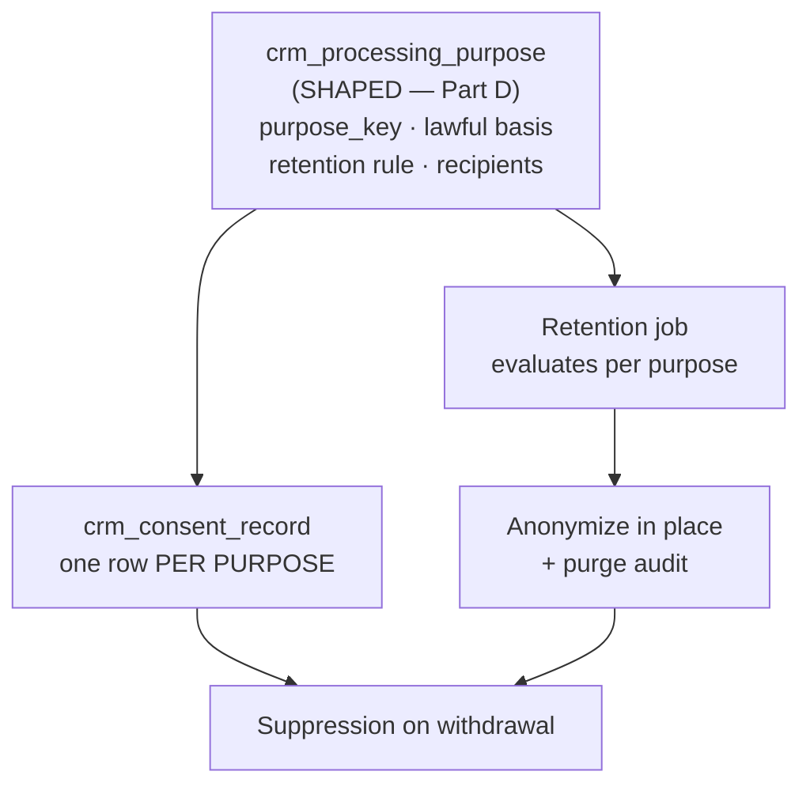

| Purpose (illustrative keys) | What it retains | Survives marketing withdrawal? |
|---|---|---|
| `enquiry_response` | the enquiry, the contact, the first-response record | Yes |
| `advisory_engagement` | opportunity, activities, viewings, quotes | Yes |
| `transaction_record` | closed-deal records anchored to a named external statute | Yes — **[LAWYER]** for the period |
| `marketing` | segment membership, send log | **No** — withdrawal suppresses immediately |

`[Recommendation]` `crm_processing_purpose` is **shaped, not built in v1**, and its retention periods
must be anchored to named external statutes rather than invented durations. "We keep leads for 3 years"
is arbitrary and indefensible. Part D owns the citations. **[LAWYER]**

### 10.4 The erasure runbook, as architecture

`[Recommendation]` Recorded here because two steps are counter-intuitive and will otherwise be missed:

1. Resolve the contact **and every contact it was merged from** (follow `merged_into_id` backwards).
   Erasing only the survivor leaves the loser's snapshot in `crm_merge_log` holding the PII.
   → `crm_merge_log.loser_snapshot` must be redacted in the same transaction.
2. Consent rows are append-only by GRANT (§6.4.3). A genuine erasure obligation therefore requires a
   **deliberate, logged, single-transaction privilege elevation** to redact them — which is exactly the
   friction that makes the append-only guarantee credible. Do not soften the grant to make erasure
   convenient.
3. `[Repository fact]` Backups are outside the database's reach entirely. Whatever the retention policy
   says, no CRM transaction can reach a snapshot. Part D carries the dated obligation; Part B records
   only that **this is a platform-configuration decision, not a schema decision**, and it must be made
   before the backup configuration is chosen rather than retrofitted. **[LAWYER]**

---

## 11. Migration and compatibility path

### 11.1 `public.leads` becomes the intake log

`[Repository fact]` Current contract, verified: **twelve columns** (`id`, `created_at`, `name`, `email`,
`phone`, `country`, `budget`, `interest`, `project_slug`, `message`, `status`, `source`); `email` and
`phone` `NOT NULL` with format CHECKs; `status` CHECK `IN ('new','contacted','qualified','closed','spam')`;
RLS enabled with **one** INSERT policy for `anon`/`authenticated` requiring `status = 'new'`; **no SELECT
policy**; `idx_leads_email` non-unique
(`supabase/migrations/20260704132000_create_leads.sql:1-46`). The single writer is
`supabase.from("leads").insert(payload)` at `src/lib/lead-service.ts:92`, executed **in the browser with
the anon key**, and pinned by a source-text test.

`[Repository fact]` **The defect that makes the naïve additive block unsafe.** Line 29 of that migration
is `GRANT INSERT ON public.leads TO anon, authenticated` — a **table-level** grant. In PostgreSQL a
table-level `INSERT` privilege automatically extends to **every column added later**. The INSERT policy's
`WITH CHECK` constrains only `status = 'new'` and three non-empty string tests
(`…create_leads.sql:32-41`); it says nothing about any other column. So the moment `contact_id`,
`provenance_tier` and `intake_metadata` are added, an anonymous browser can write them — attaching a
forged lead to any existing `crm_contact` it can guess, asserting `provenance_tier = 'server_intake'`
(which is a lie about lawful basis, per §11.2), and stuffing arbitrary JSON into `intake_metadata`.

`[Recommendation]` **"It adds no new grant" is the wrong test.** The right test is *"what can `anon` write
after this migration that it could not write before?"* — and the answer was: three new columns. That is
why the block below is **not** classified as purely additive.

```sql
-- ILLUSTRATIVE — NOT A MIGRATION. Reference DDL for FOREVER-CRM-ARCH-001 §11.1.
-- PURPOSE: make public.leads the CRM's intake/enquiry log, and close the
--   column-widening hole that adding columns to a table-level anon INSERT
--   grant would otherwise open.
-- CLASSIFICATION: **ADDITIVE COLUMNS + PRIVILEGE TIGHTENING.** NOT purely
--   additive, and it must not be described as such. Reason: a table-level
--   GRANT INSERT ... TO anon (…create_leads.sql:29) automatically extends to
--   every column added later, so three new columns would silently widen the
--   anonymous write surface. This block therefore REVOKEs the table-level
--   INSERT and re-grants it column-scoped over exactly the twelve columns anon
--   can write today. Net anonymous capability after this migration is
--   IDENTICAL to before it — which is the whole point.
-- SAFETY BOUNDARY: the anon INSERT policy is NOT dropped and NOT replaced; its
--   WITH CHECK is EXTENDED so the three new columns must be absent/empty. There
--   is still NO SELECT policy: reads remain service_role through the app-server
--   boundary. status='new' is still required.
-- ROLLBACK NOTE: the tightening half is independently reversible — re-granting
--   table-level INSERT restores the previous (defective) privilege exactly.
-- DOWN REASONING: dropping three nullable columns is safe ONLY while
--   contact_id is unpopulated. Once resolution has run, a DOWN discards the
--   lead->contact linkage and cannot reconstruct it. Reference only.
BEGIN;

ALTER TABLE public.leads
  ADD COLUMN IF NOT EXISTS contact_id UUID
    REFERENCES public.crm_contact(id) ON DELETE SET NULL,
  -- Honest provenance tiering (§11.2). Never fabricate a lawful basis.
  ADD COLUMN IF NOT EXISTS provenance_tier TEXT
    CHECK (provenance_tier IN ('pre_crm','anon_client_insert','server_intake')),
  ADD COLUMN IF NOT EXISTS intake_metadata JSONB NOT NULL DEFAULT '{}'::jsonb;

-- ---------------------------------------------------------------------------
-- PRIVILEGE TIGHTENING. Order matters: revoke the table-level grant, THEN
-- re-grant column by column. Doing it the other way round leaves a window.
-- ---------------------------------------------------------------------------
REVOKE INSERT ON public.leads FROM anon, authenticated;

-- Exactly the twelve columns that existed before this migration. Nothing here
-- is new capability; the three new columns are deliberately absent.
GRANT INSERT (id, created_at, name, email, phone, country, budget, interest,
              project_slug, message, status, source)
  ON public.leads TO anon, authenticated;

-- Belt and braces: the policy states the same rule declaratively, so a future
-- migration that carelessly re-grants table-level INSERT does not silently
-- reopen the hole. The three original non-empty tests are preserved verbatim.
DROP POLICY IF EXISTS "Anyone can submit a lead" ON public.leads;
CREATE POLICY "Anyone can submit a lead"
  ON public.leads
  FOR INSERT
  TO anon, authenticated
  WITH CHECK (
    status = 'new'
    AND length(btrim(name)) > 0
    AND length(btrim(email)) > 0
    AND length(btrim(phone)) > 0
    -- Added: the CRM columns are server-owned, never client-asserted.
    AND contact_id IS NULL
    AND provenance_tier IS NULL
    AND intake_metadata = '{}'::jsonb
  );

CREATE INDEX IF NOT EXISTS idx_leads_contact_id
  ON public.leads(contact_id);
CREATE INDEX IF NOT EXISTS idx_leads_unresolved
  ON public.leads(created_at DESC) WHERE contact_id IS NULL;

COMMIT;
```

`[Recommendation]` **The policy is dropped and recreated, and that deserves a sentence rather than a
silent `DROP POLICY`.** PostgreSQL has no `ALTER POLICY … ADD` for a `WITH CHECK` clause, so extending
one means replacing it. The replacement is byte-comparable to the original plus three conjuncts; the
migration should be reviewed against the original text at `…create_leads.sql:32-41` line by line, and a
`*-migration-contract.test.ts` should pin the resulting policy expression so a later edit cannot loosen
it unnoticed.

`[Recommendation]` Note what is still **absent** from that block and deliberately so: no `SELECT` policy,
no `UPDATE` policy, no widened `status` CHECK, no `NOT NULL`, no rename, and **no new anonymous
capability of any kind**. The anon path continues to work byte-for-byte for the payload
`src/lib/lead-service.ts` actually sends.

`[Recommendation]` **What proves it.** Three assertions in the `studio:pg-test` harness: (1) an `anon`
INSERT of the current payload still succeeds; (2) an `anon` INSERT that sets `contact_id` fails; (3)
`has_column_privilege('anon','public.leads','provenance_tier','INSERT') = false`. `[Repository fact]`
There is no CI here, so none of these may be called a gate that passed.

**The three-phase cutover (D2):**

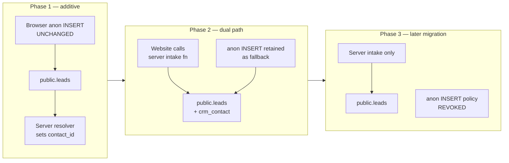

| Phase | What ships | Gate to leave the phase |
|---|---|---|
| **1** | The three columns above; a service_role resolver that reads unresolved leads and creates/links `crm_contact`. The website is untouched. | `[Repository fact]` PR #118's Gate G0 must first be discharged: a test lead observed to arrive end-to-end, with timestamp and confirming person. Until then, nobody knows the intake path works at all. |
| **2** | A `createServerFn` intake path (service_role) with server-side validation, rate limiting, dedup and consent capture. The website switches to it. The anon policy **stays** as a fallback. | Server intake observed working end-to-end for a defined period, with the fallback path recording zero use. |
| **3** | A **separate, later** migration revokes the anon INSERT policy and the `GRANT INSERT … TO anon, authenticated`. | Owner checkpoint. Never bundled with Phase 1 or 2. |

`[Recommendation]` **The anon policy is not removed in v1.** It is the only path with real production
rows, and PR #118 proves delivery is unverified. Removing an unverified path and replacing it with an
untested one at the same moment means a failure cannot be attributed to either.

### 11.2 Backfill: what is recoverable and what is not

`[Repository fact]` Existing rows carry a **concatenated** `name` (`src/lib/lead-service.ts:71` writes
`` `${firstName} ${lastName}`.trim() ``), a **lowercased** email (`:72`), no consent record, no dedup, no
session identity, and — for every website lead — **no `project_slug`**, because `/contact` renders
`<ContactForm source="contact_page" />` with no project (`src/routes/contact.tsx:69`).

| Artifact | Recoverable? | Treatment |
|---|---|---|
| `phone` → `crm_contact_method(kind='phone')` | **Yes.** Normalize with libphonenumber-js; flag failures, never reject. | The dedup index will refuse genuine collisions — that is the backfill *working*, and each refusal is a duplicate to review, not an error to suppress |
| `email` → `crm_contact_method(kind='email')` | **Yes**, and already lowercased. Preserve as `raw_value` too. | Collisions handled as above |
| `name` → `given_name` / `family_name` | **NO. This is lossy and must not be guessed.** | `[Recommendation]` Write the whole string to `display_name`; leave `given_name`/`family_name` NULL. Splitting on the first space is wrong for Cyrillic patronymics, Thai names, compound surnames and any name the form's own two fields were filled in unexpectedly. A wrong split is a fabricated personal fact |
| `budget` label → band key | **Partially.** Exact label matches map (`"$500k–1M"` → `500k_1m`, `questions.ts:32-38`). | Anything ambiguous stays NULL. Never regex-guess a band |
| `source` → `crm_intake_channel` | **Yes**, via `crm_intake_channel_alias`; unknown strings map to `unmapped`, never dropped | |
| `project_slug` | **Only for Booth rows.** | Website leads simply have none. Do not infer a project from `message` prose |
| **Consent / lawful basis** | **NO. Cannot be retroactively manufactured.** | `[Web research]` The lawful basis attaches at collection; you cannot silently re-base data later. **[LAWYER]** — Part D |
| Structured Navigator intent | **NO** for website leads (never captured). For Booth rows it exists only as English prose in `leads.message` | Parse to `crm_intent_snapshot` **only** where the deterministic Booth summary format is exactly matched; otherwise leave the prose as an activity note |

`[Recommendation]` **Therefore: `provenance_tier = 'pre_crm'`.** Every pre-CRM row is tagged as a distinct
provenance tier and is:
- **excluded** from any marketing purpose by default (no consent row exists, and none may be invented);
- **included** in operational history and funnel reporting, clearly labelled;
- **never** used to claim a lawful basis it does not have.

This is the honest answer and it is also the cheap one: one column, one CHECK, no archaeology.

### 11.3 Sequencing

| Constraint | Statement | Consequence |
|---|---|---|
| **S1** | `[Repository fact]` A CRM migration must use a version **strictly greater than `20260728160000`** — the maximum across `main` and all open PRs. | Any smaller timestamp interleaves unpredictably with PRs #102/#117/#119. |
| **S2** | `[Repository fact]` `main`'s `20260726120000_forever_direct_publish.sql` and PR #102's `20260726120000_booth_v2_server_issued_session.sql` **share one version number**. | **Do NOT resolve that collision in a CRM change.** It is a pre-existing defect belonging to the PR #102 merge, with its own owner and its own review. A CRM migration that "helpfully" renumbers it makes the CRM PR responsible for Booth's merge. |
| **S3** | `[Repository fact]` PR #102 drops `leads.email NOT NULL` and rewrites `leads_email_format` to be NULL-tolerant. | This is the **same change** the CRM needs for phone-only/WhatsApp/Booth leads. Treat it as convergent evidence, record the dependency, and **do not race it**. Whichever lands first, the other must not restore the strict contract. |
| **S4** | `[Repository fact]` Production is at **13 applied migrations through `20260718113000`**; 8 further migrations are **unapplied**. | The repository migration set is a **proposal, not production state**. The CRM design must not require schema that does not exist in production yet, and application is a separate Owner checkpoint. |
| **S5** | `[Repository fact]` Never edit an applied migration; corrections layer as a later timestamped file (the `20260721123000 → 20260722103000 → 20260722110000 → 20260722120000` chain is the precedent). | Any CRM correction is a new file, never an edit. |
| **S6** | `[Repository fact]` There is **no CI** in this repository (no `.github/workflows`). | No gate can be claimed to pass. A migration-contract test pinning the CRM file's security contract is the only available enforcement, and it enforces only when someone runs it. |
| **S7** | `[Recommendation]` **Object creation order inside a single migration file.** The DDL blocks in §6–§16 are ordered for *reading*, not for *execution*: `crm_opportunity` (§6.4.2) has an FK to `crm_intake_channel`, which is defined in §9.1, and `crm_assignment` / `crm_routing_log` (§6.4.5) have FKs to `crm_work_item`, which is defined in §13.7. | Transcribing the blocks in document order into one file fails with `relation … does not exist` and rolls the whole transaction back. The execution order is: `crm_intake_channel` → `crm_intake_channel_alias` → `crm_contact` → `crm_contact_method` → `crm_consent_record` (+ `crm_privacy_notice_version`) → `crm_activity` → `crm_work_item` → `crm_opportunity` → everything else. |
| **S8** | `[Repository fact]` `pg_trgm` is enabled in **no** migration in this repository (`20260707100000_…:4` installs only `pgcrypto`), and `crm_dup_candidates` (§7.3) calls `similarity()`. | `CREATE EXTENSION IF NOT EXISTS pg_trgm` must precede that view, or the view aborts and — because of the `BEGIN;`/`COMMIT;` wrapper — takes every other object in the file down with it. |

### 11.4 The missing UNIQUE on `units(project_id, unit_code)`

`[Repository fact]` `public.units` has no UNIQUE constraint on `(project_id, unit_code)`
(`supabase/migrations/20260704055333_812d2f26-ad80-4807-b51a-bd3622cd5224.sql:78-115`), yet the
progressive ingest resolves units by exactly that natural key. `public.buildings` already has the
equivalent `UNIQUE (project_id, building_code)`.

```sql
-- ILLUSTRATIVE — NOT A MIGRATION. Reference DDL for FOREVER-CRM-ARCH-001 §11.4.
-- MUST land BEFORE or WITH any CRM foreign key to public.units.
-- CLASSIFICATION: NOT PURELY ADDITIVE — it can FAIL on existing duplicate rows.
-- PRE-APPLY (read-only): count duplicates first and resolve them deliberately:
--   SELECT project_id, unit_code, count(*) FROM public.units
--   WHERE unit_code IS NOT NULL GROUP BY 1,2 HAVING count(*) > 1;
-- Partial index because unit_code is nullable and NULLs are not equal.
CREATE UNIQUE INDEX IF NOT EXISTS uq_units_project_unit_code
  ON public.units(project_id, unit_code) WHERE unit_code IS NOT NULL;
```

`[Recommendation]` **This is a hard prerequisite, not a nice-to-have.** Without it the ingest's
SELECT-then-INSERT can create duplicate units, and a `crm_opportunity.unit_id` FK would then point at one
of two rows representing the same physical unit — silently splitting a deal from its inventory.
`[Recommendation]` It is also **not a CRM-owned change**: it modifies inventory truth. It belongs to the
ingest subsystem with its own task ID, and the CRM records it as a **blocking dependency**. Adding a unit
FK before it exists is the one sequencing mistake in this document that cannot be fixed by a later
migration.

### 11.5 Compatibility table

| Current artifact | Target | Cutover step | Rollback |
|---|---|---|---|
| `public.leads` (11 cols, anon INSERT) | Intake/enquiry log with `contact_id`, `provenance_tier`, `intake_metadata` | Additive `ALTER TABLE` (§11.1). Policy untouched | Drop three nullable columns — safe **only** before resolution has run |
| `submitLead` browser anon insert (`src/lib/lead-service.ts:92`) | `createServerFn` intake path, service_role | Phase 2: website switches; anon path retained as fallback | Point the website back at `submitLead`; the anon policy still exists |
| Anon INSERT policy on `leads` | Revoked | Phase 3, a **separate later** migration, after Gate G0 and a clean fallback-usage period | Re-create the policy verbatim from `…20260704132000…:32-41` |
| `leads.email NOT NULL` + strict `leads_email_format` | Nullable + NULL-tolerant CHECK | **PR #102 already makes this change.** Do not duplicate it; record the dependency (S3) | Restoring the strict contract is safe only once no NULL email rows exist — that is PR #102's own recorded caveat |
| `leads.status` CHECK (5 values) | `crm_opportunity.stage` (**9** values: `new`, `contacted`, `qualified`, `viewing`, `reserved`, `nurture`, `spam`, `closed_won`, `closed_lost`) | Stage lives on the **new** table. `leads.status` is **frozen at `'new'`** and stops being a lifecycle | None needed — `leads.status` is never widened, so nothing to roll back |
| `leads.message` prose blob | `crm_activity` (note) + `crm_intent_snapshot` (structured) | Backfill parses only exact Booth-format matches; everything else becomes an activity note | Original `message` text is never modified — it stays as the evidence |
| `leads.source` free TEXT | `crm_intake_channel` + alias map | Resolution happens server-side at intake. **`leads.source` keeps no CHECK** (§9.1) | Drop the lookup tables; `leads.source` is untouched throughout |
| `leads.budget` display label | `crm_intent_snapshot.navigator_answers` enum keys | Exact-match mapping only; ambiguous → NULL | Original label preserved on `leads` |
| No dedup (`idx_leads_email` non-unique) | `uq_crm_contact_method_identity` | Backfill surfaces collisions as review items | Drop the index — but then dedup is gone; this is not a rollback anyone should want |
| No consent anywhere | `crm_consent_record` (append-only) | New rows only. **Pre-CRM rows get no consent record** (§11.2) | Drop the table — destroys the only consent evidence. Reference-only DOWN |
| `studio_object_owners` (`object_type IN ('project','listing')`) | Extend the CHECK in a **new** migration if CRM object ACLs are needed | Not required for v1: `crm_opportunity` carries `owner_user_id`/`assigned_user_id` directly | N/A in v1 |
| `src/integrations/supabase/types.ts` (stale: 17 tables, empty `Functions`) | Regenerate, or hand-write CRM row interfaces in a contracts module | **Coordinate with PRs #119 and #102**, which both touch it | Revert the file |
| `price_updates` / `project_status_history` (zero writers) | CRM consumes them | **Blocked on an ingest-side writer existing** (§9.4) | N/A — nothing to roll back until a writer exists |
| `units(project_id, unit_code)` (no UNIQUE) | Partial unique index | **Must precede any CRM unit FK** (§11.4). Ingest-owned, separate task ID | Drop the index; but a CRM unit FK must then also be dropped |
| Phantom `navigator_*` tables (declared, never created) | `deprecate` / `do_not_build` | Nothing to migrate — no table ever existed | N/A. `[Repository fact]` Code removal is **out of scope for this documentation-only task**; recorded as a backlog item with its own task ID (D9) |

---

## 12. Integration and event architecture

### 12.0 The starting point is a genuine zero — say it before designing anything

| Capability | State on `main` @ 821b3c4e | Evidence |
|---|---|---|
| Outbound email | none — no Resend/Postmark/SES/SendGrid/nodemailer dependency | `[Repository fact]` no mail dependency in `package.json`; audit gap G2 (runtime subsystem) |
| Outbound SMS / WhatsApp / Telegram | none — no provider, no client, no credential pattern | `[Repository fact]` audit gap G2 (runtime subsystem) |
| In-app notification | none — no `Toaster` mounted in `src/routes/__root.tsx`; `src/components/ui/sonner.tsx` has zero consumers | `[Repository fact]` audit gap G3 |
| Inbound webhook endpoint | none — no HTTP route files; no HMAC verification anywhere | `[Repository fact]` audit gap G7 (Supabase/security subsystem) |
| Deployed environment to hold a secret | none — Cloudflare verdict E; `wrangler.jsonc` states "nothing in this repository deploys it" | `[Repository fact]` `wrangler.jsonc:1-4` |
| Read path for a lead | none — `public.leads` has no SELECT policy and zero `SELECT` statements exist | `[Repository fact]` `src/lib/lead-service.ts:92` is the only `from("leads")` occurrence |
| Lead delivery verified end-to-end | never observed | `[Repository fact]` PR #118 Gate G0, `src/features/project-detail/contact-actions.ts` |

**Consequence for this section.** Every integration below is greenfield. There is no partial system to extend, no credential convention to copy, and no environment in which to store a provider key. Any plan that assumes "we just add an email step" is wrong by one whole capability. `[Inference]`

**Design rule that follows.** The CRM must be *fully usable with zero outbound integrations*. Every automation in §13 has a manual fallback that is the primary path in v1 and the fallback thereafter. `[Recommendation]`

---

### 12.1 The synchronous / asynchronous boundary

The rule is one sentence: **a request may only do work whose failure the human in front of it can act on.** Everything else is a durable row swept later. `[Recommendation]`

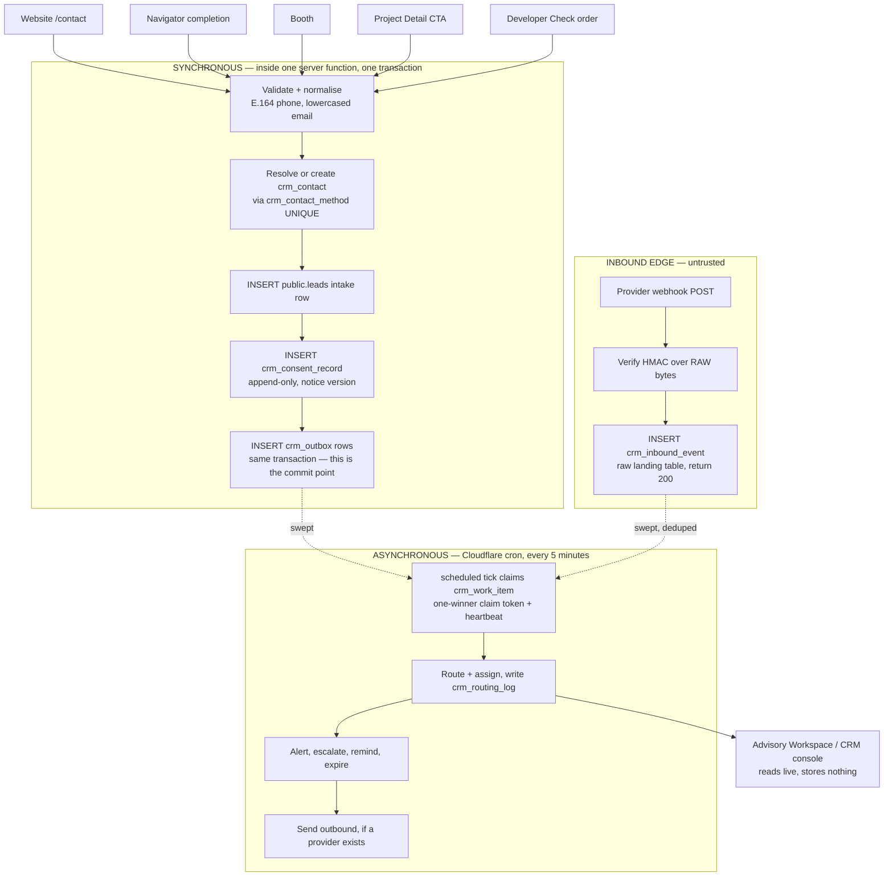

| Operation | Sync or async | Why |
|---|---|---|
| Lead validation, dedup key resolution, consent write | **Sync** | The submitter can fix a bad phone number; nobody can fix it later. `[Recommendation]` |
| Intake row + outbox row | **Sync, same transaction** | `audit_log` cannot be the trigger — `recordAuditSafely` swallows every write failure. `[Repository fact]` `src/features/forever-studio/server/service.ts:712-718` |
| Agent alert, routing, escalation | **Async** | Must survive a browser closing mid-request. Workers are stateless; a JS timer dies with the isolate. `[Repository fact]` `wrangler.jsonc` `triggers.crons` |
| Any outbound send | **Async** | Provider outage must not fail the guest's form submit. `[Recommendation]` |
| Reading project / unit / Passport truth | **Sync, read-through** | CRM must consume, never copy. `[Repository fact]` `docs/FOREVER_BRAIN_V1.md:311-319` |
| Webhook receipt | **Sync ack, async process** | Meta retries aggressively on non-200; a slow handler manufactures duplicates. `[Web research]` https://developers.facebook.com/documentation/business-messaging/whatsapp/webhooks/overview |

**The single load-bearing mechanism is a transactional outbox.** `[Recommendation]` The CRM writes the fact and the intent-to-notify in one transaction, then a sweeper turns intents into work. This is the only pattern in the repository that already has a proven implementation to copy: `studio_upload_jobs` + `studio_claim_job` gives one-winner claim tokens, heartbeats, stale recovery, `attempt_count`, `retryable`, and `content_fingerprint` idempotency. `[Repository fact]` `supabase/migrations/20260721120000_forever_studio_v1.sql:115-166, :275-306, :345-368`

Per D5 the CRM gets its **own** `crm_work_item` table. `studio_list_due_jobs` joins `studio_members` and applies a shared LIMIT, so CRM rows would starve or be starved by Studio uploads. `[Repository fact]` D5 / audit constraint C6 (runtime subsystem).

---

### 12.2 Integration inventory and guarantees

Every row states what is real today. "None" is a finding, not a placeholder.

| # | Integration | Direction | v1 verdict | Transport | Trigger |
|---|---|---|---|---|---|
| I1 | Website `/contact` | in | **Build** | server function (replaces browser anon insert) | user submit |
| I2 | Navigator completion | in | **Build** | same server function, `source='navigator'` | flow complete |
| I3 | Booth / Booth 2.0 | in | **Reuse** existing lead payload builder | same server function | booth submit |
| I4 | Project Detail CTA | in | **Build** (fix attribution) | same server function, `project_slug` set | CTA click → `/contact?project=` |
| I5 | Unit enquiry | in | **Build** | same server function + `unit_id` FK | CTA click |
| I6 | Forever Passport | out (internal) | **Reuse** serializer | in-process call, `renderTarget='crm'` | advisor action |
| I7 | Advisory Workspace | read | **Reuse** derivations | in-process, read-through | screen render |
| I8 | Reports / Advisor Report | out (internal) | **Snapshot on send** | in-process + immutable snapshot row | advisor "send" |
| I9 | Developer Check (#101) | in | **Reference seam only** | nullable FK, nothing built | order completion (does not exist) |
| I10 | WhatsApp Business API | in/out | **DEFER — D6** | none | n/a |
| I11 | Email (transactional) | out | **Build, send-only** | provider HTTP API from server fn | outbox sweep |
| I12 | Email (capture) | in | **BCC dropbox** | inbound-parse address | agent BCCs |
| I13 | Calendar | out | **One-way `.ics` + template link** | attachment / URL | viewing scheduled |
| I14 | Price / availability / status change | in (internal) | **Build on existing tables** | `price_updates`, `project_status_history` | ingest writes |
| I15 | Telegram, LINE, portals, future channels | in/out | **Schema-ready, not built** | none | n/a |

#### 12.2.1 Guarantees per integration

`R` = retries. `D` = deduplication key. `I` = idempotency. `F` = failure recovery. `O` = provider outage behaviour. `OO` = opt-out enforcement point. `C` = communication capture. `M` = manual fallback.

| Integration | R | D | I | F | O | OO | C | M |
|---|---|---|---|---|---|---|---|---|
| I1–I5 intake | none needed — sync; browser retry | `(kind, normalized_value)` UNIQUE on `crm_contact_method` + client `submission_token` | server rejects a repeated `submission_token` within 24h | intake failure returns a SAFE_MESSAGE; row is never half-written (single tx) | n/a | consent captured at this instant, not assumed | the intake row itself is the record of what the form received | agent types the enquiry into the console |
| I6 Passport | n/a | n/a | serializer is pure | n/a | n/a | n/a | snapshot row records what was serialised | advisor sends the PDF by hand |
| I8 Report snapshot | n/a | `(deal_id, snapshot_hash)` | re-deriving an identical report writes no new row | derivation is pure and in-memory | n/a | n/a | snapshot = "what we sent" | advisor attaches manually |
| I11 email out | outbox `attempt_count`, exponential backoff, `retryable=false` on 4xx | `(work_item_id)` — provider idempotency key = work item UUID | send only from a claimed work item; claim token is the mutex | failed send stays `retryable`; next tick resumes | queue drains when provider returns; **no message is lost, only delayed** | re-check `crm_consent_record` **at send time**, never at list-build time | `crm_activity` row written on accepted-by-provider, updated on bounce webhook | agent sends from their own mailbox and logs the outcome |
| I12 email in (BCC) | provider retries to our endpoint | `Message-ID` header UNIQUE in `crm_inbound_event` | landing-table INSERT is `ON CONFLICT DO NOTHING` | unmatched mail stays in the landing table, visible in an "unmatched" queue | inbound only; no loss | n/a | matched to contact by From/To address | agent pastes the thread into a note |
| I13 calendar | none — `.ics` is an attachment | n/a | regenerating an `.ics` with the same UID updates, never duplicates | if the file fails to attach the email fails and retries | n/a | n/a | `crm_viewing` row is the record; the calendar is a courtesy copy | agent adds the event by hand |
| I14 price/status | sweeper retries | `(price_update_id)` / `(project_status_history_id)` already consumed | work item created once per source row | unswept rows remain due | internal — no provider | client alert requires marketing consent; internal alert does not | `crm_activity` if the advisor acts | advisor notices in Studio and messages the client |
| C1 webhook edge (if I10 ever ships) | Meta retries — **design for 7 days** | `(provider, provider_event_id)` UNIQUE | landing INSERT idempotent; processing is a separate claimed step | replay from the landing table without re-contacting the provider | 200-and-store means an outage on our side loses nothing after recovery | inbound; opt-out applies to outbound only | full raw payload retained | agent logs the WhatsApp outcome manually — **this is the v1 path** |

**Opt-out is enforced in exactly one place: the sender, at send time, inside the claimed work item.** Not at segment build, not in the UI. The gap between building a list and pressing send is where withdrawals get missed. `[Web research]` https://knowledge.hubspot.com/workflows/add-re-enrollment-triggers-to-a-workflow (re-enrolment replays every action) and the PDPA marketing-objection analysis in the privacy research — **architecture research, not legal advice; `[LAWYER]` confirm the Thai marketing-objection standard before go-live.**

---

### 12.3 Webhook security contract

This applies the moment *any* provider webhook exists. It does not exist today. `[Repository fact]` audit gap G7.

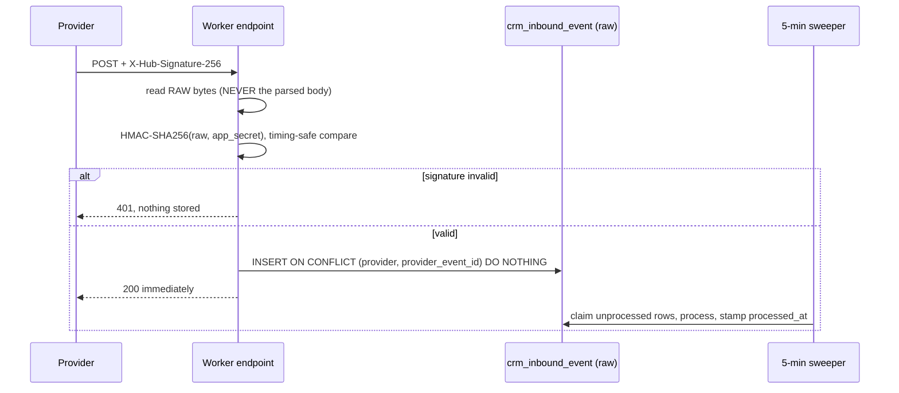

| Control | Specification | Why it is stated this precisely |
|---|---|---|
| Signature | `X-Hub-Signature-256` = `sha256=` + HMAC-SHA256 of the **raw request bytes** keyed on the app secret | `[Web research]` https://developers.facebook.com/docs/graph-api/webhooks/getting-started |
| Body handling | Capture raw bytes **before** any framework parsing. Do not verify against a re-serialised JSON body. | Re-serialisation changes whitespace and key order, so the HMAC fails intermittently — and the usual "fix" is to disable verification. This is a classic and expensive bug. `[Web research]` same source + anti-pattern A8 in the messaging research |
| Comparison | constant-time compare | `[Recommendation]` |
| Verification handshake | echo `hub.challenge` when `hub.mode=subscribe` and `hub.verify_token` matches | `[Web research]` https://developers.facebook.com/docs/graph-api/webhooks/getting-started |
| Landing | INSERT raw payload into `crm_inbound_event`, then return 200. Zero business logic in the request. | `[Recommendation]` |
| Dedup | UNIQUE `(provider, provider_event_id)`; `ON CONFLICT DO NOTHING` | at-least-once delivery is the only guarantee any provider offers `[Inference]` |
| Retry window | **Design for 7 days of retries.** Meta's generic Graph API webhooks page says 36 hours; the WhatsApp-specific webhooks page says up to 7 days. The two primary pages conflict and the discrepancy is unresolved in public documentation. | `[Web research]` https://developers.facebook.com/docs/graph-api/webhooks/getting-started vs https://developers.facebook.com/documentation/business-messaging/whatsapp/webhooks/overview |
| Payload size | accept up to 3 MB | `[Web research]` https://developers.facebook.com/documentation/business-messaging/whatsapp/webhooks/overview |
| Replay | reprocess from `crm_inbound_event`, never by asking the provider to resend | `[Recommendation]` |
| Failure | a poison event stamps `failed_at` + `error_code` and stays queryable; it never blocks the sweep | mirrors `studio_fail_job`'s retryable/terminal split `[Repository fact]` `supabase/migrations/20260721120000_forever_studio_v1.sql:345-368` |

**Designing for 7 days is not caution, it is arithmetic:** if the true window is 7 days and the dedup key only covers 36 hours, a provider outage produces duplicate client-visible actions on day 3. Designing for 7 days when the truth is 36 hours costs one index. `[Inference]`

---

### 12.4 Project price, availability and status change

This is the one integration where the source tables already exist and are correctly shaped.

| Fact | Evidence |
|---|---|
| `price_updates` has the right grain — `project_id`, `unit_id`, `old_price_thb`, `new_price_thb`, `update_reason`, `updated_by`, `created_at` — and **zero writers** | `[Repository fact]` audit gap G6 (project-truth subsystem); no `src/` reference outside generated types |
| `project_status_history` has the right shape and **zero writers** | `[Repository fact]` audit gap G7 (project-truth subsystem) |
| `unit_price_history` is **not** append-only — `forever_progressive_ingest` UPDATEs a matching row in place | `[Repository fact]` `supabase/migrations/20260718113000...:749-761` |
| `unit_price_history` carries `source_file` / `source_page` repository paths and is REVOKEd from anon/authenticated | `[Repository fact]` `supabase/migrations/20260723130000_public_projection_privacy.sql:62` |

**Decision.** Price/availability/status automation consumes `price_updates` and `project_status_history` **only**. `unit_price_history` is never treated as an event stream and never reaches a client-facing surface. `[Recommendation]`

**The gap that must be closed first.** Both tables have zero writers, so today there is nothing to consume. The ingest must write them in the same transaction as the price change — otherwise the CRM's "we told the client the day it changed" claim is unprovable. That is an ingest change, out of scope for this documentation task; recorded as a dependency. `[Recommendation]`

Matching a change to a known interest requires a durable interest record. The interest keys are fixed by the brief: `projects(slug)` for project interest and `units(id)` for unit interest — with the **missing** `UNIQUE (project_id, unit_code)` constraint added alongside any unit FK, or the ingest's SELECT-then-INSERT can create duplicate units. `[Repository fact]` audit constraint C3 / gap G14 (project-truth subsystem).

---

### 12.5 Developer Check (issue #101) — the reference boundary, in full

This is the section most likely to be got wrong later, so it is specified rather than summarised.

#### 12.5.1 What exists

| Claim | State | Evidence |
|---|---|---|
| #101 authorizes implementation | **No.** "This issue does not authorize implementation and does not change docs/CURRENT_STAGE.md." | `[Repository fact]` issue #101, Status section |
| The 15 proposed `developer_*` / `project_*_checks` tables | **Zero exist.** Repo-wide grep across `.sql/.ts/.tsx/.md/.json` returns zero matches | `[Repository fact]` |
| DBD / ONEP / LED / juristic-registration integration code | **None** | `[Repository fact]` |
| Payment, checkout, order, invoice, refund or entitlement capability | **None of any kind.** A 1,490 / 1,990 THB product has zero commercial infrastructure | `[Repository fact]` audit gap G3 (#101 subsystem) |
| Canonical developer entity | **Exists** — `public.developers`, with `slug` UNIQUE, `verification_status`, `last_verified_at` | `[Repository fact]` `supabase/migrations/20260704055333_...sql:15-34`; `supabase/migrations/20260707100000_fdb001_core_extensions_sources_audit.sql:8-21` |
| `developers.verification_status` | **Unconstrained TEXT**, default `'unverified'`, no CHECK | `[Repository fact]` `supabase/migrations/20260707100000_...sql:14-15` |
| `sources` provenance shape | exists but is **project-scoped** — no `developer_id` | `[Repository fact]` `supabase/migrations/20260707100000_...sql:58-74` |
| `documents.project_id` | **NOT NULL** — a developer-level certified document cannot be stored | `[Repository fact]` `supabase/migrations/20260707102000_fdb001_assets_intelligence.sql:65-89` |
| "SunThai" in code | only the provenance string "Sunthai Property", the agency that produced two source decks. No brand entity, no tenant, no account. | `[Repository fact]` `scripts/catalog/build-wave1-payloads.mjs:155` |

#### 12.5.2 The boundary

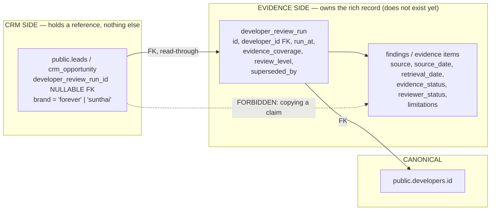

| Rule | Statement | Authority |
|---|---|---|
| **DC-1** | A Developer Check buyer enters the **same** CRM as every other person — one `crm_contact`, one intake row. No parallel lead store. | `[Owner requirement]` #101 "Do not create a separate SunThai truth system, database, scoring engine, or report logic." |
| **DC-2** | The CRM holds a **nullable FK to the review run**. It holds no claim, no finding, no score, no verdict, no summary sentence. | `[Owner requirement]` + `[Repository fact]` `docs/FOREVER_BRAIN_V1.md:311-319` — CRM must not own developer facts |
| **DC-3** | **Never denormalize an evidence claim into a CRM row.** Every claim must retain source, source date, retrieval date, evidence status, reviewer status and known limitations. A CRM copy strips all six and presents a stale claim as current. | `[Owner requirement]` #101 Required domain model |
| **DC-4** | A re-run **supersedes**. The CRM reference therefore points at a run, and the run carries `superseded_by`. Rendering resolves to the current run at read time. A CRM-side copy could never supersede itself. | `[Owner requirement]` #101 |
| **DC-5** | `developers.id` is the **only** canonical developer key. No second developer table, no free-text developer name on a CRM row. `developers.slug` is acceptable where a stable human key is needed. | `[Repository fact]` `public.developers`; `projects.developer_id`, `developer_translations` already reference it |
| **DC-6** | **SunThai is a COLUMN VALUE on the lead** — a distribution brand attribute. Never a schema fork, never a second lead database, never a second report engine, never a second scoring system. | `[Owner requirement]` #101 |
| **DC-7** | Missing evidence never becomes a positive claim. `developers.verification_status` must gain a CHECK constraint before any CRM surface renders it, or an unearned "verified" badge leaks through an unconstrained column. | `[Repository fact]` no CHECK exists + `[Owner requirement]` #101 |
| **DC-8** | No score. No A/B/C/D grade. This aligns with the existing NAV-001 §09 prohibition on lead scores, fit percentages and rankings. | `[Owner requirement]` #101 + `[Repository fact]` `src/features/navigator/core/matching.ts:8-11` |

#### 12.5.3 The one place #101 must be read against the grain

Step 6 of the Owner's stated buyer journey says the lead record "stores requested company/project, report result, risk questions, language, and contact consent." `[Owner requirement]`

**Taken literally, "report result" on the lead is exactly the duplication DC-3 forbids.** `[Inference]` The consequence of complying literally: the day a re-run supersedes a finding, the CRM row still shows the old result, an advisor quotes it to a client, and an evidence-led brokerage has published an unsourced stale claim from its own CRM. That is the specific failure mode the whole positioning exists to prevent.

**Recommended alternative** — everything else in step 6 is kept verbatim:

| Step-6 field | CRM treatment |
|---|---|
| requested company / project | **store** — `developer_id` FK and/or `project_slug` FK. This is the buyer's *intent*, not an evidence claim. |
| report result | **do not store.** Store `developer_review_run_id` and resolve at read time. |
| risk questions | **store** — the buyer's own words are buyer data, not developer facts. Free text is an s26 sensitive-data leak surface; see the privacy section. |
| language | **store** — `crm_contact.language`. Drives routing and sequence variant selection. |
| contact consent | **store as an append-only `crm_consent_record` row**, never a boolean. |

#### 12.5.4 Order and entitlement

There is no payment, order, invoice or entitlement capability anywhere in the repository. `[Repository fact]` A paid Developer Check therefore needs an entire commercial subsystem before the CRM seam matters. The CRM must not model an order; it must be able to *reference* one when it exists. `[Recommendation]`

Reserve exactly two nullable columns and build nothing else:

```sql
-- ILLUSTRATIVE DDL — NOT A MIGRATION. Do not apply. No migration file is
-- authorized by this document.
ALTER TABLE public.leads
  ADD COLUMN brand TEXT NOT NULL DEFAULT 'forever'
    CHECK (brand IN ('forever', 'sunthai')),
  ADD COLUMN developer_review_run_id UUID;   -- FK added only when the
                                             -- evidence side exists
COMMENT ON COLUMN public.leads.brand IS
  'Distribution brand. A column value, never a schema fork (issue #101).';
COMMENT ON COLUMN public.leads.developer_review_run_id IS
  'Thin reference to the evidence-side review run. The CRM stores no claim, '
  'no finding and no result — a re-run supersedes and the CRM must follow it.';
```

---

### 12.6 Build vs buy, per integration

Cost bands are relative effort classes, not quotations. `[Inference]`

| Integration | Verdict | ROI | Lock-in | Reversal cost |
|---|---|---|---|---|
| Lead intake server function | **Build** | Highest available. Today all existing rows must be treated as untrusted: anon-writable, no rate limit, no dedup, no server-side validation. | none — our own code | trivial |
| Agent alerting | **Build** on `crm_work_item` | High. "Nobody was told" is the #1 failure a 5-agent brokerage can have. | none | trivial |
| Email sending | **Buy a provider, build the wrapper** | High. Rented deliverability is not reproducible in-house. | Low **if** the wrapper is a one-function seam and the sending domain is ours. | one function + DNS |
| Email capture | **BCC dropbox** (provider feature) | Medium. Gets the thread into the timeline without touching a mailbox. | Low | change the BCC address |
| Calendar | **Neither — generate `.ics` + a template link** | Medium. Zero OAuth, works for Google, Apple and Outlook alike. | **Zero** | n/a |
| WhatsApp | **Defer entirely (D6)** | Negative in v1 — see §12.7 | **Severe if done wrong** — see §12.7 | potentially irreversible |
| CRM platform itself | **Build Forever-native (D7)** | n/a | Buying is triple-blocked | n/a |
| Cloudflare Queues / Workflows / Durable Objects | **Do not adopt** | Negative — new infrastructure this repository cannot validate | platform | n/a |

**On the external-CRM trigger.** `docs/ROADMAP.md:228` defers external CRM until "lead volume exceeds the simple internal workflow." `[Repository fact]` Lead volume is measured nowhere, so **the trigger cannot currently be evaluated** — it is not that the answer is "no", it is that the question cannot be asked. §14.7 states it in measurable form. `[Repository fact]` audit gap G9 (governance subsystem).

---

### 12.7 WhatsApp — D6 in full, with the two decisive facts

**Decision: no WhatsApp API in v1.** Capture outcomes manually. Keep the schema channel-agnostic. `[Owner requirement]` D6.

#### The pricing inversion — 1 October 2026

| Fact | Date | Source |
|---|---|---|
| Service messages (free-form agent replies inside the 24h window) have been free since Nov 2024; utility templates inside the window free since 1 Jul 2025 | current | `[Web research]` https://developers.facebook.com/documentation/business-messaging/whatsapp/pricing |
| **Effective 1 Oct 2026 both become billable per message**, at utility/authentication market rates, with **no volume tiers for service** | 1 Oct 2026 | `[Web research]` https://developers.facebook.com/documentation/business-messaging/whatsapp/pricing/non-template-messages |
| The rates **will not be published until 1 Sep 2026** | 1 Sep 2026 | `[Web research]` same |
| Meta Business Agent replies bill per token at $2.00 / 1M tokens from 1 Aug 2026 | 1 Aug 2026 | `[Web research]` same |

**Why this is decisive rather than merely interesting.** Today is 2026-07-28. Any business case for WhatsApp API integration that rests on "agent replies are free anyway" **expires in roughly ten weeks, and the replacement price is not yet knowable.** For a high-touch, low-volume brokerage where one off-plan lead generates dozens of hand-typed messages over months, moving agent replies onto the API converts a permanently free channel into a metered one at an unpublished rate. `[Inference]` Deciding this in v1 would be deciding it blind.

#### The coexistence / number-deletion trap

To use an existing WhatsApp Business **app** number with Cloud API you must either:

1. **delete the WhatsApp Business app account** — "your existing messaging history will be lost, and you will be unable to use that number with the WhatsApp Business app again"; or
2. **onboard through a partner that supports business-app number onboarding ("coexistence")**, which keeps the number live in the app and syncs history.

`[Web research]` https://developers.facebook.com/documentation/business-messaging/whatsapp/solution-providers/migrate-existing-whatsapp-number-to-a-business-account/ and https://developers.facebook.com/documentation/business-messaging/whatsapp/embedded-signup/onboarding-business-app-users

| Rule | Statement |
|---|---|
| **WA-1** | The agents' working WhatsApp number is a **protected production asset**. Written rule: it is never to be self-onboarded to Cloud API. `[Owner requirement]` D6 |
| **WA-2** | Any experiment uses a **separate, disposable number**. There is no undo that restores the chats. `[Recommendation]` |
| **WA-3** | If integration ever happens, it is **coexistence via a BSP**, never direct self-serve. `[Web research]` as above |
| **WA-4** | Coexistence carries its own lock-in: numbers in use with the WhatsApp Business App **cannot use the programmatic BSP-to-BSP migration path**. Mitigate structurally, not contractually — keep our own copy of every message. `[Web research]` https://developers.facebook.com/documentation/business-messaging/whatsapp/solution-providers/support/migrating-phone-numbers-among-solution-partners-programmatically |
| **WA-5** | Never hardwire WhatsApp into the schema. No `whatsapp_thread_id` on the lead, no `wa_message` table as the only conversation store. Multiple 2026 reports describe Russian regulatory pressure on WhatsApp in favour of a state-backed messenger. `[Web research]` https://www.dw.com/en/russia-moves-to-block-whatsapp-as-moscow-pushes-state-backed-rival/a-75922756 |
| **WA-6** | Per D6, WhatsApp is a **capability of a phone number**: `crm_contact_method(kind='phone')` with `channels text[]` containing `whatsapp`/`telegram`. Not a separate identifier space. `[Owner requirement]` D6 |
| **WA-7** | The WhatsApp Business App's own linked-device / multi-agent tier already gives a handful of agents shared access to one number at near-zero cost, with no per-message billing and no template approvals. `[Web research]` https://faq.whatsapp.com/647349420360876, https://faq.whatsapp.com/395911122612120 |

**Do not build a shared inbox/chat UI.** A credible WhatsApp inbox means reimplementing a messaging client — media, read receipts, typing state, ordering, retries — and it is the single most expensive first-iteration mistake available here. `[Web research]` messaging-research anti-pattern A1.

**Revisit criteria, declared in advance** (D6 requires pre-declared kill criteria): after one full deal cycle of manual outcome capture — realistically 60–90 days for off-plan — measure (a) % of client interactions with a logged outcome within 24h, (b) number of leads that went dark with no logged outcome, (c) hours/week agents spend re-typing. Integrate only if manual capture demonstrably fails on (a) or (b). `[Recommendation]`

**A caution about the replacement, not just the incumbent:** the API tells you what was said; it does not tell you what it meant or what happens next. Someone still logs the outcome after integration. Manual outcome capture is not a temporary embarrassment. `[Web research]` messaging-research anti-pattern A14.

---

### 12.8 Email and calendar

#### Email — send-only plus a BCC dropbox

| Decision | Detail | Source |
|---|---|---|
| Send transactional email only | viewing confirmations, unit shortlists, acknowledgements | `[Recommendation]` |
| Dedicated sending subdomain | e.g. `mail.<domain>`, with SPF, DKIM and DMARC on **that subdomain**, so the primary domain's reputation is insulated | `[Recommendation]` |
| **Never request `gmail.readonly`, `gmail.modify`, `gmail.metadata`, `gmail.compose`, `gmail.insert`, `gmail.settings.*` or `mail.google.com`** | Google classifies these as **RESTRICTED**; storing or transmitting that data server-side triggers an annual third-party security assessment | `[Web research]` https://developers.google.com/workspace/gmail/api/auth/scopes |
| Capture inbound by **BCC dropbox** | agent BCCs a per-workspace address; provider posts the parsed message to our webhook; it lands in `crm_inbound_event` and is matched by address | `[Recommendation]` |
| Escape hatch, if full mailbox read ever becomes genuinely necessary | an app used **only** by people inside our own Google Workspace / Cloud Identity organization is exempt from OAuth verification, the unverified-app screen and the 100-user cap | `[Web research]` https://support.google.com/cloud/answer/13464323 |

The BCC dropbox is the whole point: it gets the conversation into the timeline **without** reading anyone's mailbox, which is simultaneously the cheapest engineering option and the smallest privacy surface. `[Inference]`

#### Calendar — one-way, write-only

| Decision | Detail | Source |
|---|---|---|
| v1 = `.ics` attachment + a Google Calendar template link on every booked viewing | no OAuth, no tokens to refresh, works for Google, Apple and Outlook users alike | `[Recommendation]` |
| **No two-way sync in v1** | bidirectional sync means conflict resolution, ownership rules, deletion tombstones, timezone correctness across Asia/Bangkok and clients' home zones | `[Web research]` messaging-research anti-pattern A11 |
| If reading back is ever needed: **incremental polling with `syncToken`**, not push channels | Calendar push notifications carry **no payload** — you must call the API anyway — and watch channels expire with no automatic renewal | `[Web research]` https://developers.google.com/workspace/calendar/api/guides/push |
| Timezone anchor | the **client's** timezone for anything client-facing; `Asia/Bangkok` for agent working hours | `[Recommendation]` |

---

### 12.9 Illustrative DDL for the event edge

`[Recommendation]` **`crm_outbox` is defined once, in §9.3, and is not restated here.** An earlier draft
carried a second, incompatible outbox definition in this section — one that dropped
`idempotency_key TEXT NOT NULL` and `available_at`, which are the two columns that make the outbox safe
to retry. Whichever definition an implementer read first would have decided whether the system
double-sends. §9.3 is the definition; §5.1a is the register that says so.

```sql
-- ILLUSTRATIVE DDL — NOT A MIGRATION. Not applied, not authorized, and no
-- migration file is created by this document. Names follow the canonical
-- entity register in §5.1a.

-- Raw inbound landing table. Verify signature, INSERT, return 200. Nothing else.
CREATE TABLE public.crm_inbound_event (
  id                UUID PRIMARY KEY DEFAULT gen_random_uuid(),
  provider          TEXT NOT NULL,      -- 'email_inbound' | 'whatsapp' | ...
  provider_event_id TEXT NOT NULL,
  received_at       TIMESTAMPTZ NOT NULL DEFAULT now(),
  raw_payload       JSONB NOT NULL,
  signature_ok      BOOLEAN NOT NULL,
  processed_at      TIMESTAMPTZ,
  failed_at         TIMESTAMPTZ,
  error_code        TEXT,
  CONSTRAINT crm_inbound_event_unique UNIQUE (provider, provider_event_id)
);

-- Internal-only posture, per D3: RLS on, NO policies, service_role only.
-- (crm_outbox's own grants are in §9.3 and are deliberately narrower.)
ALTER TABLE public.crm_inbound_event ENABLE ROW LEVEL SECURITY;
REVOKE ALL ON TABLE public.crm_inbound_event
  FROM PUBLIC, anon, authenticated, service_role;
-- The landing table is written once and marked processed once. Nothing edits
-- raw_payload or signature_ok after the fact — that is the evidence.
GRANT INSERT, SELECT ON TABLE public.crm_inbound_event TO service_role;
GRANT UPDATE (processed_at, failed_at, error_code)
  ON TABLE public.crm_inbound_event TO service_role;
```

---

## 13. Automation strategy and catalogue

### 13.1 Runtime reality — read this before the catalogue

| Constraint | Value | Evidence |
|---|---|---|
| Only scheduler | Cloudflare Cron Trigger, `*/5 * * * *` | `[Repository fact]` `wrangler.jsonc` `triggers.crons` |
| Execution seam | Worker `scheduled()` export → `cloudflare:scheduled` Nitro hook | `[Repository fact]` `src/features/forever-studio/server/scheduled-runner.server.ts:1-19` |
| Bounded per invocation | Studio uses `RESUME_BATCH = 5`, `SCHEDULED_TICK_MAX_SLICES = 12` | `[Repository fact]` `src/features/forever-studio/server/service.ts:96, :553` |
| Durable-job primitive to copy | `studio_claim_job` / `heartbeat` / `fail` / `release` / `list_due_jobs`: one-winner claim tokens, stale recovery, `attempt_count`, `retryable`, `content_fingerprint` | `[Repository fact]` `supabase/migrations/20260721120000_forever_studio_v1.sql:275-306, :345-368` |
| Separate table required | `studio_list_due_jobs` joins `studio_members` and applies a shared LIMIT | `[Owner requirement]` D5 |
| Kill switch to honour | `deps.partnerDemoActive()` ← `process.env.VITE_PARTNER_DEMO === "true"`; Studio returns zero work when active | `[Repository fact]` `src/features/forever-studio/server/deps.server.ts:776`; `src/features/forever-studio/server/service.ts:527, :619` |
| Forbidden | Cloudflare Queues, Workflows, Durable Objects | `[Owner requirement]` D5 |
| Forbidden | any JS timer / `setTimeout` — Workers are stateless and the isolate dies with the request | `[Repository fact]` runtime audit C4 + `[Inference]` |

#### The honest statement against the Owner's 2-minute target

`[Owner requirement]` The Owner's targets are a **2-minute assignment acknowledgement** and **5-minute human contact**.

`[Repository fact]` The cron fires every 5 minutes. Timestamps are stored to the second, so both targets are **measurable exactly**. But an escalation can only *fire* on a tick, so **escalation resolution is 5 minutes**. A breach detected at T+2:00 is acted on somewhere in `[T+2:00, T+7:00]`.

**Do not promise 2-minute escalation on this runtime.** `[Owner requirement]` D5. Three honest options:

| Option | Escalation resolution | Cost | Verdict |
|---|---|---|---|
| Keep `*/5` | ≤5 min | zero | **Recommended for v1.** Measure the breach exactly; escalate within 5 minutes. |
| Add `* * * * *` alongside | ≤1 min | one line in `wrangler.jsonc`, but every tick is a query against a table with almost no due rows | Defer. Revisit if measured acknowledgement breaches are frequent. |
| Push notification at write time (sync) | seconds | requires a provider and a deployed environment — neither exists | Not available in v1. |

`[Repository fact][Recommendation]` **The tick resolution is not the binding limit — the absence of a
transport is.** In v1 an "escalation" changes which queue a work item sits in and writes a
`crm_routing_log` row. **It notifies nobody**: there is no push, no email, no SMS and no WhatsApp
anywhere in the repository, and §21.2 puts every outbound send out of scope. Reading "escalate within 5
minutes" as "somebody is told within 5 minutes" is the misreading this paragraph exists to prevent.
**Transactional email to the assignee is the stated prerequisite for any screen that promises a response
time** (§18.3, §18.13).

All SLA numbers are **configurable policy rows, never hard-coded UI text** — `crm_policy` (§6.4.5).
`[Owner requirement]` D5.

### 13.2 Classification vocabulary

| Class | Meaning | Default |
|---|---|---|
| **DR** deterministic rule | fixed logic, no configuration, no judgement | always on |
| **UP** user-configurable policy | a versioned `crm_policy` row the Owner can change without a deploy | on, with a default value |
| **AI** AI-assisted suggestion | proposes text or a next step; **never sends** | off |
| **HA** human approval required | the automation prepares; a human presses send | on, gated |
| **PA** prohibited autonomous action | must never happen without a person | enforced by absence of capability |

**Prohibited autonomous actions, enumerated:** sending any marketing message; sending anything to a contact with no live consent record; changing a deal stage; recording a viewing outcome; creating or superseding an evidence claim; assigning a lead score, fit percentage or ranking (`[Repository fact]` `src/features/navigator/core/matching.ts:8-11`); hard-deleting or merging a contact; sending to a client from a partner-demo session. `[Recommendation]`

### 13.3 The catalogue

Scores: **CV** commercial value, **TS** operating-time saving, **CX** client experience, **RK** risk, **IC** implementation cost, **MB** maintenance burden, **RV** reversibility. All 1–5; for RK/IC/MB lower is better; RV higher is better.

| # | Automation | Class | Trigger | Action | CV | TS | CX | RK | IC | MB | RV | Phase |
|---|---|---|---|---|---|---|---|---|---|---|---|---|
| A01 | Immediate new-lead alert | DR | `crm_outbox` row `lead.created` | in-app badge + agent alert on next tick | 5 | 5 | 4 | 1 | 2 | 1 | 5 | **1** |
| A02 | Language / specialization routing | UP | lead created, `contact.language` + `project_slug` known | ordered rule list, first match wins, mandatory catch-all | 5 | 4 | 5 | 2 | 3 | 2 | 5 | **1** |
| A03 | Assignment acknowledgement capture | DR | agent opens/claims | stamp `acknowledged_at` | 4 | 2 | 2 | 1 | 1 | 1 | 5 | **1** |
| A04 | SLA escalation on unacknowledged assignment | UP | `now() > assigned_at + policy` and `acknowledged_at IS NULL` | offer to next agent, then Owner; write `crm_routing_log` | 5 | 4 | 4 | 2 | 3 | 2 | 5 | **1** |
| A05 | Fallback Guide assignment | UP | A04 chain exhausted | hard-assign to the Owner/pond pseudo-agent | 4 | 3 | 4 | 2 | 2 | 2 | 5 | **1** |
| A06 | First-response action plan (day-0 acknowledgement only) | HA | assignment accepted | draft acknowledgement in the contact's language; **only step 1 may `auto_send`** | 4 | 4 | 5 | 3 | 3 | 3 | 4 | **2** |
| A07 | 4 / 7 / 28-day follow-up reminders | UP | assignment accepted; steps at +4d, +7d, +28d | task on the agent's Today list | 4 | 5 | 3 | 1 | 2 | 2 | 5 | **2** |
| A08 | 21-day ownership & nurture policy | UP | see §13.6 — **default is activity-driven, not calendar-driven** | reclaim to pond / start nurture | 3 | 3 | 2 | 4 | 3 | 3 | 4 | **2** |
| A09 | Stale-lead detection | DR | no `crm_activity` in N days on an open deal | surface in a "Stale" queue | 4 | 4 | 3 | 1 | 2 | 1 | 5 | **1** |
| A10 | Orphaned-lead detection | DR | open lead with no assignee | surface in the pond; alert Owner | 5 | 3 | 4 | 1 | 1 | 1 | 5 | **1** |
| A11 | No-next-action detection | DR | open deal with `next_action_at IS NULL` | block-and-surface; ideally a DB CHECK on open deals | 5 | 4 | 3 | 1 | 2 | 1 | 5 | **1** |
| A12 | Viewing reminders (24h / 2h) | HA | `crm_viewing.scheduled_at` | prepare reminder; send needs a provider | 4 | 4 | 5 | 2 | 3 | 2 | 5 | **3** |
| A13 | Post-viewing follow-up / feedback request | UP | `scheduled_at + policy delay`, outcome not recorded | task + "Viewings Requiring Feedback" queue | 4 | 4 | 4 | 2 | 3 | 2 | 5 | **3** |
| A14 | Reservation follow-up (milestone dates) | UP | reservation recorded; SPA window, payment dates | dated tasks with amounts | 5 | 4 | 4 | 2 | 4 | 3 | 4 | **3** |
| A15 | Lost-lead nurture | UP | stage → lost with a reason code | slow, low-volume sequence; **marketing consent required** | 3 | 2 | 3 | 4 | 3 | 3 | 4 | **4** |
| A16 | Reactivation | UP | dormant N months + a relevant catalogue change | task for the **owning** agent (credit is permanent) | 3 | 3 | 3 | 3 | 3 | 3 | 4 | **4** |
| A17 | Project / price / availability change matched to known interest | UP | `price_updates` or `project_status_history` row | notify the advisor; client message is HA | 5 | 4 | 5 | 3 | 4 | 3 | 4 | **3** |
| A18 | Duplicate detection | DR | write attempt on `crm_contact_method` | UNIQUE constraint resolves in-line; near-misses go to a review queue | 5 | 3 | 3 | 2 | 2 | 1 | 4 | **1** |
| A19 | Data-quality checks | DR | nightly tick | missing language / consent / source / next action → Owner list | 4 | 3 | 2 | 1 | 2 | 2 | 5 | **2** |
| A20 | Post-sale relationship maintenance | UP | deal closed | handover checklist + annual touchpoint task | 3 | 2 | 4 | 2 | 2 | 2 | 5 | **4** |
| A21 | AI draft of a first reply | AI | agent opens an unanswered lead | proposes text in the contact's language; **never sends** | 3 | 4 | 3 | 4 | 4 | 4 | 5 | **4** |

#### Priority ordering

**Rule: nothing that sends is built before everything that measures.** Building an automation engine before instrumenting anything is a documented, expensive failure mode. `[Web research]` https://knowledge.hubspot.com/workflows/add-re-enrollment-triggers-to-a-workflow

1. **Phase 1 — make nothing get lost.** A01, A10, A11, A18, A03, A09, A02, A04, A05. All internal, all reversible, none sends anything to a client. Every one of these works with **zero** outbound capability.
2. **Phase 2 — make follow-up systematic.** A07, A19, A06 (acknowledgement step only), A08.
3. **Phase 3 — the transaction.** A12, A13, A17, A14. Requires the viewing entity and a working email sender.
4. **Phase 4 — the long tail.** A15, A16, A20, A21. Requires marketing consent to be real, and a measured baseline to justify itself.

### 13.4 Sequence semantics — pause, exit, cap, gate

Adopt the documented pause conditions verbatim rather than inventing a vague "stop if they reply". `[Web research]` https://help.followupboss.com/hc/en-us/articles/1500008539982-Action-Plans-Overview and https://help.lofty.com/hc/en-us/articles/45537578767643-Smart-Plan-Builder

| Condition | Effect | Note |
|---|---|---|
| Inbound reply **per channel** (email reply, WhatsApp/Telegram/SMS reply) | pause | "replied" must be defined per channel, not globally |
| A logged call **longer than 2.5 minutes** | pause | The threshold exists specifically **to stop voicemails pausing plans**. A 20-second call is a voicemail, not a conversation. |
| Stage change | pause | |
| Unsubscribe / consent withdrawal | **exit permanently**, and suppress | |
| Removal of the triggering condition | pause | |
| Daily volume cap | hard stop | Cap automated outbound per contact per day (FUB's published cap is 4 action-plan emails/day). Without it, stacked sequences pile up. |
| `auto_send` | **defaults FALSE for every step past the initial acknowledgement** | The step becomes a task; a human reviews it for that specific client and sends. Correct default for high-ticket, two-language advisory work. `[Web research]` https://knowledge.spark.re/follow-up-schedules |
| Send-time anchoring | batch to a civil hour in the **client's** timezone | Clients sit at UTC+2..+4; agents at UTC+7. A 03:47 send reads as a robot. |
| Language | every step has an `ru` and an `en` variant selected by `crm_contact.language` | |

**Unsubscribe splits.** Marketing sequences stop; 1:1 advisory correspondence continues. These are different consents and must be physically different records. `[Owner requirement]` D8.

### 13.5 The three documented traps

| Trap | Documented behaviour | Forever's counter-design |
|---|---|---|
| **Bulk/mass actions silently bypass automation** | Follow Up Boss: automations "will not be triggered when performing a Mass Action. If you are mass applying a tag or mass updating a stage, automations will not be triggered." `[Web research]` https://help.followupboss.com/hc/en-us/articles/360048951553-Automations-Overview | Automations trigger on **`crm_outbox` rows**, and the outbox is written by the same transaction as the state change — including bulk paths. There is no code path that changes state without writing the outbox row, because the outbox write is inside the transaction, not inside the UI handler. |
| **Re-enrolment replays every step from the start** | HubSpot: re-enrolled records "start the workflow again from the beginning and complete all workflow actions again (e.g., receiving the same email twice)", and date/count refinements silently stop applying on re-enrolment. `[Web research]` https://knowledge.hubspot.com/workflows/add-re-enrollment-triggers-to-a-workflow | `crm_sequence_enrolment` carries `(contact_id, sequence_id, step_no)` UNIQUE on **completed** steps. Re-enrolment resumes at the first incomplete step; a re-enrolment that would repeat a completed send is refused and logged. |
| **Re-applying a sequence overrides the previous one and restarts** | Spark: re-applying a follow-up schedule "will override any previously applied follow-up schedules and begin the new schedule from the first task. It is not possible to resume." `[Web research]` https://knowledge.spark.re/follow-up-schedules | Applying a second sequence **does not delete the first**. Both are enrolments; the volume cap arbitrates. The Owner sees both in the timeline. |

### 13.6 The 21-day ownership rule — recorded objection and recommended alternative

`[Owner requirement]` The Owner specified: 21-day ownership, returning to the original agent on reactivation.

`[Web research]` Research found **no vendor documentation and no industry-body standard** establishing this as a norm. Follow Up Boss's own Lead Ponds FAQ answers "can leads auto-move to a Pond after X days?" with **no**. https://help.followupboss.com/hc/en-us/articles/360048829034-Lead-Ponds-Overview

`[Inference]` A pure calendar lock creates a hoarding incentive: an agent who does nothing for 20 days still holds the lead on day 20.

`[Owner requirement]` D4 resolves it and the automation catalogue implements D4 exactly:

- **Ownership is permanent credit.** Reassignment changes the assignee, never the owner. `[Web research]` https://help.lofty.com/hc/en-us/articles/115003544406-Lead-Ownership
- **Reclaim is driven by activity, not the calendar** — no logged contact attempt within N hours returns the lead to the pond.
- **The 21-day rule ships as a configurable, versioned `crm_policy` row** so the Owner can retain it. The **default is activity-driven**.
- Every routing, assignment and reclaim decision writes a `crm_routing_log` row. At 5–15 agents the CRM's real political function is settling arguments about who got which lead. `[Web research]` https://help.lofty.com/hc/en-us/articles/360055177831-Lead-Routing-How-to-set-up-lead-routing-rules

Two more constraints the routing rules must honour:

- **Claim windows are measured in minutes, not hours.** Follow Up Boss caps the unclaimed period at **30 minutes maximum**, chains at most two fallback groups, then hard-assigns to the account owner, and writes every fallback to the timeline. Any multi-hour hold is out of line with the only documented reference implementation. `[Web research]` https://help.followupboss.com/hc/en-us/articles/360014656193-First-to-Claim
- **Route on working hours and an away flag, evaluated in `Asia/Bangkok`, with fall-through.** A 20:00 Moscow enquiry is 00:00 in Phuket. Without this, round-robin assigns 02:00 leads to sleeping agents and the SLA clock runs against nobody. `[Web research]` https://help.lofty.com/hc/en-us/articles/360055177831-Lead-Routing-How-to-set-up-lead-routing-rules

### 13.7 Illustrative DDL for the work item

```sql
-- ILLUSTRATIVE DDL — NOT A MIGRATION. Not applied, not authorized.
-- Mirrors public.studio_upload_jobs deliberately, in a SEPARATE table (D5).
CREATE TABLE public.crm_work_item (
  id             UUID PRIMARY KEY DEFAULT gen_random_uuid(),
  kind           TEXT NOT NULL,       -- 'enquiry' | 'sla_escalation' | 'sequence_step' | ...
  subject_table  TEXT NOT NULL,
  subject_id     UUID NOT NULL,

  -- ---------------------------------------------------------------------
  -- SLICE 1 (§21.2). The work item is the unit of human work, and in Slice 1
  -- there is no crm_opportunity for these columns to live on. Ownership and
  -- assignment sit HERE, not on an opportunity that Slice 1 does not create.
  -- D4/R6 rules apply unchanged: credit is RESTRICT + a name snapshot,
  -- assignment is SET NULL.
  -- ---------------------------------------------------------------------
  owner_user_id      UUID REFERENCES public.studio_members(user_id) ON DELETE RESTRICT,
  owner_display_name TEXT,            -- write-once snapshot, set with owner_user_id
  assigned_user_id   UUID REFERENCES public.studio_members(user_id) ON DELETE SET NULL,
  next_action_at     TIMESTAMPTZ,
  next_action_note   TEXT,
  -- Write-once. The one timestamp that makes Slice 1 measurable at all.
  first_response_at  TIMESTAMPTZ,

  due_at         TIMESTAMPTZ NOT NULL,
  status         TEXT NOT NULL DEFAULT 'pending'
                 CHECK (status IN ('pending','processing','done','failed','cancelled')),
  claim_token    UUID,
  claimed_at     TIMESTAMPTZ,
  heartbeat_at   TIMESTAMPTZ,
  attempt_count  INTEGER NOT NULL DEFAULT 0,
  retryable      BOOLEAN NOT NULL DEFAULT true,
  -- Idempotency: the same logical action can only be queued once WHILE IT IS
  -- LIVE. A globally-unique dedupe_key would mean a second SLA breach on the
  -- same subject can never be enqueued, because the first one is still there
  -- marked 'done' — and rule 5 below says the sweeper never throws, so nobody
  -- would be told. The uniqueness is therefore a partial index over live rows
  -- (see below), not a table constraint.
  dedupe_key     TEXT NOT NULL,
  created_at     TIMESTAMPTZ NOT NULL DEFAULT now(),
  updated_at     TIMESTAMPTZ NOT NULL DEFAULT now(),
  CONSTRAINT crm_work_item_owner_named
    CHECK ((owner_user_id IS NULL) = (owner_display_name IS NULL))
);
-- Live-scoped idempotency. Mirrors the cited precedent, which is also scoped:
-- ingestion_batches UNIQUE (project_id, batch_fingerprint).
CREATE UNIQUE INDEX crm_work_item_dedupe_live_idx
  ON public.crm_work_item (dedupe_key)
  WHERE status IN ('pending','processing');
-- The Slice 1 screens: "My Work Today" and "who has nobody answered".
CREATE INDEX crm_work_item_assigned_next_action_idx
  ON public.crm_work_item (assigned_user_id, next_action_at)
  WHERE status <> 'done' AND status <> 'cancelled';
CREATE INDEX crm_work_item_unanswered_idx
  ON public.crm_work_item (created_at)
  WHERE first_response_at IS NULL;
-- The sweeper's index predicate must MATCH the sweeper's query, or the rows
-- the sweeper exists to recover are invisible to it. `status = 'pending'`
-- alone can never surface a stale `processing` row or a retryable `failed`
-- row — which directly contradicts rule 3 below ("a stale claim is
-- recoverable, never orphaned"). Mirror Studio exactly:
CREATE INDEX crm_work_item_sweep_idx
  ON public.crm_work_item (due_at)
  WHERE status = 'pending'
     OR (status = 'failed'     AND retryable IS TRUE)
     OR  status = 'processing';

ALTER TABLE public.crm_work_item ENABLE ROW LEVEL SECURITY;  -- no policies (D3)
REVOKE ALL ON TABLE public.crm_work_item FROM PUBLIC, anon, authenticated;
GRANT ALL ON TABLE public.crm_work_item TO service_role;
```

`[Repository fact][Recommendation]` **The stale interval is 900 seconds (15 minutes), taken from Studio's
`STALE_PROCESSING_SECONDS = 900` (`src/features/forever-studio/server/service.ts:88`).** A different
number here would mean two runners in one codebase disagreeing about when a claim is dead, so the CRM
adopts Studio's rather than inventing one.

`[Recommendation]` **Why the index predicate says `status = 'processing'` and not
`status = 'processing' AND heartbeat_at < now() - INTERVAL '900 seconds'`:** `now()` is not `IMMUTABLE`,
so PostgreSQL will not accept it in a partial-index predicate. The staleness comparison therefore lives in
the sweeper's `WHERE`, and the index narrows the scan to the three recoverable statuses. The query the
index serves is:

```sql
-- ILLUSTRATIVE — NOT A MIGRATION. The sweeper's claim query, stated once.
SELECT id FROM public.crm_work_item
WHERE due_at <= now()
  AND ( status = 'pending'
     OR (status = 'failed'     AND retryable IS TRUE)
     OR (status = 'processing' AND heartbeat_at
                                   < now() - INTERVAL '900 seconds') )
ORDER BY due_at
LIMIT 5                                   -- Studio's RESUME_BATCH
FOR UPDATE SKIP LOCKED;
```

`[Recommendation]` `attempt_count` needs a ceiling before this ships, or a permanently-failing retryable
item is retried on every tick forever. Studio's bound is the reference; the CRM should state its own
maximum and set `retryable = false` when it is reached, so the row leaves the sweep set by a decision
rather than by being forgotten.

The sweeper contract, stated once:

1. Return **zero work** immediately if `deps.partnerDemoActive()` — a demo must never fire a real outbound action or mutate real lead state. `[Repository fact]` `src/features/forever-studio/server/service.ts:527`
2. Claim with a one-winner compare-and-set, bounded per invocation (Studio's `RESUME_BATCH = 5` is the reference number). `[Repository fact]` `src/features/forever-studio/server/service.ts:96`
3. Heartbeat; a stale claim is recoverable, never orphaned.
4. Stamp the "we did it" marker **in the same transaction** that enqueues the send.
5. Never throw. A failing tick logs redacted and the next tick retries. `[Repository fact]` `src/features/forever-studio/server/scheduled-runner.server.ts:31-34`

---

## 14. Owner analytics and KPI model

### 14.1 The tree, top-down

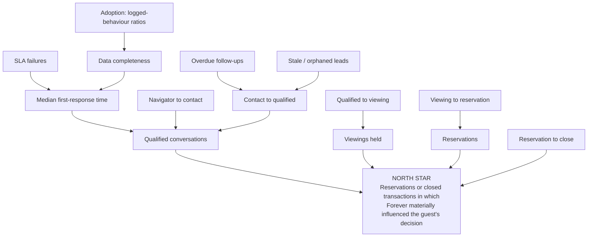

The North Star is taken verbatim from `docs/FOREVER_STRATEGIC_NORTH_STAR.md` and `docs/ROADMAP.md`: "Reservations or closed transactions in which Forever materially influenced the guest's decision." `[Repository fact]` `docs/ROADMAP.md:236`, `docs/FOREVER_STRATEGIC_NORTH_STAR.md` Metrics § .

**"Materially influenced" is a judgement, and the CRM must not pretend otherwise.** `[Recommendation]` Record it as an explicit, attributable human decision — `crm_opportunity.influence_claim` with a required evidence pointer to at least one `crm_activity` and the claiming user — not as a derived flag. A derived "we touched it so we influenced it" would be a fabricated product truth.

### 14.2 Metric definitions

`Source` names the timestamp the metric depends on and where it comes from. **`NEW`** = does not exist and must be created. **`EXISTS`** = present on `main` today.

`[Recommendation]` **Every table named below has a shape in this document, and the column names below are
the actual column names — checked against the DDL, not paraphrased.** Three metrics (M20, M21, and the
registration half of the North Star) depend on tables that are `SHAPED` in the register (§5.1a) and
therefore have **no DDL at all**: they are marked `NOT COMPUTABLE — no table shape` rather than `NEW`,
because "new" implies someone knows what to build. Saying a metric is merely new when its table does not
even have a shape is the exact defect §14.3 exists to catch.

| # | Metric | Numerator / Denominator | Timestamp it depends on | Source |
|---|---|---|---|---|
| M01 | Qualified conversations (weekly) | count of deals that entered `qualified` in the period / — | `crm_opportunity_stage_event.occurred_at` where `to_stage='qualified'` | **NEW.** `leads.status` has a CHECK enum but **no code path ever updates it**; every writer sets `'new'`. `[Repository fact]` `src/lib/lead-service.ts` |
| M02 | **Median** first-response time | `median(first_outbound.occurred_at − leads.created_at)` over leads with a first outbound attempt / — | `leads.created_at` **EXISTS**; `crm_work_item.first_response_at` (write-once), backed by `crm_activity.occurred_at` where `direction = 'outbound'` — **NEW** | Report the median **only**. One lead answered three days late destroys a mean while leaving the median honest. `[Web research]` https://hbr.org/2011/03/the-short-life-of-online-sales-leads |
| M02b | First-response **coverage** | leads with any logged outbound attempt / all leads in period | same | Publishing M02 without M02b is the classic lie: answer 3 leads fast, ignore 30, and the median looks excellent. **M02 must never be shown without M02b.** `[Recommendation]` |
| M03 | Assignment acknowledgement time | `median(acknowledged_at − assigned_at)` | `crm_assignment.assigned_at`, `.acknowledged_at` | **NEW.** No assignment concept exists anywhere. `[Repository fact]` audit gap G8 |
| M04 | Navigator → contact | leads with a linked complete Navigator snapshot / all Navigator snapshots | `crm_intent_snapshot.captured_at` + `profile_is_complete`, `leads.created_at` | **NEW — and currently impossible.** See §14.3 bug B1. |
| M05 | Contact → qualified | deals reaching `qualified` / deals with ≥1 logged contact attempt | stage events | **NEW** |
| M06 | Qualified → viewing | deals with ≥1 `crm_viewing` in state `attended` / deals reaching `qualified` | `crm_viewing.attended_at` | **NEW** |
| M07 | Viewing → reservation | deals reaching `reserved` / deals with ≥1 attended viewing | stage events | **NEW.** `leads.status` CHECK has no `viewing`, `reserved` or `lost`. `[Repository fact]` |
| M08 | Reservation → close | deals reaching `closed` / deals reaching `reserved` | stage events | **NEW** |
| M09 | Source conversion | per `source`: reservations / leads | `leads.source` **EXISTS** but is unconstrained TEXT | See bug B2. |
| M10 | Project conversion | per `projects.slug`: reservations / leads | `leads.project_slug` **EXISTS** (FK, ON UPDATE CASCADE) | See bug B3 — the denominator is structurally wrong today. |
| M11 | Agent / team workload | open deals per assignee; new assignments per assignee per week | `crm_assignment.assigned_at` | **NEW** |
| M12 | Overdue follow-ups | active records with `next_action_at < now()` / active records | `crm_work_item.next_action_at` in Slice 1; `crm_opportunity.next_action_at` once opportunities exist. **`nurture` is excluded** — INV-O1 exempts it and INV-O4 gives it `next_review_at` instead, so nurture is a separate queue and never inflates the overdue count | **NEW** |
| M13 | Stale leads | open deals with no `crm_activity` in N days / open deals | `max(crm_activity.occurred_at)` per deal | **NEW.** `leads` has no `updated_at`, so "last touched" is not derivable from `leads` at all. `[Repository fact]` audit gap G9 |
| M14 | Orphaned leads | open leads with no active assignee (count) | `crm_assignment` absence | **NEW** |
| M15 | Lost reasons | count by `lost_reason_code` | `crm_opportunity_stage_event.occurred_at` where `to_stage='lost'` | **NEW.** Controlled vocabulary, never free text — free text cannot be counted. |
| M16 | Nurture reactivation | contacts re-entering an open deal after ≥N months dormant / contacts in nurture | first `crm_opportunity.created_at` after the dormancy window | **NEW** |
| M17 | SLA failures | assignments where `acknowledged_at IS NULL` at `assigned_at + policy`, or first outbound later than the policy / all assignments | `crm_assignment`, `crm_policy.version` | **NEW.** Must record the **policy version in force at the time** or a policy change silently rewrites history. |
| M18 | Data completeness | leads with language + consent record + source + `contact_id` all present / all leads | `leads.created_at` | **NEW** |
| M19 | Viewing outcomes | attended / no-show / cancelled, and decision `proceed`/`maybe`/`rejected` | `crm_viewing.*` | **NEW** |
| M20 | Transaction outcomes | reservations, SPAs signed, completions, per month | `crm_opportunity_milestone.occurred_at` | **NOT COMPUTABLE — no table shape.** `crm_opportunity_milestone` is `SHAPED` in §5.1a with no DDL, deliberately: there is no real reservation in the system to model against (§5.1). Until one exists, the reservation *stage* on `crm_opportunity` is the only honest source, and it counts reservations, not milestones. |
| M21 | Commission / revenue attributable | sum of `commission_amount_minor` on deals with an accepted influence claim | `crm_opportunity_attribution.recorded_at` | **NOT COMPUTABLE — no table shape.** `crm_opportunity_attribution` and `crm_client_registration` are both `SHAPED` with no DDL (§5.1a, §14.3 B7), and no commercial or payment capability of any kind exists. **The North Star therefore has no money attached to it, and this must be said rather than implied by a "NEW".** When it is built, currency is `(amount_minor bigint, currency char(3))` — never a bare number. |

### 14.3 Metrics the proposed schema cannot compute — these are schema bugs, fixed here

| # | Bug | Consequence | Fix |
|---|---|---|---|
| **B1** | **Navigator → contact (M04) is not computable.** `NavigatorSession` has no id, no `guestId`, no `createdAt`; the website Navigator holds everything in `useState`, persists nothing and submits no lead; Booth persistence is `sessionStorage` only. There is no correlation id on `leads`. | A metric named in **four** repository documents cannot be produced at all. `[Repository fact]` `docs/ROADMAP.md`, `docs/CURRENT_STAGE.md:196`, North Star Metrics § | Use `crm_intent_snapshot` as defined in §6.4.4 — `captured_at`, `profile_is_complete`, `navigator_answers JSONB` storing **enum keys** — plus its existing nullable `lead_id` FK, which is the correlation this bug is about. (An earlier draft named columns `started_at` / `completed_at` / `is_complete` / `answers` and a `leads.navigator_session_id`; none of those exist. `lead_id` on the snapshot is the correlation, and it points the right way — the snapshot knows its lead, so `leads` needs no new column.) Per D10, store answers and re-derive everything else; **never JSON round-trip a DecisionProfile** — `budgetCeiling` for the `gt_2_5m` band is `Number.POSITIVE_INFINITY`, which `JSON.stringify` silently converts to `null`. `[Repository fact]` D10 |
| **B2** | **Source conversion (M09) is uncountable.** `leads.source` is unconstrained `TEXT NOT NULL DEFAULT 'contact_form'`; five values are live (`contact_form`, `contact_page`, `home_page`, `project_detail`, `booth`) and PR #102 adds another. | Any GROUP BY produces a drifting, un-groupable set. `[Repository fact]` | **A reference table — never a CHECK on `leads.source`.** `crm_intake_channel` + `crm_intake_channel_alias` (§9.1), resolved at the server intake boundary, with the unmapped case resolving to `unmapped` rather than rejecting the insert. `leads.source` stays unconstrained TEXT: a fail-closed CHECK on a column written by an anonymous browser insert turns the appearance of a new channel into a silent lead loss at the front door (§9.1). Seed the five live values explicitly. |
| **B3** | **Project conversion (M10) is structurally biased.** `/contact` **never sets `project_slug`** — it validates `{project, unit}` search params, renders them as text, and then never passes them to `ContactForm`. Only Booth sets the slug. `ProjectContactCTA` does pass it, but is currently unreached. | Project attribution is lost on **every** website lead, so M10 measures Booth against nothing and would tell the Owner that project pages generate no interest. `[Repository fact]` `src/routes/contact.tsx:14-25` and `:69` (`<ContactForm source="contact_page" />` with no slug); `src/features/project-detail/components/ProjectContactCTA.tsx:20-21` | Pass the validated `project`/`unit` search params through to the intake call. This is a small change with a large measurement consequence and should be sequenced **before** M10 is published. |
| **B4** | **"Last touched" is not derivable.** `leads` has no `updated_at` and no `set_updated_at` trigger. | M13 cannot be computed from `leads`; it must come from `crm_activity`, which does not exist. `[Repository fact]` audit gap G9 | `crm_activity` is the source of truth for "last touched". Do **not** solve this by adding `updated_at` to `leads` — `leads` is an append-only intake log (D1) and a mutable timestamp on it is the first step of accretion. |
| **B4b** | **`nurture` had no stage value, so INV-O1 forced every warm-but-slow buyer onto an agent's overdue list.** The only exit was `closed_lost`. | The whole warm pipeline would have been recorded as lost within a quarter, and M16 (nurture reactivation) would count from an empty set. `[Inference]` | Fixed in §6.4.2: `nurture` and `spam` are in the `stage` CHECK; INV-O1 exempts them; INV-O4 requires `next_review_at` on a nurture row so parked never means forgotten; and `prior_opportunity_id` links the successor opportunity so funnel arithmetic stays honest. |
| **B5** | **Funnel stages beyond `qualified` do not exist.** `leads.status` CHECK allows only `new/contacted/qualified/closed/spam`; the roadmap funnel needs `viewing`, `reserved`, `lost`. | M06, M07, M08, M15 are all uncomputable. `[Repository fact]` audit constraint C7 | Stage lives on `crm_opportunity` with an append-only `crm_opportunity_stage_event` log. **Do not widen the `leads` CHECK** — the intake row records what arrived, not where the deal got to. |
| **B6** | **SLA breaches cannot be reproduced after a policy change.** | Changing the acknowledgement target from 2 to 5 minutes would retroactively erase past breaches. | Every `crm_assignment` stores the `crm_policy` version in force at assignment time. `[Recommendation]` |
| **B7** | **Commission attribution has no home.** No order, invoice, commission or attribution entity exists. | M21 is unavailable, so the North Star has **no money attached to it**, and that remains true after this document. `[Repository fact]` | `crm_opportunity_attribution` + a `crm_client_registration(developer_id, project_id, contact_id, registered_at, developer_reference)` row created **at reservation, not at completion** — developer commission disputes are settled by who registered the client first. `[Web research]` real-estate research R18. **Both are `SHAPED` with no DDL in §5.1a and neither is scheduled**: there is no reservation in the system and no commercial or payment capability of any kind, so building them now would produce empty tables. This bug is therefore *identified, not fixed* — say so rather than implying the schema now computes M21. |
| **B8** | **`profileLabel` must never be used as a segment.** `ForeverStory.profileLabel` is the hard-coded constant `'The Considered Retreat-Seeker'` for every complete profile. | A segmentation report built on it would put 100% of leads in one segment and look plausible. `[Repository fact]` D10 / `src/features/navigator/core/forever-story.ts:101` | Segment on stored answer **enum keys** only. |

### 14.4 The Owner's three views

#### DAILY — one phone screen, five numbers, no charts

| Line | Metric | Rule |
|---|---|---|
| 1 | **New enquiries today** — with an unassigned count beside it | M14 as a red badge if > 0 |
| 2 | **Median first response today** + coverage `x/y` | M02 + M02b, always together |
| 3 | **SLA breaches today** | M17, tappable to the list |
| 4 | **Overdue next actions** | M12 |
| 5 | **Viewings today / tomorrow** | M19 forward-looking |

Design rule from the brief: a design an agent cannot understand on a phone in 10 seconds has failed. Five numbers, one red badge, everything tappable, nothing plotted. `[Owner requirement]` The precedent for the screen shell is the Studio UI — noindex routes, client-side session gate, `mx-auto w-full max-w-*` mobile-first container. `[Repository fact]` runtime audit C9.

#### WEEKLY — one screen, funnel plus workload

Qualified conversations (M01); the five conversion steps M04→M08 as a step chart; workload per agent (M11); stale + orphaned (M13, M14); lost reasons (M15); data completeness (M18); adoption ratios (§14.6). Charting uses the **already-installed, currently-unused** `recharts` + `src/components/ui/chart.tsx` — zero install cost and no 24-hour `minimumReleaseAge` delay. `[Repository fact]` runtime audit C14 / gap G12.

#### MONTHLY — the business review

North Star count with the influence claim behind each one; M09 source conversion; M10 project conversion (only after B3 is fixed); M20 transaction outcomes; M21 commission attributable; M16 reactivation; SLA trend with the policy version annotated; the **external-CRM trigger evaluation** from §14.7.

### 14.5 Anti-vanity — the metrics Forever must NOT adopt

`docs/FOREVER_STRATEGIC_NORTH_STAR.md` names an explicit anti-vanity rule. `[Repository fact]` Forbidden as primary success metrics: commits; lines of code or documentation; number of tests without product context; number of modules or agents; number of canonicalization steps; catalogue size without demand and freshness; page views without meaningful contact.

Extending the same rule to the CRM specifically: `[Recommendation]`

| Do not adopt | Why |
|---|---|
| Total leads in the database | Grows monotonically. Includes spam and duplicates. Rewards intake volume, not conversion. |
| **Mean** first-response time | One lead answered three days late destroys it. Median only, always with coverage. `[Web research]` https://hbr.org/2011/03/the-short-life-of-online-sales-leads |
| CRM logins / daily active users | Measures presence, not work. Detects nothing. |
| Activities logged, as a raw count | Directly gameable — log ten notes, advance nothing. Only meaningful as the §14.6 ratio. |
| Messages sent | Rewards volume in a business whose product is judgement. |
| Weighted pipeline value | Statistically meaningless across a handful of concurrent off-plan deals, and vendor defaults of 100% per stage make an unconfigured pipeline report weighted = total. `[Web research]` real-estate research anti-pattern A8 |
| Any lead score, fit percentage or ranking | Forbidden as a NAV-001 §09 rule. `[Repository fact]` `src/features/navigator/core/matching.ts:8-11` |
| "% of CRM projects fail" style benchmarks | The commonly cited chain (Gartner 2001 50%+, Butler 2002 70%, AMR 2006 31%, Forrester 2009 47%) has no shared definition. `[Web research]` https://crmsearch.com/implementation/crm-fail/ |
| The "5-minute rule" 100x / 21x multipliers, attributed to Harvard | They come from a 2007 vendor-published observational study of six companies, not from HBR. HBR's own 2011 numbers are a 42-hour average and 23% never responding. Forever is an evidence-led brokerage; repeating unsourced folklore in its own instrumentation is self-refuting. `[Web research]` https://hbr.org/2011/03/the-short-life-of-online-sales-leads, https://ainora.lt/blog/lead-response-time-statistics-every-study-2026 |

Fast response is still right — **as an internal service standard the Owner sets, not as a borrowed statistic.** `[Recommendation]`

### 14.6 Adoption metrics that measure behaviour, not logins

These exist to detect one specific, likely failure: **agents keep using WhatsApp and a spreadsheet, and the CRM quietly becomes a form that nobody reads.** By the time that is obvious it is permanent. `[Inference]`

| # | Adoption metric | Definition | What a bad number means |
|---|---|---|---|
| AD1 | **First-contact-attempt-inside-SLA rate** | enquiries with a logged first contact attempt within the SLA / all enquiries | The headline. Low = the CRM is not where work starts. |
| AD2 | **Activities-logged to deals-advanced ratio** | `crm_activity` rows in period / stage transitions in period | Very low (≈1) = stages are being flipped with no work recorded → the timeline is fiction. Very high with no advancement = busywork, or leads that should be marked lost. |
| AD3 | Logging latency | median(`created_at` − `occurred_at`) on `crm_activity` | Rising = agents batch-enter at the end of the week from memory. That data is unreliable and will not be trusted later. |
| AD4 | Outcome coverage on viewings | viewings with a recorded outcome / viewings past `scheduled_at` | The queue must be closed by a deliberate human act, including "we tried and failed to reach them". |
| AD5 | Consent capture rate | leads with a `crm_consent_record` / all leads | Below 100% is both an adoption failure and a compliance failure. |
| AD6 | Channel-of-record share | activities whose channel is `whatsapp` and were logged manually vs everything else | If this approaches 100%, D6's manual-capture bet is failing and the WhatsApp revisit criteria in §12.7 have fired. |
| AD7 | Stale-queue clearance | stale items closed in period / stale items opened | Persistently < 1 = the queue is being ignored, not worked. |

**Instrument AD1–AD3 in Phase 1, before any automation sends anything.** `[Recommendation]`

### 14.7 Baseline — stated honestly

| Statement | Evidence |
|---|---|
| **None of M01–M21 is measured today.** There is no metrics or aggregation layer of any kind; `recharts` and `chart.tsx` are installed with zero consumers. | `[Repository fact]` runtime audit gap G12 |
| **Lead volume itself is unmeasured.** Nothing reads a lead back: no SELECT policy, no server function, no application code, no admin surface. | `[Repository fact]` `src/lib/lead-service.ts:92` is the only `from("leads")` occurrence; no SELECT policy on `public.leads` |
| **Lead delivery has never been verified end-to-end.** PR #118's Gate G0 records that no test lead has been observed to arrive. | `[Repository fact]` `src/features/project-detail/contact-actions.ts` (PR #118) |
| **Therefore the external-CRM trigger at `docs/ROADMAP.md:228` — "lead volume exceeds the simple internal workflow" — cannot currently be evaluated.** It has never been false; it has never been anything. | `[Repository fact]` `docs/ROADMAP.md:228` + audit gap G9 (governance subsystem) |

**Making the trigger evaluable.** Restate it in measurable form so a future Owner decision rests on evidence rather than impression. Proposed operational definition, to be confirmed by the Owner: `[Recommendation]`

| Condition | Threshold (Owner to set) | Metric |
|---|---|---|
| Sustained inbound volume | > N new enquiries/week for 8 consecutive weeks | M-volume (new) |
| Coverage failing under load | AD1 < 80% for 4 consecutive weeks **while** volume exceeds N | AD1 |
| Concurrency exceeding the team | open deals per agent > K sustained | M11 |
| Internal cost exceeding a licence | measured maintenance hours/month on CRM features > the quoted licence + migration cost | operating record |

Until those four series exist, "buy an external CRM" and "do not buy an external CRM" are both unevidenced. `[Inference]` The first deliverable of this architecture is therefore not a feature — it is the ability to answer the question.

---

### 14.8 External dependencies of this KPI model

`[Recommendation]` Every table named in §14.2 and §14.3 is defined in the canonical entity register
(§5.1a) and has exactly one owning section. What remains open is not naming — it is work outside this
document that these metrics depend on.

| Item | Depends on |
|---|---|
| `leads.brand` / `leads.developer_review_run_id` (§12.5.4) | must be sequenced against PR #102's `leads` ALTER and after migration version `20260728160000` |
| B3 (project attribution at `/contact`) | an `src/` change; out of scope here, and a prerequisite for publishing M10 |
| `price_updates` / `project_status_history` writers | an ingest change; out of scope here, and a prerequisite for A17 |

---

## 15. RBAC and the security architecture

### 15.1 The whole model in one screen

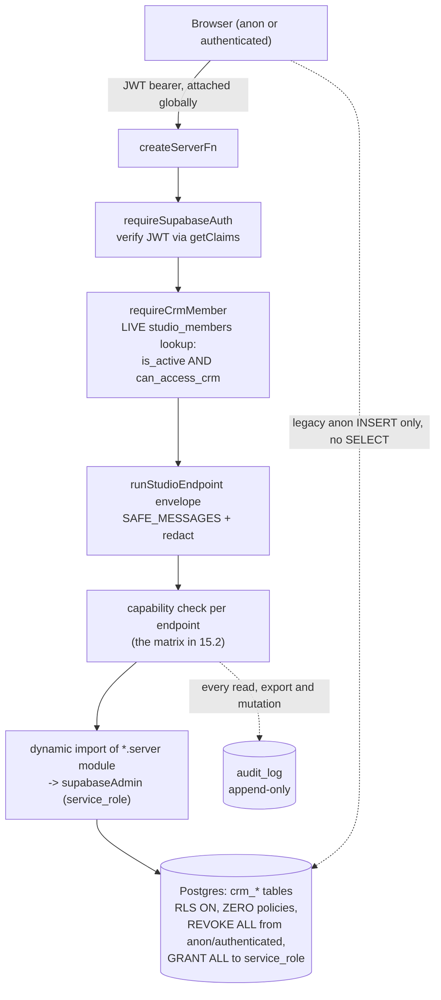

`[Repository fact]` Each box above already exists: `src/integrations/supabase/auth-middleware.ts` (`requireSupabaseAuth`), `src/features/forever-studio/studio-auth.ts:18-46` (`requireStudioMember`, which chains JWT verification into a live `studio_members` lookup inside the safe-error envelope), `src/features/forever-studio/server/errors.ts` (`runStudioEndpoint`), `src/integrations/supabase/client.server.ts:58-68` (the lazily-proxied `supabaseAdmin`), and `public.audit_log` (`supabase/migrations/20260707100000_fdb001_core_extensions_sources_audit.sql:119-139`). The CRM adds no new security primitive. It adds one capability flag and one middleware.

**The ten-second rule an agent must be able to hold in their head:**

> Reads are firm-wide. Writes are assignment-scoped. Export, erasure and consent editing are Director-only. Nothing reaches the browser except through a server function.

### 15.2 Role × capability matrix

`[Repository fact]` `public.studio_members.role` is `CHECK (role IN ('owner','trusted_publisher'))` (`supabase/migrations/20260721120000_forever_studio_v1.sql`), and there is no third role and no advisor persona anywhere in the schema. `[Recommendation]` Per the reuse map, the CRM persona is an **additive BOOLEAN capability column defaulting FALSE** (`can_access_crm`), following the `can_access_booth` precedent in PR #102 — **not** a third value in the role CHECK. Role labels below are the repository's own values plus capability flags; a different display label elsewhere changes the label only, never the semantics.

| Capability | `anon` (public web/booth visitor) | `booth_host`<br/>(`trusted_publisher` + `can_access_booth`) | `advisor`<br/>(`trusted_publisher` + `can_access_crm`) | `director`<br/>(`role='owner'`) | `system`<br/>(service_role, scheduled tick) |
|---|---|---|---|---|---|
| View own leads / contacts | ✗ | own booth sessions only | ✓ | ✓ | ✓ |
| View team leads | ✗ | ✗ | ✓ (no team tier exists — see 15.4) | ✓ | ✓ |
| View all leads | ✗ | ✗ | ✓ (read) | ✓ | ✓ |
| Reassign (change assignee) | ✗ | ✗ | ✓ own → pond only | ✓ any → any | ✓ SLA reclaim only |
| Merge contacts | ✗ | ✗ | ✗ (propose only) | ✓ | ✗ |
| Export (any bulk read leaving the app) | ✗ | ✗ | ✗ | ✓ (logged, row-counted) | ✗ |
| Delete / anonymize | ✗ | ✗ | ✗ | ✓ (via DSR workflow only) | ✓ retention job only |
| Edit consent record | ✗ | record a NEW consent row at capture | record a NEW consent row at capture | ✓ record + withdraw | ✓ withdrawal ingest |
| Configure policy (SLA, routing, retention, notice version) | ✗ | ✗ | ✗ | ✓ | ✗ |
| View financials (commission, deal value, attribution) | ✗ | ✗ | own deals only | ✓ | ✓ |
| View sensitive notes (internal-only notes) | ✗ | ✗ | ✓ | ✓ | ✗ |
| Admin members (grant/revoke `can_access_crm`, deactivate) | ✗ | ✗ | ✗ | ✓ | ✗ |
| Submit a lead (INSERT `public.leads`) | ✓ (current anon policy) | ✓ | ✓ | ✓ | ✓ |

`[Repository fact]` No row in this matrix is enforceable today: `public.leads` has RLS enabled with exactly one INSERT policy for `anon, authenticated` and **no SELECT policy** (`supabase/migrations/20260704132000_create_leads.sql:27-41`), so no human — Director included — can read a lead through the application at all.

**Three rows deserve an explicit justification, because they are the ones a reviewer will challenge:**

1. **"Edit consent record" is not an edit.** `[Recommendation]` Nobody, including the Director, may mutate a consent row. The capability is "append a new row." UPDATE and DELETE are revoked from the application role at the database level (§16.3). The column exists in the matrix only so the reader does not assume its absence means "nobody controls consent."
2. **Export is Director-only and is not a convenience.** `[Web research]` Every one of the five PDPC enforcement cases announced in Aug 2025 cited inadequate **security** measures rather than missing paperwork (https://www.hsfkramer.com/notes/data/2025-posts/pdpa-fines-and-firsts-a-6-year-timeline-of-thailands-data-privacy-enforcement). Bulk export by a departing advisor is the highest-likelihood, highest-impact exfiltration path this business has (§15.9).
3. **Advisors cannot merge.** `[Web research]` HubSpot documents that merging "cannot be undone" and that there is no way to separate the contacts afterwards; Salesforce ships no un-merge either. `[Recommendation]` An irreversible cross-record operation belongs behind the Director capability with a snapshot, per the tombstone-and-repoint rule in the Decision Brief §4.

### 15.3 The RLS decision (D3) — argued, with its cost stated

#### The repository evidence

| Evidence | Location | What it establishes |
|---|---|---|
| `auth.uid()` appears in **zero of 24** migrations | `supabase/migrations/` (24 files, grep for `auth.uid` returns no match in any) | There is no precedent for user-keyed RLS. Introducing it creates a second authorization paradigm. |
| "RLS on, NO policies: internal-only (audit_log pattern). Authorization is enforced at the app-server boundary, **never in the browser**." | `supabase/migrations/20260721120000_forever_studio_v1.sql:98-101` | The pattern is written down as doctrine, not accident. |
| `studio_listing_contacts`: "Never exposed to anon/authenticated: RLS on, no policies, service_role only." | `supabase/migrations/20260721120000_forever_studio_v1.sql:203-205` | The house pattern for buyer/contact PII already exists and is proven. |
| `studio_object_owners`: `REVOKE ALL ... FROM PUBLIC, anon, authenticated; GRANT ALL ... TO service_role;` | `supabase/migrations/20260722103000_studio_object_authorization.sql:19-21` | The grant/revoke half of the pattern is explicit, not implied. |
| `public.leads` has one INSERT policy and no SELECT policy | `supabase/migrations/20260704132000_create_leads.sql:27-41` | The write-only-from-the-browser posture is already load-bearing. |
| Every authenticated data path is a `createServerFn` behind `requireSupabaseAuth` | `src/features/forever-studio/studio-auth.ts:18-20`; 16 Studio endpoints | The app-server boundary is uniformly applied, not aspirational. |

#### The decision

`[Repository fact][Recommendation]` **Every CRM table is `ENABLE ROW LEVEL SECURITY` with zero policies, `REVOKE ALL` from `PUBLIC`, `anon` and `authenticated`, and a `GRANT` to `service_role` that is no wider than the table needs.** Authorization is enforced exclusively in `createServerFn` → `requireSupabaseAuth` → CRM membership middleware → capability check → `runStudioEndpoint` envelope. No CRM table gains an `auth.uid()` policy in v1.

**Two postures, not one.** `[Recommendation]` Mutable tables take `GRANT ALL`. Append-only tables put
`service_role` **in the `REVOKE` list** and then grant narrowly — because `service_role` is the only role
the application uses, so a `GRANT ALL` there makes append-only decorative. §6.4.6 is the full statement
and the list of which tables take which posture.

```sql
-- ILLUSTRATIVE DDL — NOT A MIGRATION. Do not apply.
-- Posture 1 — MUTABLE table (crm_contact, crm_task, crm_policy, crm_viewing, …)
ALTER TABLE public.crm_contact ENABLE ROW LEVEL SECURITY;
REVOKE ALL ON TABLE public.crm_contact FROM PUBLIC, anon, authenticated;
GRANT ALL ON TABLE public.crm_contact TO service_role;
COMMENT ON TABLE public.crm_contact IS
  'CRM identity spine. RLS on, NO policies: internal-only (audit_log pattern). '
  'Authorization is enforced at the app-server boundary, never in the browser.';

-- Posture 2 — APPEND-ONLY table (crm_consent_record, crm_activity,
-- crm_opportunity_stage_event, crm_routing_log, crm_merge_log, crm_outbox,
-- crm_intent_snapshot, crm_suppression). Note service_role in the REVOKE.
ALTER TABLE public.crm_opportunity_stage_event ENABLE ROW LEVEL SECURITY;
REVOKE ALL ON TABLE public.crm_opportunity_stage_event
  FROM PUBLIC, anon, authenticated, service_role;
GRANT INSERT, SELECT ON TABLE public.crm_opportunity_stage_event TO service_role;
```

#### The cost — stated honestly, because it is real

`[Inference]` This forfeits database-layer defence-in-depth. Concretely:

- A logic bug in a single server function — a missing capability check, a `where` clause that forgets the assignee filter — returns data the caller should not see, and **nothing else catches it**. Under `auth.uid()` RLS the database would have refused the rows regardless of what the application asked for.
- A leaked `SUPABASE_SERVICE_ROLE_KEY` is total compromise of every CRM row. `[Web research]` Supabase states the secret key carries `BYPASSRLS` and "skips any and all Row Level Security policies" (https://supabase.com/docs/guides/api/api-keys). RLS policies would not save you from a leaked service key either — but they *would* save you from the far more likely case of an ordinary authenticated session reaching a table it should not.
- A future contributor who adds a new `crm_*` table and forgets the `REVOKE`/`GRANT` block gets a table whose exposure depends entirely on default grants. `[Web research]` Supabase is explicit that objects exposed through the Data API without RLS "can be accessed by any role with matching grants" (https://supabase.com/docs/guides/api/securing-your-api).

**This is not free and the document does not pretend it is.** The decision is that a second, divergent authorization paradigm — one enforced in SQL, one enforced in TypeScript, disagreeing subtly — is a worse risk for a 5–15 person firm than a single well-tested boundary. That judgement is defensible only if the compensating controls below are actually built.

#### The compensating controls (all four are load-bearing; none is optional)

| # | Control | Why it substitutes for the missing DB layer | Precedent |
|---|---|---|---|
| C1 | **Bundle-boundary test.** A Vitest source-level test over the CRM's enumerated client-reachable file list asserting that none statically imports `client.server`, none contains the literal `supabaseAdmin`, and none contains the literal `SUPABASE_SERVICE_ROLE_KEY`. | The single failure mode that turns "server-only" into "shipped to the browser" is an errant static import. `[Repository fact]` TanStack Start co-locates server and client code; `src/integrations/supabase/client.server.ts:62` already carries the dynamic-import discipline as a comment, which is documentation, not enforcement. | `src/lib/lead-demo-mode-bundle-boundary.test.ts:51-56` already pins exactly this class of invariant by counting literal source occurrences. |
| C2 | **A single enumerated list of service-role call sites.** The design names every path allowed to touch `supabaseAdmin` and the doc is the allow-list: (1) public lead intake, (2) the scheduled SLA/reclaim tick, (3) contact merge, (4) PII erasure / DSR fulfilment, (5) authenticated CRM reads and mutations behind the membership middleware. Any sixth site is a review-triggering change. | `[Web research]` Supabase sanctions the secret key for "servers that implement prior authorization themselves" (https://supabase.com/docs/guides/api/api-keys) — the sanction is conditional on the authorization actually being there. An unenumerated boundary silently becomes service-role-everywhere. | `[Repository fact]` `src/integrations/supabase/client.server.ts:64-68` already funnels every service-role use through one proxy, so enumeration is cheap. |
| C3 | **Actor-scoped query keys.** Every CRM TanStack Query key ends in the signed-in `userId`, or the literal `"signed_out"`. | Without it, one advisor's cached lead list renders for the next person to sign in on the same browser during an auth transition. This is a real client-side confidentiality bug that no server control can catch. | `[Repository fact]` `src/features/forever-studio/components/StudioDashboard.tsx:57-60` does exactly this, with the reason written in the comment: the overview "must never reuse a prior publisher's query result while an authentication transition completes." |
| C4 | **Re-check LIVE membership at mutation time.** Every mutation re-reads `studio_members` for `is_active` **and** `can_access_crm` at the moment of the write. Never trust a role snapshot stored on a record, and never trust a snapshot taken at sign-in. | A director revoking access expects it to take effect on the next click, not on the next token refresh. `[Repository fact]` `studio_members.is_active` exists precisely so that "an inactive row denies access without losing attribution history" (`supabase/migrations/20260721120000_forever_studio_v1.sql:95-96`). | `[Repository fact]` `src/features/forever-studio/studio-auth.ts:38-42` resolves the actor from a live lookup on every server call. |

`[Recommendation]` Add a fifth, cheap control: the CRM's own `*-migration-contract.test.ts` asserting that every `crm_*` table in the illustrative DDL carries `ENABLE ROW LEVEL SECURITY`, a `REVOKE ALL` covering `PUBLIC`/`anon`/`authenticated`, and a `service_role` grant matching its posture in §6.4.6 — **including that every append-only table names `service_role` in its `REVOKE`** — so a future table cannot be added without it. `[Repository fact]` The precedent exists — `migration-contract.test.ts` already pins the live-membership requirement in the Studio suite. `[Repository fact]` **There is no CI in this repository** (no `.github/workflows`), so every one of these tests is enforceable only by a human running the suite locally. That weakens C1–C4 and must be said out loud rather than assumed away.

#### The review trigger, and the standard that binds if it fires

`[Recommendation]` **Trigger: if any browser is ever required to read CRM data directly** — a client portal, a Supabase Realtime subscription evaluated per-subscriber, an offline-capable mobile client, or an agent-facing surface that bypasses the server function for latency — **this decision is void and must be re-taken.** Do not add one `auth.uid()` policy "just for that one table."

If the trigger fires, the following is the binding implementation standard, recorded now so it is not researched under time pressure later:

| Rule | Evidence |
|---|---|
| Wrap every auth/helper call in a subselect: `(select auth.uid()) = owner_id`, never bare `auth.uid()`. Supabase's published benchmark: 11,000 ms → 10 ms on a complex policy. | `[Web research]` https://supabase.com/docs/guides/database/postgres/row-level-security and https://supabase.com/docs/guides/database/database-advisors?lint=0003_auth_rls_initplan |
| Always scope with `TO authenticated`. Policies with no `TO` clause execute for `anon` requests too (170 ms → <0.1 ms). | `[Web research]` https://supabase.com/docs/guides/troubleshooting/rls-performance-and-best-practices-Z5Jjwv |
| Exactly **ONE permissive policy per (table, action)**. Multiple permissive policies OR together, so adding one can only widen access — invisibly. | `[Web research]` https://supabase.com/docs/guides/database/database-advisors?lint=0003_auth_rls_initplan (lint 0006_multiple_permissive_policies) |
| Index every column a policy touches (`owner_id`, `assignee_id`, `contact_id`). Documented as >100× on large tables. | `[Web research]` https://supabase.com/docs/guides/troubleshooting/rls-performance-and-best-practices-Z5Jjwv |
| Filter the target table's column against a set-returning subquery; never join the protected table into its own policy (9,000 ms → 20 ms, and it is also the recipe for `infinite recursion detected in policy`). | `[Web research]` https://supabase.com/docs/guides/troubleshooting/rls-performance-and-best-practices-Z5Jjwv |
| Recursion-breaking `SECURITY DEFINER` helpers must be `LANGUAGE plpgsql` — **never `LANGUAGE sql`**, which the planner can inline, discarding the `SECURITY DEFINER` context and bringing the recursion back. | `[Web research]` https://supabase.com/docs/guides/database/postgres/row-level-security ; `[Inference]` the inlining consequence is community-documented rather than stated verbatim by Supabase — treat it as a defensive default, not a citation. |
| Put those helpers in a **non-exposed** schema. Supabase warns security-definer functions should never be created in an exposed schema; they do not need to be exposed to be used inside a policy, provided the policy schema-qualifies them. | `[Web research]` https://supabase.com/docs/guides/database/hardening-data-api and https://supabase.com/docs/guides/troubleshooting/do-i-need-to-expose-security-definer-functions-in-row-level-security-policies-iI0uOw |
| Layer **grants AND RLS** on every exposed object; keep internal tables out of the exposed schema entirely. | `[Web research]` https://supabase.com/docs/guides/api/securing-your-api |

#### Two things that must never be done, whether or not the trigger fires

- `[Web research]` **Never read authorization from `raw_user_meta_data` / `user_metadata`.** Supabase states it "can be updated by the authenticated user" — a user setting their own role is a complete authorization bypass (https://supabase.com/docs/guides/auth/managing-user-data). If authorization data ever lives on the user record at all, it belongs in `app_metadata`, which the user cannot write.
- `[Web research]` **Never put role, team or CRM capability in a JWT custom claim at this size.** Supabase documents plainly that claims are stale until the token refreshes: removing a user from a team and updating `app_metadata` "will not be reflected using `auth.jwt()` until the user's JWT is refreshed" (https://supabase.com/docs/guides/database/postgres/custom-claims-and-role-based-access-control-rbac). `[Inference]` For a firm where the Director revokes an advisor's access by hand and expects it to bite on the next click — typically the moment someone resigns — a stale claim is the exact failure you cannot tolerate. Join `studio_members` live (control C4). Defer the Custom Access Token Hook entirely; the research found no documented revocation story for it.

### 15.4 Least privilege, visibility and the Owner boundary

`[Web research][Recommendation]` **Do not build a record-level visibility model.** Salesforce's stated reason for making Leads private is "so that there's no potential for internal competition" — an artefact of large commissioned sales floors. Salesforce's own architecture guidance caps the role hierarchy at ten levels and ships a troubleshooting guide premised on people being unable to see records they need. At 5–15 advisors in one office, a layered sharing model costs more in confusion than it buys in confidentiality.

| Dimension | Decision | Rationale |
|---|---|---|
| Read scope | **Firm-wide** for any active member with `can_access_crm`. There is no "team" tier in v1. | `[Recommendation]` A pond of unclaimed leads only works if every advisor can see it. A "team" tier at this headcount is a permission surface with no corresponding organisational reality. |
| Write scope | **Assignment-scoped.** An advisor may mutate stage, log activity, and set next-action only on records where they are the current assignee (or where the record is in the pond and they are claiming it). | `[Web research]` Lofty's documented Owner/Assignee split: ownership is provenance and controls delete/merge/export; assignment is who works it. |
| Ownership | **Permanent credit; never revoked by reassignment.** | Decision Brief D4. |
| Reassignment | Advisor may return their own record to the pond. Only the Director may move a record from one named advisor to another. The scheduled tick may reclaim to the pond on the activity rule. Every one of these writes a `crm_routing_log` row. | `[Recommendation]` At this size the CRM's real political function is settling arguments about who got which lead; an unlogged reassignment is the argument. |
| Financials | Commission and attribution visible on **own** deals for advisors; firm-wide for the Director. | `[Inference]` This is the one place where restricting advisor visibility reduces friction rather than creating it. |

**The `assertObjectAccess` question, decided explicitly.** `[Repository fact]` `src/features/forever-studio/server/service.ts:205-211` implements: Owner sees everything; a `trusted_publisher` sees only rows whose `created_by` equals their own user id; and unattributed (`NULL`) rows are Owner-only by design — "One stable denial for another publisher AND legacy/unassigned data." `[Recommendation]` Reuse the **table** `studio_object_owners` for CRM attribution by extending its `object_type` CHECK in a new migration, exactly as the reuse map directs. Do **not** reuse `assertObjectAccess` as the CRM lead/contact read gate: its unattributed-is-Owner-only semantics would make every unassigned lead invisible to advisors, which is the pond, which is the product. Use it unchanged where its semantics are correct — private per-advisor artifacts such as a draft passport snapshot. Introduce a separate, three-line `assertCrmReadAccess(actor)` that admits any active member with `can_access_crm`. **This is a partial divergence from the audit's "reuse `assertObjectAccess` unchanged" verdict; the audit itself flagged the unassigned-lead question as one requiring an explicit decision, and this is that decision.**

**Owner (Director) access boundaries.** `[Recommendation]` The Director is not exempt from logging. Director reads of a contact detail, Director exports, and Director-initiated erasures all write `audit_log` rows with the same shape as anyone else's. `[Repository fact]` `studio_members` already enforces at most one self-bootstrapped owner via a partial unique index (`supabase/migrations/20260721120000_forever_studio_v1.sql:105-108`), so "who is the Director" is a database-enforced fact rather than a convention.

### 15.5 Sensitive notes: internal vs client-visible

`[Repository fact]` **Today there is no boundary at all.** `src/features/navigator/core/lead.ts:107-110` appends the booth staff note to the **same** `message` string that already contains guest-visible content (`answers.note`, the Forever Story, the recommendation, the match reasons), and that single string is written to `public.leads.message` (`src/lib/lead-service.ts:78`). The column is one free-text blob. A data-subject access request under PDPA s30 would therefore disclose the staff's private assessment of the guest alongside the guest's own words, because they are physically the same value.

`[Recommendation]` The CRM defines exactly two note visibilities and enforces the distinction structurally, not by convention:

| | `crm_activity.visibility = 'internal'` | `crm_activity.visibility = 'client_shareable'` |
|---|---|---|
| Who can read | Active CRM members only | Members, and the data subject on a DSR |
| Reaches a client-facing surface | Never | Only through a deliberate promotion action |
| Reaches a DSR export | Yes, as personal data of the subject — a private note **about** a person is still that person's personal data | Yes |
| Free-text allowed | Yes, with the sensitive-data guardrails of §16.5 | Yes |

`[Web research]` This mirrors the two-tier viewing-feedback pattern documented by iamproperty CRM: viewer submissions always land as Private, and an agent edits and promotes what should be shared — the agent is the editor, not a passive relay. `[Recommendation]` Adopt the same default-private-then-promote flow, and keep the original.

`[Recommendation]` Because DSR export includes internal notes, the guardrail is not "hide them" but "do not write things there that you would not defend." That is a training and UI-affordance problem (§16.5), not an access-control one.

### 15.6 Service-role boundaries and secret management

`[Repository fact]` `SUPABASE_SERVICE_ROLE_KEY` is read from `process.env` in exactly one file (`src/integrations/supabase/client.server.ts:34-48`), and the export is a lazy `Proxy` whose accompanying comment instructs callers to load it inside server handlers via dynamic import (`:62`).

`[Repository fact]` **There is no deployed environment to hold a secret.** Deployment is blocked (Cloudflare verdict E); `wrangler.jsonc` deploys nothing from this repository. `[Inference]` The consequence for this section is specific and slightly awkward: the CRM's secret-management design is currently unexercised. It cannot be validated, and no claim in this document should be read as saying it has been.

`[Recommendation]` Record now, so the first deploy does not improvise:

| Rule | Detail |
|---|---|
| Naming | The service-role secret is never a `VITE_*` variable. `VITE_*` is inlined into the client bundle by Vite; a `VITE_SUPABASE_SERVICE_ROLE_KEY` would be a published credential. |
| Storage | Cloudflare Worker **secret** (encrypted binding), never `vars` in `wrangler.jsonc`, never a committed `.env`. |
| Rotation | The design must survive rotation without a code change — one env read, one proxy, already true. Document the rotation runbook alongside the first deploy, not after. |
| Feature gating | The CRM console route is gated behind a **server-only, default-disabled** env flag and throws `notFound()` when disabled rather than rendering a login form. `[Repository fact]` This is PR #102's booth-v2 route-boundary pattern (`booth-route-boundary.ts`), the strongest reviewed authorization boundary currently proposed in the repository. |
| Blast radius | Assume the key is the crown jewel. `[Web research]` It carries `BYPASSRLS` (https://supabase.com/docs/guides/api/api-keys), and under D3 there is no second control behind it. |

### 15.7 Webhook verification

`[Repository fact]` **No webhook infrastructure exists.** There is no inbound HTTP endpoint, no signature verification, no replay window, and no HMAC code anywhere in `src/`; "webhook" appears only as an unimplemented capability descriptor in `src/features/forever-connectors/`. Anything below is greenfield.

`[Recommendation]` When the first inbound webhook arrives (realistically a BSP relaying WhatsApp events, per D6 — not before), the receiver has a fixed shape:

1. **Verify the signature against the RAW request bytes**, before any parsing. `[Web research]` Meta signs payloads with an HMAC-SHA256 keyed on the app secret, delivered as `sha256={signature}` in `X-Hub-Signature-256` (https://developers.facebook.com/docs/graph-api/webhooks/getting-started and https://developers.facebook.com/documentation/business-messaging/whatsapp/webhooks/overview). `[Web research]` The classic and expensive bug: frameworks that parse and re-serialise JSON change whitespace or key order, so the HMAC fails intermittently — or, worse, someone "fixes" it by skipping verification.
2. **Constant-time comparison**, then INSERT the raw payload into an append-only staging table and return 200 immediately. Process asynchronously off the durable row.
3. **Idempotency by provider message id**, with a UNIQUE constraint. `[Web research]` The WhatsApp-specific webhook doc says retries continue for up to 7 days while Meta's generic Graph API webhooks page gives 36 hours; the two primary pages conflict, so design for the longer window and make replay a no-op.
4. **Never trust a client-supplied fingerprint as the sole idempotency key.** `[Repository fact]` The house convention already states the client hash is never trusted (`public.ingestion_batches`).

### 15.8 The audit log: reads and exports, not just writes

`[Repository fact]` `public.audit_log` already has the right shape — `actor_id`, `actor_email`, `action`, `table_name`, `record_id`, `old_values`, `new_values`, `metadata`, `created_at`, with indexes on `(table_name, record_id)`, `actor_id` and `created_at`, RLS on with no policies and `GRANT ALL` to `service_role` (`supabase/migrations/20260707100000_fdb001_core_extensions_sources_audit.sql:119-139`). `[Repository fact]` Nothing on the lead path writes to it today.

`[Web research][Recommendation]` **Log reads and exports, not only mutations.** Every one of the five PDPC cases fined in Aug 2025 cited inadequate security measures (https://www.hsfkramer.com/notes/data/2025-posts/pdpa-fines-and-firsts-a-6-year-timeline-of-thailands-data-privacy-enforcement). In a small brokerage the realistic incident is not a database breach — it is a person walking out with the contact list. A write-only audit log cannot see that happen.

| Event class | Logged action | Payload |
|---|---|---|
| Contact detail viewed | `crm_contact_read` | `record_id`, actor, `metadata.surface` |
| List/search returning contact identifiers | `crm_contact_list_read` | actor, `metadata.row_count`, `metadata.filter_hash` |
| Any export leaving the app (CSV, passport send, print) | `crm_export` | actor, `metadata.row_count`, `metadata.format`, `metadata.reason` |
| Assignment / reassignment / reclaim | `crm_assignment_changed` | old/new assignee, rule matched |
| Consent recorded or withdrawn | `crm_consent_recorded` | consent row id (never the notice text — store the version) |
| DSR received / fulfilled / rejected | `crm_dsr_*` | request id, rejection reason code |
| Anonymization executed | `crm_pii_erased` | contact id, purpose set, **no old values** |

**Two hard constraints on this design:**

- `[Repository fact]` **`audit_log` cannot be an automation trigger.** `recordAuditSafely` swallows every write failure (`src/features/forever-studio/server/service.ts:711-718`: `catch (error) { logStudioFailure(...) }`). Anything that must not be missed — an SLA escalation, an erasure deadline — needs a transactional outbox row written in the same transaction as the fact, not an audit row.
- `[Web research][Recommendation]` **Do not log `old_values` for erasure events, and purge audit history on erasure.** A trigger-based or diff-style audit row stores the exact PII you were asked to erase. This is the single easiest way to fail a PDPA erasure request while believing you honoured it (Supabase's own audit guidance describes `old_record`/`new_record` jsonb capture: https://supabase.com/blog/postgres-audit). `[Web research]` Equally, do **not** reach for pgAudit as the CRM audit trail: it writes to Postgres logs rather than a queryable table (https://supabase.com/docs/guides/database/extensions/pgaudit), so you cannot answer "who read this contact" from it.
- `[Recommendation]` **Keep the forensic audit and the business timeline separate and never conflate them.** `audit_log` is machine-generated and nobody reads it daily; the CRM activity timeline is written deliberately by humans and is the thing advisors live in. Two tables, two purposes.

### 15.9 Threat model and abuse surface

#### The intake edge is currently unprotected — and that has a schema consequence

`[Repository fact]` The public lead INSERT has **no CAPTCHA, no Turnstile, no honeypot, no rate limit, no IP capture and no user-agent capture**. A repository-wide grep across `src/` for `captcha|turnstile|honeypot|rate limit` returns only unrelated hits in `src/features/forever-connectors/capability.ts`. There is no HTTP middleware layer to hook one into: `src/routes/` contains no API route files.

`[Repository fact]` `/booth` is an **unauthenticated public route**. `src/routes/booth.tsx:12-33` declares only `noindex, nofollow` meta and renders `<BoothNavigator />`; there is no `beforeLoad` guard, no session gate, no server check. `[Inference]` Therefore **`source='booth'` is not a trustworthy signal.** Anyone who knows the path can submit a lead that claims to have come from a staff-guided in-person session — including the "Staff note" block, which is attacker-controlled free text appended to `leads.message` (`src/features/navigator/core/lead.ts:107-110`). Any CRM routing, SLA or prioritisation rule keyed on `source='booth'` is keyed on an unauthenticated assertion. `[Recommendation]` Treat `source` as a *claim* until the emitting surface is authenticated; record a separate, server-derived `intake_trust` value (`server_verified` | `unauthenticated_claim`) and route on that.

`[Repository fact]` `leads.status` permits `'spam'` (`supabase/migrations/20260704132000_create_leads.sql:22-24`) but the value is **unreachable**: the anon INSERT policy hard-requires `status='new'` (`:37`), there is no UPDATE policy, and no code anywhere sets any other status. The one anti-abuse affordance in the schema cannot be used.

#### The threat table

| # | Threat | Likelihood | Current control | Proposed control |
|---|---|---|---|---|
| T1 | **Mass export by a departing advisor.** Copies the contact list on the way out. | High — this is the modal insider incident for a brokerage | None (no read path exists at all) | Export is a Director-only capability; every export writes `crm_export` with row count and reason; list reads log `row_count`; a Director-visible weekly digest of read/export volume per actor. Deactivating a `studio_members` row denies access on the next call (C4). |
| T2 | **Enumeration of contacts or deals via sequential/guessable identifiers.** | Medium | Not applicable yet | UUID primary keys only (already the house default: `gen_random_uuid()`); never expose an integer or a slug-based CRM id; every detail endpoint runs the capability check before the fetch, so a valid id in the wrong hands still returns the single stable denial. |
| T3 | **Injection into free text.** `message`, staff note, guest note are rendered into an advisor console, a passport, and potentially an email. | Medium | None | Render as text, never as HTML; never build SQL from free text (the house RPC rule is already "no dynamic SQL, `SET search_path = ''`, fully schema-qualified"); strip formula-leading characters (`= + - @ TAB CR`) on CSV export to prevent spreadsheet formula injection; never interpolate free text into a webhook or template payload without escaping. |
| T4 | **Compromised advisor account** (phished password, stolen device). | Medium | JWT verification only | MFA on all staff accounts `[LAWYER-adjacent: this is also the concrete PDPA s37(1) security measure]`; short session lifetime on the CRM route; live `is_active` re-check on every call so revocation is immediate; read logging makes the blast radius *measurable* after the fact, which is the difference between an incident report and a guess. |
| T5 | **Bot/spam flood on the anon INSERT.** Fills the pond, wastes SLA clock, poisons response-time metrics. | High once any lead alerting exists | None; `'spam'` status unreachable | Move intake behind a server function (D2) so a control point exists at all; then per-IP and per-normalized-phone rate limiting, a honeypot field, and a server-set `spam` status that the anon path could never write. Do **not** add a CAPTCHA to the booth tablet flow — it punishes the highest-intent channel. |
| T6 | **`source` spoofing** (see above) — a public submitter claiming booth provenance to jump the queue or inject a "staff note". | Medium | None; `/booth` is unauthenticated | `intake_trust` derived server-side; gate `/booth` behind the same server-only feature flag and membership check as the CRM console before any routing rule trusts it. |
| T7 | **Service-role key leakage into the client bundle.** | Low, catastrophic | Dynamic-import comment only | Control C1 (bundle-boundary test) + C2 (enumerated call sites). `[Repository fact]` With no CI, C1 runs only when a human runs it. |
| T8 | **Erasure that does not erase** — PII surviving in `audit_log.old_values`, in a PITR snapshot, or in a re-import. | High if unaddressed | None | §15.8 (no `old_values` on erasure, purge audit history), §16.7 (backup window decision), §16.8 (hash-keyed suppression list). |
| T9 | **A CRM read path accidentally exposing repository-internal strings.** | Medium | Partially controlled | `[Repository fact]` `unit_price_history` carries `source_file`/`source_page` repository paths and is revoked from anon/authenticated (`supabase/migrations/20260723130000_public_projection_privacy.sql`). Never join it into any CRM view. Raw Supabase/PostgREST/SQL text must never reach a CRM screen — new failures require new `SAFE_MESSAGES` entries. |

`[Web research][Recommendation]` One control deliberately **not** adopted: field-level security and a role hierarchy. Salesforce's layered model (org-wide defaults → role hierarchy → sharing rules → FLS) is genuinely expressive and genuinely expensive, and its own guidance caps the hierarchy at ten levels. At Forever's size it would add a permission surface nobody can reason about while adding no real confidentiality.

---

## 16. Privacy, consent and retention

> **⚠️ ARCHITECTURE RESEARCH — NOT LEGAL ADVICE.**
> This section is a system-design input for FOREVER-CRM-ARCH-001. It is written by an architect from published secondary sources and unofficial English translations, not by a lawyer. Every point tagged **[LAWYER]** must be confirmed by a Thai-qualified privacy practitioner before Forever relies on it. The PDPA English text used throughout is an unofficial translation; section numbers and durations must be checked against the Thai original before they are encoded into a schema or a policy document.

### 16.1 Why PDPA binds all of it, including the Russian and EU buyers

`[Web research]` Forever is established in Thailand, so PDPA applies to **all** of its processing regardless of where the buyer is or where the data is processed — Russian and EU buyer data is fully in scope, not only the data of people physically in Thailand. Forever is a **Data Controller**. (Primary text: https://www.mdes.go.th/law/detail/3577-Personal-Data-Protection-Act-B-E--2562--2019- ; Thai Royal Gazette: https://www.ratchakitcha.soc.go.th/DATA/PDF/2562/A/069/T_0052.PDF ; regulator: https://www.pdpc.or.th/) **[LAWYER]** confirm the establishment analysis and whether Forever's brokerage activity is a designated reporting entity under AMLA s16(4).

`[Repository fact]` A repository-wide grep for "PDPA" and "GDPR" returns **zero hits in any document**. There is no data-protection policy, no consent model, no retention rule and no erasure path anywhere in the repository — while `public.leads` has been collecting name, email, phone, country and free-text message from real people since migration `20260704132000`.

#### The one structural difference from GDPR that dominates the schema

`[Web research]` **The lawful basis attaches at COLLECTION (s24), and s27 then gates later use and disclosure on how the data was *originally* collected.** You cannot silently re-base data later. This is the opposite of the GDPR habit of picking a basis per processing operation.

`[Inference]` The schema consequence is concrete and it is why a boolean will not do:

| If you store… | Then this happens |
|---|---|
| `marketing_opt_in BOOLEAN` on the person row | You have recorded a state, not a basis. When someone asks "on what basis did you email this person," you have no answer, and s27 blocks the use you wanted. |
| The **s24 limb relied on, per person per purpose, at capture time, immutably** | Every later use is checkable against the basis actually recorded, and a re-based use becomes a visible schema violation rather than an invisible legal one. |

`[Web research]` The s24 limbs available to a brokerage: consent (the default); contract or pre-contract steps taken at the data subject's request; legitimate interests subject to a balancing test; legal obligation; vital interests; public task; research/archives. There is no journalism-style carve-out. `[Web research]` **Do not write "legitimate interest" into the schema as a label with no written balancing assessment behind it** — s24(5) is expressly qualified where the interest is overridden by the data subject's fundamental rights. **[LAWYER]** confirm which limb covers (a) a walk-in booth guest, (b) a website enquiry, (c) post-enquiry marketing, (d) a closed-deal client's KYC file.

### 16.2 Two dated constraints the Owner must see now

| Constraint | Date | Distance from 2026-07-28 | What it forces | Source |
|---|---|---|---|---|
| **PDPC access-request notification takes effect** | **14 September 2026** | **~7 weeks** | A `crm_dsr_request` table, a documented intake procedure, and — critically — **physical intake channels**. The notification requires at minimum an in-person/office and postal channel, with electronic optional. A web form alone does not discharge it. Also: identity verification, a cure period for incomplete requests, recorded refusal reasons, published fees, and a two-year retention of the request file. | `[Web research]` https://www.lexology.com/library/detail.aspx?g=c144fd43-9ba7-4065-a8ee-f1739ff3a11d (Tilleke & Gibbins, 20 Jul 2026 — Gazette 16 Jul 2026, effective 60 days later); corroborated at https://lexbangkok.com/data-subject-access-requests-thailand/ and https://www.grandlinux.com/en/blogs/pdpa-data-subject-access-request-2026.html |
| **Erasure must reach copies AND backups within 90 days** | In force (Notification effective 11 Nov 2024) | Already binding | This is a **backup-retention decision**, not an application feature, and it is painful to retrofit. See §16.7. | `[Web research]` https://www.lawplusltd.com/2024/08/rules-on-deletion-destruction-or-anonymization-of-personal-data/ |

`[Recommendation]` **Whatever else in this architecture slips, the DSR table and the two physical intake channels should not.** They are ~7 weeks out, they are cheap, and they are the part with a published date attached. **[LAWYER]** confirm the exact effective date and the minimum channel set against the Gazette text before Forever publishes a procedure.

### 16.3 The consent model (D8): an append-only evidential record

`[Web research]` s19 provides that non-compliant consent has **no binding effect at all**, and the administrative fine for consent-form failures reaches THB 1M. `[Web research]` s19 also requires the consent request to be "clearly distinguishable from the other matters" and bars conditioning a service on consent that is not necessary for it. To prove consent later you must be able to reproduce **the exact wording the person saw, in the language they saw it in, at the moment they saw it** (PDPC consent guidelines, machine translation: https://clinregs.niaid.nih.gov/sites/default/files/documents/thailand/PersonalDataConsentGuidelines-GoogleTranslation.pdf).

`[Web research]` **Do not store consent as a boolean on the person row.** It gets overwritten; it carries no timestamp, no method, no locale, no pointer to the wording shown and no withdrawal history.

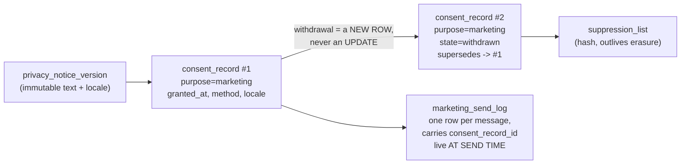

```sql
-- ILLUSTRATIVE DDL — NOT A MIGRATION. Do not apply.
-- Append-only enforced by the DATABASE, not by convention.
-- THIS IS THE ONLY DEFINITION of crm_consent_record in this document (§5.1a).
-- §6.4.3 cross-references it and defines nothing.

CREATE TABLE public.crm_privacy_notice_version (
  id              UUID PRIMARY KEY DEFAULT gen_random_uuid(),
  version_key     TEXT NOT NULL,                       -- e.g. 'booth-2026-09'
  locale          TEXT NOT NULL CHECK (locale IN ('th','en','ru')),
  body            TEXT NOT NULL,                       -- the EXACT wording shown
  effective_from  TIMESTAMPTZ NOT NULL,
  UNIQUE (version_key, locale)
);

CREATE TABLE public.crm_consent_record (
  id                UUID PRIMARY KEY DEFAULT gen_random_uuid(),
  contact_id        UUID NOT NULL REFERENCES public.crm_contact(id) ON DELETE RESTRICT,
  -- Plain TEXT in v1. The FK to crm_processing_purpose is DEFERRED: that table
  -- is v1-later (§5.1a) and a consent row must be writable before the purpose
  -- register exists. Add the FK in the same migration that creates the register.
  purpose_key       TEXT NOT NULL,
  state             TEXT NOT NULL CHECK (state IN ('granted','withdrawn','refused')),
  lawful_basis      TEXT NOT NULL,                     -- the s24 limb relied on AT COLLECTION
  notice_version_id UUID NOT NULL REFERENCES public.crm_privacy_notice_version(id),
  locale            TEXT NOT NULL,
  method            TEXT NOT NULL CHECK (method IN ('web_form','booth_tablet','in_person_paper','email','phone_recorded')),
  collected_by      UUID,                              -- studio_members user id, NULL for self-serve
  occurred_at       TIMESTAMPTZ NOT NULL DEFAULT now(),
  supersedes        UUID REFERENCES public.crm_consent_record(id),
  evidence          JSONB NOT NULL DEFAULT '{}'::jsonb -- form slug / URL / device, never free PII
);

-- Append-only is a GRANT, not a policy and not a code review comment.
ALTER TABLE public.crm_consent_record ENABLE ROW LEVEL SECURITY;
-- service_role IS IN THE REVOKE LIST. It is the only role the application
-- uses, and platform default privileges can grant it access to newly-created
-- tables — see 20260721123000_studio_internal_acl_hardening.sql:1-3 and §6.4.6.
-- Without service_role here, this entire guarantee is vacuous.
REVOKE ALL    ON TABLE public.crm_consent_record
  FROM PUBLIC, anon, authenticated, service_role;
GRANT  SELECT, INSERT ON TABLE public.crm_consent_record TO service_role;
-- Deliberately NOT granted: UPDATE, DELETE. Withdrawal is a new row.
-- Proven by a pg-test: has_table_privilege('service_role',
--   'public.crm_consent_record','UPDATE') = false  (§6.4.6).
-- NOTE: an erasure path still needs a privileged, separately-audited route to
-- redact a consent row's contact linkage; that route is the ONLY exception and
-- must be a named, logged function, never an ad-hoc grant.
```

| Rule | Why |
|---|---|
| **Withdrawal is a new row with a `supersedes` pointer**, never a mutation | `[Web research]` The entire evidential value of the record is that it cannot have been rewritten after the fact. |
| **Stores the exact notice wording VERSION, locale, method, timestamp** | `[Web research]` s19 requires reproducing what the person actually saw; a locale matters because a Russian buyer consented to Russian text. |
| **Marketing consent is a PHYSICALLY SEPARATE row from service consent, defaulting FALSE** | `[Web research]` s19 is explicit statutory text, not interpretation: a single "I agree to the terms and to receive marketing" checkbox is **void as to the marketing element**. |
| **Consent is re-checked at SEND time, not at list-build time, and `consent_record_id` is logged per send** | `[Web research]` The gap between building a segment and pressing send is where withdrawals get missed, and s32(2) makes the marketing objection absolute with no balancing test. |
| **Withdrawal must be as easy as giving it (s19)** | `[Web research]` Consent is given in one tap on a tablet, so "reply to this email to unsubscribe" is not equivalent. `[Recommendation]` A self-serve preference page in RU/EN/TH — which also quietly reduces DSR volume. |

`[Repository fact]` The only consent model anywhere in the repository is PR #102's booth-v2 two-consent contract (`consultationConsent` as the persistence gate, marketing opt-in defaulting false, DB-enforced). It is unmerged and booth-scoped, but it is the correct shape and should be treated as convergent evidence rather than a competing design. `[Repository fact]` `src/features/navigator/domain/models/client.ts:17` declares a `consentAcceptedAt` field on an entity that has **no table and no persistence** — vocabulary, not a foundation (D9).

### 16.4 Data minimization — and a flagged conflict with the shipped contract

`[Owner requirement]` The contact boundary should be **low friction: first name + a confirmable phone number, with email optional.**

`[Repository fact]` **The shipped contract requires the exact opposite, in three places at once:**

| Layer | Evidence | What it requires |
|---|---|---|
| Application validation | `src/lib/lead-service.ts:35-56` | `firstName`, `lastName`, `email` **and** `phone` are all required; email and phone are regex-checked. |
| Payload construction | `src/lib/lead-service.ts:71` | `name: \`${firstName} ${lastName}\`.trim()` — the two names are **concatenated into one column** and the split is destroyed at write time. |
| Database | `supabase/migrations/20260704132000_create_leads.sql:4-21` | `name TEXT NOT NULL`, `email TEXT NOT NULL` with `leads_email_format` regex, `phone TEXT NOT NULL` with `leads_phone_not_empty` + `leads_phone_format`. |
| RLS policy | `supabase/migrations/20260704132000_create_leads.sql:36-41` | The INSERT policy's `WITH CHECK` independently requires non-empty `name`, `email` **and** `phone`. |
| Source-level test | `src/lib/lead-demo-mode-bundle-boundary.test.ts:51-56` | Pins exactly one `submitLead` and exactly one `from("leads")` occurrence — so the contract cannot be forked, only changed. |

**This is a breaking change to an existing contract, not an additive one — and this document says so plainly rather than quietly complying or quietly ignoring.** `[Repository fact]` `validateLead` is shared *verbatim* by the website `ContactForm` and the Booth form, so relaxing it changes both channels simultaneously. Relaxing the DB side requires dropping a NOT NULL and rewriting a CHECK, which is a non-additive migration.

`[Recommendation]` **The migration path, in order, with the sequencing dependency named:**

1. **Do not race PR #102.** `[Repository fact]` PR #102 already drops `NOT NULL` from `leads.email` and replaces `leads_email_format` with a NULL-tolerant CHECK (migration `20260725150000`) precisely so phone-only booth leads can exist. That is the **same change** this requirement needs. Treat it as convergent evidence and sequence after it; do not write a second, competing migration.
2. **Relax the application contract to `firstName` + `phone` required, `lastName` and `email` optional** — one change in `src/lib/lead-service.ts`, which both channels inherit. Update the bundle-boundary test's pinned strings in the same change.
3. **Split the name at the CRM boundary, not in `leads`.** `crm_contact` carries `given_name` and `family_name` separately; `public.leads.name` stays as the append-only record of what the form actually received. `[Recommendation]` Never try to un-concatenate historical rows algorithmically — Cyrillic and Thai naming order make that a data-corruption exercise. Leave history as-is and improve going forward.
4. **The anon INSERT policy's `WITH CHECK` must be relaxed in the same migration as the column constraints**, or the policy will reject a valid phone-only lead even after the CHECK allows it. This is easy to miss because the requirement is stated twice.
5. **Never reject a lead whose phone fails validation.** `[Web research]` Genuinely working numbers fail `isValidNumber` (extra trailing digits, renumbering transitions, locally-dialled forms), and `isValidNumberForRegion` is warned against because "many people have phone numbers that do not belong to the country they live in" — an exact description of Forever's buyers. Store, flag, do not block.

`[Recommendation]` Minimization also means **not** collecting fields the CRM has no purpose for. Per-stage required fields (capture ~3 fields; require budget/timeline only to advance past qualified) is the documented pattern that keeps the intake form short without losing data quality later.

### 16.5 Sensitive data (s26) — the only tier carrying imprisonment

`[Web research]` s26 is the only part of the PDPA carrying **imprisonment**, and the list is precise: racial or ethnic origin, political opinions, cult/religious or philosophical beliefs, sexual behaviour, criminal records, health data, disability, trade-union information, genetic and biometric data (https://www.linklaters.com/en/insights/data-protected/data-protected---thailand).

#### The primary leak route is the notes box, and it is not a hypothetical

`[Repository fact]` Today, the booth "Staff note" free-text field (`src/features/navigator/booth/BoothLeadForm.tsx:189-190`) is appended into the same `leads.message` blob as guest-visible content (`src/features/navigator/core/lead.ts:107-110`). `[Inference]` A small, high-touch advisory team **will** type health, religion and family details into a notes box — that is what notes boxes are for. "Wife is pregnant, needs ground floor," "can't do Fridays," "recovering from surgery, wants a lift building" are useful, natural things for an advisor to write, and every one of them is s26 data in free text with no gate.

`[Recommendation]` **The fix is structured neutral alternatives, not a policy telling people not to type things.** Give the advisor a better place to put the thing they actually need:

| The thing the advisor needs to record | The s26-adjacent free-text version | The structured neutral field |
|---|---|---|
| Buyer needs step-free access | "wife had surgery, can't do stairs" | `accessibility_step_free BOOLEAN` |
| Buyer unavailable on certain days | "observant, no Friday viewings" | `unavailable_weekdays TEXT[]` |
| Family size drives unit size | "expecting twins in March" | `occupants_adults`, `occupants_children`, `move_in_earliest DATE` |
| Dietary/hospitality preference for a site visit | "halal only" | `hospitality_note` from a controlled vocabulary |
| Buyer travels with a carer or assistant | "carer for elderly mother" | `accompanying_party_count` |

`[Recommendation]` Pair this with (a) a short inline hint on the notes field naming the categories not to type, (b) treating notes as in-scope for DSR export so advisors know the buyer can read them (§15.5), and (c) a periodic Director review of notes volume rather than an automated scanner — a keyword scanner over Russian, Thai and English free text will produce false confidence.

#### Identity documents stay out of the CRM

`[Web research]` **Thai national ID cards carry religion and passports carry place of birth** — both are routes into s26, which is the criminal tier. `[Web research]` AMLA will require identity verification for a real-estate broker (AMLO's own s16 listing includes "Real estate brokers or agents": https://mfiu.gov.mm/sites/default/files/document/files/AMLO%20-%207%20-Thailand%27s%20AML-CFT%20System%20-%20Power%20Point.pdf ; 2026 framework overview: https://www.juslaws.com/articles/anti-money-laundering-thailand-2026-compliance-guide).

`[Recommendation]` **Passport and ID images never enter the CRM.** They live in a separate storage bucket with its own access policy, its own audit log, and a retention tied to the AMLA period. The CRM stores only the minimal structured fields extracted (document type, last four characters, expiry, verified-by, verified-at) and a **reference** to the document. `[Repository fact]` The repository already has the right primitives: `public.documents` carries `storage_bucket`/`storage_path`/`is_public`/`requires_request`/`valid_until`, and `studio_listing_contacts` is the proven private-PII pattern (separate table, RLS on, no policies, service_role only). **[LAWYER]** confirm what CDD data AMLA actually obliges Forever to hold, and for how long.

#### Do not build a nationality-as-ethnicity segmentation field

`[Web research]` Nationality is not on the s26 list, so storing it is lawful. `[Recommendation]` But do **not** build a `nationality` field and then use it as an ethnicity proxy for marketing segmentation — segmenting by "Russian" and recording that in a way that reads as ethnic profiling moves toward s26 territory, where the penalty tier includes imprisonment. `[Recommendation]` What the business actually needs is **`preferred_language`** (`ru`/`en`/`th`) and **`billing_country`** — two fields that do the operational work (routing, template selection, FX) without asserting anything about ethnicity. `[Repository fact]` `public.leads.country` exists today as unconstrained TEXT with no stated purpose; the CRM should not inherit it as a segmentation key.

### 16.6 Retention: per purpose, not per person

`[Web research]` **Retention modelled on the person record is wrong and diverges the moment a deal closes.** A closed-deal buyer's KYC and transaction records must be *kept* for the AMLA/accounting period even if that same person withdraws marketing consent the next day. A per-person retention date forces you to choose one, and you will choose wrong.

`[Web research][Recommendation]` **Anchor every duration to a named external statute, never to an invented number.** "We keep leads for 3 years" is arbitrary and indefensible. Model the register as **data**, not as a Word document — a `crm_processing_purpose` table with purpose key, s24 limb, data categories, recipients, retention rule and transfer mechanism can drive the privacy notice text, the retention job and the s39 record from one source of truth.

```sql
-- ILLUSTRATIVE DDL — NOT A MIGRATION. Do not apply.
CREATE TABLE public.crm_processing_purpose (
  purpose_key        TEXT PRIMARY KEY,
  description        TEXT NOT NULL,
  lawful_basis       TEXT NOT NULL,          -- the s24 limb
  data_categories    TEXT[] NOT NULL,
  recipients         TEXT[] NOT NULL,        -- incl. cross-border processors
  retention_rule     TEXT NOT NULL,          -- ISO-8601 duration + anchor event
  retention_authority TEXT NOT NULL,         -- the NAMED statute or business rule
  transfer_mechanism TEXT                    -- SCC / consent / contract-necessity
);
```

| Purpose | Retention anchor | Duration | Authority | Confidence |
|---|---|---|---|---|
| Unconverted enquiry (no deal) | Last meaningful contact | Short, business-set (order of 12–24 months) | Business rule; must be **written down and justified**, not invented per-case | `[Recommendation]` — no statute mandates this; it is a minimization decision |
| Marketing contactability | Consent grant, ends at withdrawal | Until withdrawn; then suppression-hash only | PDPA s19/s32 | `[Web research]` **[LAWYER]** |
| Closed-deal KYC / CDD | End of business relationship | Per AMLA CDD retention period | AMLA s16 designated-business obligations | `[Web research]` **[LAWYER]** — confirm the exact period and whether Forever is in scope |
| Accounting records | Fiscal year end | **Not less than 5 years** | Accounting Act B.E. 2543 s14 (https://www.samuiforsale.com/law-texts/accounting-act.html) | `[Web research]` **[LAWYER]** |
| Consent evidence | Consent event | Outlives the relationship — it is the proof the relationship was lawful | PDPA s19 evidential need | `[Inference]` **[LAWYER]** |
| DSR request file | Request closure | **2 years** | PDPC access-request notification (eff. 14 Sep 2026) | `[Web research]` **[LAWYER]** |
| Audit log of reads/exports | Event | Aligned to the longest security-investigation need; **never** longer than the erasure obligation permits for the PII it contains | PDPA s37(1) security measures | `[Recommendation]` |

`[Recommendation]` **Anonymize in place; never hard-delete a contact.** `[Web research]` Deleting cascades into deals and destroys the funnel history an evidence-led brokerage's entire positioning rests on. Use `ON DELETE RESTRICT` from the deal-party junction so the database refuses the shortcut. And — the non-obvious half — **purge the audit history in the same transaction**, because a diff-style audit row stores the exact PII you were asked to erase.

`[Repository fact]` One repository-specific hazard: PR #102's `booth_complete_session` **hard-DELETEs** a booth lead on a no-contact outcome. Any CRM foreign key into `public.leads` must tolerate that — no `ON DELETE RESTRICT` or `NO ACTION` pointing at `leads`.

### 16.7 The backup problem — a decision, not a task

`[Web research]` Erasure must reach personal data "including their copies and backups" within **90 days**, with interim protective measures if that is not achievable, and it requires a verification system. `[Inference]` A default Supabase PITR/snapshot configuration will retain deleted rows well past 90 days, so "we ran a DELETE" is not compliance.

`[Recommendation]` Three viable options — **pick one before configuring the database, because retrofitting is painful:**

| Option | What it means | Cost |
|---|---|---|
| **A. Keep PITR/snapshot retention under 90 days** | Simplest and self-enforcing | Reduces disaster-recovery window; a corruption discovered on day 100 is unrecoverable |
| **B. Erasure ledger replayed against any restored snapshot** | Keep a durable ledger of erased subject hashes; any restore runs the ledger before the database is accepted back into service | Requires the restore runbook to actually exist and be tested; a restore performed under pressure will skip it unless it is automated |
| **C. Per-subject encryption with a destroyable key** | Crypto-shredding: destroy the key, the backup ciphertext is inert | Most robust, most complex; disproportionate at this size |

`[Recommendation]` **Option A + a documented restore-time ledger check (a light form of B)** is the proportionate answer for a firm this size. `[Repository fact]` This decision is currently unmakeable in practice because **no deployed environment exists** — which is an argument for deciding it now, while it is free, rather than after the first production restore. **[LAWYER]** confirm the 90-day scope and whether interim protective measures are acceptable for backup media.

### 16.8 Data-subject requests, and the suppression list that outlives erasure

```sql
-- ILLUSTRATIVE DDL — NOT A MIGRATION. Do not apply.
CREATE TABLE public.crm_dsr_request (
  id                  UUID PRIMARY KEY DEFAULT gen_random_uuid(),
  received_at         TIMESTAMPTZ NOT NULL DEFAULT now(),
  channel             TEXT NOT NULL CHECK (channel IN ('office','post','email','web_form','phone')),
  request_type        TEXT NOT NULL CHECK (request_type IN
                        ('access','copy','rectification','erasure','restriction',
                         'objection','portability','withdraw_consent')),
  subject_contact_id  UUID REFERENCES public.crm_contact(id) ON DELETE SET NULL,
  identity_verified_at TIMESTAMPTZ,
  identity_method     TEXT,
  completeness_cured_at TIMESTAMPTZ,          -- the cure period for incomplete requests
  -- Generated, not hand-typed: the clock is the thing that gets missed.
  due_at              TIMESTAMPTZ GENERATED ALWAYS AS
                        (received_at + INTERVAL '30 days') STORED,
  extended_to         TIMESTAMPTZ,            -- documented extension, with a reason
  extension_reason    TEXT,
  outcome             TEXT CHECK (outcome IN ('fulfilled','rejected','withdrawn','partially_fulfilled')),
  rejection_reason_code TEXT,                 -- records of rejection are themselves required
  rejection_rationale TEXT,
  fulfilled_at        TIMESTAMPTZ,
  fee_charged_minor   BIGINT,
  retain_until        TIMESTAMPTZ             -- request file kept ~2 years
);
```

`[Web research]` The 2026 notification converts a vague duty into a dated workflow: completeness and identity verification, a cure period for incomplete requests, 30-day completion, an extension of up to a further 30 days with justification, recorded refusal reasons, published fees, and retention of the request file. `[Web research]` **A web form alone does not discharge the notification** — an office and postal channel are the minimum, with electronic optional. `[Recommendation]` That means the 14 September 2026 work has a **process** half (a named person, a monitored postal address, a walk-in procedure at the booth and office) as well as a schema half, and the process half is the part that gets forgotten.

`[Recommendation]` **Do not build a self-serve erasure button.** Identity verification is a required step and an unverified erasure is itself a breach (an attacker erases a rival's client record, or worse, uses erasure as reconnaissance). The self-serve surface is the **preference/withdrawal page** (§16.3); erasure runs through the DSR workflow with a human verification step.

#### The suppression list, keyed on a hash

`[Web research][Recommendation]` If you honour erasure by removing the person, **the next import re-creates them and you market to someone who objected** — which is exactly the violation you were trying to avoid.

```sql
-- ILLUSTRATIVE DDL — NOT A MIGRATION. Do not apply.
-- THIS IS THE ONLY DEFINITION of crm_suppression in this document (§5.1a).
CREATE TABLE public.crm_suppression (
  -- A keyed hash of the normalized identifier. Never the identifier itself:
  -- the whole point is that this row survives erasure of the person.
  identifier_hash  BYTEA PRIMARY KEY,
  identifier_kind  TEXT NOT NULL CHECK (identifier_kind IN ('phone','email')),
  reason           TEXT NOT NULL CHECK (reason IN ('erasure','marketing_objection','bounce','manual')),
  suppressed_at    TIMESTAMPTZ NOT NULL DEFAULT now(),
  source_dsr_id    UUID REFERENCES public.crm_dsr_request(id) ON DELETE SET NULL
);

ALTER TABLE public.crm_suppression ENABLE ROW LEVEL SECURITY;
ALTER TABLE public.crm_dsr_request ENABLE ROW LEVEL SECURITY;
-- service_role is revoked first, per §6.4.6. A suppression row is never
-- EDITED — it is added, or it is lifted by deleting it, which is itself an
-- audited act. There is no legitimate UPDATE.
REVOKE ALL ON TABLE public.crm_suppression
  FROM PUBLIC, anon, authenticated, service_role;
GRANT INSERT, SELECT, DELETE ON TABLE public.crm_suppression TO service_role;
REVOKE ALL ON TABLE public.crm_dsr_request FROM PUBLIC, anon, authenticated;
GRANT ALL ON TABLE public.crm_dsr_request TO service_role;
```

`[Recommendation]` Use a **keyed** hash (HMAC with a server-held pepper), not a bare SHA-256 of a phone number — the phone-number keyspace is small enough to enumerate offline. Check suppression at intake **and again at send time**. `[Inference]` A suppression row is itself arguably personal data; keeping it is defensible precisely because it is the mechanism that gives effect to the subject's own objection. **[LAWYER]** confirm.

### 16.9 Cross-border transfers

`[Web research]` **Supabase, Cloudflare and any US email/analytics provider are cross-border transfers** under PDPA s28/s29. `[Web research]` The PDPC published the two cross-border notifications on 25 December 2023 — the Adequacy Decision Criteria Notification and the Cross-Border Transfer Notification (https://www.linklaters.com/en/insights/blogs/digilinks/2024/january/thailand---new-rules-for-transborder-dataflow ; https://www.dataprotectionreport.com/2024/01/thailand-the-regulation-with-respect-to-cross-border-transfer-of-personal-data/).

`[Web research]` **No published Thai adequacy allowlist was found**, and Thailand does not appear on the European Commission's current adequacy list (checked 2026-07-28: https://commission.europa.eu/law/law-topic/data-protection/international-dimension-data-protection/adequacy-decisions_en). `[Inference]` For a small brokerage with no corporate group, **SCCs are the realistic route**; the PDPC accepts the EU GDPR SCCs with limited modification, and BCRs are for corporate groups. **[LAWYER]** confirm the current allowlist status and whether the PDPC has since published one.

`[Recommendation]` Build a **`crm_data_transfer_register`** (the `crm_` prefix is not optional — §6.1) **and populate it BEFORE signing any vendor**, not after:

| Vendor | Role | Data | Region | Mechanism | Status |
|---|---|---|---|---|---|
| Supabase | Processor (database, auth, storage) | All CRM personal data | Hosted region — must be recorded, not assumed | DPA + SCC | To confirm |
| Cloudflare | Processor (edge, Workers) | Request metadata, IP | Global edge | DPA + SCC | To confirm |
| Email provider (none yet) | Processor | Contact email, message body | To be chosen | DPA + SCC | `[Repository fact]` No provider exists — no `resend`/`sendgrid`/`postmark`/`nodemailer` dependency and no credential pattern anywhere |
| WhatsApp BSP (none yet) | Processor | Phone, message content | To be chosen | DPA + SCC | Deferred by D6 |
| Analytics/pixels | Processor / joint controller | Visitor identifiers | — | See §16.10 | **Decision point** |

`[Recommendation]` The register is a **table in the CRM**, not a spreadsheet, so it can drive the privacy notice's recipients list from one source of truth (§16.6).

### 16.10 The EU-targeting decision — an Owner decision, not an engineering one

`[Web research]` Mere accessibility of a website from the EU does **not** trigger GDPR Art 3(2); the EDPB's two-step test requires an apparent intention to offer goods or services to, or to monitor, people in the Union (EDPB Guidelines 3/2018: https://www.edpb.europa.eu/system/files/documents/files/file1/edpb_guidelines_3_2018_territorial_scope_after_public_consultation_en_1.pdf).

`[Web research]` But each of the following pushes toward Art 3(2) applying, and Art 27 then requires a designated EU representative in writing, established in a Member State where the data subjects are (https://gdpr-info.eu/art-27-gdpr/):

| Signal | Effect |
|---|---|
| Pricing displayed in **EUR** for EU buyers | Evidence of targeting |
| **EU-targeted ad campaigns** (geo-targeted spend) | Strong evidence of targeting |
| **Analytics or retargeting pixels firing on EU visitors** | Monitoring of behaviour — the second limb of Art 3(2) |
| EU-language site versions beyond a lingua franca | Contributory evidence |

`[Recommendation]` **Frame this to the Owner as a business decision with a price tag, not as a compliance checkbox.** If Forever wants EU-targeted acquisition, the cost includes a paid Art 27 representative — the "occasional processing" derogation is unlikely to hold for a continuously-operating CRM. If Forever does not want that cost, the engineering consequence is concrete and enforceable: no EUR price display, no EU ad geo-targeting, and no third-party analytics/retargeting pixel on EU visitors. **Write the decision down either way**, because the expensive version of this conversation is the one that happens after the campaign has already run. **[LAWYER]** confirm the Art 3(2) analysis against Forever's actual marketing footprint.

### 16.11 Two more records worth building before scale

`[Web research][Recommendation]` **Model the two breach timestamps separately from day one:** `detected_at` (first alert) and `became_aware_at` (reasonable belief a breach occurred, following preliminary assessment). The **72-hour clock hangs off the second, not the first** (PDPC clarification: https://privacymatters.dlapiper.com/2025/02/thailand-pdpcs-clarification-on-personal-data-breach-notification/ ; the underlying notification: https://www.tilleke.com/insights/thailand-pdpc-notification-on-data-breaches/10/). Add `pdpc_notified_at`, `delay_justification`, `high_risk` and `data_subjects_notified_at`. `[Inference]` Retrofitting a single `breach_detected_at` column into two is a schema change made during an incident, which is the worst possible time.

`[Web research][Recommendation]` **Do not assume the SME RoPA exemption saves you.** The s39 exemption (in force 20 June 2022) is disapplied where processing is likely to risk rights and freedoms, where processing is not occasional, or where s26 data is involved — and a CRM is continuous by definition (https://www.kennedyslaw.com/en/thought-leadership/article/guidelines-on-key-compliance-requirements-for-the-personal-data-protection-act-in-thailand/). `[Web research]` Similarly, **do not conclude "we're small so no DPO is needed" without writing the assessment down**: the 100,000-data-subject threshold is only one limb of the DPO notification, which also catches activities involving regular tracking, monitoring or analysis (https://www.tilleke.com/insights/thailand-releases-notification-on-data-protection-officer-appointment/25/). **[LAWYER]** confirm both.

`[Web research]` **Set a calendar reminder** to re-check (a) the status of the draft PDPA amendment bill that went to consultation in late 2025 — proposals touch controller/processor definitions, sensitive-data classification and the "freely given" consent standard — and (b) whether the PDPC has published an adequacy allowlist (https://practiceguides.chambers.com/practice-guides/data-protection-privacy-2026/thailand/trends-and-developments). `[Web research]` **Do not rely on any specific number in this section without checking the Thai text**: the English PDPA is an unofficial translation and the consent guideline was read via machine translation.

### 16.12 The honest priority

`[Web research]` **Every one of the five PDPC cases fined in Aug 2025 cited inadequate SECURITY measures.** Across those five cases and eight orders the total exceeded THB 21.5M, and none appears to have turned on a missing privacy policy (https://www.hsfkramer.com/notes/data/2025-posts/pdpa-fines-and-firsts-a-6-year-timeline-of-thailands-data-privacy-enforcement).

`[Recommendation]` So the build order is not the order a compliance checklist would give you:

| Order | Work | Why here |
|---|---|---|
| 1 | **Access control**: RLS-on/no-policies + revoke/grant on every CRM table; MFA on every staff account; no service-role key outside the enumerated call sites; the bundle-boundary test | This is what gets fined |
| 2 | **Logging of reads and exports**, not just writes (§15.8) | You cannot demonstrate an adequate security measure you cannot evidence |
| 3 | **Consent record + notice versions** (§16.3) | Evidential, dated, and cheap now / impossible retroactively |
| 4 | **DSR table + physical intake channels** (§16.8) | Has a published date: 14 September 2026 |
| 5 | **Retention register + erasure pipeline incl. backups** (§16.6, §16.7) | The backup decision must precede the first production database configuration |
| 6 | **Transfer register** (§16.9) | Populate before signing, not after |
| 7 | **The published privacy policy** | Necessary — but it discharges one obligation (s23 notice) out of five, and it is the one that is easiest to write and least likely to be the thing that fails |

**A published privacy policy is not the compliance deliverable.** Notice (s23), lawful basis (s24), consent evidence (s19), records (s39) and security (s37(1)) are five distinct obligations. Access control and logging beat documentation.

---

*Part D ends. Sections 15 and 16 correspond to deliverables 11 and 12 of FOREVER-CRM-ARCH-001.*

---

## 17. Information architecture principles

### 17.1 The three questions every screen answers in ten seconds

The design target is not "a CRM". The design target is: an agent standing in a project sales lobby, one hand
on the phone, bad light, thirty seconds before a client walks back from the bathroom. `[Owner requirement]`

Every screen in this system must answer three questions **without a tap, without a scroll, and without a
filter**:

| # | Question | What it means operationally | Where the answer comes from |
|---|---|---|---|
| Q1 | **What needs me now?** | Overdue commitments, unclaimed leads with a running SLA clock, escalations | open work items ordered by `due_at`; unclaimed-pond count; SLA-breach count |
| Q2 | **What did I promise?** | The next action I personally committed to, and when | `next_action_at` + `next_action_note` on every **active** record — DB-enforced by INV-O1, which exempts `nurture` and `spam`; a nurture record carries `next_review_at` instead (INV-O4) |
| Q3 | **What happened last?** | The most recent inbound and the most recent thing we did | head of the append-only activity stream for that contact |

`[Recommendation]` **Rule IA-1 — the three-line row.** Every list row in the product (work queue, pond,
timeline, search result) renders as exactly three lines: *who + language + clock*, *what I promised*,
*what happened last*. A row that cannot answer all three is a row that will be ignored. This is the single
formatting rule that makes the whole product legible on a phone.

`[Repository fact]` Nothing in the repository answers any of these three questions today. `public.leads` has
RLS enabled with a single INSERT policy and **no SELECT policy** (`supabase/migrations/20260704132000_create_leads.sql:32-41`);
the only application access is one browser-side insert at `src/lib/lead-service.ts:92`; and `src/routes/`
contains no lead-facing route. There is no queue, no timeline, no next-action field and no assignment concept
to render. Part E therefore designs a surface with no incumbent to be compatible with — the only real
constraint is the shipped intake path.

### 17.2 Progressive disclosure rules

`[Recommendation]` Five rules, applied to every screen in §18. They are stated as testable constraints so a
reviewer can reject a screen for breaking one.

| Rule | Constraint | Why |
|---|---|---|
| **PD-1** | At most **five** items above the fold on a 375 px viewport. Item six requires a scroll. | A queue longer than five is a to-do list, not a decision. Truncation forces the ranking to be correct. |
| **PD-2** | Exactly **one** primary action per screen, rendered as a filled control in the bottom thumb zone. Everything else is secondary (outline) or tertiary (text). | If two things are primary, neither is. |
| **PD-3** | Anything an agent does daily is **≤ 1 tap** from `My Work Today`. Anything done weekly is ≤ 2. Anything monthly may be ≥ 3 or Owner-only. | Tap depth is the adoption budget. Spend it on logging, not navigation. |
| **PD-4** | A field that is **not required to enter the current stage** is not rendered in the default view. It lives behind a `More ▸` disclosure on the record. | Per-stage field scoping — see §17.4. |
| **PD-5** | **No horizontal scroll on the page body at 375 px.** Wide content (tables, routing log) scrolls inside its own container. | One-handed use breaks the moment the page pans sideways. |

`[Repository fact]` PD-5 has a repository precedent to copy rather than invent: the Studio shell constrains
every screen with `mx-auto flex h-14 w-full max-w-3xl items-center` for the header bar and
`mx-auto w-full max-w-3xl px-4 pb-24 pt-6` for the main region
(`src/features/forever-studio/components/StudioShell.tsx:18,32`). The `pb-24` bottom padding is exactly the
gutter a fixed bottom navigation bar needs — reuse the value, do not re-derive it.

### 17.3 What we deliberately do not build (the anti-Salesforce list)

`[Recommendation]` Complexity is not a side effect of features; it is a side effect of *configurable*
features. The following are named as **out of scope for v1**, each with the evidence that makes the omission
defensible rather than lazy.

| Not built in v1 | Concretely, this means | Evidence |
|---|---|---|
| **Record-level sharing UI** | No org-wide-default picker, no role hierarchy, no sharing rules, no "who can see this" panel. Every CRM member sees every contact. | `[Web research]` Salesforce's own architecture guidance caps role hierarchies at "no more than 10 levels" and ships a sharing-troubleshooting guide — https://architect.salesforce.com/docs/architect/fundamentals/guide/platform-sharing-architecture . Its stated business rationale for private Leads is preventing internal competition (https://help.salesforce.com/s/articleView?id=platform.security_sharing_owd_about.htm&language=en&type=5), which is an artefact of large commissioned floors, not a 5–15-person advisory. |
| **Field-level security UI** | No per-field visibility matrix. Sensitivity is drawn around *tables* (PII, consent, notes), enforced server-side, never around fields in a UI. | `[Repository fact]` The repository's only PII pattern is a separate table with RLS on and no policies (`studio_listing_contacts`, `supabase/migrations/20260721120000_forever_studio_foundation.sql:190-226`). `[Recommendation]` Reuse the table boundary; do not invent a field boundary. |
| **Weighted forecast** | The pipeline panel shows **counts and next actions**, never a probability-weighted value. | `[Web research]` Pipedrive defaults every stage probability to 100%, so an unconfigured pipeline reports weighted value equal to total value — https://support.pipedrive.com/en/article/probability-in-pipedrive . At Forever's handful of concurrent deals a weighted number is noise presented as insight. |
| **Multi-pipeline switcher** | The schema carries `pipeline_key` from day one; the UI renders **one** pipeline and offers no switcher, no pipeline admin, no per-pipeline stage editor. | `[Web research]` Pipedrive's own suggested fix for stage/rotting mismatch is "add more pipelines", which trades one problem for several half-maintained processes — https://support.pipedrive.com/en/article/the-rotting-feature . `[Recommendation]` Structure for many, configure one. |
| **Merge picker with per-field radio buttons** | Merge is a two-screen confirm: "these two look like the same person → keep A, fold B into A". No field-by-field choice. | `[Web research]` HubSpot's deterministic rule — primary record wins, null-fill from secondary — https://knowledge.hubspot.com/records/merge-records . Salesforce's per-field master selection is the version that does not ship on a phone (https://help.salesforce.com/s/articleView?id=sales.contacts_considerations_for_merging_duplicates.htm&language=en_US&type=5). |
| **Lead conversion wizard** | There is no "convert" button anywhere, because there is no Lead entity to convert. | `[Owner requirement]`/`[Recommendation]` D1 of the decision brief: Person is the identity spine; the enquiry is an episodic event. |
| **Lead score / fit percentage / ranking** | No number, no star, no "hot/warm/cold" badge is computed anywhere in the UI. | `[Repository fact]` `src/features/navigator/core/matching.ts:8-11` states this as a hard NAV-001 §09 rule and the evaluator preserves catalogue order without re-ranking. A CRM score would be a fabricated claim in an evidence-led product. |
| **Segmentation on the Navigator archetype** | The Forever Story label is displayed as narrative text only, never as a filter or a segment. | `[Repository fact]` `src/features/navigator/core/forever-story.ts:101` returns the constant `'The Considered Retreat-Seeker'` for every complete profile — it would place 100% of contacts in one segment. |
| **Template / sequence management UI** | Sequences exist as configuration rows edited by the Owner in one flat list. No visual workflow builder, no branching canvas. | `[Web research]` HubSpot's re-enrolment semantics replay every action from the start and silently drop date/count refinements — https://knowledge.hubspot.com/workflows/add-re-enrollment-triggers-to-a-workflow . Building the builder before instrumenting the behaviour is the documented failure path. |
| **WhatsApp inbox clone** | No message list, no thread view, no media gallery, no read receipts. Agents keep using the WhatsApp Business app; the CRM records **outcomes**. | `[Owner requirement]` D6. `[Web research]` Self-onboarding an existing WhatsApp Business App number to Cloud API deletes the account and permanently locks the number out of the app — https://developers.facebook.com/documentation/business-messaging/whatsapp/solution-providers/migrate-existing-whatsapp-number-to-a-business-account/ |
| **Saved-view builder / report builder** | Reporting is four fixed reports (§18.10). No ad-hoc query UI, no pivot, no dashboard editor. | `[Repository fact]` There is no data-grid, pagination, filtering or saved-view precedent anywhere in the codebase — `src/components/ui/table.tsx` exists with zero importers, and the only list pattern in use is an unpaginated `<ul>`. Building a view builder first means building all of it from zero, for five users. |

### 17.4 Per-stage required fields, not a long capture form

`[Repository fact]` **The current front door demands four mandatory fields.** `validateLead`
(`src/lib/lead-service.ts:35-56`) requires `firstName`, `lastName`, `email` **and** `phone`, and rejects the
submission if any is absent. The same function is reused verbatim by the walk-in booth form
(`src/features/navigator/booth/BoothLeadForm.tsx:130-193` renders first name, last name, email, phone and
country). At the database layer `leads.email` is `NOT NULL` with a format CHECK.

`[Inference]` The operational consequence is direct: a walk-in who gives a phone number and no email **cannot
be captured at all**, and a host standing at a booth must either fabricate an email or lose the person. This
is the single largest capture loss in the current system and it is not a CRM problem — it is at the door.

`[Repository fact]` This is already being fixed elsewhere: PR #102 drops `NOT NULL` from `leads.email` and
replaces `leads_email_format` with a NULL-tolerant CHECK
(`supabase/migrations/20260725150000_booth_v2_pilot.sql`, per the decision brief §D2). `[Recommendation]`
Treat that as convergent evidence and a **sequencing dependency**, not as a race: the CRM's intake design
assumes phone-only capture is legal, and must not ship a migration that re-asserts the strict contract.

#### The capture ladder

`[Recommendation]` Three fields at the door. Everything else is earned by advancing a stage.

| Point in the funnel | Required to proceed | Rationale |
|---|---|---|
| **Intake (any channel)** | 1. `name` (one free-text field — **not** first + last)<br>2. **one** reachable contact method: phone **or** email<br>3. `source` (set by the system, never typed) | Three fields is the maximum a person will complete at a stand, in a lobby, or on a phone with one bar. `[Repository fact]` Splitting first/last is a live defect: `submitLead` immediately re-concatenates them into one column (`src/lib/lead-service.ts:71`, `name: \`${firstName} ${lastName}\``), so the split buys nothing and costs a required field. |
| **Consent (booth / in-person only)** | Service-consent acknowledgement **before** any PII field is rendered | `[Web research]` Thai PDPA binds the lawful basis at collection (s24) and s27 gates later use on how it was originally collected — https://www.mdes.go.th/law/detail/3577-Personal-Data-Protection-Act-B-E--2562--2019- . **Architecture research, not legal advice.** `[LAWYER]` |
| **new → contacted** | **No new fields.** One logged contact attempt (an activity row) is the gate. | Advancing a stage should cost a *behaviour*, not a form. |
| **contacted → qualified** | `communication_language` (ru/en/th), `interest_type` (off-plan / resale) | Two facts an agent learns in the first sentence of the first call. Both are load-bearing: language drives routing and the consent-notice locale. |
| **qualified → viewing** | `budget_band`, `timeline`, `unit_type` | `[Web research]` Pipedrive's per-stage field scoping — fields carry `pipeline_ids` and `stage_ids` and can be required at a named stage — https://developers.pipedrive.com/docs/api/v1/DealFields . This is the mechanism that enforces data quality *progressively*. |
| **viewing → reserved** | `unit_id` (FK to `units(id)`), reservation date | `[Repository fact]` Unit interest must key on `units(id)`; a UNIQUE constraint on `units(project_id, unit_code)` is currently **missing** and must land with any unit FK or the ingest's SELECT-then-INSERT can duplicate units. |
| **Any open deal, always** | `next_action_at` NOT NULL, enforced at the database layer | `[Web research]` Stronger than anything the vendors ship, and the correct reading of the evidence: Pipedrive's rotting "disregards the next activity date" — https://support.pipedrive.com/en/article/the-rotting-feature . Staleness is a symptom; a missing commitment is the disease. |

`[Recommendation]` **Why demanding everything at creation kills adoption.** A capture form is a toll booth.
Every required field is a chance for the person on the other side to leave, and every required field on an
*internal* form is a chance for the agent to decide that logging is more expensive than remembering. The
system that asks for budget at minute zero gets a guess; the system that asks at the qualification gate gets
a fact — and gets it from an agent who now has a reason to answer, because the answer unlocks the next stage.

`[Repository fact]` The current design also loses attribution at the door: `/contact` never passes
`project_slug` to the form (`src/routes/contact.tsx` validates `{project, unit}` search params and then
discards them), so project attribution is lost on **every** website lead. The one component that passes it —
`ProjectContactCTA` — is currently unreached. `[Recommendation]` Attribution is a zero-field win: fix the
plumbing, do not add a "which project?" dropdown.

### 17.5 The anti-spreadsheet test

`[Owner requirement]` The stated failure conditions are explicit: the CRM must not create unnecessary manual
work, must not require agents to keep side spreadsheets, and must always tell an agent the next action.

`[Recommendation]` A private spreadsheet or a WhatsApp self-thread is never irrational. It is a rational
response to a specific defect in the system of record. Five defects; five countermeasures; five checks.

| # | Why agents keep a private sheet | Design countermeasure | How we verify it worked |
|---|---|---|---|
| **AS-1** | **Data goes in and never comes back out.** They can type it but cannot get a list back in a shape they can use. | Every list surface has a **Copy list** action producing plain text (name · phone · next action) suitable for pasting into WhatsApp, and an Owner-only CSV export gated behind an audited export event. Export is a first-class feature, not a grudging one. | Count of export/copy events per agent per month. Zero is a red flag: it means they never trusted it enough to try. |
| **AS-2** | **The form punishes them for logging.** Logging a call opens a modal with nine fields, so they stop logging calls. | Logging is **one tap to open, one tap to close**: outcome chip (reached / no answer / rescheduled / not interested) + optional note + auto-proposed next action. Never more than two taps to a written activity row. See §18.7. | Median taps-to-log, measured in the prototype; and ratio of logged contact attempts to deals with a stage change. |
| **AS-3** | **No mobile access**, so they use the tool that is already in their hand. | Phone-first, not phone-responsive. `My Work Today` is designed at 375 px and *widened* for desktop, not the reverse. `[Repository fact]` The Studio shell already proves the pattern works on a phone in this codebase (`src/routes/studio.tsx:13-30`, `StudioShell.tsx:16-33`). | Share of sessions from a mobile viewport. If it is below ~60% the design failed regardless of what desktop usage says. |
| **AS-4** | **Fear of losing credit.** If reassignment can erase who sourced the lead, the safe move is to keep it off the system. | **Ownership (credit) is permanent and separate from assignment (work).** Reassignment changes the assignee and never the owner, and every routing decision writes a `crm_routing_log` row that is readable by the agent, not just the Owner. `[Web research]` Lofty's documented Owner/Assignee split — https://help.lofty.com/hc/en-us/articles/115003544406-Lead-Ownership | Zero disputes escalated to the Owner that the routing log could not settle. `[Unverified assumption]` that disputes are currently escalated at all — there is no baseline. |
| **AS-5** | **It is slower than the thing they already have.** WhatsApp is one tap away and already open. | The CRM does not compete with WhatsApp for *conversation*; it competes for *memory*. Agents keep chatting where they chat (D6); the CRM's job is the promise and the clock. Deep links (`tel:`, `https://wa.me/…`) launch the real app from the row, so the CRM is on the *path* to the conversation rather than a detour from it. | Ratio of logged outcomes to outbound taps. If agents tap `WhatsApp` and never come back to log, AS-2 is still broken. |

`[Recommendation]` **The test itself.** Before any CRM screen is accepted, ask: *if an agent kept a private
spreadsheet after using this screen, which of AS-1..AS-5 explains it?* If the answer is "none", the screen
passes. If the answer is a shrug, the screen has not been designed, only drawn.

### 17.6 Interface language vs client communication language

`[Recommendation]` These are two different things and conflating them is a common, expensive mistake.

| | Interface language | Client communication language |
|---|---|---|
| **What it is** | The language of the CRM chrome an agent reads | A property of the *contact*: the language we speak and write to them in |
| **v1 decision** | **English only.** No i18n framework. | **First-class field** `crm_contact.communication_language` ∈ {ru, en, th}, captured at the `contacted → qualified` gate |
| **Why** | `[Repository fact]` The repository has no i18n dependency in `package.json` and the document is served as `<html lang="en">` (`src/routes/__root.tsx:118`). Introducing an i18n framework for a 5–15-person internal console buys nothing and costs a whole layer. | `[Web research]` No examined real-estate CRM routes on language: Follow Up Boss's advanced criteria are exactly Tags, Price, City, State, ZIP, MLS Number, Phone Number — https://help.followupboss.com/hc/en-us/articles/360014656033-Lead-Flow-Advanced-Lead-Flow-Rules . For Forever it is the *primary* routing dimension, so it must be data, not a note. |
| **What it drives** | Nothing else | (a) routing rule matching; (b) the PDPA notice locale recorded on the consent record `[LAWYER]`; (c) which language variant of a follow-up template is proposed; (d) the language shown on the queue row so an agent knows before dialling |
| **Explicitly not** | Machine-translating the console | Machine-translating a *message to a client*. `[Recommendation]` Templates carry hand-written RU and EN variants; nothing is auto-translated for a high-ticket cross-border buyer. |

`[Recommendation]` **Review trigger for the English-only console:** if an agent joins who is not comfortable
working in English, this decision is re-opened immediately. It is a cost decision at five users, not a
principle.

### 17.7 Accessibility and one-handed reachability

| Constraint | Specification | Precedent to copy |
|---|---|---|
| **Thumb zone** | The single primary action sits in the bottom third of the viewport, full-width or bottom-right. Destructive and rare actions sit at the **top**, out of accidental reach. | `[Recommendation]` |
| **Tap target** | Minimum 44 × 44 px; primary actions ≥ 56 px tall. | `[Repository fact]` The booth submit button already uses `min-h-[56px]` (`src/features/navigator/booth/BoothLeadForm.tsx:195-200`). |
| **Focus** | Every interactive element carries a visible focus ring; keyboard order follows visual order. | `[Repository fact]` `focus-visible:ring-2 … focus-visible:ring-offset-2` is used consistently in `BoothLeadForm.tsx`. |
| **Announcements** | State changes (lead claimed, activity logged, handoff acknowledged) are announced in an `aria-live` region without moving focus. | `[Repository fact]` `src/features/navigator/booth/BoothToast.tsx:10-12` is exactly this component and is already accessible; it is the model. |
| **Errors** | Errors render in a `role="alert"` banner adjacent to the control, never only as a transient toast, and never contain raw database or PostgREST text. | `[Repository fact]` `BoothLeadForm.tsx:120-128` renders a `role="alert"` banner; the safe-error envelope `runStudioEndpoint` / `SAFE_MESSAGES` is the mandated server-side counterpart. |
| **Colour** | Status is never encoded by colour alone — every state chip carries a word or a glyph. | `[Recommendation]` |
| **Motion** | No animated transitions on the work queue. A queue that moves while being read loses the tap. | `[Recommendation]` |

`[Repository fact]` **There is no Toaster mounted anywhere.** `src/components/ui/sonner.tsx:23` exports a
`Toaster`, and a repository-wide search finds **zero** consumers of `sonner` or `Toaster` in `src/`.
`[Recommendation]` Mount the Toaster **inside the CRM shell**, not in `src/routes/__root.tsx` — mounting it
at the root would attach a notification surface to every public marketing page for no benefit and would
change the public bundle. Pair every toast with a persistent in-screen state change, because a toast that is
missed is a promise that was never recorded.

---

## 18. Text wireframes

Low-fidelity. Box-drawing only. `[ … ]` is a control, `▸` opens a disclosure, `●` is a live count,
`⏰` is a clock/SLA marker. Phone frames are drawn at ~44 characters ≈ 375 px; desktop frames at ~78.

All screens are proposals. None exist. `[Repository fact]` The repository contains **no** lead-facing route,
component, loader or query — every wireframe below is greenfield except for the shell chrome, which is
copied from Studio.

### 18.1 Owner dashboard

**Desktop**

```
┌──────────────────────────────────────────────────────────────────────────────┐
│ Forever CRM        Tue 28 Jul · Asia/Bangkok        owner@…      [ sign out ] │
├──────────────────────────────────────────────────────────────────────────────┤
│ NEEDS A HUMAN NOW                                                            │
│ ┌───────────────┐ ┌───────────────┐ ┌───────────────┐ ┌───────────────┐      │
│ │ Unclaimed   2 │ │ SLA breached  │ │ Open, no next │ │ Viewings with │      │
│ │ oldest  6 min │ │             1 │ │ action      2 │ │ no feedback 3 │      │
│ └───────────────┘ └───────────────┘ └───────────────┘ └───────────────┘      │
├──────────────────────────────────────────────────────────────────────────────┤
│ FIRST RESPONSE — median, rolling 30 days     │ PIPELINE — counts only         │
│  source           n    median                │  new            4              │
│  booth            6    3m 10s                │  contacted      7              │
│  contact_form     9    2h 41m                │  qualified      3              │
│  project_detail   2    —  (n<3, suppressed)  │  viewing        2              │
│  ── mean is never shown. See §18.10 ──       │  reserved       1              │
├──────────────────────────────────────────────────────────────────────────────┤
│ ROUTING LOG · last 24h                                    [ full log ▸ ]     │
│  10:41  contact_form  rule 3 (ru · off-plan)  → Anna      claimed  41s        │
│  09:02  booth         rule 1 (booth host)     → Nikolay   ack     1m 50s      │
│  08:15  project_detail default rule           → pond → Anna (fallback 1)      │
├──────────────────────────────────────────────────────────────────────────────┤
│ PEOPLE                                                                       │
│  agent     assigned  logged today  median 1st resp   open w/o next action     │
│  Anna          6           4           2m 40s               0                 │
│  Nikolay       5           1           9m 05s               2                 │
└──────────────────────────────────────────────────────────────────────────────┘
```

**Phone variant**

```
┌────────────────────────────────────────────┐
│ ☰  Forever CRM              Tue 28 Jul     │
├────────────────────────────────────────────┤
│ NEEDS A HUMAN NOW                          │
│  Unclaimed              2   oldest 6 min ▸ │
│  SLA breached           1                ▸ │
│  Open, no next action   2                ▸ │
│  Viewings, no feedback  3                ▸ │
├────────────────────────────────────────────┤
│ Median 1st response (30d)        4m 12s    │
│ Pipeline  new 4 · cont 7 · qual 3 · view 2 │
├────────────────────────────────────────────┤
│ Routing log · last 24h                   ▸ │
│ People                                   ▸ │
└────────────────────────────────────────────┘
│  [ Work ]  [ Queue ]  [ Search ]  [ More ] │
```

| | |
|---|---|
| **Above the fold** | The four "needs a human now" counters and nothing else. Every one of them is an *exception*, not a metric — a zero is the desired reading. |
| **ONE primary action** | Tap a non-zero counter → the filtered queue behind it. There is no "create" action on this screen; the Owner's job here is to find the gap, not to add a record. |
| **Deliberately hidden** | Revenue, weighted value, conversion percentages, agent leaderboards by deal count, anything per-agent that is not an operational exception. Historical charts live in §18.10. |
| **Reads from** | Aggregates over `crm_opportunity` (open + `next_action_at`), `crm_work_item` (unclaimed / breached), `crm_viewing` (feedback outstanding), `crm_routing_log`, `crm_activity` (first-response timestamps). All via a single `createServerFn` behind `requireSupabaseAuth` → CRM-membership middleware → safe-error envelope. `[Repository fact]` The one-endpoint-per-screen shape and the actor-scoped query key are both established at `src/features/forever-studio/components/StudioDashboard.tsx:56-70`. |
| **Empty state** | *"No leads yet. When the first one arrives it appears here and on someone's phone."* Plus a single diagnostic line: **"Intake path: last lead received — never."** `[Repository fact]` This matters specifically: PR #118's Gate G0 records that a test lead has **never been observed to arrive end-to-end**. An Owner dashboard that shows a cheerful zero when the pipe is actually broken is worse than no dashboard. The empty state must distinguish *no demand* from *no delivery*. |

### 18.2 Agent "My Work Today" — phone-first

This is the most important screen in the product. If an agent opens exactly one screen per day, it is this
one. `[Web research]` The composition is Salesforce's mobile Today screen reduced to what Forever can
actually source: today's due items, the next appointment, recently touched records —
https://help.salesforce.com/s/articleView?id=xcloud.salesforce_app_today.htm&language=en_US&type=5

```
┌────────────────────────────────────────────┐
│ ☰  My work           Tue 28 Jul      ● 2   │
├────────────────────────────────────────────┤
│ ⚠  1 unclaimed in the pond · 6 min    [▸]  │
├────────────────────────────────────────────┤
│ OVERDUE                                 2  │
│ ┌────────────────────────────────────────┐ │
│ │ Elena K.            RU      ⏰ 2h late  │ │
│ │ Promised: call back — Layan 2-bed      │ │
│ │ Last: WhatsApp in · 3d ago             │ │
│ │ [ Call ]  [ WhatsApp ]      [ Log ▸ ]  │ │
│ └────────────────────────────────────────┘ │
│ ┌────────────────────────────────────────┐ │
│ │ Mark T.             EN      ⏰ 20m late │ │
│ │ Promised: send Passport — Bang Tao     │ │
│ │ Last: viewing attended · 1d ago        │ │
│ │ [ Passport ]                [ Log ▸ ]  │ │
│ └────────────────────────────────────────┘ │
├────────────────────────────────────────────┤
│ DUE TODAY                               2  │
│  15:00  Viewing · Coralina · Sofia M.   ▸  │
│  17:30  Follow-up call · Dmitry P.      ▸  │
├────────────────────────────────────────────┤
│ TOUCHED RECENTLY                        ▸  │
├────────────────────────────────────────────┤
│           Nothing else due today.          │
└────────────────────────────────────────────┘
│  [ Work ]  [ Queue ]  [ Search ]  [ More ] │
```

| | |
|---|---|
| **Above the fold** | The pond banner (only if non-zero) and the first two overdue cards. PD-1 caps the visible list at five cards total. |
| **ONE primary action** | On each card, the leftmost filled control — `Call` or `WhatsApp` — a `tel:` / `https://wa.me/` deep link that launches the app already in the agent's hand. The screen's job is to start the contact, not to contain it (AS-5). |
| **Deliberately hidden** | Stage names, budget, source, score-like badges, project photos, anything cosmetic. Deal detail is one tap away on the card body. Note the card shows **no stage** — an agent acting on a promise does not need to know which bucket the deal is in. |
| **Reads from** | `crm_opportunity` where assignee = me and `next_action_at ≤ now` (overdue) or `= today` (due); `crm_viewing` scheduled today; head row of `crm_activity` per contact for the "Last:" line; `crm_work_item` for the pond count. One endpoint, actor-scoped query key. |
| **Empty state** | **Three distinct empty states, and the distinction is the whole point.** (a) *No assignments yet* → "Nothing assigned to you. 1 lead is waiting in the pond → [ Open pond ]". (b) *Assignments, none due* → "You're clear today. Next: Sofia M., Thu 30 Jul." — never a blank screen; always name the next thing. (c) *No data in the system at all* → "The CRM has no leads yet." with an Owner-only link to the intake health check. `[Recommendation]` At launch, (c) is the state every agent sees on day one; it is the state that decides whether they open the app on day two. |

### 18.3 Team queue / unclaimed pond

```
┌────────────────────────────────────────────┐
│ ‹ Queue                          ● 2 new   │
├────────────────────────────────────────────┤
│ [ Unclaimed 2 ] [ Mine 11 ] [ All 19 ]     │
├────────────────────────────────────────────┤
│ ┌────────────────────────────────────────┐ │
│ │ ⏰ 6m 12s   contact_form   RU          │ │
│ │ "Елена" · +7 9•• ••• 41  · Layan       │ │
│ │ Wants: 2-bed, off-plan, Q4 handover    │ │
│ │              [ ►  CLAIM AND CALL ]     │ │
│ └────────────────────────────────────────┘ │
│ ┌────────────────────────────────────────┐ │
│ │ ⏰ 1m 04s   booth          EN          │ │
│ │ "Mark T." · +44 7•• ••• 12             │ │
│ │ Host: Nikolay · at stand now           │ │
│ │              [ ►  CLAIM AND CALL ]     │ │
│ └────────────────────────────────────────┘ │
├────────────────────────────────────────────┤
│ Unclaimed items move to the reserve agent, │
│ then to the Owner, on the schedule in the  │
│ current policy row. IN-APP ONLY — moving   │
│ an item changes this queue. It sends       │
│ nobody a message.                          │
└────────────────────────────────────────────┘
│  [ Work ]  [ Queue ]  [ Search ]  [ More ] │
```

| | |
|---|---|
| **Above the fold** | The oldest unclaimed item with its running clock. Ordered strictly by age, never by "quality" — there is no quality signal and inventing one is forbidden (`matching.ts:8-11`). |
| **ONE primary action** | **Claim and call** — a single control that performs both, because claiming without calling is the failure mode the pond exists to prevent. Claiming is a server-side single-winner operation; the loser sees "Anna claimed this 3 seconds ago", never a silent no-op. `[Repository fact]` The one-winner claim pattern already exists in this repository as `studio_claim_job` with claim tokens, heartbeat and stale recovery — replicate it in a separate `crm_work_item` table rather than overloading `studio_upload_jobs`, whose due-jobs RPC joins `studio_members` under a shared LIMIT. |
| **Deliberately hidden** | Full contact details until claimed (the row shows a masked phone). Assignment history. Any "skip" or "reject" control — a lead cannot be dismissed from the pond, only claimed or escalated. |
| **Reads from** | `crm_work_item` joined to `crm_contact` + the originating `leads` row; escalation policy from a versioned policy row, never hard-coded UI text. |
| **Empty state** | *"Pond is empty. Everything inbound has an owner."* Plus the last-claimed line: *"Last claim: 41s, Anna, 10:41."* `[Recommendation]` An empty pond is the *success* state and must read as one, otherwise agents learn to associate the screen with failure and stop opening it. |

`[Owner requirement]`/`[Recommendation]` **Honest constraint on the escalation copy — and it is worse than
a resolution problem.** The Owner's targets are ≈2 minutes to acknowledgement and ≈5 minutes to human
contact. `[Repository fact]` The only scheduler in the repository is a Cloudflare cron trigger running
`*/5 * * * *` (`wrangler.jsonc:18`), so an escalation can only *fire* on a tick. But the binding limit is
not the tick: **in v1 there is no transport of any kind.** `[Repository fact]` §13.1 records that push
notification is unavailable, and there is no email, SMS or WhatsApp provider anywhere in the repository —
no `resend`/`sendgrid`/`postmark`/`nodemailer` dependency and no credential pattern. §21.2 puts every
outbound send out of scope.

`[Recommendation]` Therefore **"escalation" in v1 means exactly one thing: the item moves in this queue,
and a `crm_routing_log` row records why.** Nobody is told. An agent learns about it by opening the app.
The footer says so in those words, and no screen may state a response time until a delivery channel
exists.

| Prerequisite for any screen that promises a response time | Status |
|---|---|
| **Transactional email to the assignee** — the cheapest first delivery channel, one provider, one templated message, no inbound parsing | `[Repository fact]` Does not exist. No provider, no dependency, no credential. `[Recommendation]` This is the **stated prerequisite**: until it ships, a response-time promise is a promise the system cannot keep, and the honest UI says "the Host stays responsible until an agent acknowledges in the app." |
| Push notification | `[Repository fact]` Unavailable in v1 (§13.1). |
| WhatsApp / SMS | Deferred by D6 for reasons unrelated to this (§12.7). |

`[Web research]` For calibration on the numeric thresholds themselves, Follow Up Boss caps its unclaimed
window at 30 minutes "to ensure timely automated communication" —
https://help.followupboss.com/hc/en-us/articles/360014656193-First-to-Claim — so a multi-hour hold would
be far outside documented practice. The thresholds come from a `crm_policy` row (§6.4.5), never from UI
text.

### 18.4 Contact (person) record

`[Recommendation]` There is no "Lead record" screen, because there is no Lead entity (D1). The person is the
spine; enquiries and deals hang off it.

```
┌────────────────────────────────────────────┐
│ ‹  Elena K.                    RU   ⋮      │
│    engaged · owner Anna · assignee Anna    │
├────────────────────────────────────────────┤
│ NEXT                                       │
│  ⏰ 2h late — call back re Layan 2-bed     │
│              [ ►  LOG AN OUTCOME ]         │
├────────────────────────────────────────────┤
│ REACH                                      │
│  +7 9•• ••• 41   whatsapp · telegram   [☎] │
│  elena@…                               [✉] │
├────────────────────────────────────────────┤
│ DEALS                                   1  │
│  Layan Residences · 2-bed · qualified   ▸  │
├────────────────────────────────────────────┤
│ WHAT THEY TOLD US                        ▸ │
│  budget $500k–1M · off-plan · Q4 2027      │
│  motivations: retreat, rental              │
│  (Navigator answers · captured 14 Jul)     │
├────────────────────────────────────────────┤
│ TIMELINE                                 ▸ │
│  WhatsApp in · 3d ago · "still thinking"   │
│  Viewing · Coralina · 12 Jul · attended    │
├────────────────────────────────────────────┤
│ CONSENT & PRIVACY                        ▸ │
│  service: yes 14 Jul · marketing: no       │
├────────────────────────────────────────────┤
│ More ▸  (source, duplicates, merge, erase) │
└────────────────────────────────────────────┘
```

| | |
|---|---|
| **Above the fold** | Name, language, who owns it, who is working it, and **the promise with its clock**. Nothing else. |
| **ONE primary action** | **Log an outcome** — the two-tap logger of §18.7. Not "Edit". Not "New deal". The most common thing an agent does to a person is record what just happened. |
| **Deliberately hidden** | Source and UTM detail, duplicate candidates, merge, PII erasure, raw intake payload, audit history — all behind `More ▸`. Merge and erase are placed at the **bottom** and behind a disclosure specifically because they are destructive and rare (§17.7). |
| **Reads from** | `crm_contact`, `crm_contact_method` (masked in the list; revealed by the tap that also launches the dialler), `crm_opportunity` + `crm_opportunity_party`, `crm_activity`, `crm_consent_record`, and the Navigator answers persisted as **enum keys** with `isComplete`. `[Repository fact]` D10: store `NavigatorAnswers` keys and re-derive; never JSON round-trip a `DecisionProfile` (the `gt_2_5m` band's `budgetCeiling` is `Number.POSITIVE_INFINITY`, which `JSON.stringify` silently converts to `null`). |
| **Empty state** | A contact with no deal and no activity — common on day one — shows *"Nothing has happened yet. [ Log the first contact ]"* and a single-line summary of the intake payload so the agent knows what the person actually asked for. The "What they told us" block collapses to *"No Navigator answers — this person came in through the contact form"* rather than rendering empty labels. `[Repository fact]` Expect this: `evaluateCatalogue` currently produces **zero** match reasons in production (`project-service.ts:138` hardcodes rentalYield to `''`, the budget dimension is currency-blocked between `NAV001_BUDGET_CURRENCY='USD'` and `PROJECT_PRICE_CURRENCY='THB'`). The screen must degrade honestly, not display an empty "match" section. |

### 18.5 Deal record

```
┌────────────────────────────────────────────┐
│ ‹  Layan Residences · 2-bed          ⋮     │
│    Elena K. (+1 party)      qualified      │
├────────────────────────────────────────────┤
│ NEXT                                       │
│  ⏰ Thu 30 Jul 11:00 — send unit shortlist │
│              [ ►  LOG AN OUTCOME ]         │
├────────────────────────────────────────────┤
│ STAGE                                      │
│  new › contacted › [qualified] › viewing   │
│  › reserved › closed | lost                │
│  ┌────────────────────────────────────────┐│
│  │ To move to VIEWING you still need:     ││
│  │  • unit type      [ set ▸ ]            ││
│  └────────────────────────────────────────┘│
├────────────────────────────────────────────┤
│ PARTIES                                 2  │
│  Elena K.   buyer · primary             ▸  │
│  Igor K.    buyer                       ▸  │
├────────────────────────────────────────────┤
│ SHORTLIST                               3  │
│  Layan Residences · A-1204              ▸  │
│  Coralina · B-0803                      ▸  │
│  + add from project                     ▸  │
├────────────────────────────────────────────┤
│ VIEWINGS                                1  │
│  12 Jul · Coralina · attended · feedback ▸ │
├────────────────────────────────────────────┤
│ More ▸ (owner, attribution, currency, log) │
└────────────────────────────────────────────┘
```

| | |
|---|---|
| **Above the fold** | The promise and the stage strip with the **explicit blocking-field list** for the next stage. The gate is visible before it is hit, so it never reads as an arbitrary refusal. |
| **ONE primary action** | **Log an outcome.** Stage advance is deliberately *not* primary: stages should move as a consequence of logged work, not as a thing an agent does to make a dashboard look better. |
| **Deliberately hidden** | Probability, weighted value, expected close date, commission maths, currency conversion detail. Attribution and ownership sit behind `More ▸` — visible, auditable, but not competing with the promise. |
| **Reads from** | `crm_opportunity`, `crm_opportunity_party` (joint buyers as a junction; **no `households` table** — the same two people may be joint buyers on one unit and not another), `crm_viewing`, and the shortlist join to `projects(slug)` / `units(id)`. |
| **Empty state** | A newly created deal shows only the stage strip and *"Set what you promised → [ Set next action ]"*, and cannot be saved in an active stage without one — INV-O1 enforces it in the database, not in the form. Moving the deal to `nurture` swaps the requirement for a `next_review_at` (INV-O4) rather than removing it; **there is no state in which a live record has neither**. |

`[Recommendation]` The stage strip renders one pipeline with no switcher; the underlying row carries
`pipeline_key` so that resale or rental does not require re-cutting the work object. Adding a *stage* is
still a migration in v1 (CRM-ADR-11).

`[Recommendation]` **This screen is not part of Slice 1** (§21.2): `crm_opportunity` and the stage machine
are explicitly out of scope. It is designed here so it does not have to be re-cut later.

### 18.6 Communication timeline

```
┌────────────────────────────────────────────┐
│ ‹  Timeline · Elena K.                     │
│ [ All ] [ Calls ] [ Msgs ] [ Notes ] [ Sys ]│
├────────────────────────────────────────────┤
│ ── 3 days ago ──────────────────────────── │
│  ↙ WhatsApp in            25 Jul 14:02     │
│    outcome: still thinking · asked about   │
│    payment plan            — Anna          │
│                                            │
│  ↗ Call out (4m 12s)      25 Jul 13:41     │
│    outcome: reached · walked through the   │
│    Layan plan             — Anna           │
├────────────────────────────────────────────┤
│ ── 12 Jul ───────────────────────────────  │
│  ◆ Viewing · Coralina · attended        ▸  │
│  ⚙ Assigned to Anna (rule 3: ru·off-plan)  │
│  ⚙ Enquiry received · contact_form         │
└────────────────────────────────────────────┘
│              [ ►  LOG AN OUTCOME ]         │
```

| | |
|---|---|
| **Above the fold** | The most recent three entries. Newest first, always. |
| **ONE primary action** | Log an outcome (fixed to the bottom, in the thumb zone). |
| **Deliberately hidden** | Message *bodies*. The CRM stores that a WhatsApp exchange happened and what it produced — never a transcript. `[Owner requirement]` D6: no WhatsApp integration in v1, and the schema stays channel-agnostic. `[Web research]` The sensitivity boundary belongs around communication content, not around records — https://attio.com/help/reference/attio-101/syncing-people-and-companies |
| **Reads from** | `crm_activity`, append-only, with `channel` ∈ {phone, whatsapp, telegram, email, meeting, viewing, note, system} and `direction` ∈ {in, out, n/a}. System rows (`⚙`) are projections of `crm_routing_log` and stage-change events, rendered inline so that "who got this and why" is answered in the same scroll as "what did we do". |
| **Empty state** | *"Nothing logged yet. The first thing you log becomes the record."* Plus the one row that always exists — the enquiry itself — so the timeline is never truly blank from the moment the contact exists. |

`[Recommendation]` **Two hard rules for the activity table.** (1) It is append-only; a mistake is corrected
by a new correcting row, never by an edit. (2) A fact-establishing event is written by the same transaction
that performs the transition — a client may only post an observation it is genuinely the sole witness to.
`[Repository fact]` This split is already precedent in this repository: PR #102's `booth_funnel_events`
allows only three of eleven event types to be client-reachable, enforced at four independent layers.
`[Repository fact]` And `audit_log` cannot substitute for it: `recordAuditSafely` swallows every write
failure, so audit is forensic, never a trigger and never the timeline.

### 18.7 Task and follow-up workflow — the two-tap logger

This is the screen the entire adoption argument rests on (AS-2).

```
   tap 1 — from any queue row / record            tap 2 — commit
┌────────────────────────────────┐        ┌────────────────────────────────┐
│ Elena K. · what happened?      │        │ Logged. What's next?           │
│                                │        │                                │
│  [ Reached ]   [ No answer ]   │  ───►  │  ( ) Call back tomorrow 10:00  │
│  [ Rescheduled ] [ Not now ]   │        │  ( ) Call back in 3 days       │
│  [ Not interested ]            │        │  (•) Send shortlist Thu 11:00  │
│                                │        │  ( ) Something else…      ▸    │
│  note (optional)               │        │                                │
│  ┌────────────────────────────┐│        │  ┌──────────────────────────┐  │
│  │                            ││        │  │ [ ► SAVE ]               │  │
│  └────────────────────────────┘│        │  └──────────────────────────┘  │
└────────────────────────────────┘        └────────────────────────────────┘
      channel is pre-filled from                the proposed next action is
      how you left the screen                   derived from the outcome —
      (Call → phone, WhatsApp → whatsapp)        never blank, never mandatory
                                                 to type
```

| | |
|---|---|
| **Above the fold** | The five outcome chips. Nothing above them, nothing below but an optional note. |
| **ONE primary action** | Picking an outcome chip — which itself advances to step 2. Two taps and one optional sentence produces: an `crm_activity` row, a `first_responded_at` stamp if it was the first, and a non-null `next_action_at`. |
| **Deliberately hidden** | Duration, participants, subject line, "log a call vs log a meeting" type picker, and any field that could have been inferred. Channel is inferred from the launching control; timestamp is `now()`; actor is the session. |
| **Reads from / writes to** | Writes `crm_activity` + updates `crm_opportunity.next_action_at`, in one transaction. Reads the proposed follow-up offsets from a policy row. |
| **Empty state** | Not applicable — but the *failure* state matters: if the write fails, the sheet stays open with the note text intact and a `role="alert"` banner. `[Recommendation]` Never dismiss a logging sheet on failure; a lost note is the fastest way to teach an agent never to log again. |

`[Recommendation]` **"Not interested" does not close the deal.** It sets a next action of *"check back in 90
days"* by default, because an off-plan buyer's no is usually a not-yet. Closing is a deliberate, separate act
with a required reason code.

`[Web research]` Pause semantics for any automated follow-up must be enumerated per channel rather than left
vague — Follow Up Boss pauses on email reply, text reply, or a call **longer than 2.5 minutes**, the
threshold existing specifically to stop voicemails counting as contact
(https://help.followupboss.com/hc/en-us/articles/1500008539982-Action-Plans-Overview). `[Recommendation]`
Adopt the enumerated-pause-conditions shape now, even though v1 sends nothing automatically, so the field
exists when it is needed.

### 18.8 Shortlist / project context — reference, never copy

```
┌────────────────────────────────────────────┐
│ ‹  Shortlist · Elena K.                    │
├────────────────────────────────────────────┤
│ ┌────────────────────────────────────────┐ │
│ │ Layan Residences · A-1204              │ │
│ │ ── live from the catalogue ──          │ │
│ │ 2-bed · 78 m² · THB 12.4M              │ │
│ │ status: available                      │ │
│ │ [ Passport ▸ ]  [ Advisory ▸ ]         │ │
│ │ shortlisted 14 Jul by Anna             │ │
│ └────────────────────────────────────────┘ │
│ ┌────────────────────────────────────────┐ │
│ │ Coralina · B-0803                      │ │
│ │ 2-bed · 71 m² · price not available    │ │
│ │ status: available                      │ │
│ │ [ Passport ▸ ]  [ Advisory ▸ ]         │ │
│ └────────────────────────────────────────┘ │
├────────────────────────────────────────────┤
│ SENT TO CLIENT                             │
│  Passport · Layan · sent 15 Jul · v3    ▸  │
│  (immutable snapshot of what they saw)     │
├────────────────────────────────────────────┤
│              [ ►  SEND SHORTLIST ]         │
└────────────────────────────────────────────┘
```

| | |
|---|---|
| **Above the fold** | Two shortlisted units with **live** catalogue facts and their availability. |
| **ONE primary action** | Send shortlist. |
| **Deliberately hidden** | Everything the CRM must not own. The card holds a **slug/UUID reference only**; price, status, area and every project fact are read live at render time. |
| **Reads from** | `crm_opportunity_shortlist(deal_id, project_slug → projects(slug), unit_id → units(id))` for the reference; project truth read live through a service_role server boundary. |
| **Empty state** | *"Nothing shortlisted. Add a unit from a project page, or from the Passport."* — with an explicit note that a shortlist is not a recommendation and produces no ranking. |

`[Repository fact]` **Four constraints this screen must respect, all verified.**
1. The CRM must not create any project, developer, location, unit, price or Passport fact — the may-own /
   must-consume / must-not-own contract is already written at `docs/FOREVER_BRAIN_V1.md:288-328` and is
   canonical. Every project field here is a live read or an FK, never a copy.
2. `unit_price_history` must **never** be joined into a client-facing surface: it carries `source_file` and
   `source_page` repository paths, and it is **not** append-only (`forever_progressive_ingest` UPDATEs a
   matching row in place), so it is not an event stream either.
3. Never persist a "Forever ID". Two incompatible display formats exist for the same project —
   `FOREVER-<SLUG>` (`src/features/passport/passport-mapper.ts:37-39`) and the bare slug
   (`src/features/advisory/forever-passport.ts:302`). Persist slug or UUID; derive any display ID.
4. Advisor Report and Passport are **generated on the fly and never persisted**. Therefore "what we sent the
   client" must be an immutable CRM-owned snapshot, and it must be labelled with its generation timestamp so
   nobody mistakes it for current truth. `[Repository fact]` The envelope already exists and already declares
   a CRM target: `PassportRenderTarget` includes `"crm"` (`src/features/passport/passport-types.ts:8-14`).

`[Repository fact]` The Advisory derivations are pure, deterministic and test-locked against inventing scores
or verdicts; the CRM calls them, never forks them. `[Repository fact]` Four of the five advisor next actions
(`send-passport`, `book-viewing`, `request-missing-info`, `schedule-follow-up` —
`src/features/advisory/types.ts:99-104`) exist today as identifiers and labels with **no implementation**.
`[Recommendation]` This screen and §18.7/§18.9 are where three of the four finally acquire one; reuse the
existing identifiers rather than minting new ones.

### 18.9 Viewing workflow — schedule → confirm → attend → feedback

```
① SCHEDULE                      ② CONFIRM
┌──────────────────────────┐    ┌──────────────────────────┐
│ New viewing              │    │ Coralina · Thu 30 Jul    │
│ project  Coralina    ▸   │    │ 15:00 Asia/Bangkok       │
│ unit     B-0803      ▸   │    │ client local: 11:00 MSK  │
│ when     Thu 30, 15:00   │    │                          │
│ who      Elena K. +1     │    │ [ .ics ]  [ Copy for WA ]│
│                          │    │                          │
│   [ ►  SCHEDULE ]        │    │   [ ►  MARK CONFIRMED ]  │
└──────────────────────────┘    └──────────────────────────┘

③ ATTEND (day of)               ④ FEEDBACK (auto-queued +2h)
┌──────────────────────────┐    ┌──────────────────────────┐
│ 15:00 · Coralina · B-0803│    │ How did it go?           │
│ Elena K. · RU            │    │ location    ○○○●○        │
│                          │    │ value       ○○●○○        │
│ [ Attended ] [ No-show ] │    │ layout      ○○○○●        │
│ [ Reschedule ]           │    │ build       ○○○●○        │
│                          │    │ view        ○●○○○        │
│ marking attended opens ④ │    │                          │
└──────────────────────────┘    │ decision                 │
                                │ ( ) proceed              │
                                │ (•) maybe                │
                                │ ( ) rejected → reason ▸  │
                                │                          │
                                │ note (internal)          │
                                │ ┌──────────────────────┐ │
                                │ └──────────────────────┘ │
                                │   [ ► SAVE FEEDBACK ]    │
                                │   [ couldn't reach them ]│
                                └──────────────────────────┘
```

| | |
|---|---|
| **Above the fold** | Step-dependent: the date/time picker (①), the two timezones (②), the two outcome buttons (③), the five rating rows (④). |
| **ONE primary action** | One per step, named in the frame. Step ③'s `Attended` opens ④ automatically — the feedback prompt is a consequence of attendance, not a separate errand. |
| **Deliberately hidden** | Two-way calendar sync, invitee management, room booking, recurring viewings. `[Web research]` v1 writes one-way only: an `.ics` attachment plus a calendar template link, no OAuth, no tokens — https://developers.google.com/workspace/calendar/api/auth |
| **Reads from** | `crm_viewing(deal_id, project_slug, unit_id, scheduled_at, state, …)` with states requested → scheduled → confirmed → attended \| no_show → feedback_requested → feedback_received \| unreachable; `crm_viewing_feedback` for ④. Timezone conversion uses the contact's `communication_language` region as a hint and Asia/Bangkok as the anchor. |
| **Empty state** | The Owner's "Viewings with no feedback" queue is the meaningful empty state: *"Every viewing has an outcome recorded."* An entry leaves that queue **only** on an explicit act — either saved feedback or an explicit "couldn't reach them", which keeps the attempt history rather than silently clearing. |

`[Web research]` The structured-dimensions-plus-free-text shape, the auto-request at a configurable delay,
and the queue that clears only on an explicit mark are all documented practice —
https://helpcentre.iamproperty.com/hc/en-gb/articles/36400839368593-Viewing-and-Managing-Viewer-Feedback-for-a-Property-Viewing
and the private-by-default / promote-to-shareable split at
https://helpcentre.iamproperty.com/hc/en-gb/articles/36387556001553-Leaving-Viewing-Feedback-in-CRM

`[Recommendation]` Feedback is **private by default**. Sharing a rejection reason with a developer is a
deliberate, separate promotion step with the agent as editor. `[Web research]` No examined system documents
feedback automatically re-scoring matching, and Forever must not invent one — a rejection reason writes back
to the requirement as an explicit **task** ("narrow the area set"), never as a hidden re-rank.

### 18.10 Reporting

`[Recommendation]` Four fixed reports. No builder, no pivot, no saved views (§17.3).

```
┌──────────────────────────────────────────────────────────────────────────────┐
│ Reports                              [ 30d ] [ 90d ] [ all ]     [ export ]  │
├──────────────────────────────────────────────────────────────────────────────┤
│ 1 · FIRST RESPONSE (median)                                                  │
│    by source     n   median      by language   n   median                    │
│    booth         6   3m 10s      ru           11   4m 02s                    │
│    contact_form  9   2h 41m      en            6   6m 30s                    │
│    project_detail 2  —  n<3      th            0   —                         │
│    ▸ hour-of-day heat strip (Asia/Bangkok)                                   │
├──────────────────────────────────────────────────────────────────────────────┤
│ 2 · FUNNEL — counts, with the drop between each pair                         │
│    new 22 → contacted 17 (77%) → qualified 9 (53%) → viewing 5 → reserved 1  │
├──────────────────────────────────────────────────────────────────────────────┤
│ 3 · ADOPTION — behaviour, not logins                                         │
│    enquiries with a contact attempt logged inside SLA        14 / 22         │
│    open deals with a next action set                         19 / 21         │
│    viewings whose feedback entry was explicitly closed        4 / 7          │
├──────────────────────────────────────────────────────────────────────────────┤
│ 4 · ROUTING — which rule fired, how often, and how it ended                  │
│    rule 3 (ru · off-plan)   11   claimed 9   fallback 2   median claim 52s   │
│    default rule              6   claimed 3   fallback 3   median claim 7m    │
└──────────────────────────────────────────────────────────────────────────────┘
```

| | |
|---|---|
| **Above the fold** | Report 1, first response, median. |
| **ONE primary action** | Change the period. Export is secondary and audited. |
| **Deliberately hidden** | Means, revenue, weighted forecast, per-agent conversion rankings, any metric whose denominator is under 3 (rendered as `—  n<3`, never as a percentage). |
| **Reads from** | Aggregations over `crm_activity`, `crm_opportunity` stage-change events, `crm_viewing`, `crm_routing_log`. `[Repository fact]` `recharts` and `src/components/ui/chart.tsx` are installed with **zero** consumers — first use, zero install cost, and no 24-hour `minimumReleaseAge` delay. |
| **Empty state** | *"Not enough data yet — 3 leads in this period. Medians appear at n ≥ 3."* Report 3 (adoption) is shown from the very first record, because it is the only one that is meaningful at n = 1. |

`[Web research]` Report the **median**, never the mean: one lead answered three days late destroys a mean
while leaving the median honest. `[Web research]` And the report must not repeat the folklore it will be
compared against — the "5-minute rule" 100×/21× multipliers come from a 2007 vendor-published observational
study of six companies (https://25649.fs1.hubspotusercontent-na2.net/hub/25649/file-13535879-pdf/docs/mit_study.pdf),
while the actual HBR 2011 article reports a 42-hour average and 23% never responding
(https://hbr.org/2011/03/the-short-life-of-online-sales-leads). `[Recommendation]` Forever's own targets are
Owner policy, stated as policy — never dressed up as research inside an evidence-led product.

`[Repository fact]` Report 1 is also the measurable form of an otherwise unevaluable governance trigger: the
stated condition for ever buying an external CRM is "lead volume exceeds the simple internal workflow"
(`docs/ROADMAP.md:228`), and lead volume is currently **measured nowhere**. This screen is what makes that
decision evidence-based later.

### 18.11 Assignment, reassignment and the routing log

```
┌────────────────────────────────────────────┐
│ ‹  Assignment · Elena K.                   │
├────────────────────────────────────────────┤
│ OWNER      Anna        (credit · permanent)│
│ ASSIGNEE   Anna        (work · revocable)  │
│                          [ Reassign ▸ ]    │
├────────────────────────────────────────────┤
│ WHY THIS AGENT                             │
│  14 Jul 10:41 · rule 3                     │
│  matched: language=ru, interest=off-plan   │
│  candidates: Anna, Nikolay (off-hours)     │
│  → Anna · claimed in 41s                   │
├────────────────────────────────────────────┤
│ ROUTING LOG                                │
│  14 Jul 10:41  rule 3        → Anna        │
│                claimed 41s                 │
│  14 Jul 10:39  rule 1        → no match    │
│                (source ≠ booth)            │
│  14 Jul 10:39  received      contact_form  │
└────────────────────────────────────────────┘

  Reassign ▸
┌────────────────────────────────────────────┐
│ Reassign the work                          │
│  to  ( ) Nikolay   ( ) back to the pond    │
│  reason (required)                         │
│  ┌────────────────────────────────────────┐│
│  └────────────────────────────────────────┘│
│                                            │
│  Owner stays Anna. Credit does not move.   │
│              [ ►  REASSIGN ]               │
└────────────────────────────────────────────┘
```

| | |
|---|---|
| **Above the fold** | Owner and assignee **side by side with their meanings spelled out in the label**. The distinction is the whole political point (AS-4) and cannot be left to a tooltip. |
| **ONE primary action** | Reassign — and only that. There is no "change owner" control in the UI at all; owner is set once at creation and changed only by an Owner-level corrective action recorded as such. |
| **Deliberately hidden** | Bulk reassignment, round-robin weighting configuration, per-agent capacity sliders, agent tag management. `[Web research]` Weighted "hunger" allocation is documented (https://help.lofty.com/hc/en-us/articles/360047876811-In-Depth-Round-Robin-Next-Up) and is enterprise machinery Forever does not need at 5–15 agents. |
| **Reads from** | `crm_opportunity.owner_user_id` / `assigned_user_id`, and `crm_routing_log` (rule matched, why it matched, candidate set, outcome, fallback fired). Staff identity resolves through `studio_members` — `[Repository fact]` there must be no second staff identity system, and the CRM capability is an additive BOOLEAN column defaulting FALSE following the `can_access_booth` precedent, not a third value in the role CHECK. |
| **Empty state** | A lead created before routing existed, or assigned by hand, shows *"Assigned manually by owner@… on 14 Jul. No rule fired."* — never a blank panel. A blank routing log is exactly the situation that starts an argument. |

`[Web research]` Routing is an ordered rule list, first match wins, with a **mandatory catch-all default**,
and every decision is logged — https://help.lofty.com/hc/en-us/articles/360055177831-Lead-Routing-How-to-set-up-lead-routing-rules
`[Recommendation]` The conditions Forever actually needs — language, area, price band, source, off-plan vs
resale, developer — are not natively routable in any examined product, which is a reason to keep the rule
list small and hand-written rather than to build a rule builder.

**Architect challenge — recorded, not silently complied with.** `[Owner requirement]` The Owner asked for a
21-day ownership rule (a lead is held for 21 days and returns to the original agent on reactivation).
`[Web research]` Research found no vendor documentation and no industry standard for it, and Follow Up Boss's
own Lead Ponds FAQ answers "can leads auto-move to a Pond after X days?" with **no**
(https://help.followupboss.com/hc/en-us/articles/360048829034-Lead-Ponds-Overview). `[Inference]` A
calendar-based lock creates a hoarding incentive: an agent who does nothing for twenty days still keeps the
lead. `[Recommendation]` Per D4, ownership is modelled as permanent credit and **reclaim is driven by
activity, not the calendar** (no logged contact attempt within N hours → back to the pond). The 21-day rule
is implemented as a configurable, versioned policy row so the Owner can retain it; the shipped default is
activity-driven. **UI consequence:** the reassignment screen shows the *reason* a reclaim fired ("no logged
contact in 48h"), which a calendar rule could never explain.

### 18.12 Mobile navigation

```
        ┌──────────────────────────────────────┐
        │                                      │
        │            screen content            │
        │             (pb-24 gutter)           │
        │                                      │
        ├──────────────────────────────────────┤
        │  ◉ Work   ○ Queue ●2  ○ Find  ○ More │
        └──────────────────────────────────────┘
             │        │        │        │
             │        │        │        └─ profile, policies, sign out,
             │        │        │           consent & privacy tools,
             │        │        │           export (Owner), reports (Owner)
             │        │        └─ search by name / phone fragment;
             │        │           the ONLY way to reach an arbitrary record
             │        └─ unclaimed pond + team view; badge = unclaimed count
             └─ My Work Today (default route on every sign-in)
```

| | |
|---|---|
| **Above the fold** | Four destinations, no more. A fifth would push each target below the 44 px minimum on a 375 px viewport. |
| **ONE primary action** | `Work` — and it is the **default route after sign-in**, always. No landing page, no dashboard-first, no "welcome". `[Repository fact]` The Studio route already models this shape: session gate first, then straight into the working surface (`src/routes/studio.tsx:20-30`). |
| **Deliberately hidden** | Settings, admin, pipeline configuration, policy editing, member management — all Owner-only, all inside `More`. There is no hamburger menu with a nested tree. |
| **Reads from** | Badge counts from the same endpoint as §18.3; nothing else. |
| **Empty state** | The `Queue` badge shows nothing (not a zero) when the pond is empty. `[Recommendation]` A persistent "0" trains the eye to ignore the badge, which is the one thing on this bar that must never be ignored. |

`[Repository fact]` **Shell reuse, verified.** The CRM shell copies the Studio pattern rather than inventing
one: `noindex, nofollow` head meta and a client-side session gate with no router `beforeLoad` guard
(`src/routes/studio.tsx:13-30`), `mx-auto w-full max-w-3xl px-4 pb-24 pt-6` for the main region and
`h-14` for the header (`StudioShell.tsx:18,32`), and actor-scoped TanStack Query keys so one agent's cached
data can never be shown to another across an auth transition (`StudioDashboard.tsx:56-60`). Authorization is
proven only at the server function — the browser gate unlocks chrome, never data.

`[Repository fact]` **Component inventory, verified, zero install cost.** `table.tsx`, `dialog.tsx`,
`drawer.tsx`, `form.tsx`, `calendar.tsx`, `chart.tsx` and `sonner.tsx` all exist under `src/components/ui/`
with **zero importers** anywhere in `src/`, alongside their backing libraries (recharts, react-hook-form,
date-fns, vaul). The CRM is their first consumer. `[Repository fact]` But there is **no** data-grid,
pagination, filtering, sorting or saved-view precedent to inherit, and no Toaster is mounted — so the queue,
the timeline and the notification surface are all built from zero. `[Recommendation]` This is an argument for
the fixed, unpaginated, five-item-capped lists specified in PD-1, not an argument for building a grid.

### 18.13 Booth Host handoff

The highest-stakes thirty seconds in the product: a human being is standing in front of a host, and the
system has to (a) collect consent lawfully, (b) capture the minimum, and (c) visibly hand the person to an
agent while they are still standing there.

```
① CONSENT FIRST — no PII field is rendered yet
┌────────────────────────────────────────────┐
│  Before we take your details        RU|EN  │
│                                            │
│  We'll use your contact details to reply   │
│  to this enquiry. Notice v3 · 28 Jul 2026  │
│                          [ read in full ▸ ]│
│                                            │
│  [ ✓ ] I agree to be contacted about this  │
│        enquiry                             │
│  [   ] Send me news about new projects     │
│        (optional — separate, defaults off) │
│                                            │
│              [ ►  CONTINUE ]               │
└────────────────────────────────────────────┘

② MINIMUM FIELDS — three, and one of them is automatic
┌────────────────────────────────────────────┐
│  Name        ┌──────────────────────────┐  │
│              └──────────────────────────┘  │
│  Phone       ┌──────────────────────────┐  │
│              └──────────────────────────┘  │
│  Email       ┌──────────────────────────┐  │
│              └──────────────────────────┘  │
│              optional                      │
│                                            │
│  source = booth · host = Nikolay (auto)    │
│              [ ►  HAND OVER ]              │
└────────────────────────────────────────────┘

③ THE ACKNOWLEDGEMENT MOMENT — shown to host AND guest
┌────────────────────────────────────────────┐
│                                            │
│            ✓  Anna has this                │
│                                            │
│       acknowledged in 1m 48s               │
│       she speaks Russian                   │
│       she will contact you about this      │
│       enquiry                              │
│                                            │
│  ┌──────────────────────────────────────┐  │
│  │ waiting for an agent to acknowledge… │  │
│  │ ●●●○○   this screen refreshes itself │  │
│  └──────────────────────────────────────┘  │
│                                            │
│              [ ►  NEXT GUEST ]             │
└────────────────────────────────────────────┘

NOTE ON ③ — IN-APP ONLY. Acknowledgement is a row changing
state and this screen polling for it. NO NOTIFICATION OF ANY
KIND IS DELIVERED TO THE AGENT IN v1: no push, no email, no
SMS, no WhatsApp. The agent finds out by having the app open.
Until a delivery channel exists, this screen states no time.
```

| | |
|---|---|
| **Above the fold** | Step ①: the consent statement and the two **separate** checkboxes. Step ③: the agent's name. |
| **ONE primary action** | One per step. In ③, `Next guest` — because the host's job is the next person, and the handoff is now the system's problem. |
| **Deliberately hidden** | Everything else. No budget, no timeline, no unit preference, no country. `[Repository fact]` Compare the current booth form, which demands first name, last name, email **and** phone (`src/features/navigator/booth/BoothLeadForm.tsx:130-193`, gated by the shared `validateLead` at `src/lib/lead-service.ts:35-56`) and collects **no consent at all**. |
| **Reads/writes** | Writes `crm_consent_record` (append-only) **before** any PII row, then `crm_contact` + `crm_contact_method` + an intake `leads` row + a `crm_work_item` for routing. Reads acknowledgement state by polling. `[Repository fact]` Polling is the established pattern here — `StudioDashboard.tsx:64-70` polls on a 5 s interval while work is active. |
| **Empty state** | The failure state is what matters: if nobody acknowledges before the host finishes, ③ shows *"No one has picked this up yet. **It is still yours** — keep the guest with you, or tap Assign to me."* and offers `[ Assign to me ]`. `[Recommendation]` **The Host stays responsible until an agent acknowledges in the app.** That is not a softer promise than "we'll call within the hour" — it is the only true one, because in v1 nothing is delivered to anyone and the Host is the only person in the building who knows the guest exists. Never show a spinner with no ceiling to a host who has a human waiting; the ceiling here is the Host, not a timer. |
| **No notification is sent — say it on the screen** | `[Repository fact]` In v1 there is **no transport of any kind**: §13.1 records push as unavailable, no email/SMS/WhatsApp provider exists in the repository, and §21.2 puts every outbound send out of scope. Acknowledgement is a database state change that this screen polls for. `[Recommendation]` **Transactional email to the assignee is the cheapest first delivery channel and is a stated prerequisite of any screen that promises a response time** (§18.3). Until it exists, no Forever surface — booth, app or website — states a number of minutes to a client. |

**The staff-note trap.** `[Repository fact]` The booth's "Staff note · optional · internal" textarea
(`BoothLeadForm.tsx:179-193`) writes into `leads.message` — **the same column as guest-visible content**.
`[Recommendation]` The CRM must draw the internal-notes boundary before any client-facing surface or data
subject access request exists: internal notes live in a separate, service-role-only table, never in a column
that could be echoed back to the person it describes. `[Web research]` This is also the primary sensitive-data
leak path: a small sales team **will** type health, family and religion details into a free-text box, and
under Thai PDPA s26 sensitive data is the only tier carrying imprisonment. Provide structured neutral
alternatives for what agents legitimately need (e.g. `ground_floor_required`) and treat free text as the
highest-risk field in the system. **Architecture research, not legal advice.** `[LAWYER]`

**Consent, precisely.** `[Owner requirement]`/`[Web research]` Two separate, non-bundled consents — service
consent as the persistence gate, marketing defaulting FALSE — stored as an append-only record carrying the
exact notice wording version shown, the locale, the method and the timestamp. Withdrawal is a **new row**
with a `supersedes` pointer, never a mutation. PDPA s19 requires the marketing request to be "clearly
distinguishable from the other matters" and bars conditioning service on it
(https://www.mdes.go.th/law/detail/3577-Personal-Data-Protection-Act-B-E--2562--2019-). `[Web research]` The
PDPC access-request notification takes effect **14 September 2026** — roughly seven weeks out — so a
`crm_dsr_request` table with a generated due date is a dated dependency, not a nice-to-have
(https://www.lexology.com/library/detail.aspx?g=c144fd43-9ba7-4065-a8ee-f1739ff3a11d). **Architecture
research, not legal advice.** `[LAWYER]`

**The two numbers, stated honestly.**

| Target | Status | Honest limit |
|---|---|---|
| ≈2 min to acknowledgement | `[Owner requirement]` Measurable **to the second** — `acknowledged_at` is a stored timestamp | `[Repository fact]` **Escalation** for a missed 2-minute acknowledgement cannot fire faster than the `*/5 * * * *` cron tick (`wrangler.jsonc:18`). Worst case, an unacknowledged handoff escalates at ~5 minutes, not at 2. |
| ≈5 min to human contact | `[Owner requirement]` Measurable to the second — `first_contact_at` | Same 5-minute resolution floor, **and a harder limit on top of it**: `[Repository fact]` in v1 nothing notifies the agent at all (§13.1, §21.2). `[Recommendation]` Screen ③ therefore states **no number of minutes** — not five and not two. It says the Host stays responsible until an agent acknowledges. A response-time promise becomes stateable only once transactional email to the assignee exists (§18.3). |

`[Recommendation]` Both thresholds live in a versioned policy row. No SLA number is ever hard-coded into UI
copy, so a changed policy changes the screen without a deploy — and so the number the guest was promised can
be reconstructed later from the policy version in force at that moment.

`[Repository fact]` **Collision warning.** PR #102 already models booth assignment,
acknowledgement and handoff on `booth_sessions` — `assigned_guide_id`, `reserve_guide_id`,
`guide_acknowledged_at/_by/_method`, `guide_first_contact_at/_by/_method`, `guide_fallback_reason`,
`next_step`, `consultation_scheduled_at`. If the CRM builds parallel columns for booth-sourced records, there
will be two answers to "who acknowledged and when". `[Recommendation]` For booth-sourced records the CRM
**reads `booth_sessions` as authoritative** and does not maintain a second copy. Screen ③ is a *view* over
booth state, not a second writer.

### 18.14 Rule conformance check

`[Recommendation]` Every wireframe against the five disclosure rules and the three questions. A reviewer
should be able to reject a row of this table.

| Screen | PD-1 ≤5 | PD-2 one primary | PD-3 taps from Work | Answers Q1/Q2/Q3 |
|---|---|---|---|---|
| 18.1 Owner dashboard | ✓ (4 tiles) | ✓ open a counter | Owner-only, 2 | Q1 |
| 18.2 My Work Today | ✓ (5 cards) | ✓ Call / WhatsApp | 0 — it is the default route | Q1 Q2 Q3 |
| 18.3 Pond | ✓ | ✓ Claim and call | 1 | Q1 |
| 18.4 Contact | ✓ (sections) | ✓ Log an outcome | 1 (from a row) | Q2 Q3 |
| 18.5 Deal | ✓ | ✓ Log an outcome | 2 | Q2 Q3 |
| 18.6 Timeline | ✓ (3 visible) | ✓ Log an outcome | 2 | Q3 |
| 18.7 Logger | ✓ (5 chips) | ✓ pick an outcome | 1 | Q2 |
| 18.8 Shortlist | ✓ | ✓ Send shortlist | 3 | Q2 |
| 18.9 Viewing | ✓ per step | ✓ per step | 1 (from Due today) | Q1 Q2 |
| 18.10 Reporting | ✓ (4 reports) | ✓ change period | Owner-only, 2 | — |
| 18.11 Assignment | ✓ | ✓ Reassign | 3 | Q3 |
| 18.12 Nav | ✓ (4 items) | ✓ Work | 0 | — |
| 18.13 Booth handoff | ✓ per step | ✓ per step | separate entry point | Q1 |

### 18.15 Open items — genuinely undecided, and why

`[Recommendation]` Table names are **not** open: every name used in the wireframes above is in the
canonical entity register (§5.1a), which is authoritative. What follows is what remains genuinely
undecided.

| # | Item | Why it is open |
|---|---|---|
| 1 | **Lifecycle stage vocabulary.** §18.4 shows a person-level `engaged`; §18.5 shows deal stages new/contacted/qualified/viewing/reserved/closed\|lost. | `[Repository fact]` The shipped `leads.status` CHECK permits only new/contacted/qualified/closed/spam and cannot express the roadmap funnel without a migration. `[Web research]` Person lifecycle must be **derived** from deal state, never hand-maintained in parallel — two hand-maintained status fields that nobody reconciles is a documented anti-pattern. |
| 2 | **Where the CRM console mounts.** No route path is proposed here. | `[Repository fact]` It must **not** be `/advisory` or `/advisory/report` — `src/lib/advisory-public-boundary.test.ts:17-101` asserts those files contain no supabase, no loader and no advisory import. `[Repository fact]` The rollout pattern to copy is PR #102's: a server-only, default-disabled env flag (never `VITE_*`), with the route throwing `notFound()` rather than rendering a login form when disabled. |
| 3 | **Toaster mount point.** §17.7 recommends mounting inside the CRM shell, not `__root.tsx`. | `[Repository fact]` Mounting at the root changes the public bundle; this needs a one-line decision in the implementation plan. |
| 4 | **Booth acknowledgement ownership.** §18.13 reads `booth_sessions` as authoritative. | `[Repository fact]` PR #102 is an open Draft. If it does not merge, screen ③ has no source for `guide_acknowledged_at` and the CRM must own those columns instead. The two outcomes produce different screens. |

---

## 19. Architecture Decision Record set

### 19.1 Convention finding — there is no ADR convention in this repository, and one must not be invented here

`[Repository fact]` A repository-wide search finds **no `docs/adr/` directory, no ADR template and no ADR numbering scheme**. The only decision-record convention that exists is `docs/DECISIONS.md`, which declares its own format at `docs/DECISIONS.md:10-18`: *Date / Decision / Context / Consequence / Review trigger, if any*, rendered as `### YYYY-MM-DD — <Title>` with bolded field labels. Every existing entry follows it (e.g. `docs/DECISIONS.md:20-25`).

`[Recommendation]` The ADRs below are therefore written **as an in-document set in the declared `docs/DECISIONS.md` shape**, each carrying a stable identifier `CRM-ADR-NN` so other sections can cite them. Two consequences follow:

| Rule | Reason |
|---|---|
| Do **not** create `docs/adr/ADR-001.md` or any parallel numbering scheme | `[Repository fact]` No such convention exists; the two references to "architecture decision records" in the repository are unimplemented recommendations, not an adopted practice. Creating one would be a second decision-record system alongside `docs/DECISIONS.md` — the exact "parallel source of truth" failure this architecture exists to avoid. |
| When this package is approved, **one** dated entry is added to `docs/DECISIONS.md` in the same PR | `[Repository fact]` `docs/FOREVER_FACTORY_CONSTITUTION.md` §5 and §19 require a same-PR decision entry for a durable architectural decision; `docs/FOREVER_DOC_INDEX.md:88` requires the index row in the same change. |

`[Inference]` The `CRM-ADR-NN` ids are document-local anchors, not a new registry. The single `docs/DECISIONS.md` entry summarises the set and points here; it does not duplicate eighteen entries into the decision log.

### 19.2 Reading key

Every ADR below carries the five declared fields plus one addition — **Alternatives considered and why they lost** — because a decision record without the rejected options is unauditable. `Status:` on every ADR is **Proposed** (this package authorizes nothing).

---

### CRM-ADR-01 — Person is the identity spine; the enquiry is an episodic event

- **Date:** 2026-07-28 · **Status:** Proposed
- **Decision:** `[Recommendation]` Create `crm_contact` as the canonical, durable person identity. Every enquiry is an episodic event that points at a contact. **No separate `Lead` entity with a destructive conversion step is created.**
- **Context:** `[Web research]` Three independent vendors converged on durable-person + episodic-work-item. HubSpot's Leads object "Must be associated with an existing contact" and is auto-deleted when its primary associations are removed (https://developers.hubspot.com/docs/api-reference/latest/crm/objects/leads/guide). Pipedrive states a lead always has to be linked to a person or an organization, and leads inherit deal custom fields rather than owning their own (https://developers.pipedrive.com/docs/api/v1/Leads). Attio has no Lead object at all — People, Companies, Deals, with process modelled as list entries (https://attio.com/help/reference/attio-101/attios-data-model/understanding-attio-data-model). `[Web research]` Zoho ships a "Lead Conversion Options API" whose stated purpose is identifying existing matching records *before* conversion to prevent duplicates (https://www.zoho.com/crm/developer/docs/api/v8/convert-lead.html) — a vendor documenting, in its own reference, that its lead model manufactures duplicates. `[Repository fact]` Forever has zero deduplication today: `supabase/migrations/20260704132000_...sql:46` creates `idx_leads_email` as a **non-unique** index and no unique constraint exists on any identity field, so the same buyer arriving via `/contact`, Booth and a referral produces three unrelated rows.
- **Consequence:** A repeat enquirer never splits into two identities and there is never a "convert" step that makes a record read-only. Joint buyers, repeat buyers and multi-unit buyers all become expressible. Cost: one extra table and one FK hop on every read; the CRM cannot be built by adding columns to `leads`.
- **Review trigger:** If a second brand or tenant ever needs physically separated contact storage, revisit — but see CRM-ADR-11's rule that brand is a column value, never a schema fork.
- **Alternatives considered and why they lost:**
  | Alternative | Why it lost |
  |---|---|
  | Salesforce/Zoho-style separate `Lead` with destructive conversion | `[Web research]` Conversion is irreversible, the source lead "becomes a read-only record", and activities re-parent across all resulting records (https://help.salesforce.com/s/articleView?id=sales.faq_leads_what_happens_when.htm&type=5). Before conversion the same human can exist twice. |
  | Keep `leads` as the only entity and add contact columns | `[Repository fact]` It has no identity to hang off and no read path (`docs/FOREVER_BRAIN_V1.md` CRM boundary aside, `leads` has no SELECT policy). `[Web research]` Widening a table nothing reads is the documented anti-pattern. |

---

### CRM-ADR-02 — `public.leads` stays the append-only intake log; CRM state never accretes onto it

- **Date:** 2026-07-28 · **Status:** Proposed
- **Decision:** `[Recommendation]` `public.leads` keeps its shipped 11-column contract and gains exactly **one** additive nullable column, `contact_id UUID REFERENCES crm_contact(id)`. All assignment, ownership, activity, consent, SLA and pipeline state lives in new `crm_*` tables. `leads` is treated as the evidence of what the form actually received.
- **Context:** `[Repository fact]` `leads` is the only table with real production rows and a live write path (`src/lib/lead-service.ts:92`). `[Repository fact]` `src/lib/lead-demo-mode-bundle-boundary.test.ts:22` asserts the literal source string `await supabase.from("leads").insert(payload)`, so the write path is pinned at source-text level. `[Web research]` The anti-pattern is explicit: an intake log that acquires fifteen more columns produces a table where `status` means four different things depending on the row.
- **Consequence:** The intake record stays a faithful, immutable account of the submission — which matters for an evidence-led brokerage and for PDPA proof of what was collected. CRM state is separately versioned and separately governed. Cost: two-table reads for any "lead with its work state" view.
- **Review trigger:** If a proposed CRM column can only live on `leads` (i.e. it describes the *submission*, not the *work*), that is a legitimate exception — record it, do not generalise it.
- **Alternatives considered and why they lost:**
  | Alternative | Why it lost |
  |---|---|
  | Replace `leads` entirely with a new `enquiry` table | `[Repository fact]` It carries live production rows and a source-pinned write path; replacement requires a cutover with a currently **unverified** delivery pipe (see §21). `[Web research]` The privacy research recommends replacement because `leads` has no consent record — but that objection is met by *not putting CRM state on it*, not by deleting it. Recorded as a genuine research/decision conflict; see §19.4. |
  | Widen `leads` into the CRM | Loses append-only intake evidence and produces the accretion anti-pattern above. |

---

### CRM-ADR-03 — Authorization stays at the app-server boundary; no `auth.uid()` RLS

- **Date:** 2026-07-28 · **Status:** Proposed
- **Decision:** `[Repository fact][Recommendation]` Every CRM table is created with `ENABLE ROW LEVEL SECURITY` and **no policies**, and `REVOKE ALL` from `PUBLIC`/`anon`/`authenticated`. Mutable tables then `GRANT ALL` to `service_role`; **append-only tables put `service_role` in the `REVOKE` list first and grant narrowly** (§6.4.6) — otherwise the append-only guarantee is vacuous, because `service_role` is the only role the application uses. Authorization is enforced in `createServerFn` → `requireSupabaseAuth` → an active-membership middleware → a `runStudioEndpoint`-equivalent safe-error envelope (`src/features/forever-studio/server/errors.ts:101`).
- **Context:** `[Repository fact]` `auth.uid()` appears **zero times** across all 24 migrations (verified by direct search of `supabase/migrations/`). The pattern is named in the SQL itself: `studio_members` and `audit_log` carry the comment that authorization is enforced at the app-server boundary, never in the browser. `[Web research]` Supabase's own guidance recommends `auth.uid()` policies with specific performance rules — subselect-wrapped `(select auth.uid())`, `TO authenticated`, one permissive policy per action, indexed policy columns (https://supabase.com/docs/guides/database/postgres/row-level-security, https://supabase.com/docs/guides/troubleshooting/rls-performance-and-best-practices-Z5Jjwv). **This decision deliberately overrides that recommendation.**
- **Consequence:** `[Inference]` **Forfeited: database-layer defence-in-depth.** If an application-boundary bug leaks a service-role query, nothing below it stops the read. That is a real and permanent cost of this decision and it is recorded here so no future reader believes the risk was overlooked. Gained: exactly one authorization paradigm, which a 5-agent team and an AI factory can hold in their heads, and no second security model to keep in sync.
- **Review trigger:** **If any browser is ever required to read CRM data directly, this decision reopens.** At that moment the Supabase performance guidance above becomes the binding standard, not an optional one.
- **Alternatives considered and why they lost:**
  | Alternative | Why it lost |
  |---|---|
  | `auth.uid()`-keyed RLS per Supabase guidance | `[Repository fact]` Zero precedent in 24 migrations; would require browser sessions to read CRM data, which no code path does. Two authorization paradigms is the parallel-source-of-truth failure at the security layer. |
  | Role/team in a JWT custom claim | `[Web research]` Supabase documents claims are stale until the JWT refreshes — removing someone from a team "will not be reflected using `auth.jwt()` until the user's JWT is refreshed" (https://supabase.com/docs/guides/database/postgres/custom-claims-and-role-based-access-control-rbac). A director revoking access expects it to take effect now. |
  | Read authorization from `raw_user_meta_data` | `[Web research]` Supabase states user metadata "can be updated by the authenticated user" (https://supabase.com/docs/guides/auth/managing-user-data) — a user could set their own role. Complete bypass. |

---

### CRM-ADR-04 — Ownership (permanent credit) is separate from assignment (revocable work); reclaim is activity-driven

- **Date:** 2026-07-28 · **Status:** Proposed
- **Decision:** `[Recommendation]` `owner_user_id` records provenance and is permanent credit. `assigned_user_id` records who is working it now and is revocable. Reassignment changes the assignee and never the owner. Reclaim to the pond is driven by **absence of a logged contact attempt within N hours**, not by a calendar countdown. The Owner's 21-day rule is implementable as a **configurable, versioned policy row**, but the shipped default is activity-driven.
- **Context:** `[Web research]` Lofty documents the Owner/Assignee split and ships a "Global Company Lead" toggle whose purpose is to hide ownership complexity (https://help.lofty.com/hc/en-us/articles/115003544406-Lead-Ownership). `[Web research]` Follow Up Boss's own Lead Ponds FAQ answers "can leads automatically move to a Pond after X days?" with **no** (https://help.followupboss.com/hc/en-us/articles/360048829034-Lead-Ponds-Overview). `[Web research]` No vendor documentation and no industry-body standard was found for "agent holds a lead 21 days, returns to the original agent on reactivation." `[Owner requirement]` The Owner asked for the 21-day rule.
- **Consequence:** **This challenges an Owner-supplied requirement and says so plainly.** A calendar lock rewards inactivity: an agent who does nothing for 20 days keeps the lead, and the buyer waits. An activity clock rewards contact. `[Repository fact]` Every routing, assignment and reclaim decision writes a `crm_routing_log` row — at 5–15 agents the CRM's real political function is settling arguments about who got which lead, and there is no such record anywhere today (`docs/ROADMAP.md:139` mentions only a "simple advisor queue").
- **Review trigger:** If the Owner retains the 21-day default, review after one full deal cycle against a single number: **percentage of leads held past 72 hours with no logged contact attempt.** If that number is non-trivial, the calendar lock is producing the hoarding it was meant to prevent.
- **Alternatives considered and why they lost:**
  | Alternative | Why it lost |
  |---|---|
  | 21-day calendar ownership lock as the primary mechanic | Unsupported by any vendor or standard found; creates a hoarding incentive; unmeasurable as fairness. Retained as a *configurable option*, not the default. |
  | Pipedrive-style idle-time "rotting" | `[Web research]` Pipedrive's own KB concedes rotting "disregards the next activity date" and an invisible email action can silently reset the timer (https://support.pipedrive.com/en/article/the-rotting-feature). |
  | Pure first-to-claim | `[Web research]` Follow Up Boss documents the failure itself — notifications are push-only, and swiping rather than tapping can clear the notification and prevent claiming (https://help.followupboss.com/hc/en-us/articles/360014656193-First-to-Claim). |

---

### CRM-ADR-05 — Reuse the durable claim/heartbeat job pattern in a separate `crm_work_item` table

- **Date:** 2026-07-28 · **Status:** Proposed
- **Decision:** `[Repository fact][Recommendation]` Replicate the proven `studio_upload_jobs` + `studio_claim_job` / `studio_heartbeat_job` / `studio_fail_job` / `studio_release_job` / `list_due_jobs` design in a **separate** `crm_work_item` table. Do **not** overload `studio_upload_jobs`. Do **not** introduce Cloudflare Queues, Workflows or Durable Objects.
- **Context:** `[Repository fact]` The existing pattern already implements one-winner claim tokens, stale recovery, `attempt_count`, `retryable` and `content_fingerprint` idempotency. `[Repository fact]` The Studio due-jobs RPC joins `studio_members` and applies a shared LIMIT — CRM rows placed in the same table would starve or be starved by Studio uploads. `[Repository fact]` The only scheduler is the Cloudflare cron trigger at `wrangler.jsonc:18`, `"crons": ["*/5 * * * *"]`. `[Repository fact]` Cloudflare Queues/Workflows/Durable Objects were previously evaluated and rejected as infrastructure this repository cannot validate.
- **Consequence:** **The 5-minute tick is a floor, and the design must say so out loud.** `[Owner requirement]` The 2-minute acknowledgement and 5-minute human-contact targets are **measurable to the second** because the timestamps are stored — but **escalation fires at ≤5-minute resolution**. `[Recommendation]` Never promise 2-minute escalation on this runtime, and never hard-code an SLA number into UI text; all SLA values are policy rows.
- **Review trigger:** If sub-5-minute escalation becomes a genuine business requirement (not an aspiration), that is a new infrastructure decision with its own record — not a change to this one.
- **Alternatives considered and why they lost:**
  | Alternative | Why it lost |
  |---|---|
  | Cloudflare Queues / Workflows / Durable Objects | `[Repository fact]` Already evaluated and rejected; no deployed environment exists to validate them (Cloudflare verdict E). |
  | `pgmq` / Supabase Queues | `[Web research]` Both Supabase and pgmq scope the headline to "exactly once ... within a visibility timeout" — that is at-least-once with a dedup window, so the handler must be idempotent anyway (https://supabase.com/docs/guides/queues, https://github.com/pgmq/pgmq). New extension, no local validation path. |
  | Supabase Realtime as the queue | `[Web research]` No documented replay for Postgres Changes; a dropped websocket loses events silently (https://supabase.com/docs/guides/realtime/postgres-changes). |
  | `pg_net` for outbound | `[Web research]` State lives in UNLOGGED tables "not preserved during a crash or unclean shutdown", responses purge after 6 hours (https://supabase.com/docs/guides/database/extensions/pg_net). |

---

### CRM-ADR-06 — No WhatsApp API integration in v1; channel-agnostic schema plus manual outcome capture

- **Date:** 2026-07-28 · **Status:** Proposed
- **Decision:** `[Recommendation]` v1 integrates nothing. It models `crm_contact_method(kind, normalized_value)` with `kind` limited to `phone | email | other`, and puts a `channels text[]` (e.g. `{whatsapp,telegram}`) on the **phone** row. Interaction *outcomes* are logged manually. The agents' working WhatsApp number is a **protected production asset that is never self-onboarded to Cloud API**.
- **Context:** `[Web research]` Two decisive facts. (a) Meta's own docs state that effective **1 October 2026** service messages and in-window utility templates become billable at market rates, with rates published only by 1 September 2026 (https://developers.facebook.com/documentation/business-messaging/whatsapp/pricing, https://developers.facebook.com/documentation/business-messaging/whatsapp/pricing/non-template-messages) — so a business case resting on "replies are free" expires within weeks of this document's date. (b) Self-onboarding an existing WhatsApp Business App number to Cloud API requires deleting the account, after which "your existing messaging history will be lost, and you will be unable to use that number with the WhatsApp Business app again"; coexistence via a partner is the only safe route (https://developers.facebook.com/documentation/business-messaging/whatsapp/solution-providers/migrate-existing-whatsapp-number-to-a-business-account/, https://developers.facebook.com/documentation/business-messaging/whatsapp/embedded-signup/onboarding-business-app-users). `[Web research]` Separately, 2026 reporting describes Russian regulatory action against WhatsApp with a state-backed alternative being promoted (https://www.dw.com/en/russia-moves-to-block-whatsapp-as-moscow-pushes-state-backed-rival/a-75922756) — a substantial part of Forever's client base.
- **Consequence:** `[Inference]` Agents keep working in the app they already use, at zero marginal cost and zero migration risk. The CRM records what happened, not what was said. `[Web research]` This is not a temporary embarrassment: full message capture and outcome capture solve different problems — the API tells you what was said, it does not tell you what the agent concluded.
- **Review trigger:** Revisit only after **one full off-plan deal cycle** (realistically 60–90 days) of manual capture, against pre-declared kill criteria: percentage of interactions logged within 24h, and number of leads that go dark with no logged outcome. Re-run the cost model after Meta publishes rates on 1 September 2026.
- **Alternatives considered and why they lost:**
  | Alternative | Why it lost |
  |---|---|
  | Direct Cloud API self-onboarding of the working number | Destroys history and permanently locks the number out of the Business App. There is no undo. |
  | A WhatsApp inbox/chat UI inside the product | `[Web research]` Means reimplementing a messaging client — media, receipts, ordering, reconnection, multi-agent presence. Documented as the single most expensive first-iteration mistake. |
  | `whatsapp_thread_id` on the lead / a `wa_message` table as the conversation store | `[Web research]` Hardwires one messenger into the data model and makes Telegram/LINE second-class; compounded by the Russia access risk. |

---

### CRM-ADR-07 — Build Forever-native; do not buy an external CRM

- **Date:** 2026-07-28 · **Status:** Proposed
- **Decision:** `[Repository fact][Recommendation]` Build a Supabase-native CRM-lite extending the existing lead boundary. Do not buy, integrate or pilot an external CRM platform.
- **Context:** `[Repository fact]` Triple-blocked in governance: `docs/ROADMAP.md:144` mandates "Use the existing Supabase lead boundary and Advisory foundations before buying or building a large CRM"; `docs/ROADMAP.md:228` defers external CRM with the trigger "lead volume exceeds the simple internal workflow"; `docs/CURRENT_STAGE.md:224` lists "large CRM integration" as out of scope for the current stage; `docs/FOREVER_STRATEGIC_NORTH_STAR.md:254` defers it. `[Repository fact]` **The stated trigger cannot currently be evaluated, because lead volume is not measured anywhere** — there is no read path, no count, no dashboard.
- **Consequence:** The trigger must be restated in measurable form or it is decorative. `[Recommendation]` The measurable reopening trigger is **all four** of the following sustained over one calendar quarter, evidenced from CRM data:
  1. ≥ 150 new enquiries per month, and
  2. ≥ 8 active agents holding assignments, and
  3. median first response time failing the Owner's target in ≥ 2 consecutive months **after** the routing and escalation work in this architecture is live, and
  4. a named capability the internal system demonstrably cannot provide, written down with the failed attempt attached.
  Conditions 1–3 without 4 mean the internal system needs work, not replacement.
- **Review trigger:** Evaluate at each quarter close once §21 Slice 1 is instrumented. Before that date the trigger is unevaluable and the question stays closed.
- **Alternatives considered and why they lost:**
  | Alternative | Why it lost |
  |---|---|
  | Buy HubSpot/Salesforce/Pipedrive now | Blocked by three governance documents; and `[Web research]` each brings a data model whose assumptions (email-as-key, B2B company objects, lead conversion) are wrong for this business — see CRM-ADR-01. |
  | Adopt a real-estate vertical CRM (Follow Up Boss / Lofty / Spark) | `[Web research]` None documents multi-currency support, and Forever quotes in THB against USD/RUB/EUR buyer budgets — see CRM-ADR-12. |

---

### CRM-ADR-08 — Consent is an append-only evidential record; retention is modelled per purpose

- **Date:** 2026-07-28 · **Status:** Proposed · **This is architecture research, not legal advice.**
- **Decision:** `[Recommendation]` `crm_consent_record` is append-only at the database level: `REVOKE UPDATE, DELETE` from the application role. Withdrawal is a **new row with a `supersedes` pointer**, never a mutation. Each row stores the exact notice wording version shown, the locale, the collection method, the purpose and the timestamp. **Marketing consent is a physically separate row from service consent and defaults FALSE.** Retention is modelled **per purpose**, not per person.
- **Context:** `[Web research]` Thai PDPA binds the lawful basis **at collection** (s24), and s27 gates later use on how the data was originally collected — you cannot silently re-base data later (https://www.mdes.go.th/law/detail/3577-Personal-Data-Protection-Act-B-E--2562--2019-). `[Web research]` s19 requires the consent request to be clearly distinguishable from other matters, so a single "I agree to the terms and to receive marketing" checkbox is void as to the marketing element. `[Web research]` Two dated constraints: the PDPC access-request notification takes effect **14 September 2026** (https://lexbangkok.com/data-subject-access-requests-thailand/, https://www.grandlinux.com/en/blogs/pdpa-data-subject-access-request-2026.html), and erasure must reach copies and backups within **90 days** (https://www.lawplusltd.com/2024/08/rules-on-deletion-destruction-or-anonymization-of-personal-data/). `[Repository fact]` A repository-wide search for PDPA and GDPR returns zero hits in any document, and `public.leads` has no consent, lawful-basis, marketing-preference or retention field.
- **Consequence:** A closed deal's records survive a marketing-consent withdrawal, because retention hangs off the purpose and not off the person. A `crm_dsr_request` table with a generated due date is required before scale. `[Inference]` The 14 September 2026 date is close enough that DSR intake is a scheduling constraint on this programme, not a later phase.
- **Review trigger:** **[LAWYER]** Before go-live, a Thai-qualified privacy lawyer must confirm: the lawful basis relied on at each capture point; whether the s39 SME records exemption applies (it is disapplied where processing is not occasional); DPO appointment; and the AMLA obligations that attach to brokerage activity. **[LAWYER]** Re-check the draft PDPA amendment bill that went to consultation in late 2025.
- **Alternatives considered and why they lost:**
  | Alternative | Why it lost |
  |---|---|
  | A `consent_given BOOLEAN` column on the contact row | `[Web research]` It gets overwritten and carries no timestamp, method, locale, wording pointer or withdrawal history. s19 makes non-compliant consent non-binding, so the evidential value is the whole point. |
  | Bundle marketing consent into terms acceptance | `[Web research]` s19 explicitly requires separation and bars conditioning service on marketing consent. |
  | Per-person retention date | `[Web research]` Closed-deal KYC/accounting records must be kept while the same person's marketing consent may be withdrawn tomorrow. Per-person retention forces a choice between two legal obligations. |

---

### CRM-ADR-09 — Deprecate the phantom `navigator_*` schema rather than implement it

- **Date:** 2026-07-28 · **Status:** Proposed
- **Decision:** `[Repository fact][Recommendation]` Adopt the **vocabulary**, reject the **tables**. `src/features/navigator/domain/entities/database-entities.ts` and its siblings are marked `deprecate` / `do_not_build`. Removal is **out of scope for this documentation-only task** and is recorded as a backlog item with its own task id.
- **Context:** `[Repository fact]` That file declares `navigator_clients`, `navigator_sessions`, `navigator_decision_profiles`, `navigator_advisor_notes`, `navigator_answers` and `navigator_forever_stories`. A direct search of `supabase/migrations/` for `navigator_` returns **zero files**. `[Repository fact]` `src/features/navigator/api/navigator-api.ts` has nine methods that all reject with "not implemented yet" and zero callers. `[Repository fact]` `src/features/navigator/domain/models/client.ts` carries a rival `lifecycleStage` enum that competes with any CRM lifecycle field.
- **Consequence:** Building `crm_contact` while a plausible-looking `navigator_clients` interface remains in the tree creates exactly the "second client-profile system" the mission forbids — and an AI agent reading the repository cannot tell which one is real. Leaving it is a documented, dated, owned decision rather than an oversight.
- **Review trigger:** If the deprecation backlog item is still open when the first CRM implementation PR opens, block that PR until the phantom declarations are removed or explicitly annotated as deprecated in-file.
- **Alternatives considered and why they lost:**
  | Alternative | Why it lost |
  |---|---|
  | Implement the `navigator_*` tables as the CRM | Seven speculative tables with no migration, no caller and a rival lifecycle enum. Implementing a wish list is how you get a large CRM by accident — the exact thing `docs/ROADMAP.md:144` forbids. |
  | Leave the declarations in place untouched | Actively misleading to every future reader, human or agent. |

---

### CRM-ADR-10 — Persist Navigator answers as enum keys; never persist a derived DecisionProfile; never build a lead score

- **Date:** 2026-07-28 · **Status:** Proposed
- **Decision:** `[Repository fact][Recommendation]` Store `NavigatorAnswers` as **enum keys**, plus `isComplete`, plus a snapshot of `MatchReason[]` with the project slug and evaluation timestamp. Re-derive everything else by calling `deriveDecisionProfile()`. **Never JSON round-trip a DecisionProfile. Never build a lead score, fit percentage or ranking.**
- **Context:** `[Repository fact]` `src/features/navigator/core/matching.ts:8-11` states the hard NAV-001 §09 rule: "No score, percentage, ranking, 'best project', fabricated yield, market position, verification status, or trust score is ever computed or shown." `[Repository fact]` `budgetCeiling` for the `gt_2_5m` band is `Number.POSITIVE_INFINITY`, which `JSON.stringify` silently converts to `null` — a round-tripped profile is silently wrong. `[Repository fact]` `NAV001_BUDGET_CURRENCY='USD'` versus `PROJECT_PRICE_CURRENCY='THB'` (`src/features/navigator/core/matching.ts:25`); the evaluator refuses that comparison by design, so budget matching is honestly unavailable and **match reasons are currently empty in production**. `[Repository fact]` `ForeverStory.profileLabel` is the hard-coded constant `'The Considered Retreat-Seeker'` for every complete profile. `[Repository fact]` `leads.budget` currently stores the human display label (e.g. a `"$500k–1M"`-style string), not the key — so no CRM filter can be built on it as-is.
- **Consequence:** The catalogue can change without silently rewriting history, because reasons are snapshotted. Segmentation on `profileLabel` is forbidden — it would put 100% of leads in one segment. An incomplete profile yields plausible-sounding boilerplate that must never reach a client, which is why `isComplete` is stored alongside.
- **Review trigger:** If a THB-normalised budget layer is ever introduced, the currency block lifts and match reasons become non-empty — at that point re-examine what is snapshotted, but do **not** treat it as permission to compute a score.
- **Alternatives considered and why they lost:**
  | Alternative | Why it lost |
  |---|---|
  | Persist the derived `DecisionProfile` as canonical | Infinity→null corruption; derivations change and stored profiles would silently diverge from the pure functions. |
  | Store display labels | `[Repository fact]` Labels are display copy that product can reword; any label-keyed CRM data breaks on the next copy edit. |
  | Add a CRM lead score / fit percentage | Forbidden by `matching.ts:8-11` and by `docs/CURRENT_STAGE.md:221-222` ("new scoring systems" out of scope). A score is a fabricated claim in an evidence-led product. |

---

### CRM-ADR-11 — One configured pipeline, multi-pipeline-shaped schema

- **Date:** 2026-07-28 · **Status:** Proposed
- **Decision (amended after review):** `[Recommendation]` v1 ships a `pipeline_key TEXT NOT NULL DEFAULT 'offplan_advisory'` column on `crm_opportunity` and a **hard-coded nine-value `stage` CHECK** (§6.4.2). It does **not** ship `crm_pipeline` / `crm_pipeline_stage` tables. Stage lives on the work record with the pipeline named beside it, never on the person.
- **The honest consequence, stated because the earlier wording hid it:** adding a stage — or a second pipeline with its own stages — **is a migration**, not configuration. `ALTER TABLE … DROP CONSTRAINT … ADD CONSTRAINT` in a new timestamped file. `pipeline_key` also accepts any string today, so a typo creates a silent second pipeline with nothing behind it. `[Recommendation]` That is the accepted cost of not building two configuration tables that would hold one row and five rows respectively for a five-person brokerage. **The claim that a second process is "configuration, not migration" was wrong and is withdrawn.** What the column genuinely buys is that the second process does not require re-cutting the work object — a smaller and true claim.
- **When to upgrade:** the first time a second pipeline is genuinely requested with a named owner and a named first user, add `crm_pipeline(pipeline_key PK)` and `crm_pipeline_stage(pipeline_key, stage_key, sort_order, is_terminal, PRIMARY KEY (pipeline_key, stage_key))` and convert `(pipeline_key, stage)` into a composite FK. That is a well-understood migration; doing it now is building configuration for a configuration nobody has asked for.
- **Context:** `[Web research]` Attio models process as list entries carrying list-scoped attributes such as Stage, so adding a second process is a new list rather than a schema change (https://docs.attio.com/docs/objects-and-lists). `[Web research]` Pipedrive's own suggested fix for a rotting-timer mismatch is to add more pipelines — trading one problem for a proliferation of half-maintained processes (https://support.pipedrive.com/en/article/the-rotting-feature). `[Repository fact]` The live `leads.status` CHECK permits only `new, contacted, qualified, closed, spam` (`supabase/migrations/20260704132000_...sql:22-24`), while `docs/ROADMAP.md:141` states the canonical funnel as `new → contacted → qualified → viewing → reserved → closed/lost`. Those genuinely disagree; the funnel cannot be implemented without a migration.
- **Consequence:** Adding resale, rental or a partner process later is configuration plus one row set, not a migration and not a schema fork. `[Recommendation]` Stage changes are captured as events (see CRM-ADR-14), so stage duration is derivable without a second hand-maintained field.
- **Review trigger:** When a second process is genuinely requested with a named owner and a named first user. Not before.
- **Alternatives considered and why they lost:**
  | Alternative | Why it lost |
  |---|---|
  | Single hard-coded stage enum, no pipeline concept | Guarantees a migration the first time a second process appears — and `leads.status` is already the cautionary example. |
  | Ship multiple pipelines now | `[Web research]` Creating multiple pipelines before one works is a documented anti-pattern; half-maintained processes are worse than one honest one. |
  | Keep the funnel on `leads.status` | Violates CRM-ADR-02 and requires altering a constraint that two live write paths depend on. |

---

### CRM-ADR-12 — Money is `(amount_minor, currency)` with a captured FX rate

- **Date:** 2026-07-28 · **Status:** Proposed
- **Decision:** `[Recommendation]` Every monetary value is stored as `amount_minor BIGINT` plus `currency CHAR(3)`. Any converted figure additionally stores `fx_rate NUMERIC` and `fx_rate_date DATE` captured **at the moment of quoting**. No floating-point money. No implicit currency.
- **Context:** `[Web research]` No documented multi-currency support was found in Spark, Follow Up Boss or Lofty — they are North-America-centric products (https://knowledge.spark.re/contract-statuses, https://help.followupboss.com/hc/en-us/articles/360048951553-Automations-Overview, https://help.lofty.com/hc/en-us/articles/360055177831-Lead-Routing-How-to-set-up-lead-routing-rules). `[Repository fact]` The currency mismatch is already live and already blocking: `NAV001_BUDGET_CURRENCY='USD'` versus `PROJECT_PRICE_CURRENCY='THB'` (`src/features/navigator/core/matching.ts:25`), and the evaluator refuses the comparison by design.
- **Consequence:** A quote issued in March can be reproduced exactly in September, because the rate that produced it is stored with it. Cost: every money field is two-to-four columns and every UI must name its currency. `[Recommendation]` THB is the transaction currency; USD/RUB/EUR are presentation and budget-band currencies. Never store a converted figure without its rate.
- **Review trigger:** If a rate provider is ever introduced, record the provider and the retrieval timestamp on the same row — a rate without provenance is not reproducible.
- **Alternatives considered and why they lost:**
  | Alternative | Why it lost |
  |---|---|
  | `NUMERIC` price with an implicit THB assumption | Silently wrong the first time a Russian buyer's EUR budget is compared to a THB price — which is the currency-block bug the Navigator already refuses to commit. |
  | Convert at read time using a live rate | A quote becomes unreproducible; the same record shows different numbers on different days. |

---

### CRM-ADR-13 — The intake path is added, not replaced; the anon insert is retained until delivery is verified

- **Date:** 2026-07-28 · **Status:** Proposed
- **Decision:** `[Repository fact][Recommendation]` Add a **server-function intake path** (service_role, behind `createServerFn`) alongside the existing browser anon insert. The website switches to it. The anon INSERT policy is retained as a fallback until delivery is verified end to end, and is revoked in a **later, separate** migration.
- **Context:** `[Repository fact]` The browser anon insert at `src/lib/lead-service.ts:92` is the only path with real production rows, and `src/lib/lead-demo-mode-bundle-boundary.test.ts:22` pins its literal source text. `[Repository fact]` The insert policy hard-requires `status = 'new'` (`supabase/migrations/20260704132000_...sql:33-40`), so no client can write a different initial status. `[Repository fact]` There is no rate limiting, no captcha, no honeypot and no IP capture anywhere — the `spam` status exists but is unreachable. `[Repository fact]` PR #118 Gate G0 records that a test lead has never been observed to arrive end-to-end.
- **Consequence:** Server-side validation, dedup, idempotency and abuse controls become possible for the first time. `[Repository fact]` Relaxing `email NOT NULL` — required for phone-only, WhatsApp and Booth leads — is **the same change PR #102 already makes** (it drops the NOT NULL and rewrites `leads_email_format` NULL-tolerantly). Treat that as convergent evidence and record the sequencing dependency; **do not race it**.
- **Review trigger:** Revoke the anon INSERT policy only after (a) the server path is live, (b) delivery is observed end to end per §21 Slice 0, and (c) PR #102's disposition is settled.
- **Alternatives considered and why they lost:**
  | Alternative | Why it lost |
  |---|---|
  | Cut over to the server path in one migration and revoke anon immediately | The current pipe has never been proven to deliver; replacing an unverified pipe with an unverified pipe removes the only rollback. |
  | Leave intake in the browser | `[Repository fact]` All existing rows must be treated as unvalidated; no rate limiting, no dedup, no idempotency is reachable from an anon RLS insert. |

---

### CRM-ADR-14 — Anything that must not be lost gets a transactional outbox, not `audit_log`

- **Date:** 2026-07-28 · **Status:** Proposed
- **Decision:** `[Repository fact][Recommendation]` `public.audit_log` remains the mutation trail and is reused unchanged. It is **not** an automation trigger. Any event that must not be missed (SLA start, assignment, escalation) writes a `crm_outbox` row **in the same transaction as the state change**, consumed by the `crm_work_item` runner.
- **Context:** `[Repository fact]` `recordAuditSafely` swallows every audit write failure (`src/features/forever-studio/server/service.ts`), so an audit row's absence is not detectable and its presence is not guaranteed. `[Repository fact]` No trigger on `public.leads` writes to `audit_log` today, and `leads` has no `updated_at` column. `[Web research]` The event-log-as-backbone pattern is documented across property CRMs — Reapit's Journal Entry and iamproperty's property journal (https://foundations-documentation.reapit.cloud/platform-glossary).
- **Consequence:** Two logs with two jobs, and nobody may conflate them: `audit_log` is forensic and best-effort; `crm_activity` is the business timeline agents live in and is written deliberately; `crm_outbox` is delivery machinery. `[Web research]` Keeping the forensic log and the activity timeline separate is explicitly recommended.
- **Review trigger:** If anyone proposes triggering an automation off `audit_log`, reject and cite `recordAuditSafely`.
- **Alternatives considered and why they lost:**
  | Alternative | Why it lost |
  |---|---|
  | Drive automation from `audit_log` | Writes are swallowed on failure; missing rows are silent. |
  | Drive automation from Supabase Realtime | `[Web research]` No replay; dropped websockets lose events silently (https://supabase.com/docs/guides/realtime/postgres-changes). |
  | Fire outbound directly inside the request | No retry, no idempotency, no record of the attempt. |

---

### CRM-ADR-15 — CRM access is an additive capability column on `studio_members`; no second staff identity system

- **Date:** 2026-07-28 · **Status:** Proposed
- **Decision:** `[Repository fact][Recommendation]` Add CRM access as an **additive BOOLEAN column defaulting FALSE** on `public.studio_members`, following PR #102's `can_access_booth` precedent. Do **not** add a third value to the role CHECK. Extend `public.studio_object_owners`' `object_type` CHECK in a new migration for lead/contact ownership, and reuse `assertObjectAccess` unchanged.
- **Context:** `[Repository fact]` `studio_members.role` is `CHECK (role IN ('owner','trusted_publisher'))` — neither is an advisor role. `[Repository fact]` `supabase/migrations/20260722103000_...sql:11` constrains `studio_object_owners.object_type` to `('project','listing')` with primary key `(object_type, object_id)`. `[Repository fact]` Membership and `is_active` must be re-checked **live at mutation time**, never from a role snapshot on the record.
- **Consequence:** Least privilege by default — an existing member gains nothing until the flag is set. No parallel roster to keep in sync. `[Recommendation]` Decide explicitly whether an **unassigned** lead is Owner-only (the current `assertObjectAccess` semantics for unattributed objects) or pond-visible to all CRM-capable members; the pond model in CRM-ADR-04 implies the latter and that divergence must be written into the code, not assumed.
- **Review trigger:** If a third genuinely distinct persona appears (e.g. an external partner), that is a new decision — do not stretch this one.
- **Alternatives considered and why they lost:**
  | Alternative | Why it lost |
  |---|---|
  | Add `'advisor'` to the role CHECK | Changes the meaning of an existing constrained column that live authorization code branches on; non-additive. |
  | A separate `crm_agents` table | `[Repository fact]` A second staff identity system, explicitly forbidden by the Studio doctrine. |
  | Supabase RBAC via JWT claims | See CRM-ADR-03 — stale until refresh. |

---

### CRM-ADR-16 — Deduplication is a database constraint on normalised phone; normalisation happens in TypeScript; merge is tombstone-and-repoint

- **Date:** 2026-07-28 · **Status:** Proposed
- **Decision:** `[Recommendation]` A UNIQUE index on `crm_contact_method(kind, normalized_value)` **is** the dedup engine. Normalisation to E.164 happens in TypeScript with libphonenumber-js at every write boundary, never in a Postgres generated column. Email is lowercased for the match key with the raw form preserved for sending. Merge keeps the loser with `merged_into_id`, applies primary-wins-with-null-fill, snapshots the loser and stamps repointed rows. **Never hard-delete a contact; anonymise in place and purge the audit history in the same transaction.**
- **Context:** `[Web research]` Postgres requires generation expressions to be immutable and reference only the current row; E.164 conversion is neither (https://www.postgresql.org/docs/current/ddl-generated-columns.html). `[Web research]` Google's libphonenumber FAQ warns against `isValidNumberForRegion` because "many people have phone numbers that do not belong to the country they live in" — an exact description of Forever's buyers — and documents that genuinely working numbers fail validation (https://github.com/google/libphonenumber/blob/master/FAQ.md). `[Web research]` Google states that for Workspace/custom domains dots **do** change the address (https://support.google.com/mail/answer/7436150), so blanket dot-stripping merges distinct people. `[Web research]` HubSpot documents merging "cannot be undone" (https://knowledge.hubspot.com/records/merge-records); Salesforce ships no un-merge (https://help.salesforce.com/s/articleView?id=sales.contacts_considerations_for_merging_duplicates.htm&language=en_US&type=5). `[Web research]` PostgreSQL's own docs say soundex/metaphone "do not work well with multibyte encodings" and Soundex "is not very useful for non-English names" (https://www.postgresql.org/docs/current/fuzzystrmatch.html) — roughly half of Forever's names are Cyrillic.
- **Consequence:** Duplicate prevention holds regardless of which code path writes, because it is a constraint and not an application rule. **Never reject a lead whose phone fails validation — store it, flag it, do not block.** `[Repository fact]` A repository-wide search confirms `citext` is used in zero migrations; it stays that way (`[Web research]` its case folding depends on `LC_CTYPE` and is not Unicode-correct — https://www.postgresql.org/docs/current/citext.html).
- **Review trigger:** If the duplicate-candidate review view routinely surfaces pairs the unique index missed, revisit the *normalisation rules* first — not the matching algorithm.
- **Alternatives considered and why they lost:**
  | Alternative | Why it lost |
  |---|---|
  | Email as the primary identity key | `[Web research]` HubSpot dedupes on email because it was built for B2B SaaS; Forever's buyers arrive via WhatsApp/Telegram where email is often absent or disposable. |
  | Probabilistic record linkage (Splink / Fellegi-Sunter) | `[Web research]` Splink itself credits deterministic matching with high precision and low cost; probabilistic linkage earns its keep at scale, not at hundreds of rows (https://moj-analytical-services.github.io/splink/topic_guides/theory/probabilistic_vs_deterministic.html). |
  | A `households` table | `[Web research]` Asserts a permanent grouping that does not exist — the same two people may be joint buyers on one unit and not another. Use a `crm_opportunity_party` junction. |
  | A field-by-field merge picker UI | `[Web research]` HubSpot's deterministic "primary wins, null-fill from secondary" rule is one testable function; the picker is the difference between shipping merge and not. |

---

### CRM-ADR-17 — SLA targets are configurable policy rows; the metric is median first response time

- **Date:** 2026-07-28 · **Status:** Proposed
- **Decision:** `[Recommendation]` Store `first_response_at` as a timestamp on the work record and report the **median** by source, never the mean. All SLA thresholds (acknowledge-by, contact-by, reclaim-after) live in a versioned `crm_policy` row, never in code and never in UI copy.
- **Context:** `[Repository fact]` "Median first-response time" is already named as a required metric in four governance documents including `docs/CURRENT_STAGE.md:196` and `docs/ROADMAP.md:241` — **and is measured nowhere**, because nothing reads a lead. `[Web research]` The widely repeated "5-minute rule" magnitudes (100x contact, 21x qualify) come from a 2007 study of six companies published by a vendor selling lead-response software (https://25649.fs1.hubspotusercontent-na2.net/hub/25649/file-13535879-pdf/docs/mit_study.pdf); it is observational, so faster-dialled leads were plausibly also better leads. HBR's own 2011 numbers are 42 hours and 23% never responding (https://hbr.org/2011/03/the-short-life-of-online-sales-leads).
- **Consequence:** `[Recommendation]` **Do not cite the 5-minute rule as a Harvard finding and do not repeat "78% buy from the first responder" in Forever's evidence-led marketing** — no traceable primary source exists for it. Speed matters; the folklore magnitudes do not survive scrutiny, and an evidence-led brokerage that repeats unsourced statistics undermines its own positioning. One lead answered three days late destroys a mean while leaving the median honest.
- **Review trigger:** Re-examine the target values after the first quarter of real median data, not before.
- **Alternatives considered and why they lost:**
  | Alternative | Why it lost |
  |---|---|
  | Hard-code a 2-minute / 5-minute SLA in UI text | `[Repository fact]` The cron floor is 5 minutes (`wrangler.jsonc:18`); UI text promising 2-minute escalation would be false and unchangeable without a deploy. |
  | Report mean response time | Destroyed by a single outlier at this volume. |

---

### CRM-ADR-18 — Decision records stay in `docs/DECISIONS.md`; no ADR directory is created

- **Date:** 2026-07-28 · **Status:** Proposed
- **Decision:** `[Repository fact][Recommendation]` This set is recorded in the `docs/DECISIONS.md` five-field format inside the architecture document, and summarised as **one** dated `docs/DECISIONS.md` entry when approved. No `docs/adr/` directory and no `ADR-NNN` scheme is created.
- **Context:** `[Repository fact]` No ADR directory, template or numbering convention exists; the only references to "architecture decision record" in the repository are unimplemented recommendations. `[Repository fact]` `docs/FOREVER_DOC_INDEX.md:88` requires the index to be updated in the same change, and the governance rule at `docs/FOREVER_DOC_INDEX.md:86-87` prefers updating a canonical document over creating a duplicate.
- **Consequence:** One decision log, one format, one place to look. Cost: ADRs are sections of a document rather than individually versioned files.
- **Review trigger:** If the repository ever adopts a formal ADR convention as its own decision, migrate this set wholesale — do not run both.
- **Alternatives considered and why they lost:** `docs/adr/ADR-001.md` — a second decision-record system with no precedent, no owner and no index rule covering it.

### 19.3 ADR dependency map

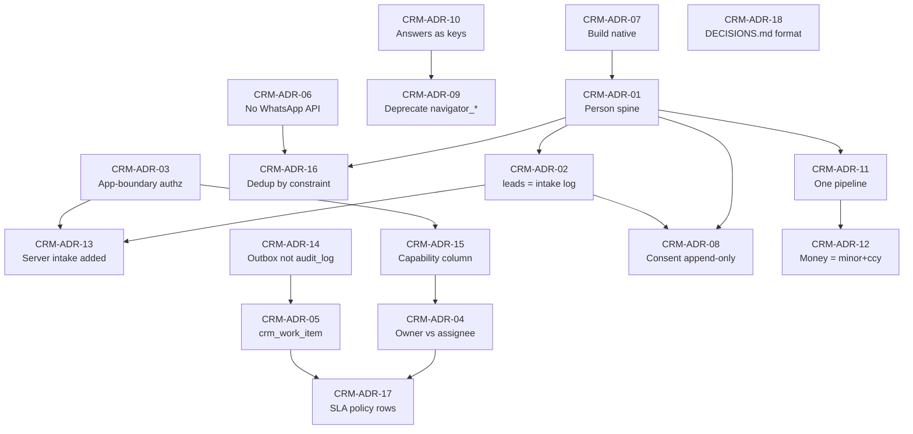

### 19.4 Recorded conflicts between research streams and these decisions

`[Inference]` Three genuine conflicts exist in the evidence base. Suppressing them would be dishonest; they are recorded so a reviewer can overturn a decision on its merits.

| Conflict | Position taken | Reasoning |
|---|---|---|
| Privacy research recommends **replacing** `public.leads` because it has no consent record; CRM-ADR-02 **keeps** it | Keep `leads` as intake log; consent lives in `crm_consent_record` | The objection is "no consent record on `leads`", not "`leads` must not exist". Not putting CRM state on `leads` satisfies it, and preserves an immutable record of what the form actually received — which is itself PDPA-relevant evidence. |
| Real-estate research recommends making **WhatsApp/Telegram ingestion a launch requirement**; CRM-ADR-06 defers all integration | Defer | The same research stream's own finding is that Meta's economics invert on 1 Oct 2026 with rates unpublished until 1 Sep 2026, and self-onboarding destroys the working number. The adoption risk the research flags is real and is answered by CRM-ADR-06's kill criteria, not by integrating blind. |
| Supabase research recommends `auth.uid()` RLS; CRM-ADR-03 forbids it | Forbid, and record the forfeited defence-in-depth explicitly, with a named reopening trigger | One authorization paradigm beats two. The cost is stated, not hidden. |

---

## 20. Explicit "Do Not Build Yet"

`[Recommendation]` This list is **normative**. An item here may be built only when its named trigger fires and a dated decision entry records it. "Estimated cost of building it prematurely" is an engineering-effort and carrying-cost estimate, `[Inference]` in all cases — no figure here is measured, and none should be quoted as one.

### 20.1 Commercial and integration

| Item | Why not | Trigger to reconsider | Est. cost of building it prematurely |
|---|---|---|---|
| **External CRM purchase** | `[Repository fact]` Triple-blocked (`docs/ROADMAP.md:80`, `:228`, `docs/CURRENT_STAGE.md:224`, North Star). The stated trigger — "lead volume exceeds the simple internal workflow" — **cannot be evaluated because lead volume is measured nowhere**. | All four conditions in CRM-ADR-07, sustained one quarter, evidenced from CRM data. | Subscription plus migration plus a second source of truth for buyer identity; the Navigator/Advisory derivations cannot follow the data out. |
| **WhatsApp Cloud API / BSP integration** | `[Web research]` Service messages and in-window utility templates become billable 1 Oct 2026 with rates unpublished until 1 Sep 2026; self-onboarding the working number deletes history and locks the number out of the Business App. | One full deal cycle of manual capture failing pre-declared kill criteria (CRM-ADR-06), **and** rates published, **and** a BSP supporting coexistence. | Weeks of integration, permanent per-message metering on a currently free channel, and a materially harder number to move later. |
| **Shared inbox or chat UI in the product** | `[Web research]` A credible inbox means reimplementing a messaging client — media, receipts, ordering, reconnection, multi-agent presence. Documented as the most expensive first-iteration mistake. | Never as a first iteration. Only after CRM-ADR-06's trigger fires **and** message volume makes phone-based working demonstrably lossy. | Months of build; the largest single scope risk in this programme. |
| **Template management / approval UI** | `[Web research]` Templates only matter *outside* the 24-hour window, and a brokerage's conversations are overwhelmingly client-initiated. | Dozens of templates actively in rotation — not the handful Forever would ever need. | Weeks of CRUD for objects that could live in a config file. |
| **Outbound broadcast / drip campaigns on WhatsApp** | `[Web research]` Marketing templates are the most expensive category and the dominant quality-rating risk on the number agents use. `[Web research]` PDPA s32(2) makes marketing objection absolute with no balancing test. | Not while the sending number is the agents' working number. | Risk to the working number plus a PDPA exposure that consent architecture alone does not cover. |
| **AI auto-responder on WhatsApp** | `[Web research]` From 1 Aug 2026 Meta Business Agent replies bill per token; from 1 Oct 2026 third-party economics change again. `[Inference]` A wrong automated message on a high-ticket advisory deal is expensive in a way a wrong SaaS message is not. | Not in 2026. | Per-token metering plus reputational risk on the primary sales channel. |
| **Two-way calendar sync** | `[Web research]` Bidirectional sync means conflict resolution, ownership rules, deletion tombstones, timezone correctness across Asia/Bangkok and clients' home zones, and watch channels that expire with no automatic renewal (https://developers.google.com/workspace/calendar/api/guides/push). | Only after one-way `.ics` + calendar-link generation is in daily use and demonstrably insufficient. | Weeks, and a class of silent data-corruption bugs. |
| **Full mailbox read (restricted Gmail scopes)** | `[Web research]` `gmail.readonly` / `gmail.modify` / `mail.google.com` are **restricted** scopes; storing or transmitting that data server-side triggers an annual third-party security assessment (https://developers.google.com/workspace/gmail/api/auth/scopes, https://support.google.com/cloud/answer/13464323). | Only if send-only + BCC dropbox demonstrably fails, and only via an internal Workspace app (verification-exempt for org-internal use — https://support.google.com/cloud/answer/13464321). | Recurring assessment cost and a PDPA blast radius covering every mailbox. |
| **Partner / referral portal** | `[Repository fact]` No external-user identity model exists; `studio_members` has two internal roles. | A named partner with a named first user and a signed commercial arrangement. | A second authentication surface and a second authorization model. |
| **Commission / payroll / accounting** | `[Repository fact]` No payment, order, invoice or entitlement capability exists anywhere in the repository. | A closed transaction whose commission was actually disputed. | Financial-correctness obligations layered onto a system that cannot yet show a lead. |
| **The #101 `developer_*` table set (15 tables)** | `[Repository fact]` A repo-wide search for all 15 proposed identifiers returns zero hits; #101 explicitly does not authorize implementation and #103 lists Developer Check as a non-goal. | Issue #101 promoted into `docs/CURRENT_STAGE.md` by Architect Review. | 15 speculative tables and a schema surface larger than the CRM itself. |

### 20.2 CRM feature scope

| Item | Why not | Trigger to reconsider | Est. cost of building it prematurely |
|---|---|---|---|
| **Workflow / automation engine before instrumentation** | `[Web research]` HubSpot's re-enrolment docs show four interacting non-obvious rules — re-enrolled records replay every action from the start (duplicate emails) and date/count refinements silently stop applying (https://knowledge.hubspot.com/workflows/add-re-enrollment-triggers-to-a-workflow). Automating an unmeasured process automates the wrong thing at scale. | `first_response_at` instrumented and a median reported for at least one quarter. | Weeks of engine plus a permanent class of "why did the client get three emails" incidents. |
| **Weighted-pipeline forecasting** | `[Web research]` Pipedrive defaults every stage to 100% probability, so an unconfigured pipeline reports weighted value equal to total value (https://support.pipedrive.com/en/article/probability-in-pipedrive). At a handful of concurrent off-plan deals a weighted forecast is statistically meaningless. | Dozens of concurrent deals with enough closed history to fit stage probabilities. | A forecast number the Owner will act on that carries no information. |
| **Separate Company / Organization core object** | `[Web research]` Forever's buyers are overwhelmingly individuals; the organisations that matter are developers, which already exist. `[Repository fact]` `public.developers` is the canonical developer entity, referenced by `projects.developer_id`. | Corporate/entity purchasers become a recurring pattern, not an exception. | A B2B object model imported into a B2C business, plus a second dedup key space. |
| **`households` table** | `[Web research]` Asserts a permanent grouping that does not exist — the same two people may be joint buyers on one unit and not on another. | Never in this shape. Joint buyers are `crm_opportunity_party` rows. | Lifecycle management (join, leave, dissolve) for a fiction. |
| **Probabilistic record linkage (Splink / Fellegi-Sunter)** | `[Web research]` Splink's own docs credit deterministic matching with high precision and low cost; probabilistic linkage's advantage is recall at scale (https://moj-analytical-services.github.io/splink/topic_guides/theory/probabilistic_vs_deterministic.html). | Row counts where a human cannot review the candidate list. | A trained model, m/u probabilities and a tuning loop for hundreds of rows. |
| **Trigram / GIN indexes at this row count** | `[Web research]` A sequential scan over a few hundred rows is sub-millisecond; the index is pure maintenance cost (https://www.postgresql.org/docs/current/pgtrgm.html). | Measured slow duplicate-candidate queries — measured, not assumed. | Write amplification and an index nobody profiled. |
| **Field-by-field merge picker UI** | `[Web research]` HubSpot's deterministic "primary wins, null-fill from secondary" rule is one testable function (https://knowledge.hubspot.com/records/merge-records). | Documented merges where the deterministic rule produced a wrong survivor. | Weeks of UI; the difference between shipping merge and not shipping it. |
| **Un-merge** | `[Web research]` HubSpot documents merging "cannot be undone"; Salesforce ships no un-merge either. | Not table stakes. Keep the snapshot and the repointed-row stamps so it stays *possible*. | A reversal engine for an operation the market leaders do not reverse. |
| **Record-level sharing + role hierarchy + field-level security** | `[Web research]` Salesforce's own architects cap the role hierarchy at 10 levels and ship a troubleshooting guide premised on nobody being able to work out who can see what (https://architect.salesforce.com/docs/architect/fundamentals/guide/platform-sharing-architecture). Its stated reason for private Leads is "no potential for internal competition" — an artefact of large commissioned floors. | A team large enough that visibility is genuinely a problem, not a preference. | An authorization model nobody on a 5-person team can reason about. |
| **Multiple pipelines** | `[Web research]` Creating multiple pipelines before one works trades one problem for half-maintained processes. | A second process with a named owner and a named first user. | Configuration drift across processes nobody maintains. |
| **A second Decision Engine or any lead score** | `[Repository fact]` `src/features/navigator/core/matching.ts:8-11` forbids score/percentage/ranking as a hard NAV-001 §09 rule; `docs/CURRENT_STAGE.md:221-222` puts "a new Decision Engine" and "new scoring systems" out of scope. | Never in this shape. | A fabricated claim in a product whose entire positioning is evidence-led. |
| **Nationality-based segmentation field** | `[Web research]` Nationality is not on the PDPA s26 list so storing it is lawful, but segmenting marketing by it and recording that moves toward s26 territory, which is the only PDPA tier carrying imprisonment. **[LAWYER]** | Segment on **language** (`ru`/`en`), which is the operational need. | Criminal-tier exposure for a field that language already serves. |
| **Identity documents in the CRM** | `[Web research]` Thai ID cards carry religion and passports carry place of birth — both routes into s26. AMLA will require identity verification; that belongs in a separate bucket with its own access policy, retention and audit log. **[LAWYER]** | Never in the CRM. Store minimal structured fields and reference the document by id. | Contaminates the entire CRM with s26 exposure. |

### 20.3 Infrastructure and platform

| Item | Why not | Trigger to reconsider | Est. cost of building it prematurely |
|---|---|---|---|
| **Realtime as a queue** | `[Web research]` No documented replay for Postgres Changes; a dropped websocket loses events silently; DELETE events cannot be filtered (https://supabase.com/docs/guides/realtime/postgres-changes). | Never as a queue. Realtime is acceptable **only** as a cache-invalidation ping into TanStack Query. | Silent, unreproducible event loss on the SLA path. |
| **pgmq / Supabase Queues** | `[Web research]` "Exactly once ... within a visibility timeout" is at-least-once with a dedup window (https://supabase.com/docs/guides/queues, https://github.com/pgmq/pgmq). `[Repository fact]` A proven claim/heartbeat pattern already exists in this repository. | The existing claim/heartbeat pattern demonstrably failing under CRM load. | A new extension with no local validation path, replacing something already proven here. |
| **`pg_net` for anything that must not be lost** | `[Web research]` State lives in UNLOGGED tables "not preserved during a crash or unclean shutdown"; responses purge after 6 hours (https://supabase.com/docs/guides/database/extensions/pg_net). | Only for genuinely fire-and-forget, non-critical calls. | Silent loss of exactly the notifications the SLA depends on. |
| **`citext` for emails** | `[Web research]` Case folding depends on the database `LC_CTYPE` and is not Unicode-correct; less efficient than `text`; loses B-tree deduplication (https://www.postgresql.org/docs/current/citext.html). `[Repository fact]` Zero uses in 24 migrations. | Never. Lowercase into a `normalized_value` column instead (CRM-ADR-16). | A locale-dependent identity key — the worst possible property for a dedup key. |
| **Cloudflare Queues / Workflows / Durable Objects** | `[Repository fact]` Previously evaluated and rejected as infrastructure this repository cannot validate; `[Repository fact]` no deployed environment exists (Cloudflare verdict E). | A deployed, verifiable environment **and** a demonstrated need the cron + claim pattern cannot meet. | Infrastructure nobody can test against. |
| **`auth.uid()` RLS policies** | CRM-ADR-03. `[Repository fact]` Zero precedent across 24 migrations. | A browser needing to read CRM data directly. | A second authorization paradigm to keep permanently in sync. |
| **`forever_import`-style approval gating for CRM writes** | `[Repository fact]` An extremely heavyweight, Owner-approval-gated boundary built for one-off bulk imports of external project data. | Never for per-lead CRM writes. | Turns every contact edit into an approval workflow. |

---

## 21. Recommended first vertical slice

### 21.0-GATE — Read this before anything else in this section

> **Slice 1 does not start until OD-8 is answered and the R-13 thresholds are evaluated; the architect's
> recommendation is Slice 0 only, then re-decide.**

`[Recommendation]` That sentence is the recommendation of this entire document, and it is placed first
deliberately. Everything after it — the Slice 1 scope, the acceptance criteria, the DDL, the rollback
plan — is **contingent**. It exists so that *if* the thresholds are met the work is already designed, not
because the work is advised today. A five-thousand-line architecture that opens with "here is Slice 1"
misleads the reader about what the evidence supports, and that was the single most important correction
the independent review made to this package.

`[Repository fact]` The evidence that Forever may not yet have the problem this CRM solves is Forever's
own: `docs/ROADMAP.md:120-125` sequences 5–8 real project records usable in advisory **before** advisor
conversion; `docs/CURRENT_STAGE.md:224` puts large CRM integration out of scope;
`docs/FOREVER_STRATEGIC_NORTH_STAR.md:266-273` limits Forever to **one** guest/product/commercial task at
a time and that slot is currently held by issue #103, which itself names WhatsApp/CRM automation as a
non-goal. And nobody has ever observed a lead arrive (§21.0).

**The work-in-progress conflict, stated plainly:** starting Slice 1 while #103 is open breaks Forever's
own WIP limit. Slice 0 does not, because Slice 0 is the observation that #103's own delivery assumption
rests on. `[Inference]`

#### The four R-13 thresholds — what would prove the "do not build it yet" recommendation wrong

`[Recommendation]` Stated now, before the data exists, so the decision cannot be reverse-engineered from
whatever number turns up. Reproduced verbatim from `docs/FOREVER_CRM_IMPLEMENTATION_PLAN.md` §5 (R-13),
which is the authoritative statement:

| Evidence | Threshold | Where it comes from |
|---|---|---|
| Real inbound volume | ≥ 15 genuine enquiries in a single calendar month | Phase 0 monthly count |
| Enquiries actually being lost | ≥ 3 enquiries in a month with no logged response within 48h | Phase 0 count + manual audit of the WhatsApp inbox |
| A concrete allocation dispute | ≥ 1 argument about who owned a lead that could not be settled from records | Owner report |
| Catalogue readiness | 5–8 project records usable in advisory | `docs/ROADMAP.md:120-125` exit criteria |

`[Recommendation]` **If those four are not met, the honest recommendation is: do Phase 0 only, and stop.**
Phase 0 is cheap, is mostly housekeeping the audit surfaced anyway, and produces the number that makes the
next decision evidence-based rather than architectural enthusiasm. That is also Owner decision **OD-8**,
whose architect's recommendation is *"Phase 0 only, then re-decide against the four R-13 thresholds."*

`[Recommendation]` **Vocabulary, so the two documents are not read as disagreeing:** this document's
**Slice 0** is the Implementation Plan's **Phase 0** — prove delivery and start counting. This document's
**Slice 1** is the Plan's **Phase 1**. The gate above sits between them in both documents.

`[Recommendation]` **The counter-argument, recorded rather than suppressed:** deferring everything means
nothing is instrumented, so the external-CRM trigger at `docs/ROADMAP.md:228` stays unevaluable
indefinitely and the same question returns next quarter with no more evidence (§14.7). That is precisely
why the recommendation is *Slice 0 only* rather than *nothing*: Slice 0 is the cheapest thing that turns
the question into an answerable one.

### 21.0 The fact that orders everything else

`[Repository fact]` **Today no human being can see a submitted lead inside the product.** `public.leads` has RLS enabled with a single INSERT policy for `anon`/`authenticated` and **no SELECT policy** (`supabase/migrations/20260704132000_...sql:27-40`); no application code anywhere selects from it; there is no route, loader, component or admin surface that references leads.

`[Repository fact]` **And nobody has ever confirmed a lead arrives.** PR #118's Gate G0 (`src/features/project-detail/contact-actions.ts`, draft — not on main) states the submission path must be proven to deliver end-to-end, with a test lead created in a non-production context, before a single new CTA is exposed to the public. `[Repository fact]` The only signal of a failed submission is a browser `console.error` at `src/lib/lead-service.ts:94`.

`[Inference]` Every other item in this architecture is secondary to fixing that. A pipeline UI on a pipe that may not deliver is theatre.

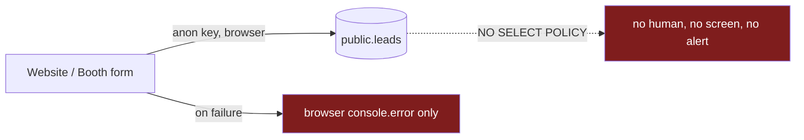

### 21.1 Slice 0 — Prove delivery (hours, not days)

**Purpose:** `[Recommendation]` Convert "we believe leads arrive" into "we observed a lead arrive, at this timestamp, confirmed by this person" — and stop failures being silent. This requires almost no new architecture and it unblocks PR #118's Gate G0.

| Scope IN | Scope OUT |
|---|---|
| Submit a test lead through the real form into a **non-production** Supabase context and observe the row | Any production write, migration application, deployment or publication |
| Record the observation: timestamp, environment, the confirming person, the submitted source value | Any new table, any schema change |
| Replace the silent failure with an honest, user-visible error state in the form (the throw already exists at `src/lib/lead-service.ts:95`; the UI must surface it) | Retry logic, quarantine tables, alerting infrastructure |
| Record the observation as a dated `docs/DECISIONS.md`-format entry or in the Gate G0 record | Opening any new lead CTA to the public |

`[Repository fact]` **Constraint that shapes Slice 0:** the browser insert must never gain `.select()` or `.returns()` while there is no SELECT policy — it would fail at runtime. **The client can never learn the id of the lead it created.** Confirmation is therefore an out-of-band observation of the row, not an API response.

`[Repository fact]` **Constraint on the demo path:** `src/lib/lead-service.ts:83-90` short-circuits the write in DEV when `VITE_PARTNER_DEMO` or `VITE_DEMO_LEAD_MODE` is `"true"`, and `src/lib/lead-demo-mode-bundle-boundary.test.ts` pins that behaviour. Any Slice 0 test run must confirm both flags are off, or it will "pass" without writing anything.

**Acceptance:** a named person has seen a specific row, in a named non-production environment, at a recorded time; and a deliberately broken submission shows the user an error instead of failing silently.

**Rollback:** Slice 0 adds no schema and no server code. The only code change is the form's error surface — revertible in one commit.

### 21.2 Slice 1 — "See it and answer it"

`[Recommendation]` The smallest useful CRM-lite. One question it must answer: **"which enquiries have nobody answered, and how fast are we answering the ones we do?"** Subject in every respect to the gate in §21.0-GATE.

**Five tables. There is no sixth.** `[Recommendation]` The scope below is binding and is the only definition of Slice 1 in this package; where any other section of any document implies a wider Slice 1, this table wins.

#### Scope IN

| # | Item | Depends on |
|---|---|---|
| 1 | `crm_contact` (person spine) + `crm_contact_method(kind, normalized_value)` with the UNIQUE dedup index | CRM-ADR-01, CRM-ADR-16 |
| 2 | `crm_consent_record` — append-only, three-state, service and marketing consent as separate rows, marketing default absent, notice version stored (§16.3) | CRM-ADR-08 |
| 3 | `crm_activity` — append-only, channel-agnostic (`channel`, `direction`, `occurred_at`, `outcome_code`, actor) | CRM-ADR-06, CRM-ADR-14 |
| 4 | `crm_work_item` — the unit of work, carrying **`owner_user_id`, `assigned_user_id`, `next_action_at`, `next_action_note` and `first_response_at` (§13.7)** | CRM-ADR-04, CRM-ADR-05, CRM-ADR-17 |
| 5 | `leads.contact_id` — one additive nullable FK, plus the privilege tightening that adding it requires (§11.1). Nothing else added to `leads` | CRM-ADR-02, CRM-ADR-13 |
| 6 | Server-boundary **read** path: `createServerFn` → `requireSupabaseAuth` → CRM capability middleware → safe-error envelope → `supabaseAdmin` | CRM-ADR-03, CRM-ADR-15 |
| 7 | ONE mobile screen: **"My Work Today"** — unanswered assigned enquiries, oldest first, with the response clock visible | CRM-ADR-15 |
| 8 | ONE **enquiry detail** screen: contact identity, the enquiry as submitted, the activity log, and a "log an outcome" action | — |
| 9 | The Owner's **two numbers**: median first response time, and the count of unworked enquiries | CRM-ADR-17 |
| 10 | CRM capability BOOLEAN on `studio_members`, defaulting FALSE | CRM-ADR-15 |

**Where ownership and assignment live in Slice 1.** `[Recommendation]` On `crm_work_item`, not on an
opportunity — because Slice 1 does not create `crm_opportunity` at all. The D4/R6 rules are unchanged:
`owner_user_id` references `public.studio_members(user_id)` `ON DELETE RESTRICT` with a write-once
`owner_display_name` snapshot; `assigned_user_id` is `ON DELETE SET NULL`.

**`first_response_at` is in Slice 1, and this is a change from an earlier draft that deferred it.**
`[Recommendation]` It is one nullable timestamp column, and it is the only thing that makes Slice 1
measurable at all. Slice 1's stated purpose is "how fast are we answering?"; deferring the timestamp that
answers it would leave a slice that ships a screen and no number.

**Logging an outcome against a contact that has no work item creates one.** `[Recommendation]` An agent
must never be blocked from recording what happened because the object to hang it on does not exist yet. A
work item is created lazily, at the moment of the first logged outcome, in the same transaction; its
`first_response_at` is set by that same act if the activity is outbound. `[Inference]` The alternative —
"you cannot log this because there is no work item" — is precisely the friction that teaches agents to go
back to WhatsApp, which is failure mode AD1 in §14.6.

#### Scope OUT — explicitly

`[Recommendation]` **`crm_opportunity` and the entire stage machine** — Slice 1 has no stages, no funnel
and no pipeline; **routing rules and `crm_routing_log`**; **`crm_assignment` offers and fallback** (the
current assignee is a column on the work item, and that is all); **`crm_policy`**; **viewings**;
**sequences**; **any outbound send.**

Also out, and unchanged from the earlier list: everything in §20; escalation and reclaim automation and
the `crm_work_item` **runner** (the table is in, the sweeper is not); deals, units, feedback, money and
FX; merge UI; DSR workflow tables; Navigator answer persistence; deprecating the `navigator_*`
declarations (backlog item, separate PR); revoking the anon INSERT policy (CRM-ADR-13 — a later
migration).

`[Inference]` Slice 1 deliberately ships **no automation and no writes to the outside world.** It makes work visible and makes response time measurable. That is the whole point.

`[Recommendation]` **Name the queue screen for what it holds.** It is "My Work Today" over work items — not "My Deals" and not "Pipeline". A screen named after an object the slice does not build teaches the team a vocabulary the data cannot support, and the §18.5 "Deal record" wireframe is explicitly **not** part of Slice 1.

#### Acceptance criteria

| # | Criterion |
|---|---|
| A1 | A CRM-capable member signs in and sees every enquiry submitted in the last 30 days on one mobile screen, without a database console. |
| A2 | An enquiry with no logged outbound activity is visibly distinguishable from one that has been answered. |
| A3 | Logging an outbound attempt sets `crm_work_item.first_response_at` exactly once (idempotent — a second log does not move it). |
| A3b | Logging an outcome against a contact with **no** work item creates one, in the same transaction, and the agent is never blocked or shown an error. |
| A4 | Two enquiries from the same normalised phone number **and a consistent name** resolve to **one** `crm_contact`; the uniqueness is enforced by the index and not by application code. A same-phone, **materially different name** queues a review candidate and does **not** auto-resolve — in particular it does not write a consent record against the other person's identity (§7.1). |
| A5 | A member **without** the CRM capability flag receives the safe-error envelope, not data — proven at the server function, not by hiding a UI element. |
| A6 | No raw Supabase/PostgREST/SQL text reaches any screen; every new failure has a `SAFE_MESSAGES` entry. |
| A7 | Consent captured at intake produces an append-only row storing the exact notice wording version and locale; an attempted UPDATE by the application role fails. |
| A8 | The Owner can read median first response time and the count of unworked enquiries without asking anyone. |
| A9 | The existing browser insert path still works, byte-for-byte, and its bundle-boundary test still passes locally. |
| A10 | An anonymous INSERT that sets `contact_id`, `provenance_tier` or a non-empty `intake_metadata` is **rejected**, and `has_column_privilege('anon','public.leads','provenance_tier','INSERT')` is false (§11.1). |
| A11 | `has_table_privilege('service_role','public.crm_consent_record','UPDATE')` and `…'crm_activity','UPDATE'` at table level are both false, while `has_column_privilege('service_role','public.crm_activity','contact_id','UPDATE')` is true (§6.4.6). |

#### Test strategy

`[Repository fact]` **There is no CI in this repository — no `.github` directory exists (verified). Every command below runs locally only, and no result may be described as a gate that "passed".**

| Layer | Convention | What it proves |
|---|---|---|
| Unit / component | Vitest 3 + Testing Library + jsdom, per the existing `vitest.config` conventions across ~378 test files; run via `npm test` (`package.json:23` → `vitest run`) | Normalisation, the "My Work Today" ordering, the idempotent `first_response_at` set, the empty state |
| SQL / RLS / grants | The disposable-PostgreSQL harness at `scripts/studio/run-postgres-tests.mjs`, exposed as `studio:pg-test` (`package.json:20`) with `scripts/studio/pg-bootstrap.sql` | That the new tables have RLS on with **no** policies; that `anon`/`authenticated` are revoked; that the `(kind, normalized_value)` unique index actually rejects a duplicate; that UPDATE on `crm_consent_record` is denied to the application role |
| Migration contract | A `*-migration-contract.test.ts` pinning the new filename and its ordering, following the existing precedent | That the migration filename, timestamp ordering and additive classification cannot drift |
| **Bundle boundary** | A new CRM bundle-boundary test in the shape of `src/lib/lead-demo-mode-bundle-boundary.test.ts` | That no client-reachable CRM file statically imports `client.server` or a CRM `.server` module, and that no literal `supabaseAdmin` / `SUPABASE_SERVICE_ROLE_KEY` appears in the client-reachable set |

`[Recommendation]` The bundle-boundary test is the highest-value single test in the slice: `[Repository fact]` TanStack Start co-locates server and client code, so one errant import can ship the service-role client to the browser — and with no CI, a source-level assertion is the only mechanical guard that exists.

#### Migration implications

`[Repository fact]` Hard constraints on any CRM migration:

- Filename `YYYYMMDDHHMMSS_snake_case_slug.sql` with a timestamp **strictly greater than `20260728160000`** (the maximum across main and all open PRs).
- It must **not** resolve the existing collision between main's `20260726120000_forever_direct_publish.sql` and PR #102's `20260726120000_booth_v2_server_issued_session.sql`. That is a separate problem with a separate owner.
- Wrapped in `BEGIN;` / `COMMIT;`, opening with a header stating purpose and task id, applied-state truth, what it does in exact order, additive-vs-non-additive classification, safety boundary, and a DOWN note.
- Never edit an applied migration; corrections layer as later timestamped files.
- `[Repository fact]` Production is at **13 applied migrations through `20260718113000`**; seven Studio migrations plus `20260723130000` are unapplied. **The CRM migration will sit unapplied for some time.** The design must not require schema that does not exist yet, and application is a separate Owner checkpoint.
- `[Repository fact]` Sequencing dependency with PR #102, which ALTERs `public.leads` (drops `email NOT NULL`, rewrites `leads_email_format`). Decide #102 before writing the CRM migration; do not race it.

`[Recommendation]` **No DDL is restated here.** An earlier draft repeated abbreviated `crm_contact` and
`crm_contact_method` definitions in this section, and they had already drifted out of agreement with
§6.4.1 (a `language` column that does not exist, `is_valid` instead of `normalization_flagged`, the wrong
`ON DELETE` action, and a `GRANT ALL` where the identity spine needs none of it). One definition per
table, cited from the canonical entity register:

| Slice 1 table | Definition | Note for the migration author |
|---|---|---|
| `crm_contact` | §6.4.1 | Verbatim. Includes the merge tombstone columns even though merge UI is out of scope — the columns are what keep merge possible later. |
| `crm_contact_method` | §6.4.1 | The `(kind, normalized_value)` UNIQUE index is the deliverable, not an optimisation. |
| `crm_consent_record` | §16.3 | Three-state. `purpose_key` is plain `TEXT` in v1; the FK is deferred (§6.4.3). |
| `crm_activity` | §6.4.4 | Append-only grants per §6.4.6, including `service_role` in the `REVOKE`. |
| `crm_work_item` | §13.7 | Slice 1 needs the table and its ownership/assignment/next-action columns. It does **not** need the sweeper. |
| `public.leads` | §11.1 | **Additive columns + privilege tightening.** Not purely additive — read the classification note before writing the header. |

#### Rollback

| Change | Rollback |
|---|---|
| New `crm_*` tables | `DROP TABLE` in a later timestamped migration. They are new, internal-only and have no external consumer. |
| `leads.contact_id` (+ `provenance_tier`, `intake_metadata`) | Nullable and additive; every existing writer ignores them. `DROP COLUMN` in a later migration, or simply stop populating them. |
| The `leads` privilege tightening (§11.1) | A **separate** rollback from the columns: re-granting table-level `INSERT ON public.leads TO anon, authenticated` restores the previous privilege exactly. `[Recommendation]` It should never be wanted — rolling it back re-opens the column-widening hole — so it is written down here precisely so nobody does it by reflex while rolling back the columns. |
| Server read path + screens | Feature-flagged behind a **server-only, default-disabled** env flag (never a `VITE_*` value); the route throws `notFound()` rather than rendering a login form when disabled. Rollback is flipping the flag. |
| Browser insert path | **Untouched by Slice 1.** Its bundle-boundary test is the guard that it stayed untouched. |
| Anon INSERT policy | **Not revoked in this slice** (CRM-ADR-13), so the existing intake remains as the fallback throughout. |

`[Inference]` The rollback story is clean because Slice 1 adds rather than replaces. One caveat, stated rather than glossed: the `leads` block is **additive columns plus privilege tightening**, not purely additive (§11.1). Its rollback is two independent halves — drop the columns, and re-grant table-level INSERT — and only the first half is ever wanted.

#### Measurable business outcome

| Metric | Baseline today | After Slice 1 |
|---|---|---|
| Enquiries a human can see in the product | `[Repository fact]` **Zero** — no SELECT policy, no read path | All of them, on a phone |
| Median first response time | `[Repository fact]` Required by `docs/CURRENT_STAGE.md:196` and `docs/ROADMAP.md:241`; **measured nowhere** | Reported, by source |
| Unworked enquiries | Unknowable | A number the Owner can read |
| Duplicate identities | `[Repository fact]` Unbounded — `idx_leads_email` is non-unique and no unique constraint exists | Prevented at write time by a constraint |
| Consent evidence | `[Repository fact]` None — no consent field anywhere | An append-only record with the notice version |
| `docs/ROADMAP.md:228` external-CRM trigger | `[Repository fact]` Unevaluable — lead volume is measured nowhere | Evaluable |

#### Kill / review trigger

`[Recommendation]` Review Slice 1 after **30 days of live use** against exactly two numbers:

1. **Percentage of enquiries with a logged first-response activity.** If < 50%, the CRM is not being used — stop and fix adoption before building anything in §20. Adding automation to a system nobody logs into makes the data worse, not better.
2. **Median first response time.** If it has not moved after 60 days, the bottleneck is not visibility and the next slice should not be a CRM feature at all.

**Kill condition:** if Slice 0 cannot demonstrate that a lead arrives, **Slice 1 does not start.** Building a read path over a pipe that does not deliver produces an empty screen and a false sense of completion.

### 21.3 Why this ordering beats the tempting alternatives

`[Inference]` Each alternative is more attractive to build and worse to have. **Building the full schema first** produces fifteen correct tables that nobody can see into, on top of an ingress that has never been proven to deliver — and `[Repository fact]` the repository already contains exactly that failure twice over: `src/features/navigator/domain/entities/database-entities.ts` declares six `navigator_*` tables that exist in no migration, and `navigator-api.ts` ships nine methods that reject with "not implemented yet" and have zero callers. **Starting with WhatsApp integration** attacks the channel where agents already work adequately, using an API whose economics invert on 1 Oct 2026 with rates unpublished until 1 Sep 2026, via an onboarding route that would delete the working number's history — maximum risk against a problem that is not the binding constraint. **Starting with automation** means automating a process with no instrumentation: `[Repository fact]` median first response time is required by four governance documents and measured by none, so any automation would be tuned against a number nobody has ever seen, and `[Web research]` HubSpot's re-enrolment semantics show how expensive that class of mistake is to unwind. **Starting with the Owner dashboard** inverts the dependency — a dashboard is a projection of activity data, and until agents log outcomes there is nothing to project, so it would render zeroes and teach the Owner to distrust the system on day one. Slice 0 costs hours and removes the single largest unknown in the whole programme; Slice 1 is the smallest thing that makes work visible and response time measurable, which is the precondition for every other decision in this document — including the one about whether to buy a CRM at all.
