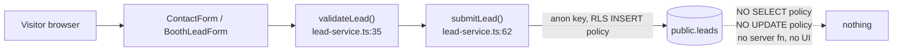
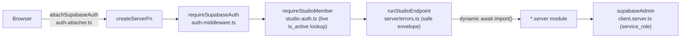

# Forever CRM — Current-State Repository Audit

Status: Proposal / evidence base (Draft, not approved, not implemented)
Last updated: 2026-07-28
Task ID: FOREVER-CRM-ARCH-001

**This document authorizes nothing.** It records what the repository contains today. It does not authorize
implementation, schema change, migration application, deployment, or any production action. No SQL in this
document is a migration. Factory autonomy remains **A0 — Propose only**. Every design decision that rests on
this audit is proposed in the companion architecture document and requires an explicit Owner decision before
any code is written.

---

## 1. Scope and method

| Item | Value |
|---|---|
| Canonical branch inspected | `main` |
| Exact SHA | `821b3c4e2f6f82e0d4ddce86199a8ff24b44a094` (merge of PR #116) |
| Working branch this document is written on | `claude/forever-crm-architecture-001` (branched off that SHA) |
| Audit date | 2026-07-28 |
| Migration files present in the working copy | 24, under `supabase/migrations/` |
| Test files present | Vitest suites colocated under `src/**` |
| CI runs performed | **None — this repository has no CI** |
| Database connections made | **None** |
| Production / staging side effects | **None** |

### 1.1 What was inspected

`[Repository fact]` The audit covered, by direct file read: every file in `supabase/migrations/`; the lead capture
path (`src/lib/lead-service.ts`, `src/components/ContactForm.tsx`, `src/routes/contact.tsx`,
`src/routes/index.tsx`, `src/features/project-detail/components/ProjectContactCTA.tsx`); the Navigator feature tree
(`src/features/navigator/**`); the Advisory, Passport and Project-Detail feature trees; the Forever Studio server
boundary (`src/features/forever-studio/**`, `src/integrations/supabase/**`); the delivery stack (`wrangler.jsonc`,
`bunfig.toml`, `package.json`, repository root); and the governance corpus under `docs/`.

Claims were verified by reading the cited file rather than by trusting a summary. Where a line number is given, it
is the line in the file as it stands at the SHA above.

### 1.2 What was explicitly NOT done

`[Repository fact]` No Supabase project was contacted. No `psql`, no PostgREST call, no Supabase CLI command, no
`supabase db` operation of any kind was executed. No migration was applied, planned, or dry-run. No lead row was
read, written, or deleted. No `git`/`gh` write command was run. No deployment, publish, or import was triggered.
No test, lint, typecheck or build gate is claimed to have passed — **this repository contains no
`.github/` directory and therefore no CI at all**, so no automated gate exists to pass.

### 1.3 Honesty constraint on production statements

`[Repository fact]` Every statement in this document about *production* is a statement about what a **document in
the repository records**, not about a live system this audit observed. The single authority for production state is
`docs/FOREVER_STUDIO_PRODUCTION_PREFLIGHT_REPORT.md`. Where that report is silent, the correct answer is
"unverified", and this document says so in §9.

---

## 2. Evidence-footing legend

Every claim below carries an evidence tag **and** an evidence footing. The footing is the more dangerous of the two
to get wrong: a design that treats Draft-PR behaviour as canonical will collide on merge.

| Footing | Meaning | Trust level for CRM design |
|---|---|---|
| **CANON** | Present in `main` at `821b3c4e` **and** in the applied production migration ledger. | Safe to depend on. |
| **MERGED-NOT-DEPLOYED** | Present in `main` at `821b3c4e`, but the migration is not applied in production and/or the code is not deployed anywhere. | Design against it, but do not assume it is live. |
| **DRAFT** | Exists only on an open Draft PR branch. | **Never canonical.** May be closed, rewritten, or rebased. Design must survive its absence *and* its arrival. |
| **STAGING-ONLY** | Applied to a dedicated staging Supabase project, not to production, and frozen byte-for-byte. | Treat the object names as claimed; do not redefine them. |
| **PROPOSED** | Written in an issue, a roadmap line, or this architecture package. | No authority whatsoever until an Owner decision. |

### 2.1 The three facts that set the footing for everything else

`[Repository fact]` **(a) Production is at 13 applied migrations, through `20260718113000`.**
`docs/FOREVER_STUDIO_PRODUCTION_PREFLIGHT_REPORT.md:173` records: migration history remains at 13 applied versions
through `20260718113000`, and a fresh isolated official dry run still proposes only the same pending Studio
migrations. The applied set is:

```
20260704055333  20260704060123  20260704060838  20260704114738  20260704132000
20260707100000  20260707101000  20260707102000  20260707103000  20260707104000
20260707105000  20260715120000  20260718113000
```

`[Repository fact]` **(b) Eleven repository migrations are UNAPPLIED.** The directory listing of
`supabase/migrations/` at `821b3c4e` contains 24 files; 11 of them postdate the last applied version:

```
20260721120000_forever_studio_v1.sql
20260721123000_studio_internal_acl_hardening.sql
20260722103000_studio_object_authorization.sql
20260722110000_studio_object_ownership_backfill.sql
20260722120000_studio_independent_review_corrections.sql
20260722130000_studio_resume_principal_authorization.sql
20260722140000_studio_durable_resume_eligibility.sql
20260723130000_public_projection_privacy.sql
20260724090000_studio_large_archive_v1.sql
20260726120000_forever_direct_publish.sql
20260726140000_public_unit_price_projection.sql
```

The repository migration set is therefore a **proposal**, not production state. Any CRM design that assumes a table,
grant, RPC or column introduced after `20260718113000` is assuming something that does not exist in production today.

`[Repository fact]` **(c) Deployment is blocked and there is no CI.**
`docs/FOREVER_STUDIO_PRODUCTION_PREFLIGHT_REPORT.md:214` records **Cloudflare inventory verdict E** — access blocked
for a precise technical reason; accounts, Workers/Pages projects, deployments, domains/routes, deployed revision
metadata and environment/secret names could not be enumerated. There is no `.github/` directory in the repository,
so no workflow runs anything. **Never write "the gate passes" about this repository.**

### 2.2 Consequence for the CRM

`[Inference]` A CRM feature has no deployed environment to run in, no secret store to hold an outbound-provider
credential, no automated gate to protect a regression, and a production schema four Studio-era migrations behind the
repository. The correct sequencing consequence is stated in the implementation plan, not here; the audit's job is to
record that the floor is this low.

### 2.3 Architect challenge — three counting corrections to the binding ground truth

`[Repository fact]` The binding decision brief for this task states three counts that the files do not support.
Recording them, per the brief's own instruction that a writer must not silently diverge:

| Brief states | Files show | Evidence |
|---|---|---|
| `public.leads` has **11 columns** | **12 columns** | `supabase/migrations/20260704132000_create_leads.sql:1-25` — `id, created_at, name, email, phone, country, budget, interest, project_slug, message, status, source` |
| **8** repository migrations are unapplied (7 Studio + `20260723130000`) | **11** | Directory listing of `supabase/migrations/`; 24 files, 13 applied. The "7 Studio" figure is what the preflight report's dry run observed at report time; `20260723130000`, `20260724090000`, `20260726120000` and `20260726140000` landed afterwards. |
| The phantom Navigator schema declares **6** tables | **7** | `src/features/navigator/domain/entities/database-entities.ts:26,32,38,44,50,56,62` — the seventh is `navigator_recommendations` |

None of these changes a decision. All three make the gap slightly larger than recorded. The rest of this document
uses the file-verified numbers.

---

## 3. The current CRM footprint, in full

`[Repository fact]` The entire CRM footprint of Forever at `821b3c4e` is one table, one browser insert, and nothing
else. This section is the complete inventory.

### 3.1 `public.leads` — the whole table

Source: `supabase/migrations/20260704132000_create_leads.sql` (footing: **CANON** — version `20260704132000` is
inside the applied set).

| # | Column | Type | Null | Default | Notes |
|---|---|---|---|---|---|
| 1 | `id` | `UUID` | NOT NULL | `gen_random_uuid()` | PK |
| 2 | `created_at` | `TIMESTAMPTZ` | NOT NULL | `now()` | the only timestamp on the table |
| 3 | `name` | `TEXT` | NOT NULL | — | stored as one concatenated `"first last"` string |
| 4 | `email` | `TEXT` | **NOT NULL** | — | format-CHECKed; PR #102 would drop the NOT NULL (§5) |
| 5 | `phone` | `TEXT` | **NOT NULL** | — | format-CHECKed |
| 6 | `country` | `TEXT` | NULL | — | free text, unconstrained |
| 7 | `budget` | `TEXT` | NULL | — | stores the **display label**, not the enum key (§6.6) |
| 8 | `interest` | `TEXT` | NULL | — | free text, unconstrained |
| 9 | `project_slug` | `TEXT` | NULL | — | `REFERENCES public.projects(slug) ON UPDATE CASCADE ON DELETE SET NULL` |
| 10 | `message` | `TEXT` | NULL | — | the prose blob that carries all Booth qualification data (§6.7) |
| 11 | `status` | `TEXT` | NOT NULL | `'new'` | CHECKed; dead vocabulary (§6.8) |
| 12 | `source` | `TEXT` | NOT NULL | `'contact_form'` | **no CHECK** (§6.9) |

**CHECK constraints** (`:14-24`):

| Constraint | Definition |
|---|---|
| `leads_name_not_empty` | `length(btrim(name)) > 0` |
| `leads_email_format` | `email ~* '^[A-Z0-9._%+\-]+@[A-Z0-9.\-]+\.[A-Z]{2,}$'` |
| `leads_phone_not_empty` | `length(btrim(phone)) > 0` |
| `leads_phone_format` | `phone ~ '^\+?[0-9][0-9 ()\-]{6,24}[0-9]$'` |
| `leads_status_valid` | `status IN ('new','contacted','qualified','closed','spam')` |

**RLS posture** (`:27-41`):

```
ALTER TABLE public.leads ENABLE ROW LEVEL SECURITY;
GRANT INSERT ON public.leads TO anon, authenticated;
GRANT ALL    ON public.leads TO service_role;

CREATE POLICY "Anyone can submit a lead"
  ON public.leads FOR INSERT TO anon, authenticated
  WITH CHECK (status = 'new'
    AND length(btrim(name))  > 0
    AND length(btrim(email)) > 0
    AND length(btrim(phone)) > 0);
```

`[Repository fact]` There is **exactly one policy**: INSERT. There is **no SELECT policy, no UPDATE policy, no
DELETE policy**. `service_role` holds `ALL` and is therefore the only principal that can read a lead at all.
The policy hard-requires `status = 'new'`, so a browser cannot create a lead in any other state even if the CHECK
would permit it.

**Indexes** (`:43-46`): `idx_leads_created_at (created_at DESC)`, `idx_leads_status (status)`,
`idx_leads_project_slug (project_slug)`, `idx_leads_email (email)`.
`[Repository fact]` **All four are non-unique.** `idx_leads_email` is a plain btree — there is no unique constraint
on any identity field on this table, so there is **zero deduplication** at the database layer.

**What is absent from the table entirely:** consent, lawful basis, marketing preference, retention date, language
preference, `updated_at`, assignee, owner, advisor, team, unit reference, session/correlation id, idempotency key,
IP, user agent, and any structured qualification field.

### 3.2 The single write path

`[Repository fact]` `src/lib/lead-service.ts:92` is the only line in the codebase that writes a lead:

```ts
const { error } = await supabase.from("leads").insert(payload);
```

A repository-wide grep for `from("leads")` returns exactly two hits: that line, and the assertion in
`src/lib/lead-demo-mode-bundle-boundary.test.ts:22` that pins its literal source text. The client used is the
**browser anon client** (`src/lib/lead-service.ts:1` imports `@/integrations/supabase/client`), so every production
lead row was written from a visitor's browser with the publishable key.



Supporting facts, all `[Repository fact]`:

- `validateLead` (`src/lib/lead-service.ts:35-56`) is the **shared** contract: the website `ContactForm` and the
  Booth form both use it verbatim. Its `EMAIL_PATTERN` (`:23`) and `PHONE_PATTERN` (`:24`) are looser than the
  database CHECKs — they must be kept in sync deliberately, they are not derived from each other.
- The name is concatenated at `:71`: `name: \`${firstName} ${lastName}\`.trim()`. First and last name are collected
  separately in the form and **destroyed at write time**.
- Email is lowercased at `:72`. Phone is stored raw (`:73`) with no normalization.
- `status` is hard-coded `"new"` at `:79`. No caller can set anything else.
- The DEV-only demo short-circuit (`:83-90`) returns before any network access when
  `VITE_PARTNER_DEMO` or `VITE_DEMO_LEAD_MODE` is `"true"`. It is dead-code-eliminated in production builds and
  protected by the bundle-boundary test.
- The only failure signal is `console.error("[LeadService] Failed to submit lead", error)` at `:94`. There is no
  server-side capture, no retry, no quarantine, no alert.

### 3.3 Proof that nothing reads a lead back

`[Repository fact]` Four independent lines of evidence, each individually sufficient:

1. **Schema:** `public.leads` has no SELECT policy (§3.1). Any browser `SELECT` returns zero rows regardless of
   what the query asks for.
2. **Grep:** the only two `from("leads")` occurrences in the repository are the insert and the test that pins it.
   There is no `.select()`, no `.update()`, no `.delete()` against `leads` anywhere.
3. **Server surface:** there is no `supabase/functions/` directory, no API route file under `src/routes/`, and no
   `createServerFn` endpoint anywhere that references leads. Every server function in the repository belongs to
   Forever Studio.
4. **UI surface:** there is no route, component, loader or query key in `src/` that names a lead list, lead detail,
   lead inbox, or lead dashboard.

`[Inference]` A lead submitted through the Forever website today is written to a table that no human being can open
through any Forever surface. Reading one requires the Supabase dashboard and the service role.

### 3.4 The corollary the design must not break

`[Repository fact]` `src/lib/lead-demo-mode-bundle-boundary.test.ts` asserts **literal source text** of
`lead-service.ts`: exactly one `export async function submitLead`, exactly one `from("leads")`, and the exact string
`await supabase.from("leads").insert(payload)`. Adding a second write path, or adding `.select()` to the existing
one, fails that test. Adding `.select()` would additionally fail **at runtime**, because PostgREST would attempt a
read-back against a table with no SELECT policy.

---

## 4. Subsystem-by-subsystem audit

### 4.1 Lead and contact capture

**Footing: CANON.**

| | |
|---|---|
| **What exists** | One table (§3.1); one shared validator; one browser insert; four entry surfaces that differ only by the `source` string. |
| **What it guarantees** | A well-formed name/email/phone triple lands in Postgres with a server-side timestamp, a valid `status`, and a project FK that survives slug renames (`ON UPDATE CASCADE`). RLS makes it structurally impossible for a browser to read any lead. |
| **What it does NOT do** | Everything else. See §7. |

`[Repository fact]` The four capture surfaces and their `source` values:

| Surface | `source` value | Evidence | Live? |
|---|---|---|---|
| Homepage form | `home_page` | `src/routes/index.tsx:245` | Yes |
| `/contact` page | `contact_page` | `src/routes/contact.tsx:69` | Yes |
| Component default | `contact_form` | `src/components/ContactForm.tsx:22`, `src/lib/lead-service.ts:80` | Yes (fallback) |
| Booth | `booth` | `src/features/navigator/core/lead.ts:31` (`BOOTH_LEAD_SOURCE`) | Yes |
| Project Detail CTA | `project_detail` | `src/features/project-detail/components/ProjectContactCTA.tsx:21` | **No — zero importers** |

`[Repository fact]` **Project attribution is lost on every website lead.** `src/routes/contact.tsx:19-25` validates
and length-bounds `?project` and `?unit` search params, and `:58-63` renders them as a text chip — and then
`:69` mounts `<ContactForm source="contact_page" />` with **no `projectSlug` prop**. `ContactForm` does accept
`projectSlug` (`src/components/ContactForm.tsx:15,21,48`) and passes it through, but `/contact` never supplies it.
`ProjectContactCTA` is the only component that does (`:21`) and it is imported by nothing. **Only Booth ever sets
`leads.project_slug`.**

`[Repository fact]` `/booth` is unauthenticated. `source = 'booth'` is therefore **not** a staff-verified signal and
must not be trusted as one.

`[Repository fact]` The Booth "internal" staff note is written into `leads.message` — the same column as
guest-authored content (`src/features/navigator/core/lead.ts`, `buildBoothMessageSummary`). There is no
internal-vs-client-visible boundary on any lead field.

### 4.2 Navigator and DecisionProfile

**Footing: CANON for the core; the domain/api layer is code-only with no schema behind it.**

| | |
|---|---|
| **What exists** | A pure, deterministic, well-tested decision core: `questions.ts` (NAV-001 enum vocabulary), `decision-profile.ts` (`deriveDecisionProfile`), `forever-story.ts`, `recommendation.ts`, `matching.ts` (`evaluateMatch` / `evaluateCatalogue`). Shared verbatim by the website Navigator and Booth. |
| **What it guarantees** | Identical answers + identical project data produce an identical result in either shell. No score, no ranking, no fabricated figure — enforced by the module contract and its tests. |
| **What it does NOT do** | Persist anything. Nothing about a Navigator session survives the tab. |

`[Repository fact]` Load-bearing properties the CRM must respect:

- `src/features/navigator/core/matching.ts:8-11` states the NAV-001 §09 hard rule verbatim: *no score, percentage,
  ranking, "best project", fabricated yield, market position, verification status, or trust score is ever computed
  or shown.* A CRM lead score would be a direct violation.
- `src/features/navigator/core/decision-profile.ts:69` sets the `gt_2_5m` budget ceiling to
  `Number.POSITIVE_INFINITY`. `JSON.stringify` silently converts that to `null`. **A `DecisionProfile` must never be
  JSON round-tripped.** Store the band key; derive the ceiling.
- `src/features/navigator/core/decision-profile.ts:48` fixes `NAV001_BUDGET_CURRENCY = "USD"`;
  `src/features/navigator/core/matching.ts:25` fixes `PROJECT_PRICE_CURRENCY = "THB"`. `matching.ts:163` gates the
  budget dimension on the two matching. They never match. **Budget matching is honestly unavailable today**, by
  design, and no currency-normalization layer exists anywhere.
- `src/features/navigator/core/forever-story.ts:58` and `:101` set `profileLabel` to the hard-coded constant
  `"The Considered Retreat-Seeker"` for every complete profile. **It is useless as a segmentation key** — it would
  place 100% of contacts in one segment.
- `src/features/navigator/core/lead.ts:128` writes `budget: budgetLabel(answers.budget)` — the **human display
  label**, not the enum key. Any CRM filter keyed on the label breaks the moment product rewords a question.

`[Repository fact]` `src/features/navigator/api/navigator-api.ts` contains **nine methods that all reject** with
`new Error("Navigator API is not implemented yet.")` (lines 39, 42, 45, 48, 51, 54, 57, 60, 63). The only file that
imports it is its own barrel, `src/features/navigator/api/index.ts`. It has **zero real callers**. It is a wish
list, not a contract.

### 4.3 Booth (main)

**Footing: CANON.** (Booth Mode 2.0 is PR #102 — DRAFT — and is covered in §5.)

| | |
|---|---|
| **What exists** | A presentation shell over the shared Navigator core, at `/booth`, unauthenticated, with a lead form that calls the same `submitLead`. Session state lives in `window.sessionStorage`. |
| **What it guarantees** | Booth is the **only** capture path that sets `leads.project_slug`, and the only one that carries qualification signal at all — flattened into `leads.message` prose by `buildBoothMessageSummary` (`src/features/navigator/core/lead.ts:58-114`). |
| **What it does NOT do** | It has no persistence, no session identity, no consent capture, no idempotency, and no server component. A closed tab loses the session; a retried submit creates a second, unlinkable lead row. |

`[Repository fact]` Booth v1 collects **no consent field of any kind**, and `public.leads` has nowhere to put one.

### 4.4 Advisory, Passport, Project Detail and the project/unit data model

**Footing: CANON for the schema; the Advisory derivations are pure code with no persistence.**

| | |
|---|---|
| **What exists** | `public.projects` (slug UNIQUE), `public.developers`, `public.units`, `public.buildings`, `public.unit_price_history`, `public.price_updates`, `public.project_status_history`, plus pure derivations under `src/features/advisory/**` and `src/features/passport/**`. |
| **What it guarantees** | Project truth has one canonical home with real keys. `leads.project_slug → projects(slug)` already exists and is the correct project-interest FK. `units.id` is a stable UUID: `supabase/migrations/20260718113000_progressive_ingestion_v1.sql:669-670` resolves units by `(project_id, unit_code)` rather than recreating them. |
| **What it does NOT do** | Represent unit-level interest, persist any advisory output, or emit a single change event. |

`[Repository fact]` Specific findings the CRM must design around:

- **No UNIQUE constraint on `units(project_id, unit_code)`.** A grep across all migrations for a unique constraint
  on `unit_code` returns nothing, while the ingest at `20260718113000:669-684` does `SELECT id … WHERE project_id = …
  AND unit_code = …` and INSERTs when the SELECT misses. Concurrent ingests can create duplicate units.
  `public.buildings` already has the analogous `UNIQUE (project_id, building_code)`.
- **`unit_price_history` is not append-only.** `20260718113000:749-761` `UPDATE`s a matching row in place, mutating
  `price`, `currency`, `metadata` and `updated_at`. A price change can leave no new row. It must never be treated as
  an event stream. It also carries `source_file` and `source_page` (repository paths) and is revoked from public
  roles by `20260723130000_public_projection_privacy.sql` — **never join it into a client-facing surface.**
- **`price_updates` and `project_status_history` have the correct shape and zero writers.** A repository-wide grep
  finds them only in migrations, in `src/integrations/supabase/types.ts`, and in a migration-contract test — no
  application code inserts into either. There is no price-change event and no status-change event in the system.
- **Advisor Report and Passport are never persisted.** Every derivation is pure and in-memory. There is no record of
  what was shown to which client.
- **`src/features/advisory/project-adapter.ts` is dead.** `mapProjectToAdvisorySession` is defined at `:42` and
  re-exported at `src/features/advisory/index.ts:51` — and called by nothing. It nulls every client field.
- **Two incompatible "Forever ID" formats exist for the same project.**
  `src/features/passport/passport-mapper.ts:38` returns `` `FOREVER-${project.core.slug.toUpperCase()}` ``, while
  the Advisory passport path uses the bare slug. Persisting either would persist an ambiguity.
- **`src/features/passport/passport-types.ts:11` already declares `"crm"` as a `PassportRenderTarget`**, and `:102`
  threads `renderTarget` through the serializer. A "send the passport to this client" export envelope exists in
  type form and is unused.
- **`/advisory` and `/advisory/report` are locked as data-free placeholders** by
  `src/lib/advisory-public-boundary.test.ts`, which asserts those route files contain no `supabase`, no `loader:`,
  no `@/features/advisory` import and no `recommendation`. A CRM UI must not be mounted there.

### 4.5 Supabase schema, RLS, RPC and the server boundary

**Footing: CANON for the pattern; MERGED-NOT-DEPLOYED for every Studio table (all 11 unapplied migrations).**

`[Repository fact]` **`auth.uid()`, `auth.jwt()` and `auth.role()` appear ZERO times across all 24 migrations.**
No RLS policy anywhere is keyed on the authenticated user. Authorization is enforced 100% at the app-server
boundary. There are four distinct RLS patterns in the repository:

| Pattern | Shape | Tables |
|---|---|---|
| **A — public catalogue** | RLS on + permissive SELECT `USING (is_active = true AND public_status = 'published')` or a parent-join equivalent | ~20 project-scoped tables |
| **B — leads** | RLS on + a single INSERT-only WITH CHECK policy for `anon`/`authenticated`; **no SELECT policy** | `public.leads` only |
| **C — internal-only ("the audit_log pattern")** | RLS ENABLED with **NO policies**, `REVOKE ALL` from `PUBLIC`/`anon`/`authenticated`, `GRANT ALL … TO service_role` | `audit_log`, `ingestion_warnings`, `ingestion_batches`, `studio_members`, `studio_upload_jobs`, `studio_listing_contacts`, `studio_object_owners`, `studio_archives`, `studio_archive_entries`, the `forever_import` tables |
| **D — role-scoped (RC5.5D only)** | dedicated `TO forever_import_execution_owner … USING (true)` policies serving a SECURITY DEFINER boundary | `forever_import` / `forever_execution` |

`[Repository fact]` The server chain, uniformly applied across the Studio's endpoints:



Reusable primitives that already exist, all `[Repository fact]`:

- `public.studio_listing_contacts` (`supabase/migrations/20260721120000_forever_studio_v1.sql:194-207`) is the
  house pattern for CRM-grade PII: a **separate table**, RLS on with **no policies**, `GRANT ALL` to `service_role`
  only, and the PII columns **physically dropped** from the public `listings` row (`:224-227`) so the anonymous
  PostgREST surface is structurally incapable of returning them.
- `public.studio_object_owners` (`supabase/migrations/20260722103000_studio_object_authorization.sql:11`) is a
  generalizable `(object_type, object_id, created_by)` ACL — but `object_type` is
  `CHECK (object_type IN ('project','listing'))`, so leads are not covered.
- `public.studio_members` (`supabase/migrations/20260721120000_forever_studio_v1.sql:86`) is the single staff
  identity, with `CHECK (role IN ('owner','trusted_publisher'))`. **Neither role is an advisor/sales role.**
- `public.audit_log` is generic (actor, action, `table_name`, `record_id`, old/new values, metadata), service_role
  only, and already indexed — but **no `CREATE TRIGGER` references `public.leads` in any migration**, and nothing on
  the lead path writes to it.
- `public.studio_upload_jobs` plus `studio_claim_job` / `studio_heartbeat_job` / `studio_fail_job` /
  `studio_list_due_jobs` / release implement single-winner claim tokens, lease heartbeats, stale recovery,
  `attempt_count` and retryability. Proven, but hard-coupled to Studio semantics.
- `public.set_updated_at()` is the shared BEFORE UPDATE trigger helper, used by seven tables. **`leads` is not one
  of them — `leads` has no `updated_at` column at all.**

### 4.6 Application runtime and delivery stack

**Footing: CANON for the code; nothing is deployed.**

`[Repository fact]`

| Area | State |
|---|---|
| Framework | TanStack Start + React 19 + Vite, via the vendored `@lovable.dev/vite-tanstack-config` wrapper |
| Bundler / target | Nitro, Cloudflare Workers `cloudflare-module` preset |
| Datastore | Supabase (the only datastore) |
| Scheduler | **One** Cloudflare cron trigger: `"crons": ["*/5 * * * *"]` (`wrangler.jsonc:18`) driving the Worker `scheduled()` export |
| Dependency guard | `bunfig.toml` — `minimumReleaseAge = 86400` (24h), with four `@lovable.dev/*` bypass entries; both `bun.lock` and `package-lock.json` are committed |
| Tests | Vitest 3 + Testing Library + jsdom, colocated under `src/**`, plus a disposable-PostgreSQL SQL harness (`scripts/studio/run-postgres-tests.mjs`) |
| CI | **None.** No `.github/` directory exists. |
| Deployment | **None verified.** Cloudflare verdict E. |

`[Repository fact]` UI kit state: 44 shadcn/ui components are installed. `table`, `chart`, `form`, `dialog`,
`drawer`, `calendar`, `select`, `tabs`, `command`, `popover` and `sonner` have **zero application consumers** —
`src/components/ui/sonner.tsx` is imported by nothing and **no `<Toaster>` is mounted in `src/routes/__root.tsx`**.
Their backing libraries (recharts, react-hook-form, `@hookform/resolvers`, date-fns, vaul, cmdk) are installed and
equally unused. The Studio UI is hand-rolled `<ul>`/`<li>` card lists and raw `<form>` elements.

`[Inference]` The CRM would be the first consumer of every one of those components. That is a cost advantage — they
are already vetted and past the 24h `minimumReleaseAge` guard — and a risk: there is no in-repo precedent for a
data grid, pagination, filtering, sorting, saved views, charting, or date handling.

### 4.7 Governance and process constraints

**Footing: CANON.**

| Constraint | Evidence |
|---|---|
| Factory autonomy is **A0 — Propose only** | `docs/FOREVER_FACTORY_CONSTITUTION.md` §16 |
| The constitutional layer must not be edited by this task | `docs/FOREVER_BLUEPRINT.md`, `docs/FOREVER_FACTORY_CONSTITUTION.md`, `docs/DATA_STANDARD.md` — amending any is an R3 change requiring its own PR |
| CRM has explicit roadmap authority | `docs/ROADMAP.md:138-142` (Phase 2 advisor conversion system, incl. "measurable stages: new → contacted → qualified → viewing → reserved → closed/lost") |
| Build internal, not external | `docs/ROADMAP.md:144` — "Use the existing Supabase lead boundary and Advisory foundations before buying or building a large CRM" |
| External CRM is deferred behind an unmeasurable trigger | `docs/ROADMAP.md:228` — "external CRM — trigger: lead volume exceeds the simple internal workflow". **Lead volume is measured nowhere.** |
| Large CRM integration is out of current scope | `docs/CURRENT_STAGE.md:224` |
| CRM lead dashboard is recorded backlog, not authorized work | `docs/BACKLOG.md:24` |
| The CRM boundary is already written and canonical | `docs/FOREVER_BRAIN_V1.md:288-329` |
| New durable docs must be registered in the same change | `docs/FOREVER_DOC_INDEX.md:88` |
| Durable decisions need a `docs/DECISIONS.md` entry | `docs/FOREVER_FACTORY_CONSTITUTION.md` §5, §19 |
| No real personal data or local paths in documentation | PR #104 was closed unmerged for exactly this (`docs/CURRENT_STAGE.md:76-80`) |

`[Repository fact]` `docs/FOREVER_BRAIN_V1.md:288-329` already resolves the hardest ownership question. Verbatim
structure: **CRM may own** leads, buyer profiles, advisor notes, follow-up state, buyer preferences, inquiry
history, deal workflow state (`:292-300`). **CRM must consume** canonical project identity, unit availability and
price history, Passport summary, Intelligence recommendations, verification status and warnings, source-backed
buyer-fit signals (`:302-309`). **CRM must not own** project facts, developer facts, location facts, unit inventory
truth, price history truth, Passport truth, Intelligence truth (`:311-319`).

`[Repository fact]` **Zero data-protection policy exists.** A repository-wide grep for `PDPA` and `GDPR` returns no
hits in any document. Every "consent" hit in `docs/` refers to Owner authorization gates for migrations and
publication, never to a data subject. There is no retention policy, no erasure path, no data-subject-access
procedure, no ADR directory, and no CRM documentation of any kind.

---

## 5. Open Draft PRs and issues

`[Repository fact]` **Nothing in this section is canonical.** Each of these branches may be closed, rewritten, or
rebased. The CRM design must survive both the arrival and the non-arrival of every one of them.

| PR | Title / subject | Migrations added | Touches `leads`? | CRM relevance |
|---|---|---|---|---|
| **#119** | Studio project amenities editor | `20260728160000_studio_project_amenities_editor.sql` (464 lines) | No | **Highest migration version anywhere.** Stacked on #118's branch, not on main. Establishes the server-authorization RPC pattern a CRM should copy. Regenerates `src/integrations/supabase/types.ts`. |
| **#118** | Project-detail release safety | **None** | No | Adds `src/features/project-detail/contact-actions.ts` — the **Gate G0** fail-closed CTA gate. 35 files, all under project-detail. |
| **#117** | Media semantic public contract | `20260728120000_project_media_semantic_role.sql` (569 lines) | No | Sequencing only. Also touches generated types. |
| **#102** | **Booth Mode 2.0** | `20260725150000_booth_v2_pilot.sql`, `20260726120000_booth_v2_server_issued_session.sql` | **YES** | The one PR with a direct CRM collision surface. See §5.1. |
| **#97** | Coralina publication readiness (docs) | None | No | Precedent for a documentation-only Draft PR: one file, body declaring "no source code was changed", auto-merge disabled. |

| Issue | Subject | CRM relevance |
|---|---|---|
| **#103** | Forever Studio production launch (P0) | Blocked on hosting, not code. Names "WhatsApp/CRM automation" and "Developer Check" as **non-goals**. It holds the guest/product WIP slot. A CRM implementation task would contend with it. |
| **#101** | FOREVER-DD-001 Developer Evidence | Explicitly states it "does not authorize implementation and does not change `docs/CURRENT_STAGE.md`". Proposes ~15 candidate `developer_*` / `project_*_checks` tables; **none of those identifiers exists anywhere in the repository**. Its one binding CRM requirement: a lead record must store requested company/project, report result, risk questions, **language** and **contact consent** — none of which `public.leads` can hold. |

### 5.1 PR #102 — the collision surface

`[Repository fact]` (footing: **DRAFT**, with `20260725150000_booth_v2_pilot.sql` additionally **STAGING-ONLY** —
applied to a dedicated staging Supabase project and deliberately frozen byte-for-byte):

1. **It drops `NOT NULL` from `leads.email`** and replaces `leads_email_format` with a NULL-tolerant CHECK
   (`20260725150000_booth_v2_pilot.sql:1292-1297`), precisely so a booth guest can be captured with WhatsApp only.
   **Consequence:** any CRM design that keys identity on email, or that assumes `email IS NOT NULL`, breaks if #102
   merges. Restoring the strict contract afterwards would require a further migration and would break Booth v2.
2. **It claims the entire `booth_*` namespace**: `booth_sessions`, `booth_guides`, `booth_funnel_events`, the
   `booth_*` RPCs, and `studio_members.can_access_booth`. **No CRM object may take any of those names.**
3. **It hard-DELETEs a lead.** `booth_complete_session` executes `DELETE FROM public.leads` on a no-contact outcome
   (`20260725150000:1202-1253`). **Consequence:** no CRM foreign key to `public.leads` may use
   `ON DELETE RESTRICT` or `NO ACTION` — a CRM reference must tolerate the row vanishing.
4. **It establishes a two-consent model** (`:219-266`) — consultation consent as the persistence gate, marketing
   opt-in defaulting FALSE — enforced by database CHECK constraints rather than application code. This is the only
   consent model that exists anywhere in the Forever codebase, in any state.
5. **It carries a duplicate migration version.** `20260726120000_booth_v2_server_issued_session.sql` on #102 shares
   the version number `20260726120000` with main's `20260726120000_forever_direct_publish.sql`. The Supabase
   migration ledger keys on version. **This collision already exists and this task does not resolve it.**

### 5.2 Required migration sequencing for any future CRM migration

`[Repository fact]` Highest migration versions anywhere:

| Source | Highest version |
|---|---|
| `main` @ `821b3c4e` | `20260726140000` |
| PR #102 | `20260726120000` (collides with main) |
| PR #117 | `20260728120000` |
| PR #119 | `20260728160000` |

`[Recommendation]` A future CRM migration filename must be `YYYYMMDDHHMMSS_snake_case_slug.sql` with a timestamp
**strictly greater than `20260728160000`**, and must **not** attempt to resolve the `20260726120000` collision —
that is a separate decision belonging to whoever lands #102.

### 5.3 Gate G0 — lead delivery has never been observed to work

`[Repository fact]` (footing: **DRAFT**) PR #118's `src/features/project-detail/contact-actions.ts` documents gate
G0: *the submission path must be proven to deliver end-to-end, with a test lead created in a non-production
context, before a single new CTA is exposed to the public.* It fails closed behind an exact-token
`VITE_PROJECT_CONTACT_ACTIONS=enabled` flag. Its precondition 4 requires a quarantine path for heuristically
rejected leads (PRD §16.3, "No silent loss") — **no quarantine table or code exists on main.**

`[Inference]` This is the single most consequential fact in the audit. The system has a lead table, a lead form, and
a production database — and no recorded observation that a lead has ever arrived. **Proving delivery is the CRM's
first deliverable, ahead of any pipeline UI.**

---

## 6. Present limitations, duplication risks and schema conflicts

### 6.1 The phantom `navigator_*` schema

`[Repository fact]` `src/features/navigator/domain/entities/database-entities.ts` declares seven table names:

| Declared `tableName` | File line | Exists in any migration? |
|---|---|---|
| `navigator_clients` | `:26` | **No** |
| `navigator_sessions` | `:32` | **No** |
| `navigator_answers` | `:38` | **No** |
| `navigator_decision_profiles` | `:44` | **No** |
| `navigator_forever_stories` | `:50` | **No** |
| `navigator_advisor_notes` | `:56` | **No** |
| `navigator_recommendations` | `:62` | **No** |

A repository-wide grep for `navigator_` across `supabase/` returns **zero hits**. These are seven table names that
exist in TypeScript, in no database, with no migration and no caller. `[Inference]` Their danger is not that they
are wrong — the vocabulary is largely right — but that a future reader will treat them as a schema that already
exists and build a second client-profile system on top of them.

### 6.2 The unimplemented `NavigatorApi`

`[Repository fact]` Nine methods, nine `Promise.reject(new Error("Navigator API is not implemented yet."))`
(`src/features/navigator/api/navigator-api.ts:39,42,45,48,51,54,57,60,63`), zero real importers. It is an
aspirational interface, not a contract, and must not be treated as the CRM's server boundary.

### 6.3 The rival `ClientModel` lifecycle enum

`[Repository fact]` `src/features/navigator/domain/models/client.ts:16` declares
`lifecycleStage: ClientLifecycleStage` and `:17` `consentAcceptedAt?: ISODateTime`. This is a **second, never
persisted, CRM-shaped lifecycle vocabulary**, competing with `leads.status` and with the roadmap funnel.
`[Inference]` Three lifecycle vocabularies now exist in one repository: `leads.status` (shipped, dead),
`ClientLifecycleStage` (code-only, never persisted), and `docs/ROADMAP.md:141` (documented, unimplemented). The CRM
must pick one and explicitly retire the others.

### 6.4 Stale generated Supabase types

`[Repository fact]` `src/integrations/supabase/types.ts` contains exactly **17 tables** (`amenities`,
`developer_translations`, `developers`, `investment_data`, `leads`, `locations`, `nearby_places`, `price_updates`,
`project_amenities`, `project_media`, `project_seo`, `project_status_history`, `project_tags`,
`project_translations`, `projects`, `tags`, `units`) and an **empty** `Functions: { [_ in never]: never }`
(`:918-920`). Missing entirely: `buildings`, `sources`, `documents`, `audit_log`, `listings`, `ingestion_*`, and
every `studio_*` table. **No RPC in this repository is type-safe.** `[Repository fact]` Regeneration is contended:
PRs #119 and #117 both touch this file.

### 6.5 Two incompatible "Forever ID" formats

`[Repository fact]` `src/features/passport/passport-mapper.ts:38` emits `` `FOREVER-${slug.toUpperCase()}` ``; the
Advisory passport path emits the bare slug. Both claim to identify the same project. `[Recommendation]` Never
persist a Forever ID. Persist `projects.slug` or a UUID and derive any display ID at render time.

### 6.6 `leads.budget` stores a display label, not an enum key

`[Repository fact]` `src/features/navigator/core/lead.ts:128` writes `budget: budgetLabel(answers.budget)`. The
stored value is the human string (e.g. the `$500k–1M` label), not the NAV-001 key (`500k_1m`). Labels in
`questions.ts` are display copy and product can reword them. **Any CRM filter or segment keyed on this column is
one copy change away from silently returning nothing.**

### 6.7 `leads.message` is a prose blob carrying structured data

`[Repository fact]` `buildBoothMessageSummary` (`src/features/navigator/core/lead.ts:58-114`) flattens roughly
twenty structured fields — motivations, goals, budget, timeline, concerns, archetype, recommendation, match reasons,
and the internal staff note — into a deterministic multi-line English text blob written into a single `TEXT` column.
Nothing about it is queryable, filterable, or separable into internal-vs-client-visible. `[Inference]` The
qualification signal is generated correctly and then destroyed at write time.

### 6.8 `leads.status` is dead vocabulary

`[Repository fact]` The CHECK permits `new|contacted|qualified|closed|spam`. `submitLead` hard-codes `"new"`
(`src/lib/lead-service.ts:79`), the INSERT policy requires `status = 'new'`, and there is **no UPDATE policy and no
code path anywhere** that sets any other value. Four of the five values are permanently unreachable — including
`spam`, despite there being no anti-abuse control that could ever assign it. Separately, the enum cannot express the
roadmap funnel: `docs/ROADMAP.md:141` requires `viewing`, `reserved` and `lost`, none of which the CHECK allows.

### 6.9 `leads.source` is unconstrained

`[Repository fact]` `source TEXT NOT NULL DEFAULT 'contact_form'` with **no CHECK**. Five values are in use today
(§4.1); PR #102 would add more. `[Inference]` An unconstrained attribution column is where analytics quietly rot —
a typo produces a new "channel" that no one notices.

### 6.10 `/contact` discards project attribution

`[Repository fact]` Covered in §4.1. `src/routes/contact.tsx:69` mounts `ContactForm` without `projectSlug`, so the
validated `?project` and `?unit` search params are rendered as a chip and then dropped. The only component that
would have passed them, `ProjectContactCTA`, has zero importers.

### 6.11 `unit_price_history` is mutated in place

`[Repository fact]` `supabase/migrations/20260718113000_progressive_ingestion_v1.sql:749-761` UPDATEs an existing
row. It is not an event log and cannot be used as one. It also carries repository-path provenance
(`source_file`, `source_page`) and is revoked from public roles by `20260723130000_public_projection_privacy.sql`.

### 6.12 `recordAuditSafely` swallows audit failures

`[Repository fact]` `src/features/forever-studio/server/service.ts:712-718`:

```ts
async function recordAuditSafely(deps: StudioDeps, entry: StudioAuditEntry): Promise<void> {
  try {
    await deps.data.recordAudit(entry);
  } catch (error) {
    logStudioFailure(`audit_write_failed:${entry.action}`, error);
  }
}
```

`[Inference]` This is correct for its purpose — an audit failure must not fail a user's operation — and it makes
`audit_log` **unusable as an automation trigger**. Anything that must not be missed (an SLA timer, an escalation,
an outbound message) requires a transactional outbox written in the **same** transaction as the fact it records.

### 6.13 Missing UNIQUE on `units(project_id, unit_code)`

`[Repository fact]` Covered in §4.4. The ingest treats `(project_id, unit_code)` as the natural key without a
constraint enforcing it, while `buildings` has the analogous `UNIQUE (project_id, building_code)`. Any CRM foreign
key to `units.id` inherits this weakness: duplicate unit rows are representable, and interest recorded against one
duplicate is invisible from the other.

### 6.14 Duplication risk summary

| Risk | Rival A | Rival B | Consequence if unresolved |
|---|---|---|---|
| Client/contact entity | `navigator_clients` + `ClientModel` (code only) | any new CRM contact table | Two client-profile systems — the outcome the mission forbids |
| Lifecycle vocabulary | `leads.status` CHECK | `ClientLifecycleStage`; `ROADMAP.md:141` funnel | Three funnels, no reportable truth |
| Advisor identity | `studio_members` (`owner`, `trusted_publisher`) | `booth_guides` (PR #102, DRAFT) | Two staff rosters |
| Assignment / next action | `booth_sessions` (PR #102, DRAFT) | any CRM assignment table | Two competing "who owns this" answers |
| Consent | `booth_sessions` two-consent model (PR #102, DRAFT) | any CRM consent table | Two consent records for one person |
| Project display ID | `FOREVER-<SLUG>` | bare slug | Ambiguous identity in exported documents |
| Generated types | `src/integrations/supabase/types.ts` (stale) | `src/lib/database-types.ts` (hand-written) | Type drift across the whole data layer |

---

## 7. Missing operational capabilities — the honest list of zeros

`[Repository fact]` Each row below was verified by grep and by reading the schema. "Zero" means zero.

| Capability | State | Evidence |
|---|---|---|
| Read a lead | **None** | No SELECT policy on `leads`; no `.select()` against `leads` anywhere; no server function; no route |
| Update a lead | **None** | No UPDATE policy; no RPC; no code path |
| Lead assignment / ownership | **None** | `leads` has no `assigned_to`/`owner_id`/`advisor_id`; `studio_object_owners.object_type` is `CHECK IN ('project','listing')` |
| Advisor / sales role | **None** | `studio_members.role CHECK (role IN ('owner','trusted_publisher'))` (`20260721120000:86`) |
| Activity / interaction timeline | **None** | No call, email, meeting, viewing or follow-up table in any migration |
| Notes | **None** | `AdvisorNoteModel` is an unpersisted interface; `leads.message` is written once at insert |
| Tasks / reminders / next actions | **None** | No table, no column, no code |
| SLA / response-time tracking | **None** | `leads` has no `updated_at`, no first-response timestamp, no timer |
| Consent / lawful basis | **None on main** | No column, no table; PR #102's model is DRAFT and booth-scoped |
| Retention / erasure / DSR | **None** | No policy document, no column, no procedure; grep for PDPA/GDPR returns zero hits repository-wide |
| Deduplication | **None** | `idx_leads_email` is non-unique; no unique constraint on any identity field; no merge concept |
| Idempotency on lead submit | **None** | No correlation id, no session id, no fingerprint; a retry creates a second unlinkable row |
| Notification (any kind) | **None** | No email provider, no webhook, no Telegram/LINE alert, no in-app badge |
| Outbound communication (any channel) | **None** | No resend/sendgrid/nodemailer/postmark/mailgun/twilio dependency; no such env var in `.env.example` |
| In-app notification surface | **None** | `src/components/ui/sonner.tsx` has zero consumers; no `<Toaster>` mounted in `__root.tsx` |
| Rate limiting | **None** | No middleware, no per-IP/per-email throttle; no HTTP layer to hook into |
| CAPTCHA / honeypot / bot mitigation | **None** | Nothing on the public form |
| Webhook infrastructure | **None** | No signature/HMAC verification, no inbound endpoint, no replay window |
| Audit trail on leads | **None** | No `CREATE TRIGGER` on `public.leads` in any migration; nothing on the lead path writes `audit_log` |
| Error observability on lead failure | **None** | One `console.error` (`src/lib/lead-service.ts:94`) |
| Quarantine for rejected leads | **None** | Required by PR #118 precondition 4; no implementation on main |
| Data grid / pagination / filtering / saved views | **None** | `table.tsx` installed, zero consumers; the only list pattern is an unpaginated `<ul>` |
| Charting / metrics / aggregation | **None** | recharts + `chart.tsx` installed, zero consumers; no metrics layer |
| Forms infrastructure | **None in use** | react-hook-form + `@hookform/resolvers` installed, zero consumers; every form is a raw `<form>` |
| Date/time handling | **None in use** | date-fns + `calendar.tsx` installed, zero consumers; timestamps handled ad hoc as ISO strings |
| Sub-5-minute scheduling | **None** | The only cron expression is `*/5 * * * *` (`wrangler.jsonc:18`) |
| Generic multi-domain job queue | **None** | The durable runner is real but Studio-specific (workflow enum, Studio publish RPCs, `studio_members` join) |
| Lead-volume measurement | **None** | Nothing counts leads — so `docs/ROADMAP.md:228`'s external-CRM trigger **cannot currently be evaluated** |
| CRM documentation | **None before this package** | `docs/crm/` is empty and untracked; no file in the repository is a CRM design, spec, schema proposal or runbook |
| CI | **None** | No `.github/` directory |
| Deployed environment | **None verified** | Cloudflare verdict E |

---

## 8. REUSE MAP

`[Recommendation]` The five-way classification. **Reuse as-is** = call it, do not modify it. **Extend** = additive
change only, in a new migration or a new module. **Migrate** = the thing is in the wrong place or the wrong shape
and must move. **Deprecate** = it exists, it is misleading, stop referencing it (removal itself is out of scope for
this documentation-only task). **Do not build** = explicitly out of scope; record the verdict so a future reader
does not re-litigate it.

### 8.1 Reuse as-is

| Artifact | Reason |
|---|---|
| `requireSupabaseAuth` (`src/integrations/supabase/auth-middleware.ts`) | Generic JWT verification with no Studio coupling; already globally registered |
| `attachSupabaseAuth` (`src/integrations/supabase/auth-attacher.ts`) + `src/start.ts` registration | Attaches the bearer token to every serverFn RPC; a CRM endpoint inherits it for free |
| `supabaseAdmin` (`src/integrations/supabase/client.server.ts`) | The single service-role client; lazy proxy, env-validated, with an enforced dynamic-import discipline |
| `runStudioEndpoint` / `SAFE_MESSAGES` / `redact` / `StudioError` (`src/features/forever-studio/server/errors.ts`) | The mandatory safe-error envelope; only the message catalogue needs CRM entries |
| `assertObjectAccess` (`src/features/forever-studio/server/service.ts`) | Six lines of owner-short-circuit + `created_by` equality, with deliberate Owner-only semantics for unattributed objects |
| `public.audit_log` | Generic, service_role-only, correctly indexed. Sufficient for a mutation trail — **but not as an automation trigger** (§6.12) |
| `public.set_updated_at()` | Shared BEFORE UPDATE trigger helper, already used by seven tables |
| `public.studio_listing_contacts` **as a pattern** | The proven private-PII shape: separate table, RLS on with no policies, service_role only, PII physically absent from the public row |
| Studio UI shell (`StudioShell`, `useStudioSession`, the `max-w-3xl` mobile-first layout, noindex route meta) | The reference implementation for an authenticated, mobile-usable internal screen |
| Navigator core: `questions.ts`, `decision-profile.ts`, `forever-story.ts`, `recommendation.ts`, `matching.ts` | Pure, deterministic, currency-honest, parity-tested, shared by both shells. The CRM must call, never reimplement |
| Advisory derivations (`src/features/advisory/*`, excluding `project-adapter.ts`) | Pure, deterministic, evidence-bound, test-locked against inventing scores or verdicts |
| `AdvisoryWorkspace.tsx` + `ClientSnapshot` | A complete, controlled, props-only advisor UI whose client section has never had a producer |
| `src/features/passport/passport-serializer.ts` with `renderTarget: "crm"` | An already-declared CRM export envelope (`passport-types.ts:11,102`) |
| `public.price_updates`, `public.project_status_history` | Correct grain, RLS-locked, indexed — and currently zero-writer. Write to these; do not invent rivals |
| `public.forever_project_price_projection(UUID)` | The single public price truth, service_role only, idempotent |
| `public.developers` | The canonical developer entity, keyed by id and slug; already referenced by `projects.developer_id` |
| `src/lib/lead-service.ts` `validateLead` / `LeadFormValues` / `hasLeadValidationErrors` | The single shared validation contract, used verbatim by both channels |
| Local demo/no-write lead mode (`src/lib/partner-demo-mode.ts` + the DEV short-circuit) | Working, DEV-only, dead-code-eliminated in production, source-test-protected. **Any CRM runner must honour this kill switch** or a demo will fire real actions |
| `studio_claim_job` / `studio_heartbeat_job` / `studio_fail_job` / release semantics **as a pattern** | Proven single-winner claiming with heartbeat and stale recovery |
| shadcn components `table`, `dialog`, `drawer`, `form`, `calendar`, `chart`, `sonner` + recharts / react-hook-form / date-fns | Installed, unused, already past the 24h `minimumReleaseAge` guard. Zero install cost, zero supply-chain delay |
| Vitest 3 + Testing Library + jsdom conventions | The only enforcement available given there is no CI |
| `scripts/studio/run-postgres-tests.mjs` disposable-PostgreSQL harness | The only place RLS, GRANTs and PL/pgSQL semantics actually execute |
| `docs/FOREVER_BRAIN_V1.md:288-329` CRM boundary | Already canonical, already resolves may-own / must-consume / must-not-own. Reuse verbatim; do not rewrite |
| `docs/DECISIONS.md` dated-entry format | The repository's only decision-record convention |
| PR #97's documentation-only Draft PR shape | Working precedent: draft, single-purpose, body declaring no source change, auto-merge disabled |
| `src/features/project-detail/contact-actions.ts` Gate G0 (PR #118, DRAFT) | An exact-token fail-closed gate with four named preconditions. Adopt it; do not route around it |

### 8.2 Extend (additive only)

| Artifact | What to add | Why additive is sufficient |
|---|---|---|
| `public.leads` | A nullable `contact_id` FK and nothing else in v1 | It is the only table with real production rows and a pinned write path; it must keep working unchanged |
| `public.studio_members` | A CRM capability as an **additive BOOLEAN column defaulting FALSE** | PR #102's `can_access_booth` establishes the precedent. **Not** a third value in the `role` CHECK — that would break the existing CHECK and every consumer |
| `public.studio_object_owners` | Extend `object_type CHECK IN ('project','listing')` in a **new** migration | The `(object_type, object_id, created_by)` ACL generalizes; the CHECK is the only blocker |
| `public.audit_log` | CRM `action` values and a lead-mutation writer | The table shape needs nothing; only usage is missing |
| `public.units` | `UNIQUE (project_id, unit_code)` alongside any unit FK | Mirrors `buildings`' existing constraint; without it a unit FK points at a possibly-duplicated row |
| `public.sources` / `public.documents` | A developer-scoped subject key | Both are project-scoped today; evidence cannot hang off a developer |
| Cloudflare cron trigger (`wrangler.jsonc:18`) | A CRM tick alongside the Studio tick | The scheduler seam exists; it currently runs exactly one job family |
| `requireStudioMember` (`src/features/forever-studio/studio-auth.ts`) | A CRM-membership sibling that reuses the same live `is_active` lookup | Correct shape, hardcoded to Studio deps and the Studio error envelope |
| `/contact` search params (`src/routes/contact.tsx:19-25,69`) | Pass `project`/`unit` through to `ContactForm` | The validation already exists; only the prop wiring is missing |
| `src/features/navigator/core/session.ts` `NavigatorSession` | A `sessionId` / `guestId` / `createdAt` identity | The state model is sound and serializable; it simply has no identity |
| `src/features/navigator/core/lead.ts` `buildBoothLeadPayload` | Emit structured intent alongside the prose summary | The field list and mapping are correct and tested; only the encoding is wrong |
| `src/lib/database-types.ts` | CRM row interfaces | Documented as the canonical hand-written type layer, but incomplete |
| `docs/FOREVER_DOC_INDEX.md`, `docs/ROADMAP.md` Phase 2, `docs/BACKLOG.md:24` | Registration rows and sequencing | Required by `FOREVER_DOC_INDEX.md:88` in the same change |

### 8.3 Migrate

| Artifact | Where it must go | Why |
|---|---|---|
| `submitLead` browser anon insert (`src/lib/lead-service.ts:92`) | Behind a `createServerFn` server boundary using `service_role` | It bypasses the server boundary entirely: no rate limiting, no dedup, no server-side validation, no observability. **Every existing row must be treated as untrusted input.** The anon policy should be retained as a fallback until delivery is verified |
| `leads.status` CHECK | Widened to the roadmap funnel (`docs/ROADMAP.md:141`) in a new migration | `viewing`, `reserved` and `lost` cannot be expressed today |
| `leads.message` prose blob | Structured intent fields or a linked intent record | Twenty structured fields are currently English text (§6.7). Keep emitting the human summary; stop using it as the data store |
| `leads.budget` label | The NAV-001 enum key | A display label is not a filterable key (§6.6) |
| Navigator `sessionStorage` persistence (`src/features/navigator/core/session.ts`) | Server-side, once identity exists | `sessionStorage` is tab-scoped and dies with the tab — the reason buyer intent does not survive a browser close |
| `src/integrations/supabase/types.ts` | Regenerated, or replaced by hand-written contracts | 17 tables, empty `Functions` (§6.4). Regeneration is contended with PRs #117 and #119 |

### 8.4 Deprecate (record now; removal is a separate task)

| Artifact | Why |
|---|---|
| `src/features/navigator/domain/entities/database-entities.ts` | Declares seven tables that exist in no migration (§6.1). Actively misleading |
| `src/features/navigator/domain/models/decision-profile.ts` | A second, incompatible `DecisionProfile` shape whose fields NAV-001 never collects |
| `src/features/navigator/domain/models/client.ts` `ClientLifecycleStage` | A rival lifecycle enum that is never persisted (§6.3) |
| `src/features/navigator/domain/schemas/navigator-schemas.ts` | Validates the unbuilt model family, not the live core types. No runtime data ever passes through it |
| `src/features/advisory/project-adapter.ts` | Never called; nulls every client field; emits slug-as-id |
| `leads.message` as the carrier of structured Booth data | Superseded by structured intent (§8.3) |
| `docs/DATABASE.md` | Stale to FDB-003; documents none of the RLS patterns, the server boundary, Studio, or progressive ingestion |
| `docs/navigator/NAV-001-RC0-STATUS.md` and the sibling navigator docs | Stale and self-contradictory: mark implemented screens as Pending, and describe an engine that was not built |
| `docs/PROJECT_STATUS.md`, `docs/KNOWLEDGE_MODEL.md`, `docs/FOREVER_DEVELOPMENT_ROADMAP.md` | Self-marked superseded / compatibility pointers |
| The `FOREVER-<SLUG>` display ID as a persistable identifier | Two incompatible formats for one project (§6.5) |

### 8.5 Explicitly do NOT build

| Thing | Reason |
|---|---|
| An external / purchased CRM (HubSpot, Salesforce, Pipedrive, Zoho…) | Triple-blocked: `docs/ROADMAP.md:80`, `:228`, `docs/CURRENT_STAGE.md:224`, `docs/FOREVER_STRATEGIC_NORTH_STAR.md:254`. The stated trigger is unmeasurable because lead volume is measured nowhere |
| A second Decision Engine, lead score, fit percentage, or ranking | `src/features/navigator/core/matching.ts:8-11` forbids it as a NAV-001 §09 rule; `docs/CURRENT_STAGE.md:221-222` puts a new Decision Engine and new scoring out of scope |
| `auth.uid()`-keyed RLS | Zero precedent in 24 migrations; would introduce a second, divergent authorization paradigm alongside the app-server boundary |
| The seven `navigator_*` tables | Adopt the vocabulary, reject the tables (§6.1) |
| `NavigatorApi` as the CRM server boundary | Nine always-rejecting stubs with zero callers (§6.2) |
| Any object in the `booth_*` namespace | Claimed by PR #102 and frozen byte-for-byte on a staging project (§5.1) |
| A second staff identity system | `studio_members` is the single roster; PR #102's `booth_guides` is booth-specific |
| Duplicated booth assignment / next-action / appointment facts | If #102 lands, `booth_sessions` is authoritative for booth-sourced records |
| Cloudflare Queues, Workflows, or Durable Objects | Previously evaluated and rejected as new infrastructure this repository cannot validate; the sanctioned mechanism is the existing Worker `scheduled()` export plus the cron trigger |
| Overloading `studio_upload_jobs` with CRM work | Its due-jobs RPC joins `studio_members` and applies a shared LIMIT — CRM rows would starve or be starved |
| A `forever_import`-style approval-gated boundary for CRM writes | Extremely heavyweight; built for one-off bulk imports of external project data |
| Issue #101's 15 speculative `developer_*` tables | #101 explicitly does not authorize implementation; #103 lists Developer Check as a non-goal; none of the 15 names exists in the repository |
| `src/features/forever-connectors` / `forever-sync` transport | Explicitly descriptor-only, with in-file comments stating transport is never implemented |
| A CRM UI at `/advisory` or `/advisory/report` | Locked as noindex, data-free placeholders by `src/lib/advisory-public-boundary.test.ts` |
| A `docs/crm/` subdirectory | Empty, untracked, zero git history, referenced by zero files. Governance precedent is flat `docs/` paths |
| A new ADR directory or `ADR-NNN` numbering scheme | No such convention exists; `docs/DECISIONS.md` is the repository's only decision record |
| An outbound email/SMS/push capability as part of the CRM v1 | It is a genuine zero — no provider, no client, no credential pattern, no env var, and no deployed environment to hold a secret. It is a distinct greenfield project |
| A CI pipeline as a CRM deliverable | Absent entirely. Record it as a constraint on the plan, not as CRM scope |

---

## 9. What this audit could NOT verify

`[Repository fact]` / `[Unverified assumption]` — this section is deliberately exhaustive. Anything a downstream
document treats as fact but that appears below must be re-labelled as an assumption.

| Unverifiable | Why | Consequence |
|---|---|---|
| **Live database state** | No database was contacted. Every schema statement is a statement about a `.sql` file, not about a running Postgres instance | The applied ledger is taken from `docs/FOREVER_STUDIO_PRODUCTION_PREFLIGHT_REPORT.md:173`, which is itself a point-in-time document |
| **Deployed revision and host identity** | Cloudflare verdict E (`…PREFLIGHT_REPORT.md:214`) — accounts, Workers/Pages projects, deployments, domains/routes and environment names could not be enumerated | No CRM route or Worker can be deployed today, and no claim about "what is live" is supportable |
| **Production environment / secret names** | Same blocker | An outbound-provider credential has nowhere to live |
| **Actual lead volume** | Nothing in the repository counts leads; no analytics, no dashboard, no query | `docs/ROADMAP.md:228`'s external-CRM trigger **cannot be evaluated**, in either direction |
| **Whether any real lead has ever arrived** | PR #118's Gate G0 records that a test lead has never been observed to arrive end-to-end. This audit could not observe one either | The whole capture path is unproven in practice, not merely unmonitored |
| **Whether existing lead rows are genuine or spam** | No read path, no anti-abuse control, no `spam` classifier that could ever have run | All existing rows must be treated as untrusted anonymous input |
| **Whether the 11 unapplied migrations apply cleanly** | No dry run was performed by this audit | The preflight report's own dry run observed only the seven Studio migrations that existed at the time |
| **Anything in PRs #119, #118, #117, #102, #97** | Draft branches were not checked out; their content is taken from the digest's `gh` reads at Phase 1 | All of §5 is footing **DRAFT** and may be stale by the time this is read |
| **Whether PR #102 will merge, and in what shape** | Owner decision, not a repository fact | Both the `email NOT NULL` drop and the `booth_*` namespace claim are conditional |
| **Whether the `20260726120000` collision has been resolved** | Requires inspecting the live Supabase migration ledger | Recorded as an open conflict, not as a solved one |
| **Whether `studio_members` contains any rows** | Requires a database read. The preflight records **1 Auth user** (identity withheld) and does not attest membership rows | A CRM authorization design cannot assume any advisor account exists |
| **Test, lint, typecheck or build results** | **No CI exists** and this audit ran none | No gate is claimed to pass. Any statement that one does would be false |
| **Legal adequacy of anything in this document** | This is architecture research, **not legal advice** | Every PDPA/GDPR-adjacent finding in the companion documents carries a `[LAWYER]` flag and requires qualified Thai legal review before it binds anything |

---

## 10. Related documents

| Document | Relationship |
|---|---|
| `docs/FOREVER_BRAIN_V1.md` §7 (`:288-329`) | The canonical CRM boundary this audit defers to |
| `docs/FOREVER_CRM_ARCHITECTURE_V1.md` | The design that rests on this evidence base |
| `docs/FOREVER_CRM_MARKET_RESEARCH.md` | External-pattern research |
| `docs/FOREVER_CRM_IMPLEMENTATION_PLAN.md` | Sequencing, gates and rollback |
| `docs/FOREVER_CRM_INDEPENDENT_REVIEW.md` | Adversarial review of the package |
| `docs/FOREVER_STUDIO_PRODUCTION_PREFLIGHT_REPORT.md` | The single authority for applied-migration and deployment state |
| `docs/ROADMAP.md:128-151`, `docs/BACKLOG.md:24`, `docs/CURRENT_STAGE.md:224` | The authority chain for CRM work |
