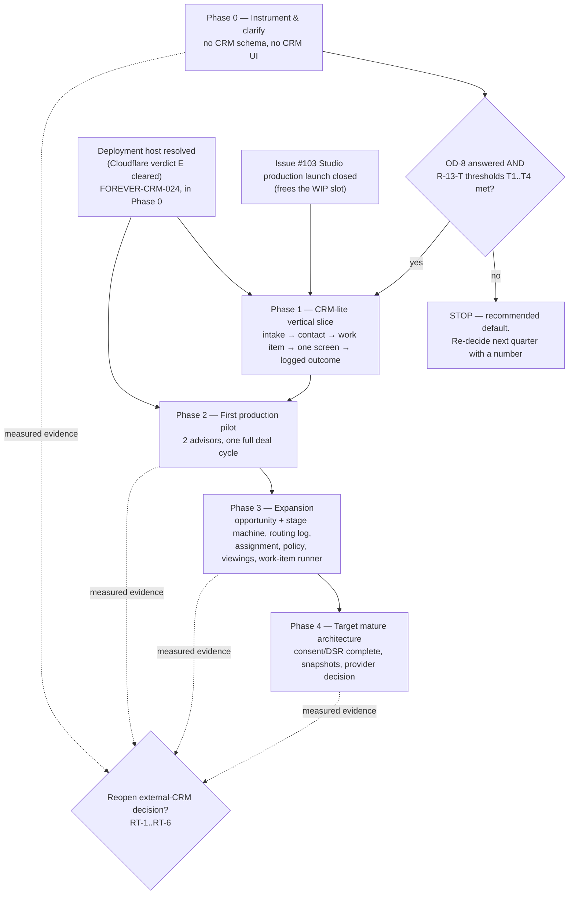
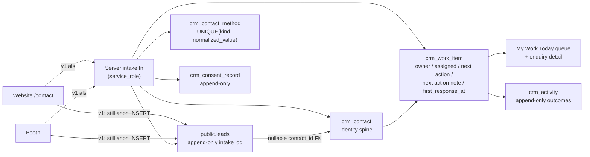

# Forever CRM Implementation Plan

Status: Draft architecture proposal — documentation only
Last updated: 2026-07-28
Task ID: FOREVER-CRM-ARCH-001

**This document authorizes nothing.** It proposes a build-versus-integrate decision, a phased plan, a backlog, a migration strategy, a risk register and an Owner Decision Register. It does not authorize implementation, does not create or modify any migration, does not change `docs/CURRENT_STAGE.md`, and does not promote any item out of `docs/BACKLOG.md`. Factory autonomy remains **A0 — propose only**. Every SQL block below is **illustrative — not a migration**. No CI exists in this repository, so no gate in this plan may be described as passing; gates pass only when a developer runs them locally and reports the result honestly. Privacy content is **architecture research, not legal advice**, and carries `[LAWYER]` flags where a Thai-qualified privacy lawyer must confirm before Forever relies on it.

Companion documents: `docs/FOREVER_CRM_ARCHITECTURE_V1.md` (design), `docs/FOREVER_CRM_CURRENT_STATE_AUDIT.md` (evidence), `docs/FOREVER_CRM_MARKET_RESEARCH.md` (sources), `docs/FOREVER_CRM_INDEPENDENT_REVIEW.md` (adversarial review).

Evidence tags: `[Repository fact]` `[Owner requirement]` `[Web research]` `[Inference]` `[Recommendation]` `[Unverified assumption]`.

---

## 0. The recommendation, stated first

An independent adversarial review found that this plan reached the right conclusion and then buried it. It is therefore stated here, before anything else, and again in full at §5 (R-13) and §6 (OD-8). All three statements are the same statement.

> **The architect's recommendation is: do Phase 0 only, and then stop and re-decide.** `[Recommendation]`

Phase 0 is measurement and housekeeping. It verifies that a lead actually arrives, counts enquiries by source, restores the project attribution `/contact` currently drops, publishes and versions a consent notice, documents a data-subject-request intake procedure, and resolves the deployment host identity. **It creates no `crm_*` table, ships no CRM screen, and does not consume the guest/product/commercial work-in-progress slot** currently held by issue #103.

**Phase 1 does not start until both of these hold:** Owner decision **OD-8** (§6) is answered in writing, **and** the four thresholds in Table R-13-T below are evaluated against real Phase-0 numbers. The same gate opens §21 of `docs/FOREVER_CRM_ARCHITECTURE_V1.md`, which reproduces the table below verbatim. If the two documents ever appear to disagree about Phase 1 / Slice 1, this plan's §2.3 and the architecture's §21.2 are the same list by construction — and this table is the gate in front of both.

**Table R-13-T — the four Phase 1 entry thresholds** `[Recommendation]`

| # | Evidence required | Threshold | Where the number comes from |
|---|---|---|---|
| T1 | Real inbound volume | **≥ 15** genuine enquiries in a single calendar month | Phase 0 monthly count (FOREVER-CRM-004) |
| T2 | Enquiries actually being lost | **≥ 3** enquiries in a month with no logged response within 48h | Phase 0 count plus a manual audit of the WhatsApp inbox |
| T3 | A concrete allocation dispute | **≥ 1** argument about who owned a lead that could not be settled from records | Owner report |
| T4 | Catalogue readiness | **5–8** project records usable in advisory | `docs/ROADMAP.md:120-125` exit criteria `[Repository fact]` |

If T1–T4 are not **all** met, Phase 0 is the whole programme for now. That is not a hedge: Phase 0 is cheap, is mostly housekeeping the audit surfaced anyway, and it produces the one number — enquiries per month — that makes the next decision evidence-based rather than architectural enthusiasm. `docs/ROADMAP.md:228`'s external-CRM trigger is *also* unevaluable without it, so Phase 0 is the prerequisite for both possible answers, build and buy alike. `[Repository fact]`

Two further constraints sit on top of that gate and are not discharged by this document: the **work-in-progress conflict** with issue #103 (§2.0), and the **deployment gate** — Cloudflare verdict E — which makes everything after Phase 1 unstartable and makes Phase 1 itself deliver zero business value (§2.0, FOREVER-CRM-024). `[Repository fact]`

---

## 1. Build versus integrate

### 1.1 The five options, stated fairly

| # | Option | What it actually means for Forever |
|---|---|---|
| A | **Forever-native operational layer** | New `crm_*` tables in the existing Supabase project, reached only through `createServerFn` + `requireSupabaseAuth` + a CRM membership middleware, rendered in the existing authenticated shell. |
| B | **Large external CRM** | HubSpot / Salesforce / Pipedrive / Follow Up Boss / Lofty as the system of record for people, enquiries, pipeline and activity. Forever keeps only project truth. |
| C | **Hybrid** | External CRM as the system of engagement; Forever as the system of record for projects, units, Navigator answers and Passport. Two-way sync of contacts and enquiries. |
| D | **External communication providers connected to Forever** | No external CRM. WhatsApp via a BSP, transactional email via Resend/Postmark/SES, calendar via `.ics`, all writing into Forever-owned tables. This is an **add-on to A, not an alternative to it**. |
| E | **Temporary CRM-lite manual operation** | The status quo: WhatsApp Business App as the inbox, a spreadsheet as the list, human memory as the pipeline. |

### 1.2 Scoring

Scale 1–5, 5 = best for Forever as it exists on 2026-07-28. Scores are the architect's judgement over the audited evidence; the reasoning column carries the load, not the arithmetic. `[Inference]`

| Criterion | A native | B external | C hybrid | D providers | E manual | Why the extremes fall where they do |
|---|---|---|---|---|---|---|
| Fit with One Engine, Many Interfaces | **5** | 1 | 2 | 4 | 2 | `docs/FOREVER_BRAIN_V1.md:288-328` already defines what CRM may own, must consume and must not own. A satisfies it by construction; B forces a second engine outside the boundary. `[Repository fact]` |
| Data ownership | **5** | 2 | 3 | 4 | 3 | A keeps every row in the Supabase project Forever already controls. E "owns" the data but in a form nobody can query or audit. `[Inference]` |
| Project/profile duplication risk (5 = lowest) | **5** | 1 | 2 | 4 | 2 | B and C require project and unit records inside the vendor to be useful, which is the exact failure `docs/FOREVER_BRAIN_V1.md:311-319` forbids. `[Repository fact]` |
| Integration cost (5 = lowest) | **5** | 2 | 1 | 3 | 5 | There is no integration surface to build in A. C pays for two-way sync forever. `[Inference]` |
| Vendor lock-in (5 = least) | 4 | 1 | 2 | 3 | **5** | A still locks Forever to Supabase and Cloudflare. Honest, not zero. `[Inference]` |
| Mobile usability | 3 | **5** | **5** | 3 | 2 | B/C ship native apps today; A must build a mobile screen, though `StudioShell` is a working reference. Spreadsheet-on-phone is genuinely bad. `[Repository fact]` |
| Team adoption | 3 | 3 | 1 | 4 | **5** | C is the worst: two systems means neither is trusted. E scores highest because it is already adopted — which is the problem, not the solution. `[Inference]` |
| Security posture | 4 | 4 | 3 | 3 | 1 | A inherits the proven "RLS on, no policies, service_role only, authorization at the app-server boundary" pattern (`supabase/migrations/20260721120000_forever_studio_v1.sql`). E has no access control at all. `[Repository fact]` |
| WhatsApp constraints | 4 | 2 | 2 | 2 | **5** | Any option that puts the agents' number on Cloud API risks deleting the account and locking the number out of the app permanently. E has zero such risk. `[Web research]` — https://developers.facebook.com/documentation/business-messaging/whatsapp/solution-providers/migrate-existing-whatsapp-number-to-a-business-account/ |
| Fit with **current** lead volume | 2 | 1 | 1 | 1 | **5** | Lead volume is not measured anywhere and no test lead has ever been observed to arrive end-to-end. At an unmeasured, plausibly near-zero volume, every built option is over-capacity. `[Repository fact]` |
| Future scale | 4 | **5** | 4 | 4 | 1 | E fails first and fails hardest. `[Inference]` |
| Total operating burden (5 = lowest) | 2 | 3 | 1 | 3 | 3 | A means Forever maintains schema, jobs, UI and privacy machinery itself, forever. This is the honest cost of the recommended option. `[Inference]` |
| **Total** | **46** | **30** | **27** | **38** | **39** | |

**Read the totals with this caveat, which the review is right about.** `[Inference]` The first five criteria — One Engine fit, data ownership, duplication risk, integration cost, vendor lock-in — are five expressions of one architectural preference, and they contribute 24 of Option A's 46 points. No criterion prices anything in money, and no criterion measures **time to first answered lead**, which is the dimension on which B and E beat A most decisively: a rented CRM answers a lead this week; Option A answers one after the Phase 0 and Phase 1 backlog is built and deployed. The reasoning column carries the load; the arithmetic is a summary, not the argument. Money is priced separately in §1.4.

Two results deserve to be read out loud rather than buried:

1. **Manual operation (E) scores second.** At today's measured volume — which is *no* measurement at all — the status quo is a defensible operating choice, and any plan that pretends otherwise is selling. `[Inference]`
2. **Hybrid (C) scores last.** It is the option that sounds most reasonable in a meeting and is worst in practice: it pays the integration cost of B, the build cost of A, and creates the duplicate project/profile truth that `docs/FOREVER_BRAIN_V1.md:311-319` forbids. `[Recommendation]`

Option D is not a competitor to A. It is a later layer on top of A, gated behind its own decision (see §2, Phase 4, and §6 OD-6).

### 1.3 The honest steelman for the external CRM

Stated as strongly as the evidence allows, before it is rejected:

- **Everything in this plan already exists, tested, in a product Forever can rent this afternoon.** Follow Up Boss ships a hard-capped claim window with a bounded fallback chain and writes every fallback to the lead timeline. Lofty ships an ordered first-match-wins routing rule list, per-agent working hours, a vacation toggle and a routing log, and cleanly separates Owner (provenance) from Assignee (work). `[Web research]` — https://help.followupboss.com/hc/en-us/articles/360014656193-First-to-Claim ; https://help.lofty.com/hc/en-us/articles/360055177831-Lead-Routing-How-to-set-up-lead-routing-rules ; https://help.lofty.com/hc/en-us/articles/115003544406-Lead-Ownership
- **Mobile is solved.** Agents get a maintained native app on day one. Forever's plan gets a responsive route it has to build, test and keep working on five-year-old Android phones. `[Inference]`
- **Forever has no CI and one engineer-equivalent.** `.github/workflows` does not exist. `[Repository fact]` Every "enforced" invariant in this plan is enforced only by a person choosing to run a command. A vendor's regression suite is not optional in the same way.
- **The build cost is real and recurring.** Option A's operating-burden score (2/5) is the lowest of any option except hybrid. Consent records, DSR case management, erasure that reaches backups, merge, routing logs, SLA sweepers — these are not features, they are a permanent maintenance surface.
- **Deployment is blocked.** `docs/FOREVER_STUDIO_PRODUCTION_PREFLIGHT_REPORT.md:21,44` records Cloudflare inventory **verdict E** and states that the production host identity, deployed revision and environment names are unverified. `[Repository fact]` A SaaS CRM does not require Forever to resolve its own hosting problem before an agent can answer a lead.

That last point is the strongest argument against building, and this plan does not dispose of it. It defers it: see §2 Phase 2 and §6 OD-7.

### 1.4 Decision

**D7 — Build Forever-native (Option A). Do not buy an external CRM.** `[Repository fact][Recommendation]`

The decision is not primarily a scoring outcome; it is triple-blocked in the repository's own governance:

| Authority | Text |
|---|---|
| `docs/ROADMAP.md:228` | "external CRM — trigger: lead volume exceeds the simple internal workflow" |
| `docs/ROADMAP.md:144` | "Use the existing Supabase lead boundary and Advisory foundations before buying or building a large CRM" |
| `docs/FOREVER_STRATEGIC_NORTH_STAR.md:254` | "Avoid a large external CRM until the lead volume and workflow justify it." |
| `docs/CURRENT_STAGE.md:224` | "large CRM integration" listed under **Out of scope** |

Reinforcing evidence from outside the repository: the industry's own API contracts have converged on durable Person + episodic work item, which is what a Forever-native design gives for free and what a Salesforce/Zoho-style purchase actively fights. HubSpot's Leads object "Must be associated with an existing contact" and is auto-deleted when its primary associations are removed; Pipedrive states "A lead always has to be linked to a person or an organization or both"; Attio has no Lead object at all. Salesforce's conversion is irreversible and leaves the lead read-only. `[Web research]` — https://developers.hubspot.com/docs/api-reference/latest/crm/objects/leads/guide ; https://developers.pipedrive.com/docs/api/v1/Leads ; https://docs.attio.com/docs/objects-and-lists ; https://help.salesforce.com/s/articleView?id=sales.faq_leads_what_happens_when.htm&type=5

**Forfeit recorded honestly:** choosing A forfeits a vendor's mobile app, a vendor's regression suite, and a vendor's ability to operate without Forever resolving its hosting blocker. `[Inference]`

#### 1.4.1 The money, on both sides, to an order of magnitude

The original draft of this plan recorded the build's return on investment as **"n/a"** while rejecting the external CRM. A review called that what it is: not a decision, a preference. Both sides are therefore priced below. The numbers are deliberately **bands, not quotes**.

**Side B — renting an external CRM.** Mainstream sales CRMs and real-estate vertical products are sold per seat per month. At Forever's stated team size the relevant question is 3–5 seats. `[Unverified assumption]`

| Seats | Order-of-magnitude band, per user per month | Order-of-magnitude band, per year, whole team |
|---|---|---|
| 3 | tens of USD per seat (roughly USD 20–100 depending on tier) | roughly USD 1k–4k |
| 5 | same per-seat band; vertical real-estate products sit at the top of it and some price a team minimum | roughly USD 1k–6k |

`[Unverified assumption]` **These bands were not retrieved from vendor pricing pages during this task and must not be quoted to the Owner as prices.** Fetching the published list price for 3 and for 5 seats of two mainstream products and one real-estate vertical product — with the pricing-page URL, tagged `[Web research]` — is task **FOREVER-CRM-049** in the Phase 0 backlog. Until it is done, the correct statement is "low single-digit thousands of USD per year", not a figure.

**Side A — building it.** This plan's own backlog is the estimate, since §3 states each task is one reviewable PR. `[Repository fact — this document]`

| Bundle | Reviewable PRs | Notes |
|---|---|---|
| Slice 0 / Phase 0 | 12 | Measurement, housekeeping, two doc-only privacy tasks, one pricing task, one external-blocker task. Most of it is not CRM work and would be worth doing under any option. |
| Slice 1 / Phase 1 | 17 | The vertical slice. Includes three test-harness PRs that exist only because there is no CI. |
| **Slice 0 + Slice 1** | **29** | Plus the recurring maintenance surface: schema, jobs, UI, consent machinery, DSR machinery — permanently. |
| Phases 2–4 (not recommended now) | 19 | Listed for completeness only. Backlog total 48. |

Forever has roughly one engineer-equivalent and no CI. `[Repository fact]` Even on a generous throughput assumption, 29 reviewable PRs is a **quarter-scale commitment of the only engineering capacity Forever has**, and it competes directly with the catalogue work `docs/ROADMAP.md:120-125` sequences first.

**The honest conclusion — say it plainly rather than implying cost decided it.** `[Recommendation]`

At 3–5 users the money difference between renting and building is **small in absolute terms either way**: low single-digit thousands of USD a year against a quarter of the only engineer's attention. Neither number is large enough to decide anything by itself, and anyone presenting either as decisive is arguing from a preference they have not stated. **The decision therefore turns on the two things that are not fungible: data ownership and the One Engine, Many Interfaces boundary** (`docs/FOREVER_BRAIN_V1.md:288-328`) — plus the fact that D7 is triple-blocked in Forever's own governance and this document has no authority to unblock it. `[Repository fact]`

The corollary is uncomfortable and is recorded rather than hidden: **if the One Engine boundary were not binding, cost would not save the build.** The build only pays for itself once the CRM is doing something a rented seat cannot — holding Navigator answers, project truth and buyer evidence in the same engine — which is a Phase 3–4 property, not a Phase 1 one. That is a further reason the recommendation in §0 is Phase 0 only.

**And the opportunity cost runs the other way too.** The comparison above prices building against renting. It does not price building against *not doing this at all* and spending the same quarter on the catalogue. At an unmeasured, plausibly near-zero lead volume, that third option is the one R-13 says is most likely correct, and no amount of seat-price arithmetic addresses it. `[Inference]`

### 1.5 What would reopen the decision — and why it currently cannot be evaluated

`docs/ROADMAP.md:228` makes the trigger "lead volume exceeds the simple internal workflow". **Lead volume is not measured anywhere in this repository.** There is no SELECT against `public.leads` in any file, no SELECT policy on the table, no dashboard, no counter, and no report. `[Repository fact]` — `supabase/migrations/20260704132000_create_leads.sql` grants only `INSERT` to `anon, authenticated` and creates exactly one policy, `"Anyone can submit a lead"`, `FOR INSERT`. The single write path is `src/lib/lead-service.ts:92`. Worse, PR #118's gate G0 records that **a test lead has never been observed to arrive end-to-end** (`src/features/project-detail/contact-actions.ts`). `[Repository fact]`

So the governing trigger is presently **unevaluable**. A future Owner asked "has lead volume exceeded the simple internal workflow?" has no number to look at. Fixing that is Phase 0 of this plan, and it is deliberately placed before any CRM schema.

**Reopen triggers, in measurable form.** Each is a standing condition; if any fires, this decision returns to the Owner with data. `[Recommendation]`

| ID | Trigger | Measured from | Threshold |
|---|---|---|---|
| RT-1 | Inbound enquiry volume outgrows manual work | `count(*)` of intake rows per calendar month, by source | ≥ 40 enquiries/month sustained for 3 consecutive months **and** median first-response time above the Owner-set target in ≥ 2 of those 3 months |
| RT-2 | Concurrent pipeline outgrows a single list | count of open `crm_opportunity` rows | > 25 concurrently open for 2 consecutive months |
| RT-3 | Team outgrows informal allocation | count of active CRM-capable `studio_members` | ≥ 8 people working leads |
| RT-4 | Maintenance eats the product | CRM-attributable merged PRs ÷ total merged PRs, per quarter | > 20% for 2 consecutive quarters with no corresponding funnel improvement |
| RT-5 | A required capability is cheaper to rent | build estimate for a named **capability bundle**, in reviewable PRs, taken from §3's backlog | a bundle costs > 6 reviewable PRs **and** a vendor ships the whole bundle as a documented feature **and** the bundle is not itself protected by the One Engine boundary |
| RT-6 | Multi-channel inbox becomes unavoidable | % of client interactions never logged within 24h | > 40% unlogged for one full deal cycle after Phase 2 (this is the D6 kill criterion for manual outcome capture) |

**RT-5 needs its unit of measure stated, or it is unusable.** `[Recommendation]` A review found the original wording — "a needed capability costs > 6 reviewable PRs" — either fires immediately or can never fire, depending on whether "capability" means a task or a phase. It means a **bundle**: "the Phase 1 slice", "merge and dedup", "consent and DSR". Applied honestly and stated here rather than left for the reader to discover:

- **The Phase 1 slice is 17 reviewable PRs and every capability in it — a person record with deduplication, consent capture, a work queue, an activity log — is a documented feature of the vendors cited in §1.3. By its own arithmetic RT-5 is already met.**
- The decision nevertheless stands, and for reasons that are not arithmetic: D7 is triple-blocked in Forever's own governance (§1.4), the money difference at 3–5 seats is small either way (§1.4.1), and the capabilities in question sit inside the One Engine boundary that `docs/FOREVER_BRAIN_V1.md:288-328` reserves to Forever. That is why RT-5 now carries a third condition.
- RT-5's real force is therefore against **later** bundles that are *not* boundary-protected — a shared inbox, a sequencing engine, a calendar sync. When one of those is proposed, RT-5 should be applied and will probably say rent.

**Instrumentation that must exist before any of these can be read** — none of it exists today `[Repository fact]`:

1. A monthly enquiry count by `source`, resolved through a **reference table** (`crm_intake_channel` / `crm_intake_channel_alias`, with an unmapped value resolving to `unmapped`) — **never through a CHECK constraint on `leads.source`**, which would fail the insert closed the first time a new channel appeared. See the note at the head of §3 and the architecture's §9.1.
2. A stored `first_response_at` timestamp per enquiry, reported as a **median by source and by hour of day**, never a mean — one lead answered three days late destroys a mean and leaves the median honest. `[Web research][Recommendation]`
3. A count of open opportunities (there is no `crm_opportunity` entity today, and it is deliberately **out** of Phase 1 — so RT-2 is not readable until Phase 3).
4. A count of active CRM-capable staff (`studio_members` has two roles, neither of which is an advisor role; `supabase/migrations/20260721120000_forever_studio_v1.sql`). `[Repository fact]`
5. A per-quarter tally of CRM-attributable merged PRs (a discipline, not a system).

Until items 1–3 exist, any claim that Forever does or does not need an external CRM is an opinion. `[Inference]`

---

## 2. Phased implementation roadmap

### 2.0 Sequencing rules that bind every phase

- **No calendar dates.** Phases are ordered by dependency and complexity. The only fixed dates anywhere in this plan are externally imposed: the PDPC access-request notification effective **14 September 2026** `[Web research]` (https://www.lexology.com/library/detail.aspx?g=c144fd43-9ba7-4065-a8ee-f1739ff3a11d ; corroborated at https://www.grandlinux.com/en/blogs/pdpa-data-subject-access-request-2026.html), and Meta's WhatsApp pricing dates — rates published by **1 September 2026**, service messages and in-window utility templates becoming billable **1 October 2026** `[Web research]` (https://developers.facebook.com/documentation/business-messaging/whatsapp/pricing).
- **Every phase needs an external signal.** "Technical merge is not enough to close a phase. Every major phase needs an external signal such as guest feedback, partner feedback, a developer decision, a viewing, a reservation, a closed deal, or a measured operating improvement." — `docs/ROADMAP.md:195`; restated at `docs/FOREVER_STRATEGIC_NORTH_STAR.md:266-273`. `[Repository fact]`
- **Work-in-progress limit.** "Forever should normally have no more than: one active guest/product/commercial task; and one active data/operations task." — `docs/FOREVER_STRATEGIC_NORTH_STAR.md:266-273`. `[Repository fact]`

**WIP conflict, stated plainly.** The guest/product/commercial slot is currently held by the Forever Studio production launch (issue #103), which is P0, explicitly names "WhatsApp/CRM automation" among its non-goals, and instructs pausing non-blocking product expansion. `[Repository fact]` Consequences:

| Phase | Consumes a WIP slot? | Verdict |
|---|---|---|
| Phase 0 | Data/operations slot | Compatible **if** the data/operations slot is free. Phase 0 is measurement and housekeeping, not product. |
| Phase 1 | Guest/product/commercial slot | **Violates the WIP limit while #103 is open.** Phase 1 must not start until #103 closes, or the Owner must explicitly and in writing accept a two-product-task period. |
| Phase 2 | Guest/product/commercial slot | Same constraint, plus a hard dependency on deployment. |
| Phase 3–4 | Guest/product/commercial slot | Same constraint. |

This document does not resolve that conflict. It is Owner decision **OD-8**.

**Deployment gate — where it bites.** `docs/FOREVER_STUDIO_PRODUCTION_PREFLIGHT_REPORT.md:21,44,214` records Cloudflare inventory **verdict E**: the account and Workers & Pages surfaces never rendered, a read-only dashboard API GET was blocked by the browser, and no authorized Wrangler session exists — so the host identity, deployed revision, routes and the four production environment names are all unverified. `[Repository fact]`

| Where the gate bites | Effect |
|---|---|
| Phase 0 | Barely. Delivery verification (G0) needs *a* working environment, not necessarily production. |
| Phase 1 | Buildable and testable locally. **Delivers zero business value.** A CRM that cannot be deployed is a schema and a screenshot. |
| Phase 2 | **Hard stop.** A server-only service-role secret needs a deployed environment to live in; the 5-minute cron tick needs a deployed Worker. Phase 2 cannot begin. |
| Phase 3–4 | Blocked transitively. |

Anyone reading only one line of this section should read this one: **resolving the host identity is a higher-priority CRM task than any CRM code.** `[Recommendation]`

**The backlog now says the same thing.** A review pointed out that the original draft asserted the sentence above and then placed FOREVER-CRM-024 ("Resolve deployment host identity") at implementation order 24 in Phase 2, behind 23 PRs, with no dependencies of its own. That was incoherent. **FOREVER-CRM-024 is now Phase 0, order 1** — it keeps its ID, because IDs are never reused. Its phase is where it always should have been.

It follows, and is stated plainly rather than left to inference: **if the deployment gate has not cleared, Phase 1 is deliberately speculative pre-work.** It can be built and tested locally, and it delivers nothing to any advisor. The Owner is entitled to stop after Phase 0 with nothing built — see §0 and OD-8.

### 2.1 Phase map



The `DEP --> P1` edge is drawn deliberately. It is not a hard technical block — Phase 1 compiles and tests locally without it — but a Phase 1 that ships behind an unresolved deployment gate is, by this document's own words, "a schema and a screenshot".

### 2.2 Phase 0 — Instrument and clarify (before any CRM implementation)

**Purpose.** Answer the questions whose absence would make every later decision guesswork, and clear the housekeeping the audit surfaced. No `crm_*` table is created in this phase.

| What must be measured or clarified | Why it must come first |
|---|---|
| Does a lead actually arrive? | Gate G0 says no test lead has ever been observed end-to-end. `[Repository fact]` Building a pipeline on an unverified pipe is the single highest-cost mistake available. |
| How many enquiries per month, by source? | `docs/ROADMAP.md:228`'s external-CRM trigger is unevaluable without it. |
| What is the controlled `source` vocabulary, and where does it live? | `leads.source` is unconstrained `TEXT` with five live values plus one PR #102 would add. Every later report is nonsense without it. The vocabulary lives in a **reference table**, never in a CHECK on `leads.source` — see the withdrawal note at the head of §3. `[Repository fact]` |
| Is the deployment host identity resolved? | Cloudflare verdict E blocks every phase after Phase 1 and makes Phase 1 itself deliver nothing. This is FOREVER-CRM-024 and it has no dependencies. `[Repository fact]` |
| Is there a documented DSR intake procedure, and a versioned consent notice? | The PDPC access-request notification has a **hard external date** and does not wait for the CRM. Under this plan's own recommended path (Phase 0 only) these are the sole mitigations of risk R-3, so they must not sit downstream of CRM schema. `[Web research][LAWYER]` |
| What does an external CRM actually cost for 3–5 seats? | §1.4.1 prices the build honestly and the rent side only as a band. A build-versus-rent decision presented without one retrieved list price is not a decision. `[Recommendation]` |
| Is project attribution being lost? | `/contact` never sets `project_slug`; only Booth does. `ProjectContactCTA` passes it but is unreached. `[Repository fact]` |
| What are the Owner's answers to §6? | Consent design, retention and the 21-day rule cannot be built around an unanswered question, and PDPA binds the lawful basis at collection — it cannot be retro-fitted. `[Web research][LAWYER]` |
| Are the phantom `navigator_*` declarations still on disk? | Leaving them there while building `crm_contact` creates the second client-profile system the mission forbids. `[Repository fact]` |

**Exit criteria.** A test lead is observed arriving, with a timestamp and a named confirming person; a monthly enquiry count exists and has produced at least one real number; the intake-channel vocabulary is documented and seeded; the deployment host identity is resolved or its failure is recorded; a DSR intake procedure and a versioned consent notice exist as documents; the Owner Decision Register has recorded answers to OD-1..OD-8 (or explicit deferrals with an accepted cost).
**External signal.** The Owner can state, from a number rather than a feeling, how many enquiries arrived last month and how many were never answered.
**Kill / review trigger.** If the measured count is **zero or near-zero for three consecutive months**, Phase 1 does not start — the correct action is demand generation and catalogue work, not CRM construction (see §0, §5 R-13, and `docs/ROADMAP.md:120-125`, which sequences 5–8 usable project records before advisor conversion).

### 2.3 Phase 1 — The smallest useful CRM-lite vertical slice

**Gate.** Phase 1 does not start until OD-8 is answered and Table R-13-T's thresholds T1–T4 are evaluated. See §0.

**The slice, in one sentence:** an enquiry arrives through a server boundary, becomes attached to a durable person, becomes one work item with an owner and a next action, appears on one advisor's phone screen, and the outcome of contacting that person is logged durably and auditably.

#### 2.3.1 Slice 1 Scope IN — normative, and identical to `FOREVER_CRM_ARCHITECTURE_V1.md` §21.2

This list and the architecture's §21.2 are **one list**. They were reconciled deliberately after a review found three mutually incompatible definitions of Slice 1 across the package. If they ever diverge again, that is a defect in whichever document was edited last, not a choice for the implementer.

| # | In scope | Note |
|---|---|---|
| 1 | `crm_contact` | The durable person identity spine |
| 2 | `crm_contact_method` | With the `(kind, normalized_value)` UNIQUE index — the dedup engine |
| 3 | `crm_consent_record` | Append-only, three-state, notice-version and locale recorded |
| 4 | `crm_activity` | Append-only outcome log |
| 5 | `crm_work_item` | Carrying `owner_user_id`, `assigned_user_id`, `next_action_at`, `next_action_note` and `first_response_at` — **on the work item, not on an opportunity** |
| 6 | `leads.contact_id` | One additive nullable FK, plus the two provenance columns and the privilege tightening of §4.2 rule 3a |
| 7 | The server-boundary read path | `createServerFn` → auth → CRM membership → safe-error envelope |
| 8 | One mobile **"My Work Today"** screen | The queue. Named so that it does not imply an opportunity or a deal exists — neither does |
| 9 | One enquiry detail screen | Where an outcome is logged in ≤ 3 taps |
| 10 | The Owner's two numbers | Median first response time, and the count of unworked enquiries. Nothing else |

**Where the work item's columns live, and why it matters.** `owner_user_id`, `assigned_user_id`, `next_action_at`, `next_action_note` and `first_response_at` sit on `crm_work_item`. They do **not** go on `crm_opportunity`, which does not exist in Phase 1, and they do **not** go on `public.leads`, which would be exactly the accretion failure D1/D2 exists to prevent. An earlier draft left these columns homeless and Slice 1 unbuildable; FOREVER-CRM-044 is the task that gives them a home. `[Recommendation]`

**Ownership FK, per the reconciliation.** `owner_user_id` and `assigned_user_id` reference `public.studio_members(user_id)` — which is that table's PRIMARY KEY and therefore a valid FK target `[Repository fact]` — **not** `auth.users(id)`. `owner_user_id` is `ON DELETE RESTRICT` and is accompanied by a write-once `owner_display_name TEXT NOT NULL` snapshot stamped at creation. Deactivating an agent is `studio_members.is_active = false`, never a row delete. The reason is concrete: `studio_members.user_id` cascades from `auth.users` `[Repository fact — 20260721120000_forever_studio_v1.sql:84]`, so an `ON DELETE SET NULL` FK to `auth.users` would silently erase permanent credit during ordinary offboarding, and the whole ownership-versus-assignment bargain in D4 depends on that credit surviving.

#### 2.3.2 Slice 1 Scope OUT — also normative

`crm_opportunity` and the entire stage machine. Routing rules and `crm_routing_log`. `crm_assignment` offers and the fallback chain. `crm_policy`. Viewings. Sequences. **Any outbound send of any kind** — there is no transport in v1, so no screen in Phase 1 may promise a response time to a guest. No SLA escalation, no `crm_work_item` claim/heartbeat **runner** (the table exists in Phase 1; the durable-job machinery around it does not). No merge UI. No notifications.

#### 2.3.3 What is nevertheless mandatory in Phase 1 and cannot be deferred

- `crm_consent_record`, append-only, capturing the exact notice wording version, locale, method and timestamp, with marketing consent physically separate from service consent and defaulting FALSE. Thai PDPA binds the lawful basis **at collection** (s24) and s27 gates later use on how the data was originally collected — you cannot silently re-base data later, so this cannot be a Phase 3 retrofit. `[Web research][LAWYER]` — https://www.mdes.go.th/law/detail/3577-Personal-Data-Protection-Act-B-E--2562--2019-
- Append-only enforced against **`service_role` as well**, because `service_role` is the only role the application actually uses. `REVOKE ALL ... FROM PUBLIC, anon, authenticated, service_role;` **then** the narrow `GRANT INSERT, SELECT ... TO service_role;`. A REVOKE that omits `service_role` makes the guarantee vacuous, and the repository's own `20260721123000_studio_internal_acl_hardening.sql:1-3` documents that platform default privileges can grant access to newly-created tables. `[Repository fact]`
- The `(kind, normalized_value)` UNIQUE index on contact methods. It is the dedup engine, and it is a constraint rather than an application rule precisely so it holds regardless of which code path writes. `[Web research][Recommendation]`
- The bundle-boundary test for CRM client-reachable files. Without it the "no service-role key in the browser bundle" invariant is a convention, not an invariant. `[Repository fact]` — the precedent is `src/lib/lead-demo-mode-bundle-boundary.test.ts`.

**Exit criteria.** A lead submitted from the public site is visible to an authenticated advisor on a phone, the advisor logs one outcome, the outcome survives a page reload, `audit_log` contains the mutation, and the Owner's two numbers render from real rows. All local test commands are run and their real results reported.
**External signal.** One real guest is contacted through the queue rather than through someone's memory, and the advisor says whether the screen helped or got in the way.
**Kill / review trigger.** If, after the slice exists, advisors still work from WhatsApp and the spreadsheet for two consecutive weeks, **stop and diagnose adoption before building Phase 3.** More features do not fix non-adoption (see §5, R-1).

### 2.4 Phase 2 — First production pilot

**Blocked on:** deployment host resolution (verdict E) and issue #103. Not startable before both.

Scope: two advisors, real leads, one full off-plan deal cycle, with pre-declared kill criteria written *before* the pilot begins. Add the duplicate-candidate view (unindexed, and **extension-free** — `pg_trgm` is enabled in no migration in this repository, so the view must not call `similarity()`; a sequential scan over a few hundred rows is sub-millisecond and a trigram index would be pure maintenance cost at this row count) `[Repository fact][Web research]`; add the `crm_dsr_request` table; and put the Phase 0 DSR procedure onto a real record.

`first_response_at` capture and the median-by-source report are **no longer here** — they moved to Phase 1 (FOREVER-CRM-026), because they are one timestamp column plus one aggregation, they depend only on the work record, and they are the only thing that makes Slice 1 measurable at all. The architecture's §21.2 promises the Owner a median after Slice 1; this plan now delivers it there rather than contradicting it. `[Recommendation]`

**The DSR item carries a real deadline, and its *procedure* is a Phase 0 task.** The PDPC access-request notification takes effect **14 September 2026** on the reading this package uses, and requires at minimum an in-person and a postal intake channel — a web form alone does not discharge it. `[Web research][LAWYER]` — https://www.lexology.com/library/detail.aspx?g=c144fd43-9ba7-4065-a8ee-f1739ff3a11d The date itself is contested: a consultation-draft reading gives 30 days from publication rather than 60, which would bring it forward by roughly a month. **Plan to the earlier date and treat the date as `[LAWYER]`, not as settled.** What is in Phase 2 is the `crm_dsr_request` **table**; the documented procedure and the versioned consent notice are FOREVER-CRM-047 and FOREVER-CRM-048 in **Phase 0**, with zero dependencies, because under this plan's own recommended path (Phase 0 only) they are the sole mitigation of risk R-3.

**Exit criteria.** Median first-response time has a baseline over real pilot traffic (the capability itself shipped in Phase 1). At least one enquiry is demonstrably worked from first touch to a logged outcome inside the system.
**External signal.** A guest, partner or developer interaction that the system materially helped — a viewing booked, a reservation, or a measurable operating improvement (`docs/ROADMAP.md:195`).
**Kill / review trigger.** Pre-declared: if fewer than 60% of interactions are logged within 24h, or if more than one lead goes dark with no logged outcome, the pilot is paused and the adoption problem is addressed before expansion. `[Recommendation]`

### 2.5 Phase 3 — Expansion

Only after Phase 2 produced measured evidence. Adds, in dependency order: the **durable-job runner** over the Phase-1 `crm_work_item` table — claim token, heartbeat, stale recovery, `attempt_count`, `retryable`, fingerprint idempotency — replicating the proven `studio_upload_jobs` pattern in a **separate** table (the Studio due-jobs RPC joins `studio_members` and applies a shared LIMIT, so CRM rows would starve or be starved) `[Repository fact]`; the CRM tick on the existing Cloudflare cron trigger; ownership-versus-assignment with a `crm_routing_log` row per decision and `crm_assignment` offers with a bounded fallback chain; `crm_policy` as the versioned configuration table behind both; `crm_opportunity` with `crm_opportunity_party` and `crm_opportunity_stage_event`; `crm_viewing` and its feedback queue; and writers for `price_updates` and `project_status_history`, both of which have correct shape and **zero writers** today. `[Repository fact]`

**The sweeper predicate must be able to see the rows it is supposed to recover.** `WHERE status = 'pending'` alone can never surface a stale `processing` row or a `failed AND retryable` row, which would contradict this package's own claim that a stale claim is recoverable and never orphaned. The predicate mirrors Studio exactly: `status = 'pending' OR (status = 'failed' AND retryable IS TRUE) OR (status = 'processing' AND heartbeat_at < now() - <stale_interval>)`, with the interval stated rather than implied — Studio uses `STALE_PROCESSING_SECONDS = 900` `[Repository fact — src/features/forever-studio/server/service.ts:88]`.

**Phase 3 is where the routing apparatus is genuinely at risk of being over-built,** and the guard is already written down: FOREVER-CRM-033 and FOREVER-CRM-034 are gated on Table R-13-T's T3 (≥ 1 unresolvable allocation dispute) **and** ≥ 3 advisors actively assigned work. Below that, assignment is one nullable `assigned_user_id` set by the Owner and a reassignment is an `audit_log` row. Building a rule engine to arbitrate between two people who share an office is the failure mode. `[Recommendation]`

**The honest SLA consequence.** The only cron expression in the repository is `*/5 * * * *`. `[Repository fact]` Timestamps are stored to the second, so a 2-minute acknowledgement target is **measurable** exactly; but escalation **fires** at ≤5-minute resolution. Do not promise 2-minute escalation on this runtime. All SLA numbers are configurable policy rows, never hard-coded UI text. `[Recommendation]`

**Exit criteria.** An allocation argument is settled by reading `crm_routing_log` rather than by recollection. Contact-to-viewing has a baseline.
**External signal.** A viewing or reservation attributable to work the system routed.
**Kill / review trigger.** If `crm_routing_log` is never read in a full quarter, the routing machinery is over-built — freeze it and revert to manual assignment.

### 2.6 Phase 4 — Target mature architecture

The end state, not a promise to reach it: consent and DSR machinery complete including an erasure pipeline that reaches copies and backups within 90 days `[Web research][LAWYER]` (https://www.lawplusltd.com/2024/08/rules-on-deletion-destruction-or-anonymization-of-personal-data/); a marketing send log that re-checks consent **at send time, not at list-build time**; immutable snapshots of what was sent to a client (Advisor Report and Passport are generated on the fly and never persisted, so "what we sent" must be Forever's own snapshot) `[Repository fact]`; and a decision point — not a commitment — on communication providers.

**Exit criteria.** A data-subject access request is answered end-to-end from system data within the statutory window. A client-facing snapshot is reproducible months later.
**External signal.** A closed transaction in which Forever materially influenced the decision — the North Star metric itself.
**Kill / review trigger.** RT-1..RT-6 evaluated at this point with real data; if RT-4 or RT-5 has fired, the external-CRM decision reopens with evidence.

### 2.7 Explicitly deferred

| Deferred | Why | Trigger to revisit |
|---|---|---|
| External CRM purchase | `docs/ROADMAP.md:228`, `:144`, North Star `:254`, `CURRENT_STAGE.md:224` `[Repository fact]` | RT-1..RT-6 (§1.5) |
| WhatsApp Business Platform integration | D6. Self-onboarding the agents' number deletes the account and permanently locks the number out of the app; and Meta's economics invert on 1 Oct 2026 with rates unpublished until 1 Sep 2026. `[Web research]` | RT-6 fires **and** a BSP supporting coexistence onboarding is shortlisted; re-run the cost maths after 1 Sep 2026 |
| Shared inbox / chat UI inside Forever | Reimplementing a messaging client is the most expensive common mistake here. `[Web research]` | Never as a first iteration |
| Workflow/automation engine | HubSpot's own re-enrolment docs describe four interacting non-obvious rules, including replaying every action from the start. Building automation before instrumentation is how you send a client the same email three times. `[Web research]` — https://knowledge.hubspot.com/workflows/add-re-enrollment-triggers-to-a-workflow | After Phase 3 instrumentation is stable for one full deal cycle |
| Two-way calendar sync | Conflict resolution, ownership rules, tombstones, timezone correctness across Asia/Bangkok and clients' zones. `.ics` write-only first. `[Web research]` | Agents demonstrably double-book despite `.ics` |
| Lead score / fit percentage / ranking | `src/features/navigator/core/matching.ts:8-11` states this as a hard NAV-001 §09 rule; the evaluator preserves catalogue order without re-ranking. `[Repository fact]` | Never under NAV-001 |
| Weighted-pipeline forecasting | Statistically meaningless at Forever's deal count, and Pipedrive defaults every stage to 100% so an unconfigured pipeline reports weighted = total. `[Web research]` — https://support.pipedrive.com/en/article/probability-in-pipedrive | RT-2 fires |
| `households` table | Asserts a permanent grouping the business does not have; the same two people may be joint buyers on one unit and not another. Use `crm_opportunity_party`. `[Web research]` | Never |
| Field-by-field merge picker UI | Primary-wins-with-null-fill is deterministic and testable in one function. `[Web research]` — https://knowledge.hubspot.com/records/merge-records | Never at this size |
| Probabilistic record linkage / soundex / metaphone | PostgreSQL's own docs: these "do not work well with multibyte encodings" and Soundex "is not very useful for non-English names" — half of Forever's names are Cyrillic. `[Web research]` — https://www.postgresql.org/docs/current/fuzzystrmatch.html | Never |
| ERP / accounting / invoicing | Out of the CRM boundary entirely (`docs/FOREVER_BRAIN_V1.md:288-328`). `[Repository fact]` | Separate Owner decision, separate task ID |
| Issue #101's 15 speculative `developer_*` tables | #101 does not authorize implementation; #103 lists Developer Check as a non-goal. Reserve one nullable reference seam. `[Repository fact]` | #101 promoted to a stage |
| Cloudflare Queues / Workflows / Durable Objects | Previously evaluated and rejected as infrastructure this repository cannot validate. `[Repository fact]` | Never on this plan |

### 2.8 Each phase against Forever's own feature decision test

`docs/FOREVER_STRATEGIC_NORTH_STAR.md:276-292` makes a five-criterion gate **mandatory** before accepting "a feature, automation, subscription, or foundation", with the pass rule *strong value in at least two of the first three categories*. `[Repository fact]` The original draft of this plan proposed five phases and never ran that gate once. It is run here, and it is not run flatteringly.

| Phase | Commercial value | Operating value | Data value | Maintenance cost | Reversibility | Verdict against the pass rule |
|---|---|---|---|---|---|---|
| **Phase 0** | Weak directly — but it is the only thing that makes any commercial claim checkable | **Strong** — attribution restored, delivery verified, host identity resolved | **Strong** — it creates Forever's first lead measurement | Near zero; mostly housekeeping | Fully reversible | **PASS** — strong in two of the first three |
| **Phase 1** | Weak while deployment is unresolved (zero, by this document's own words) | Moderate — one screen, if advisors adopt it | **Strong** — the identity spine and consent record cannot be retrofitted | High and permanent | Poor — tables holding real people are not dropped | **MARGINAL.** Passes only if T1–T4 are met and the deployment gate has cleared |
| **Phase 2** | Moderate — a real pilot with real leads | Moderate | Moderate — first response-time baseline | High | Poor | **CONDITIONAL** on Phase 1 having earned its place |
| **Phase 3** | Weak at current headcount | **Weak** — a routing engine to arbitrate between two people in one office | Moderate | High | Poor | **FAIL at today's baseline.** Belongs in `docs/BACKLOG.md`, not on a roadmap, until T3 and ≥ 3 advisors are real |
| **Phase 4** | Weak — end state, not a commitment | Weak | Moderate | High | Poor | **FAIL at today's baseline.** Listed as an end state; it is not proposed for scheduling |

Two things follow and are stated rather than left implied. First, **Phase 0 is the only phase that passes the Owner's own gate unconditionally** — which is the same answer §0 gives from a different direction. Second, **Phases 3 and 4 do not currently earn a roadmap slot** and should be read as a described end state, not as work that has been approved in principle. `[Recommendation]`

---

## 3. Implementation backlog

**Conventions.** IDs are stable and never reused. "Order" is the suggested implementation sequence across the whole backlog. Each task should be **one reviewable PR**. Risk is L/M/H. "Migration" states whether the task ships a migration file and of what kind.

**Withdrawn during review — FOREVER-CRM-003, `leads.source` CHECK constraint.** The task is deleted, its ID is retired and is never reused, and the remaining tasks are **deliberately not renumbered**: a gap that is explained is more honest than a silent renumber, and the surrounding documents already cite these IDs. The reason for withdrawal: `leads.source` is written from the browser under the anon INSERT policy, which v1 deliberately leaves in place, so a CHECK would reject the insert closed the first time anyone added a landing page, a new CTA or PR #102's `booth_v2` value — the architecture calls this "a silent lead loss at the front door" and forbids it in bold. The vocabulary is instead resolved server-side through the `crm_intake_channel` / `crm_intake_channel_alias` reference tables, whose unmapped case resolves to `unmapped` rather than rejecting. FOREVER-CRM-002 is retargeted to seeding those tables; FOREVER-CRM-010 no longer depends on 003; and §4.4's forward/reverse row for the CHECK is deleted. `[Repository fact][Recommendation]`

**Re-phased during review, IDs unchanged:**

| Task | Was | Now | Why |
|---|---|---|---|
| FOREVER-CRM-024 (deployment host identity) | Phase 2, order 24 | **Phase 0, order 1** | It has no dependencies and §2.0 says it outranks all CRM code. Placing it 23rd contradicted the document's own most-emphasised sentence |
| FOREVER-CRM-026 (`first_response_at` + the Owner's two numbers) | Phase 2 | **Phase 1** | One timestamp column and one aggregation, depending only on the work record. It is the only thing that makes Slice 1 measurable, and the architecture's §21.2 already promises it after Slice 1 |
| FOREVER-CRM-020 (bundle-boundary test) | deps 013, 017, 018 | **deps 013**, re-run as an acceptance gate on 017, 018, 019 | A source-text test needs an enumerated file list, not the later files. It is the only barrier between a service-role key and the browser bundle, so it must not be the twentieth thing built |

**Added during review** (new IDs, appended — no renumbering): FOREVER-CRM-044 (`crm_work_item` work record, Phase 1), 045 (enquiry detail screen, Phase 1), 046 (`crm_assignment` offers and fallback chain, Phase 3), 047 (DSR intake procedure, doc-only, Phase 0), 048 (consent notice wording published and versioned, Phase 0), 049 (retrieve external-CRM list prices, Phase 0).

**Test-strategy honesty, stated once and applying to every row.** `[Repository fact]`
- Vitest 3 + Testing Library + jsdom are the established conventions (378 test files).
- `scripts/studio/run-postgres-tests.mjs` (disposable PostgreSQL) is the **only** place RLS, GRANTs and PL/pgSQL semantics actually execute. If a task's guarantee is a policy, a grant or a function body, that suite is its only real test.
- `*-migration-contract.test.ts` pins migration filenames and required literal content — the precedent already exists in the Studio work.
- Bundle-boundary tests pin literal source text (`src/lib/lead-demo-mode-bundle-boundary.test.ts` asserts exactly one `export async function submitLead` and exactly one `from("leads")`).
- **There is no CI.** No `.github/workflows` exists. Every "enforced" claim below is enforced only by a developer choosing to run the command locally and reporting the result honestly. No row may be marked done on the basis of a gate "passing".

### Phase 0 — Instrument and clarify

| ID | Title | Deps | Acceptance criteria | Test strategy | Migration | Risk | Order |
|---|---|---|---|---|---|---|---|
| FOREVER-CRM-024 | Resolve deployment host identity (external blocker) | — | Cloudflare account, Worker/Pages target, deployed revision, routes and the four production environment names are all verified from authoritative evidence; verdict E cleared, or the specific reason it cannot be cleared is recorded with a named owner and a date | Not a test target — an evidence runbook with recorded results | none | H | 1 |
| FOREVER-CRM-001 | Verify lead delivery end-to-end (discharge gate G0) | — | A test lead is observed arriving in a non-production context; observation recorded with timestamp and named confirming person; a deliberately failed submission surfaces an honest error to the user **and leaves an operator-visible trace** (today the submitting user sees an error but nothing reaches Forever) | Manual observation runbook + a Vitest case asserting the failure path throws the user-safe message | none | H | 2 |
| FOREVER-CRM-047 | Documented DSR intake procedure (doc-only, no schema) | — | A written data-subject-request procedure with **an in-person and a postal channel**, not only a web form; a named responsible person; a stated response clock and how it is started; a manual register the procedure can be run from with no CRM at all | Doc review; a dated dry run recorded against a fabricated internal request | none | H | 3 |
| FOREVER-CRM-048 | Publish and version the consent notice wording | 047 | The notice wording exists as a versioned, locale-tagged string and is shown at the existing intake. **No schema change is required and none is made**: `public.leads` has nowhere to store a version in Phase 0, so the version is pinned by a **notice register** recording each version's exact text, locale and the date range it was live — which lets any enquiry be attributed to a version by its `created_at`. When `intake_metadata` arrives (FOREVER-CRM-015) the version is written per row and the date-range inference is retired. No lawful basis is asserted for any row collected before the notice existed | Vitest asserting the versioned string is rendered at both intakes; doc review of each locale `[LAWYER]` | none | H | 4 |
| FOREVER-CRM-002 | Define, document and seed the intake-channel vocabulary | 001 | A written vocabulary covering the five live `leads.source` values plus PR #102's addition, with a row per value stating who writes it and what it means; seed rows for `crm_intake_channel` and `crm_intake_channel_alias`; an unmapped inbound value resolves to `unmapped` and **never rejects the insert** | Doc plus seed review. **No CHECK constraint is added to `leads.source` — see the withdrawal note above** | none in Phase 0 (the reference tables ship with the Phase 1 intake path) | L | 5 |
| FOREVER-CRM-004 | Monthly enquiry count + first-response definition (metric spec) | 002 | A written definition of "enquiry", of `first_response_at`, and of median-by-source reporting; explicitly forbids reporting a mean; states that until a channel integration exists the median is a **self-reported internal service statistic**, not independent evidence | Doc-only | none | L | 6 |
| FOREVER-CRM-049 | Retrieve external-CRM list prices for 3 and 5 seats | — | Published list price, per seat per month, for two mainstream products and one real-estate vertical product, each with its pricing-page URL and retrieval date, tagged `[Web research]`; §1.4.1's `[Unverified assumption]` bands are replaced with the retrieved figures | Doc-only. The acceptance test is that no figure in §1.4.1 remains untagged or unsourced | none | L | 7 |
| FOREVER-CRM-005 | Deprecate the phantom `navigator_*` declarations | — | `src/features/navigator/domain/entities/database-entities.ts`, `domain/models/decision-profile.ts` and `domain/schemas/navigator-schemas.ts` are removed or annotated `@deprecated do_not_build`; no import remains; the rival `lifecycleStage` enum is not referenced by any new code | `tsc` clean; a grep-style source test asserting zero references to `navigator_clients`/`navigator_sessions`/etc. outside the deprecation notice | none | L | 8 |
| FOREVER-CRM-006 | Regenerate `src/integrations/supabase/types.ts` | coordinate with PRs #119 and #102 | Regenerated types include every table currently in `supabase/migrations/` and a non-empty `Functions`; no other behavioural change in the PR | `tsc`; existing suites unchanged | none (generated file only) | M | 9 |
| FOREVER-CRM-007 | Add partial UNIQUE INDEX `(project_id, unit_code)` on `public.units` | 006 | A **partial unique index** — `CREATE UNIQUE INDEX IF NOT EXISTS uq_units_project_unit_code ON public.units (project_id, unit_code) WHERE unit_code IS NOT NULL` — because `units.unit_code` is nullable `[Repository fact]`; **not** a table `UNIQUE` constraint, which PostgreSQL cannot express partially. The duplicate runbook is **repoint-then-delete** and is executed and recorded *before* the index migration is written: repoint `investment_data`, `price_updates` and `unit_price_history` from loser to survivor in one transaction, then delete the loser. All three cascade `ON DELETE` from `units(id)`, so deleting a duplicate first destroys that unit's entire price history with no warning `[Repository fact]`. Documented: Supabase wraps each migration file in a transaction, so `CONCURRENTLY` is unavailable and the build takes ACCESS EXCLUSIVE on `public.units` | `run-postgres-tests.mjs` asserting the index exists with the partial predicate, that a second `(project_id, unit_code)` row is refused, that two NULL `unit_code` rows are still permitted, and that the progressive ingest's SELECT-then-INSERT no longer creates duplicates; migration-contract test pinning the literal `CREATE UNIQUE INDEX ... WHERE unit_code IS NOT NULL` | additive partial unique index; **forward may fail on existing duplicate rows** — the repoint-then-delete runbook must be completed first | H | 10 |
| FOREVER-CRM-008 | Pass `project_slug` from `/contact` (restore attribution) | 001 | `/contact` search params `{project, unit}` reach `ContactForm`; source becomes `project_detail` where applicable; existing bundle-boundary test still passes unchanged. Also passes a Navigator hand-off identifier: `NavigatorFlow`'s completion CTA currently navigates to `/contact` with **no search params at all** `[Repository fact]`, so Navigator-to-contact is a product-path gap, not a schema gap, and no schema change can compute it | Vitest component test asserting the payload carries `project_slug` and the Navigator identifier; run the existing lead bundle-boundary test | none | M | 11 |
| FOREVER-CRM-009 | Record Owner Decision Register answers in `docs/DECISIONS.md` | §6 answered | One dated entry in the declared Decision / Context / Consequence / Review-trigger format, **including the OD-8 answer and the T1–T4 evaluation from Table R-13-T** | Doc-only | none | L | 12 |

### Phase 1 — CRM-lite vertical slice

This table is the task-level expression of §2.3.1's Scope IN. Every row maps to a numbered item there; nothing here exceeds it. `crm_opportunity`, routing, `crm_routing_log`, `crm_assignment`, `crm_policy`, viewings, sequences and every outbound send are **absent by design**, not by oversight.

| ID | Title | Deps | Acceptance criteria | Test strategy | Migration | Risk | Order |
|---|---|---|---|---|---|---|---|
| FOREVER-CRM-010 | `crm_contact` + `crm_contact_method` tables | 006, 007 | Both tables `ENABLE ROW LEVEL SECURITY` with **no policies**; `REVOKE ALL` from PUBLIC/anon/authenticated; `GRANT ALL` to service_role; UNIQUE `(kind, normalized_value)` on contact methods; `channels text[]` on the phone row; `merged_into_id` present from day one | `run-postgres-tests.mjs` asserting anon/authenticated cannot SELECT, that the UNIQUE fires, and that service_role can write; migration-contract test | new tables, additive, version > 20260728160000 | M | 13 |
| FOREVER-CRM-011 | Phone/email normalization module (TypeScript) | — | E.164 normalization via libphonenumber-js with an explicit default region; email lowercased for the match key with raw preserved; **never rejects** a number failing `isValidNumber`, flags instead; `isValidNumberForRegion` is not called; gmail dots and plus-addressing are hints only | Vitest table-driven cases including Russian, Thai and international formats, and at least one known-good number that fails `isValidNumber` | none | M | 14 |
| FOREVER-CRM-012 | `crm_consent_record` (append-only) | 010 | Append-only **at the database level and against the role the application actually uses**: `REVOKE ALL ON TABLE ... FROM PUBLIC, anon, authenticated, service_role;` **then** `GRANT INSERT, SELECT ... TO service_role;`. Three-state (`granted` / `withdrawn` / `refused`); withdrawal is a new row with a `supersedes` pointer; stores notice wording version (from FOREVER-CRM-048), locale, method, timestamp; marketing consent is a separate purpose from service consent and defaults FALSE; `purpose_key` is plain TEXT in v1 with the FK deferred | `run-postgres-tests.mjs` asserting `has_table_privilege('service_role','public.crm_consent_record','UPDATE') = false` and the same for DELETE — **this is the checkable form; "the app role cannot UPDATE" is not** — plus a withdrawal row linking via `supersedes` | new table, additive | H | 15 |
| FOREVER-CRM-013 | Server intake function (service_role) | 002, 010, 011, 012 | `createServerFn` → `requireSupabaseAuth`-equivalent public path → safe-error envelope; dynamic `await import` of the server data module; new `SAFE_MESSAGES` entries; no raw Supabase/PostgREST text can reach the caller; resolves the inbound source string through `crm_intake_channel_alias`, falling back to `unmapped` and **never rejecting** | Vitest unit tests on the endpoint; a negative test asserting a database error maps to a safe message; a case asserting an unknown source string is accepted and recorded as `unmapped` | ships the `crm_intake_channel` / `crm_intake_channel_alias` reference tables and their seed rows | H | 16 |
| FOREVER-CRM-020 | Bundle-boundary test for CRM client-reachable files | 013 | Asserts no static import of `client.server` or any CRM server module from client-reachable files, and no literal `supabaseAdmin` / `SUPABASE_SERVICE_ROLE_KEY` in that file set. The file list is enumerated, so the test does not need 017/018/019 to exist — it is **re-run as an acceptance gate on each of them**. Ships alongside an enumerated service-role call-site allow-list | Vitest source-text assertions, modelled on `src/lib/lead-demo-mode-bundle-boundary.test.ts`. **There is no CI: this gate holds only when a human runs it** | none | H | 17 |
| FOREVER-CRM-014 | Website + Booth switch to the server intake path | 013, 020 | Both forms post to the server function; **the anon INSERT policy is left in place and untouched**; `validateLead` contract unchanged so both channels stay in sync | Update the bundle-boundary test deliberately and in one place; Vitest form tests for both channels | none | H | 18 |
| FOREVER-CRM-015 | `leads` additive columns + **privilege tightening** + non-destructive backfill | 010, 013 | **Three** additive columns, not one: nullable `contact_id` FK, `provenance_tier` and `intake_metadata`. `provenance_tier` ships **with a DEFAULT** and the pre-CRM rows are stamped in the same transaction, before any new row can arrive — otherwise NULL means both "collected before the CRM" and "collected today by the anon path" and the distinction that governs marketing exclusion is unrecoverable. In the **same** migration: `REVOKE INSERT ON public.leads FROM anon, authenticated;` then a column-scoped `GRANT INSERT` on exactly the twelve shipped columns, and the INSERT policy's `WITH CHECK` extended with `contact_id IS NULL AND provenance_tier IS NULL AND intake_metadata = '{}'::jsonb`. Backfill attaches historical rows only on an exact normalized phone or email match; ambiguous rows are left NULL and reported, never guessed | `run-postgres-tests.mjs` fixture with clean, ambiguous and unmatched rows, asserting unmatched rows stay NULL; **and** a case asserting that the anon role cannot write `contact_id`, `provenance_tier` or `intake_metadata`; migration-contract test | **additive columns + privilege tightening** — see §4.2 rule 3a. Not "purely additive": the table-level `GRANT INSERT` at `20260704132000_create_leads.sql:29` automatically extends to every column added later `[Repository fact]` | H | 19 |
| FOREVER-CRM-016 | CRM capability column on `studio_members` | 006 | Additive `BOOLEAN` column defaulting FALSE, following PR #102's `can_access_booth` precedent — **not** a third value in the role CHECK; membership and `is_active` re-checked live at mutation time, never from a snapshot on the record. Records that `studio_members.user_id` is the table's PRIMARY KEY and is therefore already a valid FK target for the CRM ownership columns `[Repository fact]` | `run-postgres-tests.mjs` asserting a member with the flag FALSE is refused and that deactivation takes effect immediately | additive column | M | 20 |
| FOREVER-CRM-017 | CRM route boundary (default-disabled) | 016, 020 | Server-only env flag, never a `VITE_*` value; route throws `notFound()` rather than rendering a login form when disabled; authorization re-checked on every server endpoint; `noindex/nofollow` head meta. If staff MFA is not enrolled, the route **stays disabled** — that is the stated fallback, not an exception | Vitest route test asserting the disabled route renders the ordinary 404 boundary with no title leakage | none | M | 21 |
| FOREVER-CRM-044 | `crm_work_item` — the work record (no runner) | 010, 016 | The episodic work record for Slice 1, carrying `owner_user_id`, `assigned_user_id`, `next_action_at`, `next_action_note`, `first_response_at`, `status`, and a nullable `lead_id`. `owner_user_id` and `assigned_user_id` reference `public.studio_members(user_id)`; `owner_user_id` is **`ON DELETE RESTRICT`** and is paired with a write-once `owner_display_name TEXT NOT NULL` snapshot stamped at creation, so permanent credit survives offboarding — deactivation is `is_active = false`, never a row delete. An open item requires both a next action and a note: `CHECK (status IN ('done','spam') OR (next_action_at IS NOT NULL AND length(btrim(next_action_note)) > 0))`. **No claim token, no heartbeat, no `attempt_count`, no `retryable`** — the durable-job runner is Phase 3 (FOREVER-CRM-031) | `run-postgres-tests.mjs` asserting the CHECK refuses an open item with no next action, that deleting an `auth.users` row does **not** null the owner, and that `owner_display_name` cannot be updated after creation | new table, additive | H | 22 |
| FOREVER-CRM-018 | "My Work Today" queue read surface (mobile-first) | 013, 016, 017, 044 | One screen inside the authenticated shell listing today's enquiries and overdue next actions, each row rendering *who + clock / what happens next / what happened last* — which is buildable only because 044 stores `next_action_note`; actor-scoped query keys; readable one-handed on a phone; uses the already-installed shadcn `table`/`drawer` rather than a new dependency. **The name is deliberate**: nothing on this screen implies an opportunity, a deal or a pipeline exists, because none does in Phase 1 | Testing Library tests for empty, loading, error and populated states; an actor-transition test asserting one advisor never sees another's cached data | none | M | 23 |
| FOREVER-CRM-045 | Enquiry detail screen | 018, 044 | One screen per work item: the person, the enquiry text, the consent state, the activity history, and the controls to set a next action and log an outcome. **No response-time promise appears anywhere on it** — there is no transport in v1, so the honest wording is that the Host stays responsible until an agent acknowledges in the app | Testing Library tests for the four states; a source test asserting no "minute" response promise string exists in the CRM route tree | none | M | 24 |
| FOREVER-CRM-019 | `crm_activity` append-only outcome log + logging UI | 044, 045 | Append-only rows with `channel` (whatsapp/telegram/line/phone/email/meeting/note/site_visit), `direction` (`inbound`/`outbound`/`internal` — the literal values, so that any query filtering `'out'` is wrong by construction), nullable contact / lead / work-item FKs, and `merged_from_contact_id UUID REFERENCES crm_contact(id)` present **from day one** so that merge repointing has a column to write. Grants follow the FOREVER-CRM-012 pattern including `service_role` in the REVOKE, then `GRANT INSERT, SELECT` plus a column-scoped `GRANT UPDATE (contact_id, merged_from_contact_id)` — the single, audited exception. `CHECK (occurred_at <= recorded_at)`. The UI logs an outcome in ≤ 3 taps | `run-postgres-tests.mjs` asserting `has_table_privilege('service_role','public.crm_activity','DELETE') = false`, that a full-row UPDATE is refused while the two-column UPDATE succeeds, and that a future `occurred_at` is refused; Testing Library test for the logging flow | new table, additive | M | 25 |
| FOREVER-CRM-026 | `first_response_at` capture + the Owner's two numbers | 019, 044 | `first_response_at` is set exactly once, on the first logged outbound activity against the work item, and never overwritten. The report shows **median** by source and by hour of day, always paired with **coverage** (the share of enquiries that received any response at all) — a median without coverage is the standard way a response-time number lies. A mean is not offered anywhere in the UI. Second number: the count of unworked enquiries. Recorded on the report itself: until a channel integration exists this is a **self-reported** statistic, because the agent whose time is measured also types the timestamp | Vitest on the aggregation including the single-outlier case that would wreck a mean, the zero-rows case, and a case asserting `first_response_at` is not overwritten by a second outbound activity | none (the column ships in 044) | M | 26 |
| FOREVER-CRM-021 | Postgres suite for CRM RLS / GRANTs / RPCs | 010, 012, 016, 019, 044 | Every CRM table asserted by `has_table_privilege` for each of `anon`, `authenticated` and `service_role` against SELECT/INSERT/UPDATE/DELETE, with the expected matrix written out per table rather than described in prose; RLS enabled and zero policies asserted from `pg_policies`. Every CRM function: `SET search_path = ''`, schema-qualified, no dynamic SQL, `REVOKE ALL` from PUBLIC/anon/authenticated then `GRANT EXECUTE` to service_role | `scripts/studio/run-postgres-tests.mjs` — the only place these actually execute | none | H | 27 |
| FOREVER-CRM-022 | `audit_log` wiring for CRM mutations | 019 | Every CRM mutation writes actor, action, table, record id, old/new values. Documented explicitly: `recordAuditSafely` **swallows write failures**, so `audit_log` is a trail, **never an automation trigger**. Carries the erasure carve-out: trigger-based audit rows store the exact PII in `old_record`, so the erasure pipeline (FOREVER-CRM-041) must purge audit history too — stated here so it is not discovered at erasure time | Vitest asserting a row is attempted on each mutation; a doc note pinned by a source test | none | M | 28 |
| FOREVER-CRM-023 | Persist Navigator answers (enum keys) + MatchReason snapshot | 010, 013 | Stores `NavigatorAnswers` **enum keys**, not display labels (today `leads.budget` stores the human label `"$500k–1M"`, not the key); stores `isComplete`; snapshots `MatchReason[]` with project slug and evaluation timestamp; **never** JSON round-trips a `DecisionProfile` (`budgetCeiling` for the `gt_2_5m` band is `Number.POSITIVE_INFINITY`, which `JSON.stringify` silently converts to `null`); no score, percentage or ranking is derived. The `crm_intent_snapshot` fingerprint index is **scoped** — `UNIQUE (contact_id, content_fingerprint)`, never a bare global unique on the fingerprint, because the answer space is small and closed and two unrelated buyers will collide | Vitest asserting keys not labels, asserting an infinity band survives a store/load round trip, and asserting no score field exists; `run-postgres-tests.mjs` asserting two different contacts may hold the same fingerprint | new table or additive columns | H | 29 |

### Phase 2 — Pilot

| ID | Title | Deps | Acceptance criteria | Test strategy | Migration | Risk | Order |
|---|---|---|---|---|---|---|---|
| FOREVER-CRM-025 | Pilot runbook with pre-declared kill criteria | 019, 024 | Kill criteria written **before** the pilot starts: minimum % of interactions logged within 24h, maximum leads going dark with no logged outcome, pilot duration = one full off-plan deal cycle | Doc-only | none | M | 30 |
| FOREVER-CRM-027 | Duplicate-candidate view (unindexed, extension-free) | 010, 011 | A human-reviewed candidate view; **no** trigram index, **no** soundex/metaphone, and **no `similarity()` call** — `pg_trgm` is enabled in no migration in this repository, so a view using it fails at apply time `[Repository fact]`. At a few hundred contacts, equality on `lower(display_name)` and on a leading-character prefix is adequate. The view never merges anything automatically. Also records the shared-identifier rule: a phone match with a materially different name produces a **candidate for review**, never an automatic identity resolution, because a couple sharing a handset would otherwise have one person's consent record filed against the other's identity | `run-postgres-tests.mjs` fixture producing known near-duplicates; assert the view surfaces them and mutates nothing; assert no `CREATE EXTENSION` is required | new view | L | 31 |
| FOREVER-CRM-028 | Merge = tombstone and repoint | 027 | Loser row retained with `merged_into_id`; primary wins with null-fill from secondary; loser snapshotted as JSON; repointed rows stamped via `crm_activity.merged_from_contact_id` (shipped in 019); **no hard delete anywhere**. Runs as a `SECURITY DEFINER` function, or through the column-scoped `UPDATE (contact_id, merged_from_contact_id)` grant — not by widening the append-only grant. The append-only invariant is restated honestly as "append-only except for merge repointing, which is audited" | `run-postgres-tests.mjs` for the two-work-item case, for `crm_opportunity_party` composite-key collision (Phase 3 only), and asserting the merge cannot issue a general UPDATE | new function + log table | H | 32 |
| FOREVER-CRM-029 | `crm_dsr_request` table | 012, 047 | Table with a generated due date, verification step and outcome record, backing the procedure that **already exists** as FOREVER-CRM-047 in Phase 0. The procedure is not conditional on this table and must never wait for it | `run-postgres-tests.mjs` on the generated due date; doc review reconciling the table against 047's manual register | new table | H | 33 |
| FOREVER-CRM-030 | Retention modelled **per purpose**, not per person | 012, 029 | A `processing_purpose` register carrying purpose key, lawful-basis limb, data categories, recipients, retention rule and transfer mechanism; a closed deal's records survive a marketing-consent withdrawal. This is the table `crm_consent_record.purpose_key` gains its deferred FK to | `run-postgres-tests.mjs` asserting a marketing withdrawal does not shorten a transaction-record retention | new table | H | 34 |

### Phase 3 — Expansion

| ID | Title | Deps | Acceptance criteria | Test strategy | Migration | Risk | Order |
|---|---|---|---|---|---|---|---|
| FOREVER-CRM-031 | Durable-job runner over `crm_work_item` | 021, 024, 044 | Adds the claim-token / heartbeat / stale-recovery / `attempt_count` / `retryable` / fingerprint-idempotency machinery to the table created in Phase 1 (FOREVER-CRM-044) and its RPCs, in a **separate** table from `studio_upload_jobs`, which it does not touch. The due-jobs predicate must be able to see everything it is meant to recover: `status='pending' OR (status='failed' AND retryable IS TRUE) OR (status='processing' AND heartbeat_at < now() - <stale_interval>)`. The interval is stated, not implied — Studio's `STALE_PROCESSING_SECONDS = 900` `[Repository fact — src/features/forever-studio/server/service.ts:88]` | `run-postgres-tests.mjs` for one-winner claiming; and **specifically** a stale-`processing` row and a `failed AND retryable` row both being returned by the due-jobs query — a test that asserts only the `pending` case would pass against the broken predicate | additive columns + RPCs | H | 35 |
| FOREVER-CRM-032 | CRM tick on the existing Cloudflare cron trigger | 031 | Bounded per invocation the way the Studio tick is; honours the partner-demo kill switch and returns zero work when active; documented that the `*/5 * * * *` tick is a **floor** and 2-minute escalation is not achievable on this runtime | Vitest on the tick's bounding and on the demo kill switch | none | H | 36 |
| FOREVER-CRM-033 | Ownership vs assignment + `crm_routing_log` | 016, 031, 044 | **Gated**: does not start until Table R-13-T's T3 (≥ 1 allocation dispute unresolvable from records) is met **and** ≥ 3 advisors are actively assigned work. Below that, assignment is the single nullable `assigned_user_id` from 044 set by the Owner, and a reassignment is an `audit_log` row. When it does run: ownership is permanent credit and assignment is revocable work; reassignment changes assignee and never owner; `owner_user_id` keeps its `ON DELETE RESTRICT` FK to `studio_members(user_id)` and its write-once `owner_display_name` snapshot; every routing / assignment / reclaim decision writes a `crm_routing_log` row recording rule matched, candidate set, outcome and any fallback | `run-postgres-tests.mjs` asserting a reassignment leaves owner and `owner_display_name` unchanged and writes exactly one log row; and asserting that deactivating a member (`is_active = false`) does not alter ownership | new columns + `crm_routing_log` | M | 37 |
| FOREVER-CRM-046 | `crm_assignment` — offers and the bounded fallback chain | 033, 034 | The offer record: which member an item was offered to, when, the claim deadline, the outcome (`claimed` / `expired` / `declined`), and the position in the fallback chain. The chain is **bounded and terminates in a named catch-all** — an unclaimed item never disappears. Every offer and every expiry writes a `crm_routing_log` row, so the log is the complete account of what happened to an item | `run-postgres-tests.mjs` asserting an expired offer advances exactly one position, that the chain terminates at the catch-all, and that no item can end in an unassigned terminal state | new table | M | 38 |
| FOREVER-CRM-034 | `crm_policy` — assignment policy as a versioned configuration row | 033 | The table is named `crm_policy`. The 21-day rule is a configurable, versioned policy row, **not** hard-coded; the default is activity-driven reclaim (no logged contact attempt within N hours → returns to the pond); every SLA number the UI displays reads from here, never from a literal in a component; the trade-off is recorded in the policy row's own comment | `run-postgres-tests.mjs` for both policy modes; a source test asserting no SLA duration literal appears in the CRM route tree | new table | M | 39 |
| FOREVER-CRM-035 | `crm_opportunity` + `crm_opportunity_party` + `crm_opportunity_stage_event` + unit interest | 007, 010, 044 | The opportunity references `projects(slug)` for project interest and `units(id)` for unit interest; joint buyers via an opportunity × contact × role junction with exactly one primary; **no `households` table**; **no** persisted "Forever ID" (two incompatible formats exist for the same project — persist slug or UUID and derive any display ID). The `stage` CHECK must admit `nurture` and `spam` alongside the terminals `closed_won` / `closed_lost`, with `next_review_at` and `prior_opportunity_id` — without `nurture`, the only way to clear a warm-but-slow buyer off an overdue list is `closed_lost`, and the entire warm pipeline gets recorded as lost within a quarter. `crm_opportunity_stage_event` is the append-only transition log every funnel metric reads from, and ships in the same task rather than being assumed | `run-postgres-tests.mjs` for the one-primary constraint, the unit FK, a `nurture` transition succeeding, the companion `stage <> 'nurture' OR next_review_at IS NOT NULL` CHECK, and one stage event row per transition | new tables | M | 40 |
| FOREVER-CRM-036 | `crm_viewing` + "requires feedback" work queue | 035 | Explicit lifecycle; structured feedback dimensions plus free text plus a decision field with controlled reason codes; private-by-default with a deliberate promote step; the queue distinguishes "no feedback yet" from "we tried and failed". **Ship the three-state core first** (`scheduled` → `attended` | `did_not_happen`); the full nine-state machine and the structured-feedback entity are SHAPED-not-yet, with the trigger "the first ten viewings have been recorded" — Forever has recorded zero viewings in any system | Vitest on the lifecycle transitions; Testing Library on the queue states | new tables | M | 41 |
| FOREVER-CRM-037 | Writers for `price_updates` and `project_status_history` | 006 | Both tables gain their first writers. Documented explicitly: `unit_price_history` is **not** append-only (the ingest UPDATEs a matching row in place) and must never be treated as an event stream or joined into any client-facing surface — it carries `source_file`/`source_page` repository paths | `run-postgres-tests.mjs` asserting a price change emits a `price_updates` row; a source test asserting no client-reachable file references `unit_price_history` | none (writers only) | M | 42 |
| FOREVER-CRM-038 | Transactional outbox for must-not-miss events | 031 | **One** definition of `crm_outbox`, carrying `idempotency_key TEXT NOT NULL UNIQUE` and `available_at` — a variant without the idempotency key makes every retry a double send and must not be created. Outbox rows are written **in the same transaction** as the fact they describe, because `audit_log` writes are swallowed on failure and cannot carry delivery guarantees | `run-postgres-tests.mjs` asserting a rolled-back transaction leaves no outbox row, and that a second insert with the same `idempotency_key` is refused | new table | H | 43 |

### Phase 4 — Mature

| ID | Title | Deps | Acceptance criteria | Test strategy | Migration | Risk | Order |
|---|---|---|---|---|---|---|---|
| FOREVER-CRM-039 | Snapshot "what we sent the client" | 035 | Advisor Report and Passport are generated on the fly and never persisted, so the CRM persists its own immutable snapshot with the derivation timestamp and inputs; the snapshot never becomes a second source of project truth | Vitest asserting a snapshot reproduces months later regardless of catalogue change | new table | M | 44 |
| FOREVER-CRM-040 | Marketing send log with consent re-check **at send time** | 012, 030 | Every send writes a row carrying the `consent_record_id` live at send time; the check happens at send, not at list-build; a `crm_suppression` list keyed on a hash outlives erasure. This is also the first task in the whole plan that sends anything to anyone — **every phase before it has no transport of any kind**, and no screen may promise otherwise | `run-postgres-tests.mjs` asserting a withdrawal between list-build and send blocks the send | new table | H | 45 |
| FOREVER-CRM-041 | Erasure / anonymize-in-place pipeline | 028, 030, 040 | Anonymize the contact, hard-delete contact methods, **and purge the audit history** — trigger-based audit rows store the exact PII in `old_record` (flagged in FOREVER-CRM-022); scoped to reach copies and backups within 90 days with documented interim measures if not achievable | `run-postgres-tests.mjs` asserting no PII survives in audit rows after erasure | new function | H | 46 |
| FOREVER-CRM-042 | Communication-provider decision packet | 026, 032 | A decision packet, not an integration: BSP shortlist requiring coexistence onboarding support, cost maths re-run after 1 Sep 2026, and the written rule that the agents' number is never self-onboarded. Records transactional email to the assignee as the **cheapest first delivery channel** and a stated prerequisite of any screen that ever promises a response time | Doc-only | none | M | 47 |
| FOREVER-CRM-043 | External-CRM reopen review | 026, 033, 049 | RT-1..RT-6 evaluated against real measurements and against the retrieved list prices from FOREVER-CRM-049, and the result recorded in `docs/DECISIONS.md`, whichever way it goes | Doc-only | none | L | 48 |

---

## 4. Migration and compatibility strategy

### 4.1 The cutover, in one picture



There is no `crm_opportunity` in this picture and that is deliberate: Phase 1 has a work item, not a pipeline. See §2.3.2.

### 4.2 Rules

1. **`public.leads` is never replaced. It becomes the intake log.** It is the only table with real production rows and a live write path (`src/lib/lead-service.ts:92`). `[Repository fact]` The CRM adds a nullable `contact_id` FK plus two provenance columns and never accretes CRM *state* — no assignment, no next action, no stage — onto it. This directly satisfies `docs/ROADMAP.md:144` and avoids the documented anti-pattern of letting a **twelve**-column intake table become the CRM by accretion. `[Web research][Repository fact]` (`public.leads` has twelve columns: `id, created_at, name, email, phone, country, budget, interest, project_slug, message, status, source` — `20260704132000_create_leads.sql`. Earlier drafts and the Decision Brief say eleven; twelve is correct.)

   **Recorded divergence from the research.** Part of the research recommended *replacing* `public.leads` outright on the grounds that nothing reads it back so there is no migration cost. `[Web research]` This plan rejects that: the table carries real production rows, its INSERT path is pinned by a source-level test, and PR #118's gate G0 proves delivery is unverified — replacing an unverified pipe is strictly worse than instrumenting it. The research's *substantive* point (it is an intake log, not an entity) is adopted in full.

2. **The shipped anon INSERT stays working in v1.** The policy `"Anyone can submit a lead"` and its CHECK constraints keep working while the server path is proven. `[Repository fact]` Full revocation is a **separate, later** migration, and its precondition is explicit: gate G0 discharged (FOREVER-CRM-001) **and** the server intake observed delivering in the same environment. Revoking before that would remove the only path known to have ever been exercised, in exchange for one that has not.

3. **Adding columns to `leads` is NOT purely additive to the anon write surface, and the migration must say so.** `[Repository fact]` This corrects a claim in an earlier draft. `20260704132000_create_leads.sql:29` is a **table-level** `GRANT INSERT ON public.leads TO anon, authenticated` with no column list, and in PostgreSQL a table-level column privilege automatically extends to every column added afterwards. The INSERT policy's `WITH CHECK` constrains only `status` and three non-empty fields. So the moment `contact_id`, `provenance_tier` and `intake_metadata` exist, an anonymous browser can write all three directly against PostgREST — including asserting the `provenance_tier` value on which the entire lawful-basis and marketing-exclusion argument rests, and including an unbounded `intake_metadata` JSONB.

   **3a. Therefore the block is classified "additive columns + privilege tightening", not "purely additive".** In the *same* illustrative migration, immediately after the `ALTER TABLE`:
   - `REVOKE INSERT ON public.leads FROM anon, authenticated;`
   - then a **column-scoped** re-grant on exactly the twelve shipped columns, reproducing the existing write surface and nothing more;
   - then extend the INSERT policy's `WITH CHECK` with `contact_id IS NULL AND provenance_tier IS NULL AND intake_metadata = '{}'::jsonb`, so that even a future grant slip fails closed.

   Belt and braces are deliberate here: the grant is the control, the policy predicate is the backstop, and the two are checked independently by FOREVER-CRM-015's Postgres test.

   **3b. `provenance_tier` ships with a DEFAULT and a same-transaction backfill.** Adding it nullable with no default would leave `NULL` meaning both "collected before the CRM existed" and "collected today by the still-live anon path" — the one distinction that governs marketing exclusion, permanently unrecoverable. The column therefore ships with a default naming the anon path, and the existing rows are stamped `pre_crm` in the same transaction, before any new row can arrive. This **is** a rewrite of existing rows and must be stated as one rather than disclaimed.

4. **Backfill is best-effort and never fabricates.**

   | Field | Recoverable? | Rule |
   |---|---|---|
   | `phone` | Yes, by normalization | Normalize in TypeScript; store both raw and normalized; flag failures, never reject `[Web research]` |
   | `email` | Yes | Lowercase for the match key, preserve raw for sending |
   | `name` | **No.** Stored as one concatenated `"first last"` string `[Repository fact]` | Keep the original string as `display_name`. **Do not split it heuristically** — Cyrillic and Thai naming conventions make a splitter a data-corruption engine |
   | `budget` | Partially | Stored as the human label (`"$500k–1M"`), not the enum key. Map where a label maps unambiguously to exactly one key; leave NULL otherwise. **Never guess** |
   | consent / lawful basis | **No.** No consent field has ever existed | Historical rows get a `pre_crm` provenance marker and **no lawful basis is asserted**. They receive no marketing consent, ever, and are excluded from every marketing send by construction. **Never fabricate a lawful basis for a historical row** `[LAWYER]` |
   | `project_slug` on website leads | **No.** `/contact` never set it `[Repository fact]` | Attribution is genuinely lost for historical website leads. Say so in reports; do not impute |

5. **Version sequencing.** Every CRM migration filename is `YYYYMMDDHHMMSS_snake_case_slug.sql` with a timestamp **strictly greater than `20260728160000`** — the maximum across `main` and every open PR (#117 adds `20260728120000`, #119 adds `20260728160000`). `[Repository fact]`

6. **The existing collision is recorded, not resolved here — but it *is* a blocking dependency of CRM deployment.** `main`'s `20260726120000_forever_direct_publish.sql` and PR #102's `20260726120000_booth_v2_server_issued_session.sql` share one version number. `[Repository fact]` This plan **does not resolve it** — that belongs to whoever lands #102, and a CRM PR must not touch it.

   **6a. The consequence nobody had written down.** `supabase db push` applies pending migrations **in version order**, and the CLI ledger is keyed on the version prefix `[Repository fact — supabase/config.toml holds only project_id]`. Therefore **applying any CRM migration to production necessarily applies everything before it first** — the entire pending backlog. Two rules follow, and they are preconditions, not advice:

   - **Merge is not apply.** A CRM migration may merge while the collision is open. It may **not be applied to production** until the `20260726120000` duplicate is resolved by its owner. A push that meets two files with the same version prefix either errors mid-run or records one as done while applying the other; both outcomes leave production in a state nobody can reason about.
   - **The pending backlog is applied first, in one reviewed operation.** Currently 11 files, `20260721120000` → `20260726140000`, including the 62 KB `20260724090000_studio_large_archive_v1.sql`. This is the first-ever application of the entire Studio, large-archive and direct-publish subsystem — it is not a small operation and must not be presented as one.

   **6b. Not every environment is a valid CRM test target.** PR #102's `20260725150000_booth_v2_pilot.sql` is itself **back-dated below two migrations already on `main`** (`20260726120000`, `20260726140000`), and is already applied, deliberately frozen, to a dedicated staging project. `[Repository fact]` A database in that state is **not** a valid target for developing or testing a CRM migration: pushing the merged set from there produces an out-of-order insert that the CLI refuses, and the pressure response — `--include-all` — applies files below the recorded high-water mark and can land `leads.email DROP NOT NULL` after things that assumed it. The environment a CRM migration is developed against must have the **full `main` backlog applied in version order first**. This is a precondition of FOREVER-CRM-010 and FOREVER-CRM-015.

7. **PR #102 dependency on `leads.email` nullability.** PR #102 drops `NOT NULL` from `leads.email` and rewrites `leads_email_format` to be NULL-tolerant. The CRM needs exactly that change for phone-only, WhatsApp and Booth leads. `[Repository fact]` Treat it as **convergent evidence, not a race**: if #102 lands first, the CRM consumes it; if the CRM lands first, it ships the same relaxation and #102 rebases. Under no circumstances do both ship a conflicting `leads_email_format`. Do **not** restore the strict contract afterwards — that would silently drop phone-only leads.

8. **Applied migrations are never edited.** Corrections layer as a later timestamped file. The precedent chain already exists: `20260721123000` → `20260722103000` → `20260722110000` → `20260722120000`. `[Repository fact]`

9. **Production schema state is not the repository's schema state.** Production is at **13 applied migrations through `20260718113000`**; the preflight report records **8 unapplied** at the time it was written (seven Studio migrations plus `20260723130000`). Since then three further migrations have landed on `main`, so the working copy holds **24 migration files and at least 11 unapplied**. `[Repository fact]` Consequences: (a) the CRM design must not require production schema that does not exist; (b) applying the CRM migration is a **separate Owner checkpoint**, not part of a merge; (c) assume the CRM migration sits unapplied for some time.

### 4.3 Illustrative shape

```sql
-- ILLUSTRATIVE — NOT A MIGRATION. Do not copy into supabase/migrations/.
-- Shows the intended posture only: internal-only, no auth.uid() policies.
-- Classification: ADDITIVE COLUMNS + PRIVILEGE TIGHTENING (see §4.2 rule 3a).
-- It is NOT "purely additive": the anon write surface changes, deliberately.

-- 1. leads keeps its shipped contract and gains three columns.
ALTER TABLE public.leads
  ADD COLUMN IF NOT EXISTS contact_id      UUID REFERENCES public.crm_contact(id) ON DELETE SET NULL,
  ADD COLUMN IF NOT EXISTS provenance_tier TEXT NOT NULL DEFAULT 'anon_client_insert',
  ADD COLUMN IF NOT EXISTS intake_metadata JSONB NOT NULL DEFAULT '{}'::jsonb;

-- 1a. Stamp the historical rows before any new row can arrive. This IS a rewrite
--     of existing rows and is stated as one. No lawful basis is asserted for them.
UPDATE public.leads SET provenance_tier = 'pre_crm';

-- 1b. Close the hole the three columns would otherwise open. The shipped grant at
--     20260704132000_create_leads.sql:29 is table-level and extends to new columns.
REVOKE INSERT ON public.leads FROM anon, authenticated;
GRANT INSERT (name, email, phone, country, budget, interest,
              project_slug, message, status, source)
  ON public.leads TO anon, authenticated;
-- 1c. Backstop: the policy predicate, so a future grant slip still fails closed.
--     (Illustrative: the shipped policy is replaced by an equivalent carrying
--      its original WITH CHECK plus the three new conjuncts. Keep the original
--      text verbatim in the migration header so the reverse step is exact.)
--        ... AND contact_id IS NULL
--        AND provenance_tier IS NULL
--        AND intake_metadata = '{}'::jsonb

-- 2. The identity spine. RLS on, NO policies: internal-only (audit_log pattern).
--    Authorization is enforced at the app-server boundary, never in the browser.
CREATE TABLE public.crm_contact (
  id             UUID PRIMARY KEY DEFAULT gen_random_uuid(),
  display_name   TEXT NOT NULL,
  merged_into_id UUID REFERENCES public.crm_contact(id),
  created_at     TIMESTAMPTZ NOT NULL DEFAULT now(),
  updated_at     TIMESTAMPTZ NOT NULL DEFAULT now()
);
ALTER TABLE public.crm_contact ENABLE ROW LEVEL SECURITY;
REVOKE ALL ON TABLE public.crm_contact FROM PUBLIC, anon, authenticated;
GRANT ALL ON TABLE public.crm_contact TO service_role;

-- 3. The dedup engine is a CONSTRAINT, not an application rule.
CREATE UNIQUE INDEX crm_contact_method_identity_uidx
  ON public.crm_contact_method (kind, normalized_value);

-- 4. Append-only means append-only against the role the application ACTUALLY uses.
--    Omitting service_role from the REVOKE makes the guarantee vacuous, because
--    platform default privileges can already have granted it everything
--    (20260721123000_studio_internal_acl_hardening.sql:1-3).
REVOKE ALL ON TABLE public.crm_consent_record
  FROM PUBLIC, anon, authenticated, service_role;
GRANT INSERT, SELECT ON TABLE public.crm_consent_record TO service_role;
-- Checkable form of the guarantee, asserted in run-postgres-tests.mjs:
--   has_table_privilege('service_role','public.crm_consent_record','UPDATE') = false

-- 5. The units prerequisite is a PARTIAL unique INDEX, not a table constraint:
--    units.unit_code is nullable, and PostgreSQL cannot express a partial UNIQUE
--    as a table constraint. Supabase wraps each migration file in a transaction,
--    so CONCURRENTLY is unavailable and this takes ACCESS EXCLUSIVE on units.
CREATE UNIQUE INDEX IF NOT EXISTS uq_units_project_unit_code
  ON public.units (project_id, unit_code) WHERE unit_code IS NOT NULL;

-- Reverse for this step: DROP INDEX (not DROP CONSTRAINT), DROP the tables,
-- DROP the leads columns, and re-create the original grant and policy verbatim.
-- Reversal is only safe while the CRM tables are empty of production rows.
```

### 4.4 Forward and reverse, per step

| Step | Forward | Reverse | Reversible after production rows exist? |
|---|---|---|---|
| Add `leads.contact_id` / `provenance_tier` / `intake_metadata` | `ADD COLUMN` ×3, plus the `UPDATE ... SET provenance_tier='pre_crm'` backfill | `DROP COLUMN` ×3 | Yes for the columns. **The backfill is not reversible** — once the historical rows are stamped, the pre-stamp state is gone. That is intended; the stamp asserts nothing that was not already true |
| Tighten the anon INSERT grant on `leads` (same migration) | `REVOKE INSERT` then column-scoped `GRANT INSERT` on the twelve shipped columns; extend the policy `WITH CHECK` | Restore the table-level `GRANT INSERT` and the original policy **verbatim** from `20260704132000_create_leads.sql:29,32-41` | Yes — but reversing re-opens the anon write surface on the three new columns. Do not reverse this step alone; reverse it only together with the `DROP COLUMN`s |
| Create `crm_contact` / `crm_contact_method` | `CREATE TABLE` + grants + UNIQUE | `DROP TABLE` | **No** — dropping destroys identity resolution. Reverse by disabling the CRM route flag instead |
| Create `crm_consent_record` | `CREATE TABLE`; `REVOKE ALL` from PUBLIC/anon/authenticated/**service_role**, then `GRANT INSERT, SELECT` to service_role | `DROP TABLE` | **No, and never.** Consent evidence must not be destroyed to roll back a feature `[LAWYER]` |
| Create `crm_activity` | `CREATE TABLE`; same REVOKE including `service_role`; `GRANT INSERT, SELECT` plus column-scoped `GRANT UPDATE (contact_id, merged_from_contact_id)` | `DROP TABLE` | **No** — it is the outcome history. Reverse by disabling the route flag |
| Create `crm_work_item` | `CREATE TABLE` + FKs to `studio_members(user_id)` + the next-action CHECK | `DROP TABLE` | **No** — it holds ownership, assignment and `first_response_at`. Reverse by disabling the route flag |
| Add `studio_members` capability column | `ADD COLUMN BOOLEAN DEFAULT FALSE` | `DROP COLUMN` | Yes — default FALSE means dropping it denies access, which fails closed |
| `units (project_id, unit_code)` partial UNIQUE **index** | `CREATE UNIQUE INDEX ... WHERE unit_code IS NOT NULL` | **`DROP INDEX`** — `DROP CONSTRAINT` cannot drop a bare index and will fail | Yes to reverse. But **forward may fail** on existing duplicates, and the repoint-then-delete runbook (FOREVER-CRM-007) must be completed first — a naive `DELETE` of the loser cascades into `investment_data`, `price_updates` and `unit_price_history` |
| Revoke the anon INSERT policy entirely (later, separate migration) | `DROP POLICY` + `REVOKE INSERT` | Re-create the policy verbatim from `20260704132000_create_leads.sql:32-41` | Yes — keep the exact original text in the migration header comment |

**A rollback table is only honest if someone can execute it.** Two of these reverses are conditional on text being preserved (`leads` policy, anon grant) and one is conditional on a runbook having been run first (`units`). Those conditions are part of the rollback, not footnotes to it. There is no CI to catch a rollback that was never rehearsed. `[Repository fact]`

---

## 5. Risk register

Likelihood and impact: L / M / H. Owner column names a role, not a person. `[Recommendation]` throughout except where a cited fact is tagged.

| # | Risk | Category | Likelihood | Impact | Leading indicator | Mitigation | Owner | Review trigger |
|---|---|---|---|---|---|---|---|---|
| R-1 | **Adoption failure** — agents keep using WhatsApp + a spreadsheet and the CRM becomes a write-only chore | Adoption | **H** | **H** | Interactions logged within 24h falls below 60%; the Today queue is opened fewer than once per working day | Ship one screen that is faster than the spreadsheet before shipping anything else; three-field capture; log an outcome in ≤3 taps; measure behaviour (logging rate), never logins | Owner + lead advisor | Two consecutive weeks below threshold → stop feature work, diagnose |
| R-2 | **Deployment gate never clears** — verdict E persists and the CRM has nowhere to run | Delivery | M | **H** | No authoritative Cloudflare inventory evidence after a further attempt cycle | FOREVER-CRM-024 is now **Phase 0, order 1** — the plan's sequencing matches its own claim that this outranks all CRM code. Do not start Phase 2 without it; if Phase 1 proceeds anyway, label it as speculative pre-work in writing | Owner | Before Phase 2 start, and on every failed inventory attempt |
| R-3 | **PDPA exposure before the access-request notification takes effect** — no DSR intake procedure and no versioned consent notice exist on the date. The date is read as 14 Sep 2026 here; a consultation-draft reading gives roughly a month earlier, so **plan to the earlier date** `[Web research][LAWYER]` | Legal | M | **H** | The date approaching with no documented intake procedure, no in-person or postal channel, and no notice version recorded against any enquiry | **FOREVER-CRM-047 and FOREVER-CRM-048 are doc-only Phase 0 tasks with zero dependencies**, precisely so this risk is mitigated even on the recommended "Phase 0 only" path. The `crm_dsr_request` table (029) is a convenience, not the mitigation. Engage a Thai-qualified privacy lawyer (OD-3) | Owner | Immediately, and again 30 days before the earlier of the two candidate dates |
| R-4 | **Service-role key leak with no RLS backstop** — D3 forfeits database-layer defence in depth, so a leaked key reads everything | Security | L | **H** | A CRM server module reachable from a client-side import; `supabaseAdmin` literal appearing in a client-reachable file | Bundle-boundary test (FOREVER-CRM-020) as a hard invariant; dynamic `await import` discipline; server-only env flag, never `VITE_*`. **Honestly recorded:** with no policies, the database will not save you `[Repository fact]` | Engineering | Every PR touching a CRM server module; and if any browser ever needs to read CRM data directly, revisit D3 |
| R-5 | **The agents' WhatsApp number is damaged or self-onboarded by mistake** | Operations | L | **H** | Anyone experimenting with Cloud API onboarding on the working number | Written rule: the number is a protected production asset and is never self-onboarded. Self-onboarding deletes the account, loses all history, and permanently locks the number out of the app `[Web research]` (https://developers.facebook.com/documentation/business-messaging/whatsapp/solution-providers/migrate-existing-whatsapp-number-to-a-business-account/). Any experiment uses a spare number | Owner | Before any WhatsApp work of any kind (OD-6) |
| R-6 | **Migration collision with PR #102** — conflicting `leads.email` / `leads_email_format` definitions | Delivery | M | M | #102 and a CRM migration both open and both touching `public.leads` | Sequence explicitly, never race (§4.2 rule 7); version strictly > `20260728160000`; migration-contract test pinning the filename | Engineering | Before writing any CRM migration; on every #102 status change |
| R-6b | **The production apply is not the small operation it looks like** — `supabase db push` applies in version order, so applying any CRM migration first replays the entire pending backlog (11 files, including a 62 KB Studio archive migration and the file at the centre of the `20260726120000` duplicate) `[Repository fact]` | Delivery | **H** | **H** | Anyone describing the CRM apply as "one migration"; anyone reaching for `--include-all` to get past an out-of-order error | §4.2 rules 6a and 6b: the duplicate version is resolved by its owner **before** any CRM apply; the backlog is applied first in one reviewed operation; the development environment must have the full `main` backlog applied in order, and #102's frozen staging project is **not** a valid CRM test target | Engineering + Owner | At the Owner checkpoint that authorizes any production apply |
| R-6c | **The `units` unique index destroys price history on the way in** — the obvious duplicate resolution is `DELETE` of the loser, and three tables cascade from `units(id)` `[Repository fact]` | Data | M | **H** | A duplicate-resolution step written as a `DELETE` with no repoint; the unique index migration authored before the duplicate count is known | FOREVER-CRM-007's runbook is **repoint-then-delete**, executed and recorded before the index migration is written, naming `investment_data`, `price_updates` and `unit_price_history` explicitly. Those are the same tables FOREVER-CRM-037 later turns into the price-change event source | Engineering | Before FOREVER-CRM-007 |
| R-7 | **Scope creep into ERP / accounting / invoicing** | Scope | M | M | Backlog items appearing about invoices, payments, commissions payable or payroll | `docs/FOREVER_BRAIN_V1.md:288-328` is the boundary and it is already written; commission *attribution* is CRM, commission *payment* is not | Owner | Any new backlog item that touches money movement |
| R-8 | **Automation built before instrumentation** — sequences and escalations fire on data nobody has validated | Design | M | **H** | Work on drip sequences or auto-escalation before `first_response_at` has a baseline | Phase order is the mitigation: instrumentation is Phase 0/2, automation is deferred past Phase 3. HubSpot's own re-enrolment docs describe replaying every action from the start `[Web research]` | Engineering | Any PR proposing an automation engine |
| R-9 | **The CRM becomes a second source of project truth** — project or unit facts get copied into CRM rows | Architecture | M | **H** | A CRM table gaining a project name, price, developer name or completion date column | Reference by FK only (`projects(slug)`, `units(id)`); read project truth live through the service-role boundary; **never persist a "Forever ID"** — two incompatible formats exist for the same project `[Repository fact]` | Engineering | Every CRM schema review |
| R-10 | **Key-man risk** — one person holds the whole design and the whole deployment knowledge | Organisational | **H** | **H** | Only one person can answer where production is deployed, or what a CRM table means | This document plus the companion architecture doc are the mitigation; a runbook per phase; the disposable-Postgres suite as executable documentation. Honestly: this risk is **not** removed by documentation alone | Owner | Quarterly |
| R-11 | **Over-roleing a tiny team** — a permissions model larger than the company | Design | M | M | Proposals for role hierarchies, sharing rules or field-level security | One additive BOOLEAN capability on `studio_members`, not a role hierarchy. Salesforce's own stated reason for private Leads is preventing internal competition — an artefact of large commissioned sales floors `[Web research]` | Owner | Any proposal to add a third role |
| R-12 | **Data loss on merge** — merging two contacts destroys history | Data | M | M | Any merge implementation that DELETEs | Tombstone-and-repoint only; snapshot the loser; stamp repointed rows through `crm_activity.merged_from_contact_id`, which ships with the table rather than being retrofitted; `ON DELETE RESTRICT` on `crm_opportunity_party` contact references; anonymize-in-place, never hard-delete. HubSpot documents that merging "cannot be undone" `[Web research]` | Engineering | Before FOREVER-CRM-028 merges |
| R-13 | **Building a CRM for a problem Forever does not yet have** — lead volume stays near zero | Strategic | **H** | **H** | Phase 0's monthly count returns 0–3 enquiries/month for three consecutive months; the catalogue is still short of the 5–8 usable project records that `docs/ROADMAP.md:120-125` sequences *before* advisor conversion `[Repository fact]` | See below — this one gets its own paragraph | Owner | End of Phase 0, and before Phase 1 starts |

### R-13 in full, because it is the most likely way this plan wastes a quarter

The evidence that Forever may not yet have the problem this CRM solves is strong and it is Forever's own: `docs/ROADMAP.md` sequences Phase 1 (5–8 real project records usable in advisory) **before** Phase 2 (advisor conversion). `docs/CURRENT_STAGE.md:224` puts large CRM integration out of scope. Issue #103 names WhatsApp/CRM automation as a non-goal and instructs pausing non-blocking product expansion. Nobody has ever observed a lead arrive. `[Repository fact]`

**What would prove R-13 wrong — state it now, before the data exists.** This is **Table R-13-T**, first stated in §0 and reproduced here in full. `docs/FOREVER_CRM_ARCHITECTURE_V1.md` §21 reproduces the same table. It is the gate in front of Phase 1 and the only place the four thresholds are defined. `[Recommendation]`

**Table R-13-T — the four Phase 1 entry thresholds**

| # | Evidence required | Threshold | Where the number comes from | Readable today? |
|---|---|---|---|---|
| T1 | Real inbound volume | **≥ 15** genuine enquiries in a single calendar month | Phase 0 monthly count (FOREVER-CRM-004) | No — nothing counts leads |
| T2 | Enquiries actually being lost | **≥ 3** enquiries in a month with no logged response within 48h | Phase 0 count plus a manual audit of the WhatsApp inbox | No — nothing records a response |
| T3 | A concrete allocation dispute | **≥ 1** argument about who owned a lead that could not be settled from records | Owner report | Yes — the Owner can answer this today |
| T4 | Catalogue readiness | **5–8** project records usable in advisory | `docs/ROADMAP.md:120-125` exit criteria `[Repository fact]` | Yes — countable today |

**How the table is used.** All four must be met for Phase 1 to start. T3 is additionally the specific gate on FOREVER-CRM-033/034/046 (the routing and assignment apparatus) even within Phase 3 — it does not license that work merely by being met once at Phase 1 entry.

If those four are not met, the honest recommendation is: **do Phase 0 only, and stop.** Phase 0 is cheap, is mostly housekeeping the audit surfaced anyway, and produces the number that makes the next decision evidence-based rather than architectural enthusiasm. That is also Owner decision **OD-8**, and it is stated at the top of this document as §0.

**One consequence of taking the recommendation must be handled, not assumed away.** If the Owner does Phase 0 only, risk **R-3** — the PDPA access-request deadline — is *not* mitigated by anything downstream, because everything downstream is cancelled. That is why FOREVER-CRM-047 (the DSR intake procedure) and FOREVER-CRM-048 (the versioned consent notice) are **doc-only Phase 0 tasks with no dependencies**. They are hours of work, they require no CRM schema, and they are the only items in this plan with a statutory date attached. Under the recommended path they are the whole of Forever's compliance response, so they cannot sit behind `crm_consent_record`. `[Web research][LAWYER]`

---

## 6. Owner Decision Register

Only decisions the architect **cannot and should not** resolve from evidence — because they turn on money, law, brand, relationships or risk appetite. The brief is explicit that the Owner must not be asked to design the architecture, so this register is deliberately short. Everything else in this document is an architect's call and is already made.

---

### OD-1 — Keep the 21-day ownership rule as policy?

- **Why it is the Owner's:** it is a compensation-and-fairness rule between people, not a technical one. It affects who feels credited for a sale.
- **Evidence that complicates the requirement `[Owner requirement]` vs `[Web research]`:** research found **no vendor documentation and no industry-body standard** for "agent holds a lead for 21 days, returns to the original agent on reactivation." Follow Up Boss's own Lead Ponds FAQ answers the question "can leads automatically move to a Pond after X days?" with **no**. Follow Up Boss caps an unclaimed first-to-claim window at **30 minutes maximum**, stating the cap exists to ensure timely automated communication — a design opinion that hours-scale silence is already too long, let alone weeks. Lofty's documented model separates **Owner** (provenance; controls delete/merge/export) from **Assignee** (who works it now). `[Web research]` — https://help.followupboss.com/hc/en-us/articles/360048829034-Lead-Ponds-Overview ; https://help.followupboss.com/hc/en-us/articles/360014656193-First-to-Claim ; https://help.lofty.com/hc/en-us/articles/115003544406-Lead-Ownership
- **The concrete failure mode:** a calendar lock rewards inactivity. An agent who does nothing for 20 days keeps the lead; the client waits 20 days.
- **Options:**
  | Option | Consequence |
  |---|---|
  | Keep 21-day calendar lock as-is | Simple to explain; creates a hoarding incentive; the client is the one who pays for it |
  | Activity-driven reclaim (recommended default) | No logged contact attempt within N hours returns the lead to the pond. Ownership (credit) stays permanent; only assignment moves. Requires agents to log attempts — which is exactly the behaviour the CRM needs anyway |
  | Both, as a versioned policy row | Owner can switch modes without a migration; the trade-off is recorded in the row |
- **Architect's recommendation:** ship the configurable policy row (FOREVER-CRM-034) with **activity-driven reclaim as the default** and permanent ownership as credit. Keep 21 days available as a configuration, not as an architecture.
- **Blocked until answered:** FOREVER-CRM-033, FOREVER-CRM-034 (`crm_policy`), FOREVER-CRM-046 (`crm_assignment`). All three are additionally gated on Table R-13-T's T3 and on ≥ 3 advisors actively assigned work — the Owner's answer authorizes the design, it does not authorize building it at two advisors.
- **Cost of deferring:** low in Phase 1 (no assignment exists yet); becomes blocking at Phase 3.

---

### OD-2 — Does Forever target the EU?

- **Why it is the Owner's:** it is a marketing and market-selection decision with a legal price tag.
- **Evidence:** GDPR Art 3(2) requires apparent intention to offer goods/services to, or monitor, people in the Union — mere accessibility of a website from the EU does not trigger it. But EUR pricing, EU-targeted ad spend or EU retargeting pixels plausibly do, and Art 27 then requires a **designated representative in the Union, in writing** — a paid, ongoing arrangement. `[Web research][LAWYER]` — https://www.edpb.europa.eu/system/files/documents/files/file1/edpb_guidelines_3_2018_territorial_scope_after_public_consultation_en_1.pdf ; https://gdpr-info.eu/art-27-gdpr/ Separately, Thailand does **not** appear on the European Commission's current adequacy list. `[Web research]` — https://commission.europa.eu/law/law-topic/data-protection/international-dimension-data-protection/adequacy-decisions_en
- **Options:** (a) explicitly do not target the EU — no EUR pricing, no EU ad targeting, no EU-scoped retargeting, written down and enforced; (b) target the EU and budget for an Art 27 representative plus a second compliance regime; (c) leave it undecided — which is the worst option, because the exposure accrues without anyone choosing it.
- **Architect's recommendation:** (a), written down as a standing rule, with a review trigger if marketing ever proposes EU ad spend.
- **Blocked until answered:** the consent notice wording versions (FOREVER-CRM-048, Phase 0) and the privacy-notice content. Note that 048 is a Phase 0 task, so this decision is on the critical path even under the recommended "Phase 0 only" option.
- **Cost of deferring:** exposure accumulates silently and is retroactive.

---

### OD-3 — Engage a Thai privacy lawyer before 14 September 2026?

- **Why it is the Owner's:** money, and acceptance of legal risk.
- **Evidence:** the PDPC access-request notification takes effect **14 September 2026** and requires at minimum in-person and postal intake channels. Every one of the five PDPC enforcement cases announced in August 2025 cited **inadequate security measures** — not a missing privacy policy. Thailand's AMLO materials list "real estate brokers or agents" among businesses under s16 AMLA, which has its own customer-due-diligence consequences. `[Web research][LAWYER]` — https://www.lexology.com/library/detail.aspx?g=c144fd43-9ba7-4065-a8ee-f1739ff3a11d ; https://www.hsfkramer.com/notes/data/2025-posts/pdpa-fines-and-firsts-a-6-year-timeline-of-thailands-data-privacy-enforcement ; https://mfiu.gov.mm/sites/default/files/document/files/AMLO%20-%207%20-Thailand%27s%20AML-CFT%20System%20-%20Power%20Point.pdf
- **Minimum questions to put to counsel:** (1) is Forever's brokerage activity a designated reporting entity under AMLA s16(4), and what data does that oblige it to hold; (2) does the s39 SME record-keeping exemption apply to a continuous CRM; (3) which s24 lawful-basis limb covers a walk-in booth guest versus a website enquiry; (4) is a DPO required under the DPO notification's non-headcount limbs.
- **Options:** engage before the date; engage after a first incident; do not engage.
- **Architect's recommendation:** engage before the date. This entire plan's privacy content is architecture research and explicitly not legal advice; it cannot substitute.
- **Blocked until answered:** the *wording* of the consent notice versions (FOREVER-CRM-048) and the retention durations in FOREVER-CRM-030. The *structures* (append-only consent, per-purpose retention, DSR case management) are not blocked and should be built regardless — and FOREVER-CRM-047's documented DSR procedure is not blocked at all, because a manual procedure with a named responsible person discharges more of the obligation than an unbuilt table does.
- **Cost of deferring:** the 14 Sep 2026 date passes with an undocumented process.

---

### OD-4 — Supabase backup retention versus the 90-day erasure reach

- **Why it is the Owner's:** it is a cost-versus-legal-exposure trade with no technically correct answer.
- **Evidence:** erasure must reach **copies and backups within 90 days**, with interim protective measures if that is not achievable. `[Web research][LAWYER]` — https://www.lawplusltd.com/2024/08/rules-on-deletion-destruction-or-anonymization-of-personal-data/ A default point-in-time-recovery or snapshot configuration can easily exceed that window.
- **Options:** (a) keep PITR/snapshot retention **under 90 days** — cheapest, reduces disaster-recovery depth; (b) keep longer retention and document a restore-then-re-erase procedure — more expensive operationally and only credible if actually rehearsed; (c) keep longer retention and do nothing — not defensible.
- **Architect's recommendation:** (a), decided **before** the backup configuration is set, because retrofitting is painful.
- **Blocked until answered:** FOREVER-CRM-041.
- **Cost of deferring:** the choice gets made by default, in the wrong direction.

---

### OD-5 — Is SunThai a brand, a column, or ever a separate business entity?

- **Why it is the Owner's:** brand and corporate structure.
- **Evidence:** in code, "SunThai" appears only as a source-provenance string on imported decks, not as a brand entity or tenant. `[Repository fact]` The Developer Check concept is framed by the Owner as "SunThai Company Check — powered by Forever". `[Owner requirement]`
- **Options:** (a) SunThai is a **column value** on the lead — one `leads` table, one CRM, business context recorded per row (recommended); (b) SunThai is a separate schema/tenant — a second truth system, forbidden by the mission; (c) SunThai becomes a separate legal entity later — which changes data-controller identity and therefore every consent notice.
- **Architect's recommendation:** (a) now, with the explicit note that if (c) ever happens it is a **privacy event**, not just a corporate one: the controller named in every existing consent record changes.
- **Blocked until answered:** the consent notice wording, which must name the controller — FOREVER-CRM-048 (Phase 0), and through it FOREVER-CRM-012.
- **Cost of deferring:** low now; high once consent records exist naming the wrong controller.

---

### OD-6 — May the agents' WhatsApp number ever be onboarded?

- **Why it is the Owner's:** it risks a relationship asset — years of client conversation history — and it is irreversible.
- **Evidence:** Meta's own migration documentation states that to use an existing WhatsApp Business app number with Cloud API you must **either** delete the account — in which case messaging history is lost and the number can never be used with the WhatsApp Business app again — **or** onboard through a partner supporting business-app number onboarding ("coexistence"). Separately, numbers in use with the WhatsApp Business App **cannot** use the programmatic BSP-to-BSP migration path, so a coexistence number is materially harder to move later. `[Web research]` — https://developers.facebook.com/documentation/business-messaging/whatsapp/solution-providers/migrate-existing-whatsapp-number-to-a-business-account/ ; https://developers.facebook.com/documentation/business-messaging/whatsapp/solution-providers/support/migrating-phone-numbers-among-solution-partners-programmatically
- **Options:** (a) **never self-onboard** — a written standing rule (recommended); (b) coexistence via a BSP, only after RT-6 fires and only with a partner that demonstrably supports business-app number onboarding; (c) self-onboard to "try it out" — the irreversible option.
- **Architect's recommendation:** **(a), as a written rule, immediately.** It costs nothing and removes the largest single irreversible operational risk in this plan. (b) remains available later.
- **Blocked until answered:** nothing is blocked — but the rule should exist before anyone is tempted.
- **Cost of deferring:** one curious afternoon destroys years of client history.

---

### OD-7 — The deployment host decision

- **Why it is the Owner's:** it is an account, a contract and a spend decision, and it currently blocks everything.
- **Evidence:** `docs/FOREVER_STUDIO_PRODUCTION_PREFLIGHT_REPORT.md:21,44,214` records Cloudflare inventory **verdict E** — the account and Workers & Pages surfaces never rendered, a read-only dashboard API GET was blocked by the browser, no authorized Wrangler session exists — so host identity, deployed revision, routes and the four production environment names are all unverified. Lovable provides no contrary authoritative deployment evidence; GitHub records no deployment, environment or Pages configuration. `[Repository fact]`
- **Options:** (a) resolve Cloudflare access and confirm Workers/Nitro as the canonical target (the repository's stated preferred direction); (b) choose a different verified host and record the equivalent exact-revision release mechanism; (c) leave it unresolved.
- **Architect's recommendation:** (a) or (b), but **not (c)**. This is the highest-priority CRM-blocking item and it is not a CRM task.
- **Blocked until answered:** FOREVER-CRM-024 — which is now **Phase 0, order 1**, ahead of every CRM task — and through it all of Phase 2, 3 and 4. Phase 1 can be built but delivers nothing.
- **Cost of deferring:** every phase after Phase 1 is stalled; work merges and nobody uses it.

---

### OD-8 — Defer the whole CRM until the 5–8 project catalogue exists?

- **Why it is the Owner's:** it is a sequencing-of-the-business decision, and it is the one this document most wants the Owner to look at directly.
- **Evidence:** `docs/ROADMAP.md:120-125` makes "5–8 real project records are usable in advisory" a Phase 1 exit criterion, and places advisor conversion in Phase 2 **after** it. `docs/FOREVER_STRATEGIC_NORTH_STAR.md:266-273` limits Forever to one guest/product/commercial task at a time, and that slot is held by issue #103. Lead volume is unmeasured and no lead has been observed to arrive. `[Repository fact]`
- **Options:**
  | Option | Consequence |
  |---|---|
  | Defer everything, including Phase 0 | Nothing is instrumented, so the external-CRM trigger stays unevaluable indefinitely and the same question returns next quarter with no more evidence. It also leaves the two dated privacy tasks (047, 048) undone, which is the one genuinely unsafe option here |
  | **Do Phase 0 only, then stop and re-decide (recommended)** | Cheap, mostly housekeeping the audit surfaced anyway; produces the number that makes the next decision evidence-based; discharges the dated privacy items; and resolves the deployment host identity, which every other option depends on |
  | Proceed to Phase 1 now | Violates the WIP limit while #103 is open, risks R-13, and — while the deployment gate is unresolved — ships 17 PRs that no advisor can reach |
- **Architect's recommendation:** **Phase 0 only, then re-decide against Table R-13-T's four thresholds (§5, R-13; also reproduced at §0 and in the architecture's §21).** This is the honest reading of Forever's own governance, and it is what this document recommends over its own later phases. The recommendation is stated at the top of this document rather than only here, because a recommendation on line 455 of a 780-line plan is a recommendation nobody reads.
- **Blocked until answered:** everything from FOREVER-CRM-010 onward. Nothing in Phase 0 is blocked by it — Phase 0 is what produces the answer.
- **Cost of deferring the *answer*:** the CRM gets built by drift rather than by decision.

---

## 7. Authority and traceability

| This plan derives from | Where |
|---|---|
| Advisor conversion system (Phase 2 candidate work) | `docs/ROADMAP.md:128-151` |
| "Use the existing Supabase lead boundary … before buying or building a large CRM" | `docs/ROADMAP.md:144` |
| External CRM deferred; trigger is unmeasured lead volume | `docs/ROADMAP.md:228` |
| Every phase needs an external signal | `docs/ROADMAP.md:195` |
| Work-in-progress limits; avoid a large external CRM | `docs/FOREVER_STRATEGIC_NORTH_STAR.md:254`, `:266-273` |
| Large CRM integration out of scope for the current stage | `docs/CURRENT_STAGE.md:224` |
| "CRM lead dashboard" recorded as future work (grants no implementation authority) | `docs/BACKLOG.md:24` |
| CRM may-own / must-consume / must-not-own boundary | `docs/FOREVER_BRAIN_V1.md:288-328` |
| Deployment blocked, verdict E | `docs/FOREVER_STUDIO_PRODUCTION_PREFLIGHT_REPORT.md:21,44,214` |
| Five-criterion feature decision test; mandatory reconciliation of any proposed stage | `docs/FOREVER_STRATEGIC_NORTH_STAR.md:276-292`, `:336-347` |

**`docs/ROADMAP.md:144` is a constraint on this document, not authority for it.** The line reads: *"Use the existing Supabase lead boundary and Advisory foundations before buying **or building** a large CRM."* `[Repository fact]` It is quoted in this plan, in the architecture and in the audit as governance context, and it is easy to read as clearance. It is not. By the standard of that line, **this proposal is a large CRM unless it is capped at the Slice 1 set** — a 48-task backlog with roughly three dozen tables is exactly what ROADMAP:144 asks Forever not to build yet. That is a further reason the recommendation in §0 is Phase 0 only, and it is why §2.3.1's Scope IN is normative rather than indicative.

Registration obligations for whoever opens the PR carrying this document: add a row to the `docs/FOREVER_DOC_INDEX.md` canonical table **in the same change**, and add one dated entry to `docs/DECISIONS.md` in the declared Decision / Context / Consequence / Review-trigger format. `[Repository fact]`
