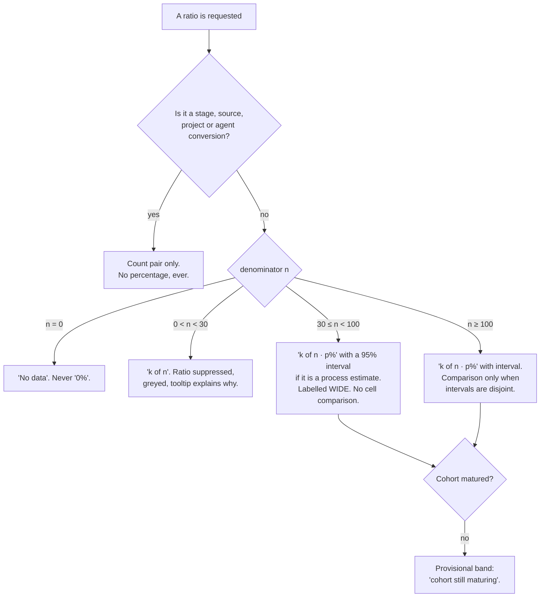
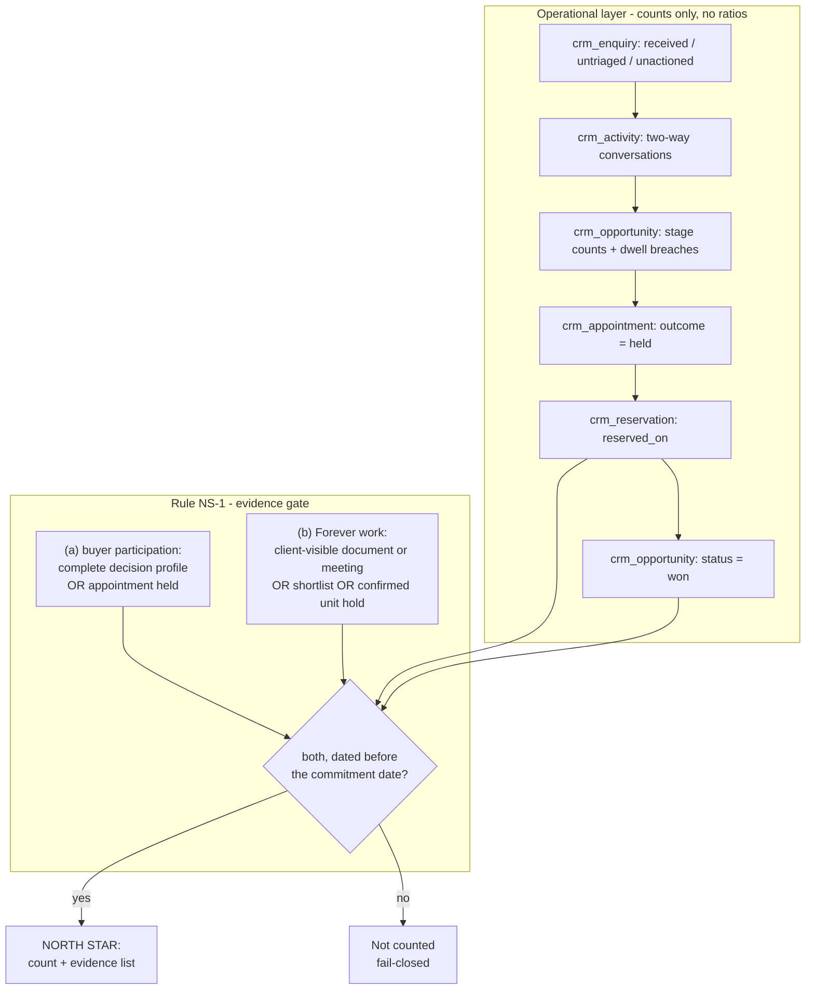

# Forever CRM — Owner Analytics and KPI Model

Task ID: FOREVER-CRM-ARCH-001
Status: Proposed architecture — not approved, not scheduled, not authorized for implementation
Repository state of record: main @ 82e2039270168df1043050204988fbd6c009ed0e
Risk class: R0 (documentation only)

> This document is a design record. It asserts no product truth, changes no active stage, and authorizes no implementation. The active stage remains FOREVER-STUDIO-001 (`docs/CURRENT_STAGE.md`), which lists "large CRM integration" as out of scope. Any implementing task is R2 under the shared-contract rule and requires an Architect-reviewed stage change plus Owner approval.

## What this document decides

1. **No SQL in this system returns a percentage.** Every query returns a numerator and a denominator; the ratio, the interval and the suppression decision are computed in one TypeScript module. This is the strongest control in the section, because it removes the raw material rather than policing the render.
2. **No percentage is rendered on a denominator under 30 — census proportions included.** What differs between a census and a process estimate is the interval, not the floor.
3. **Conversion rates are never a headline, at any denominator.** Transition metrics are permanently count pairs over matured cohorts.
4. **Per-agent conversion is banned at all current volumes; per-agent counts are not** — including `wins_by_credited_member`, because counts are always shown.
5. **Order statistics get a floor too:** individual values below n = 5, p50 from n = 5, p90 from n = 12.
6. **Every date derived from an instant is pinned to `Asia/Bangkok`** (INV-D-14), in SQL and in TypeScript.
7. **This document owns every metric key**, and at §6.1 the Pulse tile set of record that `docs/crm/CRM_UX_INFORMATION_ARCHITECTURE.md` §6 renders.
8. **"Response time" is four separately named measurements, never one figure** (§4.4): automated acknowledgement, human first response, the business-hours SLA clock, and after-hours arrival. Three of the four need no SLA and no Owner input, so measurement starts before any target exists; and the `*/5` cron is a hard floor on any sub-5-minute promise.
9. **Zero new tables, zero new columns.** One CHECK, one column-semantics clarification, three indexes, two Owner calibrations (§10).

Metric names are not re-founded here: `docs/FOREVER_STRATEGIC_NORTH_STAR.md:296-323` and `docs/ROADMAP.md:231-250` are the naming authority (§2.1); the data-truth boundary in `docs/FOREVER_BRAIN_V1.md` §7 is cited, not restated. `docs/crm/CRM_DOMAIN_MODEL.md` owns every table, column, enum, invariant and migration number; `docs/crm/CRM_IMPLEMENTATION_PLAN.md` owns the phase gates.

## 1. Four classes of number, and one floor

### 1.1 The distinction that explains every rule below

Four different things get called "a number", and only one of them is unreliable at Forever's volume.

| Class | Example | Verdict |
|---|---|---|
| **Count** | 14 open opportunities; 3 enquiries unanswered over a day | **Always shown**, at every denominator, including zero |
| **Order statistic** | Median first response over the 11 enquiries answered this week | Shown with `n`, min and max; individual values below n = 5; no trend arrow below n = 30 |
| **Census proportion** | 45 of 120 people have no country recorded | Percentage **without** an interval — but still not below n = 30 |
| **Process estimate** | 3 of 20 enquiries reached a viewing → "our contact-to-viewing rate is 15 %" | **Count pair only.** Never a headline rate |

[Recommendation] The ban is on **inference**, not on arithmetic. A median is arithmetic over what happened; a conversion rate is a forecast dressed as a fact. That is the tooltip sentence, and it is why the dashboard shows a median over eleven enquiries and refuses a percentage over twenty. The denominator floor is universal: a census carries no interval because nothing is sampled, but "45 of 120" and "2 of 5" are not equally publishable, and only a rule with no exceptions survives a year of edits.

### 1.2 What low N actually does

[Web research] Wilson score interval, the NIST-recommended estimator for a binomial proportion — https://www.itl.nist.gov/div898/handbook/prc/section2/prc241.htm. [Inference] Applied at denominators Forever will actually see.

| Observed | Point | 95 % Wilson interval | Width | Reading |
|---|---|---|---|---|
| 2 of 10 | 20.0 % | 5.7 % – 51.0 % | 45.3 pp | Meaningless |
| 0 of 20 | 0.0 % | 0.0 % – 16.1 % | 16.1 pp | "No closes yet" is not evidence the funnel is broken |
| 3 of 20 | 15.0 % | 5.2 % – 36.1 % | 30.9 pp | 2/20 and 3/20 are indistinguishable; one deal moves the headline 5 pp and means nothing |
| 5 of 30 | 16.7 % | 7.3 % – 33.6 % | 26.3 pp | At the floor — still ±13 pp |
| 15 of 100 | 15.0 % | 9.3 % – 23.3 % | 14.0 pp | Usable |
| 30 of 200 | 15.0 % | 10.7 % – 20.6 % | 9.9 pp | Trustworthy |

- **n = 30 is a floor for *showing* a ratio, not a threshold for *trusting* one.** ±5 pp arrives near n = 200. The rule therefore has three bands, not two (§1.4).
- **Improvement cannot be detected at this scale.** [Inference — two-proportion test, α = 0.05 two-sided, 80 % power] A genuine lift from 10 % to 15 % needs ~686 per arm, ~1,400 in total. A conversion percentage moving month to month is a random walk inviting a management response to noise.

### 1.3 The second, independent defect: right-censoring

[Recommendation] A funnel ratio computed today over *all* enquiries is **biased downward by construction**: last week's enquiries have not had time to reach a viewing. Adding fresh leads mechanically lowers "contact-to-viewing" even when nothing changed, and the obvious reaction — stop spending on lead generation — is exactly backwards. The fix is definitional: **every transition metric is computed only over a matured cohort.**

- A cohort is a calendar month of first contacts, bucketed in `Asia/Bangkok`.
- Matured means `now() - cohort_end > maturity_days` for that transition.
- `maturity_days` comes from the observed p90 cycle time, which needs ≥ 12 observations (§2.3C). Until then it is an [Unverified assumption] and the metric renders provisional.
- The immature tail is never dropped silently: "3 cohorts shown; 2 cohorts still maturing, not included."

### 1.4 The render rule — the UI contract



| Supporting rule | The leak it closes |
|---|---|
| The denominator is always visible, in every state | "15 %" with no `n` is the most misleading artefact a CRM can produce |
| A ratio is never the sole content of a tile — counts come first, visually larger | Tiles get screenshotted into messages; the count must travel with it |
| Sorting a table by a suppressed ratio is **disabled** | Sorting invents a ranking out of noise |
| No period-over-period delta, arrow or sparkline on a suppressed ratio | A delta of two noisy estimates is noisier than either |
| A suppressed ratio never enters CSV or clipboard export | Export is where suppression normally dies |
| Overlapping intervals are **not** rendered as "no difference" | Only *disjoint* intervals evidence a difference |

[Recommendation] Two pure modules in the `src/features/navigator/core/*` idiom — total, deterministic, I/O-free — under the single CRM feature directory `src/features/forever-crm/` (one prefix package-wide, matching `forever-studio`).

```ts
// src/features/forever-crm/core/ratio.ts
export const MIN_RATIO_DENOMINATOR = 30;    // the single place the floor exists
export const WIDE_RATIO_DENOMINATOR = 100;

export type RatioRender =
  | { kind: "no_data" }
  | { kind: "counts_only"; numerator: number; denominator: number;
      reason: "denominator_below_floor" | "conversion_ban" }
  | { kind: "ratio"; numerator: number; denominator: number;
      pointEstimate: number; ciLow: number; ciHigh: number; band: "wide" | "usable" }
  | { kind: "census"; numerator: number; denominator: number; proportion: number };

/** Wilson score interval. Never throws; n = 0 returns { kind: "no_data" }. */
export function renderProcessRatio(numerator: number, denominator: number): RatioRender;
export function renderCensusProportion(numerator: number, denominator: number): RatioRender;

// src/features/forever-crm/core/format.ts
export type OrderStatisticRender =
  | { kind: "values"; values: number[] }                                    // n < 5
  | { kind: "p50"; n: number; p50: number; min: number; max: number }       // 5 <= n < 12
  | { kind: "p50_p90"; n: number; p50: number; p90: number; min: number; max: number };
export function renderOrderStatistic(values: number[]): OrderStatisticRender;
export function needsAttention(oldestUntouchedHours: number, thresholdHours: number): boolean;
```

`renderOrderStatistic` exists because the pre-review design guarded percentages only, which is how a median over one deal acquired the authority of a summary. Every distribution here routes through it. Unit tests at n = 1, 3, 4, 5, 11, 12; for `renderProcessRatio`, fixtures at n = 0, 1, 9, 10, 29, 30 asserting no `%` character is produced below 30. The interval is computed and rendered, never stored.

### 1.5 The words the Owner sees

Suppression must explain itself at the point of suppression, or it reads as the software being broken.

> **Contact → viewing · 3 of 20**
> *Percentage withheld.* With 20 contacts the underlying rate could honestly be anywhere from 5 % to 36 %. One more viewing would move the headline by 5 points without anything having changed.

> **Median first response · 4.2 h** (11 answered · fastest 8 min · slowest 31 h)
> **2 enquiries have never been answered.** Those two are not in the median.

### 1.6 This is the fail-closed rule already in force, applied to statistics

[Repository fact] Public-truth doctrine: missing evidence renders as false / null / "Not available" / hidden, never as a positive default. A ratio whose denominator cannot support it **is missing evidence about a rate**. Its schema-level twin is INV-D-17 (no score, confidence, probability, rank or conversion column persisted anywhere); its implementation twin is §8.1.

## 2. The metric catalogue

### 2.0 What is computable today

[Repository fact] **None of it.** `public.leads` has no SELECT policy and no SELECT grant for `anon` or `authenticated`; repo-wide `from("leads")` returns exactly two hits — the browser insert at `src/lib/lead-service.ts:92` and a string literal in `src/lib/lead-demo-mode-bundle-boundary.test.ts:22`. There is no `src/features/forever-crm/` directory. Consequently the gating metric for the repository's own build-vs-buy decision (`docs/ROADMAP.md:228`) **does not exist as a product capability**, and `docs/FOREVER_STATUS.md:157-158` still lists the lead-response baseline and the contact/viewing/reservation metrics as required. §3.1 answers it with a checked-in SQL script and no code.

### 2.1 Reconciliation with the canonical vocabulary

[Owner requirement] The canonical lists are not forked. Verbatim names on the left.

| Canonical name (`NORTH_STAR:302-311` / `ROADMAP:239-248`) | Status | Key(s) here |
|---|---|---|
| qualified guest conversations per week | CRM-owned | `qualified_conversations` (+ evidence floor `two_way_conversations`) |
| median first-response time | CRM-owned | `first_response_hours` (+ mandatory pair `enquiries_never_responded`) |
| Navigator completion to contact | CRM-owned | `navigator_to_contact` |
| contact to viewing | CRM-owned | `contact_to_viewing` |
| viewing to reservation | CRM-owned | `viewing_to_reservation` |
| published source-backed projects · catalogue freshness · Owner hours per onboarding · corrections after publication | **not CRM-owned** | Catalogue/Studio side and `public.audit_log`. Not defined here |
| commission or revenue attributable to Forever-assisted work | **half CRM-owned** | `credited_members`, `wins_by_credited_member`, `won_value_by_currency`. **Money is not modelled** — amounts, invoices, payouts and FX belong to finance |

Four canonical metrics are deliberately outside this section; defining them here would create a second owner for a fact the CRM must not own. **The Owner's finer funnel steps are diagnostics, not headline metrics:** `contact_to_qualified` and `qualified_to_viewing` are decompositions *inside* the canonical `contact to viewing`, shown only when the parent is expanded. `reservation_to_close` is the one genuinely new step, and only because the canonical chain stops at "reservation" while the North Star says "reservations **or closed transactions**".

### 2.2 Conventions

- **Definitions live in TypeScript** — `src/features/forever-crm/core/metrics.ts`, `as const` records. A metric-definition table would be a runtime meta-model, rejected for the reason the domain model rejects runtime attributes: Forever owns its migrations, and a definition in a row cannot be type-checked or diffed in review.
- **Phase.** Every metric names the phase whose tables it needs. Phase 1 is exactly eleven tables — `crm_channel`, `crm_source`, `crm_processing_purpose`, `crm_notice_version`, `crm_person`, `crm_person_identifier`, `crm_enquiry`, `crm_activity`, `crm_task`, `crm_consent_event`, `crm_suppression`. There is no pipeline, opportunity, appointment, reservation or decision profile before Phase 2. A metric naming a table its phase does not have renders "Not available", never 0.
- **Timezone (INV-D-14).** [Repository fact] Supabase sessions run UTC unless set; Forever operates `Asia/Bangkok`. Every date derived from an instant is `(now() AT TIME ZONE 'Asia/Bangkok')::date` or `date_trunc(…, ts AT TIME ZONE 'Asia/Bangkok')`, from one constant `FOREVER_TZ`. A contract test forbids a bare `CURRENT_DATE` or an unconverted `date_trunc` over a `timestamptz` in any `crm_*` body. Between 17:00 and midnight Bangkok the unpinned version is simply a different day.
- **`next_action_at` suppresses.** A person or opportunity with a future `next_action_at` (Phase 2) or a future open `crm_task.due_at` (Phase 1) is not silent, not stalled and not overdue, in every coverage metric. On a 6–18 month off-plan cycle this is the difference between a coverage list and a nag.
- **Everything is computed on demand** (§8); nothing is precomputed or scheduled. The **exclusion register** (§9.3) applies to every metric without exception.
- **Render column:** `count` = a count, no threshold · `pair` = count pair, no rate ever · `order` = §1.4 floor · `census` = whole-population proportion, floor applies, no interval · `sum` = currency sum, never converted.

### 2.3 The catalogue

#### A. Intake and response — leading

| Key | Definition | Phase | Render |
|---|---|---|---|
| `enquiries_received` | `crm_enquiry.received_at` inside the Bangkok-bucketed period | 1 | count |
| `enquiries_untriaged` | `triage_state = 'unprocessed'` and `received_at < now() - 24h` | 1 | count |
| `enquiries_unactioned` | `first_response_at IS NULL`, older than one business hour (§4.4) | 1 | count + oldest age |
| `enquiries_never_responded` | `first_response_at IS NULL`, received before period end | 1 | count — **must render adjacent to `first_response_hours`** |
| `first_response_hours` | Distribution of **wall-clock** `first_response_at − received_at` over responded enquiries — clock (b) of §4.4 | 1 | order |
| `first_response_business_hours` | The same event on the **business clock**: elapsed time intersected with `FOREVER_RESPONSE_WINDOW` — clock (c) of §4.4 | 1 | order — renders "Not available" until D-6 is answered; **never rendered without `first_response_hours` beside it** |
| `first_response_sla_breaches` | `first_response_business_hours` exceeded one business hour, or no response ever came; split in-window / out-of-window arrival | 1 | count; compliance % is census-class, secondary only, n ≥ 30 |
| `enquiries_by_arrival_hour` | Count distribution of `received_at` over the 24 Bangkok hours-of-day — clock (d) of §4.4 | 1 | counts — **needs no SLA, no window and no Owner input**; never divided into an out-of-hours share |
| `owner_not_first_responder` | First human outbound came from a member other than `crm_person.relationship_owner_user_id` | 1 | count — **never split per agent as a rate** |
| `acknowledgement_seconds` | `crm_enquiry.acknowledged_at − received_at` — clock (a) of §4.4; measures **generation, not delivery** | 1 | **inert** — "Not available" until an outbound gateway exists (§4.4) |
| `enquiries_by_source` | Counts by `crm_enquiry.source_key`, and by `crm_person.first_touch_source_key` / `last_touch_source_key` side by side | 1 | counts — never divided into a source conversion rate |
| `leads_not_ingested` | `public.leads` rows older than 15 minutes with no matching `crm_enquiry.legacy_lead_id`, paired with the ingest pass `last_run_at` | Slice 1 | count — **non-zero is a Phase-1 exit blocker** (`docs/crm/CRM_INTEGRATION_AND_EVENTS.md` §3.6) |

#### B. Conversation and pipeline — leading

| Key | Definition | Phase | Render |
|---|---|---|---|
| `two_way_conversations` | Distinct persons in period with ≥ 1 inbound human `crm_activity` **and** ≥ 1 outbound member human activity | 1 | count |
| `qualified_conversations` | The canonical metric: the subset above whose person holds an opportunity that reached `crm_pipeline_stage.position >= 3` by period end, from `crm_activity(kind='stage_change')` history | 2 | count |
| `open_opportunities_by_stage` | Open opportunities by `crm_pipeline_stage.key` | 2 | count |
| `stage_age_buckets` | Open opportunities per stage in buckets of `now() − stage_entered_at`: 0–3 d, 4–7 d, 8–14 d, 15 d+. The summary column is **"Median current age in stage", declared censored** | 2 | count + order |
| `stage_dwell_breaches` | `now() − stage_entered_at > target_time_in_status_hours` **and** `next_action_at` null or past | 2 | count — renders **`Not configured`** while every target is NULL, never `0` |
| `pipeline_value_open` | `SUM(expected_value_amount)` by `expected_value_currency`, open only | 2 | sum per currency — **never converted, never probability-weighted** |
| `opportunities_without_value` | Open opportunities with `expected_value_amount IS NULL` | 2 | count — beside `pipeline_value_open` so the total is never read as complete |
| `navigator_completed` | Non-superseded `crm_decision_profile` with `is_complete`, `captured_at` in period | 2 | count |
| `navigator_to_contact` | Completed profiles in cohort / of those, how many resolved to a person holding a live `crm_person_identifier` within 7 days | 2 | pair, matured |

`qualified_conversations` is stage-gated and therefore advisor-settable; `two_way_conversations` is grounded in the buyer having actually replied and is the harder number to fake. Both are shown. `qualified` is a subset of `two_way` by construction — if it ever exceeds it, that is a data-integrity alarm, not a good week.

#### C. Movement and outcome — lagging, matured cohorts only

| Key | Definition | Phase | Render |
|---|---|---|---|
| `contact_to_viewing` | Matured monthly cohort of first human contacts; numerator = those with a `crm_appointment` where `outcome='held'` inside `maturity_days` | 2 | pair, matured |
| ↳ `contact_to_qualified` · ↳ `qualified_to_viewing` | Diagnostic decompositions of the above, from stage-change history | 2 | pair; never a headline |
| `viewing_to_reservation` | Persons with a held appointment in cohort / of those, a `crm_reservation` with `reserved_on` inside maturity | 3 | pair, matured |
| `reservation_to_close` | Reservations in cohort / of those, `spa_signed_on IS NOT NULL` and the opportunity `won` | 3 | pair — **realistically counts-only for years; say so, do not hide it** |
| `appointment_outcomes` | Count distribution over `crm_appointment.outcome` for appointments scheduled in period | 2 | counts; composition % only at total ≥ 30 |
| `lost_reasons` | Count distribution over `crm_opportunity.lost_reason_key` for opportunities closed in period | 2 | counts descending; composition % at total ≥ 30 |
| `cycle_time_days` | Days between consecutive stage entries, per transition, matured only | 2 | order |
| `cohort_furthest_stage` | Matrix: Bangkok enquiry month × furthest `crm_pipeline_stage.position` ever reached | 2 | **counts only, at every volume** |

`cohort_furthest_stage` is the most informative low-N artefact in the model: it shows funnel shape and its change over time without dividing anything, and it is immune to right-censoring, which is what makes `maturity_days` non-urgent.

#### D. Coverage and hygiene — leading, all counts, no thresholds

| Key | Predicate | Phase |
|---|---|---|
| `zero_contact_persons` | Person with ≥ 1 enquiry and **zero** human outbound activity ever | 1 |
| `persons_without_owner` | Live person, `relationship_owner_user_id IS NULL` | 1 |
| `overdue_tasks` | `crm_task.state='open' AND due_at < now()`, by `owner_user_id` | 1 |
| `silent_persons_14d` | Live person with an enquiry, `last_activity_at` null or older than 14 days, **and** no open task due in the future | 1 |
| `materialisation_drift` | Nightly recomputation of `first_response_at` / `last_activity_at` from `crm_activity` disagrees with the stored value | 1 |
| `reactivations` | Person > 60 days stale who produced a new inbound activity or enquiry in period | 1 |
| `opportunities_without_owner` · `opportunities_without_next_action` · `overdue_next_actions` | `status='open'` with `owner_user_id IS NULL` / `next_action_at IS NULL` / `next_action_at < now()` | 2 |
| `duplicate_open_opportunities_same_project` | More than one open opportunity for the same `(person_id, focus_project_id)` — the coverage check that replaced a unique index forbidding a real transaction | 2 |
| `appointments_today` · `appointments_outcome_unrecorded` | `scheduled_start_at` inside the Bangkok day; `outcome='pending' AND scheduled_start_at < now()` | 2 |
| `member_workload` | Per member: open opportunities, open tasks, overdue tasks, unactioned enquiries, appointments held | 2 |
| `wins_without_credit_reallocation` | Won opportunities still carrying only the default 10 000-bps credit row after 14 days | 2 |
| `unit_hold_conflicts` · `holds_unverified_over_7d` | A live `crm_unit_hold` whose `units.availability_status` contradicts it; a hold whose `last_verified_at` is null or > 7 days old | 3 |
| `reservations_requirements_outstanding` · `reservations_expiring_7d` | A mandatory requirement neither satisfied nor waived; `expires_on` or `cooling_off_ends_on` within 7 days and `cancelled_on IS NULL` | 3 |

`unit_hold_conflicts` never writes: `public.units.availability_status` stays canonical and the flag points at the **staler** side rather than asserting either. `member_workload` is counts only and is the sanctioned answer to "how are my agents doing" (§5.1); where it renders an attention marker the predicate is `needsAttention` and the threshold is printed in the caption, because an undefined alarm against a named colleague turns a coverage table into a performance table regardless of the caption underneath. Five of these sweeps ship as five named SQL functions and one page, not as an automation engine — `docs/crm/CRM_AUTOMATION_CATALOGUE.md`.

#### E. Commitment and North Star — lagging

| Key | Definition | Phase | Render |
|---|---|---|---|
| `reservations_created` · `reservations_by_state` | `crm_reservation.reserved_on` in period; counts by projected state | 3 | count |
| `opportunities_won` | `status='won'` with `closed_at` in period | 2 | count |
| `wins_by_credited_member` | Per `(member_user_id, credit_role)`: the **count** of won opportunities in the period and the sum of `share_bps` | 2 | count + bps — **no denominator, deliberately** |
| `won_value_by_currency` | `SUM(expected_value_amount)` by currency over won opportunities, labelled **expected value at close, not revenue** | 2 | sum per currency |
| `credited_members` | Per won opportunity, the `(member_user_id, credit_role, share_bps)` rows | 2 | a list, never a leaderboard |
| `north_star_qualifying` | Commitments passing the material-influence gate NS-1 (§7) | 3 | count **+ the evidence list per row** |

`wins_by_credited_member` is the correction the statistical rule needed. The ban on rates was over-applied by one category: **wins per advisor is a count**, and §1.1 says counts are always shown. Without it the Owner reconstructs monthly commission in a spreadsheet by Friday — the outcome the whole design exists to prevent. It carries the same "counts, not performance" caption as `member_workload`, and the absence of a denominator is stated on the surface rather than left to be noticed.

#### F. Compliance registers — lagging, counts, legally load-bearing

| Key | Definition | Phase |
|---|---|---|
| `s25_notices_due` | `s25_notice_required AND s25_notice_sent_at IS NULL AND received_at > now() - 30 days` | 1 |
| `suppressions_applied` | `crm_suppression` counts by `source` in period | 1 |
| `consent_events` | `crm_consent_event` counts by `action` × `purpose_key`, voided rows excluded | 1 |
| `dsr_open_overdue` | `crm_dsr_request.responded_at IS NULL`, split by `due_at < now()` | 3 |
| `retention_holds_open` | Open `crm_retention_hold` rows by `basis` and `field_group` | 3 |

`s25_notices_due` is drainable by a human because `s25_notice_method` and `s25_notice_sent_by` exist: an advisor who gives the notice on the phone clears the row. A compliance counter that only goes up trains everyone to ignore the compliance surface, which is where `dsr_open_overdue` also lives. **Descriptive only, not legal advice; qualified Thai counsel must confirm.**

**Total: 60 metric keys plus the §9 census** — 48 counts and count distributions, 4 order statistics, 2 currency sums, 6 count pairs. Twenty-one are computable in Phase 1 and one in Slice 1; `first_response_business_hours` is computable in Phase 1 only once D-6 is answered; the rest name a later phase and render "Not available" until it exists.

### 2.4 Requested metrics deliberately not built as ratios

| Requested | Delivered as | Why |
|---|---|---|
| Source conversion rate | `enquiries_by_source` + wins by `first_touch_source_key`, side by side as counts | Per-source denominators are a fraction of an already-too-small total; a source "winning" on 2-of-5 would redirect real spend |
| Project conversion rate | Enquiries and wins by `focus_project_id`, counts, fictitious slugs excluded and the exclusion disclosed | Same, plus project mix confounds everything: a project launched last month cannot convert yet |
| Per-agent conversion | `wins_by_credited_member`, `member_workload`, `owner_not_first_responder` — all counts | §5.1 |
| Weighted forecast | `pipeline_value_open` by currency, unweighted | §5 |

## 3. What is built instead at low N

### 3.1 Slice 0 — a checked-in script, zero code, zero deploy dependency

Read-only, under `scripts/`, run by the Owner in the Supabase SQL editor. No migration, no endpoint, no working deployment — and it settles `ROADMAP.md:228` outright.

```sql
SELECT count(*)                                             AS leads_total,
       count(*) FILTER (WHERE project_slug IS NULL)         AS leads_without_project,
       count(*) FILTER (WHERE source = 'booth')             AS leads_from_booth,
       count(DISTINCT lower(btrim(email)))                  AS distinct_emails,
       min(created_at) AS earliest_lead_at, max(created_at) AS latest_lead_at
FROM public.leads;

SELECT date_trunc('month', created_at AT TIME ZONE 'Asia/Bangkok')::date AS month_bkk,
       source, status, count(*) AS leads
FROM public.leads GROUP BY 1, 2, 3 ORDER BY 1 DESC, 2, 3;
```

### 3.2 Phase 1 — unactioned enquiries, and coverage in one pass

```sql
SELECT count(*) AS unactioned, min(e.received_at) AS oldest_received_at
FROM public.crm_enquiry e
WHERE e.first_response_at IS NULL
  AND e.triage_state <> 'rejected_spam'
  AND e.capture_mode  <> 'legacy_form'
  AND e.received_at < now() - interval '1 hour';

SELECT count(*) FILTER (WHERE p.relationship_owner_user_id IS NULL)          AS no_owner,
       count(*) FILTER (WHERE (p.last_activity_at IS NULL
                            OR p.last_activity_at < now() - interval '14 days')
                          AND NOT EXISTS (SELECT 1 FROM public.crm_task t
                                           WHERE t.person_id = p.id
                                             AND t.state = 'open'
                                             AND t.due_at > now()))          AS silent_14d
FROM public.crm_person p
WHERE p.deleted_at IS NULL AND p.merged_into_person_id IS NULL
  AND EXISTS (SELECT 1 FROM public.crm_enquiry e WHERE e.person_id = p.id);
```

The first query is served entirely by `idx_crm_enquiry_unactioned` — the partial index *is* the report. The second shows the `next_action_at` suppressor in its Phase-1 form: a buyer correctly left alone until October is not a defect, and a coverage list that says otherwise is abandoned within a month.

### 3.3 Phase 2 — stage board and pipeline value

One `GROUP BY s.key, s.position` over `crm_opportunity` joined to `crm_pipeline_stage`, with four `count(*) FILTER (WHERE now() - o.stage_entered_at …)` age buckets, plus `sla_breached` = `target_time_in_status_hours IS NOT NULL AND (next_action_at IS NULL OR next_action_at < now()) AND now() - stage_entered_at > make_interval(hours => target_time_in_status_hours)`. [Web research] `target_time_in_status` as a per-stage attribute is the highest ROI-per-unit-complexity idea in the research set — https://docs.attio.com/rest-api/attribute-types/attribute-types-status. It is also why stages are a table rather than a CHECK vocabulary: with a CHECK, `sla_breached` cannot be written in SQL at all.

**Pipeline value** is `SUM(expected_value_amount)` grouped by `expected_value_currency`, rendered as separate figures — `฿24,500,000 · $310,000 · €85,000` — never summed. [Recommendation] Converting requires an FX rate the CRM does not hold and must not invent; a converted total is a fabricated number on the most senior tile of the dashboard. `opportunities_without_value` renders beside it.

### 3.4 Phase 2 — count pairs over a matured cohort

The shape every transition metric takes. It returns a numerator and a denominator and **no rate**.

```sql
WITH cohort AS (
  SELECT a.person_id, min(a.occurred_at) AS first_contact_at
  FROM public.crm_activity a
  WHERE a.direction = 'outbound' AND a.actor_kind = 'member'
    AND a.is_automated = false
    AND a.purpose_key IS DISTINCT FROM 'direct_marketing'
  GROUP BY a.person_id
  HAVING min(a.occurred_at) < now() - make_interval(days => p_maturity_days)
),
reached AS (
  SELECT c.first_contact_at,
         EXISTS (SELECT 1 FROM public.crm_appointment ap
                  WHERE ap.person_id = c.person_id AND ap.outcome = 'held'
                    AND ap.scheduled_start_at
                        <= c.first_contact_at + make_interval(days => p_maturity_days)) AS held
  FROM cohort c
)
SELECT date_trunc('month', first_contact_at AT TIME ZONE 'Asia/Bangkok')::date
                                     AS cohort_month_bkk,
       count(*)                      AS denominator_contacted,
       count(*) FILTER (WHERE held)  AS numerator_viewing_held
FROM reached GROUP BY 1 ORDER BY 1;
```

Cycle-time distributions unlock at ≥ 12 completed transitions of that type. Ratio display never unlocks for a transition — count pairs are the permanent form. Until the cohort exists at all, `cohort_furthest_stage` carries the same information without the arithmetic.

## 4. First response, defined exactly

**Normative for the whole package.** `docs/crm/CRM_DOMAIN_MODEL.md` §3.5 and `docs/crm/CRM_UX_INFORMATION_ARCHITECTURE.md` §5 defer to this section; `docs/crm/CRM_INTEGRATION_AND_EVENTS.md` §5.2 is its transport counterpart.

### 4.1 The predicate

[Web research] Follow Up Boss's definition is the rigorous one: "unactioned" means no outbound call, email or text from the agent, with automated, marketing and batch sends explicitly excluded — https://help.followupboss.com/hc/en-us/articles/4402128249367-Dashboard. [Recommendation] Forever's operative predicate, on `crm_activity`:

```
direction        = 'outbound'
AND actor_kind   = 'member'
AND is_automated = false
AND purpose_key IS DISTINCT FROM 'direct_marketing'
AND occurred_at >= crm_enquiry.received_at
AND person_id    = crm_enquiry.person_id
```

Ordered by `occurred_at` — the provider timestamp — never by `recorded_at` or insertion order, because message delivery order is not guaranteed (https://developers.facebook.com/docs/whatsapp/cloud-api/guides/send-messages).

**Tapping a `wa.me` link does not satisfy it.** The tap emits `crm_activity(kind='message', channel='whatsapp', direction='outbound', metadata->>'link_opened'='true')` and does **not** set `first_response_at`. Only the returning outcome sheet does — an attributed human confirmation rather than a navigation event — and its `Reached` branch simultaneously emits the **inbound** row without which the stage machine cannot pass `contacted`.

`first_response_at` and `crm_person.last_activity_at` are written by an AFTER INSERT trigger on `crm_activity`, one idempotent monotone statement each, with the writer named in the column COMMENT and a nightly reconciliation reporting `materialisation_drift`. A partial index cannot see the rows it excludes, so drift is otherwise undetectable from the index that consumes it.

### 4.2 One deliberate deviation from Follow Up Boss

FUB scopes the responder to the **assigned** agent; Forever does not. At roughly ten seats a colleague replying *is* a response to the buyer — the metric answers "did this person hear from a human?", not "did one named individual discharge a duty." The decisive reason, though, is **computability**: ownership at the moment of a past response is not stored anywhere (reassignment is a `crm_activity(kind='assignment')` row), so the owner-scoped definition requires replaying the assignment timeline, while the any-member predicate is a pure filter on columns that exist. A definition that can be evaluated exactly beats one that must be reconstructed approximately. Ownership discipline survives as its own count, `owner_not_first_responder`, never a per-agent rate. Recorded as **D-2**.

### 4.3 Every edge case, ruled

| Case | Ruling | Reason |
|---|---|---|
| Automated acknowledgement | Does not count | `is_automated = true` — the whole point |
| `wa.me` tap with no confirmation | Does not count | A navigation event is not an attributed response |
| WhatsApp **template** sent by a member from the CRM | **Counts** | Outside the 24-hour window a genuine first reply is necessarily a template; the test is the sending path |
| WhatsApp template sent by a sequence | Does not count | `is_automated` is stamped by the sender path, never inferred from content |
| Marketing send that happens to be first | Does not count | Otherwise adding a lead to a campaign resets the SLA clock — the cheapest gaming |
| Outbound call, no answer / voicemail | Counts for response and SLA; not for `first_conversation_at` | Did we act, and did we talk, are two questions |
| `first_conversation_at` | First inbound human reply after our outbound, or an outbound `kind='call'` with `duration_seconds >= 60` | 60 s is [Unverified assumption] — D-7. [Web research] a duration threshold so voicemails do not count as engagement — https://help.followupboss.com/hc/en-us/articles/1500008539982-Action-Plans-Overview |
| Buyer messages twice, we never reply | Still unactioned | Inbound never satisfies an outbound predicate |
| Enquiry from an existing person | New clock at the new `received_at` | `occurred_at >= received_at` |
| Buyer replies inside an open thread | No new clock | A reply is an activity, not an enquiry |
| `triage_state = 'unprocessed'` | **Included in the denominator** | Excluding it would let the team hide failures by not triaging — the most important exclusion rule here |
| `triage_state = 'rejected_spam'` | Excluded entirely | It never produces a person; counting it makes this a spam-volume metric |
| `capture_mode = 'legacy_form'` | Excluded from all response metrics, exclusion stated on the tile | No activity history exists; they would all read never-responded and swamp every number |
| Clock start | `received_at`, not `created_at` | Row-insert time would hide up to five minutes of ingestion lag |
| Enquiry never linked to a person | Counted as unactioned against the enquiry | An enquiry nobody linked is exactly the failure |

### 4.4 Four clocks, four names, and the dishonest number that merging them produces

[Recommendation] **"Response time" is not one quantity.** Four different events are habitually reported under that phrase. Each has its own trigger, its own clock, its own characteristic failure and its own metric key, and **no two of them are ever summed, averaged together, or rendered as a single figure.** This is the reporting-layer restatement of the §4.3 exclusion rules: what `is_automated = true` removes from the *predicate*, the four-clock split removes from the *tile*.

| | Measurement | Key | What fires it | Clock | Characteristic failure |
|---|---|---|---|---|---|
| **(a)** | **Immediate automated acknowledgement** | `acknowledgement_seconds` | Receipt of the enquiry by the system | Wall clock, continuous, timezone-irrelevant | **Silent gateway failure.** Nobody complains, because the sender is a machine and the buyer does not know a message was owed |
| **(b)** | **Actual human first response** | `first_response_hours` | The §4.1 predicate — an attributed human act. Opening a record is not contact | Wall clock, continuous | Survivorship (§4.5 rule 2); lost notification; a genuine response nobody logged |
| **(c)** | **The business-hours SLA clock** | `first_response_business_hours` | The same event as (b), with elapsed time **intersected** with `FOREVER_RESPONSE_WINDOW` | Business clock | **Its denominator is a policy decision, not a fact.** An unstated window makes every breach count unfalsifiable |
| **(d)** | **After-hours behaviour** | `enquiries_by_arrival_hour`, plus the in-window / out-of-window split of `first_response_sla_breaches` | Arrival of the enquiry | Bangkok hour-of-day | Measured on (b)'s clock it is recorded as a nightly breach by construction, so the surface is learned to be noise |

[Recommendation] **Why conflating them produces a dishonest number** — three specific dishonest numbers, each produced automatically by one of the three possible merges:

1. **(a) merged into (b).** An automated acknowledgement makes every enquiry look answered in seconds: "median first response 4 s" while no human has spoken to anyone all week. The number is arithmetically correct and factually a lie about the business.
2. **(b) merged into (c).** A wall-clock elapsed time reported against a business-hours target: an enquiry received 23:40 and answered 09:05 reads as a 9.4-hour failure by a team that responded twenty-five minutes into its first working hour. Repeated nightly, this is how a coverage surface teaches its users that breaches are meaningless.
3. **(c) merged into (d).** The business clock alone: the same enquiry accrues five business minutes and reads as excellent, and the night of silence disappears from the record entirely. The buyer waited nine hours; the report says five minutes. Both numbers are true, and only both together are honest.

**Therefore (b) and (c) always render together, and (d) always renders beside them as the count that makes them readable.** A single "response time" figure is prohibited on every surface, tile, export and caption in this package, in exactly the way a single converted pipeline total is (§3.3).

**(a) measures generation, not delivery.** `acknowledged_at` records that Forever *sent*, never that the buyer *received*, and no caption, tooltip or export may label it "buyer notified". [Web research] The clearest documented case of the gap is Follow Up Boss's claim notifications, which are push-only — never email, never text — and which a swipe rather than a tap can clear, preventing the claim outright — https://help.followupboss.com/hc/en-us/articles/360014656193-First-to-Claim. [Inference] A clock whose start or stop depends on one delivery channel records channel health as if it were human performance; where the two are indistinguishable, the metric is reported as a count of records, never as a verdict about a person.

**(c) and (d) are only honest if availability is recorded.** [Web research] Two vendors treat availability as a routing *input*: Lofty gates distribution on per-agent working hours and vacation mode, falling through to the next rule and then to a mandatory catch-all when everyone in a rule is unavailable — https://help.lofty.com/hc/en-us/articles/360055177831-Lead-Routing-How-to-set-up-lead-routing-rules — and Spark requires per-user opt-in before a member enters the round-robin at all — https://knowledge.spark.re/registration-form-settings. [Inference] A breach recorded against an advisor who was off duty measures the rota, not the advisor; until availability is recorded, `first_response_sla_breaches` is reported at team level only, and never attributed to a named member. Whether Forever adopts availability-gated routing or a claim window is decided in `docs/crm/CRM_AUTOMATION_CATALOGUE.md`, not here; this section fixes only what may be counted and how it may be labelled.

**The targets, and the only evidence permitted to justify them.** [Web research] The "5-minute rule" is vendor folklore: its primary source is a 2007 InsideSales.com study whose own author states the pattern appears only when data from several companies is combined (https://www.onecavo.com/wp-content/uploads/2015/11/MIT-InsideSales.com_Lead-Response-Management.pdf), and InsideSales sold callback dialler software. The strongest source-backed threshold is **one hour**, from the 2011 HBR audit — publisher of record https://hbr.org/2011/03/the-short-life-of-online-sales-leads, full text as located https://thedenmangroupselling.wordpress.com/wp-content/uploads/2011/03/the-short-life-of-online-sales-leads-harvard-business-review.pdf — whose useful finding is that the bar is on the floor: 23 % of 2,241 audited companies never responded at all, average 42 hours. The best independent evidence is not from sales at all: warm transfer versus callback in clinical-trial recruitment, 25 % versus 12.9 %, n = 2,341 — the value is in **not breaking the session**, not in shaving minutes off a callback (https://pmc.ncbi.nlm.nih.gov/articles/PMC10395154/). Both retained percentages clear the n ≥ 30 floor by three orders of magnitude; the multipliers that do not are retired in §4.4.2.

| Target | Value | Enforceable? |
|---|---|---|
| Automated acknowledgement | 2 minutes | Only inline in the capture RPC; the cron is `*/5`, so a cron-driven acknowledgement can never meet it. **Inert today** — nothing on `main` sends, `acknowledged_at` is NULL for every row, and the metric renders "Not available", never 0 |
| Human first response | **1 business hour** | Yes, once business hours are defined |
| Human first response, wall clock | Reported, never targeted | Phuket is UTC+7, Moscow UTC+3, so peak Russian evening browsing lands 23:00–03:00 Phuket. A global wall-clock SLA would be recorded as failed nightly and would train everyone to ignore the dashboard |
| Out-of-hours arrival | **Counted, never targeted** | `enquiries_by_arrival_hour` is a count distribution. The out-of-hours *share* is a census proportion on a denominator that will sit far below 30 for a long time, so under §1.1 it is not rendered as a percentage at all |

`FOREVER_RESPONSE_WINDOW = { tz: 'Asia/Bangkok', openLocal: '09:00', closeLocal: '19:00', days: Mon–Sat }` — **[Unverified assumption]; the Owner must confirm actual operating hours before any SLA count is published** (D-6). It is the same window `docs/crm/CRM_AUTOMATION_CATALOGUE.md` §8.2 calls the business clock: one object, defined once, here. Out-of-window enquiries are bucketed separately with the clock starting at the next open, and the bucket size is itself reported: if half of all enquiries arrive out of hours, that is a coverage decision, not an SLA failure.

#### 4.4.1 What Forever can measure before any SLA exists

[Recommendation] **Measurement does not wait for a target, and adopting a target before measuring is how an unachievable one gets adopted.** Three of the four clocks need no policy decision whatsoever; only (c) does.

| Available now, with no SLA and no Owner input | Blocked until D-6 is answered |
|---|---|
| `enquiries_received`, `enquiries_untriaged`, `enquiries_never_responded` — counts, at every denominator | `first_response_business_hours` — the intersection has no definition without a window |
| `first_response_hours` p50 / p90 / min / max, wall clock, through `renderOrderStatistic` | `first_response_sla_breaches` — "breach" is undefined without a target |
| `enquiries_by_arrival_hour` — the 24-hour Bangkok arrival profile that tells the Owner what the window *should* be | Any "% within SLA" figure — census-class, secondary only, and n ≥ 30 regardless (§5) |
| `enquiries_unactioned` with **oldest age** rather than a threshold count, which is the same work list without a policy | Any per-member breach attribution (see availability, above) |

[Repository fact] `docs/ROADMAP.md:148` already states the honest exit criterion in these terms — "median response time is measured and improving" — which is a statement about (b), needs no threshold, and is not satisfiable today because §2.0 holds. [Recommendation] The sequence is therefore fixed: measure (b) and (d) for a full quarter, let the Owner set the window from the observed arrival profile, and only then let (c) and its breach count exist. A threshold chosen from Forever's own measured median is defensible; one chosen from a borrowed multiplier is not.

#### 4.4.2 What must not be presented as proven industry truth

`docs/crm/CRM_MARKET_RESEARCH_2026.md` §7 is the evidence authority and is not restated here. What binds *this* document is the rendering consequence: none of the following may appear in a tile, caption, tooltip, export, briefing note or marketing page, in any form, including as a justification for a threshold.

| Claim | Ruling | Where it is traced |
|---|---|---|
| "Respond in 5 minutes — 100× more likely to contact, 21× to qualify" | **The magnitudes are retired; only the sign survives.** Fast beats slow; no multiplier is usable | `CRM_MARKET_RESEARCH_2026.md` §7.1 |
| "…and Harvard proved it" | **Not Harvard.** Attributing the multipliers to Harvard is the reliable tell that a source has been quoted rather than read | `CRM_MARKET_RESEARCH_2026.md` §7.1 |
| The roughly 7× and 60× response-window ratios from HBR 2011 itself | **Also retired**, on the same reasoning. The usable part of that source is the audit finding quoted above, not its ratios | `CRM_MARKET_RESEARCH_2026.md` §7.2 |
| "78 % buy from the first business to respond" | **Never used, in any material, internal or external**, and not quotable with attribution to this package. No traceable primary source exists | `CRM_MARKET_RESEARCH_2026.md` §7.6 |
| Any 2024–2026 vendor "speed-to-lead benchmark" | **Not carried in either direction.** They are vendor-published and mutually contradictory; quoting one imports the defect the first row removes | `CRM_MARKET_RESEARCH_2026.md` §7.6 |

[Recommendation] The positive form of the rule, and the only one a developer needs to remember: **every threshold this system enforces is justified on a distribution Forever measured about itself, with `n` printed beside it.** Where no such distribution exists yet, the surface says so (§9.2 `instrumentation_absent`) rather than borrowing a number.

#### 4.4.3 The `*/5` cron is a hard floor on any sub-5-minute promise

[Repository fact] `wrangler.jsonc:18` declares `"crons": ["*/5 * * * *"]`, and the same file records that nothing in this repository deploys it. The tick invokes the Worker's `scheduled()` export — no browser session, no HTTP endpoint, no user token — firing the `cloudflare:scheduled` Nitro hook for one bounded continuation pass.

| Property | Consequence |
|---|---|
| **Stored timestamps** | **Second resolution.** `received_at`, `acknowledged_at`, `first_response_at` and `occurred_at` are exact, because they are recorded values and not sampled ones. All four clocks of §4.4 are measurable to the second |
| **Anything the scheduled seam must *detect*** | **≤ 5-minute resolution at best.** A missed 2-minute acknowledgement is detectable at up to ~5 minutes, never at 2 |
| **Therefore** | **No sub-5-minute escalation, alert or breach *detection* may be promised on this runtime.** Only the in-request capture path can carry a sub-5-minute promise, and only once an outbound gateway exists — §8.2 already declines to add a second consumer to the single seam |
| **Therefore** | **Every SLA number lives in one versioned TypeScript constant beside `FOREVER_RESPONSE_WINDOW` and is rendered from it — never typed into UI copy, a caption or a template.** A changed policy then changes every surface at once, and the number a given enquirer was actually promised stays reconstructable from the constant in force at that date. **No table and no column is proposed for this** (§10) |

[Web research] A supporting coincidence rather than a justification: the speed-to-lead market leader deliberately delays lead flow by up to five minutes in order to route correctly — https://help.followupboss.com/hc/en-us/articles/4402128249367-Dashboard. [Inference] The `*/5` cadence is a defensible property of the design and not a defect to be apologised for; what is indefensible is stating a promise finer than the mechanism that would have to detect its breach.

### 4.5 Two rendering rules that must never be broken

1. **Median, never mean.** One 40-hour outlier moves a mean of eleven values by nearly four hours. Report p50 and p90 through `renderOrderStatistic`; the p90 is where the damage lives.
2. **Median never appears without `enquiries_never_responded` beside it.** The median covers only enquiries that were answered, so ignoring people *improves* it — the classic survivorship bug in every response-time dashboard.

## 5. The anti-vanity list

`docs/FOREVER_STRATEGIC_NORTH_STAR.md:315-323` already excludes commits, lines of code or documentation, tests without product context, modules or agents, canonicalization steps, catalogue size without demand and freshness, and page views without meaningful contact. Inherited whole, not restated. Added on statistical grounds:

| Excluded | Why |
|---|---|
| **Stage-to-stage conversion %**, at any denominator | §1.2 noise, §1.3 right-censoring. Delivered as count pairs, permanently |
| **Per-agent conversion comparison** | §5.1 |
| **Stage-probability-weighted forecast** | The weight is a conversion rate with an even smaller denominator, and multiplying real money by a fabricated probability produces a number that looks like a commitment. INV-D-17 makes the weight unstorable |
| **ML or heuristic lead scoring** | No approved evidence-backed calculation rule exists; new scoring is out of scope for the active stage; INV-D-17 forbids the column. [Web research] the rule to steal verbatim is HubSpot's documented failure mode — when credits run out "the action will fail and any outputs used will populate with an empty value" (https://knowledge.hubspot.com/workflows/use-breeze-to-research-and-summarize-data-in-workflows): no deterministic path may read an LLM-written field |
| **Activity leaderboards / weighted activity points** | [Web research] the weighted Activity Leaderboard (appointment 500 / call 10 / text 2 / email 1) is dial-for-dollars culture rewarding activity theatre at Phuket ticket values; Lofty's weighted "hunger" formula is rejected on the same grounds — https://help.lofty.com/hc/en-us/articles/360047876811-In-Depth-Round-Robin-Next-Up |
| **"% within SLA" as the headline** | Eleven breaches is a work list; 87 % is a mood. Permitted only as a secondary census-class figure at n ≥ 30 |
| **Single-currency converted pipeline total · mean response time** | §3.3 · §4.5 |
| **Any delta, arrow or sparkline on a suppressed ratio** | A delta of two noisy estimates is noisier than either |
| **Cumulative-to-date counters** ("total leads ever") | They can only go up, so they can never signal a problem |
| **Navigator completions as a standalone headline** | "Page views without meaningful contact" in a new costume. Appears only paired, as `navigator_to_contact` |
| **Any target rendered next to the North Star** | §7.4 |

### 5.1 Per-agent conversion — the one that will be asked for

[Recommendation] **Banned at all current volumes, and the ban should be explained before it is applied, because it will look like protecting people from accountability.** Ten advisors, sixty opportunities closed in a quarter — six outcomes each, which is optimistic. [Inference, Wilson]

| Agent | Result | Point | 95 % interval |
|---|---|---|---|
| A | 1 of 6 | 16.7 % | 3.0 % – 56.4 % |
| B | 2 of 6 | 33.3 % | 9.7 % – 70.0 % |
| C | 3 of 6 | 50.0 % | 18.8 % – 81.2 % |

A "50 % closer" and a "17 % closer" have intervals overlapping across almost their entire range. The table ranks who got luckier and will be read as ranking who is better. Three further reasons, each sufficient alone:

1. **Confounding.** Leads are not randomly assigned — the booth host takes walk-ins, the Russian-speaking advisor takes Russian enquiries. Outcome differences are contaminated by lead mix before skill is considered, and stratifying needs a denominator per stratum, far beyond n = 30.
2. **Incentive damage.** Once a ratio is visible per person the rational play is to refuse difficult leads and mark marginal opportunities `lost` early to protect the denominator — corrupting the stage data every other metric depends on.
3. **Adoption.** [Web research] NAR 2025 (n > 1,200): CRM is the #2 lead source at 23 %, absent from the most-used-technology list, and agents abandon CRMs that cost them time and hand it to management; building in-house does not change that — https://www.nar.realtor/research-and-statistics/research-reports/realtor-technology-survey.

**What replaces it, and it is not weaker:** `wins_by_credited_member`, `member_workload`, `owner_not_first_responder`, `opportunities_without_next_action` by owner, `silent_persons_14d` by owner. Each is actionable this afternoon, none is a verdict, none is noise. "You have four enquiries you have not answered and eleven opportunities with no next action" is a more useful management conversation than "your close rate is 17 %."

**The ban lifts only at ≥ 30 matured opportunities *per agent* AND an assignment mechanism making lead mix comparable across agents — both, not either.** On current volume that is years away, and saying so now is cheaper than removing the chart later. Nothing in the schema prevents someone computing the ratio by hand against `service_role`; INV-D-17 stops it being stored, not being circulated once in a spreadsheet. That residual is named rather than pretended away.

## 6. Owner cadence

### 6.1 The Pulse tile set of record

**One tile set exists and this document owns it.** `docs/crm/CRM_UX_INFORMATION_ARCHITECTURE.md` §6 renders it tile for tile and adds nothing. Adding a tile there without adding it here is forbidden: two canonical specifications for one screen means a developer chooses silently, and the default outcome loses precisely the tiles tied to money already committed.

| # | Tile | Metric keys | Phase | The decision it drives |
|---|---|---|---|---|
| 1 | **Unanswered** | `enquiries_unactioned` + oldest age | 1 | Call it now, or reassign it now |
| 2 | **New today** | `enquiries_received` (24 h) + `enquiries_untriaged` | 1 | Is anything sitting untriaged; is today unusually busy or dead |
| 3 | **Stuck** | `stage_dwell_breaches` + `overdue_next_actions` | 2 | Which one card to unstick today |
| 4 | **Today's meetings** | `appointments_today` + `appointments_outcome_unrecorded` | 2 | Confirm attendance; make yesterday's outcomes get recorded |
| 5 | **Overdue tasks** | `overdue_tasks` by owner | 1 | Reassign or clear |
| 6 | **Commitments at risk** | `reservations_requirements_outstanding` + `reservations_expiring_7d` | 3 | Chase the passport scan or the source-of-funds answer before the deadline |

Two integrity readouts sit above the six and are not tiles seven and eight. **Un-ingested banner** — `leads_not_ingested` plus the ingest pass `last_run_at`; it fires precisely in the configuration state the repository is in today, and it is invisible in the worst direction, because Slice 1 reads `public.leads` directly and the failure only appears once Phase 1 moves the surfaces. **Sends needing review** — added *only* when a messaging gateway is bought and `crm_job` returns; a state whose entire purpose is a human decision, with no human able to make it, is write-only.

**Tile 3 fails closed, not open.** [Repository fact] `crm_pipeline_stage.target_time_in_status_hours` is nullable and nothing seeds it, so a naive `stage_dwell_breaches` returns 0 and renders a clean all-clear derived from missing evidence. Targets are seeded NULL for `qualified`, `viewing` and `reserved`; the tile renders **`Not configured`**, never `0`, until the Owner sets them from twelve observed `cycle_time_days` transitions. **A zero count is a fact and renders `0`;** a zero *ratio* renders "No data". Nothing on this screen is a percentage.

### 6.2 Weekly and monthly

| Cadence | Item | Reads | The decision it drives |
|---|---|---|---|
| W | Conversations | `qualified_conversations` + `two_way_conversations` | Is the top of the funnel alive at all |
| W | Response | `first_response_hours` (p50, p90) **+ `enquiries_never_responded`**, with `first_response_business_hours` beside it once D-6 exists; `enquiries_by_arrival_hour` and the count arriving outside `FOREVER_RESPONSE_WINDOW`; `acknowledgement_seconds` reported separately or not at all, never merged into the above (§4.4) | Whether the Russian evening window needs cover — staffing, not scolding |
| W | Pipeline shape and value | `open_opportunities_by_stage`, `stage_age_buckets`, `pipeline_value_open` by currency + `opportunities_without_value` | Where the pipeline is jammed, and whether there is enough live work |
| W | Coverage and ownership | `persons_without_owner`, `opportunities_without_next_action`, `silent_persons_14d`, `zero_contact_persons`, `owner_not_first_responder` | Assign it, schedule it, or lose it honestly |
| W | Meetings | `appointment_outcomes` | Change the confirmation practice if no-shows cluster |
| W | Integrity | `materialisation_drift`, `leads_not_ingested` | Whether the numbers above are allowed to be believed |
| M | **North Star** | `north_star_qualifying` — count **and the evidence list per commitment** | The only number that answers "is Forever working" |
| M | Commitments and attribution | `reservations_created`, `reservations_by_state`, `opportunities_won`, `wins_by_credited_member`, `credited_members`, `won_value_by_currency` | Chase contracts; settle credit while memory and the audit trail are fresh |
| M | Sources and funnel shape | `enquiries_by_source` first- and last-touch as counts; `cohort_furthest_stage` matrix | Where to spend attention — never a fractional budget allocation |
| M | Transitions | `contact_to_viewing`, `viewing_to_reservation` — count pairs | Usually renders "not yet available", and that is the correct answer |
| M | Losses · Reactivation | `lost_reasons`, `reactivations` | Is there a repeating blocker; is dormant follow-up worth continuing |
| M | Compliance | `dsr_open_overdue`, `s25_notices_due`, `suppressions_applied`, `consent_events`, `retention_holds_open` | Legal exposure — the one list where a nonzero count is an emergency |
| M | Completeness census | §9 in full | Which metrics have become trustworthy since last month |

## 7. The North Star chain

> "Number of reservations or closed transactions in which Forever materially influenced the guest's decision." — `docs/FOREVER_STRATEGIC_NORTH_STAR.md:298`, restated at `docs/ROADMAP.md:235`.

Three separable claims: a **commitment** happened; it is **counted once**; Forever **materially influenced** it. The gate is Phase-3 work, specified now because a gate designed after the first win is a gate designed to include it.

### 7.1 The commitment, and the double-count rule

[Recommendation] The unit of count is the **opportunity**, not the reservation and not the transaction. Its commitment date is the earlier of `crm_reservation.reserved_on` (via the UNIQUE `crm_reservation.opportunity_id`) and `crm_opportunity.closed_at` where `status='won'`, evaluated in `Asia/Bangkok`. A reservation that later becomes a won transaction is **one** commitment. Without this rule the North Star inflates by roughly 2× at exactly the moment the business starts working.

### 7.2 Rule NS-1 — the material-influence gate

A commitment qualifies **if and only if both** hold, with every piece of evidence dated **strictly before** the commitment date.

**(a) Buyer participation** — a `crm_decision_profile` with `is_complete = true`, **or** a `crm_appointment` with `outcome = 'held'`.
**(b) Forever work** — a `crm_activity` with `kind IN ('document','meeting')`, `visibility='client_visible'`, `actor_kind='member'` in that opportunity's context; **or** a `crm_person_interest` on the committed project with `interest_kind='shortlisted'`; **or** a `crm_unit_hold` on the committed unit with `state IN ('confirmed','converted')`.

Otherwise **not counted** — fail-closed. `crm_person_interest(interest_kind='enquired')` explicitly does not count under (b): it is an automatic side effect of the enquiry, so admitting it would make the gate tautological.

### 7.3 Why this is hard to game

| Property | Mechanism |
|---|---|
| An advisor cannot self-certify | (a) and (b) are **both** required, and (a) requires the buyer to have done something |
| Evidence cannot be backdated | `crm_activity` is append-only except redaction (INV-D-12); for message channels `occurred_at` is the provider timestamp; `crm_decision_profile` is append-only with supersession |
| The commitment date cannot be quietly moved | Mutations of `crm_reservation` and `crm_opportunity` write `public.audit_log` rows with `crm_*` action values and **populated** `old_values` / `new_values` — the generic table the reuse map already designates, not a second CRM history table |
| Volume cannot inflate it | A **boolean over an enumerated evidence set**, not a count or a weighted score. Twenty more notes change nothing, which removes the activity-theatre incentive and keeps it clear of INV-D-17 |
| A false positive can be challenged | Every qualifying row renders with its dated evidence: "profile completed 12 Mar · site tour held 3 Apr · comparison sent 9 Apr · Bangtao shortlisted 20 Mar" |

**The honest limitation, stated on the metric itself:** this measures *documented* influence. A deal Forever genuinely shaped but never recorded reads as NO. Under fail-closed that is the correct direction of error, and the remedy is documentation discipline — which is what §9 measures.

### 7.4 The roll-up, and how it is rendered



**No ratio anywhere in this chain feeds the North Star.** At Forever's volume — plausibly one to five per quarter — it renders as a list with evidence plus a running count. Never divided by leads, never expressed per advisor, never given a target inside this document, never charted with a trend line. A trend line on four data points is the most misleading artefact this system could produce, and it would sit on the most important tile.

## 8. Implementation

### 8.1 The constraints, and the load-bearing rule

[Repository fact] There is **not one `CREATE VIEW` or `CREATE MATERIALIZED VIEW` in any of the 25 migrations**, and `src/integrations/supabase/types.ts:915-919` has both `Views` and `Functions` as `[_ in never]: never`. The function idiom is fixed: `LANGUAGE sql STABLE` or plpgsql, `SET search_path = ''`, fully schema-qualified, no dynamic SQL, then `REVOKE ALL ON FUNCTION … FROM PUBLIC, anon, authenticated` + `GRANT EXECUTE … TO service_role`. The only scheduled seam is the `*/5` cron → `cloudflare:scheduled` hook, which has one hard-wired consumer.

[Recommendation] **No SQL in this system returns a percentage. Every query returns a numerator and a denominator; the ratio, the interval and the suppression decision are computed in `src/features/forever-crm/core/ratio.ts` and nowhere else.**

This is the strongest single control in the section, and it is not a style preference. If no query can return a `rate` column, no surface — dashboard, export, ad-hoc SQL, a future AI summariser — can render an unguarded rate, because the raw material does not exist. Every other rule here is a policy someone can forget; this one removes the capability. It is the runtime counterpart of INV-D-17, and it is mechanically testable:

- a migration-contract test asserting no `crm_*` function or view declares an output column matching `rate|pct|percent|conversion|score|probability|ratio`;
- a unit test asserting `renderProcessRatio(3, 20)` returns `kind: "counts_only"`, with fixtures at n = 0, 1, 9, 10, 29, 30 asserting no `%` character is produced;
- a lint/bundle test asserting no component formats a `%` from a CRM numeric outside `ratio.ts`.

[Repository fact] This makes the generated-types gap a **safety** problem, not a convenience one: with `Functions: [_ in never]: never` an analytics RPC's return row is `any`, and `any` is exactly how an unguarded number reaches a component. Any implementing packet hand-adds the Row types in the same PR as the migration.

### 8.2 Mechanism, and what is deliberately not used

| Family | Mechanism | Staleness | Cost |
|---|---|---|---|
| Counts, coverage sweeps, ageing, SLA breaches, workload | One `LANGUAGE sql STABLE` function per family, service_role only | **0** — computed at request time | One partial-index scan each; O(rows in breach), not O(table) |
| Distributions | Same, `percentile_cont` inside the function, rendered through `renderOrderStatistic` | 0 | Index scan plus a sort over the period |
| Count pairs / cohorts | Same, parameterised `(p_period_start, p_period_end, p_maturity_days)` | 0 | `GROUP BY` over the period |
| Ratios, intervals, order-statistic floors, suppression | **TypeScript**, `src/features/forever-crm/core/` | 0 | Negligible |
| Materialised views | **Not used** | — | — |

**Phase 1 introduces zero views.** When one first becomes necessary (`crm_reservation_state`, Phase 3) it is created `WITH (security_invoker = true)` and still carries the standard REVOKE — without it a view runs with owner privileges and would bypass the table posture if a grant were ever widened (**D-3**; the deployed PostgreSQL major version is an [Unverified assumption] for the read-only pre-apply check).

**Materialised views are rejected** [Recommendation]: no repository precedent; **RLS does not apply to a matview**, so protection would rest on grants alone — a third security posture in a codebase that deliberately has two; `REFRESH … CONCURRENTLY` needs a unique index and cannot run in a transaction; refresh would consume the single cron seam; and staleness becomes invisible unless `refreshed_at` is stored and rendered. Against that, every query above is a sub-100 ms index scan at thousands of rows. **Revisit trigger:** a metrics page whose p95 server time exceeds ~500 ms, or `crm_activity` past roughly 5 M rows.

**The cron is deliberately not used.** Analytics is read-only and on demand; adding a second consumer to a hook that has one hard-wired consumer, for work with no deadline, would spend the repository's scarcest extension point on its least urgent need. The materialised columns are written by trigger in the same transaction as the causing event (§4.1), and `materialisation_drift` proves it rather than assuming it. The only scheduled analytics need would be alerting, which requires an outbound gateway that does not exist on `main`.

### 8.3 Indexes, API surface and export

[Inference] Every daily tile is served by an index `docs/crm/CRM_DOMAIN_MODEL.md` declares for other reasons: `idx_crm_enquiry_unactioned`, `idx_crm_enquiry_triage`, `crm_enquiry_legacy_lead`, `crm_person(last_activity_at DESC)`, `idx_crm_activity_human_outbound`, `idx_crm_opportunity_board`, `idx_crm_opportunity_owner_open` and the `crm_task(owner_user_id, due_at)` index. This section asks for **three more**: `crm_appointment(scheduled_start_at)` and a partial index `WHERE outcome='pending'` (**D-4**), and `crm_reservation(expires_on) WHERE cancelled_on IS NULL` (**D-5**). They ride in the Phase-2 and Phase-3 files of the migration register owned by the domain model, every entry of which is numbered above `20260728160000`; this section allocates no migration file of its own. Period totals over `crm_enquiry.received_at` need no index: at hundreds-to-low-thousands of rows a sequential scan beats the index it would replace, and stating that is cheaper than adding an index nobody measured.

[Repository fact] Every read runs behind the established template — `createServerFn({ method: "GET" }).middleware([...]).validator(zod).handler(...)` mirroring `src/features/forever-studio/studio.functions.ts`, with `requireSupabaseAuth` → `requireStudioMember` → `resolveStudioActor`, the redacting error envelope, and `client.server` reached only by dynamic `await import()` inside `.server()` callbacks. Every new client-reachable CRM file is appended to the `CLIENT_REACHABLE` allow-list in `src/features/forever-studio/tests/bundle-boundary.test.ts` — the one static control standing between the service-role key and the browser. Three analytics-specific boundary rules:

1. **INV-D-15 applies to every project-dimension aggregate.** `excludeKnownFictitiousProjects` / `isKnownFictitiousProjectSlug` from `src/lib/public-truth.ts` must be applied to any metric grouped by project, and **the excluded row count disclosed on the tile** — a silent filter is how a number quietly improves.
2. **No user-scoped RLS is introduced and none is needed.** Every CRM table is service-role-only and unreachable from PostgREST, so this surface is authorised in TypeScript like every other Forever endpoint. It creates zero pressure toward `auth.uid()`, `FORCE ROW LEVEL SECURITY`, a second identity roster or a second service-role key path.
3. **One export escaping rule.** Quote every field; prefix any cell beginning `=`, `+`, `-`, `@`, TAB or CR with a single quote; prefer TSV or text-typed XLSX. [Repository fact] `leads_name_not_empty CHECK (length(btrim(name)) > 0)` is the only name constraint on a column populated from an unauthenticated public form. Unit test with a formula-shaped name fixture. Suppressed ratios never enter an export at all (§1.4).

## 9. Data completeness as a first-class metric

Every metric above is a claim about rows that exist. If forty per cent of enquiries have no activity rows because no messaging gateway is connected, the median response time is not "good" — it measures the minority who happened to be logged. Completeness tells the Owner **which other metrics are currently allowed to be believed.**

### 9.1 The census

All rows are **census proportions** (§1.1): the whole population is measured, so they carry a percentage and a denominator and no interval — subject to the same n ≥ 30 floor as everything else.

| Group | Check | Phase | Blocks |
|---|---|---|---|
| Identity | Live person has ≥ 1 non-deleted `crm_person_identifier` | 1 | everything |
| Identity | Person has `residence_country_iso2` | 1 | phone canonicalisation, timezone, segmentation |
| Ownership | Live person has `relationship_owner_user_id` | 1 | `owner_not_first_responder` |
| Intake | Enquiry has `source_key <> 'other'` | 1 | `enquiries_by_source`, attribution |
| Timeline | Enquiry has ≥ 1 `crm_activity` on its person after `received_at` | 1 | `first_response_hours` |
| Compliance | Person has a `crm_consent_event` or a recorded lawful basis | 1 | any marketing send |
| Compliance | `s25_notice_required` enquiry has `s25_notice_sent_at` | 1 | the 30-day notice duty |
| Ownership · Process | Open opportunity has `owner_user_id` / `next_action_at` / `focus_project_id` | 2 | workload, coverage, project-dimension metrics |
| Intake | Enquiry has a `crm_enquiry_attribution` row | 2 | all attribution |
| Profile | Person has a non-superseded complete `crm_decision_profile` | 2 | NS-1 (a), segmentation |
| Outcome | Past appointment has `outcome <> 'pending'` | 2 | `appointment_outcomes`, NS-1 (a) |
| Outcome | Won opportunity has credit rows; lost opportunity has `lost_reason_key` | 2 | `credited_members`, `wins_by_credited_member`, `lost_reasons` |
| Commitment | Reservation's mandatory requirements satisfied or waived | 3 | SPA issue |

Rows guaranteed by a constraint stay in the census anyway, reading 100 %: a census that silently omits the fields already safe teaches the reader that everything listed is fragile, and if a future migration relaxes a constraint the row starts moving instead of quietly disappearing.

### 9.2 Absent evidence versus absent instrumentation

[Recommendation] Every row carries a `blocked_by` classification, because conflating the two produces the wrong management action.

| `blocked_by` | Meaning | Example today |
|---|---|---|
| `not_captured` | The capture path exists; a human or a form did not supply the value | `residence_country_iso2` missing on a booth walk-in |
| `instrumentation_absent` | No code path could ever populate it | [Repository fact] **attribution is 0 % complete** — `submitLead` inserts from the browser under the anon key (`src/lib/lead-service.ts`), bypassing the Worker, so there is no server-side moment at which `CF-IPCountry`, `Referer` or a UTM could be observed. Also `acknowledged_at`, which nothing on `main` can set |

Rendering "0 % attribution coverage" without the flag implies a fixable data-entry problem and produces a pointless instruction to the team.

### 9.3 The exclusion register, and two rendering rules

[Recommendation] Completeness reporting includes a standing count of rows excluded from every other metric, because "the numbers improved" is otherwise indistinguishable from "we filtered more": `capture_mode = 'legacy_form'` · `triage_state = 'rejected_spam'` · `crm_person.merged_into_person_id IS NOT NULL` · `crm_person.deleted_at IS NOT NULL` · rows on quarantined fictitious project slugs. The register is defined **once**, in one TypeScript constant and one SQL predicate fragment, and every metric function applies the same one. Two definitions of "which rows count" is how two dashboards start disagreeing.

1. **Sort by absolute records missing, not by percentage.** Fixing 45 missing countries out of 120 people matters more than a red 40 % on a denominator of 5 — which, under §1.1, is not rendered as a percentage at all.
2. **Metric gating is visible, not silent.** Each metric declares its `dependsOn` completeness checks; below a stated floor the metric renders inside a warning band naming the gap ("median response time — 38 % of enquiries have no logged activity"). Never silently omitted, never silently shown as if it were sound.

## 10. Dependencies this section places on the rest of the package

| ID | Dependency | Kind | Why |
|---|---|---|---|
| **D-1** | `crm_activity(kind='stage_change')` carries `metadata` keys `from_stage_key`, `to_stage_key`, `pipeline_key`, pinned by `CHECK (kind <> 'stage_change' OR (metadata ? 'from_stage_key' AND metadata ? 'to_stage_key'))` | One CHECK, Phase 2 | Every funnel transition, `cycle_time_days`, `cohort_furthest_stage` and `qualified_conversations` read stage *history*; `stage_entered_at` only knows the current stage |
| **D-2** | `crm_enquiry.first_response_at` is materialised on the **any-member** predicate of §4.1, not "by the assigned owner", and the `wa.me` tap does not set it | Column semantics, Phase 1 | Ownership at the time of a past response is not stored; the any-member predicate is exactly evaluable (§4.2) |
| **D-3** | Every CRM view created `WITH (security_invoker = true)` plus the standard REVOKE, asserted by the contract test | View option, Phase 3 | Otherwise a view runs with owner privileges and bypasses the table posture if a grant is ever widened |
| **D-4** | `crm_appointment`: index on `(scheduled_start_at)` and partial index `WHERE outcome = 'pending'` | Two indexes, Phase 2 | Pulse tile 4 and the outcome-hygiene check |
| **D-5** | `crm_reservation`: partial index `(expires_on) WHERE cancelled_on IS NULL` | One index, Phase 3 | Pulse tile 6 |
| **D-6** | `FOREVER_RESPONSE_WINDOW` — actual operating hours and days in `Asia/Bangkok`, held in one versioned TypeScript constant, never in UI copy (§4.4.3) | **Owner input** — [Unverified assumption] | No SLA count can be published against an assumed window. It gates clock (c) alone: `first_response_business_hours` and `first_response_sla_breaches` render "Not available" until it is answered, while clocks (a), (b) and (d) are unaffected (§4.4.1) |
| **D-7** | The `duration_seconds` threshold distinguishing a conversation from a voicemail (proposed 60 s) | **Owner calibration** — [Unverified assumption] | `first_conversation_at` (§4.3) |
| **D-8** | `maturity_days` per transition | Derived from `cycle_time_days` once n ≥ 12; [Unverified assumption] until then | §1.3. Circular until data exists, so the first value is an explicit judgement with a review trigger, never a silent default |

**Zero new tables. Zero new columns.** One CHECK, one column-semantics clarification, one view option, three indexes and two Owner decisions.

## Appendix — sources

Repository: `docs/FOREVER_STRATEGIC_NORTH_STAR.md:280-349` · `docs/ROADMAP.md:125-151, 215-255` · `docs/FOREVER_STATUS.md:145-169` · `docs/FOREVER_BRAIN_V1.md` §7 (cited, not restated) · `supabase/migrations/` (24 files; verified zero `CREATE VIEW`) · `src/integrations/supabase/types.ts:915-919` · `src/lib/public-truth.ts` · `src/lib/lead-service.ts` · `src/features/forever-studio/studio.functions.ts` · `src/lib/lead-demo-mode-bundle-boundary.test.ts:22`.

External sources are cited inline where they are used: NIST Wilson interval (§1.2), Attio status attributes (§3.3), Follow Up Boss dashboard and action plans (§4.1, §4.3, §4.4.3), Follow Up Boss First-to-Claim and its push-only notification failure mode, Lofty availability-gated lead routing and Spark round-robin opt-in (§4.4), InsideSales/MIT, HBR 2011 — publisher of record and located full text — and the clinical-trial warm-transfer study (§4.4), HubSpot Breeze failure mode and Lofty round-robin (§5), NAR 2025 technology survey (§5.1), WhatsApp Cloud API message ordering (§4.1). The provenance of the speed-to-lead literature, the untraceable first-responder claim and the 2024–2026 vendor benchmark layer are traced once in `docs/crm/CRM_MARKET_RESEARCH_2026.md` §7 and are not restated here; §4.4.2 carries only the rendering ruling that follows from them.
