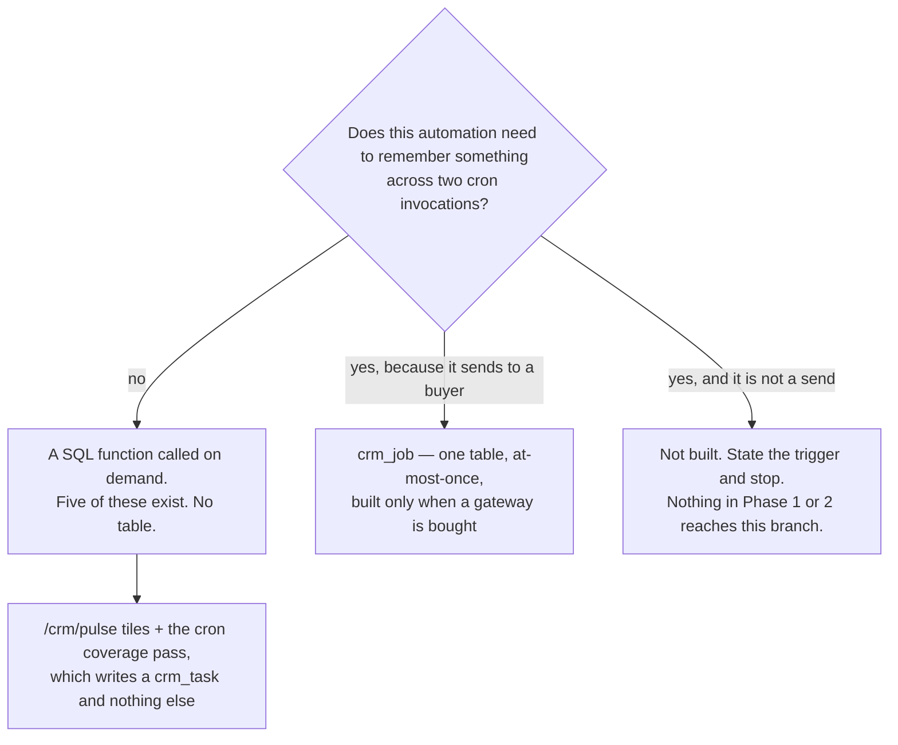
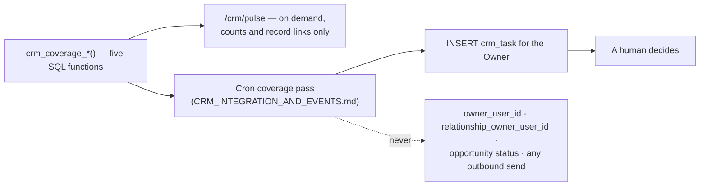

# Forever CRM — Automation Catalogue and Priority

Task ID: FOREVER-CRM-ARCH-001
Status: Proposed architecture — not approved, not scheduled, not authorized for implementation
Repository state of record: main @ 821b3c4e2f6f82e0d4ddce86199a8ff24b44a094
Risk class: R0 (documentation only)

> This document is a design record. It asserts no product truth, changes no active stage, and authorizes no implementation. The active stage remains FOREVER-STUDIO-001 (`docs/CURRENT_STAGE.md`), which lists "large CRM integration" as out of scope. Any implementing task is R2 under the shared-contract rule and requires an Architect-reviewed stage change plus Owner approval.

## What this document decides

1. **There is no automation engine.** All fifteen automation, policy, routing and AI-governance tables proposed in the pre-review draft are cut permanently. This document proposes **zero tables** and allocates **zero migration numbers**.
2. **Five coverage sweeps ship as five named SQL functions and one page** (`/crm/pulse`). That is the entire buildable automation surface.
3. **Eleven operating numbers ship as TypeScript constants** in one file, each carrying its review trigger in a comment. There is no versioned policy register, and with no run queue there is no in-flight re-timing problem to solve.
4. **The kill switch survives as a constant plus a manual toggle** — not a control table. Code may make the switch more restrictive, never less.
5. **The 21-day relationship claim is `flag_only`.** No sweep ever writes `owner_user_id` or `relationship_owner_user_id`.
6. **The full catalogue of 25 automations is retained as a design**, with an explicit "Built in" column on every row. Most of it is designed and not built; six entries are refused permanently.
7. **The Owner's 2-minute and 5-minute SLAs are corrected** to three separate promises on three separate clocks: instant automated acknowledgement (gateway-dependent), 60 business minutes for human first response, and a named overnight expectation.
8. **AI is a decorated side-channel**, enforced by absence: there is no column an LLM can write and no LLM call site in the CRM feature. Call recording and transcription are not modelled at all.
9. **Four rules survive the engine cut as properties of `crm_job`** when a messaging gateway is bought: `valid_until` on deferred sends, a per-person cap that counts reservations rather than completions, at-most-once outbound, and human resolution of ambiguous sends.
10. **Reintroduction is trigger-gated, not scheduled:** `crm_job` alone when a gateway is purchased; an engine only at sustained more than 200 new enquiries per month.

Sibling documents, cited rather than restated: `docs/crm/CRM_DOMAIN_MODEL.md` (tables, INV-D-n invariants, migration register), `docs/crm/CRM_JOURNEYS_AND_STATE_MACHINES.md` (stage machine, the 21-day rule, `next_action_at`), `docs/crm/CRM_INTEGRATION_AND_EVENTS.md` (`crm_job`, the scheduled seam, cron passes), `docs/crm/CRM_ANALYTICS_AND_KPI.md` (metric keys, the denominator floor), `docs/crm/CRM_PRIVACY_CONSENT_RETENTION.md` (consent, suppression, s.32(2)), `docs/crm/CRM_IMPLEMENTATION_PLAN.md` (phases and gates).

---

## 1. What is built, what is designed, what is refused

[Recommendation] The pre-review draft specified fifteen tables, fifteen database invariants, three guard triggers, an eleven-value outcome vocabulary and a four-level control table — in order to schedule **five nightly SELECT statements**. All fifteen are cut. What remains is the discipline, not the machinery.

| Surface | Mechanism | Phase | Tables added |
|---|---|---|---|
| Five coverage sweeps | Five SQL functions (§2), read by `/crm/pulse` and by the cron coverage pass | Phase 1 (two functions) and Phase 2 (three) | **0** |
| Eleven operating numbers | `src/features/forever-crm/policy.ts` constants (§3) | Phase 1 | **0** |
| Kill switch | A constant plus a checked-in manual halt script (§4) | Phase 1 (inert until outbound exists) | **0** |
| Outbound execution | `crm_job`, specified in `docs/crm/CRM_INTEGRATION_AND_EVENTS.md` | Only when a gateway is bought (§5) | 1, owned by that document |
| Owner assignment | Three lines at the server boundary (§6, AUT-03) | Phase 2 | **0** |
| Routing rules, policy register, run ledger, AI governance | **Cut** | — | **0** |



**Migration numbering.** This document allocates no migration number. The two Phase-1 sweep functions ship inside **M3** (`20260729102000_crm_timeline_v1.sql`); the three Phase-2 functions ship with the Phase-2 pipeline migration, whose number the register in `docs/crm/CRM_DOMAIN_MODEL.md` §1.4 allocates when Phase 2 is proposed. [Repository fact] Every filename in that register is above `20260728160000`, clearing open Draft PRs #117 and #119.

---

## 2. The five coverage sweeps

### 2.1 The functions

[Recommendation] Each is `LANGUAGE sql STABLE SET search_path = ''`, fully schema-qualified, with `REVOKE ALL … FROM PUBLIC, anon, authenticated` and `GRANT EXECUTE … TO service_role` — the repository's established function idiom. Each returns **counts plus a bounded list of record ids**, never PII, and each is bounded by `LIMIT`.

| # | Function | Replaces | Predicate (abbreviated) | Metric key | Built in |
|---|---|---|---|---|---|
| S1 | `crm_coverage_unowned()` | AUT-12 orphan sweep | `crm_enquiry.triage_state='unprocessed'` older than `CRM_TRIAGE_STALE_HOURS`; person with `relationship_owner_user_id IS NULL`; (Phase 2) open opportunity with `owner_user_id IS NULL` | `unowned_records` | **Phase 1** |
| S2 | `crm_coverage_silent_persons()` | AUT-11 stale sweep | `crm_person.last_activity_at < now() − CRM_SILENT_THRESHOLD_DAYS`, suppressed by a future `next_action_at` | `silent_persons_14d` | **Phase 1** |
| S3 | `crm_coverage_no_next_action()` | AUT-09 | open opportunity, `next_action_at IS NULL`, no open `crm_task` | `overdue_next_actions` | Phase 2 |
| S4 | `crm_coverage_stage_dwell()` | AUT-10 | `now() − stage_entered_at > crm_pipeline_stage.target_time_in_status_hours` **where that column is not NULL**, `status='open'` | `stage_dwell_breaches` | Phase 2 |
| S5 | `crm_coverage_data_quality()` | AUT-23 | Phase 1: person with no live identifier; enquiry with `focus_project_id IS NULL` but a non-null `project_slug_at_capture`; missing `residence_country_iso2` on a person holding a phone identifier. Phase 2/3 adds `duplicate_open_opportunities_same_project` and `wins_without_credit_reallocation` (`COALESCE(SUM(share_bps), 0) <> 10000`) | per check | **Phase 1**, extended at Phase 2 |

[Inference] S4 is the highest value per unit of complexity in the whole package: one date comparison against a column `docs/crm/CRM_DOMAIN_MODEL.md` already defines, converting the most expensive failure mode at Forever's ticket values — a stalled six-figure enquiry — from human memory into a query. [Web research — stage dwell as a first-class, reportable attribute: https://docs.attio.com/rest-api/attribute-types/attribute-types-status]

**S4 renders "Not configured", never `0`, until targets exist.** `crm_pipeline_stage.target_time_in_status_hours` is seeded NULL for `qualified`, `viewing` and `reserved`; the Owner sets them from twelve observed transitions (`docs/crm/CRM_JOURNEYS_AND_STATE_MACHINES.md` §7.2). A clean zero derived from missing evidence is a positive all-clear the rest of this design forbids.

### 2.2 Two callers, one definition



A coverage definition that exists twice drifts. The Pulse tile and the nightly task are the **same function**, called from two places.

### 2.3 The line no sweep may cross

| Rule | Why |
|---|---|
| A sweep never writes `owner_user_id` or `relationship_owner_user_id` | An ownership change is a commission-attribution event. `flag_only` is adopted across the package (§6, AUT-13; `docs/crm/CRM_JOURNEYS_AND_STATE_MACHINES.md` §7.3) |
| A sweep never advances, wins or loses an opportunity | Stage is commercial evidence |
| A sweep never sends anything to a buyer | Nothing on `main` can send; outbound is `crm_job` only, and only after a gateway is bought |
| A sweep never issues a `DELETE` | INV-D-5 makes `crm_person` undeletable independently; a contract test asserts no `.delete(` under `src/features/forever-crm/server/sweeps.server.ts` |
| A sweep never writes a project, developer, location, unit, price, availability, Passport or Intelligence fact | INV-D-1 |
| A sweep never persists or renders a score, confidence, probability, rank or conversion rate | INV-D-17 — the columns do not exist, so it cannot happen by accident |

### 2.4 `next_action_at` is the universal suppressor

> A deal with a future `next_action_at` is not silent, not stalled, not overdue and does not lapse.

[Owner requirement + Recommendation] This is the highest-value operational correction in this document. Forever runs a six-to-eighteen-month off-plan cycle; the pre-review draft's four operating constants were inside-sales numbers, and only one was suppressed. A buyer correctly left alone until October raised three flags and cost their Guide the relationship claim. Every staleness predicate in S2, S3, S4 and the 21-day check now carries `AND (next_action_at IS NULL OR next_action_at <= now())`.

---

## 3. Eleven operating numbers as TypeScript constants

### 3.1 The file

One file, `src/features/forever-crm/policy.ts`, exported `as const`, imported by the sweeps' callers and by every SLA computation. A change is a reviewed pull request against one file; "what was the rule in March?" is `git log -p` on that file.

```ts
/**
 * Operating numbers. Every constant states its review trigger.
 * A change in the RESTRICTIVE direction is R1. A change that could INCREASE
 * client-facing action requires Owner sign-off recorded in the pull request.
 */

/** Review trigger: the Owner states actual operating hours (Owner decision 4). Seeded, not measured. */
export const CRM_BUSINESS_HOURS = {
  timezone: "Asia/Bangkok",
  week: { mon: [["09:00", "18:00"]], /* … */ sat: [["10:00", "16:00"]], sun: [] },
} as const;

/** Review trigger: the first ownership dispute, or the Owner declaring the rule operative. */
export const CRM_OWNERSHIP_EXCLUSIVITY = {
  days: 21,
  anchor: "assignment_activity",
  onExpiry: "flag_only", // never "release" — no machine performs a commission-relevant write on a clock
} as const;
```

### 3.2 The eleven

| Constant | Seeded value | Review trigger |
|---|---|---|
| `CRM_BUSINESS_HOURS` | `Asia/Bangkok`, Mon–Fri 09:00–18:00, Sat 10:00–16:00, Sun closed | Owner decision 4 — actual operating hours are the denominator of every response metric and are not inferable from the repository |
| `CRM_SLA_FIRST_RESPONSE` | 60 business minutes target, 240 breach | Twelve months of recorded first responses, or any change to business hours |
| `CRM_SLA_ASSIGNMENT_ACK_BUSINESS_MINUTES` | 30 | A second advisor joins |
| `CRM_ACK_BUYER` | `{ enabled: false, templateKey: "enquiry_ack_v1" }` | A messaging gateway is bought. Seeded `false` — fail-closed |
| `CRM_FOLLOWUP_CADENCE_DAYS` | `[4, 7, 28]` | Twelve closed opportunities with recorded `cycle_time_days`; these are inside-sales numbers on an off-plan cycle |
| `CRM_OWNERSHIP_EXCLUSIVITY` | 21 days, `flag_only` | The first ownership dispute |
| `CRM_SILENT_THRESHOLD_DAYS` | 14 | Same as the cadence trigger; a fortnight is short for this cycle and is only tolerable because `next_action_at` suppresses it |
| `CRM_TRIAGE_STALE_HOURS` | 48 | The legacy triage queue is drained |
| `CRM_OUTBOUND_SEND_WINDOW` | buyer-local 09:00–20:00, fallback `Asia/Bangkok` | A gateway is bought, or the first complaint about a message time |
| `CRM_OUTBOUND_DAILY_CAP` | 2 per person per day, 4 per week, automated sends only | A gateway is bought |
| `CRM_DEFAULT_OWNER_USER_ID` | `null` | A second advisor joins. `null` because no artefact may hard-code a person's identifier |

### 3.3 What is lost, stated honestly

[Inference] The versioned register bought three things. Two are recovered and one is genuinely given up.

| Property | Under the register | Under constants |
|---|---|---|
| Historical value of a rule | A SQL query | `git log -p src/features/forever-crm/policy.ts`. Recovered, in the repository's own audit medium |
| A scheduled future change | `effective_from` in the future | A pull request merged on the day. Given up — and at this volume a scheduled policy change is a feature with no user |
| In-flight run re-timing | Timing bound at run creation; safety read live; a `crm_rebind_runs` escape hatch | **The problem disappears.** With no run ledger there is no in-flight run to re-time. A change applies to the next evaluation, and evaluations are stateless |

**Every SLA report states the git revision of `policy.ts` it was computed against.** Without that, last month's report changes when this month's constant does — the one property the versioned register existed to guarantee, preserved at zero schema cost.

---

## 4. The kill switch, without a control table

[Recommendation] Three layers. All default to the most restrictive setting.

| Layer | Mechanism | Stops | Requires a deploy |
|---|---|---|---|
| 1 — default | `CRM_ACK_BUYER.enabled = false` and, once outbound exists, `CRM_OUTBOUND_ENABLED = false` in `policy.ts` | Every client-facing send | Yes — a reviewed PR, which is the point |
| 2 — manual halt | A checked-in script, `scripts/crm-outbound-halt.sql`, run by the Owner in the Supabase SQL editor: it moves every unclaimed outbound `crm_job` to a held state and is idempotent. A companion script re-queues | Every pending send, within seconds, at 03:00, with no engineer | No |
| 3 — per person | `CRM_OUTBOUND_DAILY_CAP`, counted as **reservations** (§5) | Further automated contact with one buyer | No |

Layer 2 exists only once `crm_job` exists. Until a gateway is bought there is nothing to stop, and saying otherwise would be theatre.

**The self-disable rule survives the table cut.** Code may make the posture more restrictive — the circuit breaker in `docs/crm/CRM_INTEGRATION_AND_EVENTS.md` skips a job kind for a tick after repeated failures — and may **never** make it less restrictive. Re-enabling is a human action: a merged PR (layer 1) or a human-run script (layer 2). A brake a machine can release is not a brake.

---

## 5. The four rules that survive as properties of `crm_job`

These are not automation-engine features. They are properties the single outbound table must carry the day it is created (`docs/crm/CRM_INTEGRATION_AND_EVENTS.md` owns the DDL).

| Rule | Defect it prevents |
|---|---|
| **`valid_until TIMESTAMPTZ`** on every job. A job that cannot be sent before it terminates as `expired` and writes a `crm_task` rather than sending late. Appointment reminders set `valid_until = scheduled_start_at` | A reminder deferred out of quiet hours, delivered after the appointment it was reminding about |
| **The per-person cap counts reservations, not completions.** Sum jobs for that person whose `send_attempted_at` is set today — written *before* the provider call and therefore visible to a concurrent tick — plus completed activities | Two overlapping cron invocations claim two jobs for the same person and both pass a cap computed from completed sends. The cap is the last defence against repeat-messaging one buyer and it failed under exactly the condition it exists for |
| **Outbound is at-most-once; ambiguity escalates to a human.** A definitive transport failure retries; an ambiguous timeout does not — it lands in the sixth Pulse count, "Sends needing review", with a two-way human resolution | A duplicate message to a buyer is worse than a missed one, and a state whose whole purpose is a human decision, with no human able to make it, is write-only |
| **Quiet hours changes the action, it does not remove it.** Outside `CRM_OUTBOUND_SEND_WINDOW` a synchronous channel becomes "draft and hold"; asynchronous channels are never downgraded | The alternative greys out every card on the systematically most common morning queue |

---

## 6. The catalogue

Retained in full **as a design**. The "Built in" column is the operative one on every row.

**Classification.** `[DR]` deterministic rule · `[CP]` constant-governed (a number in `policy.ts`, changed by a reviewed PR, never at runtime) · `[AI]` AI-assisted draft · `[HA]` human approval required · `[PR]` prohibited autonomous action.

**Built in.** `P1` / `P2` / `P3` = the corresponding phase · `GW` = requires a purchased messaging gateway · `TRG` = deferred behind a named trigger in §7.3 · `NEVER` = the autonomous form is refused permanently.

**On `[PR]`:** a prohibited action has no implementation and no configuration value. Prohibition is enforced by absence, exactly as `docs/crm/CRM_DOMAIN_MODEL.md` enforces "a person has no lifecycle stage" by the absence of a column. Where a row is marked `[PR]`, what is prohibited is the *autonomous* variant; the `[HA]` form of the same row is permitted.

### Cluster A — Intake and first contact

| ID | Trigger | Condition | Action | Class | Built in |
|---|---|---|---|---|---|
| **AUT-01** Buyer acknowledgement | Enquiry captured, **in-request, not queued** | `triage_state <> 'rejected_spam'`; a live email identifier exists; not suppressed on all channels | Send one pre-approved transactional acknowledgement in `preferred_language`; set `acknowledged_at`; log `crm_activity(direction='outbound', is_automated=true, purpose_key='enquiry_response')` | `[DR]` | **GW** |
| **AUT-02** Internal new-enquiry alert | Enquiry captured | `triage_state <> 'rejected_spam'` | Notify the assigned owner, or the team if unassigned | `[DR]` | **GW** |
| **AUT-03** Owner assignment | Enquiry captured | Person has no `relationship_owner_user_id` | Keep the existing owner if one exists; else `CRM_DEFAULT_OWNER_USER_ID`; else leave unassigned for S1 to raise. Log `crm_activity(kind='assignment')` | `[CP]` | **P2** |
| **AUT-04** Assignment acknowledgement chase | `assigned_at + CRM_SLA_ASSIGNMENT_ACK_BUSINESS_MINUTES` | No owner activity on that person since assignment | Notify the owner only; never the buyer | `[DR]` | **P2** |
| **AUT-05** First-response SLA escalation | Escalation ladder offsets, business clock | `crm_enquiry.first_response_at IS NULL` | Notify owner → notify team → flag for fallback | `[CP]` | **P2** |
| **AUT-06** Fallback reassignment | Final rung of AUT-05 | Still no first response | **Flag and notify.** The reassignment itself is a human action | `[HA]` | **TRG** |

**AUT-01 is transactional, not marketing** — it answers the person's own enquiry under the `enquiry_response` purpose, which is why it is `[DR]`. It is nonetheless stopped by `crm_suppression(channel='all', scope='all')`: an absolute objection stops even a transactional send. Content is a seeded, versioned template, never generated. [Repository fact] It is impossible today: `submitLead()` at `src/lib/lead-service.ts:92` inserts from the browser under the anon key, so there is no server-side moment at which anything could fire.

**AUT-06 uses "Guide"** for the assigned advisor. [PROVISIONAL — open Draft PR #102] The word is harvested from that PR; the branch is not, and it collides with `main` at migration `20260726120000`. Fallback reassignment is `[HA]` and never autonomous because an owner change is a commission input.

### Cluster B — Working the enquiry

| ID | Trigger | Condition | Action | Class | Built in |
|---|---|---|---|---|---|
| **AUT-07** First-response action plan | `first_response_at` set | Owner assigned | Create the task set from `CRM_FOLLOWUP_CADENCE_DAYS`; set `next_action_at` | `[CP]` | **P2** |
| **AUT-08** 4 / 7 / 28-day follow-up | `first_response_at + offsets` | No inbound activity since the previous rung; opportunity open; no future `next_action_at` | Create a `crm_task` for the owner. **No buyer contact** | `[CP]` | **P2** |
| **AUT-09** No next action | Sweep **S3** | Open opportunity, `next_action_at IS NULL`, no open task | Coverage count + `crm_task` | `[DR]` | **P2** |
| **AUT-10** Stage dwell | Sweep **S4** | Dwell past a *configured* target | Coverage count + notify owner | `[DR]` | **P2** |
| **AUT-11** Silent person | Sweep **S2** | `last_activity_at` past `CRM_SILENT_THRESHOLD_DAYS`, not suppressed by `next_action_at` | Coverage count; internal only | `[DR]` | **P1** |
| **AUT-12** Unowned / untriaged | Sweep **S1** | Untriaged enquiry past `CRM_TRIAGE_STALE_HOURS`; unowned person; (P2) unowned open opportunity | Coverage count to the Owner. **Never auto-assigns** | `[DR]` | **P1** |

**AUT-08 is the single most important classification decision in the catalogue.** The ladder creates **tasks for the advisor**, not messages to the buyer. [Web research] The market pattern — sequences auto-pausing on genuine response, a call-duration threshold so voicemails do not count, a daily cap, a buyer-timezone send window (https://help.followupboss.com/hc/en-us/articles/1500008539982-Action-Plans-Overview) — is correct in shape and premature in application. [Web research] The off-plan canon's own default is reviewed-send, not auto-send, and a contact must have an owner before automation may send as them (https://knowledge.spark.re/follow-up-schedules). The buyer-facing variant exists only at `[HA]`, only with a gateway, and only after the task form has demonstrably reduced missed follow-ups.

### Cluster C — Ownership and nurture

| ID | Trigger | Condition | Action | Class | Built in |
|---|---|---|---|---|---|
| **AUT-13** 21-day relationship claim | `assignment activity + CRM_OWNERSHIP_EXCLUSIVITY.days` | Owner unchanged; no owner-authored activity in the window; no open opportunity with a future `next_action_at` | **Flag only.** A `crm_task` for the Owner. Release is a human action | `[HA]` | **TRG** |
| **AUT-14** Long-cycle nurture | Buyer-timezone cadence | Consent evidenced for `direct_marketing`; not suppressed; under cap; inside window | Draft → human review → send on accept | `[HA]` | **GW** |
| **AUT-15** Lost-lead nurture | Opportunity `lost`, plus a wait | `lost_reason_key NOT IN ('duplicate','not_qualified')`; consent evidenced | Autonomous send **prohibited**. Reviewed send permitted | `[PR]` / `[HA]` | **NEVER** / GW |
| **AUT-16** Reactivation | Dormancy threshold | Consent evidenced; not suppressed | Draft → human review | `[HA]` | **GW** |

**AUT-13 flags, it does not release.** [Owner requirement] Autonomous release is refused for three independent reasons: it is a commission-attribution change; it would fire in bulk the instant the constant changed; and a buyer deliberately left alone during a slow decision is indistinguishable in the data from a neglected one. The pre-review package specified this rule three incompatible ways — one section had the cron nulling `relationship_owner_user_id`, another forbade any automated write to it, a third forbade release outright. `flag_only` resolves it across the package.

**AUT-15 and AUT-16 are structurally blocked for most of the existing base, by design.** [Repository fact] Neither `ContactForm.tsx` nor `BoothLeadForm.tsx` renders a consent checkbox, privacy notice or marketing opt-in, and `public.leads` has no consent column; every backfilled legacy person therefore receives a `crm_suppression(scope='marketing', source='legacy_backfill')` row at creation. [Web research — descriptive only, not legal advice; qualified Thai counsel must confirm] The s.32(2) direct-marketing objection is absolute with no rebuttal, and the July 2026 PDPC draft guidance cautions against treating consent as a default or catch-all basis (https://www.lexology.com/library/detail.aspx?g=27642f25-1b92-4c09-b8ff-b4b1c4f27467; primary text, unofficial English translation — the Thai text governs — https://cc.kmutt.ac.th/Files/Act%20Eng/personal-data-protection-act-2019-en.pdf). Stated without euphemism: **a lost-lead nurture campaign over the existing lead base cannot lawfully run today.**

### Cluster D — Meetings and commitments

| ID | Trigger | Condition | Action | Class | Built in |
|---|---|---|---|---|---|
| **AUT-17** Appointment reminder | `scheduled_start_at − offsets` | `outcome='pending'`; not suppressed on all channels | Seeded reminder template, buyer's language, buyer's timezone; `valid_until = scheduled_start_at` | `[CP]` | **GW** |
| **AUT-18** Post-appointment follow-up | `outcome` set to `held` | — | Owner task; optionally a drafted recap → human review | `[AI]` + `[HA]` | **TRG** |
| **AUT-19** Unit-hold expiry warning | `expires_at − 48h`, then at expiry | `state IN ('requested','confirmed')` | Notify internally; flag at expiry. **Never writes `units.availability_status`** | `[DR]` | **P3** |
| **AUT-20** Reservation requirement chase | Daily while a reservation is open | A mandatory requirement neither satisfied nor waived | Notify internally + owner task. A buyer-facing document request is `[HA]` | `[DR]` / `[HA]` | **P3** |
| **AUT-21** Reservation date follow-up | `cooling_off_ends_on`, `expires_on` | Derived state is not `cancelled` or `contracted` | Notify internally; flag at lapse | `[DR]` | **P3** |

**AUT-17 is the only buyer-facing auto-send besides AUT-01**, for the same reason: it is transactional, it concerns a commitment the buyer made, and its content is fully determined by data the buyer supplied. [Web research] Appointment type and outcome as first-class and reportable is the correct shape (https://help.followupboss.com/hc/en-us/articles/9228360927383-Appointment-Report). Two-way calendar sync stays rejected: push notifications carry no body, channels do not auto-renew, and Google states notifications are not 100% reliable (https://developers.google.com/workspace/calendar/api/guides/push).

**AUT-19's boundary is the whole point of the row.** [Owner requirement, via `docs/FOREVER_BRAIN_V1.md` §7] `public.units.availability_status` is unit-inventory truth the CRM must not own. [Web research] Spark derives unit status from deal state (https://knowledge.spark.re/inventory-settings); Forever deliberately does **not** adopt that derivation. AUT-19 warns a human and stops.

### Cluster E — Data quality and matching

| ID | Trigger | Condition | Action | Class | Built in |
|---|---|---|---|---|---|
| **AUT-22** Duplicate candidate detection | Nightly, bounded slice | Trigram similarity on `display_name`, shared email local-part, or shared party group, among live unmerged persons | Insert a merge candidate at `state='open'`. Merge is human-only. **Auto-merge prohibited** | `[DR]` / `[HA]` / `[PR]` | **TRG** |
| **AUT-23** Data-quality checks | Sweep **S5** | See §2.1 | One internal digest: counts and record links only | `[DR]` | **P1** |
| **AUT-24** Project / price change matched to interests | Publish RPC completes | A live interest row references it; the slug passes `excludeKnownFictitiousProjects` | Internal digest to the owner. Buyer-facing send is `[HA]`. An automatic price-drop broadcast is **prohibited** | `[DR]` / `[HA]` / `[PR]` | **TRG** |

**AUT-22 stores and renders no similarity number** (INV-D-17), and a dismissed pair stays dismissed so a false match is not re-suggested forever. [Web research] Auto-merge is refused because HubSpot documents plainly that records cannot be unmerged (https://knowledge.hubspot.com/records/merge-records); a wrong merge shows one buyer another's budget. [Repository fact] `pg_trgm` is a genuinely new extension — only `pgcrypto` is installed today — so its availability is a pre-apply check (https://www.postgresql.org/docs/current/pgtrgm.html).

**AUT-24 is the highest-value automation Forever alone can build**, and its boundary must be exact. `crm_person_interest` stores `project_id` / `unit_id` foreign keys and nothing else; the digest renders live canonical values **at read time** (INV-D-1). The buyer-facing variant is prohibited because a price-drop broadcast is direct marketing under s.32, because it would render project facts into an outbound message with no human verifying them, and because [Repository fact] `src/lib/public-truth.ts` still quarantines six fictitious demo slugs. **Also cut:** the `units_touched` watch, which fired on `units.updated_at` — bumped by any column write, including the price projection — producing unbounded "this record changed, check it" tasks per republish. It returns only when a canonical `unit_availability_history` exists.

### Cluster F — Post-sale

| ID | Trigger | Condition | Action | Class | Built in |
|---|---|---|---|---|---|
| **AUT-25** Post-sale relationship maintenance | Anniversary of `spa_signed_on`; handover milestones | Opportunity `won`; consent evidenced where the contact is not transactional; not suppressed | Owner task + drafted message → human review | `[HA]` | **GW** |

Classified `[HA]` permanently. There is no volume at which a post-sale message to a closed buyer should be sent unread. [Web research — referral relationships and their deposit/conveyancing context: https://knowledge.spark.re/conveyancing-deposit-structure-settings]

---

## 7. Priority and build order

### 7.1 Scoring frame

Scored against `docs/FOREVER_STRATEGIC_NORTH_STAR.md`'s Feature Decision Test, extended with client experience and risk. **Higher is better** for **C** (commercial value), **O** (operating time saved), **X** (client experience), **V** (reversibility); **higher is worse** for **R** (risk), **B** (build cost), **M** (maintenance). **D** = data value.

**No composite total is computed.** Summing ordinals into a number would manufacture exactly the false precision INV-D-17 prohibits elsewhere, and the North Star's rule is a threshold test — strong value in at least two of {C, O, D} — not an average.

### 7.2 The matrix

| ID | Automation | C | O | D | X | R | B | M | V | Verdict |
|---|---|:-:|:-:|:-:|:-:|:-:|:-:|:-:|:-:|---|
| AUT-11 | Silent person (S2) | H | H | H | L | L | L | L | H | **Build first** |
| AUT-12 | Unowned / untriaged (S1) | M | H | H | L | L | L | L | H | **Build first** |
| AUT-23 | Data quality (S5) | M | H | H | L | L | L | L | H | **Build first** |
| AUT-09 | No next action (S3) | H | H | H | L | L | L | L | H | Phase 2 |
| AUT-10 | Stage dwell (S4) | H | H | H | L | L | L | L | H | Phase 2 |
| AUT-03 | Owner assignment | M | H | M | M | M | L | L | H | Phase 2, single-owner form |
| AUT-05 + 04 | SLA escalation | H | H | H | M | M | M | M | H | Phase 2 |
| AUT-07 + 08 | Action plan and the ladder, as tasks | H | H | M | M | L | L | M | H | Phase 2 |
| AUT-02 | Internal new-enquiry alert | H | H | L | M | L | L | L | H | Gateway |
| AUT-01 | Buyer acknowledgement | H | M | M | H | L | M | L | H | Gateway |
| AUT-17 | Appointment reminder | H | M | M | H | L | M | L | H | Gateway |
| AUT-19/20/21 | Reservation and hold chases | H | H | H | M | L | M | M | H | Phase 3 |
| AUT-13 | 21-day claim (flag) | M | M | M | L | M | L | M | H | Trigger |
| AUT-18 | Post-appointment follow-up | H | M | H | M | M | M | M | H | Trigger |
| AUT-22 | Duplicate detection (suggest) | M | H | H | L | M | M | M | H | Trigger |
| AUT-24 | Change matched to interests | H | M | H | H | M | M | M | H | Trigger |
| AUT-06 | Fallback reassignment | M | M | M | M | H | M | M | M | Trigger |
| AUT-14 / 16 / 25 | Nurture, reactivation, post-sale | M | L | L | M | H | M | H | M | Gateway, `[HA]` |
| AUT-15 | Lost-lead nurture, autonomous | M | L | L | L | H | M | H | L | **Never** |

Two patterns are worth naming. **First, everything built before a gateway is internal** — no row above the gateway line touches a buyer. That is not conservatism; it is where the value is at this volume. **Second, every high-risk row is buyer-facing and non-transactional, and every one of those is deferred or refused.**

### 7.3 Order, with a kill or review trigger on every item

`docs/FOREVER_STRATEGIC_NORTH_STAR.md` requires a kill or review trigger on every substantial task.

| # | Build | Depends on | Kill / review trigger |
|---|---|---|---|
| 0 | **Nothing — measure first.** Slice 0's read-only SQL script and Slice 1's Owner console, both zero-table (`docs/crm/CRM_IMPLEMENTATION_PLAN.md`) | none | Fewer than 5 non-spam leads in the trailing 90 days ⇒ **stop the programme** and reduce to the script |
| 1 | **S1, S2, S5** — the Phase-1 sweeps | Phase-1 migrations M1–M3 | Review at 60 days: if the Pulse counts are never opened, no further automation will change that |
| 2 | **S3, S4** and AUT-03's single-owner assignment | Phase-2 pipeline tables | If breach counts are consistently zero at ten seats, the ladder is theatre — delete it |
| 3 | **AUT-05 + AUT-04**, on the business clock | S3/S4; `policy.ts` | Produces the first honest first-response distribution; if it produces nothing, the SLA was already met |
| 4 | **AUT-07 + AUT-08** as tasks | `crm_task`; `CRM_FOLLOWUP_CADENCE_DAYS` | If advisors close tasks without acting, the ladder is noise — measure task completion against subsequent activity |
| 5 | **`crm_job`, then AUT-02, AUT-01, AUT-17** | **A purchased gateway**, gated on Owner decision 1 | If the in-request send cannot be made reliable, **withdraw the immediate-acknowledgement claim** rather than silently degrade it to five minutes |
| — | **Never** — AUT-15 autonomous and every row in §9 | — | — |

**Named triggers for the deferred entries:**

| Entry | Trigger to build |
|---|---|
| AUT-19, AUT-20, AUT-21 | The first `crm_reservation` row. A reservation-chase engine over zero reservations is the architecture-only foundation `docs/CURRENT_STAGE.md` excludes |
| AUT-22 | The first confirmed duplicate person found by hand |
| AUT-24 | At least 20 live interest rows spanning at least 5 projects |
| AUT-18 | At least 10 appointments with `outcome='held'` in a month |
| AUT-13 | The first ownership dispute, or the Owner declaring the 21-day rule operative |
| AUT-06 and routing rules | At least 2 advisors plausibly owning the same inbound enquiry |
| `crm_job` | A messaging gateway is bought |
| An automation engine of any kind | **Sustained more than 200 new non-spam enquiries per month for three consecutive months** |

**Routing rules are cut, and the deferred design is one sentence, not six tables.** When the two-advisor trigger fires, the shape is ordered, first-match-wins rules with per-rule working hours, a logged and replayable selection basis, and least-recently-assigned selection with ties broken by user id ascending ([Web research] the ordered first-match-wins shape: https://help.lofty.com/hc/en-us/articles/360055177831-Lead-Routing-How-to-set-up-lead-routing-rules). [Web research] Weighted "hunger" allocation — `new hunger = (hunger − 1) ÷ allocation` (https://help.lofty.com/hc/en-us/articles/360047876811-In-Depth-Round-Robin-Next-Up) — is **rejected outright**: it is unexplainable when a Phuket commission is involved, it solves a fairness problem ten seats do not have, and a per-advisor weight that changes with outcomes is a hidden score forbidden by INV-D-17. The weighted activity leaderboard (appointment 500 / call 10 / text 2 / email 1) is rejected on the same grounds.

---

## 8. The SLA correction

**This is a correction, not a preference.** [Owner requirement] The 2-minute acknowledgement and 5-minute human-contact targets are stated respectfully and replaced with something achievable, measurable and better aligned with what was actually wanted.

### 8.1 What is true

| # | Finding | Source |
|---|---|---|
| 1 | The "5-minute rule" is vendor folklore. The primary study's own author states the pattern appears only when data from several companies is combined; it does not reliably appear inside any single company. The publisher sold callback dialler software | [Web research] https://www.onecavo.com/wp-content/uploads/2015/11/MIT-InsideSales.com_Lead-Response-Management.pdf |
| 2 | The strongest defensible threshold is **one hour**, its outcome variable is a meaningful conversation with a decision maker, and its most useful finding is that the bar is on the floor: of 2,241 audited companies, 23% never responded at all and the average was 42 hours | [Web research] https://thedenmangroupselling.wordpress.com/wp-content/uploads/2011/03/the-short-life-of-online-sales-leads-harvard-business-review.pdf |
| 3 | The speed-to-lead market leader **deliberately delays** routing by up to 5 minutes in order to route correctly | [Web research] https://help.followupboss.com/hc/en-us/articles/4402128249367-Dashboard |
| 4 | The best independent evidence is not from sales: warm transfer versus callback in clinical-trial recruitment, 25% versus 12.9%, n = 2,341, retrospective. The mechanism is **not breaking the session**, not shaving minutes off a callback | [Web research] https://pmc.ncbi.nlm.nih.gov/articles/PMC10395154/ |
| 5 | Phuket is UTC+7, Moscow UTC+3. Peak Russian evening browsing lands 23:00–03:00 Phuket time. A single global wall-clock human SLA is recorded as failed nightly, by construction | [Repository fact / arithmetic] |
| 6 | The only scheduled seam is a `*/5` cron, and today the lead insert bypasses the Worker entirely — there is no server-side moment at which anything could fire | [Repository fact] `wrangler.jsonc`; `src/lib/lead-service.ts:92` |

Finding 6 is decisive and it is Forever's own: **a 2-minute target cannot be met on the cron path at all, and a 5-minute human target would be measured on a clock that is asleep for the hours when the buyers are awake.**

### 8.2 Three promises, three clocks

They are not one SLA and must never be reported as one.

| | Promise | Clock | Target | Measured as | Status |
|---|---|---|---|---|---|
| **1** | The buyer receives a confirmation | Wall clock, immediate | p95 under 5 s, p99 under 30 s | `acknowledged_at − received_at` | Achievable **only** on the server-side capture path with a gateway (AUT-01) |
| **2** | A named advisor makes contact | **Business clock** (`CRM_BUSINESS_HOURS`) | **60 business minutes** target, 240 breach | `first_response_at − received_at`, intersected with the business window | Achievable, and honest |
| **3** | An out-of-hours enquiry is not silently queued | Buyer-local | The acknowledgement carries an explicit named time | Both the promised time and `acknowledged_at` stored | §8.3 |

**On the 2-minute ask:** the target is not too aggressive — **it is too slow, and measured on the wrong clock.** On the correct path (in-request) it is beaten by roughly two orders of magnitude; on the cron path it cannot be met at all. The right answer is not "no" but "the acknowledgement should be effectively instant, and getting there means moving the lead write behind a server function first" — which independently unblocks attribution, rate limiting, dedupe and consent capture (`docs/crm/CRM_INTEGRATION_AND_EVENTS.md`).

**On the 5-minute human ask:** replaced by **60 business minutes** — the strongest source-backed threshold available, and on finding 2 still far ahead of a market where 23% never respond. The business clock is elapsed time **intersected** with `CRM_BUSINESS_HOURS`. An enquiry arriving at 23:40 Phuket accrues zero business minutes until the window opens. Raw wall-clock elapsed time is stored alongside it, so nothing is concealed. [Owner requirement, unanswered] The window itself is Owner decision 4; no SLA count may be published against an assumed one.

### 8.3 Overnight

| Option | Recommendation |
|---|---|
| **(i) The clock pauses** outside business hours | **Adopt now.** It is what is true today, and recording the truth is the prerequisite for changing it |
| **(ii) A staffed evening window** aligned to Moscow evening (22:00–02:00 Phuket) | **Not now.** Build only on a measured trigger: at least 20 enquiries per month arriving 22:00–03:00 Phuket for two consecutive months. Report that as a **count**, never a share — the denominator is far under 30 |
| **(iii) An out-of-hours acknowledgement naming a time** — "an advisor will reply after 09:00 Phuket (05:00 Moscow)" | **Adopt with (i).** It converts an unanswered night from a failure into a kept promise, and costs one template variant |

### 8.4 The real objective is session continuity

[Web research, finding 4] The mechanism is not elapsed minutes. The highest-value move is ensuring the session **ends with the buyer holding something**: the acknowledgement carries the buyer's own decision profile back to them, a named next step and a named person rather than "we will be in touch", and a self-service continuation so a motivated buyer at 01:00 Phuket can act rather than wait. At the booth the continuation is a live human handoff — the actual warm transfer the evidence supports. None of this needs a faster clock.

### 8.5 How it is reported

Raw counts and distributions only. Full rules in `docs/crm/CRM_ANALYTICS_AND_KPI.md`.

| Report | Permitted | Reason |
|---|---|---|
| Enquiries per month, by source, by hour-of-day (Phuket local) | yes | Counts are counts |
| Distribution of business-minutes-to-first-response — median, p90, max | yes | A distribution does not hide behind a denominator |
| Count of SLA breaches, with the specific records | yes | Actionable, and each is a real record |
| Count of unactioned enquiries — no outbound from the **assigned** advisor, automated sends excluded | yes | [Web research] the market's own definition, and the reason `crm_activity.is_automated` exists — https://help.followupboss.com/hc/en-us/articles/4402128249367-Dashboard |
| "SLA attainment: 87%" | **no** | Denominator under 30. [Web research — Wilson interval: 3 of 20 = 15% with a 95% CI of 5.2%–36.1%, and detecting a real 10%→15% improvement needs roughly 1,400 leads — https://www.itl.nist.gov/div898/handbook/prc/section2/prc241.htm] |
| Per-advisor response-time comparison | **no** | Noise that will be read as performance evidence. [Web research] NAR's 2025 survey, n > 1,200: CRM is only the #2 lead source at 23%, is absent from the most-used-technology list, and agents abandon CRMs that convert their time into management reporting — https://www.nar.realtor/research-and-statistics/research-reports/realtor-technology-survey |
| Stage-to-stage conversion, stage-probability forecasts | **no** | INV-D-17; no column exists to store them |

Every SLA report states the `policy.ts` revision it was computed against (§3.3).

---

## 9. AI boundaries, and prohibited autonomous actions

### 9.1 The rule

> **AI is a decorated side-channel. No deterministic path — assignment, SLA timers, stage transitions, commission, consent, or any coverage sweep — may read an LLM-written value.**

[Web research] The rule is taken from HubSpot's own documented failure mode: when AI credits run out, "the action will fail and any outputs used will populate with an empty value" (https://knowledge.hubspot.com/workflows/use-breeze-to-research-and-summarize-data-in-workflows). An empty string a timer reads is not an error; it is a silent wrong answer that looks like data.

**With the AI-governance table cut, enforcement is by absence and is stronger for it.** There is no CRM column an LLM may write, no LLM client imported anywhere under `src/features/forever-crm/`, and no drafting surface in any built phase. A contract test asserting the absence of an LLM import is one line and cannot silently pass. If AI drafting is ever proposed it needs its own R2 record specifying where output lives, how it is grounded, and how a human accepts it before anything reaches a buyer — and the accept-before-send gate is not optional.

**Untrusted input.** Guest-authored text lives in `crm_enquiry.message_text`, the raw capture columns, inbound `crm_activity.body_text` and (Phase 2) the profile note, each marked "untrusted data, never instructions" in `docs/crm/CRM_DOMAIN_MODEL.md`. Four rules follow: guest text is data, never instructions; no sweep predicate pattern-matches free text, so guest text cannot influence control flow even indirectly; any future model has no tools and no write access; and grounding is supplied by the caller, never chosen by the model. `docs/crm/CRM_UX_INFORMATION_ARCHITECTURE.md` carries the rendering half — plain text for the named untrusted columns, plus a Content-Security-Policy on `/crm` and `/booth`.

**EU AI Act Article 50.** [Web research] Transparency obligations apply from 2026-08-02 — https://artificialintelligenceact.eu/article/50/. Whether Forever is in scope depends on whether it **targets** the EU; [Web research] per EDPB Guidelines 3/2018 the trigger is targeting, not buyer nationality — https://www.edpb.europa.eu/our-work-tools/our-documents/guidelines/guidelines-32018-territorial-scope-gdpr-article-3-version_en. That is Owner decision 2. Descriptive only, not legal advice; qualified counsel required.

**Call recording and transcription are deferred entirely** — not modelled, not designed, not in the catalogue. No table, no audio column, no transcript column, no action that could produce one. Highest legal risk and lowest certainty in the area, in a two-language cross-border setting where consent-to-record rules differ by the buyer's location and by Thai law simultaneously. The trigger for revisiting is an explicit counsel opinion, nothing less.

### 9.2 Prohibited autonomous actions

Prohibition is enforced by absence: no configuration value enables any of these, because no implementation exists.

| # | Prohibited | Blocked by |
|---|---|---|
| 1 | Sending any client-facing message not authored or accepted by a named human, other than the seeded transactional set (AUT-01, AUT-17) | Absence of any send path in Phase 1–3; `CRM_ACK_BUYER.enabled = false`; the halt script |
| 2 | Sending for a marketing purpose to a suppressed person, or to a legacy-backfilled person with no fresh consent event | **INV-D-19** allow-list trigger on `crm_activity`, resolving `merged_into_person_id` first; auto-suppression at backfill |
| 3 | Merging two persons | Merge is a human-invoked SECURITY DEFINER routine only |
| 4 | Advancing a stage, or marking an opportunity `won` or `lost` | Absence — no automated writer of `stage_id` or `status` |
| 5 | Releasing or reassigning ownership at the 21-day expiry | `flag_only` (§6, AUT-13) and the absence of a release path |
| 6 | Writing any project, developer, location, unit, price, availability, Passport or Intelligence fact — including deriving `units.availability_status` from a hold | **INV-D-1**; AUT-19 flags and stops |
| 7 | Setting `crm_reservation.spa_issued_on` | **INV-D-25** guard trigger |
| 8 | Emitting or persisting any score, confidence, probability, rank or conversion rate | **INV-D-17** — the columns do not exist |
| 9 | Writing `public.leads.status` | **INV-D-16** `BEFORE UPDATE` trigger |
| 10 | Any `DELETE` | **INV-D-5**; the no-`.delete(` assertion on the sweeps module |
| 11 | Making the kill switch less restrictive | §4 — a merged PR or a human-run script only |
| 12 | Contacting a person during their local night | `CRM_OUTBOUND_SEND_WINDOW`, on the buyer's clock, changing the action rather than dropping it |
| 13 | Retrying an outbound send after a definitive provider failure, or after an ambiguous timeout | At-most-once; ambiguity escalates to a human (§5) |
| 14 | Creating a person from an untriaged legacy `public.leads` row | Backfill creates enquiries at `triage_state='unprocessed'` only, which would otherwise poison the dedupe universe on day one |
| 15 | Recording, transcribing or storing call audio | §9.1 — no table, no column, no action |
| 16 | Calling any outbound webhook, or exposing any inbound webhook route | No provider exists; an inbound route would be the repository's first unauthenticated endpoint on a Worker whose deployment is unverified |

---

## 10. Risks and open items

| ID | Risk | Severity | Response |
|---|---|---|---|
| A-1 | **Adoption.** [Web research] NAR 2025 (n > 1,200): agents abandon CRMs that cost them time — https://www.nar.realtor/research-and-statistics/research-reports/realtor-technology-survey | High | Every surface built before a gateway is a **read** opened voluntarily. If fewer than half of non-spam enquiries have any recorded response within 7 days after 8 weeks, the answer is a **smaller** surface |
| A-2 | **The cron may not fire.** [Repository fact] `wrangler.jsonc` declares `*/5` but nothing deploys the Worker; rollout is BLOCKED under Cloudflare verdict E | High | Every sweep is callable **on demand** from `/crm/pulse`, so coverage survives a dead cron; only the nightly task-writing pass degrades. Detector: `docs/crm/CRM_INTEGRATION_AND_EVENTS.md` |
| A-3 | **The CRM tick shares one invocation's budget with the Studio tick.** A slice is a count of work units, not a CPU reservation | Medium | The CRM consumer **must yield**: the smaller budget set in `docs/crm/CRM_INTEGRATION_AND_EVENTS.md` governs, with a wall-clock deadline between jobs. Measuring the combined tick is a pre-apply check |
| A-4 | **Seeded constants drift.** Cadence, silence and dwell numbers are seeded, not measured | Medium | Review triggers in `policy.ts`; `next_action_at` suppresses all four staleness checks meanwhile |
| A-5 | **The engine returns by accretion** — one job table, then a retry ledger, then a policy row | Medium | The threshold is numeric: sustained more than 200 new non-spam enquiries per month for three consecutive months. Below it, a new automation table is a defect |
| A-6 | **PDPA exposure begins the moment automation touches these records.** Descriptive only, not legal advice; **qualified Thai counsel must confirm** | High | Owner decision 3. Marketing automation over the legacy base is blocked by construction (§6, Cluster C) |

**Open Owner items this document depends on:** actual operating hours and days in Asia/Bangkok, plus the call-duration threshold distinguishing a conversation from a voicemail (proposed 60 s) — decision 4; WhatsApp number ownership, which gates the gateway purchase absolutely — decision 1; EU targeting — decision 2; the three PDPA questions — decision 3.

---

## Appendix — the Owner's vocabulary, mapped

| Owner's phrase | Entry | Class | Built in |
|---|---|---|---|
| immediate new-lead alert | AUT-02 | `[DR]` | Gateway |
| language / specialisation routing | AUT-03 | `[CP]` | Phase 2, single-owner; rules deferred to the two-advisor trigger |
| assignment acknowledgement | AUT-04 | `[DR]` | Phase 2 |
| SLA escalation | AUT-05 | `[CP]` | Phase 2 |
| fallback Guide | AUT-06 | `[HA]` | Trigger |
| first-response action plans | AUT-07 | `[CP]` | Phase 2 |
| 4 / 7 / 28-day reminders | AUT-08 | `[CP]` | Phase 2, as **tasks** |
| 21-day ownership | AUT-13 | `[HA]` | Trigger, **flag only** |
| 21-day nurture | AUT-14 | `[HA]` | Gateway |
| stale leads | AUT-11 (S2) | `[DR]` | **Phase 1** |
| orphaned leads | AUT-12 (S1) | `[DR]` | **Phase 1** |
| no-next-action detection | AUT-09 (S3) | `[DR]` | Phase 2 |
| viewing reminders | AUT-17 | `[CP]` | Gateway |
| post-viewing follow-up | AUT-18 | `[AI]` + `[HA]` | Trigger |
| reservation follow-up | AUT-20, AUT-21 | `[DR]` / `[HA]` | Phase 3 |
| lost-lead nurture | AUT-15 | `[PR]` / `[HA]` | Autonomous form **never** |
| reactivation | AUT-16 | `[HA]` | Gateway |
| project / price change matched to interests | AUT-24 | `[DR]` / `[HA]` / `[PR]` | Trigger, internal digest first |
| duplicate detection | AUT-22 | `[DR]` / `[HA]` / `[PR]` | Trigger, suggest only |
| data-quality checks | AUT-23 (S5) | `[DR]` | **Phase 1** |
| post-sale relationship maintenance | AUT-25 | `[HA]` | Gateway |
| 2-minute acknowledgement | AUT-01 | `[DR]` | **Corrected** — §8.2, promise 1 |
| 5-minute human contact | — | — | **Corrected** — 60 business minutes, §8.2, promise 2 |
| "an automation engine" | — | — | **Cut.** Fifteen tables removed; reintroduction is trigger-gated (§7.3) |

If this record is committed, `docs/FOREVER_DOC_INDEX.md` gains a row in the same change, per its own "When adding a new durable document" rule.
