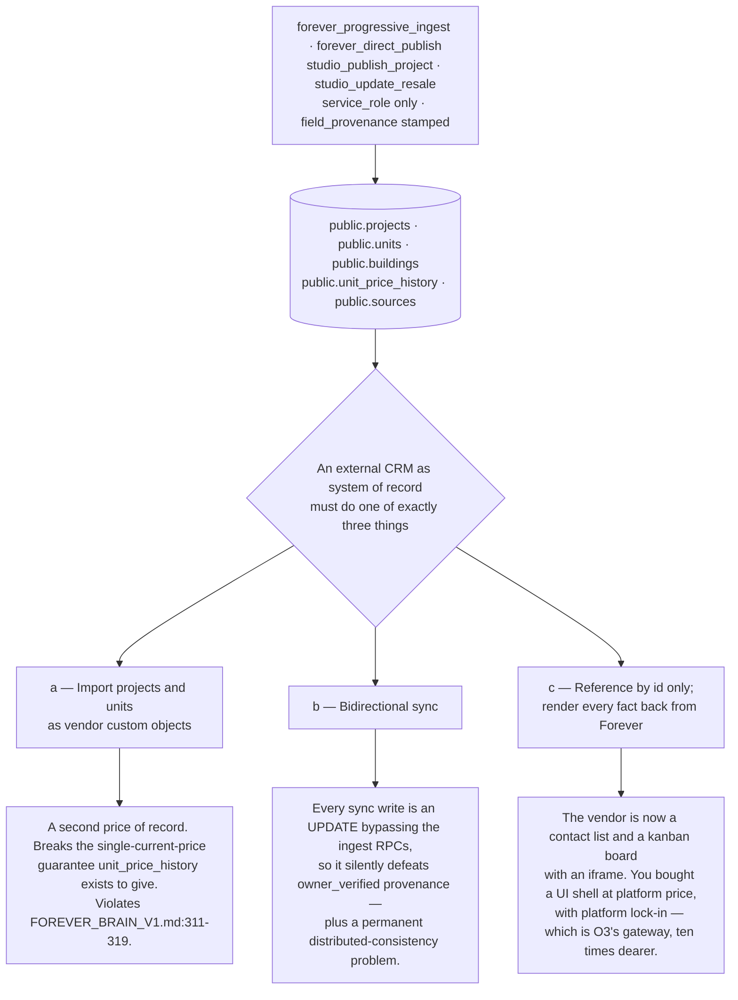
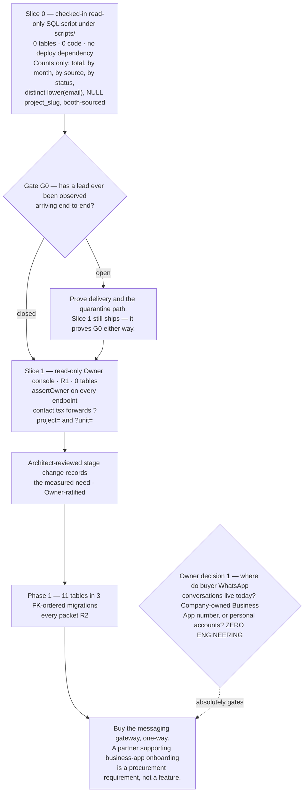

# Forever CRM — Build versus Integrate Decision

Task ID: FOREVER-CRM-ARCH-001
Status: Proposed architecture — not approved, not scheduled, not authorized for implementation
Repository state of record: main @ 82e2039270168df1043050204988fbd6c009ed0e
Risk class: R0 (documentation only)

> This document is a design record. It asserts no product truth, changes no active stage, and authorizes no implementation. The active stage remains FOREVER-STUDIO-001 (`docs/CURRENT_STAGE.md`), which lists "large CRM integration" as out of scope. Any implementing task is R2 under the shared-contract rule and requires an Architect-reviewed stage change plus Owner approval.

It additionally authorizes no purchase, no contract, no trial signup and no vendor conversation.

## What this document decides

1. **Build the operational core in Supabase. Buy nothing yet. Buy only a messaging gateway, later. Never sync bidirectionally with any external CRM, at any volume, permanently.**
2. **The deciding variable is the write path** — not cost, and not volume. The repository's own deferral reason (`docs/ROADMAP.md:228`, lead volume) is the wrong variable, and replacing it is this record's substantive contribution.
3. **The gateway purchase is gated on the WhatsApp number-ownership question** (`docs/crm/CRM_DECISION_RECORDS.md`, Owner decision 1) — not on a date, not on volume.
4. **Instrumenting lead volume is the precondition of the decision**, and it is Slice 0: a checked-in read-only SQL script, zero tables, zero code, zero deploy dependency.
5. **The "70% of CRM projects fail" statistic is refused** and may not be cited in any Forever document.
6. Eight options are evaluated. O3 is recommended; O8 (external CRM as a reporting mirror) is refused explicitly rather than omitted.

**Scope note.** The ordinal marks in §4.2 are the author's qualitative judgements about *options*. They are not product metrics, are never persisted in any column, and are never rendered to any user. No numeric score, confidence, probability, rank or conversion rate appears in the proposed CRM schema or UI.

**Pricing-freshness warning.** Every vendor figure was captured for this task, dated 2026-07-28. Published pricing changes without notice, and no figure here may be relied on at the moment of decision without re-verification.

## 1. The identity question, resolved for this decision only

[Repository fact] `docs/FOREVER_PRODUCT_SPECIFICATION.md:17` states Forever "is not: … A CRM"; `docs/FOREVER_BLUEPRINT.md` §13 charters one. No document reconciles them.

| Sense of "CRM" | Governing line | Verdict |
|---|---|---|
| A product category Forever sells | `docs/FOREVER_PRODUCT_SPECIFICATION.md:17`, `:22` | Correctly denied. Nothing here proposes it. |
| An internal operational interface over the one engine | `docs/FOREVER_STRATEGIC_NORTH_STAR.md:103` lists "CRM-lite and communication workflows" verbatim inside **One Engine, Many Interfaces** | Already chartered. This decision is entirely about this sense. |

[Inference] The direction this cuts is counter-intuitive. `docs/FOREVER_PRODUCT_SPECIFICATION.md:22` warns against features that make Forever "feel like a generic listing portal, sales brochure, CRM, or conversational assistant without evidence". Moving the buyer relationship into a generic external CRM would put Forever's commercial record inside precisely such a product. **On the identity question, buying is the riskier move.** The full reconciliation is R3 and Owner-ratified; it gates the Phase-1 stage change, not this record (`docs/crm/CRM_DECISION_RECORDS.md`, Owner decision 7).

## 2. The options

| # | Option | Buyer record lives | What is bought |
|---|---|---|---|
| **O1** | Forever-native operational layer, nothing bought | Supabase | nothing |
| **O2** | Large external CRM as system of record | vendor | HubSpot / Salesforce / Zoho / Pipedrive seats |
| **O3** | **Native core + bought messaging gateway, one-way into Supabase** | Supabase | a messenger-first gateway (Kommo is the best surveyed fit) |
| **O4** | Communication providers wired directly into Forever | Supabase | per-message API capacity (Meta Cloud API, Resend) |
| **O5** | Status quo — spreadsheet, personal WhatsApp, Supabase dashboard | advisors' devices | nothing |
| **O6** | Self-hosted open-source CRM | Forever-operated server | hosting |
| **O7** | Vertical off-plan platform as system of record | vendor | Spark / Reapit / Propertybase |
| **O8** | Native record + external CRM as a one-way reporting mirror | Supabase (authoritative) + vendor (copy) | reporting seats |

Foreclosed by ground truth and not re-litigated: a second Decision Engine or project database of any kind (`docs/FOREVER_BRAIN_V1.md:311-319`), and Cloudflare Queues / Durable Objects / KV / R2 / D1 as CRM infrastructure ([Repository fact] `wrangler.jsonc` declares nothing beyond `name` and `triggers.crons`).

O1 and O3 differ only by the gateway. Under the corrected phasing both resolve to the same first year: Slice 0 and Slice 1 add **zero** tables; Phase 1 adds **eleven** in three FK-ordered migrations (`docs/crm/CRM_DOMAIN_MODEL.md`). No automation, policy or routing engine is built under any option.

## 3. The deciding variable

### 3.1 Cost cannot decide

[Web research] The surveyed market spans roughly **$3k–$21k per year at ten seats** for the tiers carrying the automation and API access Forever would need (Kommo Advanced at the floor, Salesforce at the ceiling). [Owner requirement] That whole span is immaterial against a single Phuket transaction commission.

[Inference] The consequence people skip: **any argument reaching for cost has run out of reasons.** "Cheaper to build" and "cheaper to buy" are both true and both irrelevant.

### 3.2 What actually differs: who owns the write path

[Recommendation] **A CRM is defined by what it lets you write, not what it lets you read.**

Every one of the seven things `docs/FOREVER_BRAIN_V1.md:292-300` says the CRM **may own** is a write. Every one of the seven things `:311-319` says it **must not own** is a write. The six things `:302-309` say it **must consume** are reads. The binding contract is, precisely and only, a write-path specification.

[Repository fact] Forever already owns two write paths no vendor sells:

| Asset | On `main` | Why it cannot be bought |
|---|---|---|
| Project / unit / evidence database | `public.projects`, `public.units`, `public.buildings`, `public.unit_price_history`, `public.sources`, `public.listings`; four service-role-only write RPCs (`forever_progressive_ingest`, `forever_direct_publish`, `studio_publish_project`, `studio_update_resale`); a provenance ladder (`ProvenanceStatus`, `PROVENANCE_PRECEDENCE`, `canReplaceField`) where `owner_verified` beats an ingested value | No CRM has field-level evidence provenance. There is nowhere in a vendor schema for `owner_verified` to live, so a vendor write cannot honour it. |
| Structured buyer-intent engine | NAV-001's 28 enum keys (`src/features/navigator/core/questions.ts`), `deriveDecisionProfile`, `evaluateMatch` with its fail-closed no-score discipline | Vendor lead-scoring is the opposite discipline: a number with no approved calculation rule. Adopting it would violate `docs/CURRENT_STAGE.md:221-222`. |

### 3.3 An external system of record has exactly three moves, and no fourth



[Inference] Branch (c) is where a thoughtful buyer lands, and it is not wrong — it is **self-defeating**. Once the vendor holds nothing but contacts and stage labels, the thing you paid for is a UI. The honest version of (c) is *buy a nice UI for a contact list*. That is a defensible small purchase, and it must never be described as adopting a system of record.

### 3.4 The broken write path, and why it is no longer the first move

[Repository fact] `src/lib/lead-service.ts:92` — `const { error } = await supabase.from("leads").insert(payload);` — runs **in the browser under the anon key**. `submitLead` returns `Promise<void>` and performs no `.select()`. Repo-wide, `from("leads")` returns exactly two hits: that insert and a test string literal at `src/lib/lead-demo-mode-bundle-boundary.test.ts:22`. The Worker is bypassed entirely.

Because there is no server-side moment there is no lead-created event to webhook a bought CRM from (which alone blocks O2, O7 and O8 from being wired up at all), no attribution capture, no consent capture against a versioned notice, no dedupe, no rate limit, and the client never learns the lead id.

[Recommendation] Moving `submitLead` behind a `createServerFn` is required under every option except O5 — **but it is not the first move, and this record no longer claims it is.** It changes a shared contract (R2), it collides with Draft PR #118, which is actively withdrawing capture surfaces pending the same delivery gate, and it produces no number and no screen. The corrected first move is §6.1's Slice 0, which produces the number and changes nothing. The write-path repair is Phase 1 work behind the stage change.

## 4. Evaluation

### 4.1 Hard gates, run before any scoring

**G1 Truth boundary** — does it create a second authority for project/unit/price facts? **G2 Runtime** — [Repository fact] no `.github/`, no deploy script, production rollout BLOCKED under Cloudflare verdict E (`docs/CURRENT_STAGE.md:37`). **G3 Legal** — unresolved licence blocker, or a new cross-border controller/processor relationship.

| Option | G1 | G2 | G3 |
|---|---|---|---|
| **O1** | PASS | CONCERN — needs the existing Worker deployed; no *new* runtime | PASS |
| **O2** | **BLOCKED** — §3.3 branch (a) or (b) is unavoidable | PASS | CONCERN — s.28 transfer instrument |
| **O3** | PASS — the gateway writes messages, never project facts | CONCERN — as O1 | CONCERN — gateway is a processor; one instrument |
| **O4** | PASS | CONCERN — as O1 | CONCERN — Meta pushes the opt-in determination onto the business |
| **O5** | PASS (trivially — it models nothing) | PASS | **CONCERN, severe** — no consent register, no suppression register, no erasure mechanism; the 90-day duty is unmeetable against personal devices |
| **O6** | **BLOCKED** — ships its own Person/Company/Opportunity model and needs projects loaded in | **BLOCKED** — a second runtime, database, identity roster and deploy target, on a stack that cannot deploy the first one | **BLOCKED pending counsel** — §5.2 |
| **O7** | **BLOCKED** — a vertical platform's value proposition *is* owning unit inventory; two authorities is the worst version of (a) | PASS | CONCERN |
| **O8** | CONCERN — the mirror is not authoritative, will drift, and will be read | PASS | **CONCERN, severe** — a second PII copy is a second erasure surface inside the 90-day duty |

[Web research] G3's clock: erasure must be real within 90 days **including copies and backups** (PDPC Notification effective 2024-11-11 — https://www.lawplusltd.com/2024/08/rules-on-deletion-destruction-or-anonymization-of-personal-data/). Cross-border hosting runs on s.28 derogations or SCCs; no PDPC adequacy list existed as of late 2025, and EU GDPR SCCs are expressly recognised as an acceptable contract form, so one instrument can serve both regimes — https://www.dlapiperdataprotection.com/index.html?t=transfer&c=TH **Descriptive only, not legal advice; qualified Thai counsel must confirm.**

[Inference] **Every bought option adds a data-protection instrument and a second erasure surface** — a recurring compliance cost, invisible on every vendor pricing page.

### 4.2 The discriminating criteria

5 = strongly favourable · 1 = blocking. **A gate failure overrides any total.** The decision rests on §3, not on arithmetic.

| # | Criterion | O1 | O2 | **O3** | O4 | O5 | O6 | O7 | O8 |
|---|---|:--:|:--:|:--:|:--:|:--:|:--:|:--:|:--:|
| 1 | Fit with One Engine, Many Interfaces | 5 | 1 | **5** | 5 | 2 | 2 | 1 | 3 |
| 2 | Data ownership | 5 | 2 | **4** | 5 | 1 | 4 | 2 | 2 |
| 3 | Project / profile duplication | 5 | 1 | **5** | 5 | 3 | 1 | 1 | 2 |
| 4 | Integration cost (one-time) | 3 | 3 | **2** | 1 | 5 | 2 | 2 | 2 |
| 5 | Vendor lock-in | 5 | 1 | **4** | 4 | 2 | 3 | 1 | 3 |
| 6 | Mobile usability | 2 | 5 | **3** | 3 | 4 | 2 | 4 | 3 |
| 7 | Team adoption | 2 | 3 | **4** | 3 | 4 | 2 | 3 | 3 |
| 8 | Security | 5 | 3 | **4** | 4 | 1 | 2 | 3 | 2 |
| 9 | WhatsApp constraints | 1 | 2 | **5** | 3 | 2 | 1 | 2 | 2 |
| 10 | Current lead volume fit † | 4 | 2 | **4** | 2 | 4 | 1 | 1 | 2 |
| 11 | Future scale | 3 | 5 | **4** | 4 | 1 | 3 | 4 | 3 |
| 12 | Total operating burden | 4 | 2 | **3** | 2 | 2 | 1 | 2 | 2 |
| | **Ordinal total (not evidence)** | **44** | 30 | **47** | 41 | 31 | 24 | 26 | 29 |

† Row 10 is scored against a quantity **nobody has measured** — which is what §6.2 exists to remove.

The marks where honesty hurts. **Row 6, O5 = 4:** WhatsApp on a phone is the most usable mobile CRM in the world, so any desktop-only build loses to it. **Row 5, O5 = 2:** the status quo has no *vendor* lock-in and severe *personnel* lock-in, which is worse, because a vendor can at least be exported from. **Row 7, O2 = 3 not 5:** a bought CRM has day-one polish, but the advisor still leaves it to get a project fact, so it *adds* a context switch — the "costs them time" failure mode of §5.3. **Row 9, O4 = 3 versus O3 = 5:** [Web research] onboarding an existing WhatsApp Business App number **directly** to Cloud API requires deleting the account — existing messaging history is lost and the number can never return to the app — and only a partner supporting business-app onboarding preserves it (https://developers.facebook.com/documentation/business-messaging/whatsapp/solution-providers/migrate-existing-whatsapp-number-to-a-business-account/). **That single documented fact makes O4 strictly worse than O3**, and it is what gates the purchase in §6.3.

### 4.3 Per-option verdicts

| Option | Verdict | The sentence that decides it |
|---|---|---|
| **O1** | Viable, incomplete | O3 minus the gateway — the right resting state until Owner decision 1 is answered. |
| **O2** | Rejected | Cannot be a system of record without duplicating or syncing the project graph; both branches violate `docs/FOREVER_BRAIN_V1.md:311-319`. |
| **O3** | **Recommended** | Keeps every write Forever owns inside Supabase and buys only the WhatsApp platform relationship, in the one direction that creates no sync problem. |
| **O4** | Rejected in favour of O3 | Direct Cloud API onboarding destroys existing Business App history, and Forever builds a template/window layer it can rent. |
| **O5** | Rejected as a destination, acknowledged as the baseline | Wins on adoption because it demands nothing; loses on ownership, security and PDPA exposure, and its lock-in is to individuals. |
| **O6** | Blocked on three independent grounds | §5.2 — the licence question is not even the binding blocker. |
| **O7** | Rejected | [Web research] Reapit's own glossary is Applicant / Vendor / Offer / Conveyancing-with-chains, and "New (Off Plan)" is merely a value in a property AGE attribute (https://foundations-documentation.reapit.cloud/platform-glossary). Off-plan is an adjective there, not a pipeline. Spark's *ideas* are worth copying and already are; Spark as system of record gives Forever a second unit-inventory authority. |
| **O8** | Refused explicitly | It buys reporting a single SQL query produces, and pays with a second copy of buyer PII, a second erasure surface inside the 90-day clock, and a mirror that drifts and is then believed. **Named so it is refused rather than omitted**, because it is the option most likely to be proposed next. |

## 5. Pricing, the open-source path, and adoption

### 5.1 Real pricing, captured 2026-07-28

Where the verified research set contains no URL for a figure, that is stated rather than papered over.

| Vendor | Price point | What the pricing page hides | Verified URL | Disqualifier |
|---|---|---|---|---|
| Salesforce | ~**$21,000/yr** at 10 seats | needs an **administrator function Forever lacks** | https://trailhead.salesforce.com/content/learn/modules/data_security/data_security_records | The sharing stack (OWD → role hierarchy → sharing rules → manual sharing; 5,000 roles; async recalculation). The tell: the vendor ships a troubleshooting guide for its own permission system. |
| HubSpot | **$90–100/seat/mo** for the automation tier | **mandatory one-time $1,500 onboarding fee** | https://knowledge.hubspot.com/records/merge-records | No WhatsApp; a runtime meta-model Forever does not need; and **merge is documented as irreversible** — disqualifying where a wrong merge means one buyer seeing another's budget during a commission dispute. |
| Pipedrive | **Not established in the verified research set** | — | https://support.pipedrive.com/en/article/visibility-groups | Visibility groups (4 levels, up to 150) are actively harmful at ~10 seats. Its flat deal shape is the target silhouette and is already adopted. |
| Follow Up Boss | flat **$499/mo incl. 10 users**; API un-gated; explicit no-lock-in stance | — | https://www.followupboss.com/pricing | **The least-bad buy in the set and still unusable**: US/MLS-centric, no WhatsApp, no unit model. Keep as the benchmark. |
| Lofty | **every published price cell reads "Request Pricing"** | **15–20% ad-management fees** | https://help.lofty.com/hc/en-us/articles/360055177831-Lead-Routing-How-to-set-up-lead-routing-rules | Unpriceable without a sales call, which is itself information. Its ordered first-match-wins routing is worth copying later; its weighted "hunger" formula is not. |
| **Kommo** | ~**$25/user/mo** (Advanced; Base $15, Pro $45) | **no monthly billing; six-month minimum** | https://www.kommo.com/buy/tariff/ | None **as a gateway** — best surveyed fit: messenger-first, official WhatsApp on every tier. The six-month lock is why §6.3 says *later*. |
| Attio | **Not established in the verified research set** | the App SDK **runs the wrong direction** | https://docs.attio.com/docs/objects-and-lists | Your React app embeds *inside* Attio. Its structural ideas are the most valuable in the set and are already adopted. |
| Zoho | **Not established in the verified research set** | — | https://www.zoho.com/crm/developer/docs/api/v8/modules-api.html | Runtime modules meta-model — same objection as HubSpot custom objects. Forever owns its Postgres. |
| Supabase (build) | ~**$0–50/mo** marginal; the project already exists | **engineering time, the entire real cost** | https://supabase.com/pricing | — |
| Resend | free tier **3,000/mo, 100/day**; inbound on every tier | — | https://resend.com/pricing | — [Inference] MX'd inbound capture of portal and partner leads is probably higher ROI than WhatsApp automation, and far cheaper. |
| WhatsApp Cloud API | per-message since **2025-07-01**; service conversations free since **2024-11-01** | template review takes **up to 24 hours**; the 24-hour window | https://developers.facebook.com/docs/whatsapp/pricing | **Cost is not the barrier** — a brokerage that mostly replies pays Meta approximately nothing. The barriers are the window, template latency, and number ownership. |

[Inference] **The three most expensive lines are not prices.** HubSpot's $1,500 onboarding fee reveals a platform needing an administrator Forever does not employ. Kommo's six-month minimum with no monthly billing converts "let's try it" into a commitment not reversible within a quarter. Lofty's "Request Pricing" plus ad-management fees means the product is sold bundled with media buying — a different business relationship. **None of the three appears in the $3k–$21k headline range.**

### 5.2 The open-source middle path — and the licence is not the binding blocker

[Web research] **Twenty CRM is AGPLv3 with additional `/* @license Enterprise */` commercially-licensed files. An automated licence read reporting "MIT" is wrong.** Primary source: https://raw.githubusercontent.com/twentyhq/twenty/main/LICENSE AGPL §13 is network copyleft, targeting precisely the case where software is modified and made available to users over a network. Embedding an AGPL core inside a network-served proprietary product is the scenario the clause was written for, and separately-licensed Enterprise files in the same repository mean a file-by-file review would be needed even to know what is under which licence.

> This is a blocker requiring a counsel opinion before any AGPL code is imported. It is stated as a blocker, not as legal advice.

[Recommendation] Two independent blockers sit **in front of** the licence question:

| Blocker | Why it binds independently |
|---|---|
| Runtime and deploy | [Repository fact] Twenty and its peers need a long-lived Node process, Postgres, a worker and typically Redis. Forever's runtime is a Cloudflare Workers module with no subprocess, no writable filesystem, no queues, no Durable Objects, no KV, no R2, no D1. Self-hosting means a second runtime, database, identity roster and deploy target — on a repository with no `.github/`, no deploy script, and rollout BLOCKED under verdict E. Forever cannot deploy the *first* runtime. |
| The truth boundary | An open-source CRM ships its own Person / Company / Opportunity model and database. To be useful it needs projects loaded into it — §3.3 branch (a) with a self-hosted label. **Owning the box does not fix owning two authorities.** |

[Recommendation] **Import the ideas, not the code** — Attio's typed actors and status-dwell targets, Pipedrive's flat deal silhouette, Salesforce's non-destructive merge pointer, Spark's dates-first reservation spine. That is already what `docs/crm/CRM_DOMAIN_MODEL.md` does, at zero licence risk, and each is cited individually in `docs/crm/CRM_MARKET_RESEARCH_2026.md`. Adopting a table shape from public API documentation is not a licence event.

### 5.3 Adoption: the strongest argument against the recommendation

[Web research] **NAR's 2025 technology survey (n > 1,200)**: CRM is only the **#2 lead source at 23%**, behind social media at 39%, and **CRM does not appear in the most-used-technology list at all**. Agents abandon CRMs that cost them time and return it to management. https://www.nar.realtor/research-and-statistics/research-reports/realtor-technology-survey

Stated at full strength: a bought CRM ships a mature native mobile app, years of interaction polish and an onboarding path on day one. Forever has never shipped an internal operational tool. **If adoption were the only binding constraint, buying would win.** It is not — §3's write-path argument is dispositive — but the gap is real and is logged as R-1.

[Inference] **Building does not fix adoption. Design does.** Six rules follow, each of which *cuts* scope:

| # | Rule | Consequence |
|---|---|---|
| A-1 | **Every screen must return more than it costs.** The advisor gets the evidence they would otherwise assemble by hand — Passport, price history, verification status — *because* they opened the CRM. | The one adoption advantage building has and buying cannot: a bought CRM is forbidden from importing project truth, so it can never be where the answer lives. |
| A-2 | **The advisor-facing surface is the smallest set that answers a buyer, and it is not the table count.** The earlier "the daily surface is six tables" claim is withdrawn as false — the booth capture path alone writes eleven. | Overstating simplicity removes the pressure to cut. Compliance registers, catalogues and merge machinery never appear in an advisor screen. |
| A-3 | **No required field an advisor cannot answer from the conversation.** Kills mandatory scores, probabilities and close dates. | Binding across the package: `expected_value_amount`, `expected_close_on` and `next_action_at` are optional at every stage transition, and an unmet forward predicate is recorded as a coverage item rather than refusing the move. |
| A-4 | **Mobile-first is a precondition, not a phase.** | [Repository fact] `src/routes/booth.tsx` has no `beforeLoad`, no loader and no session check — only `robots: noindex, nofollow` — so gating it precedes any booth surface. |
| A-5 | **No per-agent conversion ratio, ever, in any surface, at any volume.** Wins per advisor as a **count** is permitted; the ratio is not. | Two independent reasons agree. [Web research — Wilson interval: 3 of 20 = 15% with a 95% CI of 5.2%–36.1%; https://www.itl.nist.gov/div898/handbook/prc/section2/prc241.htm] makes the ratio uninterpretable at Forever's volume, and NAR says agents abandon CRMs that convert their time into management reporting. The ban lifts only at ≥30 matured opportunities per agent **and** a comparable lead mix. |
| A-6 | **Ship the read before the write.** Slice 0 and Slice 1 are read-only and demand nothing of any advisor. | The only CRM deliverables with a zero-adoption-risk profile — a second reason they come first. |

### 5.4 Striking the folklore

[Recommendation] **The "70% of CRM projects fail" statistic is refused, and may not be used in any Forever document, packet, review or presentation to justify either building or buying.**

[Web research] Four independently sufficient reasons — https://www.sciencedirect.com/science/article/pii/S2314728817300168 — **(1) no denominator**: the best academic anchor asserts it in an abstract, with no population, sample or sampling frame; **(2) no definition of failure**: over budget, abandoned, or adopted but unloved each yield a different number and none is stated; **(3) it does not converge**: adjacent sources scatter it across 31%–80% over 1998–2005, a factor of 2.6, which is a rhetorical device that has acquired decimal places; **(4) it is silent on the actual question**, saying nothing about whether *building* fares better — [Inference] if anything it cuts the other way, since those implementations were overwhelmingly of *purchased* enterprise CRM.

[Inference] The Forever-native closing argument: this package forbids rendering a rate whose denominator is under 30. **A percentage with no denominator at all cannot clear a bar that a denominator of 29 fails.** Citing it would be a fabricated-evidence failure inside a document whose purpose is to prevent fabricated evidence.

## 6. The recommendation, correctly sequenced

### 6.1 The sequence

[Recommendation] **Option O3.** Supabase remains the **sole system of record** for buyer, enquiry, deal, consent and activity state. The only purchase contemplated is a **messaging gateway**, bought one-way: it writes into `crm_activity` and Forever never syncs back. **Bidirectional sync is refused permanently, not staged** — it is the mechanism by which every §3.3 failure actually arrives.



Slice 0 answers `docs/ROADMAP.md:228`'s trigger outright, with no code, no migration and no dependency on a deployment that is BLOCKED under verdict E. Acceptance criteria and kill triggers are in `docs/crm/CRM_IMPLEMENTATION_PLAN.md`.

### 6.2 The unmeasurable trigger, and why instrumenting it is the precondition

[Repository fact] The repository defers this decision on a trigger nobody can evaluate — including the Owner. `docs/ROADMAP.md:228` ("external CRM — trigger: lead volume exceeds the simple internal workflow") and `docs/FOREVER_STRATEGIC_NORTH_STAR.md:254` ("Avoid a large external CRM until the lead volume and workflow justify it") are both **unevaluable**. `docs/ROADMAP.md:80` ("CRM platform purchase" — not in this phase) and `docs/CURRENT_STAGE.md:224` ("large CRM integration" — out of scope) stand unchanged.

Verified three ways: [Repository fact] `supabase/migrations/20260704132000_create_leads.sql` grants `INSERT` only to `anon, authenticated` (:29) and `ALL` to `service_role` (:30), and creates exactly one policy, `"Anyone can submit a lead"`, `FOR INSERT` (:32) — **no SELECT policy, no SELECT grant**; `from("leads")` returns two hits repo-wide and **no code in `src/` ever reads a lead**; and `docs/CURRENT_STAGE.md:98` records that guest-funnel and response-time metrics "are not yet established".

[Inference] Stated plainly: **until this is instrumented, any claim that volume does or does not justify a purchase is an assertion, not a measurement** — made in the exact place `docs/CURRENT_STAGE.md:228` demands evidence. **Instrumentation is not the first CRM feature. It is the precondition of this decision.**

```
monthly_new_enquiries(m)
  = count of crm_enquiry rows
    WHERE received_at falls in calendar month m
      AND triage_state <> 'rejected_spam'

-- Proxy until crm_enquiry exists (Slice 0 and Slice 1 use this):
  = count of public.leads rows
    WHERE created_at falls in calendar month m
      AND status <> 'spam'
```

| Band | Verdict | Trigger |
|---|---|---|
| < 10/month for 3 consecutive months | The CRM is over-built. Ship a read-only queue view and stop. | T-S1 |
| 10 – 500/month | **The native operational layer is correct; no purchase is warranted.** | — |
| > 500/month for 3 consecutive months | Revisit **automation and gateway tier**. The system of record does not change. | T-B1 |

Slice 1's load-bearing constraints: one `createServerFn` behind `requireSupabaseAuth → requireStudioMember → resolveStudioActor`, then **`assertOwner` — `actor.role === 'owner'`**, because [Repository fact] `studio_members.role CHECK (role IN ('owner','trusted_publisher'))` means every publisher would otherwise pass, and publishing a project has never implied reading a buyer. The service-role client is reached only by dynamic `await import()`. It returns **counts, never rows**, and never a percentage. **No `SELECT` policy and no `SELECT` grant on `public.leads` for `anon` or `authenticated`, under any circumstances.** Every new client-reachable file is appended to the `CLIENT_REACHABLE` allow-list in `src/features/forever-studio/tests/bundle-boundary.test.ts`.

### 6.3 Buy the gateway now, later, or never?

[Recommendation] **Later — and later is gated on a question nobody has answered, not on a date.** The gate is Owner decision 1: **where do the existing buyer WhatsApp conversations live today?** [Repository fact] Zero outbound messaging exists on `main`; `"whatsapp"` appears only as a string literal in an unused TypeScript union.

| If the answer is… | Then buying now… |
|---|---|
| A company-owned WhatsApp Business App number with history | …must go through a **partner supporting business-app onboarding**, or the history is destroyed. Direct Cloud API onboarding deletes the account and the number can never return to the app. The gateway choice is then constrained by that single capability — a procurement requirement, not a feature comparison. |
| Advisors' personal accounts | …**recovers nothing.** Forever has no ownership claim, no copy of the history and no reassignment path when an advisor leaves. A purchase starts a new number and the old conversations stay unrecoverable. The real fix is a commercial and personnel decision, made **before** money is committed. |

[Inference] Layer Kommo's six-month minimum with no monthly billing on top: buying before this is settled risks a half-year commitment for a number that must then be migrated again. This is not caution for its own sake — it is avoiding a specific, priced, irreversible mistake.

**"Never" applies to exactly one thing: bidirectional sync, under any option, at any volume, permanently.**

When the gateway is bought, the integration needs no re-modelling: `crm_activity.external_id` plus its channel-scoped partial unique index gives an idempotent insert target, and `INSERT … ON CONFLICT DO NOTHING` with zero rows meaning "already seen" is mandatory because Meta retries webhooks and states the receiving server should deduplicate — https://developers.facebook.com/docs/graph-api/webhooks/getting-started and https://www.postgresql.org/docs/current/sql-insert.html The single outbound executor `crm_job` is reintroduced at that moment and not before. Per-provider webhook routes only; no wildcard; startup assertion on secrets (`docs/crm/CRM_INTEGRATION_AND_EVENTS.md`).

### 6.4 The asymmetry that decides the order of risk

| Path | Cost of reversing |
|---|---|
| Build native → buy a gateway later | One integration writing one-way into an existing table. **No schema change**, no data migration, no re-modelling. |
| Build native → buy an external CRM later | Export and import. Painful, but the data is complete, typed, owned and in one place. |
| Buy an external CRM as system of record → unwind later | Export in the vendor's shape, re-model, rewrite every integration, and reconstruct what the vendor's schema could not hold — provenance, consent evidence against versioned notices, reversible merge history. **The things a vendor cannot represent are the things that cannot be recovered.** |

Building first is the cheaper mistake in every direction.

## 7. Flip triggers, measurable, in both directions

All measurements are defined against real columns. Before `crm_enquiry` exists, the proxy is `public.leads` read through §6.2's path.

| ID | Direction | Trigger and measurement | Response |
|---|---|---|---|
| T-B1 | buy more | `monthly_new_enquiries` **> 500 for three consecutive calendar months** | Re-run this record. Revisit the gateway's automation tier — **not** the system of record. A sweep engine is reconsidered only at sustained >200 enquiries/month (`docs/crm/CRM_AUTOMATION_CATALOGUE.md`). |
| T-B2 | buy more | `count(crm_activity) WHERE kind='assignment'` per month rising, **or** `count(crm_enquiry) WHERE first_response_at IS NULL` after 24h above an Owner-set threshold | Ordered, first-match-wins routing rules (the Lofty shape, minus the hunger formula). Still not a new system of record. |
| T-B3 | neither | A second pipeline is needed — e.g. resale sellers over `public.listings` — with at least two stages the buyer pipeline lacks | A configuration row. No migration, no data rewrite. **Explicitly not a buy trigger.** |
| T-B4 | **buy** | Forever ceases to be the authority for `public.projects` / `public.units` / `public.unit_price_history` | **The only trigger that genuinely flips the decision.** It is under Forever's control and is not expected to fire. |
| T-B5 | — | Headcount | **Explicitly not a trigger.** |
| T-S1 | build less | `monthly_new_enquiries` **< 10 for three consecutive months** | The CRM is over-built. A shared read-only queue view over `public.leads` and nothing more. Stop. |
| T-S2 | build less | [PROVISIONAL — Draft PR #118] lands and inbound falls; it removes contextual project/unit capture CTAs because delivery has never been proven end-to-end | Re-baseline before building any pipeline UI. |
| T-S3 | build less | **Gate G0 confirmed open** — no lead has ever been observed arriving end-to-end | Slice 1 still ships (it costs nothing and proves G0 either way), but no further phase starts until delivery and the quarantine path exist. |
| T-S4 | build less | After 8 weeks of use, **fewer than half** of non-spam enquiries have any recorded response within 7 days | Failing the NAR test. The response is a **smaller** surface, not more features. |
| T-S5 | **kill** | The Owner does not open the console in any 14-day window | Stop the programme and re-evaluate against buying. |

[Inference] T-S1 and T-B1 define the band in which the recommendation holds: **roughly 10 to 500 new enquiries per month.** Below it the CRM is over-built. Above it, sustained, the *automation* question reopens; the system-of-record question does not.

## 8. Risks

| ID | Risk | Severity | Mitigation |
|---|---|---|---|
| R-1 | **Adoption.** A built CRM starts with no native mobile app and no polish. The strongest argument against the recommendation, and not fully answerable in advance. | High | §5.3 rules A-1 to A-6; T-S4 and T-S5 as measured tripwires. If T-S4 fires twice, re-run this record with adoption promoted from a scored criterion to a hard gate. |
| R-2 | **Forever cannot currently deploy.** [Repository fact] No `.github/`, no deploy script, rollout BLOCKED under verdict E (`docs/CURRENT_STAGE.md:37`). | High | A precondition, not a decision input — it blocks O1, O3, O4 and O6 equally. It is also why Slice 0 is a checked-in SQL script with no deploy dependency, the one variant that certainly works today. |
| R-3 | **Vendor pricing drift.** Every §5.1 figure carries a capture date of 2026-07-28. | Medium | Re-verify at the moment of decision. Treat §5.1 as a comparison structure, not a price list. |
| R-4 | **The cron may not fire in production.** [Repository fact] `wrangler.jsonc` declares `"crons": ["*/5 * * * *"]`, but nothing in the repository deploys the Worker. | Medium | Confirm the deployed `scheduled()` export is live before any design depends on it. Slice 0 and Slice 1 are deliberately cron-free. |
| R-5 | **Gate G0 may be open.** [PROVISIONAL — Draft PR #118] The lead path may never have delivered end-to-end. | High | T-S3. Slice 1 ships regardless because it proves G0 either way. |
| R-6 | **WhatsApp number ownership may already be lost.** | High | Independent of every option here. An Owner and personnel decision, and §6.3 makes it the absolute gate on the purchase. |
| R-7 | **Someone proposes O8 anyway** ("just sync it to HubSpot so I can see a dashboard"). | Medium | §4.3 refuses it on the record. The refusal only holds if downstream documents and reviewers cite it. |
| R-8 | **PDPA exposure begins the moment a CRM works these records**, and is worse under the status quo than under the recommendation. | High | Machinery is specified in `docs/crm/CRM_PRIVACY_CONSENT_RETENTION.md`. The build-versus-buy consequence is only this: **every bought option adds a transfer instrument and a second erasure surface.** Descriptive only, not legal advice; qualified Thai counsel must confirm. |

**What would change this record.** Exactly one thing: **T-B4**. Volume changes the automation answer; adoption failure changes the scope answer; deployment changes the schedule. None of them changes who owns the record. If T-B4 ever fires, §3 collapses and buying becomes correct — and that is the honest statement of what this recommendation rests on.

## Appendix A — Proposed `docs/DECISIONS.md` entry

**PROPOSED TEXT ONLY.** This record does not commit it. Adding it is an Owner decision, in the repository's established `### YYYY-MM-DD — Title` + Decision / Context / Consequence / Review trigger format.

```markdown
### 2026-07-28 — Forever-native CRM core; buy only the messaging gateway; never sync bidirectionally

**Decision.** Supabase remains the sole system of record for buyer, enquiry, deal, consent
and activity state. No external CRM is adopted as a system of record. The only purchase
contemplated is a messaging gateway, bought later and gated on the WhatsApp
number-ownership answer, writing one-way into public.crm_activity. Bidirectional sync with
any external CRM is refused permanently.

**Context.** The surveyed market spans ~$3k-$21k/yr at ten seats, immaterial against a
single Phuket transaction commission, so cost cannot decide. The deciding variable is the
write path: Forever already owns the project/unit/evidence database with field-level
provenance, and the structured NAV-001 buyer-intent engine. An external CRM as system of
record must duplicate them, bidirectionally sync them, or be reduced to a contact list —
and docs/FOREVER_BRAIN_V1.md:311-319 forbids the first two. docs/ROADMAP.md:228 defers
external CRM on a lead-volume trigger that cannot currently be evaluated, because
public.leads has no SELECT policy and no code reads it.

**Consequence.** Instrumenting lead volume is the precondition of this decision and is a
read-only SQL script requiring no table, no migration and no deployment. Direct WhatsApp
Cloud API onboarding of an existing Business App number destroys its history, and Kommo's
six-month minimum with no monthly billing makes a premature gateway purchase irreversible
within a quarter, so the purchase is sequenced behind the number-ownership answer. Every
bought option would add a cross-border transfer instrument and a second erasure surface
inside the 90-day PDPA erasure duty. The "70% of CRM projects fail" statistic is refused
and may not be cited in any Forever document.

**Review trigger.** Re-run when any of: monthly non-spam enquiries exceed 500 for three
consecutive calendar months; monthly non-spam enquiries fall below 10 for three
consecutive calendar months; fewer than half of non-spam enquiries have any recorded
response within 7 days after 8 weeks of use; or Forever ceases to own the project/unit
database.
```

## Appendix B — Citation index

Every URL appears verbatim as supplied in the verified research set. **No URL here was reconstructed, inferred or completed.** Vendor pricing URLs are carried inline in §5.1 and are not repeated; the full competitor survey index is in `docs/crm/CRM_MARKET_RESEARCH_2026.md`.

| Claim | URL |
|---|---|
| **WhatsApp number migration — direct Cloud API onboarding destroys Business App history; only a partner preserves it** | https://developers.facebook.com/documentation/business-messaging/whatsapp/solution-providers/migrate-existing-whatsapp-number-to-a-business-account/ |
| NAR 2025 technology survey — CRM #2 lead source at 23%, absent from most-used-technology | https://www.nar.realtor/research-and-statistics/research-reports/realtor-technology-survey |
| "70% fail" folklore anchor — no denominator, no failure definition | https://www.sciencedirect.com/science/article/pii/S2314728817300168 |
| Twenty CRM licence — AGPLv3 plus `/* @license Enterprise */` files | https://raw.githubusercontent.com/twentyhq/twenty/main/LICENSE |
| WhatsApp 24-hour window and template-review latency | https://developers.facebook.com/docs/whatsapp/cloud-api/guides/send-messages |
| Meta pushes the opt-in determination onto the business | https://whatsappbusiness.com/policy/ |
| Meta webhook retries — the receiving server must deduplicate | https://developers.facebook.com/docs/graph-api/webhooks/getting-started |
| `INSERT … ON CONFLICT DO NOTHING` semantics | https://www.postgresql.org/docs/current/sql-insert.html |
| Reapit platform glossary — "New (Off Plan)" is a property-age value | https://foundations-documentation.reapit.cloud/platform-glossary |
| NIST Wilson interval — the analytics hard constraint | https://www.itl.nist.gov/div898/handbook/prc/section2/prc241.htm |
| PDPC deletion/anonymisation notification effective 2024-11-11 — 90-day erasure incl. copies | https://www.lawplusltd.com/2024/08/rules-on-deletion-destruction-or-anonymization-of-personal-data/ |
| Cross-border transfer — s.28 derogations / SCCs; no PDPC adequacy list as of late 2025 | https://www.dlapiperdataprotection.com/index.html?t=transfer&c=TH |

## Appendix C — Repository files read

`docs/ROADMAP.md` (`:80`, `:228`) · `docs/FOREVER_STRATEGIC_NORTH_STAR.md` (`:92-104`, `:254`) · `docs/CURRENT_STAGE.md` (`:37`, `:98`, `:221-228`) · `docs/FOREVER_BRAIN_V1.md` §7 (`:288-328`) · `docs/FOREVER_PRODUCT_SPECIFICATION.md` (`:13-22`) · `docs/FOREVER_BLUEPRINT.md` §13 · `wrangler.jsonc` · `package.json` (no deploy, no typecheck, no type generation) · `src/lib/lead-service.ts:92` · `src/lib/lead-demo-mode-bundle-boundary.test.ts:22` · `src/routes/booth.tsx` · `supabase/migrations/20260704132000_create_leads.sql` (`:29-32`) · repository-wide grep for `from("leads")` (two hits) · absence of `.github/`.
