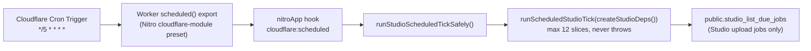
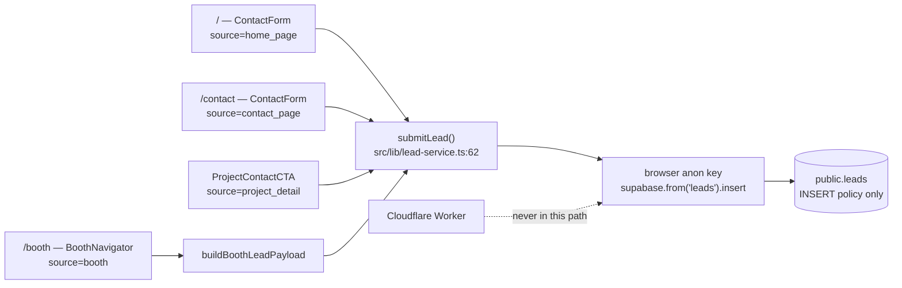
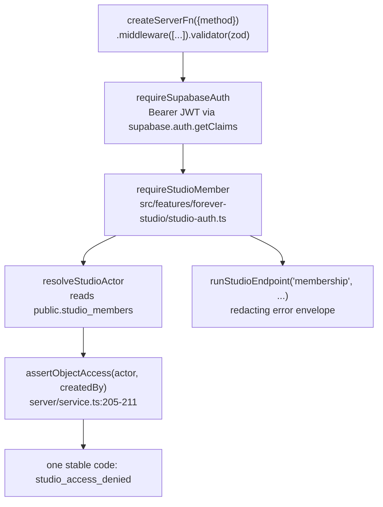

# Forever CRM — Current-State Repository Audit

Task ID: FOREVER-CRM-ARCH-001
Status: Proposed architecture — not approved, not scheduled, not authorized for implementation
Repository state of record: main @ 821b3c4e2f6f82e0d4ddce86199a8ff24b44a094
Risk class: R0 (documentation only)

> This document is a design record. It asserts no product truth, changes no active stage, and authorizes no implementation. The active stage remains FOREVER-STUDIO-001 (`docs/CURRENT_STAGE.md`), which lists "large CRM integration" as out of scope. Any implementing task is R2 under the shared-contract rule and requires an Architect-reviewed stage change plus Owner approval.

## What this document decides

1. **The evidence base is fixed at main @ 821b3c4e.** Every claim below was re-verified by direct file read in a real worktree; nothing is inherited on trust from a prior audit. Where an earlier audit disagreed, the verified number wins and the disagreement is recorded.
2. **The entire customer-side data model on main is one table, `public.leads`, with twelve columns, five CHECK constraints, one INSERT policy, no SELECT path, and four non-unique indexes.** No CRM table exists.
3. **The lead write path is a browser-direct anonymous INSERT that bypasses the Worker entirely** and discards first/last name, project and unit context. There is no server-side seam at which a lead-created event could fire.
4. **The central structural defect is `src/features/navigator/core/lead.ts`**: it flattens the structured NAV-001 decision profile into `leads.message` free text. The one high-value structured intent Forever collects is destroyed at the moment of capture.
5. **`/booth` has no access control of any kind.** It carries `robots: noindex, nofollow` and nothing else.
6. **The repository has exactly two RLS postures and no user-scoped predicates.** Zero `auth.uid()`, zero `auth.jwt()`, zero `FORCE ROW LEVEL SECURITY`, zero column-level `GRANT UPDATE` across all 24 migrations.
7. **The reuse map** (§12) classifies every relevant artefact as reuse-as-is / extend / migrate / deprecate / do-not-build, with a reason. It is the input to `docs/crm/CRM_DOMAIN_MODEL.md` and `docs/crm/CRM_IMPLEMENTATION_PLAN.md`.
8. **Open Draft PRs are provisional evidence only** and are quarantined in §11. Nothing in them is on main.

## 0. Verification method and label convention

Claims carry one label. `[Repository fact]` means verified by direct read of a file in this worktree at the commit above. `[Web research]` claims carry their source URL. `[Inference]`, `[Recommendation]`, `[Unverified assumption]` and `[Owner requirement]` are used where the evidence does not reach.

`[Repository fact]` Corrections to prior audits made during this pass:

| Claim in a prior audit | Verified value |
|---|---|
| `public.leads` has 13 columns | **12** |
| `src/integrations/supabase/types.ts` covers 18 tables | **17** |
| `docs/DECISIONS.md` holds 17 entries | **22** (newest `### 2026-07-23`) |
| `SET search_path = ''` occurs 39 times in migrations | **40 raw text occurrences, 39 in function definitions** — one is inside a comment at `20260724090000_studio_large_archive_v1.sql:92` |
| `FORCE ROW LEVEL SECURITY` is forbidden by a repo-wide pinned test | **False.** `src/import/migration-security.test.ts:15` scopes `MIGRATION_FILE` to `20260715120000_rc55d_import_execution_boundary.sql`; the `:816` assertion tests that one file's text only |

Repository totals: 24 migrations; 37 distinct `CREATE TABLE ... public.<name>` names; 25 `CREATE TRIGGER`; zero `CREATE VIEW` and zero materialized views; 378 test files under `src/`.

## 1. Runtime, deployment and the one background seam

`[Repository fact]` Forever is a TanStack Start application (React 19, `@tanstack/react-router` 1.170, Vite 8) built by Nitro into a Cloudflare Workers module. `src/server.ts` exports `{ fetch(request, env, ctx) }`.

### 1.1 The scheduled seam

`wrangler.jsonc` declares exactly two keys — `name: "forever"` and `triggers.crons: ["*/5 * * * *"]` — and its own header states, verbatim, "DEPLOY CONFIGURATION ONLY — nothing in this repository deploys it."

`vite.config.ts` registers `./src/features/forever-studio/server/scheduled.plugin.ts` as a Nitro plugin, server build only. That plugin hooks `"cloudflare:scheduled"` (`STUDIO_SCHEDULED_HOOK`) and dynamically imports `./scheduled-runner.server` to await `runStudioScheduledTickSafely()`. The tick runs under `SUPABASE_SERVICE_ROLE_KEY`, with no HTTP endpoint, no user token and no browser session; it is bounded by `SCHEDULED_TICK_MAX_SLICES = 12` (`src/features/forever-studio/server/service.ts:553`) and never throws.



There is **one** consumer, hard-wired to Studio upload jobs. There is no generic dispatcher and no second registered consumer.

### 1.2 What is not declared and does not exist

| Absent | Evidence |
|---|---|
| Cloudflare Queues, Durable Objects, KV, R2, D1, `vars` | `wrangler.jsonc` declares no bindings beyond `name` and `triggers` |
| Any deploy automation | no `.github/` directory; no `deploy` or `wrangler` script in `package.json` |
| SMTP or any outbound messaging | Workers has no SMTP; no provider client, no credential in `.env.example`, no notification path in `src/` |
| Subprocess, writable filesystem, long CPU work | Workers runtime constraint; PDF/office generation and headless browsers cannot run in-Worker |
| A `typecheck` script | none in `package.json`; the de facto command is `npx tsc --noEmit` |

`[Repository fact]` `docs/CURRENT_STAGE.md` records production rollout as BLOCKED under Cloudflare verdict E, with the deployed revision and all four required environment scopes unverified. **It therefore cannot be asserted that the cron fires in production today.** The code path is complete, correct and tested; whether it executes is a deploy gate, not an engineering gap.

`[Inference]` Every consequence for CRM design follows from that one fact: any CRM capability whose value depends on scheduled execution, outbound send, or a live Worker is gated behind a deployment nobody in the repository has demonstrated.

## 2. The complete customer-side data model

`[Repository fact]` `supabase/migrations/20260704132000_create_leads.sql`, 46 lines, is the whole of it. Latest migration on main is `20260726140000_public_unit_price_projection.sql`.

### 2.1 `public.leads` — all twelve columns, verbatim

| # | Column | Type | Constraint as written |
|---|---|---|---|
| 1 | `id` | `UUID` | `PRIMARY KEY DEFAULT gen_random_uuid()` |
| 2 | `created_at` | `TIMESTAMPTZ` | `NOT NULL DEFAULT now()` |
| 3 | `name` | `TEXT` | `NOT NULL` |
| 4 | `email` | `TEXT` | `NOT NULL` |
| 5 | `phone` | `TEXT` | `NOT NULL` |
| 6 | `country` | `TEXT` | nullable |
| 7 | `budget` | `TEXT` | nullable |
| 8 | `interest` | `TEXT` | nullable |
| 9 | `project_slug` | `TEXT` | `REFERENCES public.projects(slug) ON UPDATE CASCADE ON DELETE SET NULL` |
| 10 | `message` | `TEXT` | nullable |
| 11 | `status` | `TEXT` | `NOT NULL DEFAULT 'new'` |
| 12 | `source` | `TEXT` | `NOT NULL DEFAULT 'contact_form'` |

### 2.2 The five CHECK constraints

| Name | Predicate |
|---|---|
| `leads_name_not_empty` | `length(btrim(name)) > 0` |
| `leads_email_format` | `email ~* '^[A-Z0-9._%+\-]+@[A-Z0-9.\-]+\.[A-Z]{2,}$'` |
| `leads_phone_not_empty` | `length(btrim(phone)) > 0` |
| `leads_phone_format` | `phone ~ '^\+?[0-9][0-9 ()\-]{6,24}[0-9]$'` |
| `leads_status_valid` | `status IN ('new', 'contacted', 'qualified', 'closed', 'spam')` |

### 2.3 Grants, policy, indexes

```sql
ALTER TABLE public.leads ENABLE ROW LEVEL SECURITY;

GRANT INSERT ON public.leads TO anon, authenticated;
GRANT ALL    ON public.leads TO service_role;

CREATE POLICY "Anyone can submit a lead"
  ON public.leads FOR INSERT TO anon, authenticated
  WITH CHECK (
    status = 'new'
    AND length(btrim(name)) > 0
    AND length(btrim(email)) > 0
    AND length(btrim(phone)) > 0
  );
```

Four indexes, **all non-unique**: `idx_leads_created_at (created_at DESC)`, `idx_leads_status (status)`, `idx_leads_project_slug (project_slug)`, `idx_leads_email (email)`.

The `WITH CHECK` pinning `status = 'new'` is the load-bearing control: the public cannot inject a downstream pipeline state.

### 2.4 What does not exist on `public.leads`

| Absent | Consequence |
|---|---|
| Any SELECT / UPDATE / DELETE policy, and any SELECT grant to `anon` or `authenticated` | **Only `service_role` can ever read a lead.** No code in `src/` reads the table |
| `updated_at` and `trg_leads_updated_at` | the table is the only mutable-in-principle table in the repository with no `set_updated_at` trigger |
| Any audit trigger | a status change leaves no record |
| Owner / assignee / advisor column | no assignment, no queue, no workload |
| Any consent, notice or lawful-basis column | see §7.5 |
| Any dedupe or idempotency key | a resubmitted form produces a second row with no relation to the first |
| First/last name separation | see §3.2 |
| Unit reference | `project_slug` is the finest granularity available |
| An explicit `REVOKE ... FROM PUBLIC, anon, authenticated` | the table deliberately uses the anonymous-write posture, not the internal posture (§7.1) |

`[Repository fact]` This is why `docs/ROADMAP.md:228`'s own build-vs-buy trigger — "lead volume exceeds the simple internal workflow" — and `docs/FOREVER_STRATEGIC_NORTH_STAR.md:254` are unmeasurable from the product: lead volume is observable only by opening the Supabase dashboard as `service_role`.

## 3. The write path

### 3.1 Transport

`[Repository fact]` `src/lib/lead-service.ts` declares `submitLead` at line 62 and performs the insert at line 92:

```ts
const { error } = await supabase.from("leads").insert(payload);
```

Repo-wide, `from("leads")` returns exactly two hits: that line and a string literal in `src/lib/lead-demo-mode-bundle-boundary.test.ts:22`, which pins the call shape verbatim and asserts exactly one call site.

Properties of this transport:

- It runs **in the browser** under the anon key. The Cloudflare Worker is not involved.
- The return type is `Promise<void>`. There is **no `.select()`**, so the client never learns the lead id, and no acknowledgement can reference the record.
- Lines 83-90 short-circuit before any network access when `import.meta.env.DEV` and either `VITE_PARTNER_DEMO === "true"` or `VITE_DEMO_LEAD_MODE === "true"`.
- There is consequently **no server-side moment at which a lead-created automation, enrichment, dedupe, rate-limit, spam check, attribution or consent capture could occur.**



### 3.2 The name concatenation

`[Repository fact]` `lead-service.ts:70-81` builds the payload. Line 71 is the defect:

```ts
name: `${firstName} ${lastName}`.trim(),
```

`LeadFormValues` collects `firstName` and `lastName` as separate required fields, `validateLead` validates them separately, and both the website form and the booth form present them separately. They are then joined with a single space into one `TEXT` column. `[Inference]` The split is unrecoverable for any name containing a space in either part — which is the common case for Russian patronymics, Thai names and compound surnames — so a CRM cannot reconstruct given/family name from historic rows without human review.

Line 72 lowercases the email (`clean(values.email).toLowerCase()`), which is the only canonicalisation performed anywhere on the intake path. No phone canonicalisation occurs; `country` is free text.

### 3.3 Every caller and its `source` value

| Caller | File | `source` | `projectSlug` | Notes |
|---|---|---|---|---|
| Home page form | `src/routes/index.tsx:245` | `home_page` | not passed | `<ContactForm source="home_page" />` |
| Contact page form | `src/routes/contact.tsx` | `contact_page` | **not passed** | `<ContactForm source="contact_page" />` — see §3.4 |
| Project detail CTA | `src/features/project-detail/components/ProjectContactCTA.tsx:18-22` | `project_detail` | `project.core.slug` | also passes `defaultInterest={project.core.name}` |
| Booth tablet | `src/features/navigator/booth/BoothNavigator.tsx:137` | `booth` (`BOOTH_LEAD_SOURCE`) | `project.slug` | payload built by `buildBoothLeadPayload` |

`ContactForm`'s prop type is exactly `{ defaultInterest?: string; projectSlug?: string; source?: string }` with `source` defaulting to `"contact_form"`. **There is no `unit` prop.** The `country` field is a free-text `<Input id="country" name="country" autoComplete="country-name">` with no ISO-3166 selector, which is also why no E.164 default parse region can be derived from an existing lead.

### 3.4 `/contact?project=&unit=` — rendered, never forwarded

`[Repository fact]` `src/routes/contact.tsx` declares `type ContactSearch = { project?: string; unit?: string }` and a `validateSearch` that trims each to 120 characters. `ContactPage` then reads both and renders them as a pill:

```tsx
const { project, unit } = Route.useSearch();
const context = [project, unit ? `unit ${unit}` : null].filter(Boolean).join(" · ");
```

and immediately below renders `<ContactForm source="contact_page" />` with **neither value passed**. The guest sees "Enquiry about Modeva · unit A-1204"; the row written to `public.leads` has `project_slug = NULL` and no unit reference at all.

`[Inference]` This is the single highest-value-per-line defect on the intake path: it is a props change, it requires no schema, and it is the only element that restores commercial context on a real guest enquiry. `[Recommendation]` It is carried in the Slice 1 scope in `docs/crm/CRM_IMPLEMENTATION_PLAN.md` for exactly that reason. Forwarding `unit` additionally requires a decision, because `ContactForm` has no field to receive it and `public.leads` has no column to hold it.

## 4. Navigator and DecisionProfile — the central defect

### 4.1 The NAV-001 vocabulary

`[Repository fact]` `src/features/navigator/core/questions.ts` is the single source of truth for both shells and states so in its docblock: neither presentation shell "may redefine, reorder, shorten, or reinterpret" the questions. It exports five `as const` option arrays whose union types are derived via `(typeof X)[number]["key"]` — **28 enum keys across five questions**:

| Export | Type | Keys |
|---|---|---|
| `WHY_PHUKET_OPTIONS` | `MotivationKey` | `second_home`, `retirement`, `investment`, `asia_base`, `slower_life`, `family` |
| `SUCCESS_OPTIONS` | `GoalKey` | `financial_security`, `feels_like_home`, `rental_income`, `freedom`, `legacy`, `peace_privacy` |
| `BUDGET_OPTIONS` | `BudgetKey` | `lt_250k`, `250_500k`, `500k_1m`, `1m_2_5m`, `gt_2_5m`, `exploring` |
| `TIMELINE_OPTIONS` | `TimelineKey` | `ready_now`, `3_6m`, `6_12m`, `exploring` |
| `CONCERN_OPTIONS` | `ConcernKey` | `ownership`, `developer_trust`, `rental_returns`, `resale`, `remote_mgmt`, `area_choice` |

`NAVIGATOR_SCREEN_ORDER` is nine screens (`welcome`, `why_phuket`, `success`, `budget_timeline`, `concern`, `forever_story`, `recommendation`, `advisor`, `confirmation`); `COUNTED_QUESTION_SCREENS` is the four question screens, because budget and timeline share screen 03. `MAX_MULTI_SELECT = 3` for the why / success / concern questions.

Note the duplicate key `exploring` across `BudgetKey` and `TimelineKey`. `[Inference]` Any persisted representation must store the key together with its question, never the key alone.

### 4.2 `deriveDecisionProfile`

`[Repository fact]` `src/features/navigator/core/decision-profile.ts` derives a pure, total, deterministic, fully serializable `DecisionProfile` from `NavigatorAnswers`: the five answer fields plus `note`, `isComplete`, `budgetCeiling`, `wantsInvestment`, and two fields hard-coded empty at lines 131-132 with the in-code comment "NAV-001 collects neither of these facts today":

```ts
preferredAreas: [],
preferredPropertyTypes: [],
```

It has no stable session id, no `profileVersion` and no `capturedAt`. `deserializeSession` performs no version check and spreads unknown persisted fields over a fresh base.

### 4.3 THE CENTRAL DEFECT — `src/features/navigator/core/lead.ts`

`[Repository fact]` The file's own docblock states the constraint it was built under: "No new table, migration, or backend: the booth reuses the same validation and the same `leads` insert as the website."

`buildBoothMessageSummary` (lines 58-114) therefore flattens, into one plaintext `leads.message` blob:

- every NAV-001 answer, **as display labels, not keys** (`motivationLabels`, `goalLabels`, `budgetLabel`, `timelineLabel`, `concernLabels`);
- the guest's free-text note;
- the confirmed Forever Story reflection, every facet, and the archetype label;
- the recommendation path and investment profile;
- the selected project name, location and slug;
- every supported match reason label, or the literal `"• No exact match found — shown for discussion"`;
- and, appended under a `Staff note` heading, `contact.staffNote` — **an internal field, in the same column, with no visibility boundary.**

`buildBoothLeadPayload` then maps `budget` to `budgetLabel(answers.budget)` (the display label, not the key), and `interest` to `` `${project.name} · ${purchasePurpose(answers)}` ``.

Consequences, all `[Inference]` from the above:

| Property destroyed | Why it matters to a CRM |
|---|---|
| Structure | the profile is unqueryable — "show me every guest whose concern is `ownership`" is a full-text scan over prose |
| Keys | labels are stored, so a relabel in `questions.ts` silently splits historic cohorts |
| Versioning | no `schema_version`, so a retired option makes a historic row uninterpretable |
| Internal/client boundary | `staffNote` sits in the same `TEXT` column as guest-visible content, readable by anything that reads the lead |
| Erasability | personal data is embedded in prose, so column-level erasure cannot reach it |

`[Recommendation]` The deterministic summary is genuinely valuable as a human-readable mirror and should be kept. The structured profile must be persisted alongside it, keyed, versioned and timestamped. That work is Phase 2 in `docs/crm/CRM_IMPLEMENTATION_PLAN.md`, behind a stage change; it is not Slice 1.

### 4.4 The currency mismatch and the three unreachable match reasons

`[Repository fact]` `MatchReasonKind` is a closed union of exactly four values (`matching.ts:27`):

```ts
export type MatchReasonKind = "budget" | "purpose_evidence" | "location" | "property_format";
```

| Kind | Predicate | Reachable on main? |
|---|---|---|
| `budget` | `profile.budgetCeiling.currency === PROJECT_PRICE_CURRENCY` **and** `project.startingPriceTHB > 0` and within ceiling | **No.** `NAV001_BUDGET_CURRENCY: CurrencyCode = "USD"` (`decision-profile.ts:48`) is the only value `budgetCeiling.currency` ever takes; `PROJECT_PRICE_CURRENCY: CurrencyCode = "THB"` (`matching.ts:25`); equality is required at `matching.ts:163` |
| `purpose_evidence` | `profile.wantsInvestment` and a quantified positive rental yield on the project | **Yes** — the only reachable kind |
| `location` | `profile.preferredAreas.length > 0` | **No.** hard-coded `[]` at `decision-profile.ts:131` |
| `property_format` | `profile.preferredPropertyTypes.length > 0` | **No.** hard-coded `[]` at `decision-profile.ts:132` |

`[Repository fact]` The behaviour is deliberate and documented in the source: no exchange rate is invented, and an incomparable currency yields "missing comparable currency data, never a negative match". `evaluateCatalogue` preserves catalogue order exactly and never re-ranks by any invented score.

`[Inference]` **Three of four match-reason kinds are structurally unreachable.** The fail-closed discipline and the no-score rule are correct and must be preserved. What the CRM adds is captured facts — a canonical currency-normalized ceiling and, later, area and property-type preferences — which light the evaluator up without rewriting it. `[Recommendation]` No numeric score, confidence, probability, rank or conversion rate may be introduced, persisted or rendered at any point; `docs/CURRENT_STAGE.md:221-222` lists "a new Decision Engine" and "new scoring systems" as out of scope, and no approved evidence-backed calculation rule exists in the repository.

## 5. Booth

`[Repository fact]` `src/routes/booth.tsx` is 37 lines. Its docblock calls Booth Mode "the Forever employee tablet workflow", "Intentionally NOT added to public navigation yet", and `noindex` "so it stays out of search while it is staff-only".

The route declares `head` (title, `robots: noindex, nofollow`, description, Google Fonts preconnect and stylesheet) and `component: BoothRoute`, which renders `<BoothNavigator />`.

**There is no `beforeLoad`, no `loader`, no session check and no membership check.** `src/routes/studio.tsx` demonstrates that the repository already has a route-gate pattern this route does not use.

`[Repository fact]` What the booth produces on main:
- `BoothNavigator.handleLeadSubmit` (line 137) calls `submitLead(buildBoothLeadPayload({...}))` with `source: "booth"`, `projectSlug: project.slug`.
- Session state persists to `sessionStorage` under `forever.booth.session.v1`; `deserializeSession` accepts any structurally plausible payload with no version check, no staleness check and no outcome gate, and `useBoothSession` rehydrates unconditionally.
- `booth_sessions`, `booth_guides`, `booth_funnel_events` and `can_access_booth` **do not exist** — grep across `supabase/` and `src/` returns nothing. They appear only in Draft PR #102 (§11).

`[Inference]` Booth is simultaneously the highest-value CRM input on main — it is the only surface producing rich structured intent — and the weakest access boundary. Any CRM data reachable from this shell inherits its absent access control. On a shared unauthenticated walk-in tablet, unconditional session rehydration is a guest-data-leak path. `[Recommendation]` Gating `/booth` is a prerequisite to any CRM data reaching it, not a nicety.

## 6. Advisory and Passport

### 6.1 Two exported types named `ForeverPassport`

`[Repository fact]` The repository exports two distinct types with the identical name:

| | `src/features/advisory/forever-passport.ts:248` | `src/features/passport/passport-types.ts:77` |
|---|---|---|
| Declaration | `export interface ForeverPassport` | `export type ForeverPassport = {` |
| Shape | `identity`, `trust`, `investment`, `rental`, `location`, `dataCompleteness`, `combinedGaps`, `overallVerdict`, `evidenceCoverage`, `metadata` | `foreverId`, `projectName`, `projectSlug`, **`overallScore: number`**, `verdict`, `trust`/`investment`/`rental`/`liquidity`/`construction` as `PassportScore`, sections, timeline, … |
| Numeric scores | none | `overallScore` plus five `PassportScore` values |
| Serializer | none | `serializeForeverPassport`, `serializeForeverPassportToJson` (`passport-serializer.ts:12,26`) |
| Render targets | — | includes the literal `"crm"` (`passport-types.ts:11`, `passport-mapper.ts:27`) |
| Shipped to users | no | **yes** — `ForeverPassportCard` is rendered at `src/features/project-detail/components/ProjectDetailEngine.tsx:71` |

`[Inference]` **The scored passport is the one shipped**, and it is the only one with a serializer and a declared `"crm"` render target — making it the path of least resistance for a CRM export and the wrong choice. Taking it imports `overallScore` and five 0-100 scores and bypasses every anti-fabrication guarantee the Advisory stack exists to enforce.

### 6.2 The advisory derivations

`[Repository fact]` `deriveInvestmentIntelligence`, `deriveRentalIntelligence`, `deriveLocationIntelligence`, `deriveForeverPassport`, `deriveProjectSummary` and `deriveAdvisorReport` are pure, deterministic, `ProjectDetail`-in / view-model-out, with caller-supplied timestamps and no I/O. `AdvisorReport` is already a flat JSON-serializable object carrying `schemaVersion`, `source`, `projectSlug`, `readinessVerdict` and `consumes[]`, with `generatedAt` as the designed injection point.

`mapProjectToAdvisorySession` hardcodes all seven client fields to null/empty, so the Client Snapshot always renders "Not available". `RecommendedProject.matchScore` and `RecommendedProject.confidence` (`src/features/advisory/types.ts:63-67`) exist with **no producer anywhere**; `investment-intelligence.ts` states no numeric score is produced because no approved, evidence-backed calculation rule exists in the repository.

`buildForeverStory` returns the hard-coded literal `"The Considered Retreat-Seeker"` at both line 58 and line 101.

`[Repository fact]` `/advisory` and `/advisory_/report` are FOREVER-TRUTH-001A noindex placeholders; `src/lib/advisory-public-boundary.test.ts` asserts those route files contain no `@/features/advisory` import, no `loader:`, no `supabase` and no ranking language.

## 7. The RLS, auth and service-role idiom, in full

### 7.1 Exactly two postures, and no third

`[Repository fact]`

**Posture A — PUBLIC.** `GRANT SELECT ... TO anon, authenticated` + `GRANT ALL ... TO service_role` + `ENABLE ROW LEVEL SECURITY` + exactly one permissive SELECT policy whose predicate is `true`, `is_active = true AND public_status = 'published'`, or an `EXISTS` join to that published parent.

**Posture B — INTERNAL (the "audit_log pattern").** `ENABLE ROW LEVEL SECURITY` with **zero policies** + `REVOKE ALL ON TABLE ... FROM PUBLIC, anon, authenticated` + `GRANT ALL ... TO service_role`. Applied verbatim to `studio_members`, `studio_upload_jobs`, `studio_listing_contacts`, `studio_object_owners`, `ingestion_warnings`, `ingestion_batches`, `studio_archives`, `audit_log`.

`public.leads` uses a third, narrower variant that is specific to anonymous write: INSERT-only grant plus a `WITH CHECK` pinning the initial state, with no SELECT policy and no REVOKE.

### 7.2 The explicit REVOKE is mandatory

`[Repository fact]` `supabase/migrations/20260721123000_studio_internal_acl_hardening.sql` exists solely because Supabase platform defaults leak `anon`/`authenticated` grants onto new public-schema tables. Omitting the REVOKE on a new internal table is therefore not a stylistic lapse; it silently publishes the table to PostgREST.

### 7.3 Zero user-scoped predicates

`[Repository fact]` Across all 24 migrations there is **not one occurrence** of `auth.uid()`, `auth.jwt()`, `auth.role()` or `request.jwt`. The token `auth.` appears exactly seven times, every one of them an `auth.users` foreign-key target. There is **no `FORCE ROW LEVEL SECURITY`** anywhere. There is **no `GRANT UPDATE (`** anywhere — column-level privilege exists only in the SELECT direction (`REVOKE SELECT ON TABLE ... FROM anon, authenticated; GRANT SELECT (<columns>) ...`), in two files, one of which (`20260723130000_public_projection_privacy.sql`) declares itself intentionally unapplied.

`[Inference]` Internal-table RLS in this repository defends against PostgREST, not against an application bug. Introducing `auth.uid()` RLS would create a second, parallel authorization model contradicting the one the codebase enforces and tests — a separately justified architectural decision, never a CRM implementation detail. `[Recommendation]` The CRM introduces none of the four: no `auth.uid()`/`auth.jwt()` RLS, no `FORCE ROW LEVEL SECURITY`, no second identity roster, no second service-role key path, and no column-level `GRANT UPDATE`.

### 7.4 Function idiom

`[Repository fact]` Every function is plpgsql (or `LANGUAGE sql STABLE` for reads), declares `SET search_path = ''` (39 function definitions; the single `SET search_path = public` is the legacy `public.set_updated_at()` helper at `20260704055333...:6`), references everything schema-qualified, uses no dynamic SQL, and is followed by `REVOKE ALL ON FUNCTION ... FROM PUBLIC / anon / authenticated` + `GRANT EXECUTE ... TO service_role`, applied by a `DO $$ ... FOREACH fn IN ARRAY ARRAY[...] LOOP ... END LOOP; END $$;` block. Only four `SECURITY DEFINER` routines exist repo-wide; `SECURITY INVOKER` is the default. Policies are mutated by DROP-then-CREATE, never `IF NOT EXISTS`, because a policy is a security boundary whose post-migration state must be exact, not merely present (`20260715120000:1457-1465` names the failure mode the older `pg_policies` guard causes).

`[Repository fact]` 25 `CREATE TRIGGER` statements exist in the repository's entire history. Zero occurrences of `num_nonnulls`, `CONSTRAINT TRIGGER`, `DEFERRABLE`, `GENERATED ALWAYS AS`, or `CREATE VIEW`.

### 7.5 Identity and authorization

`[Repository fact]` All per-user authorization is TypeScript at the app-server boundary, executing as `service_role`, which bypasses RLS.



`public.studio_members` (`20260721120000_forever_studio_v1.sql:84-93`) is the **only** authorization source:

```sql
CREATE TABLE IF NOT EXISTS public.studio_members (
  user_id UUID PRIMARY KEY REFERENCES auth.users(id) ON DELETE CASCADE,
  role TEXT NOT NULL CHECK (role IN ('owner', 'trusted_publisher')),
  display_name TEXT,
  email TEXT,
  invited_by UUID REFERENCES auth.users(id) ON DELETE SET NULL,
  is_active BOOLEAN NOT NULL DEFAULT true,
  created_at TIMESTAMPTZ NOT NULL DEFAULT now(),
  updated_at TIMESTAMPTZ NOT NULL DEFAULT now()
);
```

Its `COMMENT` states: server-managed only, no self-registration, no browser writes, and an inactive row denies access without losing attribution history. A partial unique index `studio_members_single_bootstrap_owner` makes a second self-bootstrapped owner structurally impossible.

`[Inference]` The role CHECK is a **publishing** vocabulary. Every `trusted_publisher` passes `requireStudioMember`. A CRM read surface behind that chain alone would let anyone who can publish a project read every buyer's name, email, phone and message. `[Recommendation]` Any first CRM read surface gates on `actor.role === 'owner'` — a two-line check with no schema change — until a CRM-specific capability column exists.

`public.studio_object_owners` (`20260722103000:10-20`) carries per-record scope:

```sql
CREATE TABLE IF NOT EXISTS public.studio_object_owners (
  object_type TEXT NOT NULL CHECK (object_type IN ('project', 'listing')),
  object_id UUID NOT NULL,
  created_by UUID REFERENCES auth.users(id) ON DELETE SET NULL,
  created_at TIMESTAMPTZ NOT NULL DEFAULT now(),
  PRIMARY KEY (object_type, object_id)
);
REVOKE ALL ON TABLE public.studio_object_owners FROM PUBLIC, anon, authenticated;
GRANT ALL  ON TABLE public.studio_object_owners TO service_role;
```

An absent or NULL row is Owner-only — "never granted by omission". Writes are `ON CONFLICT DO NOTHING`, so ownership is immutable and single-valued: it cannot express reassignment or shared visibility.

The doctrine is stated verbatim in `studio-auth.ts`: **"the browser UI is presentation only: hiding a button never grants or denies anything."**

### 7.6 `public.audit_log` — exists, never populated

`[Repository fact]` `20260707100000_fdb001_core_extensions_sources_audit.sql:119-133`:

```sql
CREATE TABLE IF NOT EXISTS public.audit_log (
  id UUID PRIMARY KEY DEFAULT gen_random_uuid(),
  actor_id UUID,
  actor_email TEXT,
  action TEXT NOT NULL,
  table_name TEXT NOT NULL,
  record_id UUID,
  old_values JSONB,
  new_values JSONB,
  metadata JSONB NOT NULL DEFAULT '{}'::jsonb,
  created_at TIMESTAMPTZ NOT NULL DEFAULT now()
);
GRANT ALL ON public.audit_log TO service_role;
ALTER TABLE public.audit_log ENABLE ROW LEVEL SECURITY;
```

Indexed on `(table_name, record_id)`, `actor_id`, and `created_at DESC`. RLS on, no policy. **There is no audit trigger anywhere in the repository**, and `old_values` / `new_values` are never populated by any writer. The only writer is `recordAuditSafely` (`src/features/forever-studio/server/service.ts:712`, called at :395, :475, :495, :1153), which runs post-commit and **swallows every failure**.

`[Inference]` Two gaps follow: (a) the table has no explicit `REVOKE ALL ... FROM PUBLIC, anon, authenticated` in the founding migration, which is the hygiene item `20260721123000` exists to fix class-wide; (b) a post-commit best-effort writer is inadequate as evidence in a commission dispute. `[Recommendation]` Reuse the **table** with `crm_*` action values and populated `old_values`/`new_values`; replace the write mechanism. No second history table.

### 7.7 The service-role boundary

`[Repository fact]` `src/integrations/supabase/client.server.ts` is the single service-role entry point. The directory holds exactly five files: `auth-attacher.ts`, `auth-middleware.ts`, `client.server.ts`, `client.ts`, `types.ts`. `client.server.ts` must be reached by dynamic `await import()` inside `.server()` callbacks or from other `*.server.ts` modules — never by top-level import in a route file or a `*.functions.ts`.

This is enforced statically by `src/features/forever-studio/tests/bundle-boundary.test.ts`, which iterates a `CLIENT_REACHABLE` array (declared at line 19, consumed at :43 and :97) and forbids those modules from importing `client.server`, `./server/*`, `supabaseAdmin` or `SUPABASE_SERVICE_ROLE_KEY`. ESLint additionally bans the `server-only` package in favour of the `*.server.ts` convention.

`src/features/forever-studio/studio.functions.ts` holds 17 `createServerFn` endpoints — zod validation at the edge, auth enforced server-side, dynamic imports keeping service-role code out of the client bundle, and stable machine error codes so raw PostgREST text never reaches the browser.

`[Recommendation]` Every new CRM client-reachable file is appended to `CLIENT_REACHABLE` in the same change.

### 7.8 Migration change rules

`[Repository fact]` Migrations only; never remove tables or columns; never bypass RLS (`docs/CODEX_OPERATING_MANUAL.md:60-68`). Every mutable table gets `CREATE TRIGGER trg_<t>_updated_at BEFORE UPDATE ... EXECUTE FUNCTION public.set_updated_at()`. Filenames are UTC-stamped and applied in filename order.

Three committed migrations declare themselves unapplied — `20260718113000` ("FINAL MIGRATION DRAFT (not applied)"), `20260721120000` ("MIGRATION DRAFT (pending; not applied here)"), `20260723130000` ("intentionally UNAPPLIED"). **Migration text is therefore the design of record, not proof of live database state.** Any CRM proposal must include a read-only pre-apply check.

`[Recommendation]` Every CRM migration filename is numbered **above `20260728160000`**, the highest version claimed by any open Draft PR (§11).

## 8. Generated types

`[Repository fact]` `src/integrations/supabase/types.ts` is 1,072 lines, Lovable-generated, and carries the instruction "Do not edit it directly." It declares exactly **17** tables:

`amenities`, `developer_translations`, `developers`, `investment_data`, `leads`, `locations`, `nearby_places`, `price_updates`, `project_amenities`, `project_media`, `project_seo`, `project_status_history`, `project_tags`, `project_translations`, `projects`, `tags`, `units`.

Both `Views` (line 915) and `Functions` (line 918) are `[_ in never]: never`.

Missing: every table created since 2026-07-07 — `buildings`, `facilities`, `sources`, `audit_log`, `unit_price_history`, `listings`, the `ingestion_*` family and the `studio_*` family. Roughly 20 tables. The file also exposes a `leads.Update` type that no role can use, since no UPDATE grant or policy exists.

`[Repository fact]` **There is no `supabase gen types` script.** `package.json` contains `"test": "vitest run"` and `"studio:pg-test": "node scripts/studio/run-postgres-tests.mjs"`, and no type-generation or typecheck entry. Code works around the staleness with `const anon = supabase as unknown as SupabaseClient` (`src/lib/listing-service.ts:47`, `deps.server.ts`), a documented stopgap.

`[Inference]` Any CRM table must have its `Row`/`Insert`/`Update` blocks hand-added, or the file regenerated, **in the same PR as the migration**, or CRM queries will be untyped or wrongly typed. Building the CRM on the untyped escape hatch forfeits column-level type safety on precisely the newest tables.

## 9. Test and documentation conventions

### 9.1 Tests

`[Repository fact]`

| Convention | Value |
|---|---|
| Runner | `npm run test` = `vitest run`; jsdom; `globals: true`; `setupFiles: ['./vitest.setup.ts']` |
| Discovery | `include: ['src/**/*.{test,spec}.{ts,tsx}']` — a CRM test must live under `src/` and end in `.test.ts(x)` |
| Volume | 378 test files |
| Database | **no test touches a real database.** Supabase is `vi.mock`ed at `@/integrations/supabase/client`, or replaced by injected in-memory fakes behind the `StudioDeps` / `StudioData` interfaces, or asserted as SQL **text** by reading `supabase/migrations/*.sql` |
| Real Postgres | `npm run studio:pg-test` — disposable cluster, applies the full migration chain, runs `studio.postgres.sql` |
| Security migrations | every security-bearing migration has a `*-migration-contract.test.ts` pinning RLS / GRANT / REVOKE / `search_path` text and asserting no credential material |
| CI | **none.** `.github/` does not exist |
| Exclusion | `tsconfig.json` excludes `src/features/advisory/tests/**/*`; that exclusion must not be extended to CRM tests |

`[Inference]` A CRM migration without a contract test would be the first unpinned security migration in Forever's history. Text pinning cannot catch a malformed CHECK or a three-valued-logic bug; anything of that class must be proven on the disposable cluster.

### 9.2 Documentation

`[Repository fact]`

- **There is no ADR numbering scheme.** `ADR-[0-9]` and `ADR [0-9]` return **zero** matches across `docs/`. Introducing one is a new governance convention requiring Architect approval and its own decision entry.
- `docs/DECISIONS.md`: **22** entries, format `### YYYY-MM-DD — Title` with Decision / Context / Consequence / Review trigger, reverse-chronological, newest `### 2026-07-23`. Heading punctuation is mixed in practice (em dash predominates; three 2026-07-20 entries use a plain hyphen).
- `docs/BACKLOG.md` has **no** ID scheme — plain bullets. Its only CRM entry was "CRM lead dashboard." at L24
  as of `821b3c4e`. The commit that introduces this package appends a pointer to `docs/crm/FOREVER_CRM_INDEX.md`
  to that same line, so a reader diffing against `main` will see the extended form rather than the bare one.
- `docs/FOREVER_DOC_INDEX.md` (Task ID FF-004) mandates: "When adding a new durable document, update this index in the same change", and "Prefer updating a canonical document over creating a duplicate". `docs/ARCHITECTURE.md` and `docs/FOREVER_PRODUCT_SPECIFICATION.md` are **not** in its canonical-path table — a pre-existing index defect this document sits next to.
- `README.md` and `docs/FOREVER_CORE_ARCHITECTURE.md` are stored backslash-escaped (`\# Forever`), so their headings do not render. Neither is a status source.
- `AGENTS.md` is 11 lines of Lovable git-history notice and defines no conventions.
- Task IDs are ad hoc across three families (`FF-004`/`FACTORY-001`, `FACTORY-A1-00N`, `FOREVER-STUDIO-001`) with no rule defining them.

`[Recommendation]` This document and its siblings register in `docs/FOREVER_DOC_INDEX.md` with Required-first-read = `Conditional`. **No CRM change edits `docs/CURRENT_STAGE.md`** — L224 lists "large CRM integration" as out of scope and L228 excludes "new architecture-only foundations without a measured current-stage need"; touching it would silently promote out-of-scope work.

### 9.3 Governance

`[Repository fact]` CRM schema, any lead API and `docs/DATA_STANDARD.md` changes are "shared contracts" (`docs/FOREVER_FACTORY_CONSTITUTION.md:303-310`), making any implementing Task Packet **R2** by definition: different author and reviewer, adversarial review, Owner approval before merge. Factory autonomy is A0 — Propose only. Pipeline: branch → Draft PR → self-review → Architect Review → Ready → merge only after approval; never merge your own PR. A documentation-only architecture record is R0 provided it asserts no product truth.

`[Repository fact]` The constitutional conflict is live and unresolved: `docs/FOREVER_PRODUCT_SPECIFICATION.md:17` says Forever "is not: … A CRM" and L306 excludes "Full CRM." from MVP, while `docs/FOREVER_BLUEPRINT.md:250-266` charters a CRM with seven capabilities (Status: Planned) and `docs/FOREVER_CORE_ARCHITECTURE.md` places CRM in the core workflow chain between Advisor Workspace and Client Timeline. `docs/FOREVER_STRATEGIC_NORTH_STAR.md:14` requires conflicting product-priority statements to be resolved before new work starts. `docs/FOREVER_BRAIN_V1.md` §7 is the binding data-truth boundary and must be cited, not restated.

## 10. CRM-shaped code that does not exist

`[Repository fact]` The repository contains substantial CRM-shaped **scaffolding with no backing anywhere**. Mistaking any of it for working infrastructure is the most likely reading error in this codebase.

| Artefact | Verified status |
|---|---|
| `navigator_clients`, `navigator_sessions`, `navigator_decision_profiles`, `navigator_advisor_notes`, `navigator_recommendations` and two siblings | Declared only in `src/features/navigator/domain/entities/database-entities.ts`. `navigator_` matches **one** file in `src/` and **zero** files in `supabase/migrations/`. `identityMapper` mappers are bare casts with no snake_case translation |
| `NavigatorApi` / `NavigatorApiNotImplemented` (`src/features/navigator/api/navigator-api.ts:37`) | All nine methods reject with "Navigator API is not implemented yet." **Nothing imports it** |
| `src/features/navigator/domain/models/*` — `ClientModel`, `DecisionProfileModel`, `AdvisorNoteModel`, `NavigatorSessionModel` — and `domain/schemas/navigator-schemas.ts` | Type-only, zero consumers outside the scaffold, no backing tables. Their vocabularies (`BuyerIntent`, `DecisionReadiness`, `riskTolerance`, `mustHaves`, `dealBreakers`) map onto nothing NAV-001 collects |
| `ClientModel.consentAcceptedAt` | The **only** consent concept in the repository. Maps to no column |
| `src/lib/database-types.ts` (hand-written `Lead`, `LeadStatus`) | **Zero importers repo-wide.** Its `LeadStatus` name-collides with the live UI-state `LeadStatus` in `navigator/core/session.ts:30` |
| `DEMO_SESSION` | Exists only in `docs/ADVISORY_WORKSPACE_RC1_INTEGRATION.md`, not in code |
| `src/features/forever-sync/`, `src/features/forever-connectors/` | Declarative-only by their own docblocks: "RC3.2 ships no cron parser, no scheduler, no timer, and no event subscription"; connectors "never exercise" a capability |
| `src/intake/watch/` Telegram export watcher | A strictly offline, credential-free `result.json` reader; its own test asserts `TELEGRAM_API_ID`/`API_HASH`/`SESSION` are never read. Not a messaging channel |
| `src/features/forever-project-database/`, `src/features/forever-package-factory/` | Ship no database, persistence, Supabase access or route by their own headers |
| `public.price_updates` | `GRANT SELECT ... TO authenticated` with RLS enabled and **no policy**, so the grant can never return a row. No writer in `src/` |

`[Inference]` Building the `navigator_*` graph would encode a domain model nothing produces. Three ideas are worth salvaging as **requirements**, not as this code: `consentAcceptedAt`; `AdvisorNoteModel.visibility: "internal" | "client_visible"`; and `NavigatorSourceReference{sourceType, confidence}` — the last for provenance only, never as a rendered number.

## 11. Provisional evidence — open Draft PRs and issues

> **Everything in this section is PROVISIONAL.** None of it is on `main @ 821b3c4e`. No CRM design may depend on it, and no claim in §1-§10 rests on it. It is recorded because it constrains sequencing.

| Ref | Type | What it does | Why it constrains the CRM |
|---|---|---|---|
| **#102** | Draft PR | Adds `booth_sessions`, `booth_guides`, `booth_funnel_events`, `booth_commit_consent`, `can_access_booth`; makes `public.leads.email` **NULLABLE**; binds `booth_sessions.lead_id` UNIQUE (one lead per session); makes funnel events once-only per session; freezes terminal sessions against any UPDATE including `service_role`; enforces consent as a database CHECK. Its own body says "Draft — do not merge, do not deploy" | Each contract conflicts with a conventional CRM model: a person entity that dedupes a returning buyer across visits, an append-only activity timeline, and an editable closed record each contradict one of them. It also creates a **parallel `/booth-v2` surface and a second lead source**. **Migration filename collision:** it adds `supabase/migrations/20260726120000_booth_v2_server_issued_session.sql` while main already holds `20260726120000_forever_direct_publish.sql` at the identical version — #102 must be rebased and renumbered before either can land |
| **#117** | Draft PR | Adds migration `20260728120000` | Version-floor input. Its header documents a one-directional apply-order hazard: the column-less REVOKE in the intentionally-unapplied `20260723130000_public_projection_privacy.sql` would strip a later column grant if applied afterwards |
| **#118** | Draft PR | Adds `src/features/project-detail/contact-actions.ts`, failing closed on `VITE_PROJECT_CONTACT_ACTIONS=enabled`, and **removes every contextual project/unit lead-capture CTA** | States **gate G0**: the lead submission path has never been proven to deliver end-to-end. It names a PRD §16.3 quarantine path for heuristically-rejected leads as a precondition. A CRM design assuming growing inbound volume conflicts with in-flight work deliberately withdrawing capture surfaces until delivery is proven |
| **#119** | Draft PR | Stacked on #118; adds migration `20260728160000` | **Sets the version floor.** Every CRM migration must be numbered above this |
| **#120** | Draft PR | Stacked on #117 | Sequencing only |
| **#97** | Draft PR | — | Open; no CRM contract |
| **#101** | Issue | — | Open |
| **#103** | Issue | Studio production launch, **P0**. Lists "Developer Check" and "WhatsApp/CRM automation" under Non-goals, with an instruction to pause non-blocking product expansion | Under the WIP limit at `docs/FOREVER_STRATEGIC_NORTH_STAR.md:266-271` (one active guest/product/commercial task), any CRM increment queues behind #103 unless the Owner deliberately reallocates the slot |

**Gate G0 is the most consequential provisional item.** `[Inference]` If G0 is genuinely open — if no lead has ever arrived end-to-end — then proving delivery, plus a quarantine path for rejected leads, precedes any pipeline surface. Conversely, a read-only lead console **proves G0 either way at zero schema cost**, which is why it is sequenced first in `docs/crm/CRM_IMPLEMENTATION_PLAN.md`. One task, two workstreams.

## 12. The reuse map

Every classification below is `[Repository fact]` as to the artefact's current state, and `[Recommendation]` as to the disposition. Table-count and phasing consequences live in `docs/crm/CRM_DOMAIN_MODEL.md` and `docs/crm/CRM_IMPLEMENTATION_PLAN.md`.

### 12.1 Reuse as is

| Artefact | Reason |
|---|---|
| Cloudflare Cron Trigger + Nitro `cloudflare:scheduled` hook | The only scheduled-execution seam. Complete, service-role-credentialed, browser-free, tested. Do not build a second scheduler, an external poller, or `pg_cron`. It currently has one hard-wired consumer; a second is deferred until the deployed Worker's `scheduled()` export is confirmed live |
| `runScheduledStudioTick` + `studio_upload_jobs` + `studio_list_due_jobs` durable-job pattern (claim token, lease heartbeat, stale recovery, bounded slices, per-job failure isolation) | The correct shape for Worker-hosted background work. Copy the **pattern**; do not extend `studio_upload_jobs`, whose columns and authorization are archive-publication specific |
| Internal-table RLS posture (RLS on + zero policies + explicit REVOKE + service_role GRANT) | The mandatory posture for every CRM table holding personal or commercial data. The REVOKE is not optional (§7.2) |
| `public.leads` INSERT-only / no-SELECT-policy posture | Deliberate and documented. CRM reads are added at the `service_role` server boundary. **Never** add a SELECT/UPDATE policy or grant for `anon`/`authenticated` on `leads` |
| `validateLead` / `hasLeadValidationErrors` / `LeadFormValues` | Client regexes are mirrored by DB CHECKs; ContactForm, the booth path and `navigator/core/lead.test.ts` depend on the contract verbatim. Keep it stable |
| `requireSupabaseAuth` → `requireStudioMember` → `resolveStudioActor` → `assertObjectAccess` | Every CRM server function runs behind an equivalent chain. One stable denial code, disclosing nothing |
| `createServerFn(...).middleware(...).validator(zod).handler(...)` + `runStudioEndpoint` redacting envelope | 17 proven endpoints. This is the CRM API template |
| Service-role-only RPC idiom (§7.4) | Every CRM mutation is one such function, atomic and unreachable from the browser |
| BEFORE INSERT/UPDATE/DELETE state-machine guard triggers (`studio_archive_lifecycle_guard`, `studio_archive_entry_guard`) | The only mechanism that survives a service-role application bug — it runs on every write regardless of caller |
| `public.set_updated_at()` + `trg_<table>_updated_at` | Reuse the existing function; do not clone it. Leave its legacy `SET search_path = public` alone |
| Column-level **SELECT** projection idiom | The tool for column privacy if CRM data ever surfaces publicly. Note `20260723130000` is intentionally unapplied |
| DROP-then-CREATE policy normalization | A policy's post-migration state must be exact, not merely present |
| `*-migration-contract.test.ts` + `npm run studio:pg-test` | A CRM migration without a contract test would be the first unpinned security migration in Forever's history |
| `public.studio_listing_contacts` | Two senses, both binding: it is seller/partner PII on a deliberately separate boundary — **do not** join or merge it into the buyer CRM; and it is the proven template for how CRM contact PII must be stored |
| `src/features/navigator/core/questions.ts` — the 28 keys and 9-screen order | The CRM's canonical segmentation vocabulary. Store the **keys**, never the labels |
| `src/lib/public-truth.ts` quarantine (`KNOWN_FICTITIOUS_PROJECT_SLUGS`: `surin-ridge-villas`, `kamala-beach-residences`, `layan-forest-villas`, `bangtao-garden-pool-villas`, `kata-cliff-residences`, `rawai-courtyard-villas`) | Every CRM surface enumerating projects applies `isKnownFictitiousProjectSlug` / `excludeKnownFictitiousProjects` until the production cleanup runs |
| `public.projects` (id UUID PK + slug UNIQUE), `public.units`, `public.buildings`, `public.unit_price_history`, `forever_project_price_projection` | The canonical project graph. A CRM references `projects.id`/`slug` and `units.id`, and **never** copies `base_price_thb`, availability or any project fact into a CRM row |
| Advisory derivations (`deriveInvestmentIntelligence`, `deriveRentalIntelligence`, `deriveLocationIntelligence`, `deriveForeverPassport`, `deriveProjectSummary`, `deriveAdvisorReport`) | Pure, deterministic, no I/O. `AdvisorReport` is already a persistence-ready row shape with `generatedAt` as the injection point |
| `docs/FOREVER_BRAIN_V1.md` §7 CRM Interaction | Cite and link; restating it creates a competing contract, which `docs/FOREVER_DOC_INDEX.md:87` forbids |
| `docs/DECISIONS.md` entry format | Prepend above the 2026-07-23 entry |
| `docs/ROADMAP.md` Phase 2 funnel vocabulary `new → contacted → qualified → viewing → reserved → closed/lost` (L141) | Map the CRM onto the existing phase and vocabulary rather than proposing a parallel one |
| `docs/factory/TASK_PACKET_TEMPLATE.md` + `docs/factory/tasks/<task-id>.md` | Canonical field set and path convention. A packet is a proposal, never authorization |

### 12.2 Extend

| Artefact | What to add, and why |
|---|---|
| `public.leads` | It is the only intake point and four call sites depend on it. Add a server-side **read** path. Any richer stage vocabulary must be a superset of `('new','contacted','qualified','closed','spam')`. **Caveat, and it is decisive:** the anonymous INSERT policy makes any column added to this table publicly writable, so enrichment columns cannot simply be appended. Whether `public.leads` remains a complete journal of every capture is an Owner decision, and the deviation from a naive "extend" reading is argued in `docs/crm/CRM_DECISION_RECORDS.md`, not assumed |
| `public.studio_members` | The CRM identity anchor. The two-value CHECK is a **publishing** vocabulary; a CRM needs either a widened CHECK or an additive per-capability column by migration. **Do not mint a second identity table** |
| `public.studio_object_owners` | Exactly the shape CRM record assignment needs, but writes are `ON CONFLICT DO NOTHING` and single-valued, so it cannot express reassignment or shared visibility. Extend the `object_type` CHECK plus an audited reassignment RPC rather than a parallel ownership table |
| `public.audit_log` | Reuse the **table** with `crm_*` action values and populated `old_values`/`new_values`; replace the write mechanism (§7.6). This is the reason no `crm_record_history` table exists in the proposal |
| `bundle-boundary.test.ts` `CLIENT_REACHABLE` | Append every new CRM client-reachable file in the same change |
| `DecisionProfile` / `deriveDecisionProfile` / `NavigatorSession` / `navigatorReducer` | Pure, total, deterministic, pinned by ~1,725 lines of tests. Add a stable session id, a `profileVersion` and a `capturedAt` **before anything is persisted**; do not restructure the answer fields |
| `evaluateMatch` / `evaluateCatalogue` | Preserve the fail-closed discipline and the no-score rule exactly. Extend the **captured facts** (a currency-comparable ceiling; later area and property type) to light up the three unreachable reason kinds (§4.4) without rewriting the evaluator |
| `ClientSnapshotData` / `AdvisorySession` / `mapProjectToAdvisorySession` | The RC1 seam is stated verbatim: external source → mapper → `AdvisorySession` → `<AdvisoryWorkspace session={…} />`, with persistence at the host layer. A CRM supplies the client; the derivations need no change |
| `docs/FOREVER_BLUEPRINT.md` §13 CRM charter (Status: Planned, seven capabilities) | Extend by reference. Any change from "Planned" is a constitutional edit under the Blueprint's ratification process |
| `docs/FOREVER_PRODUCT_SPECIFICATION.md` §1 "Forever is not: … A CRM" | Must be explicitly reconciled, not sidestepped: an internal operational interface over one engine is not the claim that Forever is a CRM product. R3, Owner-ratified, and it gates the Phase-1 stage change |
| `docs/BACKLOG.md` "CRM lead dashboard." (L24) | The backlog anchor. Add stage-neutral sibling bullets. **BACKLOG has no ID scheme — do not invent one** |
| `docs/DATA_STANDARD.md` §14 "CRM buyer-fit records." | Already anticipates them, and carries the absent-facts rule. Any change to it is R2 |

### 12.3 Migrate

| Artefact | Target state |
|---|---|
| Browser-direct anon INSERT transport (`lead-service.ts:92`) | Move behind a `createServerFn` mirroring `studio.functions.ts`, so a server-side seam exists for attribution, dedupe, rate limiting and consent capture, and so the caller learns the record id. `src/lib/lead-demo-mode-bundle-boundary.test.ts:22,55` pins the current call shape and exactly one call site, so this changes deliberately, with the test. **Not Slice 1** — `submitLead` stays byte-identical there |
| `buildBoothLeadPayload` / `buildBoothMessageSummary` (`navigator/core/lead.ts`) | Keep the deterministic text as a human-readable **mirror**; persist the structured profile alongside it, keyed and versioned, with `staffNote` on the internal side of a visibility boundary (§4.3) |
| Booth `sessionStorage` persistence (`forever.booth.session.v1`) | Adequate as tablet crash-resilience; keep it as a local draft buffer behind a **versioned, expiring, outcome-gated** contract. Today `deserializeSession` accepts any plausible payload and `useBoothSession` rehydrates unconditionally |
| `src/routes/booth.tsx` | Gate it. `src/routes/studio.tsx` shows the pattern. This is a prerequisite to any CRM data being reachable from the booth shell (§5) |
| `src/integrations/supabase/types.ts` | Hand-add CRM `Row`/`Insert`/`Update` blocks, or regenerate, **in the same PR as the migration** (§8) |

### 12.4 Deprecate

| Artefact | Reason |
|---|---|
| `const anon = supabase as unknown as SupabaseClient` escape hatch | A documented stopgap pending type regeneration. Building the CRM on it forfeits column-level type safety on the newest tables |
| `src/lib/database-types.ts` | Zero importers; stale manual mirror; `LeadStatus` name-collides with the live UI-state type |
| `src/features/navigator/domain/models/*` and `domain/schemas/navigator-schemas.ts` | Vocabularies map onto nothing NAV-001 collects; adopting them means fabricating fields (§10) |
| `NavigatorApi` / `NavigatorApiNotImplemented` | Reuse the method **names** as an inventory (`createSession`, `saveAnswers`, `getDecisionProfile`); discard the file |
| The `DO $$ ... IF NOT EXISTS (SELECT 1 FROM pg_policies ...) THEN CREATE POLICY ...` guard | Superseded in-repo by DROP-then-CREATE at `20260715120000:1457-1465`, which names the exact failure mode it causes. Do not copy it despite it appearing in six older files |
| Score-based passport (`src/features/passport/*`, `ForeverPassport` with `overallScore: number`, `ForeverPassportCard` at `ProjectDetailEngine.tsx:71`) | The scored type is the one shipped and the only one with a serializer and a `"crm"` render target — the path of least resistance and the wrong one. Retire it behind the evidence-only passport before any CRM export (§6.1) |
| `public.price_updates` | Grant that can never return a row; superseded; no writer |
| `docs/FOREVER_CORE_ARCHITECTURE.md` and root `README.md` as authority or status sources | Both stored backslash-escaped so headings do not render; README states a stale "Current Milestone: Navigator RC1". Cite CORE_ARCHITECTURE only as historical evidence that CRM sat in the core workflow chain |

### 12.5 Do not build

| Artefact | Reason |
|---|---|
| `navigator_clients` / `navigator_sessions` / `navigator_decision_profiles` / `navigator_advisor_notes` / `navigator_recommendations` | Seven declared names, zero migrations, bare-cast mappers. Building this graph encodes a domain model nothing produces |
| Any `crm_*` table before the stage change | `docs/CURRENT_STAGE.md:224` and `:228`. The first two increments add **zero** tables |
| Any automation, policy, routing or AI engine table | Cut entirely. Coverage sweeps ship as named SQL functions behind the existing server-function boundary; policy numbers ship as TypeScript constants with review triggers in comments |
| `crm_record_history` | Cut permanently in favour of `public.audit_log` with `crm_*` actions — it was churn **and** the holder of un-erasable JSONB copies of every buyer's name |
| `crm_ropa_v1` and a blanket per-column comment census | The ROPA is a markdown table with a review trigger until counsel confirms the duty applies |
| `auth.uid()` / `auth.jwt()` RLS, `FORCE ROW LEVEL SECURITY`, a second identity roster, a second service-role key path, column-level `GRANT UPDATE` | Zero occurrences of each. Any one is a separately justified architectural decision with its own `DECISIONS.md` entry, never a CRM implementation detail (§7.3) |
| Any numeric score, confidence, probability, rank or conversion rate — persisted or rendered | No approved evidence-backed calculation rule exists; `docs/CURRENT_STAGE.md:221-222` excludes new scoring systems. `[Web research]` The Wilson interval makes rates uninterpretable at this volume: 3 of 20 = 15% with a 95% CI of 5.2%–36.1% — https://www.itl.nist.gov/div898/handbook/prc/section2/prc241.htm . Never render a percentage with a denominator under 30 |
| `RecommendedProject.matchScore` / `.confidence` | Both exist with no producer anywhere. Use evidence-coverage ordering, documented as position not quality |
| An `ADR-N` numbering scheme | Zero occurrences across `docs/` |
| Editing `docs/CURRENT_STAGE.md` | A CRM architecture record does not change the active stage |
| Cloudflare Queues / Durable Objects / KV / R2 / D1 | The existing cron + claim-lease + Postgres job-table pattern delivers durable, idempotent, retryable work without a new Cloudflare product, and keeps state in Supabase where the CRM data lives |
| Outbound messaging of any kind, and any inbound webhook endpoint | Nothing on main sends; Workers has no SMTP; `docs/CURRENT_STAGE.md:212` says alert **design**. A webhook would be the repository's first unauthenticated route on a Worker whose deployment is unverified |
| Bidirectional sync with any external CRM | If a gateway is ever bought it writes one-way into Supabase, which stays sole system of record |
| Call recording and transcription | No table, no column, no action kind. Trigger: an explicit counsel opinion, nothing less |
| An external/purchased CRM platform as the system of record | `docs/ROADMAP.md:80` lists "CRM platform purchase" under "Not in this phase"; `:228` defers external CRM until lead volume justifies it — and that volume metric does not exist, because leads are unreadable |
| Building on Draft PR #102 | Its own body says "Draft — do not merge, do not deploy". Harvest its named contracts as **requirements** (two separate consents with a DB-enforced pre-consent minimisation CHECK; server-issued session identity; attributed acknowledgement; non-enumerable refusals) |
| The `forever_import` / `forever_execution` execution boundary | Built for one narrowly-scoped Owner-approved bulk import; unusable for interactive operations. Borrow only two ideas: a least-privilege DB role where `service_role` is too broad, and a durable receipt table with a UNIQUE constraint preventing double-execution |
| `AGENTS.md` as a source of conventions | 11 lines of Lovable git-history notice. It defines none |

## 13. Compliance posture of the current state

`[Repository fact]` `public.leads` has no consent column. Neither `ContactForm.tsx` nor the booth lead form renders any consent checkbox, privacy notice or marketing opt-in. The only `consentAcceptedAt` in the repository is an optional TypeScript field on the never-persisted `ClientModel`. There is no lawful-basis record, no notice version, no suppression mechanism and no data-subject-request path.

`[Web research — descriptive only, not legal advice; qualified Thai counsel must confirm every point below]` Forever is a Thai-established controller under the PDPA for every buyer record regardless of nationality (s.5); consent is a fallback, not a default, and the 2026 PDPC draft guidance cautions against treating it as a catch-all basis — https://www.lexology.com/library/detail.aspx?g=27642f25-1b92-4c09-b8ff-b4b1c4f27467 . Primary text (unofficial English translation; the Thai text governs): https://cc.kmutt.ac.th/Files/Act%20Eng/personal-data-protection-act-2019-en.pdf . Erasure must be real within 90 days including copies and backups per the PDPC Notification effective 2024-11-11 — https://www.lawplusltd.com/2024/08/rules-on-deletion-destruction-or-anonymization-of-personal-data/ — which makes the Supabase PITR/backup retention window a compliance parameter, not an infrastructure detail. GDPR stacks on only where Forever **targets** the EU; nationality is irrelevant — https://www.edpb.europa.eu/our-work-tools/our-documents/guidelines/guidelines-32018-territorial-scope-gdpr-article-3-version_en .

`[Inference]` The exposure is not created by the CRM; it exists the moment anyone works these records. What the current state lacks is any structural means of proving a lawful basis, honouring an objection, or completing an erasure. The design consequences are carried in `docs/crm/CRM_PRIVACY_CONSENT_RETENTION.md`.

## 14. Consolidated open questions this audit could not close

| # | Question | Why the repository cannot answer it |
|---|---|---|
| 1 | Is the Cloudflare cron firing in production? | The code path is complete and tested, but nothing in the repository deploys the Worker and rollout is BLOCKED under Cloudflare verdict E |
| 2 | Has a real lead ever arrived end-to-end? (**Gate G0**) | No SELECT path exists; Draft PR #118 asserts the gate is open |
| 3 | What is the actual lead volume and response-time distribution? | Observable only in the Supabase dashboard as `service_role` — yet it is the trigger `docs/ROADMAP.md:228` names for the build-vs-buy decision |
| 4 | Where do buyer WhatsApp conversations live today — a company-owned number or advisors' personal accounts? | Zero outbound messaging exists; `whatsapp` appears only as a string literal in an unused union. `[Web research]` Direct Cloud API onboarding of an existing Business App number deletes the account and its history; only a partner supporting business-app onboarding preserves it — https://developers.facebook.com/documentation/business-messaging/whatsapp/solution-providers/migrate-existing-whatsapp-number-to-a-business-account/ |
| 5 | Does Forever deliberately target the EU? | The code carries no targeting signal (no EUR pricing, no hreflang, no third-party tags), but absence of evidence in the code is not evidence of absence in the business |
| 6 | What purpose did each historic `public.leads` form state at collection? | Nothing is recorded. This is a counsel question, and it gates any seeding of CRM tables from historic rows |
| 7 | Must `public.leads` remain a complete journal of every capture? | A business-records question, not an engineering one. It converges with #102's nullable-email decision |
| 8 | Do the pending Studio migrations and the intentionally-unapplied `20260723130000` apply before or after any CRM migration? | Apply order matters; #117's header documents the one-directional hazard |

## 15. Sibling documents

| Document | Scope |
|---|---|
| `docs/crm/CRM_DOMAIN_MODEL.md` | Target architecture, the 11 Phase-1 tables in three FK-ordered migrations, invariants |
| `docs/crm/CRM_JOURNEYS_AND_STATE_MACHINES.md` | Journeys, stage machine, transition predicates |
| `docs/crm/CRM_SECURITY_AND_RBAC.md` | Capabilities, grant profiles, guard triggers, threat model |
| `docs/crm/CRM_PRIVACY_CONSENT_RETENTION.md` | Purposes, consent events, suppression, erasure, DSR |
| `docs/crm/CRM_INTEGRATION_AND_EVENTS.md` | Capture RPC, idempotency, acknowledgement, the scheduled seam |
| `docs/crm/CRM_UX_INFORMATION_ARCHITECTURE.md` | Routes by phase, surfaces, offline behaviour |
| `docs/crm/CRM_ANALYTICS_AND_KPI.md` | Permitted metrics, the counts-not-rates rule, coverage checks |
| `docs/crm/CRM_BUILD_VS_INTEGRATE.md` | Build the core, buy only the gateway, never sync bidirectionally |
| `docs/crm/CRM_IMPLEMENTATION_PLAN.md` | Slice 0, Slice 1, Phases 1-3, gates, kill and review triggers |
| `docs/crm/CRM_DECISION_RECORDS.md` | Decisions proposed for `docs/DECISIONS.md`, in that file's own format |
