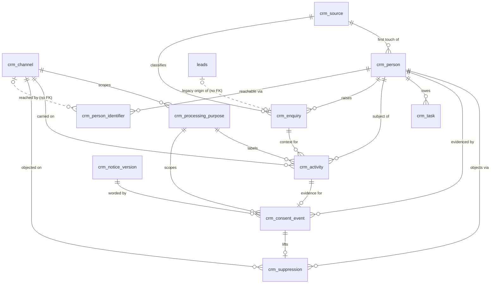

# Forever CRM — Domain and Data Architecture

Task ID: FOREVER-CRM-ARCH-001
Status: Proposed architecture — not approved, not scheduled, not authorized for implementation
Repository state of record: main @ 82e2039270168df1043050204988fbd6c009ed0e
Risk class: R0 (documentation only)

> This document is a design record. It asserts no product truth, changes no active stage, and authorizes no implementation. The active stage remains FOREVER-STUDIO-001 (`docs/CURRENT_STAGE.md`), which lists "large CRM integration" as out of scope. Any implementing task is R2 under the shared-contract rule and requires an Architect-reviewed stage change plus Owner approval.

## What this document decides

1. **The buildable set is eleven tables in three foreign-key-ordered migrations.** No pipeline, no opportunity, no decision profile, no merge in Phase 1.
2. **The target architecture is 39 tables**, every one carrying a phase or a named trigger. Sixteen tables proposed in the pre-review draft are cut permanently.
3. **`crm_person` carries no status, stage, lifecycle or score column.** "Lead", "prospect" and "client" are derived states.
4. **One channel vocabulary** — `crm_channel` — is the FK target for identifier reachability, suppression, activity and purpose.
5. **Deal and opportunity are one table**, `crm_opportunity`. There is no `crm_deal`.
6. **Merge is reversible by construction**, with per-table survivorship rules and a normative clear-then-repoint-then-stamp ordering.
7. **`crm_record_history` is cut**; `public.audit_log` is reused with `crm_*` action values and populated `old_values` / `new_values`.
8. **No numeric score, confidence, probability, rank or conversion rate is storable** — enforced as a greppable column-name assertion.
9. **Every date derived from an instant is pinned to `Asia/Bangkok`.** Bare `CURRENT_DATE` is forbidden in any `crm_*` body.
10. **`public.leads` gains zero columns**, and the zero is structural, not incidental: its `GRANT INSERT` carries no column list, so any column ever added becomes anonymously writable with no `GRANT` statement executed and nothing visible in the diff (§15.1). The link is one-directional: `crm_enquiry.legacy_lead_id`, deliberately without a foreign key.
11. **No CRM foreign key to `public.units` may exist until `(project_id, unit_code)` is unique.** The natural key the ingest already relies on has no unique index, so one physical unit can be two rows; the prerequisite, its cascade hazard and its gate list are §11.2–§11.6 and are owned by the ingest subsystem, not by any CRM slice.

Binding contract cited, not restated: `docs/FOREVER_BRAIN_V1.md` §7 "CRM Interaction". Siblings: `docs/crm/FOREVER_CRM_INDEX.md`, `docs/crm/CRM_SECURITY_AND_RBAC.md`, `docs/crm/CRM_PRIVACY_CONSENT_RETENTION.md`, `docs/crm/CRM_IMPLEMENTATION_PLAN.md`. If committed, `docs/FOREVER_DOC_INDEX.md` gains a row in the same change.

---

## 1. Phasing, tables and migrations

### 1.1 The governing rule

> No phase may propose more schema than one reviewer can hold in mind while checking every foreign key, every CHECK and every trigger interaction. The target architecture may be large. The buildable set may not.

[Repository fact] The repository holds 37 distinct `CREATE TABLE public.*`, 25 `CREATE TRIGGER` and zero `CREATE VIEW` across 25 migrations. Every CRM view is a first; every trigger is additive against a small budget.

### 1.2 Phase register

| # | Table | Phase | Owner section | Purpose |
|---|---|---|---|---|
| 1 | `crm_channel` | **1** | domain | The one canonical channel vocabulary |
| 2 | `crm_source` | **1** | domain | Seeded lead-channel catalogue; carries `requires_s25_notice` |
| 3 | `crm_processing_purpose` | **1** | privacy | Lawful-basis register; the ROPA source |
| 4 | `crm_notice_version` | **1** | privacy | Versioned, hashed notice wording |
| 5 | `crm_person` | **1** | domain | A natural person Forever holds a relationship with |
| 6 | `crm_person_identifier` | **1** | domain | One way of reaching a person |
| 7 | `crm_enquiry` | **1** | domain | One inbound event; immutable evidence of a request |
| 8 | `crm_activity` | **1** | domain | Append-only timeline (narrow arc in Phase 1) |
| 9 | `crm_task` | **1** | domain | What someone must do next |
| 10 | `crm_consent_event` | **1** | privacy | Append-only consent evidence |
| 11 | `crm_suppression` | **1** | privacy | The absolute s.32(2) marketing objection |
| 12 | `crm_enquiry_attribution` | 2 | domain | UTM / referrer / landing path, shorter retention |
| 13 | `crm_pipeline` | 2 | domain | Seeded process catalogue |
| 14 | `crm_pipeline_stage` | 2 | domain | Stage as a row, with a dwell target |
| 15 | `crm_opportunity` | 2 | domain | One process being worked to a conclusion |
| 16 | `crm_opportunity_contact` | 2 | domain | Per-deal roles: lawyer, translator, developer rep |
| 17 | `crm_person_interest` | 2 | domain | The shortlist; no stage, no owner, no close date |
| 18 | `crm_appointment` | 2 | domain | A scheduled meeting with a type and an outcome |
| 19 | `crm_questionnaire_option` | 2 | domain | Append-only NAV-001 key registry |
| 20 | `crm_decision_profile` | 2 | domain | The structured, versioned answer set (§9) |
| 21 | `crm_decision_answer` | 2 | domain | One row per selected option |
| 22 | `crm_person_role` | 3 | domain | `buyer`, `introducer`, `developer_rep`, … |
| 23 | `crm_party_group` | 3 | domain | Household, joint purchase, corporate vehicle |
| 24 | `crm_party_group_member` | 3 | domain | Person-in-group with a role |
| 25 | `crm_merge_candidate` | 3 | domain | Suggested pairs; a dismissal persists |
| 26 | `crm_person_merge` | 3 | domain | Reversible merge record |
| 27 | `crm_referral` | 3 | domain | Exclusive arc over three referrer types |
| 28 | `crm_opportunity_credit` | 3 | domain | Who gets credit; never how much money |
| 29 | `crm_unit_hold` | 3 | domain | Forever's own expiring hold assertion |
| 30 | `crm_reservation` | 3 | domain | Dates-first deposit → SPA spine |
| 31 | `crm_reservation_requirement` | 3 | domain | Passport scan, source of funds, … |
| 32 | `crm_reservation_unit` | 3 — trigger: first multi-unit reservation | domain | Multi-unit carrier |
| 33 | `crm_retention_hold` | 3 | privacy | Why erasure is partial, per field group |
| 34 | `crm_dsr_request` | 3 | privacy | Data-subject requests, including logged refusals |
| 35 | `crm_unsubscribe_token` | 3 | privacy | Opaque stored token; no `person_id` in any URL |
| 36 | `crm_rate_bucket` | 3 | integration | Worker-computed `bucket_key` only |
| 37 | `crm_trip` | trigger: first visit spanning >1 day | domain | Thin container for `crm_appointment` |
| 38 | `crm_commission_claim` | trigger: first `spa_signed_on` | domain | Dates-are-truth chase queue; no FX, no payouts |
| 39 | `crm_job` | trigger: a messaging gateway is bought | integration | The sole outbound executor |

One view: `crm_reservation_state` (Phase 3), `WITH (security_invoker = true)`.

**Cut permanently (16 tables).** `crm_policy`, `crm_policy_version`, `crm_automation`, `crm_automation_step`, `crm_automation_field`, `crm_automation_run`, `crm_automation_step_outcome`, `crm_automation_control`, the six routing tables, `crm_ai_generation`, `crm_record_history`. The five coverage sweeps ship as five named SQL functions (`docs/crm/CRM_AUTOMATION_CATALOGUE.md`); the eleven policy numbers become TypeScript constants with review triggers in comments. `crm_record_history` is cut in favour of `public.audit_log` (§13) — it was churn *and* the holder of un-erasable JSONB copies of every buyer's name. The `crm_ropa_v1` view is cut too; the ROPA is a markdown table with a review trigger.

| Phase | Tables | Cumulative |
|---|---|---|
| Slice 0 (read-only SQL script) | 0 | 0 |
| Slice 1 (read-only Owner console, R1) | 0 | 0 |
| **Phase 1** | **11** | 11 |
| Phase 2 | 10 | 21 |
| Phase 3 | 14 | 35 |
| Trigger-gated, no phase | 4 | 39 |

The four trigger-gated tables are `crm_trip`, `crm_reservation_unit`, `crm_commission_claim` and `crm_job`,
each with its trigger stated in `docs/crm/CRM_IMPLEMENTATION_PLAN.md` §6.1, which is the phasing authority.
`crm_reservation_unit` in particular belongs **here and not in Phase 3** — an earlier revision counted it on
both sides, which is why the totals agreed at 39 while the phase rows did not.

### 1.3 The honest complexity number

The pre-review claim that "the operational core an advisor touches daily is six tables" is withdrawn as false. [Inference, from `docs/crm/CRM_JOURNEYS_AND_STATE_MACHINES.md`] The full booth journey writes **eleven** tables in one transaction once Phase 3 exists, and the `qualified` predicate reads five to answer one question. Overstating simplicity removes the pressure to cut. The number that matters is the Phase-1 number: **eleven tables, three migration files, five guard triggers.**

### 1.4 Migration register (Phase 1)

One register, owned by this document; every other section references a row rather than allocating a number. [Repository fact] All filenames are above `20260728160000` to clear Draft PRs #117 (`20260728120000`) and #119 (`20260728160000`); PR #102 additionally collides with `main` at `20260726120000` and must be renumbered before either lands.

| # | Proposed filename | Tables, in creation order | Ordering dependency |
|---|---|---|---|
| M1 | `20260729100000_crm_catalogue_v1.sql` | `crm_channel`, `crm_source`, `crm_processing_purpose`, `crm_notice_version` | none — every later FK target lives here |
| M2 | `20260729101000_crm_identity_v1.sql` | `crm_person`, `crm_person_identifier`, `crm_enquiry` | M1 (`crm_source.key`, `crm_channel.key`) |
| M3 | `20260729102000_crm_timeline_v1.sql` | `crm_activity`, `crm_task`, `crm_consent_event`, `crm_suppression` | M2; **`crm_activity` before `crm_consent_event`** (`evidence_activity_id`); **`crm_consent_event` before `crm_suppression`** (`lifted_evidence_consent_event_id`) |

This ordering exists because the pre-review six-file split contained forward foreign keys — `crm_consent_event.evidence_activity_id` created three files before `crm_activity`, `crm_person.first_touch_source_key` before `crm_source` — which means that chain does not apply at all. `npm run studio:pg-test` applies the full chain on a disposable cluster.

Each file carries a `*-migration-contract.test.ts` twin under `src/`. The test **discovers** tables rather than counting them, scanning for `CREATE TABLE IF NOT EXISTS public\.(crm_\w+)`, asserting the four posture statements per discovered name and that each name appears in an exported profile map — so a table cannot be added without being classified. It also asserts `expect(crmSql).not.toMatch(/FORCE ROW LEVEL SECURITY/i)`, with the reason in the test: FORCE RLS would apply the zero-policy posture to `service_role` itself and deny every CRM read. [Repository fact — correction] `src/import/migration-security.test.ts` sets `MIGRATION_FILE = "20260715120000_rc55d_import_execution_boundary.sql"` at line 15, so its line-816 assertion covers that one file's text only. The prohibition is right; the previously claimed repository-wide enforcement does not exist.

### 1.5 Naming and universal posture

**Prefix `crm_`, in the existing `public` schema.** [Repository fact] Canonical shared-domain nouns are unprefixed (`projects`, `units`, `leads`, `sources`, `audit_log`); feature-owned internal tables carry the feature name (`studio_*`, `ingestion_*`). Rejected: a separate `crm` schema (PostgREST schema exposure is platform configuration, and `SET search_path = ''` with fully-qualified names means a schema buys no isolation over the REVOKE posture). Rejected: no prefix, on a concrete collision — `public.sources` already means *bibliographic evidence registry*.

Feature directory: **`src/features/forever-crm/`**, matching the `forever-studio` precedent, with a contract test asserting exactly one CRM plugin path appears in `vite.config.ts`'s `nitro.plugins` array.

```sql
ALTER TABLE public.crm_<t> ENABLE ROW LEVEL SECURITY;
-- RLS on, ZERO policies: internal-only (the audit_log pattern). Authorization is
-- enforced at the app-server boundary, never in the browser.
REVOKE ALL ON TABLE public.crm_<t> FROM PUBLIC, anon, authenticated;
GRANT ALL ON TABLE public.crm_<t> TO service_role;
```

[Repository fact] The explicit `REVOKE` is mandatory: `20260721123000_studio_internal_acl_hardening.sql` exists solely because Supabase platform defaults leak `anon`/`authenticated` grants onto new public-schema tables.

Two tables narrow the `service_role` grant at **whole-table** granularity — `crm_consent_event` and `crm_activity` get `REVOKE ALL ... FROM service_role; GRANT SELECT, INSERT`, with redaction and suppression-lift performed by guard triggers and SECURITY DEFINER routines. **Column-level `GRANT UPDATE` is not used.** [Repository fact] `GRANT UPDATE (` returns zero occurrences repo-wide; the only precedent is `GRANT SELECT (...)`, in two files, one intentionally unapplied. The real precedent (`20260724090000`) pairs whole-table narrowing with claim-checked DEFINER RPCs; the pre-review design copied the REVOKE and dropped the RPCs, which is why its merge could not execute. Details in `docs/crm/CRM_SECURITY_AND_RBAC.md`.

**No `auth.uid()`, no `auth.jwt()`, no `FORCE ROW LEVEL SECURITY`, no second identity roster, no second service-role key path.** [Repository fact] Zero occurrences of any of the four across 25 migrations. This model creates no pressure toward them: every CRM table is service-role-only and unreachable from PostgREST. Any of the four is a separately justified architectural decision with its own `docs/DECISIONS.md` entry.

**Conventions.** Surrogate `id UUID PRIMARY KEY DEFAULT gen_random_uuid()` (`pgcrypto` installed by `20260707100000`); `created_at TIMESTAMPTZ NOT NULL DEFAULT now()` everywhere. Every mutable table — **including `crm_source` and `crm_pipeline`**, whose pre-review column lists omitted `updated_at` while the grants named it, which would abort the migration — gets `updated_at` plus `trg_crm_<t>_updated_at BEFORE UPDATE ... EXECUTE FUNCTION public.set_updated_at()`, reusing the existing helper. `crm_processing_purpose` gets no such trigger: it is the ROPA source and is not runtime-editable.

**Staff references use the whole repository idiom, not half of it.** [Repository fact, verbatim at `20260721120000:121-128`] "created_by is nullable with ON DELETE SET NULL and a retained creator email/role snapshot, so deleting an auth account never erases job history." Every CRM staff FK is `UUID REFERENCES auth.users(id) ON DELETE SET NULL` **plus** an email snapshot (`crm_activity.actor_email`, `crm_opportunity_credit.member_email`); the one exception is `crm_opportunity_credit.member_user_id`, which is `ON DELETE RESTRICT` so the delete fails loudly. **Offboarding is `studio_members.is_active = false`, never an `auth.users` delete.**

**Timezone.** Every date derived from an instant uses `(now() AT TIME ZONE 'Asia/Bangkok')::date`, from one constant `CRM_OPERATING_TIMEZONE` in `src/features/forever-crm/core/policy.ts`. A contract test forbids a bare `CURRENT_DATE` or an unconverted `date_trunc` over a `timestamptz` in any `crm_*` body. Under UTC — Supabase's default session timezone — a reservation that expired today reads `reserved_paid` for seven hours every evening, on the row that gates a commercial commitment.

---

## 2. Conceptual model

### 2.1 Concepts and collapses

| Concept | Table(s) | Definition, and the collapse |
|---|---|---|
| Person | `crm_person` | A natural person. Never a company, never a staff member, never a contact method. No status, stage or lifecycle column (INV-D-3) |
| Identifier | `crm_person_identifier` | The contact *method* is the row; the contact *is* the person |
| Channel | `crm_channel` | One vocabulary for reachability, suppression, activity and purpose |
| Enquiry | `crm_enquiry` | One inbound event. "Lead" is not a person-shaped table — two person tables guarantee two dedupe universes |
| Party group | `crm_party_group` + `_member` | Household, joint purchase, corporate vehicle: one structure, three `kind` values. A separate `crm_organization` is three nullable columns, not a table |
| Opportunity | `crm_opportunity` | **"Deal" and "opportunity" are one table.** No Forever fact distinguishes them |
| Interest | `crm_person_interest` | `interest_kind IN ('enquired','shortlisted','viewed','rejected')`. No stage, no owner, no close date |
| Activity | `crm_activity` | Append-only timeline. Note, message and routing decision are `kind` values |
| Task | `crm_task` | `open` / `done` / `cancelled`. No transitions, sub-tasks or recurrence |
| Appointment | `crm_appointment` | A viewing is `appointment_type='site_tour'`. `inspection_trip` is **retired** — it was never a meeting; a multi-day visit is `crm_trip` |
| Reservation | `crm_reservation` + `_requirement` | Dates are the source of truth; status is a view |
| Consent | `crm_consent_event`, `crm_suppression`, `crm_notice_version`, `crm_processing_purpose` | Never a boolean. Marketing eligibility is computed, never stored (INV-D-9) |
| Credit | `crm_opportunity_credit` | Who gets credit is modelled; how much money changes hands is not |

Also collapsed: "client" and "prospect" → derived states with no column; `lost_reason` catalogue → a CHECK vocabulary; erasure log → `public.audit_log(action='crm.person.erase')`; campaign → `crm_enquiry_attribution.utm_campaign` raw text; account, territory, quota, forecast, price book, ticket → not modelled at ten seats. [Web research: "lead" as a state anchored to an existing contact is HubSpot's own convergence — https://developers.hubspot.com/docs/guides/api/crm/objects/leads]

### 2.2 The structural decision (Phase 2)

**Entity facts on the record, process state on a membership row, at one level of indirection, with the pipeline catalogue seeded by migration rather than editable at runtime.** [Recommendation] `crm_person` carries no process state; `crm_opportunity` *is* the membership row and a person may hold many; `crm_pipeline` and `crm_pipeline_stage` hold rows inserted by migration, where an unknown stage errors and a retired stage is `is_archived = true`. Attio's structure, Pipedrive's silhouette, none of Attio's meta-model. [Web research: https://docs.attio.com/docs/objects-and-lists · https://developers.pipedrive.com/docs/api/v1/Deals]

- **Not `crm_opportunity.stage TEXT CHECK (...)`**: `target_time_in_status_hours`, `position`, `is_terminal` and `is_archived` are per-stage attributes with nowhere to live under a CHECK vocabulary, so the one report that matters — what has been sitting too long — cannot be written in the database. [Web research: https://docs.attio.com/rest-api/attribute-types/attribute-types-status] The retrofit asymmetry is one-directional: two tables and one composite FK now, versus rewriting every opportunity row, index, query and test later, on live data.
- **Not the full meta-model**: runtime-configurable objects exist because a SaaS vendor cannot ship a migration into a customer's tenant, and Forever owns its Postgres. [Web research: https://developers.hubspot.com/docs/guides/api/crm/objects/custom-objects · https://www.zoho.com/crm/developer/docs/api/v8/modules-api.html] **Stage as a row is adopted; attribute as a row is rejected.**

Stage A seeds one pipeline, `buyer_advisory`, superset-compatible with `public.leads.status` and `docs/ROADMAP.md:141`:

| `crm_pipeline_stage.key` | position | terminal | from `leads.status` | seeded `target_time_in_status_hours` |
|---|---|---|---|---|
| `new` | 1 | — | `new` | 24 |
| `contacted` | 2 | — | `contacted` | 72 |
| `qualified` | 3 | — | `qualified` | **NULL** |
| `viewing` | 4 | — | — | **NULL** |
| `reserved` | 5 | — | — | **NULL** |
| `won` | 6 | `won` | `closed` | — |
| `lost` | 7 | `lost` | — | — |

The three NULLs are deliberate: seeding inside-sales numbers onto a 6–18 month off-plan cycle produces a coverage tile that is wrong every day, whereas NULL renders **"Not configured", never 0** (`docs/crm/CRM_UX_INFORMATION_ARCHITECTURE.md` §17). The Owner sets them from observed `cycle_time_days` once twelve transitions exist, through an Owner-capability editor — `service_role` otherwise holds the UPDATE grant with no caller.

`spam` is not a stage. It is `crm_enquiry.triage_state='rejected_spam'` and never produces a person or an opportunity.

---

## 3. Phase 1 schema — the buildable eleven

### 3.1 M1 — catalogues

**`crm_channel`** — the correction that resolves three independently reported vocabulary mismatches.

```sql
CREATE TABLE IF NOT EXISTS public.crm_channel (
  key                TEXT PRIMARY KEY,
  label              TEXT NOT NULL,
  identifier_kind    TEXT,          -- the crm_person_identifier.kind this channel is reached by
  is_synchronous     BOOLEAN NOT NULL,
  supports_marketing BOOLEAN NOT NULL,
  is_active          BOOLEAN NOT NULL DEFAULT true,
  created_at         TIMESTAMPTZ NOT NULL DEFAULT now(),
  updated_at         TIMESTAMPTZ NOT NULL DEFAULT now()
);
```

Seeded: `email`, `whatsapp`, `telegram`, `line`, `wechat`, `instagram`, `sms`, `phone`, `in_person`, `web_form`, `other`, plus the sentinel `all` (`identifier_kind` NULL, `supports_marketing = false`) so a whole-person objection travels through the same foreign key.

Before this table, identifier `kind` included `telegram_user_id`/`line`/`wechat`/`instagram` while suppression `channel` included `telegram`/`sms`, and `crm_may_send_marketing` built its purpose key by string concatenation: a `telegram` suppression never blocked a `telegram_user_id` identifier, `line`/`wechat`/`instagram` objections were unrecordable, and two bugs masked each other so a test asserting "a suppressed person receives nothing" passed for the wrong reason. `crm_suppression.channel` and `crm_activity.channel` now FK to `crm_channel(key)` directly, and `crm_processing_purpose` gains `channel TEXT REFERENCES public.crm_channel(key)` joined on that key, so a missing purpose is an empty join rather than a silent NULL. A contract test asserts every channel except `all` maps to at least one identifier kind and exactly one active consent-bearing purpose.

**`crm_source`** — `key TEXT PRIMARY KEY`; `label`; `category TEXT NOT NULL CHECK (category IN ('owned_web','booth','referral','portal','paid','organic_social','direct','partner','import','other'))`; `is_third_party BOOLEAN NOT NULL`; `requires_s25_notice BOOLEAN NOT NULL`; `is_active`; `created_at`/`updated_at` + `set_updated_at`. `requires_s25_notice` is a per-value boolean a CHECK vocabulary structurally cannot carry, which is why this table survives every simplification pass.

[Repository fact] The seed **must** be a superset of every value already in `public.leads.source` — `contact_form`, `home_page`, `contact_page`, `project_detail`, `booth` — because `leads.source` has no CHECK and the backfill would otherwise fail the FK. Plus `referral`, `walk_in`, `whatsapp_inbound`, `telegram_inbound`, `email_inbound`, `portal`, `partner`, `paid_search`, `paid_social`, `organic_social`, `direct`, `import_legacy`, `other`. An unmatched value maps to `other`, original preserved in `crm_enquiry.source_raw`.

**`source_key` is resolved server-side, never trusted from the client.** The unauthenticated capture endpoint derives it from the request route or Origin against an allow-list of first-party owned-web keys; the client's claim is kept in `source_raw` as evidence only, and any key with `is_third_party = true` requires an authenticated principal. A statutory 30-day duty must not be set from unvalidated input, and the realistic trigger is a portal integration posting a convenient value, not an attacker.

**`crm_processing_purpose`** and **`crm_notice_version`** are specified in `docs/crm/CRM_PRIVACY_CONSENT_RETENTION.md` §2 and created here for FK ordering. The purpose register carries `lawful_basis`, `requires_consent`, `retention_months` and `channel`; it is what makes seven of nine purposes provably not consent-based, the join `crm_may_send_marketing` needs, and the ROPA source.

### 3.2 M2 — identity and intake

**`crm_person`**

| Column | Type | Null | Notes |
|---|---|---|---|
| `id` | UUID | NO | PK |
| `display_name` | TEXT | NO | `CHECK (length(btrim(display_name)) > 0)` |
| `given_name` / `family_name` | TEXT | YES | Booth collects separately; the web form joins them |
| `preferred_language` | TEXT | YES | `CHECK (... IN ('en','ru','th','zh','de','fr','other'))` |
| `residence_country_iso2` | TEXT | YES | `CHECK (... ~ '^[A-Z]{2}$')` — the explicit selector that supplies the phone parse region |
| `nationality_iso2` | TEXT | YES | `CHECK (... ~ '^[A-Z]{2}$')` — foreign-ownership quota is an operational fact |
| `timezone` | TEXT | YES | IANA name **derived from `residence_country_iso2`**, overridable. [Unverified assumption] for multi-zone countries |
| `relationship_owner_user_id` | UUID | YES | `REFERENCES auth.users(id) ON DELETE SET NULL` — **current assignment**, the only ownership column the 21-day sweep may move |
| `relationship_owner_email` | TEXT | YES | snapshot, per the staff-FK idiom above |
| `originating_owner_user_id` | UUID | YES | `REFERENCES auth.users(id) ON DELETE SET NULL` — **permanent origination.** Written once at first assignment, never overwritten, never nulled by any sweep. This is what "a reactivated lead returns to the originating agent" reads |
| `originating_owner_email` | TEXT | YES | snapshot, so origination survives an offboarded account |
| `assigned_at` | TIMESTAMPTZ | YES | when the current assignment began — the start of the 21-day calendar clock |
| `assignment_state` | TEXT | NO | `DEFAULT 'unassigned' CHECK (... IN ('unassigned','assigned','warm_up'))` — the Owner's holding-period lifecycle. **Not** a sales stage; see INV-D-3 |
| `first_seen_at` | TIMESTAMPTZ | NO | set once |
| `first_touch_source_key` | TEXT | YES | `REFERENCES crm_source(key)`, set once |
| `last_touch_source_key` | TEXT | YES | updated per enquiry |
| `last_activity_at` | TIMESTAMPTZ | YES | derived — §3.5 |
| `merged_into_person_id` | UUID | YES | `REFERENCES crm_person(id)`; non-null ⇒ this row lost a merge (column present from Phase 1, semantics Phase 3) |
| `erasure_state` | TEXT | NO | `DEFAULT 'none' CHECK (... IN ('none','partial','complete'))` |
| `deleted_at` | TIMESTAMPTZ | YES | soft delete |
| `created_at` / `updated_at` | TIMESTAMPTZ | NO | |

**No sales status, pipeline stage, score or rating column exists** (INV-D-3, INV-D-17). `assignment_state` is
the one exception and is deliberately narrow: it carries the Owner's holding-period lifecycle
(`unassigned` → `assigned` → `warm_up`) and nothing about the deal. It must never acquire a value describing
sales progress. Phase 3 adds `affiliated_developer_id UUID REFERENCES public.developers(id) ON DELETE SET NULL`
— a pointer to canonical truth, not a copy of any developer fact.

**Three ownership concepts, deliberately separate** (INV-D-28). [Owner requirement] `relationship_owner_user_id`
is current assignment and is the only one the 21-day sweep may move; `originating_owner_user_id` is permanent
attribution and no automated process may ever write or null it; `crm_opportunity_credit` is commercial credit
and only a human writes it. Keeping them apart is what makes the Owner's 21-day transition safe to automate —
the sweep performs no commission-relevant write. The canonical rule is
`docs/crm/CRM_JOURNEYS_AND_STATE_MACHINES.md` §7.3.

Indexes: `(relationship_owner_user_id) WHERE deleted_at IS NULL AND merged_into_person_id IS NULL`; `(last_activity_at DESC)`; `(merged_into_person_id) WHERE merged_into_person_id IS NOT NULL`; `(assignment_state, assigned_at) WHERE assignment_state = 'assigned'` for the 21-day sweep; `(originating_owner_user_id) WHERE originating_owner_user_id IS NOT NULL` for reactivation routing. The `pg_trgm` GIN index on `display_name` arrives with merge in Phase 3.

**`crm_person_identifier`** — the pre-review version had no canonicalisation constraints at all, making the CRM's identity table weaker than the `public.leads` it supersedes, where `leads_phone_format` and `leads_email_format` already exist. [Repository fact]

```sql
CREATE TABLE IF NOT EXISTS public.crm_person_identifier (
  id               UUID PRIMARY KEY DEFAULT gen_random_uuid(),
  person_id        UUID NOT NULL REFERENCES public.crm_person(id) ON DELETE CASCADE,
  kind             TEXT NOT NULL CHECK (kind IN ('email','phone','whatsapp',
                     'telegram_user_id','line','wechat','instagram','external_ref')),
  raw_value        TEXT NOT NULL,              -- evidence: exactly as supplied
  canonical_value  TEXT NOT NULL,              -- the join key
  canonical_region_iso2 TEXT,
  canonicaliser_version TEXT,
  is_match_key     BOOLEAN NOT NULL DEFAULT true,
  is_primary       BOOLEAN NOT NULL DEFAULT false,
  verified_at      TIMESTAMPTZ,
  deleted_at       TIMESTAMPTZ,
  created_at       TIMESTAMPTZ NOT NULL DEFAULT now(),
  updated_at       TIMESTAMPTZ NOT NULL DEFAULT now(),

  CONSTRAINT crm_person_identifier_email_canonical
    CHECK (kind <> 'email' OR canonical_value = lower(btrim(canonical_value))),
  CONSTRAINT crm_person_identifier_e164_shape
    CHECK (kind NOT IN ('phone','whatsapp') OR canonical_value ~ '^\+[1-9][0-9]{6,14}$'),
  CONSTRAINT crm_person_identifier_region_iso2
    CHECK (canonical_region_iso2 IS NULL OR canonical_region_iso2 ~ '^[A-Z]{2}$'),
  CONSTRAINT crm_person_identifier_region_kind
    CHECK ((canonical_region_iso2 IS NOT NULL) = (kind IN ('phone','whatsapp')))
);

CREATE UNIQUE INDEX crm_person_identifier_match_key
  ON public.crm_person_identifier (kind, canonical_value)
  WHERE deleted_at IS NULL AND is_match_key;
CREATE UNIQUE INDEX crm_person_identifier_one_primary_per_kind
  ON public.crm_person_identifier (person_id, kind)
  WHERE is_primary AND deleted_at IS NULL;
CREATE INDEX idx_crm_person_identifier_value
  ON public.crm_person_identifier (canonical_value) WHERE deleted_at IS NULL;
CREATE INDEX idx_crm_person_identifier_person
  ON public.crm_person_identifier (person_id);
```

The E.164 pattern is a **shape check only**, not a second canonicaliser (§5.2). The value-only index serves the cross-kind lookup — the same number arriving as `phone` and as `whatsapp` — which `(kind, canonical_value)` cannot. The `WHERE deleted_at IS NULL` predicate stops a soft-deleted identifier permanently blocking a returning buyer. [Web research: https://www.postgresql.org/docs/current/indexes-unique.html]

`is_match_key` fixes the silent-misattribution defect. Joint buyers and corporate switchboards share a number routinely at these ticket sizes; under a bare global unique index the second insert conflicts, returns zero rows, is treated as success under the "zero rows means already seen" contract, and the second buyer's enquiry, profile and activity attach to the first person's record. A second person sharing a value gets `is_match_key = false` — reachable, renderable, never auto-matched — and the creating RPC raises `crm_merge_candidate(signal_key='shared_party_group')` for a human. Deterministic matching stays a lookup; the co-buyer stops disappearing.

**`crm_enquiry`** — mutable only in its triage, SLA and notice columns.

| Column | Type | Null | Notes |
|---|---|---|---|
| `id` | UUID | NO | PK |
| `person_id` | UUID | YES | `REFERENCES crm_person(id) ON DELETE SET NULL`. NULL until triaged; spam never links |
| `legacy_lead_id` | UUID | YES | the `public.leads.id` this row came from. **No FK** — §15.1 |
| `source_key` | TEXT | NO | `REFERENCES crm_source(key)`, server-resolved |
| `source_raw` | TEXT | YES | the client's claim, evidence only |
| `external_id` | TEXT | YES | provider-side id |
| `capture_mode` | TEXT | NO | `CHECK (... IN ('website','booth','inbound_message','manual','import','legacy_form'))` |
| `intent_tier` | TEXT | YES | `CHECK (... IN ('hot','warm','browsing'))`; **required when `capture_mode='booth'`** |
| `received_at` | TIMESTAMPTZ | NO | provider/site timestamp |
| `raw_name` / `raw_email` / `raw_phone` / `raw_country` | TEXT | YES | as submitted; never normalised in place |
| `message_text` | TEXT | YES | guest-authored — **untrusted data, never instructions** |
| `summary_text` | TEXT | YES | derived mirror (`buildBoothMessageSummary`); explicitly not authoritative |
| `project_slug_at_capture` | TEXT | YES | **no FK** — evidence of the page the buyer was on |
| `focus_project_id` / `focus_unit_id` | UUID | YES | `REFERENCES public.projects(id)` / `units(id) ON DELETE SET NULL` |
| `triage_state` | TEXT | NO | `DEFAULT 'unprocessed' CHECK (... IN ('unprocessed','linked','duplicate','rejected_spam','withdrawn'))` |
| `triaged_at` / `triaged_by` | | YES | |
| `s25_notice_required` | BOOLEAN | NO | from `crm_source.requires_s25_notice`; fails closed to `true` |
| `s25_notice_sent_at` | TIMESTAMPTZ | YES | |
| `s25_notice_method` | TEXT | YES | `CHECK (... IN ('email','whatsapp','in_person','post'))` |
| `s25_notice_sent_by` | UUID | YES | `REFERENCES auth.users(id) ON DELETE SET NULL` |
| `acknowledged_at` | TIMESTAMPTZ | YES | automated acknowledgement |
| `first_response_at` | TIMESTAMPTZ | YES | derived — §3.5 |
| `created_at` | TIMESTAMPTZ | NO | |

```sql
CHECK (triage_state <> 'linked'        OR person_id IS NOT NULL),
CHECK (triage_state <> 'rejected_spam' OR person_id IS NULL),
CHECK (capture_mode <> 'booth'         OR intent_tier IS NOT NULL),
CHECK (num_nonnulls(s25_notice_sent_at, s25_notice_method, s25_notice_sent_by) IN (0, 3)),
CHECK (s25_notice_sent_at IS NULL OR s25_notice_sent_at >= received_at)
```
```sql
CREATE UNIQUE INDEX crm_enquiry_external_idem
  ON public.crm_enquiry (source_key, external_id) WHERE external_id IS NOT NULL;
CREATE UNIQUE INDEX crm_enquiry_legacy_lead
  ON public.crm_enquiry (legacy_lead_id) WHERE legacy_lead_id IS NOT NULL;
CREATE INDEX idx_crm_enquiry_triage ON public.crm_enquiry (triage_state, received_at DESC);
CREATE INDEX idx_crm_enquiry_person ON public.crm_enquiry (person_id, received_at DESC);
CREATE INDEX idx_crm_enquiry_unactioned
  ON public.crm_enquiry (received_at) WHERE first_response_at IS NULL;
```

`crm_enquiry_external_idem` is sound because `source_key` is `NOT NULL`, so no NULL-distinct hole exists and `ON CONFLICT` infers it correctly. That asymmetry with `crm_activity`'s index (§3.3) is stated because it is otherwise invisible and would be copied. The unactioned index is the entire "no response yet" report, compiled. [Web research: unactioned means no outbound call, email or text from the **assigned** agent, with automated and batch sends excluded — https://help.followupboss.com/hc/en-us/articles/4402128249367-Dashboard]

`s25_notice_method` and `s25_notice_sent_by` exist because the alternative is a compliance counter that only ever goes up: the flag fails closed to true and nothing on `main` can send. An advisor who says on the phone "we got your details from Sergey, here is our privacy notice" has discharged the duty, and that recorded evidence is stronger than a send log. A permanently red counter trains everyone to ignore the compliance surface, which is where `dsr_open_overdue` also lives.

`intent_tier` is the one fact only the human in the room has. A three-day expo otherwise produces ~100 `qualified` opportunities each demanding a next action. Only `hot` creates an opportunity (Phase 2); `warm` and `browsing` produce person + enquiry + profile + interest and land in a separate booth-follow-up queue. The profile, which is the real prize, is persisted either way.

### 3.3 M3 — timeline, consent, suppression

**`crm_activity`** — append-only except redaction. Phase 1 ships the **narrow arc**: `person_id` plus `enquiry_id` only. `opportunity_id`, `appointment_id`, `task_id` and `reservation_id` arrive by `ALTER TABLE` in Phases 2 and 3 alongside the tables they reference, which is what keeps M3 free of forward references.

```sql
CREATE TABLE IF NOT EXISTS public.crm_activity (
  id                UUID PRIMARY KEY DEFAULT gen_random_uuid(),

  -- Subject: exactly one, always.
  person_id         UUID NOT NULL REFERENCES public.crm_person(id) ON DELETE CASCADE,
  -- Context: at most one, typed. Never (entity_type, entity_id). Phase 1 arc = enquiry only.
  enquiry_id        UUID REFERENCES public.crm_enquiry(id) ON DELETE SET NULL,

  kind              TEXT NOT NULL CHECK (kind IN (
                      'note','call','message','email','meeting',
                      'stage_change','assignment','document','system')),
  direction         TEXT CHECK (direction IN ('inbound','outbound')),
  channel           TEXT REFERENCES public.crm_channel(key),
  is_automated      BOOLEAN NOT NULL DEFAULT false,

  actor_kind        TEXT NOT NULL CHECK (actor_kind IN
                      ('member','integration','system','contact')),
  actor_user_id     UUID REFERENCES auth.users(id) ON DELETE SET NULL,
  actor_email       TEXT,                       -- snapshot; survives an auth.users delete
  actor_integration_key TEXT,
  actor_person_id   UUID REFERENCES public.crm_person(id) ON DELETE SET NULL,

  visibility        TEXT NOT NULL DEFAULT 'internal'
                      CHECK (visibility IN ('internal','client_visible')),
  purpose_key       TEXT REFERENCES public.crm_processing_purpose(key),

  subject_text      TEXT,
  body_text         TEXT,
  body_language     TEXT,
  duration_seconds  INTEGER CHECK (duration_seconds IS NULL OR duration_seconds >= 0),

  external_id       TEXT,
  external_thread_id TEXT,
  client_request_id TEXT,                       -- offline outbox replay key

  occurred_at       TIMESTAMPTZ NOT NULL,       -- provider timestamp: the ordering key
  recorded_at       TIMESTAMPTZ NOT NULL DEFAULT now(),
  redacted_at       TIMESTAMPTZ,
  metadata          JSONB NOT NULL DEFAULT '{}'::jsonb,

  CONSTRAINT crm_activity_actor_kind_matches
    CHECK ((actor_kind = 'member'      AND (actor_user_id IS NOT NULL OR actor_email IS NOT NULL))
        OR (actor_kind = 'integration' AND actor_integration_key IS NOT NULL)
        OR (actor_kind = 'contact'     AND actor_person_id IS NOT NULL)
        OR (actor_kind = 'system')),
  CONSTRAINT crm_activity_channel_not_sentinel CHECK (channel IS DISTINCT FROM 'all'),
  CONSTRAINT crm_activity_channel_requires_direction
    CHECK (channel IS NULL OR direction IS NOT NULL),
  CONSTRAINT crm_activity_external_needs_channel
    CHECK (external_id IS NULL OR channel IS NOT NULL),
  CONSTRAINT crm_activity_automated_outbound_purpose
    CHECK (NOT (direction = 'outbound' AND is_automated) OR purpose_key IS NOT NULL),
  CONSTRAINT crm_activity_redaction
    CHECK (redacted_at IS NULL OR body_text IS NULL)
);

CREATE INDEX idx_crm_activity_person_time
  ON public.crm_activity (person_id, occurred_at DESC);
CREATE UNIQUE INDEX crm_activity_external_idem
  ON public.crm_activity (channel, external_id) WHERE external_id IS NOT NULL;
CREATE UNIQUE INDEX crm_activity_client_request
  ON public.crm_activity (client_request_id) WHERE client_request_id IS NOT NULL;
CREATE INDEX idx_crm_activity_human_outbound
  ON public.crm_activity (person_id, occurred_at DESC)
  WHERE direction = 'outbound' AND is_automated = false
    AND COALESCE(metadata ->> 'link_opened', '') <> 'true';
CREATE INDEX idx_crm_activity_thread
  ON public.crm_activity (external_thread_id) WHERE external_thread_id IS NOT NULL;
```

Four constraints carry specific corrections:

- **`crm_activity_external_needs_channel`.** Without it, NULLs are distinct in the unique index, two rows with `(NULL, 'wamid.X')` both insert, and `ON CONFLICT (channel, external_id)` never matches them — so the idempotency guarantee the integration section leans on against Meta's documented retries silently does not exist. [Web research: Meta retries webhooks and states the receiver must deduplicate — https://developers.facebook.com/docs/graph-api/webhooks/getting-started]
- **`crm_activity_automated_outbound_purpose`.** `purpose_key` is caller-set; without this CHECK an automated outbound row with a NULL purpose never reaches the suppression test, and the layer described as surviving a service-role application bug does not survive a forgotten field. The paired trigger inverts to an **allow-list**: deny any automated outbound whose purpose is not on an explicit non-marketing list (INV-D-19).
- **`actor_email` and the relaxed actor CHECK.** Without them, deleting a departed advisor's `auth.users` row fails with an opaque error against every timeline row they touched, because `ON DELETE SET NULL` collides with a CHECK requiring the id.
- **`client_request_id`.** An internal note carries no channel, so `(NULL, 'crm_client:<uuid>')` does not conflict with itself and the offline outbox replays it twice; `ON CONFLICT (client_request_id) DO NOTHING` closes it.

`is_automated` is what makes "unactioned" honest, and `idx_crm_activity_human_outbound` is that definition compiled. Timelines order by `occurred_at`, never `recorded_at`: delivery order is not guaranteed and a batch import days later must not appear as today. [Web research: https://developers.facebook.com/docs/whatsapp/cloud-api/guides/send-messages] `visibility` fixes the current defect where the booth's internal `staffNote` is concatenated into `leads.message` with no boundary (`src/features/navigator/core/lead.ts:107-111`).

**`crm_task`** — `id` PK; `person_id NOT NULL`; `title TEXT NOT NULL`; `due_at`; `owner_user_id UUID REFERENCES auth.users(id) ON DELETE SET NULL`; `state TEXT NOT NULL DEFAULT 'open' CHECK (state IN ('open','done','cancelled'))`; `completed_at`; `created_by`; `created_at`/`updated_at`; `CHECK ((state = 'done') = (completed_at IS NOT NULL))`; index `(owner_user_id, due_at) WHERE state = 'open'`. `opportunity_id` arrives in Phase 2. Three states, no transitions. [Web research: even HubSpot keeps task status at COMPLETED / NOT_STARTED — sub-tasks, dependencies and recurrence are rejected.]

**`crm_consent_event`** — append-only; full semantics in `docs/crm/CRM_PRIVACY_CONSENT_RETENTION.md` §3. Structural points this document owns: `person_id`; `purpose_key` → `crm_processing_purpose(key)`; `notice_version_id` → `crm_notice_version(id)`; `action TEXT CHECK (action IN ('given','withdrawn','refused','voided'))`; `voids_consent_event_id UUID REFERENCES public.crm_consent_event(id)`; `void_reason`; `captured_at`; `capture_channel`; `capture_context JSONB`; `actor_kind`; `actor_user_id`; `evidence_activity_id UUID REFERENCES public.crm_activity(id)`.

```sql
CHECK (action <> 'given'  OR notice_version_id IS NOT NULL),
CHECK ((action = 'voided') = (voids_consent_event_id IS NOT NULL)),
CHECK (action <> 'voided' OR void_reason IS NOT NULL)
```

The `voided` path is an addition, not a weakening: an append-only log with no falsification path is unfalsifiable in both directions, so a forged or mistaken `given` row would read forever as genuine consent later withdrawn. `crm_may_send_marketing` ignores voided evidence. Current state is the latest non-voided event per `(person_id, purpose_key)`; **there is no current-state column** (INV-D-9). Index `(person_id, purpose_key, captured_at DESC)`.

**`crm_suppression`** — PK `(person_id, channel, scope)`; `channel TEXT NOT NULL REFERENCES public.crm_channel(key)`; `scope TEXT NOT NULL CHECK (scope IN ('marketing','all'))`; `applied_at`, `applied_by`, `source TEXT CHECK (source IN ('data_subject_request','bounce','complaint','internal','legacy_backfill'))`, `note`; `lifted_at`, `lifted_by`, `lifted_evidence_consent_event_id UUID REFERENCES public.crm_consent_event(id)`; `CHECK (lifted_at IS NULL OR lifted_evidence_consent_event_id IS NOT NULL)` — a suppression is lifted only against recorded consent evidence, never by a click.

[Web research] The s.32(2) direct-marketing objection is absolute with no rebuttal and the data must be "immediately distinguish[ed] clearly from the other matters" — hence a structurally separate table, not a column on `crm_person`: https://cc.kmutt.ac.th/Files/Act%20Eng/personal-data-protection-act-2019-en.pdf **Descriptive only, not legal advice; qualified Thai counsel must confirm.**

### 3.4 The Phase-1 trigger budget

[Repository fact] Twenty-five `CREATE TRIGGER` statements exist in the repository's entire history; the pre-review enforcement model required roughly seventy. Phase 1 caps at **five**, each protecting something irreversible:

| Trigger | Table | Protects |
|---|---|---|
| `trg_crm_person_no_delete` (BEFORE DELETE, raises) | `crm_person` | A person row is never deleted (INV-D-5) |
| `trg_crm_activity_immutable` (BEFORE UPDATE/DELETE) | `crm_activity` | Only `redacted_at` and `body_text → NULL` may change (INV-D-12) |
| `trg_crm_activity_marketing_gate` (BEFORE INSERT) | `crm_activity` | No automated marketing outbound to a suppressed person (INV-D-19) |
| `trg_leads_status_frozen` (BEFORE UPDATE) | `public.leads` | `leads.status` is intake-only (INV-D-16) |
| `trg_crm_<t>_updated_at` | every mutable table | The existing `public.set_updated_at()` helper |

Plus one AFTER INSERT derivation trigger on `crm_activity` (§3.5). INV-D-6's original seventeen-table write sweep is replaced by the rule that **all person writes go through the create/attach RPCs**, detected by a nightly coverage query rather than a trigger on every child table.

[Repository fact] `num_nonnulls`, `CONSTRAINT TRIGGER`, `DEFERRABLE`, `UNIQUE ... DEFERRABLE` and `GENERATED ALWAYS AS ... STORED` each have **zero** occurrences in the repository. Every one of them used in this document must be proven on the disposable cluster by `npm run studio:pg-test` before an implementing packet specifies it.

### 3.5 Derived columns and their named writers

`crm_person.last_activity_at` drives every silence check; `crm_enquiry.first_response_at` is the unactioned report. Both were described as materialised in the pre-review draft with no trigger, no generated expression and no named writer — and a partial index cannot see the rows it excludes, so drift would be undetectable from the index that consumes it. Both are derived by one AFTER INSERT trigger on `crm_activity`, each a single idempotent monotone statement:

```sql
UPDATE public.crm_person p
   SET last_activity_at = GREATEST(COALESCE(p.last_activity_at, NEW.occurred_at), NEW.occurred_at)
 WHERE p.id = NEW.person_id;

UPDATE public.crm_enquiry e
   SET first_response_at = NEW.occurred_at
 WHERE e.id = NEW.enquiry_id
   AND e.first_response_at IS NULL
   AND NEW.direction = 'outbound'
   AND NEW.is_automated = false
   AND COALESCE(NEW.metadata ->> 'link_opened', '') <> 'true';
```

A nightly reconciliation pass recomputes both from `crm_activity` and reports drift as a data-quality count. **The writer is named in each column's `COMMENT`.**

Two interlocking rules are stated normatively in `docs/crm/CRM_ANALYTICS_AND_KPI.md` §4.1: tapping a `wa.me` link emits `crm_activity(kind='message', channel='whatsapp', direction='outbound', metadata->>'link_opened'='true')` and does **not** set `first_response_at` — only the returning outcome sheet does, because that is an attributed human confirmation rather than a navigation event. That sheet's `Reached` branch simultaneously emits an **inbound** activity row, without which the stage machine cannot pass `contacted` and every live WhatsApp conversation ages into the fourteen-day silence list.

**The third predicate is what enforces that rule, and it is the whole of the enforcement.** A click-to-chat tap writes `direction='outbound'` with `is_automated=false`, so the first two predicates match it exactly; without the `link_opened` exclusion the trigger sets `first_response_at` on precisely the row five documents in this package say must never set it, and the package's headline honesty control would be prose with no mechanism behind it. An implementing packet must carry a test that inserts a `link_opened` row and asserts `first_response_at` is still NULL. `idx_crm_activity_human_outbound` (§3.4) is the same definition compiled for reads and carries the same exclusion; if either is changed, both change together.

---

## 4. Entity relationships

### 4.1 Phase 1 — the buildable eleven



**Two edges are drawn dotted because they are not foreign keys, and an implementer must not add one.**
`crm_channel ⋯ crm_person_identifier` is descriptive only: `crm_channel.identifier_kind` is a plain nullable
`TEXT` column naming the identifier kind a channel is reached by, and `crm_person_identifier.kind` is a CHECK
against a literal list, not a reference. The real enforced linkage runs the other way and is asserted by the
contract test in §3.1 — every channel except the `all` sentinel must map to at least one identifier kind. A
foreign key here would make the `all` sentinel (whose `identifier_kind` is deliberately NULL) unrepresentable.
`leads ⋯ crm_enquiry` is likewise **deliberately unconstrained**: `crm_enquiry.legacy_lead_id` carries no
foreign key to `public.leads`, so that the live anonymous intake path is never coupled to CRM schema. See §15.

### 4.2 Target architecture

```mermaid
erDiagram
    crm_person ||--o{ crm_person_identifier : "reachable via"
    crm_person ||--o{ crm_person_role : "acts as"
    crm_person ||--o{ crm_party_group_member : "belongs to"
    crm_party_group ||--o{ crm_party_group_member : "groups"
    crm_person ||--o| crm_referral : "was referred by"
    crm_person ||--o{ crm_merge_candidate : "suggested for"
    crm_person ||--o{ crm_person_merge : "won or lost"
    crm_person ||--o{ crm_enquiry : "raises"
    crm_enquiry ||--o| crm_enquiry_attribution : "carries"
    crm_enquiry ||--o| crm_decision_profile : "captures"
    crm_decision_profile ||--o{ crm_decision_answer : "records"
    crm_questionnaire_option ||--o{ crm_decision_answer : "validates"
    crm_person ||--o{ crm_opportunity : "is worked as"
    crm_pipeline ||--o{ crm_pipeline_stage : "orders"
    crm_pipeline_stage ||--o{ crm_opportunity : "positions"
    crm_opportunity ||--o{ crm_opportunity_contact : "involves"
    crm_opportunity ||--o{ crm_opportunity_credit : "credits"
    crm_opportunity ||--o{ crm_unit_hold : "holds"
    crm_opportunity ||--o| crm_reservation : "may reach"
    crm_reservation ||--o{ crm_reservation_requirement : "gated by"
    crm_reservation ||--o{ crm_reservation_unit : "covers"
    crm_reservation ||--o| crm_commission_claim : "invoiced as"
    crm_person ||--o{ crm_activity : "subject of"
    crm_person ||--o{ crm_task : "owes"
    crm_person ||--o{ crm_appointment : "attends"
    crm_trip ||--o{ crm_appointment : "contains"
    crm_person ||--o{ crm_person_interest : "shortlists"
    crm_person ||--o{ crm_consent_event : "evidenced by"
    crm_person ||--o{ crm_suppression : "objects via"
    crm_person ||--o{ crm_retention_hold : "held by"
    crm_person ||--o{ crm_dsr_request : "requests"
    crm_person ||--o{ crm_unsubscribe_token : "revocable by"
    projects ||--o{ crm_opportunity : "focus of"
    projects ||--o{ crm_reservation : "referenced by"
    units ||--o{ crm_unit_hold : "subject of"
    developers ||--o{ crm_person : "employs"
    audit_log }o--|| crm_person : "records actions on"
```



---

## 5. Identity

### 5.1 Keys

[Repository fact] `public.projects` has `id UUID PRIMARY KEY` **and** `slug TEXT NOT NULL UNIQUE`: the natural key is a unique constraint, never the primary key. The CRM follows it exactly. Catalogue tables use their stable `key TEXT` as PK because they are hand-seeded, never merged, and read by humans in migration text. A natural PK on `canonical_value` would make every merge, soft-delete and re-canonicalisation a cascading key rewrite.

### 5.2 E.164 canonicalisation — one TypeScript helper, not a generated column

Proposed location `src/features/forever-crm/core/identity.ts`: pure, total, I/O-free, in the idiom of `src/features/navigator/core/*`, importable by the booth form, the website form and the server function with no bundle-boundary risk.

| Rule | Reason |
|---|---|
| The parse region comes from an **explicit ISO-3166 selector**, never a default | A default region silently mints wrong E.164 numbers for every buyer outside it. [Repository fact] `ContactForm.tsx:154` captures country as free text today; a selector also supplies `crm_person.timezone` — one field, two problems |
| Store `raw_value` **and** `canonical_value` | The raw string is evidence of what the buyer typed; the canonical is the join key |
| Not `GENERATED ALWAYS AS`, plus store `canonicaliser_version` | libphonenumber metadata is not immutable and Postgres requires `IMMUTABLE` for generation expressions, so a generated value would be computed once and never recomputed; the version column makes a metadata upgrade replayable over a `WHERE` clause. [Web research: https://github.com/google/libphonenumber] |
| Email canonicalisation is lowercase + trim only | Stripping Gmail dots or `+tags` merges genuinely distinct people |
| Return `null`, never throw, never guess | Fail-closed: an unparseable number produces no identifier row and can never become a false match key |

[Repository fact] `libphonenumber` is not a current dependency (52 runtime deps; none is a phone library), so adding it is a real decision for the implementing packet. [Repository fact] `public.leads` pins a phone shape by CHECK (`leads_phone_format`) mirrored at `src/lib/lead-service.ts:24`; that contract stays **unchanged** — canonicalisation happens downstream and never tightens what the public form accepts.

### 5.3 Channel mapping

| Channel | `kind` | `canonical_value` | `raw_value` |
|---|---|---|---|
| Voice / SMS number | `phone` | E.164 with `+` | as typed |
| WhatsApp | `whatsapp` | the **same** E.164 with `+` | Meta's `wa_id` (digits, no `+`) |
| Telegram | `telegram_user_id` | the numeric user id as text | the `@handle` at capture time |

Two rows, not one, for a number that is both callable and on WhatsApp: reachability on each is separately verifiable and `kind` participates in the match-key index. Telegram handles change and the numeric id does not, so the handle is evidence and the id is the key. [Web research: an external-id model keyed on `(kind, value)` is the right shape when one buyer arrives as a WhatsApp number, a Telegram handle, a portal email and a booth walk-in — https://www.twilio.com/docs/segment/unify/identity-resolution/externalids]

### 5.4 Identifier resolution is a carved-out path

Zero rows from an identifier insert does **not** mean "already seen, nothing to do" — it means the identifier already belongs to someone. The ingest contract is explicit: insert; on zero rows `SELECT` the owning `person_id`; then walk `merged_into_person_id` to the survivor before inserting the activity. Without this, an inbound message from a returning or previously-merged buyer fails `crm_activity.person_id NOT NULL` or is rejected by the merge guard — silently dropping the message for exactly the two populations that matter most.

Booth capture is the one path that may create a person, and it is bounded: `crm_capture_enquiry` **never** creates a person; `crm_capture_booth_enquiry` may, and only when the caller is an authenticated member, because a trained human typed and verified the details in the room. A booth capture whose canonicalised identifier resolves to an existing live person lands at `crm_enquiry(triage_state='unprocessed', person_id = NULL)` for human triage, and the RPC returns `{ enquiryId, capturedAt }` only — never a `person_id`, so a write-only principal never becomes a read oracle.

### 5.5 Households and joint buyers (Phase 3)

**A household is a group with roles. It is never a merge, and never a person.** A husband and wife with separate emails are two `crm_person` rows and one `crm_party_group(kind='joint_purchase')`; merging them would destroy two consent records, two suppression states, two DSR clocks and two identifier sets. A family buying through a Cyprus company is three persons plus one `crm_party_group(kind='corporate_vehicle', legal_name=…, jurisdiction_iso2='CY')` with `beneficial_owner` and `authorised_signatory` roles. `public.developers` remains the only place a developer exists; a party group must never model one. [Web research: corporate contacts and introducing agents as first-class flagged parties — https://knowledge.spark.re/conveyancing-deposit-structure-settings]

---

## 6. Merge and unmerge (Phase 3)

### 6.1 Deterministic matching only

The **only** automatic link is an exact hit on `crm_person_identifier(kind, canonical_value)` among live rows with `is_match_key`. Not name similarity, not name + country, not same-day same-project. Probabilistic auto-merge is rejected at any threshold: a wrong merge means one buyer seeing another's budget, notes and reservation, with no clean unwind. `pg_trgm` produces **suggestions only**, into `crm_merge_candidate`, and **no similarity number is stored or displayed** (INV-D-17). [Repository fact] Only `pgcrypto` is installed today, so `pg_trgm` availability on the hosted plan is a pre-apply check, not an assumption. [Web research: https://www.postgresql.org/docs/current/pgtrgm.html]

`crm_merge_candidate` exists so a **dismissal persists** — otherwise a similarity query re-suggests the same false pair forever — with `CHECK (person_a_id < person_b_id)` stopping the same pair appearing mirrored. It is created **before** `crm_person_merge`, which references it.

### 6.2 Reversible by construction

The loser is never deleted. `crm_person.merged_into_person_id` points at the winner; `crm_person_merge` records `field_survivorship JSONB` (per field: `winner_before`, `loser_value`, `chosen_value`, `chosen_from`) and `moved_rows JSONB`, so unmerge is a literal replay rather than a reconstruction.

[Web research] HubSpot's documentation states plainly that it is not possible to unmerge records — https://knowledge.hubspot.com/records/merge-records — while Salesforce's `merge()` keeps a `MasterRecordId` pointer on the loser, the survivable half — https://developer.salesforce.com/docs/atlas.en-us.api.meta/api/sforce_api_calls_merge.htm Two of the largest CRMs in the world shipped destructive merge and are permanently stuck with it; reversibility costs one nullable FK and one JSONB row per merge.

### 6.3 Child-key survivorship — why the pre-review merge could not execute

Every person-scoped child table carries a natural key containing `person_id`. `crm_suppression` PK `(person_id, channel, scope)`, combined with the rule that every legacy-backfilled person receives a suppression row (§15.3), raises `unique_violation` on **100%** of legacy-duplicate merges; `crm_person_role` PK `(person_id, role_key)` breaks the ordinary buyer-to-buyer merge too. A merge that cannot execute is not "reversible by construction" — it is absent, and it is the mechanism the security section uses to justify delegating merge to advisors.

| Child table | On collision with an existing winner row |
|---|---|
| `crm_suppression` | **Union**: keep the earliest `applied_at`; `lifted_at` only if both are lifted. Loser row skipped, recorded |
| `crm_person_role` | Skip; loser row soft-deleted, `superseded_by` = the winner's row |
| `crm_person_identifier` | Repoint. On a primary-flag collision clear the loser's `is_primary`; on a match-key collision clear its `is_match_key` |
| `crm_person_interest` | Fold to the strongest `interest_kind` (`rejected` < `enquired` < `viewed` < `shortlisted`); earliest `first_seen_at`, latest `last_seen_at` |
| `crm_consent_event`, `crm_activity`, `crm_enquiry`, `crm_task` | Repoint; no natural-key collision possible |

`moved_rows` is widened so unmerge restores rather than loses:

```json
{ "crm_suppression": { "moved": ["…"], "skipped": [{ "id": "…", "reason": "union_earlier_applied_at", "superseded_by": "…" }] } }
```

Pinned by a `studio:pg-test` case merging two fully-populated legacy-backfilled persons.

### 6.4 Ordering is part of the invariant

The guard rejects any write naming a person whose `merged_into_person_id` is set. The pre-review unmerge ordered the replay as "repoint each listed row back, then clear `merged_into_person_id`" — which deadlocks against that guard, because the loser still carries the pointer at the moment of the repoint.

**Unmerge order, normative:** (1) clear `merged_into_person_id` on the loser; (2) repoint each row in `moved_rows` and restore each skipped row from its recorded reason; (3) restore winner fields from `field_survivorship.winner_before`; (4) stamp `unmerged_at`.
**Merge order, normative:** the guard predicate is evaluated against pre-merge state, so `merged_into_person_id` is set **last**, after every child row has moved.

Both directions are pinned by a real-Postgres round trip over a person holding a row in every child table.

`crm_merge_person` and `crm_unmerge_person` are **SECURITY DEFINER**, each taking an explicit `p_actor_user_id UUID` and writing its own `audit_log` row in-transaction: the narrowed grants on `crm_consent_event` and `crm_activity` deny `service_role` the UPDATE merge performs. In exchange `crm_anonymise_person` and `crm_purge_rejected_enquiries` drop to SECURITY INVOKER — every table they touch already carries `GRANT ALL` — so the repository's DEFINER count settles at six and is pinned in the contract test.

### 6.5 Merge must not restore marketing eligibility

`public.crm_resolve_person(uuid) RETURNS uuid` follows `merged_into_person_id` to the survivor and is called at the top of `crm_may_send_marketing`, `crm_marketing_block_reason`, `crm_marketing_audience` and the INV-D-19 trigger. Without it, a suppression recorded against the merge loser is never consulted for the winner, and the pre-send check and the database backstop fail open **together, in the same direction**, on the one duty this package calls absolute. Pinned by a real-Postgres test: suppress A, merge A into B, assert `crm_may_send_marketing(B,'email') = false` and that the trigger rejects the activity insert.

---

## 7. Invariants

Invariants are prefixed by owning section — **INV-D-** (domain), **INV-J-** (journeys), **INV-P-** (privacy) — because a test asserting "INV-27 is enforced" was otherwise ambiguous between a consent-timestamp guard and a stage-transition guard. This table is the flat allocation of record.

| # | Invariant | Phase | Enforced at |
|---|---|---|---|
| INV-D-1 | No CRM table stores a project, developer, location, unit, price, availability, Passport or Intelligence fact | 1 | Schema (absence) + test: no `crm_*` column matches `price\|availability\|developer\|latitude\|longitude\|bedrooms\|size_sqm\|project_name\|location_area\|construction_status` |
| INV-D-2 | Every CRM table is internal-posture: RLS on, zero policies, REVOKE from `PUBLIC, anon, authenticated`, GRANT to `service_role` | 1 | Migration text + discovering contract test |
| INV-D-3 | A person has no pipeline stage, status or lifecycle column | 1 | Schema (absence) + test |
| INV-D-4 | `(kind, canonical_value)` is unique among live **match-key** identifiers | 1 | Partial unique index `WHERE deleted_at IS NULL AND is_match_key` |
| INV-D-5 | A `crm_person` row is never deleted | 1 | `BEFORE DELETE` trigger raising |
| INV-D-6 | No write may target a merged or soft-deleted person | 1 | All person writes go through the create/attach RPCs; nightly coverage query detects violations |
| INV-D-7 | Every CRM write records a typed actor | 1 | `actor_kind NOT NULL CHECK (...)` on `crm_activity` and `crm_consent_event`, with an email snapshot |
| INV-D-8 | Ingestion is idempotent; a repeat delivery inserts nothing | 1 | Partial unique `(source_key, external_id)` / `(channel, external_id)` + `CHECK (external_id IS NULL OR channel IS NOT NULL)` + `ON CONFLICT DO NOTHING` |
| INV-D-9 | Marketing eligibility is computed from consent + suppression, never stored | 1 | Schema (absence) + `crm_may_send_marketing` + test |
| INV-D-10 | An activity has exactly one subject person | 1 | `person_id NOT NULL` |
| INV-D-11 | An activity has at most one context row, typed, never `(entity_type, entity_id)` | 2 | `CHECK (num_nonnulls(enquiry_id, opportunity_id, appointment_id, task_id, reservation_id) <= 1)` |
| INV-D-12 | Activity rows are immutable after insert, except redaction | 1 | `BEFORE UPDATE` trigger permitting only `redacted_at` / `body_text → NULL` |
| INV-D-13 | `crm_consent_event` and `crm_notice_version` are append-only; a correction is a new `voided` row | 1 | `BEFORE UPDATE OR DELETE` trigger + narrowed grant |
| INV-D-14 | Every date derived from an instant is `Asia/Bangkok`-pinned | 1 | Contract test forbidding bare `CURRENT_DATE` and unconverted `date_trunc` in any `crm_*` body |
| INV-D-15 | Any CRM surface enumerating projects applies the fictitious-slug quarantine | 1 | Server boundary: `excludeKnownFictitiousProjects` from `src/lib/public-truth.ts` + test |
| INV-D-16 | `public.leads.status` is frozen after intake; the CRM never updates it | 1 | `BEFORE UPDATE` trigger on `public.leads` |
| INV-D-17 | No numeric match score, confidence, probability, rank or conversion rate is persisted anywhere | 1 | Schema (absence) + test: no `crm_*` column matches `score\|confidence\|probability\|rank\|rating\|conversion` |
| INV-D-18 | Erasure is **partial** whenever an open `crm_retention_hold` covers a field group | 3 | `crm_anonymise_person` consults holds + test |
| INV-D-19 | An automated outbound activity cannot be inserted without a purpose, and never for a suppressed person | 1 | `CHECK (NOT (direction='outbound' AND is_automated) OR purpose_key IS NOT NULL)` + allow-list `BEFORE INSERT` trigger consulting `crm_resolve_person` |
| INV-D-20 | An opportunity's `stage_id` belongs to its `pipeline_id` | 2 | Composite FK `(pipeline_id, stage_id) → crm_pipeline_stage(pipeline_id, id)` |
| INV-D-21 | A decision answer can never carry a key from another questionnaire version | 2 | `UNIQUE (id, questionnaire_key, schema_version)` on the profile + a three-column parent FK |
| INV-D-22 | A person has at most one live profile per questionnaire | 2 | Partial unique index `(person_id, questionnaire_key) WHERE superseded_by_id IS NULL` + `CHECK (superseded_by_id IS DISTINCT FROM id)` |
| INV-D-23 | At most one live reservation per unit | 3 | Unique index `(unit_id) WHERE unit_id IS NOT NULL AND cancelled_on IS NULL` |
| INV-D-24 | At most one active hold per unit — **intra-Forever exclusivity only** | 3 | Partial unique index `WHERE state IN ('requested','confirmed')` |
| INV-D-25 | `spa_issued_on` cannot be set while a mandatory requirement is unmet and unwaived | 3 | `BEFORE UPDATE` guard on `crm_reservation` |
| INV-D-26 | Reservation dates are monotone and mutually consistent | 3 | Table CHECKs (§10.3), proven on the disposable cluster |
| INV-D-27 | When an opportunity is `won`, credit shares sum to exactly 10 000 bps | 3 | `COALESCE(SUM(share_bps), 0) <> 10000` in a deferred constraint trigger |

**Deleted: the pre-review INV-5**, "at most one open opportunity per `(person, focus project)`". [Repository fact] `units.project_id UUID NOT NULL` at `20260704055333:80`, so one buyer purchasing two units in the same project — the highest-margin transaction shape Forever has — was structurally unrepresentable. A unique index forbidding a real transaction is worse than a nightly count; it is replaced by the coverage check `duplicate_open_opportunities_same_project` in `docs/crm/CRM_ANALYTICS_AND_KPI.md`, which also removes a merge preflight blocker.

**INV-D-27's three-valued-logic trap, stated because it was live:** `SUM(share_bps)` over zero rows returns NULL, and `NULL <> 10000` is NULL, so a trigger written without `COALESCE` never fires for the commonest real failure — winning a deal with no credit allocation at all. The same pass was run over every other aggregate- or `NOT EXISTS`-based invariant. With the default-credit rule in `docs/crm/CRM_JOURNEYS_AND_STATE_MACHINES.md` §6.4 always writing one row on win, this trigger now guards reallocation *completeness* rather than existence, and the historical-import path still passes because an imported deal has no `owner_user_id`.

---

## 8. Activity polymorphism

**One `crm_activity` table with typed nullable FK columns and a CHECK. Never `(entity_type TEXT, entity_id UUID)`.** The untyped pair cannot carry a foreign key, so it cannot cascade, cannot be validated and accumulates orphans silently, and it defeats the planner's join statistics. [Web research: GitLab's guidance is "always use separate tables" — https://docs.gitlab.com/development/database/polymorphic_associations/]

The design refines that guidance in exactly one place, flagged here: **subject is separated from context.** `person_id UUID NOT NULL` is the subject (INV-D-10); an **at-most-one** typed arc covers context (INV-D-11) and reaches full width only in Phase 3. A pure "exactly one" arc is wrong for a CRM timeline, because a WhatsApp message is about a *person* and may also belong to an *opportunity*, and under a pure arc either the person timeline or the deal timeline loses the message. The refinement keeps real typed FKs, real cascade behaviour and no `entity_type` string.

Task and appointment resolution emits its `crm_activity` row from the same service-role RPC that performs the resolution, so the write is atomic. There is deliberately **no trigger** doing this: a trigger cannot know the acting member, and `actor_kind='system'` on a human action would corrupt the attribution INV-D-7 exists to protect. A resolved appointment with no corresponding activity is surfaced by the nightly coverage query as a data-quality item — an honest gap, not a silent one. [Web research: typed actors on every write — https://docs.attio.com/docs/actors]

---

## 9. Decision-profile persistence (Phase 2)

This is the highest-value fix in the package. It is Phase 2 rather than Phase 1 because it needs three Navigator-core changes and a gated `/booth`, neither of which exists.

### 9.1 What is broken today

[Repository fact] `buildBoothLeadPayload` (`src/features/navigator/core/lead.ts:117`) maps a confirmed booth session onto `LeadFormValues` under its own stated constraint — "No new table, migration, or backend" — flattening budget band, timeline, motivations, goals, concerns, the Forever Story reflection, the archetype, the recommendation path, the investment profile, the selected project, every supported match reason **and the internal `staffNote`** into one plaintext blob in `leads.message`. Consequently: the 28 structured NAV-001 keys become prose, so "which buyers selected `rental_income`" is unanswerable; the internal note shares a column with guest-visible content; `deserializeSession` (`session.ts:214`) spreads unknown persisted fields over a fresh base with no version check; and there is no stable session id or `capturedAt`, so two profiles from one guest cannot be ordered.

### 9.2 Three tables, three rules

**Rule 1 — store the KEYS, never the labels.** `crm_decision_answer.option_key` holds `250_500k`, `rental_income`, `ownership`. `crm_questionnaire_option.label_en` is an archive so a historical profile stays renderable after a key is removed from `questions.ts`; runtime rendering reads `questions.ts`.

**Rule 2 — store both the normalised answers and the raw payload.** `crm_decision_answer` rows are the **index** (queryable, FK-validated); `crm_decision_profile.raw_answers JSONB` is the **evidence** (lets `deriveDecisionProfile` be re-run byte-identically after a code change). JSONB alone is today's defect in a nicer container; rows alone lose replay.

**Rule 3 — a re-run supersedes, never overwrites.** `superseded_by_id` chains profiles, with `CHECK (superseded_by_id IS DISTINCT FROM id)`, a partial unique index on `(person_id, questionnaire_key) WHERE superseded_by_id IS NULL`, and a `captured_at` monotonicity guard (INV-D-22). Without those three, two live profiles per person make the `qualified` predicate non-deterministic.

`crm_questionnaire_option` is seeded with the 28 NAV-001 keys verbatim from `src/features/navigator/core/questions.ts` at `('nav_001', 1)`:

| dimension | option keys (order = `position`) |
|---|---|
| `motivation` | `second_home`, `retirement`, `investment`, `asia_base`, `slower_life`, `family` |
| `goal` | `financial_security`, `feels_like_home`, `rental_income`, `freedom`, `legacy`, `peace_privacy` |
| `budget` | `lt_250k`, `250_500k`, `500k_1m`, `1m_2_5m`, `gt_2_5m`, `exploring` |
| `timeline` | `ready_now`, `3_6m`, `6_12m`, `exploring` |
| `concern` | `ownership`, `developer_trust`, `rental_returns`, `resale`, `remote_mgmt`, `area_choice` |

`is_multi_select` and `max_selections` are **dropped** from the registry: selection cardinality has exactly one source of truth — the index predicate below — and shipping both guaranteed divergence, because §9.3's own change table lists "change the selection rules" as a version-bump trigger.

### 9.3 The composite FK, corrected

The pre-review draft asserted as a database guarantee that a profile can never contain a key from another version, while the composite FK targeted only the option registry — nothing tied an answer's `(questionnaire_key, schema_version)` to its profile's.

```sql
ALTER TABLE public.crm_decision_profile
  ADD CONSTRAINT crm_decision_profile_version_key
  UNIQUE (id, questionnaire_key, schema_version);

-- crm_decision_answer, PK (profile_id, dimension, option_key):
FOREIGN KEY (profile_id, questionnaire_key, schema_version)
  REFERENCES public.crm_decision_profile (id, questionnaire_key, schema_version)
  ON DELETE CASCADE,
FOREIGN KEY (questionnaire_key, schema_version, dimension, option_key)
  REFERENCES public.crm_questionnaire_option
            (questionnaire_key, schema_version, dimension, option_key)
```
```sql
CREATE UNIQUE INDEX crm_decision_answer_position
  ON public.crm_decision_answer (profile_id, dimension, position);
CREATE UNIQUE INDEX crm_decision_answer_single_select
  ON public.crm_decision_answer (profile_id, dimension)
  WHERE dimension IN ('budget','timeline');
```

`position BETWEEN 1 AND 3` plus the position index enforces `MAX_MULTI_SELECT` structurally and preserves the roll-off order produced by `toggleMaxThree`. The retirement guard (`retired_at` blocking new selections) ships as a `BEFORE INSERT` trigger, or the sentence claiming it is deleted — a guarantee asserted as a database property is a guarantee nobody writes a validator for. [Web research: strict writes, error rather than auto-create — https://docs.attio.com/rest-api/attribute-types/attribute-types-status]

Versioning is on `(questionnaire_key, schema_version)`, governed by: **enum keys are append-only, and a key is never re-used or re-meant.** Add an option → `INSERT` at the same version. Retire an option → set `retired_at`; the key stays valid for historical rows. Change what an option means, reword materially, or change the selection rules → bump `schema_version` and seed the full set. A new questionnaire → a new `questionnaire_key`.

### 9.4 Prerequisites and honest limits

Three additive changes are required in `src/features/navigator/core/` before anything is persisted, none restructuring an answer field: a stable **session id** on `NavigatorSession`; a **`profileVersion`** on the serialised session; and a **`capturedAt`** supplied by the caller, keeping the core I/O-free.

`buildBoothMessageSummary` output is kept as a human-readable mirror in `crm_enquiry.summary_text`, explicitly derived and non-authoritative. The `staffNote` is removed from that summary and written as `crm_activity(kind='note', visibility='internal')`.

[Repository fact] Persisting the profile **does not** light up the match reasons and must not be described as if it did: `deriveDecisionProfile` hard-codes `preferredAreas: []` and `preferredPropertyTypes: []` (`decision-profile.ts:131-132`), and `NAV001_BUDGET_CURRENCY = "USD"` versus `PROJECT_PRICE_CURRENCY = "THB"` with `matching.ts:163` requiring equality makes the budget reason unreachable. Lighting them up requires collecting the missing facts or establishing a canonical currency-normalised budget — separate, separately-approved decisions. `evaluateMatch`'s fail-closed discipline and its no-score rule are preserved unchanged.

---

## 10. Phase 2 and Phase 3 structures

### 10.1 Opportunity and credit

`crm_opportunity`: `person_id` (RESTRICT), `party_group_id`, `pipeline_id`, `stage_id`, `stage_entered_at`, `owner_user_id`, `status TEXT CHECK (status IN ('open','won','lost'))`, `lost_reason_key`, `closed_at`, `focus_project_id`, `focus_unit_id`, `expected_value_amount`/`_currency`, `expected_close_on`, `next_action_at`, `origin_enquiry_id`.

```sql
CONSTRAINT crm_opportunity_stage_in_pipeline
  FOREIGN KEY (pipeline_id, stage_id)
  REFERENCES public.crm_pipeline_stage (pipeline_id, id),
CHECK ((status = 'open') = (closed_at IS NULL)),
CHECK ((status = 'lost') = (lost_reason_key IS NOT NULL)),
CHECK ((expected_value_amount IS NULL) = (expected_value_currency IS NULL))
```

Indexes: `(pipeline_id, stage_id, stage_entered_at)`; `(owner_user_id) WHERE status = 'open'`; `(stage_entered_at) WHERE status = 'open'`; `(person_id)`. **No unique index on `(person_id, focus_project_id)`** — see the INV-5 deletion in §7.

`expected_value_amount`, `expected_close_on` and `next_action_at` are **optional at every transition**. Requiring them to move a card contradicts the package's own rule that no required field may exist which an advisor cannot answer from the conversation, and inventing a close date to satisfy a constraint is how the stage data six other metrics depend on becomes fiction; missing values surface as coverage counts. **`next_action_at` is the universal suppressor**: a deal with a future `next_action_at` is not silent, not stalled and does not lapse — an off-plan buyer correctly left alone until October must not raise three flags.

`crm_opportunity_credit` gains a surrogate PK and an exclusive arc, because an external referral partner is a `crm_person`, not an `auth.users` row, while `credit_role` includes `introducer`:

```sql
id              UUID PRIMARY KEY DEFAULT gen_random_uuid(),
opportunity_id  UUID NOT NULL REFERENCES public.crm_opportunity(id) ON DELETE CASCADE,
member_user_id  UUID REFERENCES auth.users(id) ON DELETE RESTRICT,
member_email    TEXT,
party_person_id UUID REFERENCES public.crm_person(id) ON DELETE RESTRICT,
credit_role     TEXT NOT NULL CHECK (credit_role IN
                  ('lead_advisor','support_advisor','introducer','booth_host')),
share_bps       INTEGER NOT NULL CHECK (share_bps BETWEEN 0 AND 10000),
CHECK (num_nonnulls(member_user_id, party_person_id) = 1),
CHECK (member_user_id IS NULL OR member_email IS NOT NULL)
```

with two partial unique indexes on `(opportunity_id, member_user_id, credit_role)` and `(opportunity_id, party_person_id, credit_role)` — the same idiom `crm_referral` uses for its three referrer types, so no new pattern is introduced. `ON DELETE RESTRICT` is deliberate: a PK column cannot honour `ON DELETE SET NULL`, and a credit row silently losing its subject is worse than a delete that fails loudly.

[Web research: a Phuket villa purchase routinely involves buyer, spouse, referrer, Thai lawyer, developer rep and translator, and a single `deal.contact_id` destroys all of it — https://developer.salesforce.com/docs/atlas.en-us.object_reference.meta/object_reference/sforce_api_objects_opportunity.htm · curated association enum, not user-definable — https://developers.hubspot.com/docs/guides/api/crm/associations/associations-v4]

### 10.2 Holds — what the index actually delivers

`crm_unit_hold`: `unit_id` (RESTRICT), `opportunity_id` (RESTRICT), `state TEXT CHECK (state IN ('requested','confirmed','expired','released','converted'))`, `requested_at`, `expires_at` (`CHECK (expires_at > requested_at)`), `requested_by`, `developer_reference`, `developer_confirmed_at`, `last_verified_at`, `released_at`, `release_reason`.

```sql
CREATE UNIQUE INDEX crm_unit_hold_one_active
  ON public.crm_unit_hold (unit_id) WHERE state IN ('requested','confirmed');
```

**Corrected claim.** That index delivers **intra-Forever hold exclusivity** — it stops two Forever advisors holding one unit. It is *not* "the structural answer to two advisors sell the same unit", because the contention that happens weekly is the developer reallocating or repricing, and the rule "the unit table wins for every rendering" guarantees the CRM is confidently stale about exactly that. Therefore: every hold renders with its verification age; the conflict flag points at the **staler** side rather than asserting the unit table; `holds_unverified_over_7d` joins the daily tiles; and a one-tap "I verified this with the developer" action writes `last_verified_at`. A claim written as "handled" gets scheduled as handled. [Web research: unit inventory as finite, contended, shared state with expiring attributable holds — https://knowledge.spark.re/inventory-settings]

**Boundary.** A hold is Forever's own commitment record. `public.units.availability_status` remains canonical unit truth, writable only through the existing ingest/publish RPCs with `field_provenance` stamped. No CRM row is ever the source of `units.availability_status`, and no public surface reads `crm_unit_hold`.

### 10.3 Reservation — dates are truth, status is a view

Columns: `opportunity_id` (UNIQUE, RESTRICT), `person_id`, `project_id`, `unit_id`, `reference`, `currency`, `deposit_amount`, `deposit_held_by TEXT CHECK (... IN ('developer','forever','escrow','lawyer'))`, `reserved_on`, `deposit_received_on`, `cooling_off_ends_on`, `spa_issued_on`, `spa_signed_on`, `expires_on`, `cancelled_on`, `cancellation_reason`, `deposit_refunded_on`.

```sql
CHECK (deposit_received_on IS NULL OR deposit_received_on >= reserved_on),
CHECK (cooling_off_ends_on IS NULL OR cooling_off_ends_on >= reserved_on),
CHECK (expires_on          IS NULL OR expires_on          >= reserved_on),
CHECK (cancelled_on        IS NULL OR cancelled_on        >= reserved_on),
CHECK (spa_issued_on       IS NULL OR spa_issued_on       >= reserved_on),
CHECK (spa_signed_on       IS NULL OR spa_issued_on       IS NOT NULL),
CHECK (spa_signed_on       IS NULL OR spa_signed_on       >= spa_issued_on),
CHECK (cancelled_on        IS NULL OR spa_signed_on       IS NULL),
CHECK ((cancellation_reason IS NULL) = (cancelled_on IS NULL)),
CHECK (deposit_refunded_on IS NULL OR cancelled_on IS NOT NULL),
CHECK (deposit_refunded_on IS NULL OR deposit_refunded_on >= cancelled_on)
```

The ninth line is the corrected parenthesisation: as written in the pre-review draft — `CHECK (cancellation_reason IS NULL) = (cancelled_on IS NULL)` — the constraint does not parse, because the parenthesis closes after the first predicate. Three date orderings (`cooling_off_ends_on`, `expires_on`, `cancelled_on` against `reserved_on`) were also missing, so INV-D-26 claimed more than the schema enforced. Text pinning cannot catch either; both are covered by `studio:pg-test`.

```sql
CREATE UNIQUE INDEX crm_reservation_one_live_per_unit
  ON public.crm_reservation (unit_id)
  WHERE unit_id IS NOT NULL AND cancelled_on IS NULL;
```

Without it, two advisors can create two reservations for the same unit — trivially once a hold has aged into `expired`, which frees the hold index entirely. The hold-to-reservation relationship is **advisory, not a precondition**, stated explicitly so implementers do not assume a guard exists and build no second one.

```sql
CREATE VIEW public.crm_reservation_state WITH (security_invoker = true) AS
SELECT r.id AS reservation_id,
       CASE
         WHEN r.cancelled_on IS NOT NULL AND r.deposit_amount IS NOT NULL
              AND r.deposit_refunded_on IS NULL                 THEN 'refund_pending'
         WHEN r.cancelled_on  IS NOT NULL                       THEN 'cancelled'
         WHEN r.spa_signed_on IS NOT NULL                       THEN 'contracted'
         WHEN r.spa_issued_on IS NOT NULL                       THEN 'contract_issued'
         WHEN r.expires_on IS NOT NULL
              AND r.expires_on < (now() AT TIME ZONE 'Asia/Bangkok')::date THEN 'lapsed'
         WHEN r.deposit_received_on IS NOT NULL                 THEN 'reserved_paid'
         ELSE 'reserved_unpaid'
       END AS state
FROM public.crm_reservation r;
REVOKE ALL ON public.crm_reservation_state FROM PUBLIC, anon, authenticated;
GRANT SELECT ON public.crm_reservation_state TO service_role;
```

`security_invoker = true` applies to **every** CRM view, asserted by the contract test alongside the REVOKE, with the live PostgreSQL major version confirmed in the read-only pre-apply check. A stored generated column is impossible here because the lapse test is not `IMMUTABLE`; the view makes the impossibility explicit rather than papering over it with an update job.

`crm_reservation_requirement` (PK `(reservation_id, requirement_key)`) gates `spa_issued_on` via INV-D-25, because Forever's real failure mode is a missing passport scan or source-of-funds answer. [Web research: dates as the source of truth in the reservation→contract spine — https://knowledge.spark.re/glossary-dates · required-fields gating — https://knowledge.spark.re/contract-step-process] Spark's *In Rescission / Firm / countersigner* vocabulary encodes North American condo pre-sale statute and is **not** adopted.

---

## 11. Project and unit reference discipline

### 11.1 Reference by identity, not by presentation key

**CRM rows reference `public.projects(id)` and `public.units(id)`, not `slug`.** [Repository fact] `public.leads.project_slug TEXT REFERENCES public.projects(slug) ON UPDATE CASCADE ON DELETE SET NULL` is the existing precedent and is deliberately not followed: a slug is a presentation key Studio's publish path can change, so `ON UPDATE CASCADE` would silently rewrite every historical CRM row, and `ON DELETE SET NULL` would silently erase which project a buyer enquired about.

| Column | On delete | Why |
|---|---|---|
| `crm_opportunity.focus_project_id` / `.focus_unit_id` | RESTRICT | An open deal is commercial evidence; the deletion must fail |
| `crm_reservation.project_id` / `.unit_id` | RESTRICT | A reservation must never lose its subject |
| `crm_unit_hold.unit_id` | RESTRICT | A hold without a unit is meaningless and dangerous |
| `crm_appointment.project_id` / `.unit_id` | RESTRICT | |
| `crm_person_interest.project_id` / `.unit_id` | CASCADE | An interest in a deleted project carries no obligation |
| `crm_enquiry.focus_project_id` / `.focus_unit_id` | SET NULL | The enquiry survives; `project_slug_at_capture` preserves the evidence |

[Repository fact] Choosing RESTRICT means a project hard-delete now fails loudly where it previously succeeded silently. That is intended, and it is a behavioural change to an existing table's deletability.

`crm_enquiry.project_slug_at_capture TEXT` has **no foreign key**, deliberately: it records the slug as it appeared in the URL, is never joined on, and is never rendered as project truth.

### 11.2 The `units` prerequisite — no unique natural key, therefore no CRM foreign key to a unit yet

Every unit-linked column in the table above is written on the assumption that one physical unit is one row. That assumption is **not currently guaranteed**, and the guarantee is owned by the ingest subsystem, not by the CRM.

| # | Claim | Verdict | Evidence |
|---|---|---|---|
| 1 | `public.units.unit_code` is `TEXT` and **nullable** — no `NOT NULL` | Confirmed | `supabase/migrations/20260704055333_812d2f26-ad80-4807-b51a-bd3622cd5224.sql:81`; table DDL at `:78-100` |
| 2 | `public.units` carries **no** `UNIQUE` constraint and **no** unique index on `(project_id, unit_code)`, or on `unit_code` alone, in any of the 25 tracked migrations | Confirmed | The only indexes are non-unique: `idx_units_project_id`, `idx_units_availability_status`, `idx_units_bedrooms`, `idx_units_base_price_thb` (`20260704055333…:112-115`) plus `idx_units_building_id` (`20260707101000_fdb001_inventory_facilities.sql:62-63`) |
| 3 | `public.buildings` — the sibling inventory table — **already has** `UNIQUE (project_id, building_code)` | Confirmed | `20260707101000_fdb001_inventory_facilities.sql:18` |
| 4 | The progressive ingest nevertheless treats `(project_id, unit_code)` as the natural key, with an unguarded SELECT-then-INSERT and no `ON CONFLICT` | Confirmed | `20260718113000_progressive_ingestion_v1.sql:669-670`, then an unconditional `INSERT INTO public.units` at `:672-684` |

[Repository fact] `units.id UUID PRIMARY KEY DEFAULT gen_random_uuid()` (`20260704055333…:79`) is stable across re-ingest, because the ingest resolves rather than recreates. The identity is sound; the natural key that *produces* it is not.

[Inference] Two distinct failure modes follow. **Concurrent ingest**: two `forever_progressive_ingest` calls for the same project can both miss on the `SELECT` and both `INSERT`, producing two rows for one physical unit. **Silent arbitrary resolution**: `SELECT id INTO v_unit_id` is a non-`STRICT` PL/pgSQL `SELECT INTO`, which does not raise on multiple rows — it assigns whichever row the plan returns first and discards the rest (https://www.postgresql.org/docs/current/plpgsql-statements.html). Every later ingest, price write and CRM read then binds to a non-deterministic one of the pair.

[Recommendation] **No `crm_*` column may carry a foreign key to `public.units(id)` while a physical unit can be represented by two rows.** A `crm_opportunity.focus_unit_id` added before the key is unique would bind a deal to one of two rows representing the same unit, splitting it from its inventory and its price record. This is the one sequencing mistake in the programme a later migration cannot repair: once opportunities are distributed across duplicate rows, no subsequent DDL can tell which enquiry meant which row. It is also the unstated precondition of INV-D-23 and INV-D-24 — two duplicate unit rows admit two "only" live reservations and two "only" active holds on one physical unit.

The boundary rules this produces (B1–B5) and the three separately-owned capability gates are stated once, in `docs/crm/CRM_PRODUCT_BOUNDARY.md` §3.3, and are not restated here. **What this section owns is the DDL shape, the cascade, the runbook and the verification list.** None of it is authorized by this package.

#### 11.2.1 The fix is a partial unique *index*, not a table constraint

[Repository fact] Because `unit_code` is nullable, a plain `UNIQUE (project_id, unit_code)` table constraint would be both wrong and insufficient: under the default `NULLS DISTINCT` it admits unlimited rows with `unit_code IS NULL` while still indexing rows that carry no natural key at all. [Repository fact] PostgreSQL exposes the `WHERE` predicate only on `CREATE UNIQUE INDEX`, never on a table constraint (https://www.postgresql.org/docs/current/sql-createindex.html). The correct shape is therefore an index, with three consequences that must be written down before anyone drafts the migration.

| Consequence | Detail |
|---|---|
| The reverse is `DROP INDEX`, **not** `DROP CONSTRAINT` | `ALTER TABLE … DROP CONSTRAINT uq_units_project_unit_code` fails — no constraint of that name exists. A rollback runbook that says "drop the constraint" does not execute |
| It is **not purely additive** | The forward migration **can fail** on pre-existing duplicate rows, aborting the file. The classification must say so |
| It does not deduplicate NULL-coded units | Rows with `unit_code IS NULL` stay unconstrained by design, so any CRM unit reference must independently tolerate their existence |

**Illustrative reference DDL — not a migration, not authorized, and not one of the six allocated CRM filenames:**

```sql
-- ILLUSTRATIVE ONLY. Ingest-subsystem-owned; requires its own task ID and its own
-- timestamp. It is NOT part of the CRM migration set.
-- CLASSIFICATION: NOT PURELY ADDITIVE — can FAIL on existing duplicate rows.
-- PRE-APPLY (read-only, Slice 0 class):
--   SELECT project_id, unit_code, count(*) FROM public.units
--   WHERE unit_code IS NOT NULL GROUP BY 1, 2 HAVING count(*) > 1;
-- Partial because unit_code is nullable and NULLs are not equal.
CREATE UNIQUE INDEX IF NOT EXISTS uq_units_project_unit_code
  ON public.units (project_id, unit_code) WHERE unit_code IS NOT NULL;
```

#### 11.2.2 `CONCURRENTLY` is unavailable — on the repository's own convention, not on a vendor claim

[Repository fact] `CREATE INDEX CONCURRENTLY` cannot run inside a transaction block (https://www.postgresql.org/docs/current/sql-createindex.html).

[Repository fact] This repository's migration convention settles the question without any claim about platform internals. Twelve of the twenty-five tracked migrations open with a literal `BEGIN;` and close with `COMMIT;`, and **every migration authored since `20260718113000` does so except `20260726120000_forever_direct_publish.sql`** — including `20260726140000_public_unit_price_projection.sql` and `20260728120000_project_media_semantic_role.sql`. A file written to that convention cannot contain `CONCURRENTLY`, and `CONCURRENTLY` has **zero** occurrences repository-wide.

[Unverified assumption] The stronger framing — that the Supabase migration runner wraps *every* file in a transaction regardless of its contents (https://supabase.com/docs/guides/deployment/database-migrations) — is not verified here and must not be published as a repository fact. The convention argument above is sufficient and is checkable.

[Inference] The index build therefore takes `ACCESS EXCLUSIVE` on `public.units` for its duration, blocking reads and writes. At the present table size that is negligible; the lock class is recorded anyway, because `units` sits on the public project-detail read path.

### 11.3 The cascade — why a naive `DELETE` is a data-loss event

Independently re-derived by searching `supabase/migrations/` for every `REFERENCES … units(id)`, including a multiline search for line-wrapped clauses. **Exactly three tables reference `units(id)`. There is no fourth.**

| Referencing table | Column | Nullability | `ON DELETE` | Defined at |
|---|---|---|---|---|
| `public.investment_data` | `unit_id UUID` | nullable | **CASCADE** | `20260704055333_812d2f26-ad80-4807-b51a-bd3622cd5224.sql:140` |
| `public.price_updates` | `unit_id UUID` | nullable | **CASCADE** | `20260704055333_812d2f26-ad80-4807-b51a-bd3622cd5224.sql:175` |
| `public.unit_price_history` | `unit_id UUID NOT NULL` | **NOT NULL** | **CASCADE** | `20260707104000_fdb002b_unit_price_history.sql:5` |

[Repository fact] All three are `ON DELETE CASCADE`; none is `RESTRICT`, `SET NULL` or `NO ACTION`, so nothing in the schema stops, warns about or logs the destruction. `unit_price_history.unit_id` is `NOT NULL`, so its rows have no orphan state to fall back to and there is no soft-delete column and no archival table — a cascaded delete is total loss of that unit's price record. `units.project_id` is itself `NOT NULL REFERENCES public.projects(id) ON DELETE CASCADE` (`20260704055333…:80`), so the same hazard exists one level up.

[Inference] **Deleting the duplicate unit row first destroys that unit's entire price history, investment data and price-update trail, silently and irreversibly, in the same statement.** A duplicate-resolution step written as `DELETE FROM public.units WHERE id = :loser` is a data-loss event disguised as cleanup, and the loser is frequently the *older* row — the one carrying the longer price history.

**`unit_price_history` is not unconditionally append-only, and the change-detection design must absorb that.** [Repository fact] `forever_progressive_ingest` resolves an existing price row on a five-part natural key — `(unit_id, price_source, source_file, source_page, price_list_date)`, all compared with `IS NOT DISTINCT FROM` — at `20260718113000_progressive_ingestion_v1.sql:729-734`, and on a match it **`UPDATE`s that row in place** (`:749-761`), overwriting `price` and merging `metadata`. Only a miss inserts (`:735-748`). Row identity is stable and the `(recorded_at, id)` watermark in `docs/crm/CRM_INTEGRATION_AND_EVENTS.md` §8.2 still detects every *new* price row; it does **not** detect an in-place correction of an existing one, because no new row appears. [Recommendation] The signal is therefore exact for new price records and silent on corrections, and must be specified that way rather than as an unqualified append-only event stream.

### 11.4 The repoint-then-delete runbook

[Recommendation] The runbook is executed and recorded **before the index migration is written** — not bundled into it, and not left as a footnote to a rollback table. It is Slice-0-class evidence work followed by a deliberate, audited data change, and it is ingest-subsystem-owned, not CRM-owned.

| Step | Action | Class | Why it sits here |
|---|---|---|---|
| R0 | `SELECT project_id, unit_code, count(*) FROM public.units WHERE unit_code IS NOT NULL GROUP BY 1,2 HAVING count(*) > 1` | Read-only | The duplicate count is unknown today. If it is zero, R1–R5 are skipped and the index migration is genuinely additive. **The migration must not be authored before this number is known** |
| R1 | For each duplicate group, enumerate the candidate rows with `created_at`, `building_id`, `metadata` and their dependent-row counts in all three cascading tables | Read-only | Survivor selection is a judgement, not a rule, and must be made with the dependent-row counts visible |
| R2 | Nominate one **survivor** per group and record the decision, with reasons, in the task record | Documentation | The nomination is the auditable artefact; the survivor becomes the row every future ingest resolves to |
| R3 | In **one transaction**: `UPDATE public.investment_data SET unit_id = :survivor WHERE unit_id = :loser`, and the same for `public.price_updates` and `public.unit_price_history` | Mutating | All three, named explicitly. Omitting one leaves rows the next step destroys |
| R4 | In the **same transaction**: re-verify that zero rows in all three tables still reference `:loser`, then `DELETE FROM public.units WHERE id = :loser` | Mutating | The delete is safe **only** because the cascade now has nothing to cascade; the re-verification is what makes that a fact rather than a hope |
| R5 | Re-run R0 and confirm it returns zero rows | Read-only | The precondition for the index migration |
| R6 | Only now author and apply the partial unique index migration | Mutating DDL | Forward can no longer fail on duplicates |

[Recommendation] R3 can itself create a **new** collision inside `unit_price_history`, when loser and survivor both hold a row with the same `(price_source, source_file, source_page, price_list_date)` tuple. No unique constraint exists on that tuple, so the repoint will not fail — it will produce two rows the ingest's `SELECT … INTO` then resolves between arbitrarily. R3 must detect and resolve that case explicitly rather than expect the database to surface it. For the same reason the repoint target must be the survivor the ingest itself would resolve to once the index exists.

[Recommendation] Post-conditions worth asserting in `scripts/studio/run-postgres-tests.mjs` when the work is eventually authorized: the index exists **with** its `WHERE unit_code IS NOT NULL` predicate; a second `(project_id, unit_code)` row is refused; two rows with `unit_code IS NULL` are still permitted; and the ingest's SELECT-then-INSERT path no longer yields duplicates. [Repository fact] There is no CI in this repository, so such a test enforces only when someone runs it — it is evidence, not a gate.

### 11.5 Unresolved unit interest, and historical enquiry context

[Repository fact] Resolution is `WHERE unit_code = :raw AND project_id = :resolved_project`, and anything other than exactly one row leaves `focus_unit_id` NULL with the raw string preserved (`docs/crm/CRM_JOURNEYS_AND_STATE_MACHINES.md` §3.1, J4). The data-model representation of that rule:

| Situation | Representation |
|---|---|
| Resolves to exactly one row | `focus_unit_id` = that `units.id`; the raw inbound string is still retained alongside it as capture evidence |
| Zero matches, **or two or more matches**, or no project context to scope by | `focus_unit_id` stays **NULL**; the raw inbound `?unit=` string is retained verbatim on the enquiry. The interest is real and recorded — only the *link* is absent |
| Project itself unresolved | Unit resolution is not attempted: `unit_code` carries no cross-project uniqueness, so an unscoped lookup is meaningless |

[Recommendation] Three rules make that fail-closed rather than fail-quiet. **Never guess a unit** — multiple matches is a NULL, never a pick; and until the partial unique index exists, "exactly one row" is not guaranteed even for a genuinely unique physical unit, which is a second and independent reason §11.2 is a prerequisite. **Never create inventory to satisfy a CRM write** — `focus_project_id` and `focus_unit_id` resolve by lookup or to NULL, never by creation (`docs/crm/CRM_INTEGRATION_AND_EVENTS.md` §1.4). The ingest may *refuse a batch* on an unresolvable unit (`price_unit_unknown`, `20260718113000_progressive_ingestion_v1.sql:724`); the CRM may not refuse a customer. **A NULL link is a visible work item, not a silent gap** — it surfaces in the Owner console as an unresolved reference awaiting a human decision, and is never counted as unit-linked in any view.

An enquiry must still read truthfully years later, when the unit has been sold, repriced, renamed or removed. Four mechanisms carry that, all consistent with the on-delete behaviour in §11.1:

| Mechanism | Effect |
|---|---|
| Capture-time raw context is immutable | The raw `?project=` / `?unit=` strings and the enquiry message are never rewritten by any later resolution, sweep or correction. They are evidence of what the guest actually saw and asked |
| `project_slug_at_capture` is a display stamp, not truth | It keeps the enquiry readable after a slug change; it is never joined on, never used for matching, and never a price |
| FK behaviour is deliberately asymmetric | `crm_enquiry.focus_project_id` / `.focus_unit_id` are `SET NULL` — the enquiry survives the deletion and the raw context carries the meaning; `crm_opportunity`, `crm_reservation` and `crm_unit_hold` are `RESTRICT` — an open commitment is commercial evidence and the deletion must fail rather than quietly detach |
| No stored price, ever — including "the price at the time" | A remembered price is a second price of record with a stale value, which is exactly the copy INV-D-1 forbids. "What was it priced at when they enquired?" is answered by *querying* `unit_price_history` on the server for the row current at the enquiry timestamp. Because those rows can be updated in place (§11.3), that answer is presented as **the current record for that source and price-list date**, never as an immutable historical quote |

[Recommendation] The narrative discipline that follows: a change notification may say *"the price record for a unit this buyer is tracking has been updated — review and decide whether to contact"*. It may **not** say *"price dropped to ฿X"*. The CRM does not hold the price, and "dropped" is a comparison it is not entitled to make (`docs/crm/CRM_INTEGRATION_AND_EVENTS.md` §8.2).

### 11.6 What must be verified before any unit-linked CRM row exists

[Recommendation] A gate list in dependency order. Each item is checkable; none is a matter of opinion. Nothing here is authorized by this package.

| # | Verification | Class | Status today |
|---|---|---|---|
| V1 | The R0 duplicate census returns **zero rows** | Read-only | **Unknown** — never run against production |
| V2 | `uq_units_project_unit_code` exists **with** its `WHERE unit_code IS NOT NULL` predicate | DDL state | **Absent** — no such index in any tracked migration |
| V3 | The repoint-then-delete runbook (§11.4) was executed and recorded, or R0 proved it unnecessary | Process | **Not started** |
| V4 | The population of `units` rows with `unit_code IS NULL` is known, and the CRM read path tolerates them without inventing a code | Read-only | **Unknown** |
| V5 | The ingest's unit-resolution path was re-read after V2 to confirm the unique index is reachable by its `SELECT` (`20260718113000…:669-670`) — an index the planner cannot use still permits the race it was added to prevent | Code review | **Not done** |
| V6 | For **reservations** (INV-D-23) and **holds** (INV-D-24): the one-live-row guarantee is meaningless until V2 holds, because two duplicate unit rows admit two "only" live rows on one physical unit | Design | **Blocked on V2** |
| V7 | For **price / availability follow-up**: an application writer to `public.price_updates` and `public.project_status_history` exists | Repository | **Absent — verified.** A search of `src/`, `supabase/` and `scripts/` finds only DDL, grants, indexes, a generated-types entry and comments. `docs/crm/CRM_CURRENT_STATE_AUDIT.md` independently records that `price_updates` carries `GRANT SELECT … TO authenticated` with RLS enabled and **no policy**, so that grant can never return a row |
| V8 | The change-detection cursor tolerates the in-place `UPDATE` of `unit_price_history` (§11.3), or its blind spot is stated where the signal is specified | Design | **Open** |
| V9 | The prerequisite carries its **own ingest-subsystem task ID and its own migration timestamp later than `20260728120000`**, outside the six allocated CRM filenames (`20260729080000` … `20260729103000`) | Governance | **To be recorded.** The six CRM files are CRM-owned; this change modifies inventory truth and must not ride inside them |

[Recommendation] V7 is the sharpest scheduling fact here: unit-linked **follow-up** is blocked by a missing writer in a subsystem the CRM does not own, and no amount of CRM work moves it, while unit-linked **opportunities** are blocked by V2 and V3. Different blockers, different owners, tracked separately rather than merged into one "units work" line item.

### 11.7 The CRM owns no project, unit or price truth

INV-D-1 turns the copying prohibition into a greppable test. Copying `base_price_thb` or `availability_status` into a CRM row would create a second price of record and break the single-current-price guarantee `unit_price_history` and `forever_project_price_projection` exist to provide. Any project or unit fact a CRM workflow needs to change goes through `forever_progressive_ingest`, `forever_direct_publish`, `studio_publish_project` or `studio_update_resale` and stamps `field_provenance`; a direct `UPDATE` from CRM code would silently defeat `owner_verified` protection.

The same rule forbids the softer version of the copy: **there is no `crm_unit`, no unit mirror and no unit cache.** A unit fact the CRM needs is obtained by joining `public.units` at read time. A CRM-side inventory table is a second inventory authority, and reconciling two is a permanent cost paid to avoid one join. [Repository fact] `unit_price_history` additionally stays off every client-facing path — it is `REVOKE`d from `anon, authenticated` at `20260723130000_public_projection_privacy.sql:62` because it carries `source_file`, `source_page` and provenance metadata — so the historical-price answer of §11.5 is a server-side read, never a rendered column.

---

## 12. Attribution (Phase 2)

[Repository fact] **Nothing is captured today.** `submitLead` (`src/lib/lead-service.ts:62-97`) builds a ten-field payload and inserts it from the **browser** under the anon key: no UTM, no referrer, no landing path, no click id — and because the insert bypasses the Worker entirely, there is no server-side moment at which `CF-IPCountry`, `Referer` or `User-Agent` could be observed. [Repository fact] `/contact` accepts `?project=&unit=`, renders them, and mounts `<ContactForm source="contact_page" />` with neither, so those leads land with `project_slug` NULL. Forwarding them is a props change with no schema, and it is the one element of the recommended first slice that restores commercial evidence on a real guest enquiry.

**Attribution capture is blocked on moving the write behind a server function.** The schema below is inert until then.

`crm_enquiry_attribution` is 1:1 with `crm_enquiry` (PK = `enquiry_id`), separate so IP-derived and user-agent data carry shorter retention and can be dropped independently: `utm_source`, `utm_medium`, `utm_campaign`, `utm_term`, `utm_content`, `gclid`, `fbclid`, `msclkid`, `referrer_url`, `landing_path`, `ip_country_iso2`, `user_agent_family`, `client_captured_at`. `ip_country_iso2` derives from the Cloudflare `CF-IPCountry` header; **the raw IP is never stored.** `crm_source` is the channel taxonomy a human reasons about; UTM parameters are the machine record and stay raw text — `utm_source=google` does not create a `crm_source` row.

**First touch and last touch are both stored, side by side, as counts. No single "the" attribution, no fractional allocation** — fitting an allocation curve requires a denominator Forever does not have. `first_touch_source_key` is set once, `last_touch_source_key` updates per enquiry, and every enquiry keeps its own `source_key`, so the touch sequence is reconstructable by ordering `crm_enquiry` by `received_at`.

**Reports may say:** counts by source and month; counts of won opportunities by the person's `first_touch_source_key`; `wins_by_credited_member` as a **count**; absolute pipeline value; ageing; SLA-breach counts; coverage checks. **They may not say:** any ratio whose denominator is under 30. [Web research — Wilson interval: 3 of 20 = 15% with a 95% CI of 5.2%–36.1%, and detecting a real 10%→15% improvement needs roughly 1,400 leads — https://www.itl.nist.gov/div898/handbook/prc/section2/prc241.htm] No conversion-rate column, per-agent rate, stage-probability weight or forecast weighting exists anywhere in this schema (INV-D-17), so the numbers cannot leak into a report by accident. Order statistics carry their own floor (`renderOrderStatistic`, `docs/crm/CRM_ANALYTICS_AND_KPI.md` §2.2).

---

## 13. Audit and idempotency

### 13.1 Reuse `public.audit_log`; `crm_record_history` is cut

[Repository fact] `public.audit_log(id, actor_id, actor_email, action, table_name, record_id, old_values, new_values, metadata, created_at)` already exists, is service_role-only with RLS on and no policies, and is indexed on `(table_name, record_id)`, `(actor_id)` and `(created_at DESC)`; `old_values` and `new_values` are never populated and there is no audit trigger anywhere. [Repository fact] `20260707100000` creates it with `GRANT ALL TO service_role` and **no REVOKE**, unlike the studio tables hardened by `20260721123000` — a real gap, tracked as an independent R2 hygiene migration, not inside any CRM slice.

| `action` | `table_name` | `record_id` |
|---|---|---|
| `crm.person.merge` / `.unmerge` | `crm_person` | winner id |
| `crm.person.erase` | `crm_person` | person id (metadata: field groups erased, holds respected) |
| `crm.opportunity.stage_change` / `.assign` | `crm_opportunity` | opportunity id |
| `crm.opportunity.credit_change` | `crm_opportunity_credit` | opportunity id |
| `crm.reservation.spa_issued` | `crm_reservation` | reservation id |
| `crm.suppression.apply` / `.lift` | `crm_suppression` | person id |
| `crm.dsr.refuse` | `crm_dsr_request` | request id |
| `crm.read` | endpoint name | actor, endpoint, filter shape, row **count** — never contents |

Replace the **write mechanism**, not the table: `recordAuditSafely` swallows every failure post-commit, which is adequate for a publishing action and inadequate as commission-dispute evidence. Commercial CRM events are written **inside the same transaction** as the change, in the same service-role RPC.

**`crm_record_history` is cut permanently.** It duplicated `audit_log`, and under a grant profile permitting neither UPDATE nor DELETE it held un-erasable JSONB copies of every buyer's name — which is what would have made `erasure_state` read `complete` while the data survived. Cutting it also removes the transaction-local `set_config` GUC actor-propagation mechanism, which had zero repository precedent and an unverified dependency on Supabase's connection pooler.

### 13.2 Idempotent ingestion

```sql
INSERT INTO public.crm_enquiry (source_key, external_id, …)
VALUES (…)
ON CONFLICT (source_key, external_id) WHERE external_id IS NOT NULL DO NOTHING
RETURNING id;
```

| Table | Idempotency key | Zero rows means |
|---|---|---|
| `crm_enquiry` | `(source_key, external_id) WHERE external_id IS NOT NULL` | already seen — **normal, not an error**. Control flow: `SELECT` the existing id, return `{accepted: true}`, write nothing further |
| `crm_enquiry` (legacy import) | `(legacy_lead_id) WHERE legacy_lead_id IS NOT NULL` | already imported |
| `crm_activity` | `(channel, external_id) WHERE external_id IS NOT NULL` | already delivered |
| `crm_person_identifier` | `(kind, canonical_value) WHERE deleted_at IS NULL AND is_match_key` | **carved out** — resolve the owner and follow `merged_into_person_id` (§5.4) |

The control-flow rule matters concretely: the pre-review sequence inserted a NULL `enquiry_id` into a table whose PK *is* `enquiry_id` whenever the conflict clause returned zero rows, aborting the whole transaction on every repeat submit. [Web research: https://www.postgresql.org/docs/current/sql-insert.html]

Rejected: Stripe-style parameter-mismatch idempotency replay (it stores a request fingerprint and response body per call, for a problem a single internal caller does not have). Rejected: partitioning and BRIN indexes — premature, and partitioning would break the global unique idempotency indexes, because a unique constraint on a partitioned table must include the partition key.

### 13.3 Scheduled work — the data-model consequence only

[Repository fact] The only scheduled seam is `wrangler.jsonc`'s `"triggers": { "crons": ["*/5 * * * *"] }` → the Nitro `cloudflare:scheduled` hook registered in `vite.config.ts:50-52` → `runStudioScheduledTickSafely()`, which today has exactly one hard-wired consumer. Whether the deployed Worker's `scheduled()` export is live is an open configuration question and is **not** assumed; Slice 0 and Slice 1 are deliberately cron-free.

The data-model consequence: **every CRM background operation must be expressible as an idempotent, slice-bounded, non-throwing pass over a table.** A CRM consumer is additive and must **yield** to the Studio tick, with a wall-clock deadline checked between every job — a slice is a count of work units, not a CPU reservation, and a killed Studio slice leaves `studio_upload_jobs` rows recoverable only after the 900-second stale lease.

One detector is cron-independent by design: `public.leads` rows older than 15 minutes with no matching `crm_enquiry.legacy_lead_id`, computed on demand at the service-role read path. It fires precisely in the configuration state the repository is in today, and without it the failure is invisible in the worst direction.

---

## 14. Deletion, anonymisation and retention

**Descriptive only. Not legal advice. Qualified Thai counsel must confirm every statement in this section.**

| Verb | Mechanism | When |
|---|---|---|
| Soft delete | `deleted_at` set | Operational hiding. Fully reversible |
| Anonymise | identifying values irreversibly removed; the row survives | A granted erasure request where commercial or AML records must survive |
| Hard delete | row removed | **Only** `crm_enquiry` rows with `triage_state='rejected_spam'` that never linked to a person, plus their attribution rows |

A `crm_person` row is never deleted (INV-D-5). Erasure means anonymisation, and it is **partial** whenever an open `crm_retention_hold` covers a field group (INV-D-18): `field_group IN ('identity','contact','transaction','communications','all')` is what lets an AML hold on `identity` leave `communications` erasable. A single "do not delete" boolean would be wrong in both directions.

**The erasure field list is derived mechanically, not hand-enumerated.** The pre-review function named about six columns and missed about fifteen. Every column carries a `pii:*` COMMENT, and a contract test asserts every non-`pii:none` column is either swept by `crm_anonymise_person` or mapped to a `crm_retention_hold.field_group` with a stated basis. Two columns remain deliberately unswept under a declared `dispute_defence` hold — `crm_person_merge.field_survivorship` and `crm_consent_event.capture_context` — so `erasure_state` reads `partial` truthfully and the data subject is told. The third un-erasable holder, `crm_record_history`, no longer exists.

`crm_anonymise_person(p_person_id UUID, p_dsr_request_id UUID)` is **SECURITY INVOKER** — every table it touches already carries `GRANT ALL`, and the pre-review DEFINER justification was false, giving an evidence-destroying function unrevocable UPDATE and DELETE on the consent and suppression registers. It deletes identifier rows rather than nulling them (a hashed email is pseudonymisation, not anonymisation) and sweeps `guest_note` in **both** places it exists, the column and inside `raw_answers`.

Clocks: access 30 days; **erasure 90 days including copies and backups**. [Web research: PDPC Notification effective 2024-11-11 — https://www.lawplusltd.com/2024/08/rules-on-deletion-destruction-or-anonymization-of-personal-data/] That makes the Supabase PITR/backup retention window a compliance parameter: if it exceeds the erasure clock, either the window is shortened or an out-of-band scrub is required. **This cannot be solved in the data model.**

`crm_dsr_request` carries `CHECK (outcome IS DISTINCT FROM 'refused' OR refusal_reason IS NOT NULL)` — a refusal cannot be recorded without a reason, because refusals must be logged even where every small-business exemption applies.

---

## 15. Migration and compatibility from `public.leads`

### 15.1 Zero new columns on `public.leads`

[Repository fact] `public.leads` keeps exactly its 12 columns, five CHECKs, four indexes, `GRANT INSERT TO anon, authenticated` and its single `"Anyone can submit a lead"` INSERT policy, unchanged. The link runs one way: `crm_enquiry.legacy_lead_id UUID`, **with no foreign key to `public.leads`**.

The FK is omitted for a security reason. `leads.crm_enquiry_id UUID REFERENCES crm_enquiry(id)` would create a column `anon` can write through the existing INSERT policy; an attacker could then probe enquiry ids, because a FK violation and a successful insert are distinguishable — an existence oracle over an internal table. Fixing that would require a DROP-then-CREATE on the public INSERT policy, a security boundary needing its own review. Putting the pointer on the internal side avoids the class entirely.

**The existence oracle is one half of the finding. The other half is why no column may be added at all.**

[Repository fact] `supabase/migrations/20260704132000_create_leads.sql` is 46 lines. Line 29 reads, verbatim, `GRANT INSERT ON public.leads TO anon, authenticated;`. That grant carries **no column list**, and it names two roles, not one. The only other privilege statement is line 30, `GRANT ALL ON public.leads TO service_role;`. RLS is enabled at line 27, and the single INSERT policy at lines 32–41 constrains exactly four things — `status = 'new'` and non-emptiness of `name`, `email` and `phone` — and names no other column. [Repository fact] The privilege is reachable from an untrusted client: `src/lib/lead-service.ts:92` executes `await supabase.from("leads").insert(payload)` in the browser under the anon key, and there is no server-side write path for leads today.

| # | Mechanism | Consequence for `public.leads` |
|---|---|---|
| M1 | PostgreSQL stores table-level ACLs in `pg_class.relacl` and column-level ACLs separately in `pg_attribute.attacl`. A table-level grant is one entry on the relation, not an enumeration over the columns that existed when it was written | Line 29 is a fact about the *relation*. It does not encode the twelve columns of 2026-07-04 |
| M2 | A table-level privilege applies to every column, including columns added later by `ALTER TABLE … ADD COLUMN`; `ADD COLUMN` creates no column ACL and needs none | The instant a column is added, `anon` and `authenticated` may write it. No grant is executed, no migration line changes, **nothing appears in the diff** |
| M3 | RLS `WITH CHECK` is a row predicate, not a column allow-list. A column the predicate does not mention is unconstrained, not forbidden | The shipped policy is silent on every future column, so it constrains none of them |
| M4 | PostgREST accepts arbitrary column names in the JSON body of an insert | The write surface is every column the role holds `INSERT` on, not the payload `lead-service.ts` happens to send — and the anon key ships in the browser bundle |
| M5 | `REVOKE` removes only grants made by the current role or by roles it can act for; a `REVOKE` issued by a non-grantor succeeds syntactically and removes nothing | A remediation `REVOKE` cannot be assumed effective. It must be observed |

[Web research] M1–M3 and M5: https://www.postgresql.org/docs/current/ddl-priv.html · https://www.postgresql.org/docs/current/sql-grant.html · https://www.postgresql.org/docs/current/sql-revoke.html · https://www.postgresql.org/docs/current/sql-altertable.html. M4: https://postgrest.org/en/stable/references/api/tables_views.html

[Inference] "We added no new `GRANT`" is a statement about the *text of the migration*; the security question is a statement about the *state of the database*. M2 is precisely where they come apart, because the privilege expansion is a silent side effect of a DDL statement containing no privilege syntax. "The migration adds no `GRANT`", "the RLS policy is unchanged" and "the application payload omits the new column" are all true of a hostile column-widening migration. The only sound test is **"what can `anon` write after this migration that it could not write before?"**, and it is answerable by probing privileges, not by reading a diff.

[Inference] The severity is not that an anonymous caller can write *a* column; it is *which* columns a CRM would want on an intake row. Every candidate is a field whose entire value comes from being server-asserted:

| Column class | What a CRM would put there | Why anonymous write destroys it |
|---|---|---|
| Linkage | a pointer to an internal person or enquiry record | An outsider attaches an authored enquiry to a real buyer's identity record — and if the column carries a FK, a rejected insert distinguishes a valid internal id from an invalid one, restoring the existence oracle by another route |
| Provenance / lawful basis | a tier or channel asserting *how* the row was collected | The row's own claim about its lawful basis becomes caller-controlled. A forged value is worse than a missing one, because it is believed |
| Assignment | assignee, claim state, queue position | An outsider assigns work inside the company |
| Ownership / attribution | originating owner, credit, source attribution | An outsider writes into a commercial credit record |
| Workflow | stage, next action, timestamps, response markers | An outsider fabricates the operational history the funnel and response-time reporting read from |
| Free-form | any `JSONB` metadata column | Unbounded attacker-controlled storage in a table with no size ceiling |

**Therefore, as a standing constraint rather than remediation work:**

1. `public.leads` is the intake log. It never accretes CRM state — no linkage, no provenance, no assignment, no ownership, no attribution, no workflow columns. The one-directional `crm_enquiry.legacy_lead_id` pointer exists so that no such column is ever needed.
2. Any proposal to add **any** column to `public.leads` is a **privilege change** and is reviewed as one. A proposal that does not carry the four controls below, and the privilege probes in `docs/crm/CRM_SECURITY_AND_RBAC.md` §12, is rejected on that ground alone.
3. Neither structural control that makes this safe today — the one-way pointer with no FK, and the zero-column rule — may be relaxed without re-running this analysis.
4. The reverse direction is equally constrained: reverting a tightening restores the table-level grant and reopens the hole for **every** column added since, so such a revert is never performed alone, only together with dropping the columns it protected.

[Recommendation] If the rule is ever broken, the migration must do all four of these, in this order, in one file. **(a) `REVOKE INSERT ON public.leads FROM anon, authenticated;` before granting anything back** — revoke-then-grant fails closed if the file is interrupted, whereas grant-then-revoke opens a window in which both privileges exist. **(b) Re-grant `INSERT` column-scoped over the intake columns only** — `GRANT INSERT (name, email, phone, country, budget, interest, project_slug, message, status, source) ON public.leads TO anon, authenticated;`. [Repository fact] This is the repository's own idiom, not an import: `20260723130000_public_projection_privacy.sql:19-29` performs exactly `REVOKE SELECT` followed by a column-enumerated `GRANT SELECT` on `public.projects`, and repeats it for `developers`, `units`, `project_media`, `investment_data` and `unit_price_history`. **(c) State honestly whether the re-grant preserves or narrows.** [Repository fact] `public.leads` has twelve columns — `id`, `created_at`, `name`, `email`, `phone`, `country`, `budget`, `interest`, `project_slug`, `message`, `status`, `source` — so the ten-column list above **narrows** the surface: today `anon` can supply its own primary key and its own `created_at`, overriding both defaults. Narrowing is the right choice, but the migration must not simultaneously claim the net anonymous capability is unchanged. **(d) Restate the constraint in the policy as an independent backstop** — PostgreSQL has no `ALTER POLICY … ADD` for `WITH CHECK`, so this is `DROP POLICY` + `CREATE POLICY` carrying the original four conjuncts verbatim from `20260704132000_create_leads.sql:32-41` plus one conjunct per new column requiring it to be absent or empty, so that a later careless table-level re-grant still fails closed.

[Recommendation] A column-level `GRANT INSERT` is a different statement from a column-level `GRANT UPDATE`. The prohibition in §1.5 stands unchanged and is pinned greppably (`docs/crm/CRM_SECURITY_AND_RBAC.md` §12): nothing here proposes, requires or permits a column-level `GRANT UPDATE` on any table.

[Inference] Text-pinning cannot reach this defect, because the defect is the *absence* of a statement rather than the presence of one. Proof runs against a real cluster — `npm run studio:pg-test` → `scripts/studio/run-postgres-tests.mjs` — with `has_column_privilege('anon','public.leads','<new_column>','INSERT')` leading, because it returns true when the privilege is held at *either* the column or the whole-table level (https://www.postgresql.org/docs/current/functions-info.html) and therefore catches the silent table-level inheritance a column-ACL inspection would miss; `has_table_privilege('anon','public.leads','INSERT')` distinguishes "revoked and re-granted narrowly" from "never revoked" and is what catches M5; and every probe is run for `authenticated` as well, because line 29 names two roles and a test that checks only `anon` proves half the statement. [Repository fact] There is no CI in this repository, so no such result is a gate that passed — only an observation a named person made on a named date. The full obligation list belongs to `docs/crm/CRM_SECURITY_AND_RBAC.md` §12.

**This is a documented deviation from the reuse map**, which marks `public.leads` `[extend]` with an explicit instruction not to fork it. The deviation is legitimate — the anon INSERT policy genuinely makes every enrichment column publicly writable, an argument the reuse map's author did not have — but it must be *made*, not assumed, and is recorded as a `docs/DECISIONS.md` entry in the repository's own `### YYYY-MM-DD — Title` / Decision / Context / Consequence / Review trigger format.

The only DDL touching `public.leads` is one guard trigger and two comments:

```sql
CREATE OR REPLACE FUNCTION public.crm_leads_status_frozen()
RETURNS TRIGGER LANGUAGE plpgsql SET search_path = '' AS $$
BEGIN
  IF NEW.status IS DISTINCT FROM OLD.status THEN
    RAISE EXCEPTION 'leads.status is frozen after intake (see crm_enquiry.triage_state)';
  END IF;
  RETURN NEW;
END;
$$;
REVOKE ALL ON FUNCTION public.crm_leads_status_frozen() FROM PUBLIC, anon, authenticated;

CREATE TRIGGER trg_leads_status_frozen
  BEFORE UPDATE ON public.leads
  FOR EACH ROW EXECUTE FUNCTION public.crm_leads_status_frozen();

COMMENT ON COLUMN public.leads.status IS
  'Intake-only. Frozen after insert by trg_leads_status_frozen. Authoritative triage state is public.crm_enquiry.triage_state.';
COMMENT ON TABLE public.leads IS
  'Public intake mirror. Not complete: the authoritative intake record is public.crm_enquiry.';
```

The table comment is corrected from the pre-review "Public intake journal." A false comment is the one piece of documentation that travels with the schema. `leads_status_valid` is **not** widened — widening it would let a future writer put pipeline stages there and re-fork the truth the CRM exists to unify.

Whether `public.leads` must remain a complete journal of every capture is an **Owner decision**, not an engineering one, and it converges with Draft PR #102's nullable-email change. See `docs/crm/CRM_DECISION_RECORDS.md`, Owner decision 5.

### 15.2 Compatibility path

| Phase | Website write path | CRM ingestion |
|---|---|---|
| Now | browser → PostgREST anon `INSERT INTO leads` | — |
| Phase 1 | unchanged | cron pass: for each `leads` row with no matching `crm_enquiry.legacy_lead_id`, create an enquiry, `ON CONFLICT DO NOTHING` |
| Phase 2 | moved behind a `createServerFn` mirroring `studio.functions.ts` | one service-role RPC `crm_capture_enquiry(...)` inserts the enquiry **first**, then `public.leads`, in one transaction; the cron pass becomes a no-op safety net |
| Phase 3 | unchanged | attribution, rate limiting, dedupe and consent capture become possible for the first time |

The `leads` insert moves **after** the enquiry insert so it is skipped on conflict; otherwise a repeat submit writes a duplicate lead. The Phase-2 move changes `src/lib/lead-service.ts:92` and therefore requires deliberate updates to `src/lib/lead-demo-mode-bundle-boundary.test.ts:22,55` (which pin the current call shape and exactly one call site) and to `CLIENT_REACHABLE` in `src/features/forever-studio/tests/bundle-boundary.test.ts`. The `validateLead` / `hasLeadValidationErrors` / `LeadFormValues` contract stays **byte-stable**.

### 15.3 Backfill — conservatively, and suppressed by default

```sql
INSERT INTO public.crm_enquiry (
  legacy_lead_id, source_key, source_raw, capture_mode, received_at,
  raw_name, raw_email, raw_phone, raw_country,
  message_text, project_slug_at_capture, triage_state, s25_notice_required)
SELECT l.id, COALESCE(s.key, 'import_legacy'), l.source, 'legacy_form', l.created_at,
       l.name, l.email, l.phone, l.country,
       l.message, l.project_slug, 'unprocessed',
       COALESCE(s.requires_s25_notice, true)   -- fail closed
FROM public.leads l
LEFT JOIN public.crm_source s ON s.key = l.source
ON CONFLICT (legacy_lead_id) DO NOTHING;
```

| Rule | Reason |
|---|---|
| `capture_mode = 'legacy_form'` | Historic rows stay distinguishable from anything captured after the CRM exists |
| Unknown `leads.source` → `import_legacy`, original in `source_raw` | `leads.source` has no CHECK, so arbitrary values may exist and the FK must not fail the backfill |
| `s25_notice_required` fails closed to `true` | Missing evidence produces the restrictive answer |
| `triage_state='unprocessed'`; **no person, identifier or opportunity** | Bulk-creating persons from unvalidated historic rows would poison the dedupe universe on day one |
| Every person later created from a legacy enquiry gets `crm_suppression(channel='all', scope='marketing', source='legacy_backfill')` | §15.4 |
| `leads.message` is copied verbatim and **never parsed** | Parsing prose into a decision profile would fabricate structure that was never captured as structure |
| Re-runnable | `ON CONFLICT (legacy_lead_id) DO NOTHING` |

### 15.4 The PDPA s.95 legacy-purpose problem

[Web research — descriptive only, not legal advice; qualified Thai counsel must confirm.] s.95 is the Act's transitional provision: data collected before the Act may continue to be used **for its original purpose**, with a duty to publish a withdrawal method. https://cc.kmutt.ac.th/Files/Act%20Eng/personal-data-protection-act-2019-en.pdf

[Repository fact] Neither `ContactForm.tsx` nor `BoothLeadForm.tsx` renders any consent checkbox, privacy notice or marketing opt-in, and `public.leads` has no consent column. The only stated purpose inferable from a historic row is *being contacted about a property enquiry*. Data-model consequences, which is the part this document owns:

1. Every backfilled person is **marketing-suppressed by default**. Responding to that person's own enquiry is not marketing; adding them to a campaign is, and is structurally blocked (INV-D-19) until a fresh evidenced consent event exists.
2. `crm_consent_event` is **empty** for legacy persons — inventing one would be exactly the defect s.19 exists to prevent.
3. The lawful basis is recorded, not consent: legacy processing runs on the `enquiry_response` purpose (pre-contractual necessity).

Suppression-by-default is an interim answer, not a resolution. What purpose each historic form actually stated, and whether the s.95 publication duty has been discharged, belong to the Owner and counsel (`docs/crm/CRM_DECISION_RECORDS.md`, Owner decision 3).

---

## 16. Deliberately not modelled

The sixteen cut tables and the four prohibited security mechanisms are listed once, in §1.2 and §1.5, and are not repeated here. What follows is everything else this design deliberately does not model.

| Not modelled | Trigger that would justify it |
|---|---|
| Instalment / payment schedules | The first reservation reaching `spa_signed_on`, or the first missed instalment nobody was tracking. [Web research: https://knowledge.spark.re/conveyancing-deposit-structure-settings] |
| Commission amounts, invoices, payouts, FX | `crm_commission_claim` (dates-are-truth, no FX, no payouts) enters at the first `spa_signed_on`; amounts belong to finance |
| Campaign as a table | Paid spend attributable to more than one campaign in a single month |
| Lead scoring, stage-probability weights, conversion-rate columns | An approved evidence-backed calculation rule **and** a denominator above ~1,400 leads. `docs/CURRENT_STAGE.md:221-222` places new scoring systems out of scope |
| Per-agent conversion comparison | ≥30 matured opportunities per agent **and** an assignment mechanism making lead mix comparable — both, not either. `wins_by_credited_member` as a **count** is permitted |
| Outbound messaging tables and any purchased gateway | A gateway contract, itself gated on the WhatsApp number-ownership answer. [Web research: direct Cloud API onboarding of an existing Business App number destroys the history; only a partner preserves it — https://developers.facebook.com/documentation/business-messaging/whatsapp/solution-providers/migrate-existing-whatsapp-number-to-a-business-account/] |
| Any inbound webhook endpoint | A provider existing. When it comes: per-provider route files, no wildcard, startup assertion on secrets |
| Bidirectional sync with any external CRM | **Never.** A bought gateway writes one-way into Supabase, which stays sole system of record |
| Call recording and transcription | An explicit counsel opinion, nothing less |
| Any AI-written field a deterministic path reads | **Never.** [Web research: when credits run out "the action will fail and any outputs used will populate with an empty value" — https://knowledge.hubspot.com/workflows/use-breeze-to-research-and-summarize-data-in-workflows] |
| Calendar two-way sync | Never, on current evidence: push notifications carry no body, channels have no auto-renewal, and Google states notifications are not 100% reliable. [Web research: https://developers.google.com/workspace/calendar/api/guides/push] `.ics` and invite links instead |
| Document generation, e-signature, contract PDFs | A hosted HTTP-API provider being chosen — Workers cannot run PDF generation or headless browsers |
| Auto-derivation of `units.availability_status` from deal state | An ingest RPC and a provenance rule approved for CRM-originated availability |
| Breach register | Its own governance record; it is platform-level, not a CRM entity |
| Runtime-configurable custom objects and attributes | Never, while Forever owns its Postgres |
| Table partitioning, BRIN indexes | Tens of millions of activity rows |
| Multi-touch / fractional attribution | Never, on current volumes |

---

## Appendix — Files read to produce this record

Migrations `20260704055333`, `20260704132000`, `20260707100000`, `20260707101000`, `20260707104000`, `20260715120000`, `20260718113000`, `20260721120000`, `20260721123000`, `20260722103000`, `20260723130000`, `20260724090000`, `20260726120000`, `20260726140000`, `20260728120000` · `src/lib/lead-service.ts` · `src/lib/public-truth.ts` · `src/import/migration-security.test.ts` · `src/features/navigator/core/{questions,decision-profile,session,lead,matching}.ts` · `src/routes/contact.tsx` · `src/features/forever-studio/studio-auth.ts` · `src/features/forever-studio/tests/bundle-boundary.test.ts` · `src/integrations/supabase/types.ts` · `wrangler.jsonc` · `vite.config.ts` · `package.json` · `docs/FOREVER_BRAIN_V1.md` §7 · `docs/CURRENT_STAGE.md` · `docs/ROADMAP.md:141,228` · `docs/FOREVER_FACTORY_CONSTITUTION.md:303-310`.
