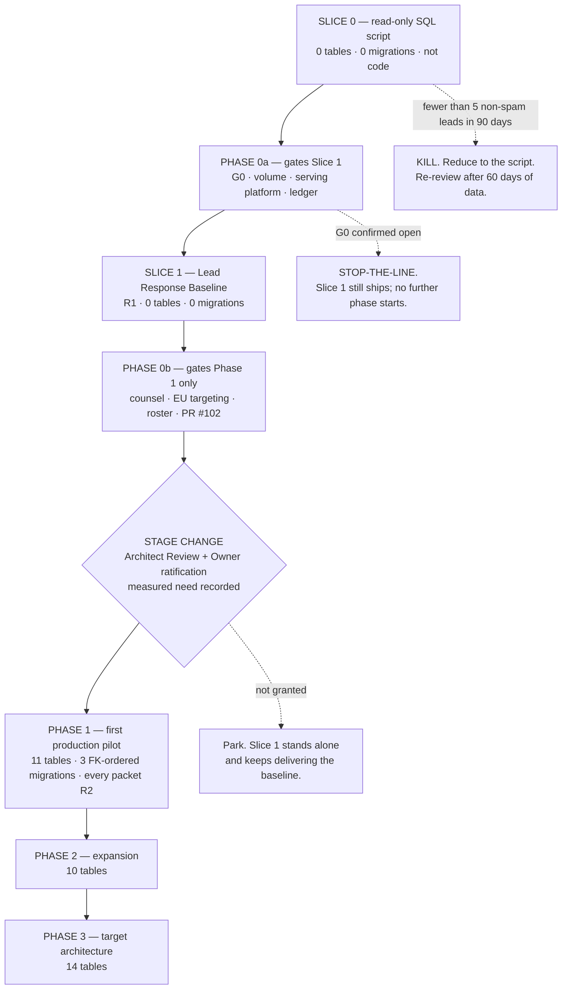
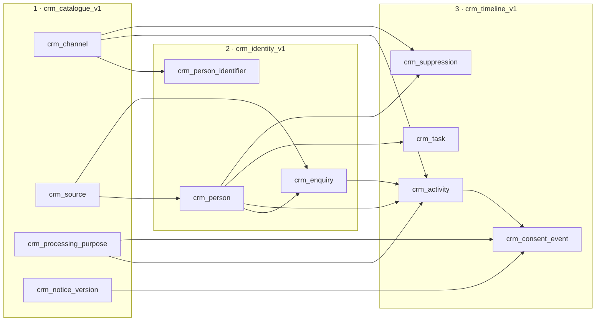

# Forever CRM — Phased Implementation Plan, Backlog, Migration and Risk

Task ID: FOREVER-CRM-ARCH-001
Status: Proposed architecture — not approved, not scheduled, not authorized for implementation
Repository state of record: main @ 821b3c4e2f6f82e0d4ddce86199a8ff24b44a094
Risk class: R0 (documentation only)

> This document is a design record. It asserts no product truth, changes no active stage, and authorizes no implementation. The active stage remains FOREVER-STUDIO-001 (`docs/CURRENT_STAGE.md`), which lists "large CRM integration" as out of scope. Any implementing task is R2 under the shared-contract rule and requires an Architect-reviewed stage change plus Owner approval.

## What this document decides

1. **The first move has no schema and no deploy dependency.** Slice 0 is a checked-in read-only SQL script the Owner runs in the Supabase SQL editor. It answers `docs/ROADMAP.md:228`'s own build-versus-buy trigger and costs nothing.
2. **The second move is R1 and adds zero tables.** Slice 1 is an Owner-only read console over `public.leads` plus the one-line `/contact` repair. Zero `crm_*` tables, zero migrations, zero change to `submitLead`'s transport, zero change to the public INSERT policy.
3. **Phase 0 splits.** Phase 0a gates Slice 1 and contains only what Slice 1 genuinely needs. Phase 0b gates Phase 1 and holds the counsel, EU-targeting, roster and PR #102 questions.
4. **Phase 1 is eleven tables in three FK-ordered migrations**, entered only through a recorded stage change. No pipeline, no opportunity, no decision profile, no merge UI.
5. **Every remaining table carries a phase or a named trigger.** Sixteen tables are cut permanently.
6. **Rollback is stated truthfully**, including the inversion that the step which looks most reversible has the least proven revert.

## 1. The authorisation boundary

| Source | Text | Effect |
|---|---|---|
| `CURRENT_STAGE.md:224` | Out of scope: "large CRM integration" | [Repository fact] No phase here starts as "the CRM". Phase 1 onward needs a *stage change*, not a task approval |
| `CURRENT_STAGE.md:228` | Out of scope: "new architecture-only foundations without a measured current-stage need" | [Repository fact] Schema-first work is forbidden until a measurement exists. Slice 0 and Slice 1 add zero tables for exactly this reason |
| `CURRENT_STAGE.md:212` | In scope: "simple lead-response measurement and alert design where it provides immediate value" | [Repository fact] The sanction Slice 1 runs under. Note the exact words: measurement, and alert **design** |
| `CURRENT_STAGE.md:109` | Active task: "Establish lead-response and guest-feedback baseline" | [Repository fact] Already active, already owned. Slice 1 *is* this task |
| `CURRENT_STAGE.md:196` | Stage metric: "median first-response time" | [Repository fact] A number nothing on `main` can compute |
| `CURRENT_STAGE.md:238` | Acceptance: "no unauthorized import, publication, lead mutation, or production write occurs" | [Repository fact] The one synthetic production write in Phase 0a needs its own Owner gate |
| `ROADMAP.md:141`, Phase 2 | "Advisor conversion system"; vocabulary `new → contacted → qualified → viewing → reserved → closed/lost` | [Repository fact] The CRM's chartered home. Phases 1–3 map onto it rather than proposing a parallel phase |
| `ROADMAP.md:228` | Deferred: external CRM — trigger "lead volume exceeds the simple internal workflow" | [Repository fact] Unevaluable today. Slice 0 makes it evaluable |
| `NORTH_STAR:266-272, :292` | WIP limit of one guest/product/commercial task; "a phase is not complete solely because code merged"; every substantial task defines a kill or review trigger | [Repository fact] The backlog is a sequence, not parallel streams; every phase exit names an external signal and every phase carries a kill trigger |
| `FOREVER_FACTORY_CONSTITUTION.md:299` | "Any Task Packet touching a shared contract is R2 by definition" | [Repository fact] Database schemas and API contracts are named shared contracts. **Every Phase-1 packet is R2. There is no lighter path** |

**The rule this plan adopts.** Slice 0 is evidence, not code. Slice 1 executes as the already-active lead-response baseline task, produces no CRM schema and is justified by measurement. Phase 1 and beyond may be *proposed* now and may not be *started* until an Architect-reviewed stage transition records a measured need. The boundary between Slice 1 and Phase 1 is a governance boundary, not an engineering one.

This document proposes **no edit to `docs/CURRENT_STAGE.md`** and introduces **no `ADR-N` numbering scheme** ([Repository fact] zero matches across `docs/`). If committed, `docs/FOREVER_DOC_INDEX.md` gains a row in the same change with `Required-first-read = Conditional`.

## 2. Slice 0 — today, zero code, zero deploy dependency

A checked-in read-only SQL script under `scripts/` — proposed path `scripts/crm/lead-volume-baseline.sql` — run by the Owner in the Supabase SQL editor as `service_role`. It writes nothing. It returns, **as counts only**:

| # | Output |
|---|---|
| 1 | Total leads |
| 2 | Leads by calendar month |
| 3 | Leads by `source` |
| 4 | Leads by `status` |
| 5 | `count(DISTINCT lower(email))` |
| 6 | `count(*) WHERE project_slug IS NULL` |
| 7 | `count(*) WHERE source = 'booth'` |
| 8 | Earliest and latest `created_at` |

That is the whole of `ROADMAP.md:228`'s build-versus-buy trigger, answered with no code, no migration and no dependency on a deployment that is BLOCKED under Cloudflare verdict E. It also produces the number that decides whether the rest of this programme should exist.

[Repository fact] `public.leads` has no `SELECT` policy and no `SELECT` grant, and no code in `src/` ever reads it — repo-wide `from("leads")` returns exactly two hits, one browser `INSERT` and one test string literal. Only `service_role` can read a lead today, which is why the script and not a screen is the first step.

**No percentage appears in the output.** Row 5 is a count of distinct emails, not a duplicate rate. Row 6 is a count of context-losing enquiries, not a loss rate.

## 3. Slice 1 — the Lead Response Baseline

**Zero `crm_*` tables. Zero migrations. Zero change to `submitLead`'s transport. Zero change to the public INSERT policy. R1.**

### 3.1 The six components

| # | Component |
|---|---|
| 1 | `src/features/forever-crm/crm.functions.ts` — `crmListLeads`, `crmGetLeadCounts` behind `requireSupabaseAuth → requireStudioMember → resolveStudioActor`, service-role client reached only by dynamic `await import()`, wrapped in the redacting error envelope |
| 2 | **`assertOwner`** — all endpoints gate on `actor.role === 'owner'` |
| 3 | One authenticated route: newest-first lead list with age, count-by-month, count-by-source. Phone-usable |
| 4 | **`contact.tsx` forwards `?project=` and `?unit=` into `<ContactForm>`** — a props change, no schema |
| 5 | The un-ingested detector, computed on demand from the same read path |
| 6 | Every new client-reachable file appended to `CLIENT_REACHABLE` |

[Repository fact] `studio_members.role CHECK (role IN ('owner','trusted_publisher'))` — every publisher passes `requireStudioMember`, so component 2 is not optional. Publishing a project has never implied reading a buyer, and Slice 1's rows are real buyer names, emails, phones and free-text messages.

[Repository fact] `public.leads` is one of the 17 tables already present in `src/integrations/supabase/types.ts`, so Slice 1 needs no type work — the only increment in this plan for which that is true.

One feature directory for the whole programme: `src/features/forever-crm/`, matching the `forever-studio` precedent.

Response marking (`public.audit_log` with `action = 'crm.lead.first_response'`) and the coverage checks follow **as a separate PR, only if Slice 1 is being used.** The alert-design record moves to Phase 1. The `audit_log` ACL hardening becomes a standalone R2 hygiene migration tracked outside the slice, because a slice framed as "zero migrations, R1" cannot contain one.

### 3.2 Why this beats every alternative

| Alternative | Why it loses |
|---|---|
| **Start with the schema** | `CURRENT_STAGE.md:228` excludes architecture-only foundations without a measured need, and the measurement does not exist. Building 11 tables before knowing whether Forever receives 3 or 300 enquiries a month is the defect the line was written for |
| **Start with server-side capture (S2)** | R2 (shared contract), produces no number and no screen, and collides with Draft PR #118, which is actively *withdrawing* capture surfaces pending the same G0 gate Slice 0 answers |
| **Start with the decision profile** | Needs `/booth` gated (no `beforeLoad` today), three tables, three Navigator-core changes, and it collides with PR #102's shared-contract lock on `public.leads` |
| **Start with alerts** | Nothing on `main` can send; Workers has no SMTP; and `CURRENT_STAGE.md:212` says alert **design**, not delivery |
| **The simplicity review's Step 1 alone** | Correct but produces only tool usage, which is not on `NORTH_STAR:273`'s list of external signals. The `contact.tsx` repair is the one element that restores commercial evidence on a real guest enquiry, and it costs a props change |
| **The fuller promotion proposed by the over-engineering review** | Right about the external-signal test, wrong to also promote Navigator persistence, which is Phase-1 work behind a stage change |

**The asymmetry that makes this safe:** Slice 1 is deleted by removing two files and one route. Every alternative first move is either irreversible (collected personal data), R2 (shared contract), or blocked on a deploy nobody has demonstrated.

### 3.3 Acceptance criteria

**Functional**

1. The Owner signs in on a phone and sees every lead ever received, newest first, with age.
2. A `trusted_publisher` who is not the Owner is denied with the same stable code as a missing record — proven by a test mirroring `src/features/forever-studio/tests/authorization.test.ts`.
3. The console renders total, by month, by source, by status, distinct emails, NULL `project_slug`, booth-sourced.
4. `/contact?project=x&unit=y` produces a submitted payload with `project_slug='x'` — asserted by a component test.
5. The un-ingested count renders and reads 0.

**Negative — each is a test**

6. No `%` character is rendered for any ratio whose denominator is under 30. Fixtures at n = 0, 1, 9, 10, 29, 30. [Web research — Wilson interval: 3 of 20 = 15% with a 95% CI of 5.2%–36.1%; https://www.itl.nist.gov/div898/handbook/prc/section2/prc241.htm]
7. No handler issues an `UPDATE` against `public.leads`; a source-level test greps for it.
8. No `crm_*` table, no migration, no `SELECT` policy or grant on `public.leads` for `anon`/`authenticated`.
9. `bundle-boundary.test.ts` passes with the new files enumerated.
10. `src/lib/lead-service.ts` is byte-identical; `validateLead` / `hasLeadValidationErrors` / `LeadFormValues` unchanged.

**External signal** (`NORTH_STAR:273` — "a phase is not complete solely because code merged")

11. Within 14 days of ship: at least one guest enquiry arrives with its project context intact and is responded to; and the Owner can state last month's enquiry count without opening Supabase.

### 3.4 Kill and review triggers

| Type | Condition | Response |
|---|---|---|
| **KILL** | The Owner does not open the console in any 14-day window | Stop the programme; re-evaluate against buying. [Web research — NAR 2025, n>1,200: CRM is the #2 lead source at 23%, absent from the most-used-technology list, and agents abandon CRMs that cost them time; building does not fix that — https://www.nar.realtor/research-and-statistics/research-reports/realtor-technology-survey] |
| **KILL** | Slice 0 shows fewer than 5 non-spam leads in the trailing 90 days | Reduce to the script; re-review after 60 days of data |
| **STOP-THE-LINE** | Gate G0 confirmed open — no lead has ever arrived end-to-end | Slice 1 still ships (it costs nothing and it *proves* G0 either way), but no further phase starts until delivery is repaired and the quarantine path exists |
| **REVIEW** | More than 30% of leads are marked spam | The real problem is quarantine, not pipeline; re-sequence |
| **REVIEW** | Fewer than half of non-spam enquiries have any recorded response within 7 days after 8 weeks | The design is failing the adoption test; the answer is a **smaller** surface, not more features |

### 3.5 Standing rule

[Recommendation] *No lead in this console may be used for marketing.* Slice 1 supports **responding to an enquiry**, which sits on PDPA s.24(3) pre-contractual necessity and requires no consent. The moment any lead is added to a campaign, `crm_consent_event` and `crm_suppression` (Phase 1) become prerequisites, because the s.32(2) direct-marketing objection is absolute with no rebuttal. **Descriptive only, not legal advice; qualified Thai counsel required.**

### 3.6 Degraded variant

[Recommendation] If Phase 0a shows the public site is served by a platform that cannot execute a TanStack server function, Slice 1's read path has nowhere to run. The programme falls back to Slice 0 alone plus a manual dated first-response log until issue #103 resolves the host question. Lower value, same numbers, zero risk. **The measurement does not wait for Cloudflare.**

## 4. Phase 0 — split by what it actually gates

### 4.1 Phase 0a — gates Slice 1

Four items, and no more. Gating a read-only console behind a counsel engagement delays the one measurement that unblocks `ROADMAP.md:228` by weeks for no risk reduction.

| ID | Question | Method | Bad answer means |
|---|---|---|---|
| `FOREVER-CRM-001` | **Has a lead ever arrived end-to-end (gate G0)?** [Repository fact] Draft PR #118 asserts G0 verbatim and withdraws four capture surfaces because of it | One synthetic lead through the **production** public form with a sentinel string, read back as `service_role`. **Owner gate required — one production write under `CURRENT_STAGE.md:238`.** The sentinel row is marked and retained, so cleanup is not a second unauthorised write | Stop-the-line. Everything downstream halts until delivery is repaired |
| `FOREVER-CRM-002` | **What is the actual lead volume and history?** | Slice 0's script. Counts only | Volume near zero → the §3.4 kill trigger fires |
| `FOREVER-CRM-003` | **Where is the public site served from, and can it execute a `createServerFn`?** [Repository fact] the repo contains `.lovable/project.json`; `vite.config.ts:47-48` refers to "the lovable wrapper"; Nitro is "build-only using cloudflare as a default target"; issue #103 §A lists "public site deployment identity" as a thing to reconstruct | Issue #103 §A read-only reconstruction: resolve DNS for the public hostname, identify the serving platform, confirm one existing `createServerFn` endpoint responds in production | Stop-the-line for Slice 1. Falls back to §3.6 |
| `FOREVER-CRM-004` | **Live ACL and migration-ledger reconciliation.** [Repository fact] three committed migrations declare themselves unapplied, so migration text is the design of record, not proof of live state | Read `supabase_migrations.schema_migrations` and diff against `supabase/migrations/`; read `information_schema.role_table_grants` for `public.leads` and `public.audit_log` | Ledger drift → no CRM migration may be planned until the true applied set is known |

**Exit.** CRM-001 answered yes with a retained sentinel row, or a delivery defect is filed and the programme suspends. CRM-002 produces the eight-row count table. CRM-003 names the serving platform from an authoritative system, or Slice 1 is explicitly blocked. CRM-004 produces the true applied-migration set and the live grant list.

**Measurable business outcome.** One number the business has never had: how many real enquiries Forever receives per month, from which surfaces. Produced with zero code.

### 4.2 Phase 0b — gates Phase 1 only

| ID | Question | Answered by | Consequence of a late answer |
|---|---|---|---|
| `FOREVER-CRM-005` | **Where do buyer WhatsApp conversations live — a company-owned Business App number, or advisors' personal accounts?** [Repository fact] zero outbound messaging exists on `main` | Owner interview, not a query | Personal accounts → no ownership claim, no copy of the history, no reassignment path when an advisor leaves. **The largest commercial exposure in this area, and no schema decision touches it.** [Web research] direct Cloud API onboarding of an existing Business App number destroys the history; only a partner supporting business-app onboarding preserves it — https://developers.facebook.com/documentation/business-messaging/whatsapp/solution-providers/migrate-existing-whatsapp-number-to-a-business-account/ |
| `FOREVER-CRM-006` | **PDPA s.95 — what purpose did the historic form state at collection, and has the withdrawal-method publication duty been discharged?** [Repository fact] neither `ContactForm.tsx` nor `BoothLeadForm.tsx` renders any consent checkbox, notice or opt-in; `public.leads` has no consent column | `git log -p` on the form components across the collection window, then **qualified Thai counsel** | Unknown purpose → legacy rows are usable only for responding to their own enquiry, never for marketing. §7.3 makes that structural. **Descriptive only, not legal advice** |
| `FOREVER-CRM-007` | **Does Forever deliberately target the EU?** [Web research] per EDPB Guidelines 3/2018 the trigger is targeting, not buyer nationality — https://www.edpb.europa.eu/our-work-tools/our-documents/guidelines/guidelines-32018-territorial-scope-gdpr-article-3-version_en | Owner decision, recorded in `DECISIONS.md` with the review trigger "the first EU-geotargeted ad spend, EU-language landing page, or EUR-denominated price" | A late "yes" means retrofitting an Art 27 representative and dual DSR clocks into a schema built for one regime |
| `FOREVER-CRM-008` | **Which actor roster does the CRM use?** [Repository fact] `studio_members` is the only authorization source; its two-value CHECK is a *publishing* vocabulary; Draft PR #102 chose an additive-boolean path | Architect + Owner, recorded in `DECISIONS.md` | A second identity roster (forbidden) or rework of every CRM endpoint |
| `FOREVER-CRM-009` | **Does the CRM converge with, ignore or supersede Draft PR #102?** [Repository fact, PROVISIONAL] #102 makes `leads.email` NULLABLE, binds `booth_sessions.lead_id` UNIQUE, makes funnel events once-only, freezes terminal sessions against any UPDATE including `service_role`, and enforces consent as a database CHECK | Architect + Owner, **before either branch advances** | Two parallel lead sources in one table, or rework of a merged branch |
| `FOREVER-CRM-010` | **Is the deployed Worker's `scheduled()` export live?** [Repository fact] the code path is complete and tested, but `wrangler.jsonc`'s header states "nothing in this repository deploys it", there is no `.github/`, and rollout is BLOCKED under verdict E | Owner, under issue #103 Gate B/D | Unknown → **no phase may add a cron consumer.** Slice 1 is deliberately cron-free |

**Two findings Phase 0 will produce that this plan already assumes.** [Inference] (1) *Historic* first-response time is not derivable from the database at all — `public.leads` has `created_at` and nothing else temporal, and `status` has never been written by any code, so a distribution reading 100% `new` proves nobody used the column, not that nobody responded. Only *forward* response time is measurable. (2) `/contact` accepts `?project=` and `?unit=`, renders them, and does not forward them to the form, so those leads land with `project_slug` NULL — repaired inside Slice 1.

## 5. Phases 1–3

### 5.1 The corrected phasing

| Phase | Tables | Entry gate |
|---|---|---|
| Slice 0 | **0** | none — not code |
| Slice 1 | **0** | Phase 0a answered; WIP slot available. R1 |
| Phase 1 | **11** | recorded stage change; every packet R2 |
| Phase 2 | **10** | Phase 1 exit criteria met with an external signal |
| Phase 3 | **14** | Phase 2 exit; first reservation or first data-subject request |
| Deferred behind a named trigger | 4 | see §6 |
| **Cut permanently** | 16 | see §6 |

Target architecture: **39 tables. Buildable now: 0.** The two numbers are deliberately different, and the operative rule is that no phase may propose more schema than one reviewer can hold in mind while checking every foreign key, every CHECK and every trigger interaction.

### 5.2 Phase 1 — first production pilot

**Entry condition: a recorded stage change.** Phase 1 is "large CRM integration" in every meaningful sense and cannot begin under FOREVER-STUDIO-001.

**Objective.** One advisor works real inbound enquiries through a Forever-owned surface, with the write path server-side, identity deduplicated, and a lawful basis recorded for every record.

**The eleven tables, in three FK-ordered migrations.** Every FK target precedes its referent; the chain applies in filename order by construction.

`crm_activity` is created with a **narrow context arc** — `person_id NOT NULL` plus `enquiry_id` as the only context column — and is widened by `ALTER` in later phases. Adding columns is permitted by the DB change rules, and dropping and re-adding a CHECK constraint is not removing a column or a table. The final state is equivalent to the target model in `docs/crm/CRM_DOMAIN_MODEL.md`.

**Deliberately not in Phase 1:** pipeline, opportunity, stage, appointment, decision profile, merge UI, attribution table, unit hold, reservation. A pilot that cannot record a deal is still a pilot that answers buyers correctly and lawfully, and the pipeline is worth nothing over untrustworthy intake.

**Exit criteria.** Every new enquiry produces exactly one `crm_enquiry` and exactly one `crm_person`, with deterministic identifier dedupe proven on a returning buyer. A consent event or a recorded non-consent lawful basis exists for every enquiry captured after the migration. Every legacy-derived person carries a `crm_suppression(scope='marketing', source='legacy_backfill')` row. **The un-ingested count reads 0** — a non-zero value is an exit blocker, not a warning. External signal: **one advisor other than the Owner has worked at least five real enquiries through it.**

**Kill / review trigger.**
> **Kill:** the un-ingested count is non-zero for more than 7 consecutive days → the server-side capture path did not work; roll back to Slice 1 and re-diagnose before adding any further table.
> **Review:** one wrong deterministic link (two different people attached to one `crm_person`) → stop and re-examine canonicalisation before any merge work is scheduled. [Web research] Reversibility is what makes this survivable: HubSpot documents plainly that it is not possible to unmerge records — https://knowledge.hubspot.com/records/merge-records — whereas Salesforce keeps a `MasterRecordId` pointer on the loser — https://developer.salesforce.com/docs/atlas.en-us.api.meta/api/sforce_api_calls_merge.htm

### 5.3 Phase 2 — expansion (10 tables)

`crm_enquiry_attribution`, `crm_person_role`, `crm_pipeline`, `crm_pipeline_stage`, `crm_opportunity`, `crm_opportunity_contact`, `crm_person_interest`, `crm_appointment`, `crm_merge_candidate`, `crm_person_merge`; plus the `ALTER`s widening `crm_activity`'s context arc.

One seeded pipeline (`buyer_advisory`) whose stages are a superset-compatible mapping of `ROADMAP.md:141`'s `new → contacted → qualified → viewing → reserved → closed/lost`. `crm_pipeline_stage.target_time_in_status_hours` is seeded **NULL** for `qualified`, `viewing` and `reserved`; the Owner sets them from observed cycle time once twelve transitions exist, and the dwell tile renders "Not configured", never 0.

**Exit criteria.** Stage dwell is queryable and at least one stage carries a non-null target. [Web research] Stage-dwell targets are the highest return per unit of complexity in the research set: at low volume and very high deal value, a stalled enquiry is the most expensive failure mode — https://docs.attio.com/rest-api/attribute-types/attribute-types-status External signal: **at least one viewing is recorded through the system.**

**Kill / review trigger.**
> **Kill:** after 60 days, more than half of open opportunities have a `stage_entered_at` older than 30 days and no `next_action_at` → the pipeline is a graveyard; stop adding tables and fix the working habit.
> **Review:** anyone asks for a per-advisor conversion rate → the number is not storable by design and not renderable at this volume. Wins per advisor as a **count** is available; the ratio is not.

### 5.4 Phase 3 — target architecture (14 tables)

`crm_questionnaire_option`, `crm_decision_profile`, `crm_decision_answer`, `crm_party_group`, `crm_party_group_member`, `crm_referral`, `crm_opportunity_credit`, `crm_unit_hold`, `crm_reservation`, `crm_reservation_requirement`, `crm_retention_hold`, `crm_dsr_request`, `crm_unsubscribe_token`, `crm_rate_bucket`.

**Named promotion trigger inside Phase 3.** If Slice 0's booth-sourced count returns **more than 10**, the decision-profile trio (`crm_questionnaire_option`, `crm_decision_profile`, `crm_decision_answer`) is promoted ahead of the rest of Phase 3, with `/booth` gating (`FOREVER-CRM-092`) as a hard prerequisite. If it returns **0**, the structured-intent loss is hypothetical and the trio waits. [Repository fact] `buildBoothLeadPayload` flattens budget band, timeline, motivations, goals, concerns, archetype, recommendation, every match reason **and the internal `staffNote`** into one plaintext `leads.message` blob, so every booth session before the fix destroys structure permanently and puts an internal note in the same column as guest-visible content.

**Exit criteria.** A reservation can be recorded end-to-end with dates as the source of truth and status as a projection. A data-subject erasure request can be executed and evidenced, honouring AML retention holds partially rather than all-or-nothing, so `erasure_state` reads `partial` truthfully. External signal: **at least one reservation or closed transaction in which Forever materially influenced the guest's decision, recorded in the system.**

**Kill / review trigger.**
> **Review:** the first reservation reaching `spa_signed_on` fires the deferred commission and instalment-schedule decisions (§6).
> **Kill:** `crm_reservation` holds zero rows 90 days after shipping → the commitment layer was built ahead of the business; further governance tables are parked.

## 6. Every remaining table has a phase or a trigger

### 6.1 Deferred behind a named trigger

| Table | Trigger that builds it |
|---|---|
| `crm_trip` | The first buyer visit spanning more than one day. `inspection_trip` retires from `appointment_type` at the same time, because it was never a meeting |
| `crm_reservation_unit` | The first reservation covering more than one unit |
| `crm_commission_claim` | The first `crm_reservation` row reaching `spa_signed_on` — **not** the first dispute. Credit must be recorded before a dispute to be evidence of anything |
| `crm_job` | A messaging gateway is bought. One queue, at-most-once, `valid_until` on every deferred send, per-person cap counted from reservations rather than completions |

### 6.2 Cut permanently (16 tables)

| Cut | Reason |
|---|---|
| `crm_policy`, `crm_policy_version`, `crm_automation`, `crm_automation_step`, `crm_automation_field`, `crm_automation_run`, `crm_automation_step_outcome`, `crm_automation_control` and the six routing tables (14) | Fifteen invariants, three guard triggers and a four-level kill switch existed to schedule five nightly `SELECT` statements. The five coverage sweeps ship as five named SQL functions behind the existing server-function boundary; the eleven policy numbers become TypeScript constants in one file with review triggers in comments. Reintroduce an engine at the section's own stated threshold of sustained >200 new enquiries/month |
| `crm_ai_generation` | No AI-written field a deterministic path can read. [Web research] HubSpot's documented failure mode is the rule to steal verbatim — when credits run out "the action will fail and any outputs used will populate with an empty value" — https://knowledge.hubspot.com/workflows/use-breeze-to-research-and-summarize-data-in-workflows |
| `crm_record_history` | `public.audit_log` is generic by construction and the reuse map already directs reusing the TABLE with `crm_*` action values and populated `old_values`/`new_values`. `crm_record_history` was churn *and* the holder of un-erasable JSONB copies of every buyer's name |
| `crm_ropa_v1` | 500+ mandatory column comments and a build-breaking test, for a generated half that is a column census while the legally load-bearing half stays hand-maintained inside the view body. The ROPA is a markdown table in `docs/` with a review trigger until counsel confirms the duty applies |

### 6.3 Deferred capabilities, with the trigger for each

| Deferred | Trigger |
|---|---|
| Push lead alerts (email / WhatsApp / SMS) | A server-side moment exists **and** `FOREVER-CRM-010` is yes **and** an outbound provider is approved. Until then `FOREVER-CRM-029` delivers the design only. [Repository fact] Workers has no SMTP and no subprocess |
| Any second consumer of the `cloudflare:scheduled` hook | `FOREVER-CRM-010` confirms the deployed `scheduled()` export is live. When added it must yield to the Studio tick, carry a wall-clock deadline checked between every job, and render its own `last_run_at` |
| Any inbound webhook endpoint | A provider exists. When it comes: per-provider route files, no wildcard `$provider`, startup assertion that every configured provider has a non-empty secret |
| The `units_touched` project-change watch | A canonical `unit_availability_history` table exists. `units.updated_at` is bumped by any column write including the price projection, so the signal is not derivable and emitting it produces unbounded "check it" tasks |
| Instalment / payment schedules | The first reservation reaching `spa_signed_on`, or the first buyer missing an instalment because nobody was tracking it. [Web research] https://knowledge.spark.re/conveyancing-deposit-structure-settings |
| Routing rules | More than one advisor plausibly owning the same inbound enquiry. [Web research] https://help.lofty.com/hc/en-us/articles/360055177831-Lead-Routing-How-to-set-up-lead-routing-rules |
| Campaign as a table | Paid spend attributable to more than one campaign in a single month |
| Any numeric score, confidence, probability, rank or conversion rate — persisted or rendered; and per-advisor conversion comparison at any volume | Never on current evidence. `CURRENT_STAGE.md:221-222` lists "a new Decision Engine" and "new scoring systems" as out of scope, no approved evidence-backed calculation rule exists, and the Wilson-interval evidence makes rates uninterpretable at this volume. The comparison ban lifts only at ≥30 matured opportunities per advisor **and** an assignment mechanism making lead mix comparable — both, not either. Wins per advisor as a **count** is permitted |
| Call recording / transcription | An explicit counsel opinion, nothing less |
| Document generation, e-signature, contract PDFs | A hosted HTTP-API provider is chosen. Workers cannot run PDF generation, office rendering or headless browsers |
| Calendar two-way sync; bidirectional sync with any external CRM | Never, on current evidence. [Web research] Google push notifications carry no body, channels have no auto-renewal, and Google states notifications are not 100% reliable — https://developers.google.com/workspace/calendar/api/guides/push Use `.ics` and invite links. If a messaging gateway is bought it writes one-way into Supabase, which stays sole system of record |
| Breach register | Its own governance record, or the first incident. It is platform-level and covers all processing; placing it under `crm_*` would assign it the wrong owner |
| Dual-regime (GDPR) machinery | `FOREVER-CRM-007` answered **yes** |
| `auth.uid()` / `auth.jwt()` RLS, `FORCE ROW LEVEL SECURITY`, a second identity roster, a second service-role key path, column-level `GRANT UPDATE` | A separately justified architectural decision with its own `DECISIONS.md` entry — never as a CRM implementation detail. [Repository fact] all five have zero occurrences across the 24 migrations, and this design creates no pressure toward any of them: every CRM table is service-role-only and unreachable from PostgREST |
| Supabase types regeneration as a script | A *blocker-removal* task, not a feature: `FOREVER-CRM-090`. It becomes mandatory the moment the first `crm_*` table ships |

## 7. Migration and compatibility strategy

### 7.1 The migration register

This document is the single allocator of CRM migration filenames. Every sibling document references a row here rather than allocating a number. **Every filename is strictly above `20260728160000`** — [Repository fact] the current high-water mark, occupied by Draft PR #119; migrations apply in filename order, so a lower number would apply *before* pending Studio work and silently change the intended sequence.

| # | Filename | Owner phase | Contents | Ordering dependency |
|---|---|---|---|---|
| 1 | `20260729080000_audit_log_acl_hardening.sql` | Hygiene (`FOREVER-CRM-093`) | `REVOKE ALL ON TABLE public.audit_log FROM PUBLIC, anon, authenticated` | None. Standalone and independently valuable |
| 2 | `20260729090000_crm_member_access.sql` | Phase 1 prerequisite (`FOREVER-CRM-019`) | One additive column on `public.studio_members` per `FOREVER-CRM-008`'s decision | Must precede every CRM endpoint that reads it |
| 3 | `20260729100000_crm_catalogue_v1.sql` | Phase 1 (`FOREVER-CRM-021`) | `crm_channel`, `crm_source`, `crm_processing_purpose`, `crm_notice_version` + seeds | First. Every later FK target lives here |
| 4 | `20260729101000_crm_identity_v1.sql` | Phase 1 (`FOREVER-CRM-022`) | `crm_person`, `crm_person_identifier`, `crm_enquiry`; `pg_trgm` | After 3 |
| 5 | `20260729102000_crm_timeline_v1.sql` | Phase 1 (`FOREVER-CRM-023`) | `crm_activity`, `crm_task`, then `crm_consent_event`, `crm_suppression` | After 4. `crm_activity` **before** `crm_consent_event` |
| 6 | `20260729103000_crm_leads_compat_v1.sql` | Phase 1 (`FOREVER-CRM-024`) | `BEFORE UPDATE` status-freeze trigger on `public.leads` + two corrected `COMMENT`s. **Zero tables, zero columns** | After 4 |

Later phases allocate their own rows in this register when their stage gate is passed. No sibling document may allocate a number.

### 7.2 The one-sentence compatibility rule

`public.leads` keeps its exact 12 columns, its five CHECKs, its four indexes, its `GRANT INSERT TO anon, authenticated` and its single `"Anyone can submit a lead"` policy. The CRM links to it one-directionally through `crm_enquiry.legacy_lead_id UUID UNIQUE`, **with no foreign key**, and the only DDL ever applied to `leads` is one guard trigger and two comments.

**Why no foreign key.** [Recommendation] Adding `leads.crm_enquiry_id UUID REFERENCES crm_enquiry(id)` would create a column `anon` can write through the existing INSERT policy. A FK violation and a successful insert are distinguishable, which is an existence oracle over an internal table. Fixing it would mean modifying the public INSERT policy by DROP-then-CREATE — a security-boundary change. Putting the pointer on the internal side avoids the class entirely.

**The corrected `COMMENT`.** The proposed text is `'Public intake mirror. Not complete: the authoritative intake record is public.crm_enquiry.'` The reuse map marks `public.leads` `[extend]` with an instruction not to fork it; this design deviates, and the deviation is *argued* in `docs/crm/CRM_DECISION_RECORDS.md` rather than assumed. A false comment is the one piece of documentation that travels with the schema.

**The `leads_status_valid` CHECK is never widened.** Widening it would let a future writer put pipeline stages there and re-fork the truth the CRM exists to unify.

### 7.3 Legacy backfill — conservative, and suppressed by default

| Rule | Reason |
|---|---|
| `capture_mode = 'legacy_form'` | Historic rows stay distinguishable from anything captured after the CRM exists |
| Unknown `leads.source` → `import_legacy`, original preserved in `source_raw` | [Repository fact] `leads.source` has no CHECK constraint, so arbitrary values may exist and the FK to `crm_source` must not fail the backfill |
| `s25_notice_required` defaults to `true` when the source is unknown | Fail-closed. Missing evidence produces the restrictive answer |
| `triage_state = 'unprocessed'`; **no person or identifier created** | A human triage step creates the person. Bulk-creating persons from unvalidated historic rows would poison the dedupe universe on day one |
| `leads.message` copied verbatim to `crm_enquiry.message_text` and **never parsed** | It is a prose blob. Parsing it into structure would fabricate structure that was never captured as structure |
| Every person created from a legacy enquiry gets `crm_suppression(channel='all', scope='marketing', source='legacy_backfill')` **in the same transaction** | The s.32(2) objection is absolute. Responding to that person's own enquiry is not marketing; adding them to a campaign is |
| `crm_consent_event` stays **empty** for legacy persons | There is no consent to record. [Web research] the July 2026 PDPC draft guidance cautions against treating consent as a default or catch-all basis — https://www.lexology.com/library/detail.aspx?g=27642f25-1b92-4c09-b8ff-b4b1c4f27467 The lawful basis is recorded through `crm_processing_purpose`, not through a fabricated consent |

**Descriptive only, not legal advice; qualified Thai counsel must confirm.** Two questions stay open and belong to the Owner and counsel: what purpose the historic form actually stated at collection (`FOREVER-CRM-006`), and whether the s.95 withdrawal-method publication duty has been discharged.

### 7.4 Backward compatibility for the live public forms

| Stage | Website write path | CRM ingestion | Public form behaviour |
|---|---|---|---|
| Now / Slice 1 | browser → PostgREST anon `INSERT INTO leads` | read only | **Unchanged. Zero risk** |
| Phase 1a | unchanged | backfill + triage; un-ingested detector on demand | **Unchanged** |
| Phase 1b (`FOREVER-CRM-025`) | behind a `createServerFn` | one service-role RPC writes `public.leads` **and** `crm_enquiry` in one transaction | Validation contract byte-identical. The anon INSERT grant and policy **remain in place** as the fallback path |
| Phase 2+ | unchanged | attribution, rate limiting and consent capture become possible | Consent checkbox added — a visible change, and the first one requiring counsel review |

**Deliberate non-removal.** Removing the `anon` INSERT grant would make the server function a single point of failure for the only revenue-bearing input Forever has, and the DB change rules forbid removing the contract the website depends on.

### 7.5 Read-only pre-apply check

[Repository fact] `docs/CODEX_OPERATING_MANUAL.md:60-68`: never modify schema without a migration; never remove tables or columns; "Prefer dry-run, staging, or validation workflows before any real database operation." Every step below is read-only and any failure stops the apply.

| # | Check | Failure means |
|---|---|---|
| 1 | **Identity** — the connected database is the intended project; TLS verified | Wrong target. Stop |
| 2 | **Ledger** — `supabase_migrations.schema_migrations` diffed against `supabase/migrations/`; the pending set and its order recorded | Drift. Stop until `FOREVER-CRM-004` reconciles it |
| 3 | **The `20260723130000` question** — is the intentionally-UNAPPLIED `public_projection_privacy.sql` applied? | If pending and applied *after* a CRM migration, its column-less `REVOKE` strips a later column grant. Sequence explicitly |
| 4 | **Baselines** — `role_table_grants` for `leads`, `audit_log` and every table touched; `leads` count and max `created_at`; `audit_log` count | Nothing. These are the diff and rollback baselines |
| 5 | **Extension availability** — `pg_trgm` present or installable (`pgcrypto` is already installed); PostgreSQL major version confirmed, because every CRM view is the repository's first and `security_invoker` must be available | The identity migration cannot apply, or the view posture cannot be asserted. Stop |
| 6 | **Name collision** — no existing object named `crm_*`; every filename strictly above the current high-water mark | Rename before applying |
| 7 | **Dry run** — `npm run studio:pg-test` applies the full committed chain plus the new files on a disposable cluster | The chain does not apply cleanly in real order. Stop |
| 8 | **Contract test** — the `crm-migration-contract.test.ts` twin passes against the migration **text** | An RLS / GRANT / REVOKE / `search_path` statement is missing. Stop |
| 9 | **Combined scheduled-tick measurement**, if any cron consumer is being added | The CRM consumer does not yield inside the invocation. Stop |
| 10 | **Worker rollback target recorded** — the current deployed version id | See §7.6. This is the weakest link and must be recorded even when it cannot be exercised |

### 7.6 Rollback truth

| Step | What rollback actually is | Honest assessment |
|---|---|---|
| Slice 0 | Delete a file | Not code. Nothing to roll back |
| Slice 1 | Delete the feature directory and the route; revert the deploy | **Genuinely reversible.** No schema, no data, no contract. The strongest reason to do it first |
| `audit_log` REVOKE | A forward migration re-granting | Reversible, and the rollback is worse than the change — the grant should never have existed |
| A new `crm_*` table, never written | **Leave it. Never `DROP`** | The DB rules forbid removing tables. An empty table with RLS on, zero policies and no anon grants is inert. **Rollback is forward-only** |
| A new `crm_*` table, written | Not reversible in the sense people mean | Deleting rows does not un-collect personal data if a backup retains it, and PDPA erasure is 90 days **including copies and backups** — https://www.lawplusltd.com/2024/08/rules-on-deletion-destruction-or-anonymization-of-personal-data/ Treat the *first write* as the irreversible moment, not the migration |
| `leads` status-freeze trigger | `DROP TRIGGER` in a forward migration | Cheaply reversible, and the only DDL touching a public write contract. It will break any future code that tries to update `leads.status` — which is the point |
| `FOREVER-CRM-025` (submitLead behind a server function) | Revert the application deploy | **The weakest rollback in the plan, and it looks like the strongest.** [Repository fact] There is no `.github/` and no deploy script; nothing in the repository deploys the Worker; Cloudflare version rollback is exactly what remains unverified under verdict E. Because the anon INSERT grant is retained, the *data* path survives a bad deploy — the *code* path has no proven revert. **Do not schedule this until issue #103 has demonstrated a Worker version rollback at least once** |
| Legacy backfill | `DELETE FROM crm_enquiry WHERE legacy_lead_id IS NOT NULL AND triage_state = 'unprocessed'` | Reversible inside a narrow window. After triage creates persons and activities the window closes, so backfill and triage must be separate approved steps |

## 8. The backlog

### 8.1 Task-ID scheme

[Recommendation] `FOREVER-CRM-<NNN>` **for this family only**, matching the dominant `FOREVER-<AREA>-<NNN>` shape already in use (`FOREVER-STUDIO-001`, `FOREVER-TRUTH-001A`, `FOREVER-DD-001`), with a single optional uppercase suffix for a sub-checkpoint of one approved packet. This is a naming convention within the CRM family, not a repository-wide governance change. `docs/BACKLOG.md` keeps its ID-free bullets; this document is the ID register. **No `ADR-N` scheme is introduced.**

| Block | Meaning |
|---|---|
| `000` | Slice 0 |
| `001`–`004` | Phase 0a — gates Slice 1 |
| `005`–`010` | Phase 0b — gates Phase 1 |
| `011`–`018` | Slice 1 and its follow-ons |
| `019`–`039` | Phase 1 |
| `040`–`059` | Phase 2 |
| `060`–`079` | Phase 3 |
| `090`–`099` | Cross-cutting hygiene and blocker removal |

### 8.2 Decomposed backlog

**Risk classes** (`FOREVER_FACTORY_CONSTITUTION.md` §8): **R0** reversible and inert; **R1** product code behind deterministic gates; **R2** structural or truth-adjacent — different author and reviewer, adversarial review, Owner approval before merge; **R3** constitutional, external, privileged, financial, legal or production.

**Slice 0 and Phase 0a**

| ID | Finished result | Depends on | Risk | Migration | Acceptance | Test strategy |
|---|---|---|---|---|---|---|
| `CRM-000` | The read-only script at `scripts/crm/lead-volume-baseline.sql`, checked in | — | **R0** | none | The file contains only `SELECT` statements and returns the eight named outputs. No `%` in any output | A source-level test asserting the file contains no `INSERT`/`UPDATE`/`DELETE`/`ALTER`/`DROP`/`CREATE` |
| `CRM-001` | One synthetic lead submitted through the production public form and read back; a written G0 verdict Draft PR #118 can cite | Owner gate for one production write; `CRM-003` for host identity | **R3** | none | A `leads` row containing the sentinel exists with its `created_at` and `source` recorded; a G0 verdict is filed | Manual, Owner-gated. Evidence is the recorded SQL output |
| `CRM-002` | The eight-row count table, with the exact SQL used | `CRM-000`, `CRM-001` | **R0** | none | Eight counts recorded. **No percentage in the output** | Manual. A reviewer re-runs the same SQL and gets the same numbers |
| `CRM-003` | The production serving platform named, and one existing `createServerFn` endpoint proven to respond there | Issue #103 §A | **R0** | none | A yes/no/unknown verdict with the authoritative source named | Manual |
| `CRM-004` | True applied-migration set; live grants on `leads` and `audit_log`; verdict on whether `20260723130000` is applied | — | **R0** | none | The three artefacts exist in writing | Manual. Produces the pre-apply baseline every later migration needs |

**Phase 0b** — `CRM-005` through `CRM-010`, per §4.2. All **R0** as documents (the counsel engagement itself is R3), all zero-migration, all accepted when a `DECISIONS.md` entry exists in the repository's own format `### YYYY-MM-DD — Title` with Decision / Context / Consequence / Review trigger, prepended above the newest existing entry. Review only.

**Slice 1**

| ID | Finished result | Depends on | Risk | Migration | Acceptance | Test strategy |
|---|---|---|---|---|---|---|
| `CRM-011` | `src/features/forever-crm/crm.functions.ts` with `crmListLeads`, `crmGetLeadCounts` and `assertOwner`, behind the existing auth chain, service-role client reached only by dynamic `import()` | `CRM-003`, `CRM-001` | **R1** | **none** | Every endpoint rejects an unauthenticated caller **and a `trusted_publisher`** with one stable error code; no raw PostgREST text reaches the browser; leads return in `created_at DESC` order | Unit tests with `vi.mock`ed Supabase and injected in-memory fakes, mirroring `authorization.test.ts` and `endpoint-envelope.test.ts`. **Plus** the new files appended to `CLIENT_REACHABLE` in `bundle-boundary.test.ts`, statically proving no client-reachable module imports `client.server`, `supabaseAdmin` or `SUPABASE_SERVICE_ROLE_KEY` |
| `CRM-012` | One authenticated route: newest-first list with age, count-by-month, count-by-source. Phone-usable | `CRM-011` | **R1** | **none** | An authenticated Owner sees every lead on a phone viewport; an unauthenticated visitor sees the denial settlement, never data. No `%` rendered at n<30 | `.tsx` component tests in the style of `route-denial-settlement.test.tsx`; pure-function tests over the summariser at n = 0, 1, 9, 10, 29, 30 |
| `CRM-013` | `contact.tsx` forwards `?project=` and `?unit=` into `<ContactForm>` | — | **R1** | **none** | `/contact?project=x&unit=y` produces a submitted payload with `project_slug = 'x'` | Component test on the route plus the form |
| `CRM-014` | The un-ingested detector on the same read path: `public.leads` rows older than 15 minutes with no matching `crm_enquiry.legacy_lead_id` | `CRM-011` | **R1** | **none** | The count renders and reads 0 while no `crm_enquiry` table exists | Unit test over an injected fake. Cron-independent by construction |
| `CRM-016` | *(follow-on, only if Slice 1 is used)* Response and triage marking: `public.audit_log` rows with `action IN ('crm.lead.first_response','crm.lead.marked_spam','crm.lead.marked_duplicate')`, `table_name='leads'`, `record_id=<lead id>`. Never mutates `public.leads` | `CRM-012`, `CRM-093` | **R1** — flag for Architect reclassification to R2 (new action namespace in a shared audit table) | **none** — [Repository fact] `audit_log.action` is `TEXT NOT NULL` with no CHECK | Exactly one row per marking with the exact action string; **a test asserts the handler issues no `UPDATE` against `public.leads`**; double-marking yields the same first-response time (`MIN(created_at)` per `record_id`) | Unit tests over an injected fake, plus a source-level test that greps the CRM feature for `from("leads").update` and fails on any match |
| `CRM-017` | *(follow-on)* Coverage checks: unactioned, ageing buckets, silent 14+ days, with the statistical guard enforced in code | `CRM-016` | **R1** | **none** | Given n=20 leads and 3 responses the rendered output contains **no `%` character**; at n<10 every individual latency is rendered | Pure-function unit tests over the summariser |

[Web research] The coverage definitions follow the one source that defines them precisely: "unactioned" = no outbound call, email or text from the **assigned** advisor, with automated, marketing and batch sends explicitly excluded — https://help.followupboss.com/hc/en-us/articles/4402128249367-Dashboard

**Cross-cutting hygiene** (may run in the data/operations WIP slot)

| ID | Finished result | Depends on | Risk | Migration | Acceptance |
|---|---|---|---|---|---|
| `CRM-090` | A `gen:types` script and a regenerated `src/integrations/supabase/types.ts` covering all live tables; removes the `supabase as unknown as SupabaseClient` escape hatch for new code | `CRM-004` | **R2** — canonical types are a shared contract | none, but **blocks every `crm_*` table** | The generated file's table list is a superset of the migration-derived list |
| `CRM-091` | Navigator core additive prerequisites: stable session id, `profileVersion`, caller-supplied `capturedAt`; `deserializeSession` gains a version check. **No answer field restructured** | — | **R1** | none | `deserializeSession` rejects a payload whose `profileVersion` is absent or unrecognised; the existing Navigator core suites pass unchanged; a test asserts the `NavigatorAnswers` key set is unchanged |
| `CRM-092` | `/booth` gated behind the Studio auth chain — `src/routes/booth.tsx` gains the `beforeLoad` pattern `src/routes/studio.tsx` already uses | `CRM-009` | **R1** — arguably R2, it changes an access boundary | none | An unauthenticated request to `/booth` does not render the booth shell |
| `CRM-093` | `audit_log` ACL hardening: `REVOKE ALL ON TABLE public.audit_log FROM PUBLIC, anon, authenticated`, closing the gap versus `20260721123000` | `CRM-004` | **R2** | register row 1 | The migration text contains the exact `REVOKE` statement, pinned by a `*-migration-contract.test.ts` twin reading `supabase/migrations/*.sql` as text |

**Phase 1** — all R2 except where noted; entry requires a recorded stage change.

| ID | Finished result | Depends on | Risk | Migration | Acceptance |
|---|---|---|---|---|---|
| `CRM-019` | The `studio_members` roster column implementing `CRM-008`'s decision. **No second identity table** | `CRM-008` | **R2** | register row 2 | The column exists; the CRM capability map reads it; no new roster table is created |
| `CRM-020` | Stage change and constitutional reconciliation. Reconcile `FOREVER_PRODUCT_SPECIFICATION.md:17` with `FOREVER_BLUEPRINT.md` §13 and `FOREVER_CORE_ARCHITECTURE`'s workflow chain; record the measured need from `CRM-002`; Architect Review; Owner ratification | Phase 0 complete; Slice 1 exit criteria met | **R3** | none | The two documents no longer contradict each other on CRM; the measured need is cited; Owner ratification recorded |
| `CRM-021` | Catalogue schema: `crm_channel`, `crm_source`, `crm_processing_purpose`, `crm_notice_version`, seeded. `crm_source` seeded as a superset of every value already present in `leads.source` | `CRM-020`, `CRM-090`, `CRM-004` | **R2** | register row 3 | Every suppression channel except `all` maps to at least one identifier kind and exactly one active consent-bearing purpose |
| `CRM-022` | Identity schema and canonicalisation: `crm_person`, `crm_person_identifier`, `crm_enquiry`; `pg_trgm`; the E.164 helper at `src/features/forever-crm/core/identity.ts` | `CRM-021` | **R2** | register row 4 | Email canonicalisation is lowercase and trim only; the E.164 CHECK is documented as a shape check, not a second canonicaliser; `is_match_key` keeps a shared phone reachable without auto-matching. Extension availability is a pre-apply check, not an assumption |
| `CRM-023` | Timeline and consent schema: `crm_activity` (narrow arc), `crm_task`, `crm_consent_event`, `crm_suppression`. Marketing eligibility **computed, never stored** | `CRM-022`; `CRM-006`; `CRM-007` | **R2** (counsel sign-off is R3) | register row 5 | `crm_activity` precedes `crm_consent_event` in file order; `crm_may_send_marketing` resolves `merged_into_person_id` before any lookup; a suppressed person's automated outbound insert is rejected by the guard trigger |
| `CRM-024` | `public.leads` compatibility guard: `BEFORE UPDATE` status-freeze trigger and two corrected `COMMENT`s. **Zero new columns** | `CRM-022` | **R2** — touches the one public write contract | register row 6 | A `service_role` `UPDATE` of `leads.status` is rejected; the table comment reads "Public intake mirror. Not complete…" |
| `CRM-025` | `submitLead` moved behind a `createServerFn`; one service-role RPC writing `public.leads` **and** `public.crm_enquiry` in one transaction; `source_key` resolved **server-side** from route or Origin against an allow-list, the client's claim retained in `source_raw` as evidence only | `CRM-021`, `CRM-023`; PR #118 settled; a demonstrated Worker rollback | **R2** — the lead API is a shared contract | none | `submitLead` no longer calls `supabase.from("leads").insert` from the browser; `validateLead` / `hasLeadValidationErrors` / `LeadFormValues` byte-identical; submitting the same key twice yields exactly one row in each table; no seeded source with `requires_s25_notice = false` is reachable from the unauthenticated path. Requires deliberate updates to `src/lib/lead-demo-mode-bundle-boundary.test.ts:22,55`, which pin the current call shape and exactly one call site |
| `CRM-026` | Legacy backfill per §7.3 | `CRM-021`–`023` | **R2** | data migration, idempotent via `ON CONFLICT (legacy_lead_id) DO NOTHING` | Re-running inserts zero additional rows; `count(*) FROM crm_enquiry WHERE legacy_lead_id IS NOT NULL` equals the `leads` row count; zero `crm_person` rows created; a test asserts the backfill SQL contains no parsing of `message` |
| `CRM-027` | Enquiry triage surface: a human step linking an enquiry to a person, creating the person and identifiers, and writing the legacy suppression row in the same transaction | `CRM-023`, `CRM-026` | **R2** | none | Every person created from a legacy enquiry has a `crm_suppression` row in the same transaction |
| `CRM-028` | Migrate Slice-1 response events into `crm_activity`: one `INSERT … SELECT` from `public.audit_log WHERE action = 'crm.lead.first_response'`, keyed by `crm_enquiry.legacy_lead_id` | `CRM-023`, `CRM-026` | **R2** | data migration, idempotent | Every qualifying `audit_log` row has exactly one corresponding `crm_activity` row; re-running inserts none; the `audit_log` source rows are untouched |
| `CRM-029` | Lead-alert **design** record: trigger, channel, recipient, quiet hours anchored to the buyer's timezone, the 2-minute automated acknowledgement versus the 1-hour human target, and an explicit "nothing sends until a provider is approved" statement | `CRM-005` | **R0** | none | The document states each of those five elements. Review only |

**Phase 2 and Phase 3 are not decomposed to task granularity.** Their table sets and exit criteria are §5.3 and §5.4. Committing to a task breakdown for work three governance gates away would be exactly the false precision this document exists to avoid.

### 8.3 The universal Phase-1 migration acceptance criterion

For **every** new table the migration text must contain all four statements — `ENABLE ROW LEVEL SECURITY`; **zero** `CREATE POLICY`; `REVOKE ALL … FROM PUBLIC, anon, authenticated`; `GRANT ALL … TO service_role` — and **zero** occurrences of `auth.uid()`, `auth.jwt()`, `auth.role()`, `FORCE ROW LEVEL SECURITY` or `GRANT UPDATE (`. No `crm_*` column name may match `price|availability|developer|latitude|longitude|bedrooms|size_sqm|project_name` or `score|confidence|probability|rank|rating|conversion`. No `crm_*` function or view body may contain a bare `CURRENT_DATE` or a `date_trunc` over a `timestamptz` without an explicit `AT TIME ZONE` conversion.

The contract test **discovers** rather than counts: it scans every CRM migration for `CREATE TABLE IF NOT EXISTS public\.(crm_\w+)`, asserts the four posture statements for each discovered name, and asserts every discovered name appears in an exported profile map, so a new table cannot be added without classifying it. `FORCE ROW LEVEL SECURITY` is asserted absent with its reason recorded inline: it would apply the zero-policy posture to `service_role` itself and deny every CRM read. [Repository fact] `src/import/migration-security.test.ts` is scoped to a single named file at line 15, so no repo-wide guard exists today and this test is the first.

Real-Postgres behaviour is proven separately by `npm run studio:pg-test`, whose disposable cluster applies the full migration chain in real order. **A CRM migration without a contract test would be the first unpinned security migration in Forever's history.**

## 9. Dependencies on in-flight work

| Item | Relationship | Resolution |
|---|---|---|
| **Issue #103 — Studio production launch (P0)** | [Repository fact] "Pause new non-blocking product expansion until this issue is complete". `CRM-003` and `CRM-010` can only be answered by #103 §A's read-only reconstruction | Slice 0 runs concurrently — it is evidence, not product. **Slice 1 queues behind #103 unless the Owner deliberately reallocates the WIP slot.** Phases 1–3 wait. Reciprocal value: `CRM-001`'s synthetic-lead proof is the same class of action as #103 §D's controlled smoke test, under the same gate — one gate instead of two |
| **Draft PR #118 — contact-action withdrawal** | [Repository fact, PROVISIONAL] removes four contextual capture surfaces citing gate G0; depends on #117 | `CRM-001` answers #118's own gate, making it the highest-leverage single task here: it unblocks two workstreams. Sequence: `CRM-001` → G0 verdict recorded → #118 rebased after #117 → CTA restoration decided on evidence |
| **Draft PR #102 — Booth Mode 2.0** | [Repository fact, VERIFIED absent from `main`] its `20260726120000_booth_v2_server_issued_session.sql` collides exactly with `main`'s `20260726120000_forever_direct_publish.sql`; it also owns `public.leads` and the booth schema | Must be rebased and **renumbered above `20260728160000`** before it or any CRM migration can land. `FOREVER_FACTORY_CONSTITUTION.md:312` — only one in-flight packet may own a shared contract — so **no CRM schema packet may be in flight while #102 is.** [Recommendation] harvest its named contracts as *requirements*; do not build the CRM on the branch |
| **Draft PRs #117, #119, #120** | #117 occupies `20260728120000`; #119 occupies `20260728160000` — **the current high-water mark**; #120 adds no migration | §7.1's numbering rule |
| **Issue #101 — Developer Evidence pilot** | No technical relationship; developer facts are a `must-not-own` boundary (`docs/FOREVER_BRAIN_V1.md` §7) | Commercial contention only: both consume the single guest/product/commercial WIP slot. [Inference] They are alternatives, and the Owner chooses one |

## 10. Risk register

Likelihood and impact are L / M / H. "Stop-the-line" means work halts and the packet is parked pending re-classification (`FOREVER_FACTORY_CONSTITUTION.md` §9), rather than being worked around.

| # | Risk | Lik. | Imp. | Early warning | Mitigation | Owner | Stop |
|---|---|---|---|---|---|---|---|
| 1 | **The lead form has never delivered.** G0 is open and a CRM is built over an input that produces nothing. Compounded by Draft PR #118, which is withdrawing capture surfaces and shrinking an already-small denominator | M | H | `CRM-001` returns no row; `leads` holds zero rows for a period the site was live; lead volume falls month on month | Run `CRM-001` first — it answers #118's own gate, so proving delivery is also the fastest route to restoring the CTAs. Report counts by *surface* in `CRM-002` so the effect is visible | Owner + Architect | **Yes** |
| 2 | **Scope creep from "lead-response baseline" into "large CRM integration"** without a stage change | **H** | H | A `crm_*` table appears in a Slice-1 branch; a pipeline stage appears in the console; anyone says "while we're in here" | §1's rule; Slice 1 defined as zero tables and zero migrations; `CRM-020` as an explicit gate; Constitution §9 | Architect | **Yes** |
| 3 | **The serving platform cannot execute a server function**, so Slice 1 has nowhere to run | M | H | `CRM-003` cannot identify the platform, or an existing `createServerFn` endpoint does not respond in production | Answer `CRM-003` before building; fall back to §3.6 so the measurement is not held hostage | Owner (#103) | **Yes for Slice 1** |
| 4 | **Marketing use of legacy leads without consent.** The s.32(2) objection is absolute with no rebuttal | M | **H** | Anyone exports the console list "to send an update"; a mail-merge appears; a bulk WhatsApp is proposed | §3.5's standing rule; suppression-by-default at person creation; the guard trigger, not a convention. **Descriptive only, not legal advice — qualified Thai counsel required** | Owner + counsel | **Yes** |
| 5 | **Buyer WhatsApp history lives on advisors' personal accounts** — no ownership claim, no copy, no reassignment path | M | **H** | `CRM-005` returns "personal accounts"; an advisor departs | Answer `CRM-005` early. If confirmed, the gateway decision escalates from deferred to urgent, and only a partner supporting business-app onboarding preserves history. No schema decision touches this | Owner | No — but it is the highest-value non-engineering finding |
| 6 | **A conversion percentage is rendered and read as performance evidence** at n well under 30 | **H** | M | Any `%` in a CRM screen; "our conversion is X%"; a per-advisor comparison | The greppable column-name test makes the numbers unstorable; the render guard asserts no `%` at n<30 and renders every value at n<10. Wilson-interval evidence: https://www.itl.nist.gov/div898/handbook/prc/section2/prc241.htm | Architect | No |
| 7 | **The migration chain does not apply** — version collision, wrong apply order, or a forward foreign-key reference. #102 collides at `20260726120000`; #119 holds `20260728160000`; `20260723130000` is intentionally unapplied and strips column grants if applied late; and a forward FK is the defect that broke the pre-review draft | M | H | Two files share a timestamp; `studio:pg-test` aborts; a grant disappears after apply | §7.1's register; pre-apply steps 2, 3, 6 and 7; `CRM-009` settles #102 first. The three-file split is FK-ordered by construction: catalogue, then identity, then timeline with `crm_activity` before `crm_consent_event` | Architect | **Yes** |
| 9 | **Shared-contract lock contention.** Only one in-flight packet may own a shared contract; #102, #119 and any CRM schema packet all own database schema | M | M | Two open PRs touch `supabase/migrations/` simultaneously | Sequence per §9; respect the WIP limit; never open a CRM schema packet while #102 is in flight | Architect | No |
| 10 | **R2 review capacity.** Every Phase-1 packet needs a different author and reviewer plus adversarial review plus Owner approval, while Factory autonomy is A0 — Propose only | **H** | M | Packets queue at "awaiting review"; a reviewer is also the author | Keep Slice 1 at R1 so it consumes no R2 capacity. Batch Phase 1 into the six register files rather than many small ones. Phase 1 is throughput-bound, not effort-bound | Owner | No |
| 11 | **The Owner never uses it, or the volume never justified it.** [Web research] NAR 2025 (n>1,200): CRM is the #2 lead source at 23% and absent from the most-used-technology list — https://www.nar.realtor/research-and-statistics/research-reports/realtor-technology-survey | M | **H** | No console open in a 14-day window; or `CRM-002` returns fewer than 5 non-spam leads in the trailing 90 days | Both of §3.4's kill triggers. Ship the read path before asking anyone to type anything; every phase requires an external signal; do not build a pipeline for a queue of three | Owner | **Yes** (kill) |
| 13 | **`src/integrations/supabase/types.ts` staleness** makes every CRM query untyped or wrongly typed. [Repository fact] exactly 17 tables; `Views` and `Functions` both `[_ in never]: never`; no generation script | **H** | M | `as unknown as SupabaseClient` appears in CRM code; a column rename compiles | `CRM-090` blocks the first `crm_*` table. Regenerate in the same PR as the migration | Architect | No |
| 14 | **Service-role credentials reach the client bundle** | L | **H** | `bundle-boundary.test.ts` fails, or a new CRM file is not added to `CLIENT_REACHABLE` | Every new client-reachable file appended to the allow-list; a test that fails when a CRM component file is absent from it; `client.server.ts` stays the single service-role entry point | Architect | **Yes** |
| 15 | **`/booth` has no access control** and any CRM data reachable from that shell inherits its absence. [Repository fact] no `beforeLoad`, no loader, no session check — only `robots: noindex, nofollow` | M | H | Any CRM read reachable from a `/booth` component | `CRM-092` gates the route **before** any decision-profile persistence. Gating is a prerequisite, not a nicety | Architect | **Yes if CRM data is exposed there** |
| 16 | **`public.audit_log` lacks an explicit `REVOKE`**, unlike every table hardened by `20260721123000` | M | M | `role_table_grants` shows `anon` or `authenticated` grants on `audit_log` | `CRM-004` measures it; `CRM-093` fixes it, and is a **hard prerequisite of `CRM-016`**, which is the first task to make `audit_log` load-bearing for operational evidence | Architect | No |
| 17 | **Worker version rollback is unverified**, so the step that looks most reversible has the least proven revert | M | H | A bad deploy with no demonstrated rollback path; verdict E unresolved | §7.6: do not schedule `CRM-025` until #103 demonstrates a version rollback once. Retain the anon INSERT grant so the data path survives a bad code deploy | Owner (#103) | **Yes for `CRM-025`** |
| 18 | **The cron is not firing**, so a scheduled reconciliation pass silently does nothing | M | M | `CRM-010` unresolved; enquiries with `legacy_lead_id` never appear | Slice 1 is cron-free. The un-ingested detector (`CRM-014`) is computed on demand and is therefore structurally capable of detecting a stopped sweep. No phase adds a cron consumer until `CRM-010` is yes | Architect | No |
| 19 | **Backup retention exceeds the erasure clock.** PDPA erasure is 90 days including copies and backups, so Supabase PITR retention is a compliance parameter, not an ops setting | M | H | An erasure request arrives; the retention window exceeds 90 days | Cannot be solved in the data model. Decide the window **before** promising erasure to any data subject. Route to Owner and counsel with `CRM-006` | Owner + counsel | No — but blocks any erasure promise |
| 20 | **A second Decision Engine, scoring system or project-truth store is created inside the CRM** | M | **H** | Any `crm_*` column matching the two banned name patterns, or any column holding a project, developer, location, unit, price or availability fact | §8.3's greppable assertions. `docs/FOREVER_BRAIN_V1.md` §7 is cited, not restated. `NORTH_STAR:106` forbids advisor tools developing separate project truth, matching logic or guest profiles | Architect | **Yes** |
| 21 | **A parallel authorization model is introduced** — `auth.uid()` RLS, `FORCE ROW LEVEL SECURITY`, a second identity roster, a second service-role client, or column-level `GRANT UPDATE` | L | **H** | Any of the five appears in a migration | [Repository fact] all five have zero occurrences across the 24 migrations. This design creates zero pressure toward any of them: every CRM table is service-role-only and unreachable from PostgREST. §8.3 asserts each absence | Architect | **Yes** |
| 22 | **Email or phone canonicalisation over-merges.** Stripping Gmail dots or `+tags` merges genuinely distinct people; a shared phone silently attaches two buyers to one record | L | H | Two people collapse onto one identifier; a buyer sees unfamiliar history | Email canonicalisation is lowercase and trim only. Phone parse region comes from an explicit ISO-3166 selector, never a hard-coded default; unparseable input returns null and creates no identifier row. `is_match_key = false` keeps a genuinely shared value reachable without auto-matching, and raises a merge candidate for a human | Architect | No |

**On the gaps in this register and in the backlog.** Risk numbers 8 and 12, and task IDs `CRM-015` and
`CRM-018`, are absent. That is deliberate residue: each identified an item the independent review cut, and the
identifiers are retired rather than reused so that any external note, review comment or commit message quoting
one continues to mean what it meant. Nothing in this package references them.

## 11. Governance

Slice 0 is not code. Slice 1 is **R1**: one author, standard review, no shared contract, no migration, no stage change. It runs under `CURRENT_STAGE.md:109` and `:212`, and under the WIP limit at `NORTH_STAR:266-271` it queues behind issue #103 unless the Owner reallocates the slot.

**Phase 1 is a stage change, not a task approval.** It may be proposed now. It may not be started until an Architect-reviewed transition records the measured need and reconciles `FOREVER_PRODUCT_SPECIFICATION.md:17` with `FOREVER_BLUEPRINT.md` §13 — R3, Owner-ratified. The proposed resolution is that an internal operational interface over one engine is not the claim that Forever is a CRM product, and `NORTH_STAR:103` already lists "CRM-lite and communication workflows" among the chartered interfaces.

**Measurable business outcomes of the first two slices.** (1) Lead volume becomes a product capability, settling `ROADMAP.md:228` and `NORTH_STAR:254` for the first time. (2) Forward first-response latency becomes measurable — the metric `CURRENT_STAGE.md:196` already commits this stage to recording. (3) The count of enquiries that received no response at all becomes visible; [Web research — HBR 2011 audited 2,241 companies: 23% never responded at all, average 42 hours; the defensible threshold is one hour, not five minutes — https://thedenmangroupselling.wordpress.com/wp-content/uploads/2011/03/the-short-life-of-online-sales-leads-harvard-business-review.pdf]. (4) Unit and project enquiries stop losing their context on submit. (5) Gate G0 is closed or proven open, which also unblocks Draft PR #118's CTA-restoration decision.

## Cross-references

| Topic | Document |
|---|---|
| Entities, ERD, identity, merge, invariants | `docs/crm/CRM_DOMAIN_MODEL.md` |
| Stage machine, journeys, transition predicates | `docs/crm/CRM_JOURNEYS_AND_STATE_MACHINES.md` |
| Routes, wireframes, offline outbox, render guards | `docs/crm/CRM_UX_INFORMATION_ARCHITECTURE.md` |
| Capabilities, grant profiles, threat model | `docs/crm/CRM_SECURITY_AND_RBAC.md` |
| Consent, suppression, erasure, retention, ROPA | `docs/crm/CRM_PRIVACY_CONSENT_RETENTION.md` |
| Capture path, scheduled seam, webhooks, failure modes | `docs/crm/CRM_INTEGRATION_AND_EVENTS.md` |
| Coverage sweeps and the engine not built | `docs/crm/CRM_AUTOMATION_CATALOGUE.md` |
| Metric definitions and withheld rates | `docs/crm/CRM_ANALYTICS_AND_KPI.md` |
| Build, buy, and the gateway flip trigger | `docs/crm/CRM_BUILD_VS_INTEGRATE.md` |
| Decisions to be recorded in `docs/DECISIONS.md` | `docs/crm/CRM_DECISION_RECORDS.md` |
