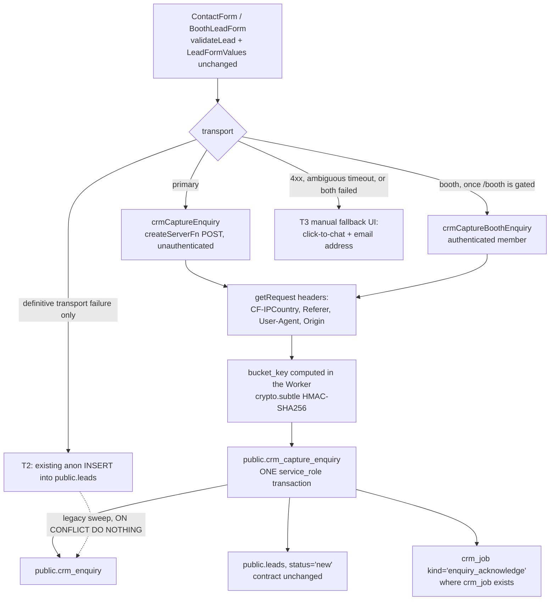
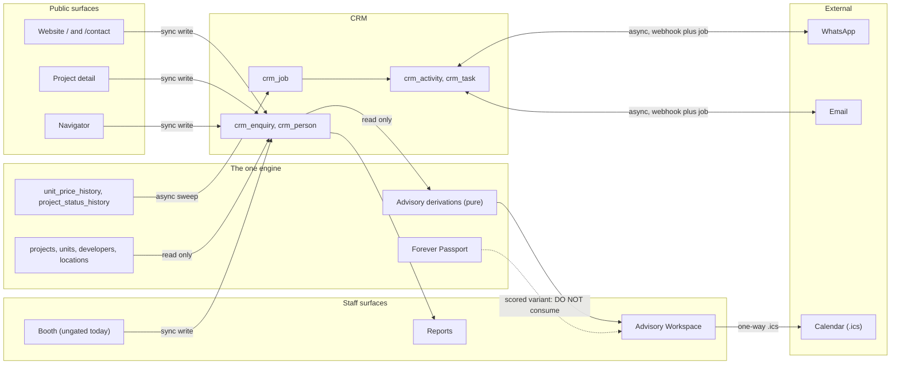
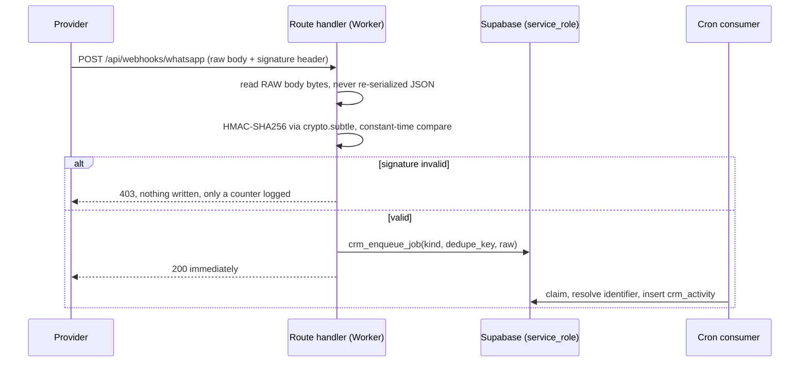
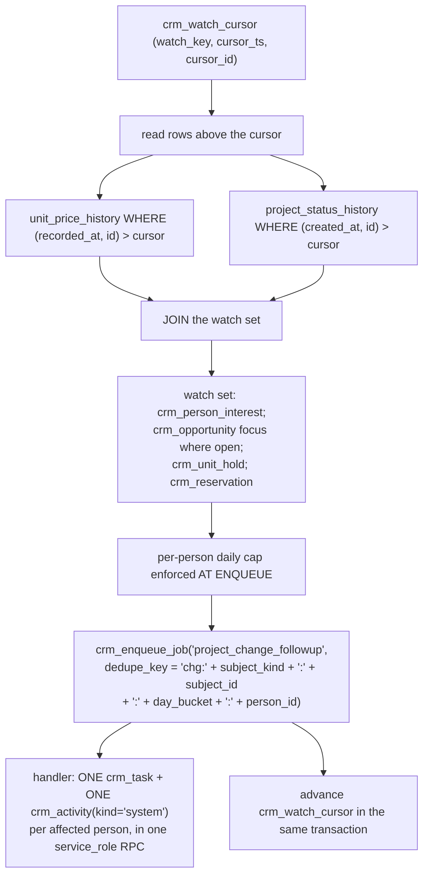
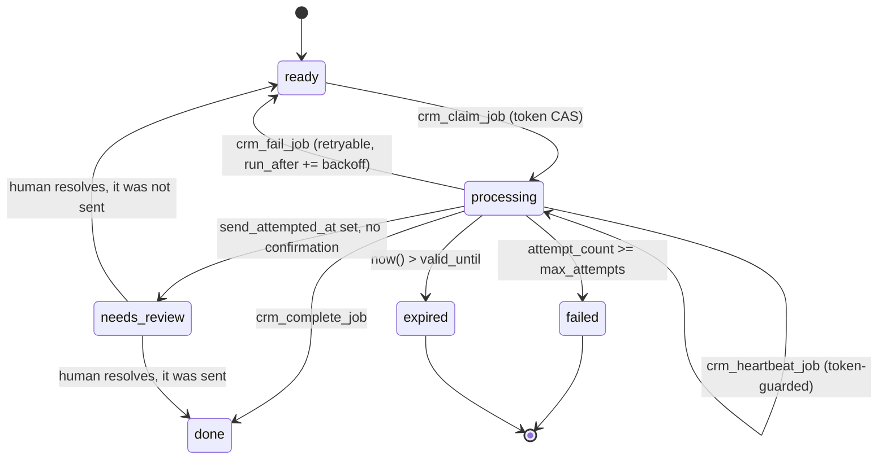

# Forever CRM — Integration and Event Architecture

Task ID: FOREVER-CRM-ARCH-001
Status: Proposed architecture — not approved, not scheduled, not authorized for implementation
Repository state of record: main @ 821b3c4e2f6f82e0d4ddce86199a8ff24b44a094
Risk class: R0 (documentation only)

> This document is a design record. It asserts no product truth, changes no active stage, and authorizes no implementation. The active stage remains FOREVER-STUDIO-001 (`docs/CURRENT_STAGE.md`), which lists "large CRM integration" as out of scope. Any implementing task is R2 under the shared-contract rule and requires an Architect-reviewed stage change plus Owner approval.

## What this document decides

1. **One engine.** `crm_job` is the sole executor of every outbound side effect, at-most-once. There is no automation-run table, so two opposite retry semantics cannot coexist.
2. **One acknowledgement path and one latency promise**, stated once (§6.3).
3. **Ambiguity escalates, never retries.** T2 fires only on definitive transport failure; an ambiguous timeout degrades to the manual fallback UI, and an ambiguous send goes to `needs_review` for a human who has a screen.
4. **One scheduled seam:** a second Nitro plugin that yields to Studio, with a wall-clock deadline checked between every job.
5. **Per-provider webhook routes**, no wildcard, frozen provider map, startup assertion on every secret.
6. **`units_touched` is suppressed** until a canonical `unit_availability_history` exists. The Owner requirement is two-thirds met and said so.
7. **Production is BLOCKED under Cloudflare verdict E**, so it cannot be asserted that the cron fires today. Every automated path has a manual equivalent.

Cited, not restated: `docs/crm/CRM_DOMAIN_MODEL.md` (entities, invariants, identity), `docs/crm/CRM_SECURITY_AND_RBAC.md` (capabilities, grants, threat model), `docs/crm/CRM_PRIVACY_CONSENT_RETENTION.md` (consent, suppression, erasure), `docs/crm/CRM_UX_INFORMATION_ARCHITECTURE.md` (surfaces, CSP, offline outbox), `docs/crm/CRM_IMPLEMENTATION_PLAN.md` (phases, migration register), `docs/FOREVER_BRAIN_V1.md` §7 (the truth boundary — no CRM row becomes the source of a project, developer, location, unit, price, Passport or Intelligence fact).

## 0. Scope

### 0.1 The four primitives

[Repository fact] Forever has one server-side seam that runs without a browser (`wrangler.jsonc` `triggers.crons` → the `cloudflare:scheduled` Nitro hook), one proven way to expose an authenticated server operation (`createServerFn` + middleware + dynamic `import()`), one proven way to expose a raw HTTP endpoint (`createFileRoute(...).server.handlers`, at `src/routes/robots[.]txt.ts`), and no queue, no KV, no Durable Object, no SMTP, no writable filesystem. Everything below is built from those four.

### 0.2 Nothing here is Slice 0 or Slice 1

[Recommendation] The recommended first delivery adds zero tables, zero migrations and **no change to `submitLead`'s transport**. Two items below belong to Slice 1 because they cost no schema: forwarding `contact.tsx`'s already-parsed `project`/`unit` into `<ContactForm>`, and the cron-independent un-ingested detector (§3.6). Everything else is Phase 1 at the earliest, behind a recorded stage change.

Phase 1's buildable set is exactly eleven tables in three FK-ordered migrations and **none of them is an integration table**. This section proposes three tables that are operational plumbing rather than domain entities, each behind a named trigger, each counted against a later phase:

| Table | Purpose | Trigger to build |
|---|---|---|
| `crm_job` | The one outbound/async executor | A messaging gateway is bought, or the first automated acknowledgement is authorised |
| `crm_rate_bucket` | The only durable rate limiter (§1.7) | The server-side capture endpoint ships |
| `crm_watch_cursor` | Watermark cursor for project-change sweeps (§8) | Phase 2 — the watch set does not exist before it |

Gating dependencies: `crm_enquiry_attribution` and `crm_decision_profile` are Phase 2, so until then the capture transaction writes `crm_enquiry` and nothing else. `crm_opportunity`, `crm_unit_hold` and `crm_reservation` are Phase 2/3, so the project-change sweep cannot precede Phase 2.

### 0.3 Numbering and posture

[Recommendation] This section allocates **no migration number**. Filenames and ordering belong to the single package register in `docs/crm/CRM_IMPLEMENTATION_PLAN.md`; every number there is above `20260728160000`. Three sections previously minted overlapping numbers independently — the exact collision defect this package warns about.

Posture for every proposed table: `ENABLE ROW LEVEL SECURITY` with zero policies, `REVOKE ALL … FROM PUBLIC, anon, authenticated`, `GRANT … TO service_role`. Every function is `SET search_path = ''`, schema-qualified, revoked from `PUBLIC`/`anon`/`authenticated`, granted to `service_role`. Each migration has a `*-migration-contract.test.ts` twin that discovers CRM tables by regex rather than counting them. **No `auth.uid()`, no `auth.jwt()`, no `FORCE ROW LEVEL SECURITY`, no column-level `GRANT UPDATE`, no second identity roster, no second service-role key path** — [Repository fact] all have zero occurrences across the 24 migrations. The contract test asserts the FORCE RLS absence with its reason: it would apply the zero-policy posture to `service_role` itself and deny every CRM read.

## 1. The capture path

### 1.1 What is broken

[Repository fact] `submitLead` at `src/lib/lead-service.ts` builds a ten-field payload and runs `await supabase.from("leads").insert(payload)` from the **browser** under the anon publishable key. It returns `Promise<void>`, has no `.select()`, and has two call sites: `src/components/ContactForm.tsx` and `src/features/navigator/booth/BoothNavigator.tsx`.

Five consequences follow structurally. **No server-side moment exists**, because the request never reaches the Worker. **No attribution is capturable** — UTM, referrer and landing path are never sent, and `CF-IPCountry`, `Referer` and `User-Agent` are headers the Worker never sees. **No rate limit, spam check, dedupe or consent capture is possible**, since all need a trusted execution point. **Nothing knows the lead exists**: no `SELECT` policy and no `SELECT` grant for `anon`/`authenticated`, so nothing in `src/` reads it back. And **`/contact?project=&unit=` is dropped** — `contact.tsx` parses and renders both, then mounts `<ContactForm source="contact_page" />` with neither.

[Inference] "The client never learns the lead id" is a real observation but not the defect worth fixing — returning a primary key to an unauthenticated browser is an enumeration oracle. What matters is that the *server* learns it.

### 1.2 Replacement topology



### 1.3 `crmCaptureEnquiry`

[Recommendation] Proposed at `src/features/forever-crm/crm-public.functions.ts`, alone in its file so a contract test can assert exactly one export, no membership middleware, no import of `server/service`, and no `person_id`/`personId` in its validator schema. It is the repository's first unauthenticated server function — a decision, not a default.

```ts
export const crmCaptureEnquiry = createServerFn({ method: "POST" })
  .validator(captureEnquirySchema)          // zod, .strip(), at the edge
  .handler(async ({ data }) => {
    const { captureEnquiry } = await import("./server/capture.server");
    const { runCrmPublicEndpoint } = await import("./server/errors");
    return runCrmPublicEndpoint("capture", () => captureEnquiry(data));
  });
```

| Rule | Reason |
|---|---|
| No middleware, deliberately | The form is public; `requireSupabaseAuth` would break it. The compensating controls are §1.6–1.7. |
| Response is `{ status: "accepted" }` and nothing else — no id, no reference, no duplicate flag | An unauthenticated endpoint distinguishing "created" from "already seen" is an oracle. A quotable buyer reference would be a new `crm_enquiry` column, i.e. a domain-model change this section may not mint. |
| **`source_key` is resolved SERVER-side** from the route or `Origin` against an allow-list of first-party owned-web keys; the client's claim is kept in `source_raw` as evidence only; any `is_third_party` key requires an authenticated principal | `s25_notice_required` is copied from `crm_source.requires_s25_notice`, and `public.leads.source` has no CHECK. A statutory 30-day duty must not be set from client input. Contract test: no seeded source with `requires_s25_notice = false` is reachable unauthenticated. |
| `captureEnquirySchema` mirrors `LeadFormValues` field-for-field, adding only `submissionKey`, `utm*`, `gclid`/`fbclid`/`msclkid`, `referrerUrl`, `landingPath`, `clientCapturedAt`, `honeypot`, `formRenderedAt` | [Repository fact] `validateLead`, `hasLeadValidationErrors` and `LeadFormValues` must stay verbatim; `ContactForm`, the booth path and `src/features/navigator/core/lead.test.ts` depend on that contract. |
| Client-asserted fields are evidence, never authority; server-derived fields come from `getRequest()` (the mechanism at `src/integrations/supabase/auth-middleware.ts`) | `utm_*` and `referrerUrl` are never used for authorization, routing or credit. The raw IP is used for rate limiting and **never stored, never passed into a SQL statement** (§1.7). |

### 1.4 `public.crm_capture_enquiry` — the transaction

[Recommendation] One plpgsql function, service_role only, in which **the enquiry insert is the control flow**:

1. `INSERT INTO public.crm_enquiry (…) … ON CONFLICT (source_key, external_id) WHERE external_id IS NOT NULL DO NOTHING RETURNING id`.
2. **Zero rows: `SELECT` the existing id, return `{accepted: true}`, write nothing further** — no `leads` row, no attribution, no profile, no job. This is a normal, non-error path.
3. Otherwise `INSERT INTO public.leads (…, 'new', …)` — *after* the enquiry insert, so a repeat submit skips it. The public contract is unchanged and remains the durable floor.
4. `crm_enquiry_attribution` (Phase 2 onward).
5. Booth only, Phase 2 onward: `crm_decision_profile` + `crm_decision_answer`.
6. `crm_job` acknowledgement, `ON CONFLICT (dedupe_key) DO NOTHING` (only where `crm_job` exists).

Rules: `triage_state = 'unprocessed'` and **no `crm_person` is created** — a human triage step does that, and the capture path does not get to poison the dedupe universe just because it is now server-side. `s25_notice_required` fails closed to `true` on an unknown source. **Zero writes to `public.projects`, `public.units`, `public.developers` or any price table** (INV-D-1); `focus_project_id`/`focus_unit_id` resolve by lookup or to NULL, never created. One test submits the same `submissionKey` twice and asserts exactly one row in each table.

### 1.5 The booth split is load-bearing

[Repository fact] `src/routes/booth.tsx` has no `beforeLoad`, no loader and no session check — only `robots: noindex, nofollow` — while its own comment calls it staff-only.

[Recommendation] Gating `/booth` behind the JWT-plus-roster chain `src/routes/studio.tsx` uses is a **precondition** for `crmCaptureBoothEnquiry`. Until then booth captures use the public endpoint, `source_key` resolves through the fail-closed server-side mapping, and no booth-host credit is recorded.

Once gated, this is the one exception to the never-create-a-person rule: **`crm_capture_enquiry` never creates a person; `crm_capture_booth_enquiry` may, and only when the caller is an authenticated member**, because a trained human typed and verified the details in the room. Three constraints:

- The RPC returns `{ enquiryId, capturedAt }` only. It never accepts a `person_id`, never lists, never searches.
- A booth capture whose canonicalised identifier resolves to an **existing live person** lands at `crm_enquiry(triage_state='unprocessed', person_id = NULL)` for human triage, and the receipt does not reveal which branch was taken — otherwise a write-only principal becomes a read oracle and a walk-in guest is silently bound onto an existing buyer's record.
- `intent_tier` (`hot`/`warm`/`browsing`) is required — the one fact only the human in the room has. Only `hot` creates an opportunity (Phase 2 onward); `warm` and `browsing` produce person, enquiry, profile and interest into a booth-follow-up queue with its own count. A three-day expo otherwise mints ~100 `qualified` opportunities each demanding a next action.

The booth session is server-expiring and bound to `capture_session_id`, with re-auth per guest and local draft clearing on expiry; `capture_channel = 'booth_tablet'` requires a non-null `actor_user_id` (`docs/crm/CRM_SECURITY_AND_RBAC.md`).

### 1.6 Anti-spam without a CAPTCHA vendor

[Recommendation] Four layers, in cost order; no CAPTCHA vendor now.

| Layer | Mechanism | Stops | Cost |
|---|---|---|---|
| 1 | Honeypot — hidden, `autocomplete="off"`, off-screen input. Non-empty ⇒ return accepted, write nothing | Naive bots | Zero |
| 2 | Fill-time floor — `formRenderedAt` vs server `now()`; under ~2.5 s is machine speed | Scripted submits | Zero |
| 3 | Server-side content heuristics — URL count, non-Latin/Cyrillic/Thai script ratio, `name` = email localpart, length ceiling | Link-spam floods | Zero |
| 4 | Durable rate limit (§1.7) | Repeat abuse | One SQL round trip |

**Containment matters more than detection.** A submission failing 1–3 is still written at `triage_state = 'rejected_spam'` and, per the domain CHECK `triage_state <> 'rejected_spam' OR person_id IS NULL`, creates no person, no identifier, no opportunity and no acknowledgement. A false positive is recoverable by retriaging one row; a dropped Phuket buyer is gone. The response is identical either way, so a spammer cannot tune against the filter.

**Turnstile is deferred, not rejected** — not on cost, but because it injects a third-party script into a public form that loads none today (a privacy-notice question) and cannot be evaluated before spam is observed on a blocked deployment. Trigger: rejected-spam above a quarter of captured enquiries in any calendar week, or a flood the limiter does not absorb. [Unverified assumption] Its free-tier terms are not verifiable here.

### 1.7 Rate limiting with no KV and no Durable Objects

[Repository fact] `wrangler.jsonc` declares only `name` and `triggers.crons` — no KV, DO, D1, R2, queue or rate-limiting binding — and its own header states nothing in this repository deploys it.

An isolate-local `Map` is **not a rate limiter** — many concurrent isolates, arbitrary eviction, no denominator; it is a burst damper and must be labelled one in code. Cloudflare WAF / zone rules are the **correct layer but out of repository scope**: dashboard config on an account unverified under verdict E, to be recommended operationally and never depended on architecturally. A Workers Rate Limiting binding **requires a new `wrangler.jsonc` binding** under a blocked deploy gate, with plan availability unverifiable. [Unverified assumption for both.] **A Postgres fixed-window counter is adopted as the only durable limiter** — one statement, one round trip, all state in Supabase.

```sql
CREATE TABLE IF NOT EXISTS public.crm_rate_bucket (
  bucket_key   TEXT        NOT NULL,   -- HMAC-SHA256 hex, computed in the Worker
  window_start TIMESTAMPTZ NOT NULL,
  hit_count    INTEGER     NOT NULL DEFAULT 0 CHECK (hit_count >= 0),
  first_hit_at TIMESTAMPTZ NOT NULL DEFAULT now(),
  last_hit_at  TIMESTAMPTZ NOT NULL DEFAULT now(),
  PRIMARY KEY (bucket_key, window_start),
  CONSTRAINT crm_rate_bucket_key_shape CHECK (bucket_key ~ '^[a-z_]+:[0-9a-f]{64}$')
);
```

`crm_rate_bucket_hit(p_bucket_key, p_window_seconds, p_limit)` is one `INSERT … ON CONFLICT DO UPDATE SET hit_count = public.crm_rate_bucket.hit_count + 1, last_hit_at = now() RETURNING hit_count`.

Three details decide whether this is safe:

1. **The HMAC is computed in the Worker with `crypto.subtle`; only the finished `bucket_key` reaches Postgres.** As a SQL expression both the server secret and the raw IP would travel as bind parameters, which `log_min_duration_statement` can capture — the one sink a column-name grep test cannot see. The input is length-prefixed or delimited, never a bare concatenation.
2. **An HMAC, not a hash.** A plain SHA-256 of an IPv4 address is reversible by enumerating 2³² inputs. Rows are hard-deleted by the prune pass after one day.
3. **The secret name is registered in `CRM_SECRET_NAMES` (a `*.server.ts` module, never client-reachable) and in `.env.example`, with an explicit degradation rule: an absent secret disables the limiter and capture proceeds.** Rotation resets counters. **The acknowledgement is decoupled from the limiter** — its dedupe key is already the duplicate defence, and withholding acks on a missing secret would silently unacknowledge every lead on first deploy.

Proposed defaults, deliberately generous: 5 per 10 minutes and 20 per 24 hours per IP bucket; 3 per hour per `(kind='email', canonical_value)` bucket.

### 1.8 Idempotency

[Recommendation] The form mints a `submissionKey` (UUIDv4) **once per form mount**, not per submit.

| Path | Key | On repeat |
|---|---|---|
| `crmCaptureEnquiry` | `crm_enquiry (source_key, external_id) WHERE external_id IS NOT NULL`, `external_id = submissionKey` | §1.4 step 2; response identical |
| T2 fallback → legacy sweep | `crm_enquiry (legacy_lead_id) WHERE legacy_lead_id IS NOT NULL` + the §3.4 near-duplicate guard | `ON CONFLICT DO NOTHING`, skip counted |
| Acknowledgement | `crm_job.dedupe_key = 'ack:' \|\| sha256(lower(email)) \|\| ':' \|\| <hour>` | `ON CONFLICT DO NOTHING` |

**The acknowledgement key is content-derived, not enquiry-derived, and the trade is recorded.** An enquiry-keyed ack double-messages the buyer whenever a T2 fallback mints a second `crm_enquiry` for the same real submission. Content-derivation suppresses a legitimate second acknowledgement for a genuinely different enquiry from the same address within the same hour, which is strictly better than sending a duplicate.

[Repository fact] `crm_enquiry_external_idem` is sound because `source_key` is `NOT NULL`. The asymmetry with `crm_activity (channel, external_id)` — where `channel` is nullable and NULLs are distinct — is why the domain model adds `CHECK (external_id IS NULL OR channel IS NOT NULL)`. Do not copy the enquiry index shape onto a nullable column.

[Web research] Zero rows from `ON CONFLICT DO NOTHING` meaning "already seen" is deliberately not an error — https://www.postgresql.org/docs/current/sql-insert.html **The rule is not blanket; see the identifier carve-out in §9.3.**

**Rejected:** Stripe-style parameter-mismatch replay. It stores a request fingerprint and a response body per call to solve a problem — clients retrying with mutated payloads — that one internal caller and one public form do not have.

### 1.9 Graceful degradation

| Tier | Condition | Action |
|---|---|---|
| **T1** | `{ status: "accepted" }` | Success UI, unchanged copy |
| **T2** | **Definitive transport failure only** — explicit HTTP 5xx, or a fetch rejection before bytes were sent | Fall back to the existing browser anon INSERT. Same success UI. |
| **T3** | A 4xx; **an ambiguous timeout**; or both paths failed | Manual fallback UI — click-to-chat link and email address. Never claim the request was received. |

- **A 4xx never falls back.** `rate_limited`, `validation_failed` and `rejected` are decisions, not outages; falling back would make the limiter and every heuristic bypassable by anyone who could provoke one.
- **A timeout is not evidence that nothing happened.** A slow success and a failure are indistinguishable from the browser, and `public.leads` has no idempotency column to reconcile them. Timeouts degrade to T3, where a human decides, not to T2, where the machine writes a second row.

Three properties: **no lead is lost to a Worker outage**, because the `"Anyone can submit a lead"` INSERT policy is retained as the floor; **degradation is measurable without a new column** (`legacy_lead_id IS NOT NULL AND external_id IS NULL` is by construction a degraded capture); and [Repository fact] **the `leads` contract is untouched** — zero new columns, five CHECKs unchanged, four indexes unchanged, `leads_status_valid` not widened. The only DDL is the domain section's status-freeze trigger and two comments, one of which reads "Public intake mirror. Not complete: the authoritative intake record is public.crm_enquiry."

**The honest cost:** with the anon policy retained, anyone can still write directly to `public.leads`, so the server function is a **capture-quality boundary, not a security boundary**. The residual risk is contained because a swept row arrives at `triage_state='unprocessed'` with no person, no identifier and no automation. Closing the direct path means revoking the anon INSERT grant, which removes the floor — a separate decision converging with Draft PR #102.

### 1.10 What changes in the repository

| File | Why |
|---|---|
| `src/routes/contact.tsx` | Forward the parsed `project`/`unit` into `<ContactForm>`. **Slice 1**, props only, closes a live capture defect on its own. |
| `src/lib/lead-service.ts` | `submitLead` gains the server call and the T2 fallback; the `import.meta.env.DEV` demo branch stays where it is. **Not before Phase 1.** |
| `src/lib/lead-demo-mode-bundle-boundary.test.ts` | [Repository fact] It pins the insert string verbatim and asserts `from("leads")` appears **exactly once**. Both stay true only if the T2 fallback is the sole insert call in that file. Adding a second call site breaks a pinned test, and "fix the test" is the wrong response. |
| `src/features/forever-studio/tests/bundle-boundary.test.ts` | `CLIENT_REACHABLE` gains every client-reachable CRM file, or a CRM twin is created. It is the one static control between the service-role key and the browser. |
| `src/integrations/supabase/types.ts` | [Repository fact] 17 tables, no CRM entry, no generation script. Hand-add or regenerate **in the same PR as each migration**. |

**Unchanged by design:** `validateLead`, `hasLeadValidationErrors`, `LeadFormValues`, `PHONE_PATTERN`, and the mirrored DB CHECK `leads_phone_format`.

## 2. Connection map



Direction is from the CRM's point of view. "Sync" means inside one HTTP request; "async" means through `crm_job` and the cron.

| # | Connection | Direction / boundary | Notes and failure behaviour |
|---|---|---|---|
| 1 | Website contact form | inbound, sync | T1/T2/T3 (§1.9). Never claims receipt on failure. |
| 2 | Project-detail CTA (`source='project_detail'`) | inbound, sync | [Repository fact] Draft PR #118 would remove this CTA pending gate G0; the capture path must not assume it exists. |
| 3 | Unit enquiry (`?project=&unit=`) | inbound, sync | Unresolvable slug/unit ⇒ `focus_*` NULL, `project_slug_at_capture` still recorded. Never creates a project or unit. |
| 4 | Navigator | inbound, sync | Answers land as `crm_decision_profile` + `crm_decision_answer` (Phase 2); the three-column composite FK rejects an unknown key rather than auto-creating one. |
| 5 | Booth | inbound, sync | §1.5. Session state is a local draft buffer; a failed capture retries with the same `submissionKey`. |
| 6 | Canonical project graph | outbound, read only, sync | Reads apply `excludeKnownFictitiousProjects` from `src/lib/public-truth.ts`; a missing project renders "Not available". **No CRM code path writes here** — INV-D-1. |
| 7 | Price / status changes | inbound, **async** (§8) | Identifiers and timestamps only, never values. A missed sweep re-runs from the cursor. |
| 8 | Forever Passport | outbound, read only, sync | [Repository fact] Two exported types share the name `ForeverPassport`; the one at `src/features/passport/passport-types.ts` carries `overallScore: number`, and `passport-mapper.ts` already enumerates `"crm"` as a render target. **The CRM must not consume the scored variant.** No numeric score, band or rank reaches any CRM surface. |
| 9 | Advisory Workspace | outbound, sync, in-process | [Repository fact] `mapProjectToAdvisorySession` hardcodes all seven client fields to null, so the snapshot renders "Not available" today; CRM supplying them needs no change to any derivation. `RecommendedProject.matchScore` and `.confidence` are passed **`null`, always** — they have no producer and none may be created. |
| 10 | Reports | outbound, read only, sync | Counts, ageing, coverage, absolute currency. No conversion rate is storable or renderable, and no percentage is rendered with a denominator under 30. [Web research — Wilson interval: 3 of 20 = 15%, 95% CI 5.2%–36.1%; https://www.itl.nist.gov/div898/handbook/prc/section2/prc241.htm] |
| 11 | WhatsApp | bidirectional, **async** both ways | §5. Signature verified first; dedupe on `crm_activity (channel, external_id)`; order by `occurred_at`. |
| 12 | Email | bidirectional, **async** both ways | §6. Inbound `Message-ID` is the idempotency key. |
| 13 | Calendar | outbound only; sync generation, out-of-band delivery | §7. No API, no channels, no sync tokens, no OAuth. |

[Repository fact — verified] "Developer Check" appears **nowhere** in `docs/` or `src/`; it exists only as a Non-goal in open issue #103, and is modelled here only as a future read over `public.developers` + `public.sources` producing no CRM-owned developer fact.

**Four connections that must not be built** [Recommendation]:

| Not built | Why |
|---|---|
| CRM → `projects` / `units` write of any kind | A direct `UPDATE` defeats `owner_verified` provenance. Every project fact goes through `forever_progressive_ingest` / `forever_direct_publish` / `studio_publish_project` / `studio_update_resale` and stamps `field_provenance`. |
| CRM ↔ `public.studio_listing_contacts` join | Seller/partner PII on a deliberately separate boundary. Merging it into the buyer CRM merges two consent universes. A template for how CRM PII is stored, not a source to read. |
| Bidirectional sync with any external CRM | Permanently rejected. A bought gateway writes **one way** into Supabase, which stays sole system of record. |
| A second scheduler, external poller, or `pg_cron` | `cloudflare:scheduled` is the only seam. |

## 3. The scheduled seam

### 3.1 What exists

[Repository fact]

- `wrangler.jsonc` — `"crons": ["*/5 * * * *"]`.
- `vite.config.ts` — `nitroRuntimeOptions = { plugins: ["./src/features/forever-studio/server/scheduled.plugin.ts"] } satisfies NitroConfig`, forwarded verbatim to `nitro()`, server build only.
- `scheduled.plugin.ts` — `STUDIO_SCHEDULED_HOOK = "cloudflare:scheduled"`; its only top-level import is the `NitroAppPlugin` type and its hook body is a bare `await import()` of the runner.
- `scheduled-runner.server.ts` — one `try/catch`, counts-only logs, **never throws**.
- `service.ts` — `runScheduledStudioTick`, bounded by `SCHEDULED_TICK_MAX_SLICES = 12`, `RESUME_BATCH = 5`, `STALE_PROCESSING_SECONDS = 900`, **with no wall-clock or CPU bound anywhere in the file**.

### 3.2 The dispatcher

| Option | Verdict |
|---|---|
| **A — a second Nitro plugin** added to the `nitro.plugins` array, hooking `cloudflare:scheduled` independently; **Studio's plugin file is not touched at all** | **Adopt.** Studio blast radius is one array element. |
| B — a shared dispatcher module Studio's plugin imports | Reject. Edits the live production consumer for no gain. |
| C — a neutral dispatcher replacing Studio's registration | Reject. Makes CRM a precondition for Studio's cron and inverts the risk. |

```ts
const nitroRuntimeOptions = {
  plugins: [
    // Order is deliberate: Studio is the live consumer and runs first.
    "./src/features/forever-studio/server/scheduled.plugin.ts",
    "./src/features/forever-crm/server/scheduled.plugin.ts",
  ],
} satisfies NitroConfig;
```

Three pinned assertions:

- [Inference] Option A depends on Nitro's `nitroApp.hooks` (a `hookable` instance) accepting two listeners for one hook and awaiting both. This is inferred from the API shape, not proven by the repository; the implementing packet pins it with a two-listener test in the dependency-injection style `scheduled-runner.test.ts` already uses.
- The CRM plugin file contains **no top-level import other than the Nitro type and no top-level statement other than the hook registration**. A module-level throw during Nitro app initialisation is outside every `try/catch` and would take down server startup for the whole application, including the public site and the lead form.
- Exactly **one** CRM plugin path appears in the array. One feature directory is used throughout the package — `src/features/forever-crm/*`, matching the `forever-studio` precedent. Two directories would register two listeners and split the bundle-boundary allow-list.

### 3.3 The consumer contract

[Recommendation] **The CRM consumer yields to Studio. That is a rule it obeys, not a property it gets for free** — a slice is a count of work units, not a CPU reservation, and both consumers share one invocation under `context.waitUntil`.

| # | Requirement | How the CRM consumer meets it |
|---|---|---|
| 1 | Never throws | `runCrmScheduledTickSafely()` mirrors `runStudioScheduledTickSafely`: one `try/catch`, `logCrmFailure` with the same redaction, counts only — never a person id, phone, email, message body or job id. |
| 2 | **One budget set, and it is the smaller one** | `CRM_TICK_MAX_SLICES = 8`, `CRM_TICK_MAX_JOBS = 5`. Stated once, here; cited elsewhere rather than restated. |
| 3 | **Wall-clock deadline checked between every job** | `Date.now() < deadline` evaluated before each job is claimed, not between slices. [Unverified assumption] The CPU and wall budget of a Cron Trigger on Forever's plan is not recorded anywhere in the repository, which is exactly why a count budget alone is insufficient. |
| 4 | Yields | Studio runs first; the CRM consumer stops at its deadline. A killed Studio slice leaves `studio_upload_jobs` recoverable only after the 900-second stale lease — three cron periods of stalled publication on the one background path that is live. **Measuring the combined tick is a named pre-apply check.** |
| 5 | Overlap-safe and idempotent | Claim by compare-and-set with token and stale lease (§4.3); every write `ON CONFLICT DO NOTHING` on a declared key (§9.3). |
| 6 | Per-item failure isolation | One failing job increments `attempt_count`, records a sanitised code, and the loop continues. |

### 3.4 CRM passes, in fixed order

| # | Pass | What it does | Bound |
|---|---|---|---|
| 1 | **Legacy sweep** | `public.leads` rows with no matching `crm_enquiry.legacy_lead_id` → `crm_enquiry` at `triage_state='unprocessed'`, `ON CONFLICT DO NOTHING`. **Plus a near-duplicate guard:** skip a row whose canonicalised email or phone already produced an enquiry within 10 minutes, and **count the skip**, so silent duplicate capture is measurable. | 100 rows |
| 2 | **Job drain** | `crm_list_due_jobs` → claim → handler → complete/fail | `CRM_TICK_MAX_JOBS` |
| 3 | **Project change sweep** | §8. Phase 2 onward. | 200 rows |
| 4 | **Coverage sweep** | Enquiries with `first_response_at IS NULL` past threshold; stage dwell past `target_time_in_status_hours` where set. Writes a `crm_task`; **never** touches `owner_user_id` or `relationship_owner_user_id` and never releases an opportunity — `flag_only` across the package. | 50 rows |
| 5 | **Prune** | `crm_rate_bucket` older than one day; completed inbound job payloads older than seven days (§5.3) | 500 rows |

[Web research] The 5-minute cadence is a defensible property, not a defect: Follow Up Boss, the speed-to-lead market leader, ships a deliberate Lead Flow Delay of up to 5 minutes in order to route correctly, and the strongest source-backed human-contact threshold is one hour — https://help.followupboss.com/hc/en-us/articles/4402128249367-Dashboard

### 3.5 Production status, plainly

[Repository fact] **It cannot be asserted that the cron fires in production today.** `docs/CURRENT_STAGE.md` records production rollout as **BLOCKED under Cloudflare verdict E**: Owner authentication reached an account route, but the account and Workers & Pages inventory surfaces never rendered, Chrome blocked the focused read-only dashboard API GET with `ERR_BLOCKED_BY_CLIENT`, and no authorized Wrangler fallback exists. Target/repository identity, deployed revision and all four required production environment names and scopes remain unverified. There is no `.github/` directory and no deploy script.

Consequences for any implementing packet: scheduled execution is a **configuration and deploy gate**, not an engineering gap; **no SLA, acknowledgement promise or follow-up guarantee may be made on the strength of the cron**, so everything in §3.4 has a manual equivalent (§9.5); and someone must confirm the deployed Worker's `scheduled()` export is live before any CRM behaviour depends on it.

### 3.6 Liveness, detected independently of the cron

[Recommendation] The likeliest failure is the state the repository is already in: the `scheduled()` export is not live, leads land in `public.leads`, no `crm_enquiry` is created, and there is no error, no counter and no alarm. A detector counting rows the sweep has already ingested cannot see it.

- **Un-ingested detector, cron-independent:** `public.leads` rows older than 15 minutes with no matching `crm_enquiry.legacy_lead_id`, computed on demand at the service-role read path Slice 1 already has, surfaced on the Owner's Pulse. A non-zero count is a **Phase-1 exit blocker**.
- **Rendered tick liveness:** `last_run_at` persisted and rendered per pass, so a stopped cron is visible rather than inferred.

It is invisible in the worst direction otherwise: Slice 1 reads `leads` directly and shows the leads, so the failure only appears once Phase 1 moves the surfaces.

## 4. `crm_job` — the one engine

### 4.1 One executor, one semantics

[Recommendation] `crm_job` is the **sole** executor of every outbound side effect and every deferred unit of work. There is no automation-run table, no policy engine, no routing engine, no second queue — all fifteen are cut (`docs/crm/CRM_AUTOMATION_CATALOGUE.md`). Two queues meant two opposite retry semantics, at-least-once and at-most-once, over the same buyer, resolved only by whichever ran first. The five coverage sweeps ship as five named SQL functions; the eleven policy numbers ship as TypeScript constants with review triggers in comments.

`crm_job` itself is **not built now.** Trigger: a messaging gateway is bought, or the first automated acknowledgement is authorised. Reintroduce an engine above it only at sustained >200 new enquiries per month.

### 4.2 Copied from `studio_upload_jobs`, not extended

[Repository fact] `public.studio_upload_jobs` carries `creator_role TEXT NOT NULL CHECK (creator_role IN ('owner','trusted_publisher'))`, a five-value archive-publication `workflow` CHECK, `project_slug`, `listing_id`, `facts`, `files`, and `processing_requested_at` meaning an Owner or Trusted Publisher explicitly requested processing; `studio_list_due_jobs` inner-joins `studio_members` and requires an active membership before its `LIMIT`. Extending it would mean widening a `NOT NULL` role CHECK to admit system rows, widening the workflow CHECK, and relaxing the membership join — three changes to the live production job table for an unshipped feature. Copy the five mechanics (claim token, lease heartbeat, stale recovery, bounded slices, per-job failure isolation) and none of the publication specifics.

```sql
CREATE TABLE IF NOT EXISTS public.crm_job (
  id                    UUID PRIMARY KEY DEFAULT gen_random_uuid(),
  kind                  TEXT NOT NULL CHECK (kind IN (
                          'enquiry_acknowledge','coverage_task','project_change_followup',
                          'whatsapp_inbound','email_inbound','email_outbound',
                          'notice_s25_send','prune')),
  dedupe_key            TEXT NOT NULL,            -- one job per duplicate signal
  -- Work input ONLY. Never a project, unit, price or availability fact:
  -- handlers re-read canonical rows at execution time. See INV-D-1.
  payload               JSONB NOT NULL DEFAULT '{}'::jsonb,

  actor_kind            TEXT NOT NULL DEFAULT 'system'
                          CHECK (actor_kind IN ('member','integration','system')),
  actor_user_id         UUID REFERENCES auth.users(id) ON DELETE SET NULL,
  actor_email           TEXT,                     -- snapshot; survives an auth delete
  actor_integration_key TEXT,

  status                TEXT NOT NULL DEFAULT 'ready' CHECK (status IN (
                          'ready','processing','done','failed','expired','needs_review')),
  processing_token      UUID,
  processing_started_at TIMESTAMPTZ,

  run_after             TIMESTAMPTZ NOT NULL DEFAULT now(),  -- backoff anchor
  valid_until           TIMESTAMPTZ,                          -- never send after this
  attempt_count         INTEGER NOT NULL DEFAULT 0 CHECK (attempt_count >= 0),
  max_attempts          INTEGER NOT NULL DEFAULT 6 CHECK (max_attempts > 0),
  retryable             BOOLEAN NOT NULL DEFAULT true,

  -- Sanitised operator error only. Raw database, HTTP, provider, SQL or path
  -- text is NEVER stored here.
  error_code            TEXT,
  error                 TEXT,

  -- Set and COMMITTED before the provider call for outbound kinds; see 9.2.
  send_attempted_at     TIMESTAMPTZ,
  send_confirmed_at     TIMESTAMPTZ,

  created_at            TIMESTAMPTZ NOT NULL DEFAULT now(),
  finished_at           TIMESTAMPTZ,
  updated_at            TIMESTAMPTZ NOT NULL DEFAULT now(),

  CONSTRAINT crm_job_terminal_finished
    CHECK ((status IN ('done','failed','expired')) = (finished_at IS NOT NULL)),
  CONSTRAINT crm_job_send_order
    CHECK (send_confirmed_at IS NULL OR send_attempted_at IS NOT NULL)
);

ALTER TABLE public.crm_job ENABLE ROW LEVEL SECURITY;
-- RLS on, ZERO policies: internal-only. Authorization is enforced at the
-- app-server boundary, never in the browser.
REVOKE ALL ON TABLE public.crm_job FROM PUBLIC, anon, authenticated;
GRANT  ALL ON TABLE public.crm_job TO service_role;

CREATE TRIGGER trg_crm_job_updated_at BEFORE UPDATE ON public.crm_job
  FOR EACH ROW EXECUTE FUNCTION public.set_updated_at();

CREATE UNIQUE INDEX crm_job_dedupe ON public.crm_job (dedupe_key);

CREATE INDEX idx_crm_job_due ON public.crm_job (run_after ASC, created_at ASC, id ASC)
  WHERE status IN ('ready','processing') OR (status = 'failed' AND retryable IS TRUE);

CREATE INDEX idx_crm_job_needs_review
  ON public.crm_job (updated_at DESC) WHERE status = 'needs_review';
```

| Difference from Studio | Reason |
|---|---|
| `dedupe_key` with a **global unique index** | Studio has `content_fingerprint` but no uniqueness. CRM signals arrive repeatedly (webhook retry, re-run sweep), so idempotency must be structural. |
| `run_after` | Studio retries every tick with no backoff; a provider outage would turn six ticks in thirty minutes into six failed sends. |
| `valid_until` + `expired` | A send that cannot go out before it is pointless terminates and writes a task rather than arriving late. An appointment reminder sets `valid_until = scheduled_start_at`. |
| `max_attempts` + `needs_review` | Studio has only `retryable BOOLEAN`; CRM needs a visible poison terminal and a distinct state for "we do not know whether it happened". |
| `send_attempted_at` / `send_confirmed_at` | At-most-once (§9.2). Studio has no outbound side effects. |
| **No** `created_by`, `creator_email`, `creator_role`, `workflow`, `project_slug`, `listing_id`, `files` | CRM jobs are mostly system-originated and never touch storage; copying them imports an authorization model that does not apply. |

[Repository fact] `actor_email` follows the idiom `studio_upload_jobs` states explicitly — nullable creator with `ON DELETE SET NULL` plus a retained email/role snapshot, so deleting an auth account never erases job history. Offboarding is `studio_members.is_active = false`, never an `auth.users` delete.

### 4.3 The RPCs

All service-role only, `SET search_path = ''`, no dynamic SQL.

| RPC | Behaviour |
|---|---|
| `crm_claim_job(p_job_id, p_token, p_stale_seconds DEFAULT 900)` | Compare-and-set, structurally identical to `studio_claim_job`: sets `processing`, the token, `processing_started_at`, `attempt_count + 1`, guarded by `run_after <= now()`, `status NOT IN ('done','expired','needs_review')`, and one of ready / retryable-failed-under-max / processing-with-a-stale-lease. Zero rows means another worker holds the claim — a counted skip, never an error. |
| `crm_heartbeat_job(p_job_id, p_token) → BOOLEAN` | Token-guarded refresh. A worker that has lost its claim gets `false` and **must stop immediately** — for outbound kinds that is the difference between one send and two. |
| `crm_complete_job(p_job_id, p_token, p_result)` | Token-guarded; `done`, `finished_at`, and for outbound kinds `send_confirmed_at` plus the `crm_activity` row in the same transaction. |
| `crm_fail_job(p_job_id, p_token, p_error_code, p_error_message, p_retryable, p_backoff_seconds)` | Token-guarded; a token mismatch is a **no-op**, so a stale worker cannot clobber a fresh claim. Sets `run_after = now() + interval`; at `attempt_count >= max_attempts` sets `retryable=false, status='failed', finished_at`. |
| `crm_list_due_jobs(p_stale_before, p_limit DEFAULT 5)` | `LANGUAGE sql STABLE`, mirroring `studio_list_due_jobs` including its `LIMIT GREATEST(LEAST(COALESCE(p_limit,5),100),0)` clamp. **No membership join** — CRM jobs are system-originated. |
| `crm_enqueue_job(p_kind, p_dedupe_key, p_payload, p_run_after, p_valid_until, p_actor_kind, p_actor_user_id)` | One `INSERT … ON CONFLICT (dedupe_key) DO NOTHING RETURNING id`. Zero rows means already enqueued, which is success. |

### 4.4 Backoff, poison, and the state a human owns

Backoff deltas by attempt: —, +1 min, +5 min, +30 min, +2 h, +6 h, then terminal. Deliberately coarse: with a 5-minute floor imposed by the cron, jitter buys nothing.

**`needs_review` differs from `failed`, and the difference is the whole at-most-once argument.** `failed` means "we know it did not happen"; `needs_review` means "we do not know whether it happened". A `needs_review` job is **never retried automatically by any code path** — only a human resolves it.

**Therefore it must be rendered.** A state whose entire purpose is a human decision, with no human able to make it, is write-only. `docs/crm/CRM_UX_INFORMATION_ARCHITECTURE.md` carries a Pulse count — "Sends needing review — N, oldest X" — tapping through to a filtered list whose one action per row is a two-way human resolution, with terminal poison jobs in the same list. There is no dead-letter table: `status='failed' AND retryable = false` is the dead-letter queue and `idx_crm_job_needs_review` makes it a one-index scan. **If that operations surface is genuinely out of scope, then `needs_review` is deleted and outbound becomes at-least-once — but not both.**

## 5. WhatsApp

### 5.1 Platform constraints

[Web research]

| Finding | Consequence |
|---|---|
| The **24-hour customer-service window**: outside it only pre-approved templates, and template review takes up to 24 hours — https://developers.facebook.com/docs/whatsapp/cloud-api/guides/send-messages | Free-text outbound is a *reply* capability, not a *reach* capability. |
| **Cost is not the barrier**: per-message pricing since 2025-07-01, non-template messages inside an open window free, service conversations free since 2024-11-01 — https://developers.facebook.com/docs/whatsapp/pricing | The build-vs-defer argument is made on ownership, compliance and operational load, not price. |
| Onboarding an existing Business App number **directly to Cloud API deletes the account** and its history; only a partner supporting business-app onboarding preserves it — https://developers.facebook.com/documentation/business-messaging/whatsapp/solution-providers/migrate-existing-whatsapp-number-to-a-business-account/ | **A one-way door, and the highest-stakes integration decision in the package.** Decided before, not during, technical work. |
| Meta assigns the consent determination to the business: "You are solely responsible for determining the method of opt-in." https://whatsappbusiness.com/policy/ | Opt-in evidence is Forever's problem; the send boundary consults it (§9.4). |

[Repository fact] Zero outbound messaging exists on `main`; `whatsapp` appears only as a literal in an unused TypeScript union, and `src/intake/watch/` is an offline `result.json` reader, not a channel.

[Owner requirement — open] Where buyer conversations live today — a company-owned Business App number, or advisors' personal accounts — is unknown. If personal, Forever has no ownership claim, no copy of the history and no reassignment path when an advisor leaves. No design decision below touches that.

### 5.2 The staged path

**Stage 0 — now, at genuinely zero marginal cost. No vendor, no webhook, no credential, no `wrangler.jsonc` change.**

- **Identity captured:** the phone field produces `crm_person_identifier(kind='whatsapp', canonical_value=<+E.164>, raw_value=<as typed>)` alongside the `kind='phone'` row — the join key everything later depends on.
- **Outbound contact:** a click-to-chat deep link, `https://wa.me/<digits>?text=<encoded>`, pre-filled with an RU/EN first-response template held as ordinary application text.
- **Inbound recorded:** a **`Log message received`** action on the person record writes `crm_activity(kind='message', direction='inbound', channel='whatsapp', actor_kind='member', occurred_at=<the message's own timestamp>)`. Without it the stage machine cannot pass `contacted` and every live conversation ages into the silence report within a fortnight. The returning outcome sheet's `Reached` branch emits the same row automatically.

**The honesty rule, normative for the package:** a click-to-chat row is evidence an advisor *opened* WhatsApp, not that a message was *sent*. The tap emits `crm_activity(kind='message', channel='whatsapp', direction='outbound', metadata->>'link_opened'='true')` and **does not set `first_response_at`**. It is labelled "WhatsApp opened", the card stays in *Reply first*, and the button asks for confirmation. Only the returning outcome sheet — an attributed human confirmation, never a navigation event — sets `first_response_at`. [Web research — the "unactioned" definition requires an outbound call, email or text from the assigned agent: https://help.followupboss.com/hc/en-us/articles/4402128249367-Dashboard]

**Stage 1 — Cloud API or a BSP. Two triggers, both required.** (a) The number-ownership question is answered *and* a company-owned number exists or will be provisioned; and (b) one of: manual logging demonstrably fails (>~20 buyer conversations per advisor per week), a handover loses history, or a compliance request cannot be answered because the conversation is on a personal device. The one-way door then constrains the path: **if history must be preserved, onboard through a partner supporting business-app onboarding — never direct Cloud API.** With a fresh number, direct Cloud API is acceptable and cheaper and the old number stays untouched. Those are the only two safe shapes.

**Stage 2 — templates and sequences.** Trigger: sustained inbound above ~200 new enquiries per month. No template registry or message-queue table is modelled until a gateway contract is signed.

### 5.3 Webhooks, when they land

[Repository fact] The raw-HTTP seam is proven at `src/routes/robots[.]txt.ts` — `createFileRoute("/robots.txt")({ server: { handlers: { GET: … } } })`. A webhook is the same shape with `POST`.



**Per-provider route files. No wildcard `$provider`.** [Recommendation] `src/routes/api.webhooks.whatsapp.ts` and `src/routes/api.webhooks.email.ts`, each with its own secret. A wildcard with no allow-list has no defined behaviour for an unknown provider or an absent secret, and the natural implementation derives a valid HMAC key from the literal string `undefined`, which anyone can compute. If a dispatcher is ever wanted it resolves against a frozen const map and returns 404 **before** reading the body or touching `crypto`. **At module load, assert every configured provider has a non-empty secret and throw otherwise**; `webhook-signature.test.ts` adds an unknown-provider case and an absent-secret case, because a fail-open default is invisible in testing precisely when the happy path works.

Five further rules. `GET` handles `hub.mode`/`hub.verify_token`/`hub.challenge` and echoes only on an exact token match, because a loose comparison makes the endpoint an open echo. **The signature is verified over the raw body, before parsing** — `JSON.parse` then `JSON.stringify` does not round-trip byte-identically, so in Workers this is `await request.arrayBuffer()` then `crypto.subtle.importKey`/`verify` with a length-independent constant-time compare. **Return 200 fast and do the work in the cron:** the handler's only synchronous work is verify plus one enqueue, there is no queue, and `ctx.waitUntil` is not reachable from inside a TanStack route handler, so the inbox pattern is the only shape. **The raw payload lives in `crm_job.payload` with a hard 7-day TTL** enforced by the prune pass, with the durable copy in `crm_activity` where the erasure sweep reaches it — otherwise buyer PII sits in a job table outside that sweep. And **message text is never treated as instructions**: `crm_activity.body_text` is guest-authored, untrusted data to every consumer, rendered as plain text under the named untrusted-column list with a CSP on `/crm` and `/booth` (`docs/crm/CRM_UX_INFORMATION_ARCHITECTURE.md`).

### 5.4 Ordering, retries, deduplication

[Web research] Meta retries webhooks and states the receiving server should handle deduplication — https://developers.facebook.com/docs/graph-api/webhooks/getting-started — and delivery order is not guaranteed.

- **Duplicate delivery:** `crm_job.dedupe_key = 'wa:' || <message id>` and `crm_activity (channel, external_id) WHERE external_id IS NOT NULL`, two independent gates. The second is sound only because the domain model adds `CHECK (external_id IS NULL OR channel IS NOT NULL)`; without it NULL channels are distinct and the `ON CONFLICT` inference never matches.
- **Out-of-order delivery:** every timeline query orders by `crm_activity.occurred_at` — the provider's timestamp — never `recorded_at`, never insertion order, never `id`.
- **Retry storms:** the handler is O(1); a storm costs one row per distinct message id and zero per duplicate.
- **Unknown or returning sender:** see the identifier carve-out in §9.3. This is not "upsert and hope".

## 6. Email

### 6.1 The ROI verdict

**MX'd inbound capture beats outbound WhatsApp automation, and the reason is categorical rather than quantitative.** Inbound **creates records that do not exist** — portal and partner enquiries arrive in a human inbox and are re-typed or lost, producing zero rows anywhere in Forever today — while outbound **accelerates a step a human already performs** at ~10 seats. Inbound needs a DNS MX record on a subdomain and a handler in the shape already proven, adds a compliance surface already modelled (`s25_notice_required = true` from `crm_source`), and is **fully reversible**; outbound needs the ownership question answered, possibly a one-way-door migration, onboarding, template pre-approval cycles and an opt-in determination Meta assigns to Forever. If inbound fails, some emails are not parsed and the human inbox still has them; if outbound fails, a buyer receives a wrong or duplicate message.

[Web research] The adoption counterweight reinforces it: NAR's 2025 survey (n > 1,200) finds CRM is the #2 lead source at 23% yet absent from the most-used-technology list — agents abandon CRMs that cost them time — https://www.nar.realtor/research-and-statistics/research-reports/realtor-technology-survey A capture improvement costs an advisor nothing; an outbound automation costs review time.

### 6.2 Inbound design

[Web research] Resend's free tier is 3,000/month and 100/day, inbound on every tier — https://resend.com/pricing

- One address per channel class mapping to a seeded `crm_source` key: `portal@`, `partner@`, `referral@`. Distinct addresses are the cheapest attribution and require no parsing.
- The provider posts to `src/routes/api.webhooks.email.ts`, verified by its signing secret under the §5.3 raw-body discipline.
- The handler enqueues `crm_job(kind='email_inbound', dedupe_key='email:' || <RFC 5322 Message-ID>)` and returns 200.
- The consumer decides between two outcomes and never guesses: a **new enquiry** (`crm_enquiry(source_key=<receiving address>, source_raw=<From header>, external_id=<Message-ID>, received_at=<Date header>, triage_state='unprocessed', s25_notice_required=true)`) or a **reply on an existing thread** (`crm_activity(kind='email', direction='inbound', channel='email', external_id=<Message-ID>, external_thread_id=<In-Reply-To/References root>, occurred_at=<Date header>)`), the latter only when the thread root already resolves to a known person.
- **Attachments are not stored.** No writable filesystem, no R2 binding, and a passport scan is exactly the class of data that must not land in an unplanned place. The consumer records a count and content types in `crm_activity.metadata` and nothing more.
- **`triage_state='unprocessed'`, always.** An inbound email never auto-creates a person.

### 6.3 Outbound design, and the one latency promise

| Kind | Trigger | Content |
|---|---|---|
| `enquiry_acknowledge` | Enqueued inside `crm_capture_enquiry` | "We have your request; an advisor will come back to you personally." Recorded as `crm_activity(kind='email', direction='outbound', is_automated=true, purpose_key='enquiry_response')`. |
| `notice_s25_send` | `s25_notice_required = true` and `s25_notice_sent_at IS NULL` | The third-party-source notice within the 30-day duty. **Not the only discharge path** — an advisor giving the notice on a call records `s25_notice_method` and `s25_notice_sent_by` with one tap, and that evidence is stronger than a send log. |

**The promise, stated once for the whole package: an automated acknowledgement, delivered within one cron period, once the Worker is deployed.** Nothing else is promised, and no other section restates it.

[Web research] A ~2-minute automated acknowledgement is defensible engineering; a 5-minute *human*-contact target is not. The 5-minute rule traces to a single vendor study whose own author states the pattern appears only when data from several companies is combined (https://www.onecavo.com/wp-content/uploads/2015/11/MIT-InsideSales.com_Lead-Response-Management.pdf); the strongest source-backed threshold is one hour, from HBR's 2011 audit of 2,241 companies, whose useful finding is that 23% never responded at all (https://thedenmangroupselling.wordpress.com/wp-content/uploads/2011/03/the-short-life-of-online-sales-leads-harvard-business-review.pdf). With Phuket at UTC+7 and Moscow at UTC+3, peak Russian evening browsing lands at 23:00–03:00 Phuket, so a global wall-clock human SLA would be recorded as failed nightly. The human metric is therefore **coverage** — zero contact, no next action, silence — and every one of those checks is suppressed by a future `next_action_at`, because a buyer deliberately left alone until October is not neglected.

**Prohibition:** no bulk or marketing send exists. If one is ever wanted, that is a new decision, not a volume upgrade.

### 6.4 The DNS safety rule

**MX the inbound addresses on a dedicated subdomain, never the primary mail domain.** Changing the MX record of the domain carrying Forever's business mail redirects *all* of it. `inbound.<domain>` is isolated, reversible and free. This is the single most likely way this integration causes a real outage and belongs in the implementing packet's runbook.

## 7. Calendar

[Web research] Google Calendar two-way sync fails on three independent grounds: push notifications carry no body, forcing a `syncToken` list call per change; channels have no auto-renewal, so a forgotten renewal silently stops all sync; and Google states notifications are not 100% reliable — https://developers.google.com/workspace/calendar/api/guides/push

[Recommendation] **Generate `.ics`. No Calendar API, no OAuth, no channels, no sync tokens, no renewal job.** One VEVENT per `crm_appointment` (Phase 2), built by a pure function from `appointment_type`, `scheduled_start_at`, `scheduled_end_at`, `timezone` (default `Asia/Bangkok`), `location_text` and a neutral summary — pure string construction, one of the very few document formats a Worker can produce. `UID` is stable from `crm_appointment.id` and `SEQUENCE` increments on re-issue, so a reschedule lands as an update rather than a duplicate. Attendee response tracking, free/busy lookup, availability search and cross-advisor conflict detection are not built.

**Delivery is the part that matters:** an **email attachment**, or a download from **inside the authenticated workspace**. **Never from a public route** — an `.ics` at a guessable URL discloses a named buyer, a time and a location to anyone who asks.

One-way create (Forever → Google, no read-back) becomes worth it above roughly ten scheduled appointments per advisor per week with `.ics` demonstrably failing; it needs OAuth and an API client but no channels, `syncToken` or renewal, avoiding all three failures above. Two-way sync becomes worth it only to *read* external availability and prevent cross-person double-booking — a different problem, not foreseeable on current evidence.

## 8. Project change events

### 8.1 The boundary

[Owner requirement] A price, availability or status change on a project a client is interested in must produce a follow-up. [Repository fact, `docs/FOREVER_BRAIN_V1.md` §7] The CRM must not own project facts, unit inventory truth or price-history truth.

[Recommendation] These reconcile exactly: **"we have not yet told this buyer that something changed" is follow-up state**, which the CRM may own, while **"the price is X"** is project truth, which it may not. The design observes identifiers and timestamps, stores neither values nor prior values, and re-reads the canonical row at render time.

A **watermark sweep from the CRM cron** is adopted over triggers on canonical tables. Triggers would put CRM code inside a canonical write path — a shared-contract change — and fire inside `forever_direct_publish`'s transaction, where one publication can touch every unit in a project. The sweep has zero triggers on canonical tables, zero coupling to the publish transaction, is naturally slice-bounded, and is idempotent by cursor plus dedupe key; latency is one cron period, which for a price-change follow-up is irrelevant.

### 8.2 Two exact signals — and one that is suppressed

[Repository fact]

| Signal | Source | Exact? |
|---|---|---|
| **Price** | `public.unit_price_history` — append-only, `id UUID`, `recorded_at TIMESTAMPTZ NOT NULL DEFAULT now()`, `price_list_date DATE`. A new row **is** the event. | **Yes.** Composite watermark on `(recorded_at, id)`, storing no value. |
| **Project status** | `public.project_status_history` — append-only, `id UUID`, `status TEXT`, `effective_date DATE`, `created_at TIMESTAMPTZ`. A new row **is** the event. | **Yes.** Same shape. |
| **Unit availability** | `public.units.availability_status TEXT NOT NULL DEFAULT 'available'` — a **mutable column** with no history table. `units.updated_at` is maintained by `trg_units_updated_at` but bumps for *any* column change, including the `base_price_thb` write performed by `forever_project_price_projection`. | **No.** |

**`units_touched` is therefore SUPPRESSED — not emitted, not enqueued, not rendered — until a canonical `unit_availability_history` exists.** `units.updated_at` says *something* changed and cannot say *what*; determining *what* would require the CRM to hold a prior value, a unit fact forbidden by INV-D-1 and `docs/FOREVER_BRAIN_V1.md` §7. Emitting it anyway produces unbounded "this unit's record changed, check it" tasks — one per watched unit per republish, with an `observed_at`-keyed dedupe that suppresses nothing across runs — and degrades the one list meant to answer "what do I do next". A weaker honestly-labelled signal is still noise the design cannot make actionable, and the abandonment finding in §6.1 is precisely how that comes true.

The right fix is a canonical-side `unit_availability_history` mirroring the shape the other two establish. **That is a project-graph change owned by whoever owns the ingest path, explicitly out of scope here.** Until it exists the Owner requirement is **two-thirds satisfied and stated as such**. A noise-reduction digest of a watched unit's columns is **not adopted** either: it puts a derived shadow of unit state inside a CRM row and would need an allow-listed exception to the INV-D-1 contract test, which a future packet must argue on the record rather than slip in.

### 8.3 The sweep



```sql
CREATE TABLE IF NOT EXISTS public.crm_watch_cursor (
  watch_key   TEXT PRIMARY KEY CHECK (watch_key IN (
                'unit_price_history', 'project_status_history')),
  cursor_ts   TIMESTAMPTZ NOT NULL,
  cursor_id   UUID,
  last_run_at TIMESTAMPTZ NOT NULL DEFAULT now(),
  updated_at  TIMESTAMPTZ NOT NULL DEFAULT now()
);
```

- **The dedupe key is day-bucketed**, not `observed_at`-keyed, which suppresses nothing across runs because the timestamp differs every time. Day buckets derive from `(now() AT TIME ZONE 'Asia/Bangkok')::date`, never a bare `CURRENT_DATE`.
- **A per-person daily cap is enforced at enqueue**, so one buyer tracking eight units in a republished project gets a bounded number of prompts.
- **The watch set is small** — only units and projects a person actually references — so a 400-unit publication produces follow-ups for the handful of watched units.
- **The cursor advances only for rows processed within the slice**, so an interrupted tick resumes where it stopped. `(cursor_ts, cursor_id)` is composite because two rows can share a `recorded_at` and a timestamp-only cursor would silently drop one.
- **`crm_job.payload` carries `{subject_kind, subject_id, person_ids, day_bucket}` and no values.** Handler and UI re-read canonical rows at execution and render time, so the CRM never holds a stale price.
- **Reservations and active holds are in the watch set deliberately** — a price change on a unit under an active hold or open reservation is the highest-consequence event this sweep can detect. Both surfaces render the hold with its verification age and point any conflict flag at the *staler* side, because the CRM is confidently stale about developer reallocation.

### 8.4 What the follow-up may say

`crm_task.title` comes from a fixed catalogue and is never composed from values.

| Signal | Task title | Never |
|---|---|---|
| New `unit_price_history` row for a watched unit | "Price record updated for a unit this buyer is tracking — review and decide whether to contact." | "Price dropped to ฿X" — the CRM does not hold the price, and *dropped* is a comparison it must not make. |
| New `project_status_history` row for a watched project | "Project status record updated — review." | Restating the status. |

The task is a prompt to a human, and the human reads canonical truth. **The CRM never sends anything automatically on a project change:** no template exists, no consent basis has been established for an unsolicited update, and the change may be a correction rather than news.

## 9. Reliability contracts

### 9.1 Synchronous versus asynchronous

**Synchronous only where the buyer or an operator is waiting and the operation is a single database transaction:** enquiry capture with its inline rate check; triage, person creation, merge and opportunity creation; Advisory Workspace reads. **Everything else is a job:** every inbound webhook's real work (return 200 in O(1)), the legacy, project-change, coverage and prune passes, and **every outbound provider call without exception**.

### 9.2 The at-most-once send rule

Inbound and sweep jobs are **at-least-once** and idempotent by construction. Outbound sends are **at-most-once** — the one place the design prefers *not doing the work* over *doing it twice*.



The order is the mechanism:

1. Claim the job (token CAS).
2. Check `valid_until`; if passed, terminate as `expired` and write a task rather than sending late.
3. Check the **per-person daily cap by counting reservations, not completions** — jobs for that person with `send_attempted_at` set today, plus completed activities. `send_attempted_at` is written before the provider call and is visible to a concurrent tick; counting completed activities alone lets two overlapping invocations both pass the cap for the same buyer, which is the exact condition the cap exists for.
4. `crm_authorise_send(person_id, channel, purpose_key)` — §9.4.
5. Set `send_attempted_at = now()` **and commit** — before any HTTP call.
6. Call the provider.
7. Confirmed response ⇒ `crm_complete_job` sets `send_confirmed_at` and writes one `crm_activity` in the same RPC. Confirmed failure ⇒ `crm_fail_job` with backoff.
8. **Anything else — timeout, worker death, unparseable response — the next tick finds `send_attempted_at IS NOT NULL AND send_confirmed_at IS NULL` and moves the job to `needs_review`. It never retries.**

Step 8 is why `send_attempted_at` exists as a column. [Unverified assumption] Neither WhatsApp Cloud API nor a typical transactional email API accepts a caller-supplied idempotency key on send, so no retry is provably safe. For a two-language, high-value brokerage a duplicate message is more damaging than one arriving late after a human glance. **Ambiguity escalates; it never auto-retries** — and that discipline is sound only because §4.4's operations surface exists.

### 9.3 Idempotency keys, and the one carve-out

The full register, with §1.8 and §5.4 as stated there: enquiry capture on `(source_key, external_id)`; the legacy sweep on `legacy_lead_id` plus the §3.4 counted-skip guard; inbound WhatsApp and email on `crm_job.dedupe_key` (`'wa:'`/`'email:'` prefixes) doubled by `crm_activity (channel, external_id)`; the acknowledgement on `'ack:' || sha256(lower(email)) || ':' || <hour>`; `'s25:' || <enquiry id>`; `'chg:' || kind || ':' || subject_id || ':' || <day bucket> || ':' || person_id`; `'cov:' || subject_id || ':' || <Asia/Bangkok date>`, at most one per subject per day; the offline outbox replay on a partial unique `crm_activity (client_request_id)`; and the job claim on `processing_token` compare-and-set. For every one of them, `ON CONFLICT DO NOTHING` returning zero rows is success.

**The carve-out: `crm_person_identifier` is not covered by that rule.** Zero rows there does not mean "already handled"; it means **the identifier already belongs to someone**, who may have been merged away.

```text
insert crm_person_identifier ... ON CONFLICT DO NOTHING RETURNING person_id
  -> zero rows: SELECT the owning person_id
  -> walk merged_into_person_id to the surviving person
  -> insert crm_activity against the SURVIVOR
```

Treating zero rows as success here fails the `NOT NULL crm_activity.person_id` or is rejected by the merged-person guard, and the inbound message is silently dropped for exactly the two populations that matter most: returning buyers and previously-merged duplicates. Both branches are expected paths, not `failed_retryable`. `crm_resolve_person(uuid)` — the same resolver `crm_may_send_marketing` calls — is the single implementation.

Identifier uniqueness is also scoped: the index is `UNIQUE (kind, canonical_value) WHERE deleted_at IS NULL AND is_match_key`. A second person sharing a phone number (joint buyers, a corporate switchboard) gets `is_match_key = false` — reachable, renderable, never auto-matched — and raises a merge candidate for a human.

### 9.4 Opt-out enforcement at the send boundary

Two points, deliberately redundant, because the send happens outside the database and a trigger alone fires *after* the message left.

| Point | Mechanism | Catches |
|---|---|---|
| **Pre-send** | `crm_authorise_send(p_person_id, p_channel, p_purpose_key)` — service_role only, `LANGUAGE sql STABLE`. It **resolves `merged_into_person_id` first**, then computes eligibility from the latest non-voided `crm_consent_event` per `(person_id, purpose_key)` and any matching `crm_suppression` row. Called inside the claim, immediately before the provider call, and re-called after any backoff delay. | The normal case. Returns a decision, never a score. |
| **Post-write** | A `BEFORE INSERT` trigger on `crm_activity` denying any automated outbound whose purpose is not on an explicit non-marketing allow-list, backed by `CHECK (NOT (direction='outbound' AND is_automated) OR purpose_key IS NOT NULL)` | A path that forgot the pre-check or wrote a NULL purpose. The send already happened, so it converts a silent policy violation into a loud, logged failure. |

**Resolving the merge pointer is not optional.** Matching `crm_suppression.person_id` by exact equality means a suppression recorded against a merge loser is never consulted for the winner, and both the pre-send check and the trigger fail open together, in the same direction, on the one duty the package calls absolute.

**Marketing eligibility is computed, never stored**, so no boolean can default to `true`. One canonical `crm_channel` vocabulary makes objections recordable on every channel Forever actually uses, and the purpose join is an explicit `crm_processing_purpose.channel` column, never string concatenation, so a missing purpose is an empty join rather than a silent NULL. [Web research] The s.32(2) direct-marketing objection is absolute with no rebuttal and requires the data to be distinguished clearly from other matters — which is why suppression is a structurally separate table. Primary text (unofficial English translation; the Thai text governs): https://cc.kmutt.ac.th/Files/Act%20Eng/personal-data-protection-act-2019-en.pdf — **descriptive only, never legal advice; qualified Thai counsel must confirm every point in this paragraph.**

Responding to a person's own enquiry is not marketing and runs on the `enquiry_response` purpose. Anything else is, and is structurally blocked for every backfilled person by the suppression row the domain model writes at backfill.

### 9.5 Provider outage, and the manual equivalent for every path

[Recommendation] With no KV and no Durable Object there is no shared in-memory breaker, but Postgres already has the data. Before the first outbound slice of a tick the consumer runs one query:

```sql
SELECT count(*) FROM public.crm_job
 WHERE kind = $1 AND status IN ('failed','needs_review')
   AND updated_at > now() - interval '15 minutes';
```

Above a threshold (proposed: 5) it **skips that job kind for this tick entirely** and logs a counter. No new table, no new state; the breaker resets as the window rolls. Non-outbound passes are unaffected, so an email outage never stops the legacy or project-change sweeps.

Because production is blocked (§3.5), **no automated path may be the only path**:

| Automated path | Manual equivalent |
|---|---|
| Server-function capture | The retained anon INSERT (T2), then the manual fallback UI (T3) |
| Acknowledgement email | The advisor replies from their own mail client and logs `crm_activity` |
| WhatsApp send | Click-to-chat deep link — Stage 0 anyway |
| Project change follow-up | The workspace shows watched units with a "changed since" marker regardless of whether the sweep ran |
| Coverage task | The coverage report is a query, computed live, not a delivered notification |
| s.25 notice | One-tap "Notice given" recording `s25_notice_method` and `s25_notice_sent_by` |
| Calendar invite | The advisor sends the `.ics` themselves |

### 9.6 Failure mode → detection → response

Only modes not already fully specified above appear here.

| # | Failure mode | Detection | Response |
|---|---|---|---|
| 1 | **Cron never fires** | §3.6 un-ingested detector (cron-independent); stale `last_run_at` | Everything stays manually performable (§9.5). Escalate as a deploy question. A non-zero un-ingested count is a Phase-1 exit blocker |
| 2 | Rate-limit secret absent or RPC errors | Limiter unavailable | Limiter disabled, capture proceeds, **acknowledgement unaffected** |
| 3 | Spam flood | `rejected_spam` rows rise; bucket at ceiling | Contained by construction: no person, no identifier, no automation. Turnstile trigger §1.6 |
| 4 | Worker dies mid-job | `processing_started_at` stale past 900 s | Stale recovery re-claims — **except** outbound kinds with `send_attempted_at` set, which go to `needs_review` |
| 5 | Poison job | `attempt_count >= max_attempts` | `failed`, `retryable=false`, rendered in the operations list. Never deleted, never silently dropped |
| 6 | Deferred send would arrive too late | `now() > valid_until` | `expired` plus a task. Never a reminder after the appointment it was reminding about |
| 7 | Bad signature, unknown provider, or absent secret | HMAC compare / frozen-map miss / startup assertion | 403 or 404 before the body is read; nothing written; a counter only. An absent secret throws at module load |
| 8 | Send attempted to a suppressed person | Denied pre-send; the activity trigger rejects post-send | Job → `failed`, `retryable=false`; a rejected insert is a loud, logged compliance incident |
| 9 | Project deleted while a CRM row references it | `ON DELETE RESTRICT` on focus, reservation, hold and appointment references | The deletion **fails loudly** rather than silently erasing commercial evidence |
| 10 | Attribution absent (pre-rewrite rows) | `crm_enquiry_attribution` row missing | Reports show "Not available", never a default or imputed channel |
| 11 | Types drift from schema | Runtime shape mismatch; no compile error | `src/integrations/supabase/types.ts` regenerated **in the same PR as each migration** |
| 12 | Migration text ≠ live database | Several committed migrations declare themselves unapplied | Every implementing packet includes a **read-only pre-apply check**; migration text is the design of record, not proof of live state |
| 13 | Job payload retains PII past its purpose | Prune-pass counts | Inbound payloads hard-deleted 7 days after completion; the durable copy in `crm_activity` is reached by the erasure sweep |

## 10. Vendor decisions

[Repository fact] `docs/AI_WORKFLOW.md` — paid tools are purchased only after confirming the concrete need, expected ROI, alternatives, lock-in risk, and whether the tool accelerates the current stage or only a future possibility. **Nothing paid is recommended, and nothing is recommended now.**

| Dependency | Verdict + trigger |
|---|---|
| **Supabase**, **Cloudflare Workers** (both existing) | **Keep.** The system of record and the only scheduled seam. No new KV, DO or queue binding is proposed — https://supabase.com/pricing |
| **Resend — free tier** | **Adopt at the free tier when the deploy gate clears.** Inbound creates records that today produce zero rows; 3,000/mo, 100/day, inbound on every tier — https://resend.com/pricing Lock-in is two handlers and one HTTP call. Trigger to pay: exceeding those limits, which no modelled behaviour approaches. |
| **Cloudflare Turnstile** | **Defer.** Trigger: §1.6. [Unverified assumption] Free-tier terms unverifiable here. |
| **`libphonenumber`** (npm) | **Adopt when identity matching is implemented.** Hand-rolled E.164 parsing silently corrupts identity for non-Thai buyers. [Repository fact] Not currently a runtime dependency, so it is a real decision — https://github.com/google/libphonenumber |
| **Meta WhatsApp Cloud API (direct)** | **Defer.** Trigger: §5.2 Stage 1 **and only with a fresh number**. Never for an existing Business App number carrying history. |
| **A BSP supporting business-app onboarding** (e.g. Kommo, ~$25/user/mo Advanced, no monthly billing, 6-month minimum — https://www.kommo.com/buy/tariff/) | **Defer.** The only path preserving an existing number's history. Trigger: §5.2 Stage 1 **and** a company-owned number whose history must survive. The gateway writes **one way** into Supabase; no bidirectional sync, ever. The 6-month minimum makes a premature purchase irreversible within a quarter. |
| **Google Calendar API** | **Reject two-way sync.** One-way create only, at the §7 trigger. |
| **Any external CRM as system of record** | **Reject.** [Repository fact] `docs/ROADMAP.md` lists "CRM platform purchase" under Not in this phase, and its gating metric — lead volume — is unobservable today because `leads` has no SELECT policy and no code reads it. Slice 0 produces that number. |
| **Twenty CRM / headless open-source** | **Reject.** AGPLv3 with additional commercially-licensed files; §13 network copyleft targets exactly the embed-in-a-network-served-proprietary-product case — https://raw.githubusercontent.com/twentyhq/twenty/main/LICENSE **Not legal advice**; counsel opinion required before importing any AGPL code. |
| **Call recording / transcription** | **Defer entirely.** No table, no column, no action kind. Trigger: an explicit counsel opinion, nothing less. |

## Appendix A — proposed files

Every path is **proposed**, not created. Nothing here authorises writing any of them. One feature directory throughout: `src/features/forever-crm/`.

| Path | Role |
|---|---|
| `crm-public.functions.ts` | `crmCaptureEnquiry` — the one unauthenticated endpoint, alone in its file |
| `crm.functions.ts` · `crm-auth.ts` | Authenticated endpoints mirroring `studio.functions.ts`; `requireCrmMember` chaining `requireSupabaseAuth` as `studio-auth.ts` does, reading the declarative `CRM_ENDPOINT_CAPABILITY: Record<CrmEndpointName, CrmCapability>` map the test asserts is total |
| `server/capture.server.ts` | The capture handler; computes `bucket_key` with `crypto.subtle`; calls `crm_capture_enquiry` |
| `server/jobs.server.ts` · `server/sweeps.server.ts` | Claim/heartbeat/complete/fail wrappers; legacy, project-change, coverage and prune passes |
| `server/scheduled-runner.server.ts` · `server/scheduled.plugin.ts` | `runCrmScheduledTickSafely`; the second Nitro plugin (§3.2) |
| `server/secrets.server.ts` · `server/errors.ts` | `CRM_SECRET_NAMES`, server-only; `CrmError`, `runCrmPublicEndpoint`, `runCrmEndpoint`, `redact`, `logCrmFailure` |
| `core/identity.ts` | Pure canonicalisation helper |
| `src/routes/api.webhooks.whatsapp.ts` · `src/routes/api.webhooks.email.ts` | Per-provider handlers, no wildcard |
| `tests/*-migration-contract.test.ts` | RLS / GRANT / REVOKE / `search_path` pinning, discovering CRM tables by regex rather than counting them |
| `tests/webhook-signature.test.ts` | Valid, invalid, unknown provider, absent secret |
| `tests/bundle-boundary.test.ts` · `tests/scheduled-runner.test.ts` | CRM twin of the Studio allow-list; dependency-injected tick tests including the two-listener hook assertion and the plugin-file top-level assertion |

Migration filenames are allocated by the package register in `docs/crm/CRM_IMPLEMENTATION_PLAN.md`, all above `20260728160000`. This section allocates none.
