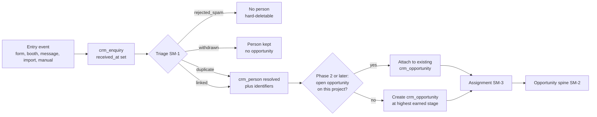
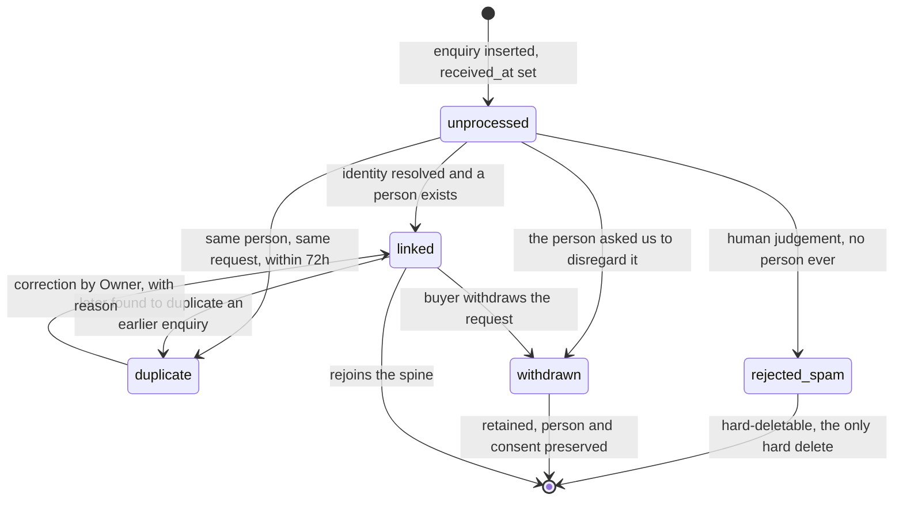
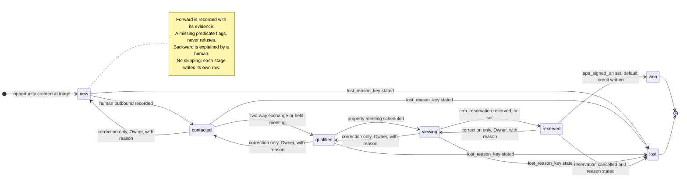

# Forever CRM — Operating Journeys and State Machines

Task ID: FOREVER-CRM-ARCH-001
Status: Proposed architecture — not approved, not scheduled, not authorized for implementation
Repository state of record: main @ 821b3c4e2f6f82e0d4ddce86199a8ff24b44a094
Risk class: R0 (documentation only)

> This document is a design record. It asserts no product truth, changes no active stage, and authorizes no implementation. The active stage remains FOREVER-STUDIO-001 (`docs/CURRENT_STAGE.md`), which lists "large CRM integration" as out of scope. Any implementing task is R2 under the shared-contract rule and requires an Architect-reviewed stage change plus Owner approval.

## What this document decides

1. **One pipeline**, `buyer_advisory`, seven stages, thirteen entry journeys, three entry points in practice (`new`, `qualified`, none) — and it survives only because stages are entered by recorded evidence rather than by being clicked.
2. **An inbound message is recordable by a human.** `Log message received` on the person record, and the `Reached` outcome emits it automatically. Without this the machine cannot pass `contacted` and every live conversation ages into `silent_persons_14d`.
3. **Evidence flags; it does not refuse.** An unmet forward predicate becomes a coverage item, not a blocked advisor. `expected_value_amount`, `expected_close_on` and `next_action_at` are optional at every transition.
4. **`next_action_at` in the future suppresses all four staleness checks** — silence, stage dwell, overdue action, and the 21-day claim. A buyer correctly left alone until October is not neglected.
5. **`reserved → won` belongs to the Assigned Guide**, with a default 10 000-bps credit row written by the RPC. Reallocation stays Owner-only.
6. **Booth captures carry `intent_tier`**; only `hot` creates an opportunity. `warm` and `browsing` keep the profile and land in a booth-follow-up queue.
7. **The 21-day lapse is `flag_only`.** The cron writes a task for the Owner and never touches an ownership column.
8. **The SLA numbers are named honestly**: one defensible automated-acknowledgement target, one hour as the strongest human threshold, and no response-time promise at all until the Owner states Forever's operating window.

Sibling documents, cited rather than restated: `docs/crm/CRM_DOMAIN_MODEL.md` (every table, column, enum and INV-D-n invariant), `docs/crm/CRM_UX_INFORMATION_ARCHITECTURE.md` (screens), `docs/crm/CRM_SECURITY_AND_RBAC.md` (capabilities and grants), `docs/crm/CRM_PRIVACY_CONSENT_RETENTION.md` (consent, suppression, s.25), `docs/crm/CRM_ANALYTICS_AND_KPI.md` (metric keys), `docs/crm/CRM_AUTOMATION_CATALOGUE.md` (the five coverage sweeps), `docs/crm/CRM_IMPLEMENTATION_PLAN.md` (phases and migration file register).

## 0. Scope, phase honesty, and the register

### 0.1 What is buildable, and when

Nothing in this document is buildable today. Slice 0 (a checked-in read-only SQL script) and Slice 1 (an Owner-only read view over `public.leads`) add **zero** `crm_*` tables. Phase 1 adds exactly eleven, in three FK-ordered migrations, and only after a recorded stage change.

| Machine | Tables it needs | Earliest phase | What exists before then |
|---|---|---|---|
| SM-1 enquiry triage | `crm_enquiry`, `crm_person`, `crm_person_identifier`, `crm_channel`, `crm_source` | **Phase 1** | nothing — Slice 1 reads `public.leads` and writes nothing |
| SM-2 opportunity spine | `crm_opportunity`, `crm_pipeline`, `crm_pipeline_stage` | **Phase 2** | Phase 1 works persons, enquiries, activities and tasks with **no board and no stage** |
| SM-3 assignment | `crm_person.relationship_owner_user_id` (Phase 1); `crm_opportunity.owner_user_id` (Phase 2) | **split** | Phase 1 has relationship ownership only |
| SM-4 booth handoff | `crm_decision_profile`, `crm_decision_answer`, `crm_appointment` | **Phase 2** | Phase 1 booth capture is person + enquiry + activity |

[Recommendation] **A pilot that cannot record a deal is still a pilot that answers buyers correctly and lawfully.** Phase 1 deliberately ships no pipeline: intake, identity, timeline, tasks, consent and suppression. The board is worth nothing over untrustworthy intake.

Phase-1 migration files, FK-ordered — `crm_catalogue_v1` (`crm_channel`, `crm_source`, `crm_processing_purpose`, `crm_notice_version`), `crm_identity_v1` (`crm_person`, `crm_person_identifier`, `crm_enquiry`), `crm_timeline_v1` (`crm_activity`, `crm_task`, `crm_consent_event`, `crm_suppression`). Version numbers are allocated once, in `docs/crm/CRM_IMPLEMENTATION_PLAN.md`, all above `20260728160000`; this document allocates none.

### 0.2 Invariant register

[Repository fact] Invariants are prefixed by owning section — `INV-D-n` (domain), `INV-J-n` (this document), `INV-P-n` (privacy) — with the flat allocation table held in `docs/crm/CRM_DOMAIN_MODEL.md`. Every cross-section citation uses the prefixed id, because a bare "INV-27" was ambiguous between a consent-timestamp guard and a stage-transition guard, and no implementer can fix that downstream. This document owns `INV-J-1` … `INV-J-5` (§6.11) and introduces **no new table**.

### 0.3 Actors

| Owner's word | Repository evidence | This document |
|---|---|---|
| Guide | `ContactForm.tsx:81` "a Forever advisor will come back to you personally"; `BoothNavigator.tsx:303` "Guided by your Forever host" | **Guide** — a human holding an active `public.studio_members` row |
| — | `studio_members.role = 'owner'` | **Owner** |
| — | `studio_members.role = 'trusted_publisher'` | **Publisher** |
| assigned Guide | `crm_opportunity.owner_user_id` | **Assigned Guide** |
| — | `crm_person.relationship_owner_user_id` | **Relationship Guide** |

[Repository fact] `public.studio_members(role TEXT NOT NULL CHECK (role IN ('owner','trusted_publisher')))` at `supabase/migrations/20260721120000_forever_studio_v1.sql:86` is the only authorization source in the repository. This document introduces **no second identity roster** and no new role value.

[Recommendation] Authority is enforced in TypeScript at the app-server boundary running as `service_role`, behind `requireSupabaseAuth → requireStudioMember → resolveStudioActor`, with database guard triggers only where an application bug would otherwise be irreversible. **No `auth.uid()` predicate, no `auth.jwt()` claim check, no `FORCE ROW LEVEL SECURITY`, and no second service-role key path is introduced by anything here.** [Repository fact] Zero occurrences of all four exist across the 24 migrations, and the CRM contract test asserts the absence of `FORCE ROW LEVEL SECURITY` with its reason recorded: it would apply the zero-policy posture to `service_role` itself and deny every CRM read. A previously circulated claim that a repo-wide pinned test already forbids it is false — `src/import/migration-security.test.ts` pins one named file only.

Offboarding is `studio_members.is_active = false`, never an `auth.users` delete. Every actor-bearing CRM row carries an email snapshot (`crm_activity.actor_email`) so a deleted account never erases history.

### 0.4 The governing rule

> **Machines may perform lookups. Only humans may perform judgements.**

- An exact hit on `crm_person_identifier(kind, canonical_value)` is a lookup — a machine may act on it.
- Deciding two similar names are the same buyer is a judgement — `crm_merge_candidate` lets a machine suggest and requires a human to decide.
- Deciding an enquiry is spam is a judgement — no sweep may set `triage_state = 'rejected_spam'`.
- Deciding a buyer is `qualified` is a judgement; *checking whether the evidence exists* is a lookup, which is why §6.2 states every gate as a SQL predicate.

Corollary, made structural by `INV-J-5`: **no automated actor may write `crm_opportunity.stage_id`, `status`, `owner_user_id`, `lost_reason_key` or `crm_person.relationship_owner_user_id`.**

[Repository fact] `crm_activity.actor_kind IN ('member','integration','system','contact')`. Two conventions this document depends on: **`actor_kind` is who wrote the row; `direction` is which way the information flowed** — a booth host logging a guest's answers writes `actor_kind='member', direction='inbound'`, which is not a contradiction. `actor_kind='contact'` is reserved for rows the contact literally produced.

## 1. The common spine



### 1.1 Where the response clock lives

[Recommendation] **The response clock lives on `crm_enquiry`. The process clock lives on `crm_opportunity`.** An opportunity is created at triage, not at enquiry, because creating one for a spam row inflates the board — but triage is a human act, so a clock on the opportunity would not start until a human had already looked, which is exactly the thing being measured. `received_at`, `acknowledged_at` and `first_response_at` therefore sit on the enquiry, and the report is a partial index:

```sql
CREATE INDEX idx_crm_enquiry_unactioned
  ON public.crm_enquiry (received_at) WHERE first_response_at IS NULL;
```

`acknowledged_at` is a separate column from `first_response_at` precisely so it is provable that an automated acknowledgement was never counted as a human response.

### 1.2 A returning buyer's second enquiry, without a schema column

`crm_activity`'s context arc is at-most-one, so one row cannot carry both `enquiry_id` and `opportunity_id`. The attach RPC writes two append-only rows sharing `person_id`: the inbound message against the enquiry, and `crm_activity(kind='system', opportunity_id=<existing>, subject_text='Enquiry attached', metadata->>'enquiry_id')` against the deal. No `crm_enquiry.opportunity_id` column is added.

### 1.3 Notification classes

[Repository fact] **Nothing on `main` notifies anybody.** No email path, no WhatsApp path, no webhook; `submitLead` inserts from the browser, so there is no server-side moment at which a lead-created event could fire.

| Class | Mechanism | Available today? |
|---|---|---|
| **N0 — durable obligation** | a `crm_task` row (`owner_user_id`, `due_at`) surfaced on the coverage board | **Yes.** The notification of record. |
| **N1 — buyer acknowledgement** | `crm_activity(kind='message', direction='outbound', is_automated=true, actor_kind='integration')` | No — blocked on a purchased gateway |
| **N2 — internal push to a Guide** | same, addressed to a member | No — same block |

**The board is the notification system until a gateway exists, and the Guide's board-refresh cadence is the real SLA floor.** Saying otherwise would publish a target that fails nightly.

## 2. Recording an inbound message — the correction that makes the machine work

This is the single highest-value change in the design, and it is a surface change, not a schema change.

| Surface | Write | Effect |
|---|---|---|
| `Log message received` on the person-record sticky bar (all CRM routes) | `crm_activity(kind='message', direction='inbound', actor_kind='member', channel=<selected>, occurred_at=<supplied>, client_request_id=<uuid>)` | `E(qualified)`'s two-way half becomes satisfiable; `crm_person.last_activity_at` advances |
| `Reached` on the post-tap outcome sheet | the same inbound row, **and** `crm_enquiry.first_response_at` | one attributed human confirmation closes both halves at once |
| Tapping `WhatsApp` / `Call` / `Email` | `crm_activity(kind='message'\|'call', direction='outbound', is_automated=false, actor_kind='member', metadata->>'link_opened'='true')` | **does not set `first_response_at`** |

[Recommendation] **A navigation event is not a response.** The `wa.me` tap records an attempt and nothing more; only the returning outcome sheet — an attributed human confirmation — sets `first_response_at`. The card stays in *Reply first* with the button relabelled "Confirm you messaged Sergey". `docs/crm/CRM_INTEGRATION_AND_EVENTS.md` is normative on this predicate and this document restates it rather than competing with it.

Without the inbound row the stage machine cannot pass `contacted`, and `last_activity_at` ages every live WhatsApp conversation into `silent_persons_14d` within a fortnight — a design that reports its most engaged buyers as neglected.

**Offline.** [Recommendation] `forever.crm.outbox.v1` buffers three append-only entry kinds — `contact_attempt`, `contact_outcome`, `note` — from any CRM route. Replay is idempotent on `crm_activity.client_request_id` with its own partial unique index (`ON CONFLICT (client_request_id) DO NOTHING`). Edits and stage changes stay read-only offline. The buffer matters exactly where the work happens: a site tour with no signal.

**Derived from these rows.** `crm_enquiry.first_response_at` and `crm_person.last_activity_at` are maintained by an `AFTER INSERT` trigger on `crm_activity`, each as one idempotent monotone statement, with a nightly reconciliation recomputing from `crm_activity` and reporting drift as a data-quality count. The writer is named in each column's `COMMENT`. A partial index cannot see the rows it excludes, so drift is undetectable from the index that consumes it.

## 3. Thirteen entry journeys

"Entry payload" means what exists on `main` today, not what a form could collect.

| # | Journey | Entry payload today, and the identity key it yields | `crm_source.key` / `capture_mode` | s.25? | Consent capturable? | Entry stage |
|---|---|---|---|---|---|---|
| J1 | Website generic (`/`, `/contact`) | [Repository fact] `src/lib/lead-service.ts:70-81` builds ten fields; no UTM, no referrer, no landing path, no IP country, no session id, no consent, no returned lead id (`submitLead` returns `Promise<void>`). Email is the only key: `ContactForm.tsx:154` renders country as free text, so `canonicalisePhone` has no region | `home_page`/`contact_page`/`contact_form` · `website` | No | Not today | `new` |
| J2 | Navigator completion (`/navigator`) | [Repository fact] **none** — `NavigatorFlow.tsx:709` navigates to `/contact` with no state; 28 answers, the confirmed Forever Story and every match reason are discarded | as J1 · `website` | No | Not today | `new` if details follow |
| J3 | Project enquiry | J1 plus `projectSlug` and `defaultInterest` (`ProjectContactCTA.tsx:19-21`) — the only path that reliably populates `leads.project_slug` | `project_detail` · `website` | No | Not today | `new` |
| J4 | Unit enquiry (`/contact?project=&unit=`) | [Repository fact] `contact.tsx` validates and renders both params, then mounts `<ContactForm source="contact_page" />` with neither — the unit reference is shown to the buyer and destroyed at submit | `contact_page` · `website` | No | Not today | `new` |
| J5 | Booth walk-in (`/booth`) | [Repository fact] `buildBoothLeadPayload` (`src/features/navigator/core/lead.ts:117`) flattens 28 structured keys, the budget **label** not the key, and the internal `staffNote` into one prose `leads.message`. Email and phone are typed by a trained host with a real region selector | `booth` · `booth` | No | **Yes** | `qualified` for `intent_tier='hot'` only (§3.2) |
| J6 | Manual Guide entry | whatever the Guide types; the worst consent posture of any journey | any; `other` fails closed · `manual` | **must be declared** | by the Guide | `new`, or earned |
| J7 | Referral / partner | a contact method plus who referred them — a referral is not consent | `referral` · `manual` | **Yes** | No | `new` |
| J8 | Developer Check | [Repository fact] the phrase appears nowhere in the repository; [Owner requirement] named only in issue #103 under Non-goals | — | — | — | **none** — an activity kind |
| J9 | Returning client | whatever the arriving channel supplies; exact identifier hit, then follow `merged_into_person_id` | inherited | inherited | inherited | attach, or `new` |
| J10 | Dormant reactivation | none — Forever initiates, which is why it is the most legally exposed | — | — | — | `new` on reply |
| J11 | Price-change re-engagement | a new `public.unit_price_history` row, or a project status change; reverse-matched on interest and opportunity | — | — | — | **none** |
| J12 | WhatsApp / email inbound | [Repository fact] nothing exists — no provider client, no credential, no handler. The identifier **is** the sender | `whatsapp_inbound`, `email_inbound` · `inbound_message` | No | No | `new` on first contact |
| J13 | Import (`leads` backfill, or external export) | arbitrary; `crm_consent_event` empty and an automatic `crm_suppression(channel='all', scope='marketing', source='legacy_backfill')` on every created person | mapped, else `import_legacy` · `legacy_form`/`import` | **fail closed: true** | No | **none** |

[Repository fact] Every channel above — web form, WhatsApp, email, in person, phone, Telegram, LINE, WeChat, Instagram — resolves against one seeded `crm_channel(key)` catalogue, to which `crm_person_identifier.kind`, `crm_suppression.channel`, `crm_activity.channel` and `crm_processing_purpose.channel` all refer. Three unaligned vocabularies previously meant a `telegram` suppression never blocked a `telegram_user_id` identifier, and `line` / `wechat` / `instagram` objections were unrecordable.

### 3.1 The journeys that carry real decisions

**J2 is the largest single loss in the intake set, and it is not a schema problem.** Persist the profile at the completion screen, before the `/contact` navigation, with a server-issued `capture_session_id` and a stub `crm_enquiry(capture_mode='website', triage_state='unprocessed')`, so the profile survives a guest who never submits. Triage discards it if no contact details ever arrive. [PROVISIONAL] Navigator persistence needs three Navigator-core changes plus a route change and is Phase-1 work behind the stage change; it is deliberately **not** promoted into Slice 1.

**J4 is the sharpest concrete defect and the cheapest repair.** Forwarding `?project=` and `?unit=` into `<ContactForm>` is a props change with no schema, and it is the one element of the first slice that restores commercial evidence on a real guest enquiry. Unit resolution is fail-closed: [Repository fact] `public.units.unit_code` is not unique and carries no cross-project uniqueness, so resolution is `WHERE unit_code = :raw AND project_id = :resolved_project`, and anything other than exactly one row leaves `focus_unit_id` NULL with the raw string preserved. Never guess a unit.

**J6 no longer mints a statutory clock against a counterparty.** [Recommendation] Creating a `crm_person` **without** a `crm_enquiry` is permitted when every role is a non-buyer role (`developer_rep`, `lawyer`, `translator`, `property_manager`, `introducer`), with `crm_person.affiliated_developer_id REFERENCES public.developers(id) ON DELETE SET NULL` — a pointer to canonical truth, never a copy of a developer fact, and therefore INV-D-1-clean. Adding a developer's sales manager must not start a 30-day notice clock. Where the person *is* a buyer the enquiry stays mandatory, because it carries `source_key`, `s25_notice_required` and the response clock. The create RPC runs the identifier lookup first and surfaces open `crm_merge_candidate(signal_key='trgm_display_name')` rows before allowing a second similar person: manual creation is the dominant duplicate source in every CRM, so the dedupe belongs in the create path, not in a cleanup queue.

**J6 and J7 end in a discharged notice, not a red counter.** [Recommendation] `crm_enquiry` carries `s25_notice_method CHECK (s25_notice_method IN ('email','whatsapp','in_person','post'))` and `s25_notice_sent_by`, paired-null with `s25_notice_sent_at`, plus a one-tap **Notice given** action. A Guide who says on the phone "we got your details from Sergey, here is our privacy notice" has discharged the duty, and that recorded evidence is stronger than a send log. A compliance counter that only ever goes up trains everyone to ignore the compliance section. [Web research — descriptive only, not legal advice; qualified Thai counsel must confirm the duty and its discharge] https://cc.kmutt.ac.th/Files/Act%20Eng/personal-data-protection-act-2019-en.pdf

**J9 and J12 must follow the merge pointer.** Inserting the identifier and receiving zero rows means **the identifier already belongs to someone**, not that the write succeeded: the consumer reads the owning `person_id` back and walks `merged_into_person_id` to the survivor before inserting the activity. This branch is carved out of the blanket "zero rows is success" rule. Where the value is genuinely shared — joint buyers, a corporate switchboard — the second person's identifier is written `is_match_key = false`: reachable, renderable, never auto-matched, and raising `crm_merge_candidate(signal_key='shared_party_group')` for a human.

**J10 and J11 are two queries, never one list.** Contacting a person about **their own open enquiry** is `enquiry_response` and needs no consent. Contacting a person whose only opportunity closed long ago, about anything else, is direct marketing: it needs a live, un-voided `crm_consent_event(purpose_key='direct_marketing', action='given')` and no covering suppression. `crm_may_send_marketing` resolves `merged_into_person_id` to the survivor **first**, in every caller including the INV-D-23 trigger — otherwise merging a suppressed duplicate silently restores eligibility on the one duty this package calls absolute. These sweeps create `crm_task` rows only; a machine creates work, never contact.

**J11 deliberately emits fewer signals than it could.** [Recommendation] The `units_touched` watch on `public.units.updated_at` is suppressed until a canonical `unit_availability_history` table exists: any column write bumps that timestamp, so it produces unbounded "this record changed, check it" tasks nobody can action. Price-history and project-status changes are exact and are kept, with day-bucketed dedupe keys and a per-person daily cap enforced at enqueue. **No CRM row ever holds a price** (INV-D-1). Where the unit sits under a live `crm_unit_hold` the task is high priority — and the hold always renders with its verification age, because the hold index delivers **intra-Forever exclusivity only** and the CRM is confidently stale about developer reallocation. `developer_confirmed_at`, `last_verified_at`, a one-tap "I verified this with the developer" and `holds_unverified_over_7d` are what make that honest; the conflict flag points at the **staler** side rather than asserting the unit table.

**J12's platform facts land in the state machine, not the schema.** [Web research] Delivery order is not guaranteed, so timelines order by `occurred_at` — the provider's timestamp — never by insertion order: https://developers.facebook.com/docs/whatsapp/cloud-api/guides/send-messages [Web research] Meta retries webhooks and states the receiving server should handle deduplication, so `(channel, external_id)` plus `ON CONFLICT DO NOTHING`, made sound by `CHECK (external_id IS NULL OR channel IS NOT NULL)` — without it two `(NULL,'wamid.X')` rows both insert and the conflict target never matches: https://developers.facebook.com/docs/graph-api/webhooks/getting-started [Web research] Outside the 24-hour customer-service window only pre-approved templates may be sent and template review takes up to 24 hours, so nothing can be authored mid-conversation; the reply state is a projection, computed and never stored:

```sql
-- 'free_form' | 'template_only'
CASE WHEN MAX(a.occurred_at) FILTER (
       WHERE a.direction = 'inbound' AND a.channel = 'whatsapp')
       > now() - interval '24 hours'
     THEN 'free_form' ELSE 'template_only' END
```

**J13 imports a person and a note, not a deal.** A historical `won` deal whose commission split nobody can now reconstruct is imported as person + internal note + **no opportunity**, and that is the correct outcome: inventing a split to satisfy a constraint is how a commission dispute is manufactured. The Owner-supplied case with a real allocation and an SPA date imports cleanly. [Repository fact] The `public.leads` backfill creates no person, no identifier and no opportunity — every row lands at `crm_enquiry(triage_state='unprocessed', capture_mode='legacy_form')`, so go-live begins with a human triage queue and **the unactioned report is meaningless until that queue is drained**. Draining it is the first CRM task, not a background chore.

### 3.2 The booth: `intent_tier` is the one fact only the human in the room has

[Recommendation] The booth capture payload requires `intent_tier CHECK (intent_tier IN ('hot','warm','browsing'))`.

| `intent_tier` | Records created | Lands in |
|---|---|---|
| `hot` | person + enquiry + decision profile + interest + appointment + **opportunity at `qualified`** | the Assigned Guide's Today |
| `warm` | person + enquiry + decision profile + interest | the booth-follow-up queue, with its own count |
| `browsing` | same as `warm` | the same queue, ordered below it |

A three-day expo would otherwise produce roughly a hundred `qualified` opportunities each demanding a next action, and the queue that results is abandoned within a week. Nothing is lost: the decision profile, which is the real prize, is persisted in every tier.

## 4. Does one pipeline fit all thirteen?

Take the extremes the Owner names. A booth walk-in at 15:00 Phuket: a trained host beside the guest, 28 structured answers, a Forever Story confirmed face to face, contact details typed by the host. A 02:00 Moscow-evening web form: nine free-text fields typed by a stranger, no session, no attribution, no consent.

| Dimension | Booth | 02:00 web form | Same? |
|---|---|---|---|
| Terminal outcomes, lost-reason vocabulary, evidence ladder, objects, ownership model | identical | identical | **Same** |
| How much of the ladder is satisfied at entry | up to three stages | zero | Different |
| Whether the session was broken | never | always | Different |
| Response-clock semantics | no gap to measure | `received_at → first_response_at` | Different |

Only the last three differ, and none is a stage-vocabulary difference. They are differences in entry point, measurement and operating script — none of which a second pipeline fixes, and all of which a second pipeline obscures by making the two populations non-comparable. **Verdict: one pipeline, `buyer_advisory`.** A second pipeline is justified only by a structurally different *counterparty* — resale sellers over `public.listings` (a vendor is not a buyer; terminal states are instructed/withdrawn/sold, and `public.studio_listing_contacts` is seller PII on a deliberately separate boundary) or developer-partner onboarding. Never by a new channel, a referral source, a Developer Check, or spam.

[Recommendation] **No per-source SLA target column.** Stage dwell varies by stage and stays a row on `crm_pipeline_stage`; first response varies by source and is unmeasurable per source at this volume (§9). One first-response class for all sources, measured rather than promised.

## 5. SM-1 — Enquiry triage



| State | Meaning | Authority | Constraint |
|---|---|---|---|
| `unprocessed` | nothing decided; `person_id` NULL | default on insert | — |
| `linked` | the enquiry of record for a person | **Guide**, or the capture RPC when the identifier match is exact and unambiguous (a lookup) | `CHECK (triage_state <> 'linked' OR person_id IS NOT NULL)` |
| `duplicate` | same person, substantially the same request; excluded from enquiry counts | Guide | `person_id` permitted |
| `rejected_spam` | not a real person or not a real request | **Guide only. Never a sweep.** | `CHECK (triage_state <> 'rejected_spam' OR person_id IS NULL)` |
| `withdrawn` | a real person asked us to disregard it, including an s.32 objection arriving as an enquiry | Guide | person and consent state retained |

`duplicate` exists to protect the counts, not to hide rows: without it a buyer who submits twice in an afternoon inflates enquiry volume, one of the few numbers Forever can honestly report. `rejected_spam` is the schema's only hard delete, and it is safe precisely because the CHECK guarantees no person was ever linked.

**Phase 1 stops here.** With no `crm_opportunity` table, `linked` means "worked as a person with a timeline and tasks". That is enough to answer a buyer, discharge a notice and measure a response.

## 6. SM-2 — The opportunity spine (Phase 2)

### 6.1 Vocabulary

[Repository fact] `docs/ROADMAP.md:141` reads verbatim: *"measurable stages: new → contacted → qualified → viewing → reserved → closed/lost"*. Adopted unchanged, with `closed/lost` — one slot naming two outcomes — resolved into two terminal rows, because `crm_pipeline_stage.terminal_outcome CHECK (terminal_outcome IN ('won','lost'))` cannot represent one slot as one row.

| `crm_pipeline_stage.key` | position | `is_terminal` | `terminal_outcome` | ROADMAP:141 | `leads.status` |
|---|---|---|---|---|---|
| `new` | 1 | false | — | `new` | `new` |
| `contacted` | 2 | false | — | `contacted` | `contacted` |
| `qualified` | 3 | false | — | `qualified` | `qualified` |
| `viewing` | 4 | false | — | `viewing` | — |
| `reserved` | 5 | false | — | `reserved` | — |
| `won` | 6 | **true** | `won` | `closed` | `closed` |
| `lost` | 7 | **true** | `lost` | `lost` | — |

A strict superset of both existing vocabularies. `spam` is deliberately absent — it is triage, not a stage.

### 6.2 Evidence predicates, and the rule that they flag rather than refuse

> **A forward transition records its evidence. An unmet predicate is a coverage item, not a locked door.**

This is the corrected rule and it reverses the draft. The advisor moves the card; the RPC evaluates `E(stage)`; where the predicate does not hold it writes the transition, stamps `metadata->>'evidence_missing'` on the stage-change activity, and raises the coverage item `stage_evidence_missing` [Recommendation — proposed metric key] on the Owner's Pulse. This is the same pattern the domain section already uses for unmatched appointment resolutions.

Let `o` be the opportunity and `p = o.person_id`.

| Stage | Meaning | `E(stage)` |
|---|---|---|
| `new` | an enquiry and a person exist | `true` |
| `contacted` | a **human** at Forever reached out | `EXISTS (SELECT 1 FROM public.crm_activity a WHERE a.person_id = p AND a.direction = 'outbound' AND a.is_automated = false AND a.actor_kind = 'member' AND a.kind IN ('call','message','email','meeting'))` |
| `qualified` | they engaged back | `( EXISTS(human outbound, above) AND EXISTS(inbound from p at or after it) ) OR EXISTS (SELECT 1 FROM public.crm_appointment ap WHERE ap.person_id = p AND ap.outcome = 'held')` |
| `viewing` | a real property meeting is scheduled or held | `EXISTS (SELECT 1 FROM public.crm_appointment ap WHERE ap.opportunity_id = o.id AND ap.appointment_type IN ('site_tour','office_meeting','video_call','developer_meeting') AND ap.scheduled_start_at IS NOT NULL AND ap.outcome <> 'cancelled_by_us')` |
| `reserved` | a live reservation exists | `EXISTS (SELECT 1 FROM public.crm_reservation r WHERE r.opportunity_id = o.id AND r.reserved_on IS NOT NULL AND r.cancelled_on IS NULL)` |
| `won` | the SPA is signed | `EXISTS (SELECT 1 FROM public.crm_reservation r WHERE r.opportunity_id = o.id AND r.spa_signed_on IS NOT NULL)` |
| `lost` | terminal negative, with a stated reason | `o.lost_reason_key IS NOT NULL` |

Four decisions inside that table:

1. **`E(qualified)` lost its second half.** Requiring `expected_value_amount` **and** `expected_close_on` **and** `next_action_at` to move a card one column contradicted this package's own build rule — *no required field an advisor cannot answer from the conversation* — and inventing a close date to satisfy a constraint is precisely how the stage data six other metrics depend on becomes fiction. All three fields are **optional at every transition**; their absence surfaces as `opportunities_without_value` and `opportunities_without_next_action`, which are counts, not blockers.
2. **`contacted` excludes automation deliberately.** [Web research] The market's own definition of "unactioned" is no outbound call, email or text from the *assigned* agent, with automated, marketing and batch sends explicitly excluded — https://help.followupboss.com/hc/en-us/articles/4402128249367-Dashboard. Compiled into `idx_crm_activity_human_outbound (person_id, occurred_at DESC) WHERE direction = 'outbound' AND is_automated = false`.
3. **`inspection_trip` is gone from `appointment_type`.** A multi-day buyer visit was never a meeting; it becomes the deferred `crm_trip` container, triggered by the first visit spanning more than one day.
4. **`lost` is the only stage whose evidence is a stated reason** rather than a recorded fact, because "nothing happened" cannot be evidenced positively. That asymmetry is why `CHECK (status <> 'lost' OR lost_reason_key IS NOT NULL)` exists.

**The two gates that still refuse** are terminal and cheap to satisfy: `lost` without `lost_reason_key` (a domain CHECK, not an `INV-J-3` predicate), and `won` without a `crm_reservation.spa_signed_on` date. Both would otherwise record a falsehood about money.

### 6.3 The diagram



**No stage may be skipped.** Where several predicates hold at once — the `hot` booth case — the RPC walks the ladder and writes one `crm_activity(kind='stage_change')` per step at the same `occurred_at`, each citing the row that evidenced it. The board shows `qualified`; the history shows how it got there; cohort analysis stays intact.

### 6.4 Transition authority

| Transition | Assigned Guide | Publisher (not assigned) | Owner | Sweep (cron) | Integration |
|---|---|---|---|---|---|
| Claim an unassigned opportunity | — | **yes** | yes | no | no |
| `new → contacted` … `viewing → reserved` | **yes** | no | yes | **no** | no |
| `reserved → won` | **yes** | no | yes | **no** | no |
| `* → lost` | **yes** | no | yes | **no** | no |
| Backward (correction) | no | no | **Owner only** | no | no |
| Write `crm_activity` / `crm_appointment` / `crm_task` | yes | **yes** | yes | yes | yes |
| Write `owner_user_id` / `relationship_owner_user_id` | no | no | **Owner only** | **never** | no |
| Change `crm_opportunity_credit` | no | no | **Owner only** | no | no |

Three deliberate asymmetries:

- **`reserved → won` is the Assigned Guide's.** A signed SPA is objective evidence and needs no seniority; making it Owner-only meant `closed_at` recorded when the Owner got round to it, and a solo advisor could not record their own win. The win RPC inserts a default `crm_opportunity_credit(member_user_id = o.owner_user_id, credit_role = 'lead_advisor', share_bps = 10000)` when none exists and records it as a visible `crm_activity(kind='system')`. **Reallocation remains Owner-only**, as its own audited step. INV-D-14 moves off the transition and becomes the coverage check `wins_without_credit_reallocation`, evaluated as `COALESCE(SUM(share_bps), 0) <> 10000` — over zero rows `SUM` returns NULL and `NULL <> 10000` is NULL, so the un-coalesced form silently permitted exactly the case it existed to catch.
- **A Publisher who is not the Assigned Guide may enrich but not advance.** They can log the call they just took and schedule the viewing they just arranged, so nothing is lost, but they cannot move someone else's deal. [Web research] This is Attio's coarse, additive, most-permissive-wins shape — https://attio.com/help/reference/managing-your-data/objects/manage-access-to-objects — not Pipedrive's visibility groups, which are actively harmful when a booth host's walk-in must be instantly visible: https://support.pipedrive.com/en/article/visibility-groups
- **No sweep touches a stage or an owner**, in any direction, under any condition (`INV-J-5`).

### 6.5 What each transition actually requires

| Transition | Required before the RPC commits |
|---|---|
| create → `new` | `person_id`; `pipeline_id` + `stage_id` satisfying the composite FK; `origin_enquiry_id` where one exists |
| `new → contacted` | the stage-change activity |
| `contacted → qualified` | `expected_value_currency` **if** `expected_value_amount` is set (paired CHECK) |
| `qualified → viewing` | the appointment carries `timezone` (default `Asia/Bangkok`) and a `project_id` where the meeting is about a project |
| `viewing → reserved` | `crm_reservation.currency`; requirement rows seeded by the creating RPC |
| `reserved → won` | `crm_reservation.spa_signed_on`; `closed_at`; the default credit row (auto-written) |
| `* → lost` | `lost_reason_key`; `closed_at`; a `body_text` reason when `lost_reason_key = 'other'`; for `unresponsive`, the §6.8 evidence |
| backward | Owner identity; non-empty `body_text`; and for `won`/`lost` → open, `closed_at > now() - interval '7 days'` |

**Not required anywhere:** a value, a close date, a next action, a probability, a weighting, a score, a rank or a forecast category. INV-D-20's greppable column-name test means the numeric ones are not storable, and nothing in this document renders a percentage with a denominator under 30.

### 6.6 Backward transitions

**Forward is recorded; backward is explained.** Backward transitions are permitted — a deal genuinely falls out of `viewing` when the buyer cancels and reschedules nothing — but only by the Owner and only with a written reason on the mandatory stage-change activity.

They are never automatic. An appointment resolving to `no_show` or `cancelled_by_buyer` does **not** regress the stage; the coverage board surfaces it as a data-quality item ("at `viewing` with no held and no future appointment"). An automatic regression would be a machine judging a person, and it would make stage history non-monotone, corrupting every derived timestamp in §6.7.

### 6.7 Materialised versus derived

Materialise only when all three hold: set once and monotone; used as an index predicate or join key on a hot path; and not already the primary record of the fact elsewhere.

| Timestamp | Materialised? | Why |
|---|---|---|
| `crm_person.first_seen_at` | **yes**, set once | attribution must be immutable and must survive a spam hard-delete |
| `crm_person.last_activity_at` | **yes**, by trigger | deriving it is a `MAX()` over the largest table, per person, per board render |
| `crm_enquiry.acknowledged_at` | **yes** | a separate clock from the human one — this is what makes it provable |
| `crm_enquiry.first_response_at` | **yes**, by trigger | `idx_crm_enquiry_unactioned … WHERE first_response_at IS NULL` **is** the report; a derived value cannot be a partial-index predicate |
| `crm_opportunity.stage_entered_at` | **yes** | the dwell clock is a `WHERE` predicate joined to `target_time_in_status_hours` |
| `crm_opportunity.closed_at` | **yes** | half of `CHECK ((status = 'open') = (closed_at IS NULL))` |
| `qualified_at`, `first_viewing_at`, `reserved_at`, `owner_assigned_at` | **no — derived** | each is already the primary record somewhere (`crm_appointment.scheduled_start_at`, `crm_reservation.reserved_on`, `crm_activity(kind='assignment')`); a second date of record can disagree with the timeline |

```sql
-- Stage entry times for one opportunity. Requires INV-J-2.
SELECT a.metadata ->> 'to_stage_key' AS stage_key,
       min(a.occurred_at)            AS entered_at
FROM public.crm_activity a
WHERE a.opportunity_id = $1 AND a.kind = 'stage_change'
GROUP BY 1;
```

`INV-J-2` is therefore not bookkeeping — it is the storage mechanism for every derived stage timestamp. Any date derived from an instant is pinned: `(now() AT TIME ZONE 'Asia/Bangkok')::date`, never a bare `CURRENT_DATE`, which renders in the session TimeZone (UTC on Supabase unless set) and gives seven hours of wrong answers every evening. A contract test forbids bare `CURRENT_DATE` and un-converted `date_trunc` over a `timestamptz` in any `crm_*` body.

### 6.8 Lost reasons for Phuket off-plan

The enum is fixed by the domain section: `price, timing, competitor, financing, ownership_rules, unresponsive, changed_mind, not_qualified, duplicate, other`. The operating definitions are what make it useful.

| Key | Phuket off-plan definition | Disambiguation |
|---|---|---|
| `price` | would proceed on this project, not at this price | cannot afford the segment at all → `not_qualified` |
| `timing` | their horizon moved, or handover slipped past their need — developer slippage is a `timing` loss | bought elsewhere meanwhile → `competitor` |
| `competitor` | bought elsewhere, agency or direct | **requires evidence**; never inferred from silence |
| `financing` | could not move the funds; foreign-currency transfer evidence unavailable, or a bank declined | the money exists, the route does not |
| `ownership_rules` | **the one genuinely Phuket-specific reason** — foreign freehold quota exhausted, leasehold or company structure unacceptable, nationality or visa position blocking the intended structure | signals a **product/inventory** gap, not a sales failure; review separately |
| `unresponsive` | went silent | **constrained** — see below |
| `changed_mind` | explicitly withdrew | requires an inbound statement; without one it is `unresponsive` |
| `not_qualified` | cannot practically or lawfully complete anything Forever covers | must be rare; never a judgement of the person |
| `duplicate` | duplicates another opportunity; used with the merge path | approaches zero once deterministic matching is live |
| `other` | anything else | requires a `body_text` reason |

[Recommendation] **`unresponsive` is not a synonym for "we gave up".** The RPC requires, evidenced on the timeline: at least three human outbound attempts, across at least two channels, spanning at least fourteen days, all after `stage_entered_at`. Without the rule it becomes the most common lost reason and a euphemism for under-service, destroying the one signal that would have told the Owner about coverage. With it, a deal that cannot be marked `unresponsive` is visibly a deal that was under-worked. Enum health is tracked as a count — five `other` losses in a quarter triggers a review — never as a share.

Deliberately absent: `no_budget` (split across `price` and `not_qualified`), `lost_to_agent` (`competitor`), `went_dark` (`unresponsive`), `spam` (never reaches an opportunity), and any value judging the person rather than the transaction.

### 6.9 Reopen

> **A closed opportunity is never reopened. A returning buyer gets a new `crm_opportunity`.**

1. `closed_at` and `lost_reason_key` would have to be destroyed. Reopening must null `closed_at`, erasing when the first cycle ended; clearing `lost_reason_key` erases the only structured learning the CRM produces.
2. Credit allocation is a one-shot record. A reopened-then-rewon row re-runs allocation over a split that already stood — two Guides, two eras, one row, and an unsolvable dispute.
3. Continuity lives on the person, not the opportunity: `crm_activity(person_id)` carries the history, `crm_person_interest` the shortlist, `crm_decision_profile.superseded_by_id` the chain of how their thinking changed, `first_seen_at` the attribution.
4. A second cycle genuinely is a second process — different money, different timeline, often a different project.

The link is explicit without a column: the reactivation RPC writes `crm_activity(kind='system', opportunity_id=<new>, subject_text='Reactivated', metadata={prior_opportunity_id, prior_lost_reason_key, days_dormant})`. **One bounded exception:** an opportunity marked `lost` by mistake is a *correction* (§6.6), Owner-only, with a reason, and only while `closed_at > now() - interval '7 days'`. Beyond that window it is a reactivation. A bounded correction window is what stops "correction" becoming an unbounded reopen by another name.

There is no unique index forbidding two open opportunities for one person on one project. [Repository fact] `units.project_id UUID NOT NULL` at `20260704055333:80`, so one buyer taking two units in one project — the highest-margin shape Forever has — would have been unrepresentable. It is replaced by the nightly coverage count `duplicate_open_opportunities_same_project`: a unique index that forbids a real transaction is worse than a count that reports an unusual one.

### 6.10 Auditability

Every stage change produces **three** durable artefacts, in one transaction:

| Artefact | Content |
|---|---|
| `crm_opportunity` row update | `stage_id`, `stage_entered_at`, `status`, `closed_at`, `lost_reason_key` |
| `crm_activity(kind='stage_change')` | `from_stage_key`, `to_stage_key`, evidencing row id, `evidence_missing` where applicable, `body_text` where required, `actor_kind`, `actor_user_id`, `actor_email`, `occurred_at` |
| `public.audit_log(action='crm.opportunity.stage_change')` | populated `old_values` / `new_values`, `actor_id`, `actor_email` |

There is **no `crm_record_history` table.** It was cut: the reuse map already directs reusing `public.audit_log` with `crm_*` action values, and a second history table was both churn and the holder of un-erasable JSONB copies of every buyer's name.

Two changes from the repository's current habit: [Repository fact] `old_values` and `new_values` exist on `public.audit_log` and are never written by any code on `main`, and there is no audit trigger anywhere; and the write must be **inside** the transaction, because `recordAuditSafely` swallows every failure post-commit — adequate for a publishing action, inadequate as evidence in a commission dispute.

### 6.11 Invariants owned here

| # | Invariant | Enforced at |
|---|---|---|
| **INV-J-1** | `crm_opportunity.status` agrees with its stage's terminality: `(status = 'open') = (NOT stage.is_terminal)`, and `status = stage.terminal_outcome` when terminal. | RPC, plus a nightly coverage count. A deferred constraint trigger only if `npm run studio:pg-test` first proves `CONSTRAINT TRIGGER … DEFERRABLE` on the disposable cluster — [Repository fact] zero occurrences exist in the repository. |
| **INV-J-2** | Every change of `stage_id` writes exactly one `crm_activity(kind='stage_change')` in the same transaction, carrying `from_stage_key`, `to_stage_key` and the evidencing row id. | RPC writes it; same proof requirement before any deferred construct is specified. Load-bearing for §6.7. |
| **INV-J-3** | A forward transition **records** its evidence predicate and raises `stage_evidence_missing` when it does not hold; it is never refused on that ground. A backward transition requires Owner identity and a non-empty reason. | Server boundary (`crm_advance_stage`); DB guard only for the two terminal gates in §6.2 |
| **INV-J-4** | A `crm_opportunity` row is never hard-deleted. | DB `BEFORE DELETE` trigger — required so derived timestamps are stable |
| **INV-J-5** | No automated actor writes `stage_id`, `status`, `owner_user_id`, `lost_reason_key` or `crm_person.relationship_owner_user_id`. | Server boundary (primary); the sweeps have no code path that issues these updates |

[Repository fact] The repository contains 25 `CREATE TRIGGER` statements in its entire history. Phase 1 caps new guards at those protecting something irreversible — a person is never deleted, an activity is immutable except for redaction, `leads.status` is frozen, no marketing send reaches a suppressed person — plus `set_updated_at`. Everything else is a coverage query.

## 7. SM-3 — Assignment, ownership, and the deliberate wait

### 7.1 Ownership state is a projection

There is no `assignment_state` column, so there is no column that can disagree with the timeline. **Acknowledgement is not a button:** it is the first attributed act by the Assigned Guide after the assignment — a note, a logged call, a scheduled meeting. A Guide cannot acknowledge a lead they have not touched.

Let `A` = the newest `crm_activity(kind='assignment')`, `G = o.owner_user_id`.

| State | Predicate |
|---|---|
| `unassigned` | `o.status = 'open' AND G IS NULL` |
| `assigned` | `G IS NOT NULL` and no activity by `G` at or after `A.occurred_at` |
| `acknowledged` | such an activity exists, but none is a human outbound |
| `working` | a human outbound by `G` at or after `A.occurred_at` exists |
| `waiting` | `working` **and** `o.next_action_at > now()` |
| `stalled` | `working` or `acknowledged`, **not** `waiting`, and either the dwell target is exceeded or the newest Guide outbound is older than 14 days |
| `released` | `unassigned` with a prior assignment in history — reachable only by an Owner action, never by a sweep |
| `closed` | `o.status <> 'open'` |

### 7.2 `next_action_at` is the universal suppressor

> **A deal with a future `next_action_at` is not silent, not stalled, not overdue, and does not lapse.**

[Owner requirement + Recommendation] This is the highest-value operational correction in the package after §2. Forever runs a six-to-eighteen-month off-plan cycle; a buyer correctly left alone until October was raising three separate flags and costing their Guide the relationship claim. Every staleness predicate now carries `AND (o.next_action_at IS NULL OR o.next_action_at <= now())`:

| Check | Metric key | Suppressed by a future `next_action_at` |
|---|---|---|
| Silence | `silent_persons_14d` | yes |
| Stage dwell | `stage_dwell_breaches` | yes |
| Overdue action | `overdue_next_actions` | yes, by definition |
| 21-day relationship claim | §7.3 | yes, where the person holds any open opportunity with a future `next_action_at` |

[Recommendation] `crm_pipeline_stage.target_time_in_status_hours` is seeded **NULL** for `qualified`, `viewing` and `reserved`. Inside-sales numbers do not describe this cycle. The Owner sets them from observed `cycle_time_days` once twelve transitions exist, and until then the Pulse tile reads **"Not configured"**, never `0` — a clean zero derived from missing evidence is a positive all-clear the rest of the design forbids.

### 7.3 The 21-day rule, and the line the sweep may not cross

[Owner requirement] A Guide who works a buyer keeps them for 21 days.

| Aspect | Decision |
|---|---|
| What is protected | the **relationship** — `crm_person.relationship_owner_user_id` — not the individual opportunity, because a buyer may hold three opportunities and a per-opportunity claim would let a second Guide take the same person via a different project |
| What starts the clock | the assignment activity |
| What resets it | a Guide-attributed human outbound: `direction='outbound' AND is_automated = false AND actor_user_id = relationship_owner_user_id` |
| What does **not** reset it | the buyer replying; an automated send; another Guide's activity; a system row |
| What happens at day 21 | **`flag_only`.** The sweep writes one `crm_task` for the Owner. It does not null `relationship_owner_user_id`, does not release any opportunity, and writes no ownership column at all. |
| What survives | every assignment activity, every credit row, `first_touch_source_key` — a lapsed claim is not an erased contribution |

```sql
-- The lapse flag. Evaluated once per person per sweep. Writes a task, nothing else.
SELECT p.id
FROM public.crm_person p
WHERE p.relationship_owner_user_id IS NOT NULL
  AND p.deleted_at IS NULL
  AND p.merged_into_person_id IS NULL
  AND NOT EXISTS (
        SELECT 1 FROM public.crm_activity a
        WHERE a.person_id     = p.id
          AND a.actor_user_id = p.relationship_owner_user_id
          AND a.direction     = 'outbound'
          AND a.is_automated  = false
          AND a.occurred_at   > now() - interval '21 days')
  AND NOT EXISTS (
        SELECT 1 FROM public.crm_opportunity o
        WHERE o.person_id = p.id AND o.status = 'open'
          AND o.next_action_at > now());
```

[Unverified assumption] **21 days is an Owner policy number, not an evidence-based one.** No source in the research set supports 21 over 14 or 30. It ships as a TypeScript constant with its review trigger — the first ownership dispute — written in the comment beside it, and it is never presented as a finding.

**Why release was removed entirely.** Releasing withdraws a lapsed claim; assigning decides which human should own a relationship, which needs ordered routing rules with working hours and vacation that do not exist. [Web research] https://help.lofty.com/hc/en-us/articles/360055177831-Lead-Routing-How-to-set-up-lead-routing-rules — auto-assign without them is round-robin into an empty office at 02:00 Phuket time, worse than the pool. But the release direction was specified three incompatible ways across this package, and a machine performing a commission-relevant write on a clock is the wrong default at ten seats. The lapse becomes **visible**; the Owner acts.

### 7.4 The fallback ladder when a Guide does not respond

Every rung is a `crm_task` row and a board entry. **No rung sends a message, because nothing on `main` can.**

| T+ | Condition | Action | Actor |
|---|---|---|---|
| 0 | assignment | `crm_task('Acknowledge and make first contact', due_at = +1h)` for the Assigned Guide | RPC |
| 1 h | state = `assigned` | the task shows overdue; a second task is created for the **Owner** | sweep |
| 24 h | no human outbound | the enquiry enters the unactioned list (partial index) | sweep |
| 72 h | no human outbound | the Owner **may** reassign — a human act, with a reason | Owner |
| 14 d | no Guide outbound and not `waiting` | `stalled`, on the coverage board | sweep |
| 21 d | same | claim flagged for the Owner (§7.3) | sweep |

## 8. SM-4 — The booth warm handoff

The booth is the only journey where the buyer's session is never broken, which is where the evidence says the value actually is (§9).

```mermaid
sequenceDiagram
    autonumber
    participant G as Guest
    participant H as Booth host on the tablet
    participant N as Navigator core, pure
    participant F as crm_capture_booth_enquiry
    participant DB as Supabase
    participant A as Assigned Guide
    Note over H: PREREQUISITE P-3 - /booth has no auth guard today.
    H->>H: Authenticate; server-expiring session bound to capture_session_id
    G->>H: Walks up
    H->>N: NAV-001, 9 screens, 28 keys
    N-->>H: DecisionProfile, ForeverStory, RecommendationPath, MatchReasons
    H->>G: Reads the Forever Story back; guest confirms or edits
    H->>G: Shows matched projects; guest selects one
    Note over H,G: PREREQUISITE P-4 - the versioned notice is rendered here.
    G-->>H: Contact details, ISO-3166 selection, marketing consent given or refused
    H->>H: Records the internal staffNote separately; sets intent_tier
    H->>F: ONE call: contact, answers, story, selection, consent, intent_tier
    activate F
    F->>DB: canonicalise email and phone (E.164, region from the selector)
    F->>DB: upsert crm_person and identifiers; is_match_key false on a shared value
    F->>DB: crm_enquiry (capture_mode booth, first_response_at = received_at)
    F->>DB: crm_decision_profile and crm_decision_answer rows
    F->>DB: crm_consent_event x2, bound to crm_notice_version.id
    F->>DB: crm_appointment (booth_meeting, outcome held)
    F->>DB: crm_activity: meeting inbound, meeting outbound, internal note
    F->>DB: crm_person_interest (shortlisted)
    F->>DB: if intent_tier is hot - crm_opportunity walked new to qualified, 3 stage_change rows
    F->>DB: crm_activity (assignment) and crm_task; audit_log row
    deactivate F
    F-->>H: enquiryId, capturedAt
    alt A Guide is present
        H->>A: Warm handoff in the room; the session is never broken
        A->>DB: first attributed act, state becomes acknowledged
    else No Guide present
        H->>G: States when contact will come
        H->>DB: crm_activity (meeting, outbound) recording that promise
    end
    H->>H: Clear the tablet draft on successful commit
```

**The receipt reveals nothing.** [Recommendation] The RPC returns `{ enquiryId, capturedAt }` only — never `person_id`, never `opportunity_id`, never the entry stage. A booth capture whose canonicalised identifier resolves to an existing live person lands at `crm_enquiry(triage_state='unprocessed', person_id = NULL)` for human triage, and the receipt does not disclose which branch was taken. Otherwise a write-only principal on a shared tablet becomes a read oracle, and a walk-in guest's session silently binds onto an existing buyer's record. The principled exception: `crm_capture_enquiry` (public) never creates a person; `crm_capture_booth_enquiry` may, and only because an authenticated, trained human typed and verified the details in the room. `capture_channel = 'booth_tablet'` requires a non-null `actor_user_id`.

**Five things this fixes**, each [Repository fact]: 28 structured keys are flattened into prose (`lead.ts:117-131`) and become `crm_decision_answer` rows; the internal `staffNote` is concatenated into the guest-facing blob (`lead.ts:107-111`) and becomes `crm_activity(kind='note', visibility='internal')`; `budget` is written as the display label rather than the key (`lead.ts:128`) and becomes the key with the label archived in the option registry; the booth session has no id, version or `capturedAt`; `useBoothSession` rehydrates any structurally plausible payload unconditionally, which on a shared walk-in tablet is a guest-data-leak path.

## 9. SLA — evidence, folklore, and what Forever may honestly promise

### 9.1 The measurement Forever cannot make yet

[Owner requirement — open] **Forever's actual operating hours and days in Asia/Bangkok are not recorded anywhere, and no response-time count may be published against an assumed window.** This is the denominator for every response metric in the package, and it is not inferable from the repository. Equally uninferable and equally needed: the call-duration threshold that separates a conversation from a voicemail (60 seconds proposed).

This is not a criticism of anyone's process. It is the one input that turns a plausible number into a defensible one, and until the Owner supplies it the honest posture is to report **counts and ages** — enquiries with no response, oldest first — and no breach percentage at all. A target published against a guessed window fails nightly for reasons nobody could have prevented, and the section that fails nightly is the section everyone stops reading.

### 9.2 The one target that is defensible

**Automated acknowledgement to the buyer.** Deterministic, measurable with a denominator of one, and independent of Guide behaviour.

| Phase | Mechanism | Honest target |
|---|---|---|
| Cron-mediated capture | the tick reads `public.leads` and creates the enquiry | **within 10 minutes** — [Repository fact] `wrangler.jsonc` declares `"crons": ["*/5 * * * *"]`, so the period plus jitter is the floor; a 2-minute promise is arithmetically impossible |
| Server-function capture | the write moves behind a `createServerFn` and the ack issues in the same request | **within 2 minutes** |

Both are blocked on a purchased gateway existing at all. [Web research] A pleasant coincidence rather than a justification: the market leader in speed-to-lead ships a deliberate lead-flow delay of up to five minutes so that routing is correct — https://help.followupboss.com/hc/en-us/articles/4402128249367-Dashboard

### 9.3 Folklore versus evidence

| Claim | Status | Source |
|---|---|---|
| "Respond within 5 minutes or lose the lead" | **Folklore.** | [Web research] A single 2007 vendor study whose own author states the 100×/21× pattern appears *"only when data from several companies is combined together"*; the vendor sold callback dialer software. https://www.onecavo.com/wp-content/uploads/2015/11/MIT-InsideSales.com_Lead-Response-Management.pdf |
| "One hour" | **The strongest source-backed threshold**, with caveats. | [Web research] HBR 2011, n = 2,241 audited companies. The outcome variable is *a meaningful conversation with a key decision maker*, not revenue. The genuinely useful finding: **23% never responded at all; the average was 42 hours.** https://thedenmangroupselling.wordpress.com/wp-content/uploads/2011/03/the-short-life-of-online-sales-leads-harvard-business-review.pdf |
| "Do not break the session" | **The best independent peer-reviewed evidence in the set, and the one that should drive design.** | [Web research] Warm transfer versus callback in clinical-trial recruitment: 25% vs 12.9%, n = 2,341, retrospective and not randomised. The value is in not breaking the session, not in shaving minutes off a callback. https://pmc.ncbi.nlm.nih.gov/articles/PMC10395154/ |
| "Faster is always better" | **Unachievable as a wall-clock rule.** | [Repository fact + Inference] Phuket is UTC+7 and Moscow UTC+3, so peak Russian evening browsing lands 23:00–03:00 Phuket time. A single global human-contact SLA guarantees a nightly breach. |
| "Build it and agents will use it" | **Counterweight.** | [Web research] NAR 2025, n > 1,200: CRM is the #2 lead source at 23%, behind social at 39%, and does not appear in the most-used-technology list at all. Agents abandon CRMs that cost them time. https://www.nar.realtor/research-and-statistics/research-reports/realtor-technology-survey |

**The design consequence.** The warm-transfer finding is why the booth is the highest-value input and why booth and web conversion must never be compared — the booth never breaks the session, so it is a structurally different path, not a faster one. The honest priority order is: **(1) never lose the profile** (J2), **(2) acknowledge automatically**, **(3) respond in the buyer's next waking window** — in that order, not in order of latency.

**Quiet hours change the action; they never remove it.** [Recommendation] Asynchronous channels are never downgraded — a WhatsApp message at 05:12 Moscow is read at 09:00 and is the correct action. Only a call is affected, and then the one action *changes* to "Queue for 09:00 Moscow", writing a task. The buyer timezone derives from `residence_country_iso2` captured by the ISO-3166 selector that E.164 parsing already requires; [Unverified assumption] for multi-zone countries it is overridable and marked as such. With an unknown timezone the correct behaviour is not to send.

### 9.4 What may be reported

[Web research] Using the NIST-recommended Wilson interval, 3 of 20 = 15% with a 95% CI of 5.2%–36.1%; 2/20 and 3/20 are indistinguishable; detecting a real 10%→15% lift needs roughly 1,400 leads. https://www.itl.nist.gov/div898/handbook/prc/section2/prc241.htm

| May report | May **not** report |
|---|---|
| Counts of enquiries by source and month; counts by stage; days-in-stage ageing | Any percentage whose denominator is under 30 |
| Count with `first_response_at IS NULL`; counts breaching 1 h and 24 h; count never responded | Stage-to-stage conversion; per-agent conversion |
| Wins per credited member as a **count**, with `share_bps` | Any ratio per agent, at any volume, until ≥ 30 matured opportunities per agent *and* comparable lead mix |
| Pipeline value in absolute currency, per currency | A blended multi-currency total; probability-weighted forecasts |
| Coverage checks: zero contact, no next action, silent 14 d+ | "Booth converts better than web" — different populations (§4) |
| Order statistics with a floor: every value below n = 5, p50 from n = 5, p90 from n = 12 | A median over one open deal |

Full definitions live in `docs/crm/CRM_ANALYTICS_AND_KPI.md`, which is the metric authority. No numeric score, confidence, probability or rank is persisted or rendered anywhere, and INV-D-20's greppable column-name test makes them unstorable.

## 10. The engine that is not built

There is no automation, policy or routing engine — fifteen proposed tables are cut. Five coverage sweeps ship as five named SQL functions behind the existing server-function boundary and render on the Owner's Pulse: no next action, stage dwell, silence, orphaned records, data quality. Their contract, as it touches this document:

- A sweep **reads and counts**. It may write a `crm_task`. It may never write a stage, a status, an owner, a lost reason or a triage decision.
- The eleven operating numbers — the 14-day silence threshold, the 21-day claim, the three-attempt `unresponsive` rule, the 60-second call threshold — are TypeScript constants in one file, each with its review trigger in a comment. None is a database row and none is a policy version.
- The `*/5` hook gains **one** additional consumer under the feature directory `src/features/forever-crm/`, which must yield to the Studio tick, carry a wall-clock deadline checked between every job, and render its own `last_run_at` so a stopped cron is visible rather than inferred.
- Reintroduce `crm_job` alone when a messaging gateway is bought. Reintroduce an engine at sustained > 200 new enquiries per month, and not before.

## 11. Prerequisites, and what is deliberately not modelled

| # | Prerequisite | Evidence it is not done |
|---|---|---|
| **P-1** | Move the lead write behind a server function | [Repository fact] `src/lib/lead-service.ts:92` inserts from the browser under the anon key returning `Promise<void>`; there is no server-side moment at which attribution, dedupe, consent or an on-created event could fire. `src/lib/lead-demo-mode-bundle-boundary.test.ts:22,55` pins the current call shape and exactly one call site. |
| **P-2** | Persist the Navigator profile at completion | [Repository fact] `NavigatorFlow.tsx:709` navigates to `/contact` with no state. |
| **P-3** | Gate `/booth` | [Repository fact] `src/routes/booth.tsx` has no `beforeLoad`, no loader and no session check — only `robots: noindex, nofollow` — while its own comment calls it the employee tablet workflow. Without a gate, `actor_user_id` is unknowable and every booth row would be written `actor_kind='system'`. |
| **P-4** | Render a versioned consent notice on the booth tablet | [Repository fact] Neither `ContactForm.tsx` nor `BoothLeadForm.tsx` renders any consent checkbox, notice or opt-in; `public.leads` has no consent column. |
| **P-5** | Buy a messaging gateway; do not build one | [Repository fact] Zero outbound messaging exists; Workers has no SMTP. The purchase is gated on the WhatsApp number-ownership answer, not on a date: [Web research] direct Cloud API onboarding of an existing Business App number deletes the account and its history, and only a partner preserves it — https://developers.facebook.com/documentation/business-messaging/whatsapp/solution-providers/migrate-existing-whatsapp-number-to-a-business-account/ |

Two further gates are configuration questions: [Repository fact] nothing in the repository deploys the Worker and production rollout is BLOCKED under Cloudflare verdict E, so whether the deployed `scheduled()` export is live is **unverified** — which is why a cron-independent un-ingested detector (rows in `public.leads` older than 15 minutes with no matching `crm_enquiry.legacy_lead_id`) is computed on demand at the read path and surfaced, rather than inferred from the sweep that may not be running.

| Not modelled | Why | Trigger |
|---|---|---|
| Routing rules and auto-assignment | §7.3 — the pool plus a visible lapse is sufficient at ten seats | approved routing rules |
| Sequences and drip automation | §10 | sustained > 200 new enquiries/month |
| A second pipeline | §4 — no structurally different counterparty exists | resale sellers, or developer-partner onboarding |
| Auto-regression of stage on a `no_show` | §6.6 — a machine judging a person; non-monotone history | never, on current doctrine |
| Multi-day trip containers, multi-unit reservations, commission chase, deposit custody | modelled in `docs/crm/CRM_DOMAIN_MODEL.md`, built behind named triggers | first visit spanning more than one day; first reservation covering more than one unit; first `spa_signed_on`; shipped with `crm_reservation` itself |
| Auto-derivation of `units.availability_status` from deal state | crosses `docs/FOREVER_BRAIN_V1.md` §7's must-not-own boundary | an ingest RPC and an approved provenance rule |
| Call recording and transcription | highest legal risk, lowest certainty, two languages, cross-border | an explicit counsel opinion, nothing less |
| Any score, probability or conversion-rate column | no approved evidence-backed rule exists; `CURRENT_STAGE.md` lists new scoring systems as out of scope; the Wilson evidence makes rates uninterpretable here | an approved rule **and** ~1,400 leads |

## Appendix A — Journey to records created

`P` person · `I` identifier · `E` enquiry · `D` decision profile + answers · `O` opportunity · `Ac` activity · `Ap` appointment · `T` task · `C` consent event · `S` suppression

| Journey | Phase | P | I | E | D | O | Ac | Ap | T | C | S | Other |
|---|---|---|---|---|---|---|---|---|---|---|---|---|
| J1 website generic | 1 (no O) | yes | email | yes | — | 2 | yes | — | yes | — | — | attribution row, all NULL |
| J2 Navigator completion | 2 | if details follow | if details follow | yes | **yes** | 2 | yes | — | yes | — | — | `capture_session_id` |
| J3 project enquiry | 1 (no O) | yes | email | yes | — | 2 | yes | — | yes | — | — | interest row |
| J4 unit enquiry | 1 (no O) | yes | email | yes | — | 2 | yes | — | yes | — | — | interest row (unit) |
| J5 booth `hot` | 2 | yes | email+phone | yes | **yes** | 2 | ×6 | **yes** | yes | ×2 | — | 3 stage-change rows |
| J5 booth `warm`/`browsing` | 2 | yes | email+phone | yes | **yes** | **none** | ×3 | yes | yes | ×2 | — | booth-follow-up queue |
| J6 manual (buyer) | 1 (no O) | yes | as typed | yes | — | 2 | yes | — | — | — | — | merge candidates surfaced |
| J6 manual (counterparty) | 1 | yes | as typed | **none** | — | — | — | — | — | — | — | `affiliated_developer_id` |
| J7 referral | 2 | yes | yes | yes | — | 2 | yes | — | yes | — | — | referral edge, `introducer` role |
| J8 Developer Check | 2 | — | — | — | — | — | yes (`document`) | — | yes | — | — | **no new records** |
| J9 returning client | 2 | — | maybe | yes | maybe | maybe | ×2 | — | yes | — | — | §1.2 two-row attach |
| J10 dormant reactivation | 2 | — | — | — | — | new on reply | yes (`system`) | — | yes | — | — | two queries, never one |
| J11 price change | 2 | — | — | — | — | — | — | — | yes | — | — | **never a price** |
| J12 inbound message | 2 | yes | channel id | first only | — | first only | yes | — | yes | — | — | idempotent on `external_id` |
| J13a `leads` backfill | 1 | **no** | **no** | yes | — | **no** | — | — | — | — | on triage | `legacy_lead_id` |
| J13b external import | 2 | yes | yes | yes | — | **usually none** | yes (`note`) | — | — | — | **yes** | no unevidenced `won` |

"Phase 1 (no O)" means the journey runs in Phase 1 as person + enquiry + activity + task, and gains its opportunity when the pipeline tables land in Phase 2.

## Appendix B — Files read to produce this record

`src/lib/lead-service.ts` · `src/components/ContactForm.tsx` · `src/routes/contact.tsx` · `src/features/project-detail/components/ProjectContactCTA.tsx` · `src/features/navigator/core/lead.ts` · `src/features/navigator/core/session.ts` · `src/features/navigator/core/questions.ts` · `src/features/navigator/components/NavigatorFlow.tsx` · `src/features/navigator/booth/BoothNavigator.tsx` · `src/routes/booth.tsx` · `src/features/forever-studio/studio-auth.ts` · `src/features/forever-studio/server/scheduled.plugin.ts` · `src/import/migration-security.test.ts` · `wrangler.jsonc` · `supabase/migrations/20260704132000_create_leads.sql` · `supabase/migrations/20260704055333_812d2f26-ad80-4807-b51a-bd3622cd5224.sql` · `supabase/migrations/20260721120000_forever_studio_v1.sql` · `supabase/migrations/20260724090000_studio_large_archive_v1.sql` · `docs/FOREVER_BRAIN_V1.md` §7 · `docs/ROADMAP.md:141` · `docs/CURRENT_STAGE.md`.
