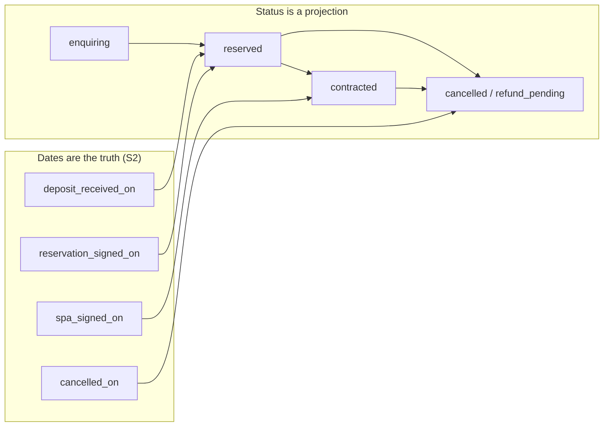
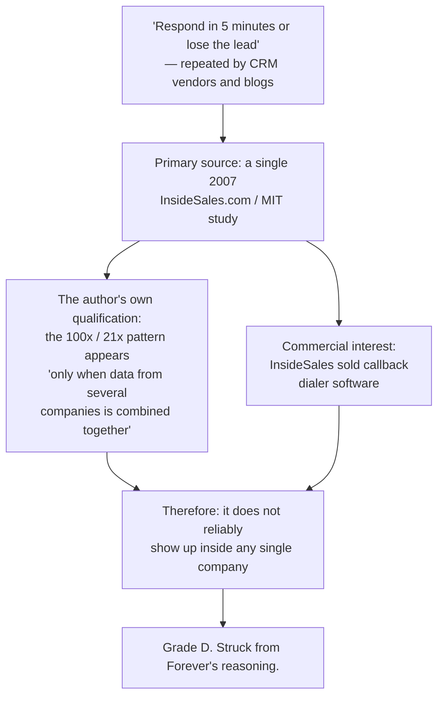

# Forever CRM — 2026 CRM and Real-Estate Market Research

Task ID: FOREVER-CRM-ARCH-001
Status: Proposed architecture — not approved, not scheduled, not authorized for implementation
Repository state of record: main @ 821b3c4e2f6f82e0d4ddce86199a8ff24b44a094
Risk class: R0 (documentation only)

> This document is a design record. It asserts no product truth, changes no active stage, and authorizes no implementation. The active stage remains FOREVER-STUDIO-001 (`docs/CURRENT_STAGE.md`), which lists "large CRM integration" as out of scope. Any implementing task is R2 under the shared-contract rule and requires an Architect-reviewed stage change plus Owner approval.

## What this document decides

1. **Which external patterns Forever copies, adapts, or refuses**, each with a named source URL and a reason stated at Forever's actual scale (~10 seats, off-plan Phuket, RU/EN, Asia/Bangkok).
2. **That the "5-minute rule" is struck from Forever's reasoning.** Its primary source is a vendor study whose own author says the effect appears only across combined companies. The defensible threshold is one hour, and the mechanism worth building for is *not breaking the session*, not shaving minutes off a callback.
3. **That Reapit's own glossary disqualifies the resale canon as Forever's object model.** Applicant / Vendor / Offer / Conveyancing is a resale vocabulary; off-plan appears there only as a value in a property-age attribute.
4. **That the off-plan patterns with no resale counterpart (Spark) enter the target architecture but not Phase 1** — unit inventory as contended shared state, the dates-are-truth reservation spine, the instalment engine, the required-fields gate, reviewed-send by default.
5. **That merge must be reversible**, on the strength of HubSpot's own documentation of the dead end it shipped.
6. **That no percentage with a denominator under 30 is rendered anywhere**, and which metrics are therefore built and which are excluded as actively harmful.
7. **That the "70% of CRM projects fail" statistic is refused**, with the reason, rather than repeated.
8. **That the build/buy answer is: build the core, buy only the messaging gateway, never sync bidirectionally** — and that the gateway purchase is gated on WhatsApp number ownership, not on a date.

---

## 1. Method and honesty statement

### 1.1 What was actually done

Every source cited below was fetched during this task and is reproduced by URL. No URL in this document is reconstructed from memory, and no claim carries a citation that was not opened. Where the ground truth recorded a claim without a retrievable source, the claim is either omitted or marked `[Unverified assumption]`.

Coverage: five general CRMs (Attio, HubSpot, Salesforce, Pipedrive, Zoho), three real-estate CRMs (Reapit, Follow Up Boss, Lofty), one off-plan/new-build CRM (Spark), the Meta WhatsApp Cloud API and pricing documentation, Google Calendar push notifications, Resend, PostgreSQL and Supabase primary documentation, libphonenumber, one 2007 vendor study, one 2011 HBR article, one peer-reviewed clinical-trial recruitment paper, the NIST engineering statistics handbook, the NAR 2025 technology survey, one academic CRM-failure paper, the Twenty CRM licence file, and the EU AI Act Article 50 text.

### 1.2 Evidence grades

| Grade | Meaning | What it may be used for | What it may not be used for |
|---|---|---|---|
| **A** | Independent peer-reviewed research, official statutory text, or a standards body | Deciding a threshold or a constraint | — |
| **B** | Official first-party product or protocol documentation | Proving what a system *does* and what its constraints are | Proving that the design is *good* or that it works commercially |
| **C** | Vendor help-centre or support article, i.e. the vendor describing its own product to customers | Borrowing a *definition* or a *shape* | Proving an outcome, a lift, or a benchmark |
| **D** | Vendor-commissioned study, marketing claim, or an uncited statistic | Nothing. Cited only to be refuted | Any input to a Forever decision |

### 1.3 The honesty statement

**Vendor documentation describes vendor products. It does not prove those products work, and it does not prove the pattern transfers.** Attio's status-attribute page proves Attio ships `target_time_in_status`; it does not prove stage-dwell targets improve outcomes. Follow Up Boss's dashboard page proves how Follow Up Boss defines "unactioned"; it does not prove speed-to-lead pays. Grade-B and Grade-C sources are used in this package for exactly one thing: **borrowing a well-worked definition or data shape, so Forever does not re-derive one badly.** Every outcome claim in this document is Grade A or is refused.

Two further honesty constraints apply throughout:

- **Every vendor with a documented pattern has a commercial interest in that pattern.** InsideSales sold callback dialers. Lofty sells routing. HubSpot sells seats. This is recorded next to each verdict, not in a footnote.
- **Absence of evidence in a vendor's documentation is not evidence of absence in the product.** Where the survey concludes "no CRM in the set models X", that is a statement about published documentation, not about internals.

### 1.4 Scale premise

All verdicts are rendered at Forever's measured and inferred scale, not at a generic one.

| Premise | Grade / label |
|---|---|
| Approximately 10 seats; two roles exist today, `owner` and `trusted_publisher` | [Repository fact] `studio_members.role CHECK (role IN ('owner','trusted_publisher'))` |
| The entire customer-side data model is one table, `public.leads`, 12 columns, with no SELECT policy and no reader in `src/` | [Repository fact] |
| Current lead volume is unknown to the product; it is observable only by opening Supabase as `service_role` | [Repository fact] — this is what Slice 0 exists to answer, see `docs/crm/CRM_IMPLEMENTATION_PLAN.md` |
| Transaction values are high and cycles are long (off-plan, 6–18 months) | [Inference] from `docs/FOREVER_STRATEGIC_NORTH_STAR.md` and the off-plan product surface |
| Buyer population is substantially Russian-speaking and European-resident; Phuket is UTC+7, Moscow UTC+3 | [Inference] |

Two consequences follow immediately and constrain every verdict below. First, **a pattern that costs an advisor time to feed is a pattern that will be abandoned**, and building it rather than buying it does not change that. Second, **at this volume no ratio is interpretable**, so any pattern whose output is a rate is rejected on arithmetic grounds before it is judged on design grounds.

---

## 2. General CRM architecture patterns

### 2.1 ADOPT

| # | Pattern | Vendor | Why it earns its complexity at ~10 seats | Where applied | Source (Grade B unless noted) |
|---|---|---|---|---|---|
| G1 | **Object / list separation** — entity facts on the record, *process* state on the membership row: `list(id, name, target_entity)` + `list_entry(list_id, entity_id, stage_id, owner_id, …)` | Attio | The highest-value structural idea in the survey. One Forever buyer is simultaneously a booth walk-in, a villa prospect and an investor lead. A single `deal.stage` column cannot express that; a membership row can | `docs/crm/CRM_DOMAIN_MODEL.md` (target architecture). **Phase 2** — Phase 1 has no pipeline and no opportunity | https://docs.attio.com/docs/objects-and-lists |
| G2 | **`target_time_in_status` per stage**, plus `is_archived` instead of deleting stages, plus strict writes (error, never auto-create a stage) | Attio | Best ROI-to-complexity ratio in the set. At low volume and very high deal value the stalled enquiry is the most expensive failure mode; stage dwell turns it from human memory into a query | `docs/crm/CRM_JOURNEYS_AND_STATE_MACHINES.md`. **Seeded NULL** for `qualified`, `viewing`, `reserved` until twelve observed transitions exist, and suppressed entirely by a future `next_action_at` | https://docs.attio.com/rest-api/attribute-types/attribute-types-status |
| G3 | **Typed actors on every write** — `workspace-member` / `integration` / `system` | Attio | Trivial now, impossible to retrofit, and essential the moment a cron or a gateway writes. Forever already has one scheduled consumer running as `service_role` with no user token | `crm_activity.actor_kind` in `docs/crm/CRM_DOMAIN_MODEL.md`; Phase 1 | https://docs.attio.com/docs/actors |
| G4 | **`OpportunityContactRole`** → `deal_contact(deal_id, person_id, role, is_primary)` | Salesforce | A Phuket villa purchase routinely involves buyer, spouse, referrer, Thai lawyer, developer representative and translator. A single `deal.contact_id` destroys all of it | `docs/crm/CRM_DOMAIN_MODEL.md` target; **Phase 2/3** | https://developer.salesforce.com/docs/atlas.en-us.object_reference.meta/object_reference/sforce_api_objects_opportunity.htm |
| G5 | **A Lead must be anchored to an existing contact** — HubSpot's own convergence signal | HubSpot | Settles the oldest CRM modelling argument with a vendor's retreat from its own split. One `crm_person` table; "lead" is a state, never a second table | `crm_person` + `crm_enquiry` in `docs/crm/CRM_DOMAIN_MODEL.md`; Phase 1 | https://developers.hubspot.com/docs/guides/api/crm/objects/leads |
| G6 | **Labelled relationship edges with `is_primary`**, from a curated enum, never user-definable | HubSpot | Household and corporate-vehicle purchases are edges, not merges. Curation is what stops the enum becoming a free-text field by 2027 | `docs/crm/CRM_DOMAIN_MODEL.md` target | https://developers.hubspot.com/docs/guides/api/crm/associations/associations-v4 |
| G7 | **The flat deal silhouette** — direct FKs, explicit `pipeline_id` + `stage_id`, three-value status, **per-deal currency**, expected close date, single owner | Pipedrive | Per-deal currency is non-negotiable: THB, RUB, USD and EUR all appear in Forever's world, and the repository already carries a live currency mismatch (`NAV001_BUDGET_CURRENCY = "USD"` against `PROJECT_PRICE_CURRENCY = "THB"`) | `docs/crm/CRM_DOMAIN_MODEL.md`; **Phase 2**. Expected close date is *optional at every transition* — see §2.4 | https://developers.pipedrive.com/docs/api/v1/Deals |

### 2.2 ADAPT

| # | Pattern | Vendor | Adaptation, and why | Where applied | Source |
|---|---|---|---|---|---|
| G8 | **Two workspace roles + coarse object-scoped grants, additive, most-permissive-wins**, with notes/tasks/activities visible to everyone | Attio | The *shape* is adopted; the *mechanism* is not. Forever's authorization is 100 % TypeScript at the app-server boundary running as `service_role` [Repository fact], with zero `auth.uid()` in 24 migrations. The adaptation is a declarative `Record<CrmEndpointName, CrmCapability>` map the middleware reads and a test asserts is total, with **6 capabilities, not 26**. Attio's documented additive trap is heeded directly: set the default at the floor and grant upward, or a policy silently no-ops. Hiding activity in a ten-person office causes more coordination failure than it prevents leakage | `docs/crm/CRM_SECURITY_AND_RBAC.md` | https://attio.com/help/reference/managing-your-data/objects/manage-access-to-objects |

### 2.3 REJECT — enterprise bloat Forever must not copy

| # | Pattern | Vendor | Why it is refused | Source |
|---|---|---|---|---|
| G9 | **Runtime schema / meta-model engines** (custom objects, module APIs) | HubSpot, Zoho | These exist because a vendor cannot ship a migration into a customer tenant. Forever owns its Postgres: a field is one migration line, type-checked end to end. Adopting a meta-model would import the vendor's constraint without the vendor's reason | https://developers.hubspot.com/docs/guides/api/crm/objects/custom-objects and https://www.zoho.com/crm/developer/docs/api/v8/modules-api.html |
| G10 | **The sharing stack** — org-wide defaults → role hierarchy → sharing rules → manual sharing, up to 5,000 roles, asynchronous recalculation | Salesforce | **The tell is that the vendor ships a troubleshooting guide for its own permission system.** A permission model that needs a debugging curriculum is a permission model no ten-person brokerage can reason about, and an unreasonable permission model is one that gets loosened until it grants everything | https://trailhead.salesforce.com/content/learn/modules/data_security/data_security_records |
| G11 | **Visibility groups** — four levels, up to 150 groups | Pipedrive | Actively harmful here: a booth host's walk-in must be instantly visible to the advisor who will work it, and any group model makes that a configuration question asked in front of the buyer | https://support.pipedrive.com/en/article/visibility-groups |
| G12 | **`ForecastCategory` as a second, manually overridable forecast axis**; **`IsPrivate` on deals**; **30–100-stage pipelines** (5–7 is the honest number) | Salesforce | A second overridable forecast axis is a second place for the number to be wrong. Private deals are a coordination failure with a UI. Long pipelines produce stage data nobody maintains | https://developer.salesforce.com/docs/atlas.en-us.object_reference.meta/object_reference/sforce_api_objects_opportunity.htm |
| G13 | **Task state machines beyond a boolean**, sub-tasks, dependencies, recurrence, task queues | Whole set | Even HubSpot keeps task status at COMPLETED / NOT_STARTED. `crm_task` in Phase 1 is a boolean-completion row and nothing more | https://developers.hubspot.com/docs/guides/api/crm/objects/leads |
| G14 | **Internal API versioning** | Whole set | Forever's CRM has exactly one consumer, in the same repository, deployed together | — [Inference] |

### 2.4 What the reconciliation removed from this section's own recommendations

Three patterns that survey well were cut or demoted in `CORRECTIONS.md` and must not be reintroduced from this document:

- **Pipeline, opportunity and decision-profile tables are not Phase 1.** Phase 1 is exactly eleven tables and contains no pipeline, no opportunity and no decision profile.
- **Required forward-transition fields are cut.** Expected value, expected close date and next action are optional at every transition; the unmet predicate is recorded as a coverage item, never as a refusal. Inventing a close date to satisfy a constraint is how stage data becomes fiction.
- **No numeric score, confidence, probability, rank or conversion rate** is persisted or rendered anywhere in this package, at any volume.

---

## 3. Real-estate CRM patterns

### 3.1 The decisive negative finding

**Reapit's own developer glossary is a *resale* vocabulary: Applicant, Vendor, Offer, Conveyancing-with-chains. "New (Off Plan)" appears there merely as a value in a property *age* attribute — off-plan is an adjective, not a pipeline.** [Web research, Grade B] https://foundations-documentation.reapit.cloud/platform-glossary

This is the single most useful finding in the real-estate survey, and it is a negative one. Adopting the resale canon would force Forever to misname every object it owns: there is no vendor (the developer is a supply partner, not a seller instructing an agent), there is no chain, there is no conveyancing in the English sense, and an "applicant" registering requirements against existing stock is not a buyer reserving an unbuilt unit against a construction-linked instalment plan. **Forever is mostly in the off-plan canon (§4), and takes from the resale canon only the front of the funnel.**

### 3.2 ADOPT / ADAPT from resale CRMs — front of funnel only

| # | Pattern | Vendor | Verdict | Reason and adaptation | Where applied | Source (Grade C) |
|---|---|---|---|---|---|---|
| R1 | **The metric *definition* of "unactioned"** — no outbound call, email or text *from the assigned agent*, with automated, marketing and batch sends explicitly excluded | Follow Up Boss | **ADOPT (definition only, never the target)** | This is the borrowed definition the package needed, and it implies three concrete columns: `is_automated` on every communication row, a materialised `first_touch_at`, and first-touch attribution to the owner. Forever adds one rule the vendor does not have: **tapping a `wa.me` link is not a first response.** The tap emits an outbound activity with `metadata->>'link_opened'='true'` and does *not* set `first_response_at`; only a returning human confirmation does | `docs/crm/CRM_ANALYTICS_AND_KPI.md`, `docs/crm/CRM_INTEGRATION_AND_EVENTS.md` | https://help.followupboss.com/hc/en-us/articles/4402128249367-Dashboard |
| R2 | **Ordered, first-match-wins routing rules** with per-rule working hours, per-user vacation, and a **routing log** | Lofty | **ADAPT — and deferred** | The *shape* fits Forever exactly: language (RU/EN) × source × Asia/Bangkok-versus-European hours, and it is far simpler than a workflow engine. But the reconciliation cut all six routing tables. What survives now is the *discipline*: assignment is explicit and single-owner, and when routing is eventually built it must be ordered, first-match, and **logged** — an unlogged routing decision is unarguable when an advisor asks why a lead went elsewhere. Reintroduce at sustained >200 new enquiries/month | Discipline recorded in `docs/crm/CRM_AUTOMATION_CATALOGUE.md`; no tables in Phase 1–3 | https://help.lofty.com/hc/en-us/articles/360055177831-Lead-Routing-How-to-set-up-lead-routing-rules |
| R3 | **Appointment *type* + *outcome* as first-class, reportable fields** | Follow Up Boss | **ADAPT** | Once lockbox and MLS scheduling are stripped out, this *is* the viewing workflow, and Forever's version is richer: site tour, booth meeting, video walkthrough. One correction applies: `inspection_trip` is removed from `appointment_type` because a multi-day buyer visit was never a meeting — it becomes a thin container (§4, `crm_trip`), deferred behind its own trigger | `docs/crm/CRM_JOURNEYS_AND_STATE_MACHINES.md`; **Phase 3** | https://help.followupboss.com/hc/en-us/articles/9228360927383-Appointment-Report |
| R4 | **Sequences that auto-pause on a genuine response**, with a call-duration threshold so voicemails do not count, a daily cap, and an explicit send window | Follow Up Boss | **ADAPT — and deferred** | The auto-pause condition is the only part worth having, and it must be anchored to the **buyer's** timezone, not the agent's. Two Forever corrections: nothing on `main` can send, so no sequence exists to pause; and the call-duration threshold that distinguishes a conversation from a voicemail is an **Owner decision** (proposed 60 s), not an inferable constant | `docs/crm/CRM_AUTOMATION_CATALOGUE.md` as a constant plus a review trigger; no engine | https://help.followupboss.com/hc/en-us/articles/1500008539982-Action-Plans-Overview |

### 3.3 REJECT from resale CRMs

| # | Pattern | Vendor | Why it is refused | Source |
|---|---|---|---|---|
| R5 | **The weighted "hunger" round-robin allocation formula** (new hunger = (hunger − 1) ÷ allocation) | Lofty | Unexplainable to the people it governs, and it solves a fairness problem Forever does not have at ten seats with assignment by language and project. It is also a rank, which this package forbids storing or rendering | https://help.lofty.com/hc/en-us/articles/360047876811-In-Depth-Round-Robin-Next-Up |
| R6 | **The weighted Activity Leaderboard** (appointment 500 / call 10 / text 2 / email 1) | Lofty | Dial-for-dollars culture applied to a 6–18-month, very-high-ticket cycle. It rewards activity theatre, it is a score, and it is precisely the management-reporting surface the NAR abandonment finding is about (§7.4) | https://help.lofty.com/hc/en-us/articles/360047876811-In-Depth-Round-Robin-Next-Up |

**One resale object is worth lifting despite §3.1:** Reapit's *Identity check* as a first-class AML object attached to a contact. It is real, it is recurrent in Thai off-plan practice, and it interacts with retention holds. https://foundations-documentation.reapit.cloud/platform-glossary — recorded in `docs/crm/CRM_PRIVACY_CONSENT_RETENTION.md`; note the PDPA s.41(3) watch item there, since ID or biometric verification becoming a *core* activity fires the sensitive-data trigger with no volume threshold.

---

## 4. Off-plan / new-build patterns (Spark)

These are the parts with **no counterpart in any resale CRM**. They are the reason the resale canon is insufficient rather than merely mis-vocabularised. All are Grade C (vendor help centre) and all enter the *target* architecture only — none is in Phase 1.

| # | Pattern | Verdict | Why it has no resale counterpart | Forever's version | Phase | Source |
|---|---|---|---|---|---|---|
| S1 | **Unit inventory as finite, contended, shared state** whose status is *derived* from deal state rather than hand-set, with real **expiring, attributable hold** states | **ADOPT into target** | In resale nobody owns the listing, so the contention does not exist. Off-plan, two advisors can sell the same unit | One live hold per unit (`… WHERE cancelled_on IS NULL`). **The claim is stated honestly: this delivers intra-Forever hold exclusivity only.** The contention that happens weekly is the *developer* reallocating or repricing, which the CRM cannot see. Holds therefore render with their verification age, carry `developer_confirmed_at` / `last_verified_at`, a one-tap "I verified this with the developer" action, and a `holds_unverified_over_7d` count; the conflict flag points at the **staler** side | 3 | https://knowledge.spark.re/inventory-settings |
| S2 | **A two-object reservation → contract spine where DATES are the source of truth and status is a projection** | **ADOPT into target** | This is exactly the deposit → reservation → SPA shape, and it is the single most transferable idea in the off-plan set | `crm_reservation` in the dates-first idiom, with `CHECK ((cancellation_reason IS NULL) = (cancelled_on IS NULL))` and explicit date orderings. Deposit custody (`deposit_held_by`, `deposit_refunded_on`) ships **with** the table, never before it | 3 | https://knowledge.spark.re/glossary-dates |
| S3 | **An instalment engine** — reusable named templates; per-instalment fixed **or** percentage with a "less initial" semantic; due dates expressed *relative* to an anchor date; per-structure reminder recipients; payment-evidence capture | **ADAPT into target** | Resale has one completion payment. Off-plan has a schedule that is the commercial substance of the deal | Extended past Spark on two axes Forever genuinely needs: **multi-currency with the FX rate captured at payment time**, and **construction-milestone anchoring**, because off-plan schedules slip and a fixed calendar schedule becomes fiction on the first delay | 3 | https://knowledge.spark.re/conveyancing-deposit-structure-settings |
| S4 | **A required-fields gate on the reservation → SPA transition** | **ADOPT into target** | The transition has no resale analogue and it is where deals actually stall | Forever's real failure mode is a missing passport scan or an unanswered source-of-funds question, not a missing colour scheme. This ships as **data quality long before any PDF tooling**. Note the deliberate asymmetry with §2.4: forward *pipeline* transitions never require a field an advisor cannot answer from the conversation; the SPA gate requires documents a counterparty demands anyway | 3 | https://knowledge.spark.re/contract-step-process |
| S5 | **Per-step auto-send-versus-review toggle, with reviewed-send as the DEFAULT**, plus the ordering invariant that a contact must have an owner before automation can send as them | **ADOPT as a rule** | Correct for high-value, two-language, cross-cultural correspondence, where a mistimed or mistranslated automated message is a lost commission rather than an unsubscribe | Adopted as a **rule rather than a table**, since the automation engine is cut. It also carries the AI guardrail in §9: human accept / edit / reject before anything reaches a client | rule now; engine deferred | https://knowledge.spark.re/follow-up-schedules |
| S6 | **Introducers, booth hosts and referrers as flagged CONTACTS** with outbound commission structures, plus **company-level contacts** | **ADOPT into target** | Resale CRMs model the agent, not the introducer. Russian buyers frequently transact via a family group or a corporate vehicle | External introducers are `crm_person` rows, credited through an exclusive arc over `member_user_id` / `party_person_id` — the same idiom the referral model already uses. `crm_commission_claim` is modelled but **not built**; its trigger is the first reservation reaching `spa_signed_on` | 3 / trigger | https://knowledge.spark.re/inventory-settings |
| S7 | **The multi-day buyer visit as a container** (`crm_trip`), with `inspection_trip` retired from `appointment_type` | **ADOPT into target** | An inspection trip is a container of appointments across projects and days, not a peer of "site tour" | Thin: `crm_trip(id, person_id, party_group_id, arrives_on, departs_on, note, created_by)` plus a nullable `crm_appointment.trip_id`. No state machine, no new vocabulary. Trigger: the first buyer visit spanning more than one day | trigger | https://knowledge.spark.re/glossary-dates |

### 4.1 The mandatory caveat on Spark's vocabulary

**Spark's *In Rescission*, *Firm* and *countersigner* vocabulary encodes North American condominium pre-sale statute — a legislated rescission period, a defined firm date, and statutory countersignature. It does not describe Thai practice.** [Web research, Grade C] https://knowledge.spark.re/contract-step-process

The *shape* transfers — dates are truth, status is a projection, a gate sits on the contract step. The *statuses* do not, and importing them would encode another country's consumer-protection statute into Forever's schema as though it were Thai law. Forever's reservation vocabulary must be derived from the actual developer agreements Forever signs, and any statutory characterisation of a Thai reservation, rescission right or deposit forfeiture requires qualified Thai counsel. Nothing in this document is legal advice.

---

## 5. Identity, deduplication and merge engineering

### 5.1 ADOPT

| # | Decision | Reason | Where applied | Source |
|---|---|---|---|---|
| I1 | **`crm_person` (1) → `crm_person_identifier` (N)** keyed on `(kind, canonical_value)` | One buyer arrives as a WhatsApp number, a Telegram handle, a portal email and a booth walk-in. A person table with an `email` column cannot hold that | `docs/crm/CRM_DOMAIN_MODEL.md`; **Phase 1** | https://www.twilio.com/docs/segment/unify/identity-resolution/externalids |
| I2 | **E.164 canonicalisation via libphonenumber in exactly one TypeScript helper**, storing the raw value alongside the canonical one; the default parse region comes from an **explicit country selector**, never a hard-coded default | Deliberately *not* a Postgres generated column: the phone-number metadata is not immutable, so a generated column silently encodes the day it was written. The explicit region selector is also what supplies buyer-timezone derivation (§7.5) — and the repository's current form takes country as free text (`ContactForm.tsx:154`) [Repository fact] | `docs/crm/CRM_DOMAIN_MODEL.md`, `docs/crm/CRM_UX_INFORMATION_ARCHITECTURE.md` | https://github.com/google/libphonenumber |
| I3 | **Idempotent ingestion** via `UNIQUE (source, external_id)` + `INSERT … ON CONFLICT DO NOTHING`, treating **zero rows returned as "already seen"** | Mandatory, not optional: Meta retries webhooks and states in its own documentation that the server must handle deduplication. Two Forever corrections: `CHECK (external_id IS NULL OR channel IS NOT NULL)` so the pair is not NULL-distinct, and **"zero rows is success" becomes control flow** — on conflict, select the existing enquiry, return accepted, and write nothing further | `docs/crm/CRM_INTEGRATION_AND_EVENTS.md` | https://www.postgresql.org/docs/current/sql-insert.html and https://developers.facebook.com/docs/graph-api/webhooks/getting-started |
| I4 | **REVERSIBLE MERGE.** Never DELETE the loser: set `merged_into_person_id` and append one merge row capturing field-level survivorship, so unmerge is a replay | The single highest-value decision in this section. Salesforce's `MasterRecordId` is the idea | `docs/crm/CRM_DOMAIN_MODEL.md`; **Phase 3** (no merge UI in Phase 1) | https://developer.salesforce.com/docs/atlas.en-us.api.meta/api/sforce_api_calls_merge.htm |
| I5 | **Partial unique indexes** (`WHERE deleted_at IS NULL AND merged_into_id IS NULL`) | Without them a soft-deleted identifier permanently blocks re-adding the same buyer — a defect that presents as "the system says this person already exists" and is unfixable from the UI. Forever adds `is_match_key BOOLEAN NOT NULL DEFAULT true` to the index predicate, so a genuinely shared household number stops being a match key without losing reachability | `docs/crm/CRM_DOMAIN_MODEL.md`; **Phase 1** | https://www.postgresql.org/docs/current/indexes-unique.html |
| I6 | **`pg_trgm` for fuzzy candidate *suggestions* only** | Suggestion, never action. A wrong merge means one buyer seeing another's budget | `docs/crm/CRM_DOMAIN_MODEL.md`; Phase 3 | https://www.postgresql.org/docs/current/pgtrgm.html |
| I7 | **Households and joint buyers are a GROUP with roles, never a merge** | Two real people are not one person, and merging them is unrecoverable in every CRM that ships destructive merge | `docs/crm/CRM_DOMAIN_MODEL.md` target | https://developers.hubspot.com/docs/guides/api/crm/associations/associations-v4 |

### 5.2 The HubSpot dead end — the loudest warning in the set

> "It's not possible to unmerge records."

[Web research, Grade B] https://knowledge.hubspot.com/records/merge-records

**Two of the largest CRMs in the world shipped destructive merge and are now stuck with it.** This is the strongest available argument for I4, and it is an argument from a vendor's own documentation of a limitation, which is the most trustworthy kind of vendor evidence there is. Forever has an advantage neither vendor has — it owns its Postgres and has no installed base — and squandering it by shipping a destructive merge to save one table would be the least reversible decision in the whole package.

Three merge defects found in review are corrected here because they are engineering, not survey:

1. **Merge must not collide on child natural keys.** Every person-scoped child table whose natural key contains `person_id` raises `unique_violation` on merge. Per-table survivorship rules are explicit (skip or soft-delete on role and primary-identifier collisions; union with the earliest applied date for suppression; fold to the strongest kind for interest), and the moved-rows record is widened to `{table: {moved: […], skipped: [{id, reason, superseded_by}]}}` so unmerge restores rather than loses.
2. **Unmerge must clear `merged_into_person_id` FIRST, then repoint children, then stamp the unmerge timestamp** — otherwise the merge guard rejects the very writes the replay needs.
3. **The marketing gate must resolve the merge pointer before it decides.** A suppression recorded against a merge loser must still block the winner. This is fail-open on the one duty the package calls absolute, and it is fixed by resolving to the survivor at the top of every caller.

### 5.3 REJECT

| Pattern | Why refused | Source |
|---|---|---|
| **Probabilistic auto-merge** | A wrong merge means one buyer seeing another's budget and a commission dispute. It is also a confidence number, which this package forbids storing or rendering | https://knowledge.hubspot.com/records/merge-records |
| **A configurable survivorship rules engine** | Configuration surface for a decision made a handful of times a year at ten seats | — [Inference] |
| **Table partitioning and BRIN** | Wrong scale, and partitioning would break the global unique idempotency index, since a unique constraint must include the partition key | https://www.postgresql.org/docs/current/indexes-unique.html |
| **Stripe-style parameter-mismatch idempotency replay** | Solves a payments problem Forever does not have; `ON CONFLICT DO NOTHING` plus a content-derived key is the whole requirement | https://www.postgresql.org/docs/current/sql-insert.html |
| **Depending on the `supa_audit` extension** | It was **archived on 2025-02-16**. Its *table shape* (jsonb record / old_record, stable `record_id`) was the survey's recommendation — but the reconciliation went further and cut the separate history table entirely, in favour of the existing `public.audit_log` with `crm_*` action values and populated `old_values` / `new_values`. The second history table was churn, and it was the holder of un-erasable JSONB copies of every buyer's name | https://github.com/supabase/supa_audit |

### 5.4 The polymorphism resolution

GitLab's database guidance ("always use separate tables") and real CRM practice conflict directly, and the conflict is real rather than a misreading. https://docs.gitlab.com/development/database/polymorphic_associations/

**Resolution: one activity table with typed nullable FK columns plus a CHECK enforcing an exclusive arc — never `(entity_type text, entity_id uuid)`.** The untyped pair is what GitLab is warning about; it has no referential integrity, no cascade behaviour and no query plan. Typed nullable columns keep every foreign key real while still giving one timeline.

Phase 1 narrows this further: `crm_activity`'s arc is **`person_id` + `enquiry_id` only**. Every later arm (opportunity, reservation, task) is added with the table it points at, which is also what keeps the three Phase-1 migrations FK-ordered.

---

## 6. Messaging

### 6.1 WhatsApp — the constraints that shape the design

| Finding | Consequence for Forever | Grade | Source |
|---|---|---|---|
| **The 24-hour customer service window is the hardest platform constraint.** Outside it, only pre-approved templates may be sent, and template review takes up to 24 hours | **Nothing can be authored mid-conversation.** Every out-of-window message must already exist as an approved template, which means the template set is a designed artifact reviewed like schema, not something an advisor writes on a Tuesday | B | https://developers.facebook.com/docs/whatsapp/cloud-api/guides/send-messages |
| **Cost is not the barrier.** Since **2025-07-01** pricing is per-message; all non-template messages inside an open window are free. Service conversations have been free since **2024-11-01** | A brokerage that mostly *replies* pays Meta approximately nothing. Cost must therefore be struck from the build-versus-buy reasoning for WhatsApp — the decision is about history ownership and the write path, not price | B | https://developers.facebook.com/docs/whatsapp/pricing |
| **THE decisive operational finding: onboarding an existing WhatsApp Business App number directly to Cloud API requires deleting the account. The messaging history is lost and the app can no longer use that number. Only a partner supporting business-app onboarding preserves it** | This gates the gateway purchase **absolutely**, and it is irreversible. It is Owner decision #1: do buyer conversations live on a company-owned Business App number, or on individual advisors' personal accounts? If personal, Forever has no ownership claim, no copy of the history and no reassignment path when an advisor leaves — the largest commercial exposure in this area, and no schema decision touches it | B | https://developers.facebook.com/documentation/business-messaging/whatsapp/solution-providers/migrate-existing-whatsapp-number-to-a-business-account/ |
| **Meta pushes the consent determination onto the business**: "You are solely responsible for determining the method of opt-in" | The platform provides no compliance cover. Consent evidence is Forever's own append-only record, versioned against notice wording — see `docs/crm/CRM_PRIVACY_CONSENT_RETENTION.md`. Descriptive only; qualified Thai counsel must confirm what discharges PDPA s.19 | B | https://whatsappbusiness.com/policy/ |
| **Message delivery order is not guaranteed** | Order timelines by **provider timestamp**, never by insertion order. This is a schema consequence, not a UI one | B | https://developers.facebook.com/docs/whatsapp/cloud-api/guides/send-messages |

**Repository reality check** [Repository fact]: nothing on `main` sends anything. `"whatsapp"` appears only as a string literal in an unused TypeScript union, Workers has no SMTP, and `docs/CURRENT_STAGE.md` commits this stage to alert *design*, not delivery. No outbound messaging and no purchased gateway is on the Do-Not-Build-Yet list.

### 6.2 Email — and why inbound capture probably beats outbound automation

Resend's free tier is 3,000 messages/month and 100/day, with **inbound available on every tier**, which comfortably covers Forever's volume. [Web research, Grade B] https://resend.com/pricing

The non-obvious conclusion: **MX'd inbound capture of portal and partner leads is probably higher ROI than WhatsApp automation.** Portal and partner enquiries arrive as email today and are re-keyed or lost. Inbound capture converts an existing manual step into structured rows with no consent question, no template pre-approval, no 24-hour window, and no platform relationship — and it feeds the `UNIQUE (source, external_id)` idempotency path in §5 directly. It is also the one messaging capability that does not require anything to be *sent*, which is the constraint the runtime actually imposes. Applied in `docs/crm/CRM_INTEGRATION_AND_EVENTS.md`; still gated behind the same webhook prohibition — when it comes, per-provider route files, no wildcard, and a startup assertion on secrets.

### 6.3 Calendar — Google two-way sync fails the complexity test

| Documented property | Why it disqualifies two-way sync | Source |
|---|---|---|
| Push notifications carry **no body**, forcing a `syncToken` list call on every event | The "push" is only a hint; the actual work is polling with extra failure modes | https://developers.google.com/workspace/calendar/api/guides/push |
| Notification **channels have no auto-renewal** | A silent expiry produces a sync that appears to work and is simply stale — the worst failure mode for an appointment | https://developers.google.com/workspace/calendar/api/guides/push |
| Google states plainly: **"Notifications are not 100% reliable."** | A vendor telling you its delivery guarantee is partial is the end of the argument for a system where a missed viewing costs a commission | https://developers.google.com/workspace/calendar/api/guides/push |

**Verdict: REJECT two-way sync. Use `.ics` files and invite links.** A one-way artifact the advisor's own calendar accepts has no channel to expire, no token to reconcile, and no stale state to render confidently.

---

## 7. The speed-to-lead correction

This is the most important section in this document, because the Owner requirement most likely to be stated as a number is the one with the weakest evidence.

### 7.1 Tracing the 5-minute rule to its actual source

[Web research, Grade D] https://www.onecavo.com/wp-content/uploads/2015/11/MIT-InsideSales.com_Lead-Response-Management.pdf

**The 5-minute rule is vendor folklore with a citation attached.** The chain of custody ends at one 2007 study, sold by a company that sold the remedy, whose own author states that the headline multiples appear only across combined company data. A pattern that exists only in the pooled cross-company aggregate is a statement about the *variance between companies*, not a causal instruction to any one of them. Forever is one company. The finding does not apply to it, and repeating it would make the CRM's headline SLA the least evidenced number in the product.

### 7.2 The defensible threshold: HBR 2011

| Property | Actual content | Why it matters |
|---|---|---|
| **Threshold** | **One hour** — not five minutes | This is the number Forever may defensibly use |
| **Outcome variable** | **"A meaningful conversation with a key decision maker"** — *not* revenue, not closed deals | Everything downstream of the conversation is unmeasured. Any claim that faster response raises revenue is not supported by this source |
| **The genuinely useful finding** | **Of 2,241 audited companies, 23 % never responded at all.** Average response time: 42 hours | **The bar is on the floor.** The competitive gain is in responding *at all*, reliably, not in racing a stopwatch |

[Web research, Grade B — an audited study reported in a practitioner journal] https://thedenmangroupselling.wordpress.com/wp-content/uploads/2011/03/the-short-life-of-online-sales-leads-harvard-business-review.pdf

The "never responded at all" figure is the one Forever should design against, because it is the one Forever can actually verify about itself — and today it cannot. `public.leads` has no SELECT policy and no reader in `src/` [Repository fact], so the count of enquiries that received no response has never been observable. Making that number visible is Slice 1's stated business outcome.

### 7.3 The independent evidence, and what it actually shows

The strongest **independent, peer-reviewed** evidence in this area is not from sales at all: a comparison of **warm transfer versus callback in clinical-trial recruitment — 25 % versus 12.9 %, n = 2,341.** The study is retrospective, not randomised, which is stated here because it bounds the claim. [Web research, Grade A] https://pmc.ncbi.nlm.nih.gov/articles/PMC10395154/

**Draw the real conclusion.** The contrast is not "fast callback versus slow callback". It is **"never leaving the session" versus "leaving and coming back"**. The entire measured advantage sits in the handover that does not break contact. A callback at four minutes and a callback at forty minutes are the same category of event on this evidence; a warm transfer is a different category.

For Forever this reverses the design instruction:

- **Do not build**: a wall-clock human-contact countdown, an escalating alarm, or a "responded in under N minutes" scoreboard.
- **Do build**: whatever keeps the buyer inside the session they are already in — an immediate automated acknowledgement that names the project and unit the buyer was looking at, a live WhatsApp handover from the page they enquired from, and a booth flow where the advisor is already in the room.

A **2-minute automated acknowledgement is defensible engineering.** A **5-minute human-contact SLA is not defensible on any source in this set**, and publishing one guarantees a metric that is recorded as failed nightly, which is how a compliance and coverage surface trains its users to ignore it.

### 7.4 The adoption counterweight

NAR's 2025 technology survey (n > 1,200) records that CRM is only the **#2 lead source at 23 %**, behind social media at 39 %, and **does not appear in the most-used-technology list at all**. [Web research, Grade A — a large-sample industry survey] https://www.nar.realtor/research-and-statistics/research-reports/realtor-technology-survey

The inference the package draws from it: **agents abandon CRMs that cost them time and return it to management, and building rather than buying does not fix that.** This is the evidence behind the hardest kill trigger in `docs/crm/CRM_IMPLEMENTATION_PLAN.md` — if the Owner does not open the console in any 14-day window, the programme stops and is re-evaluated against buying. It is also the reason a "no next action" tile was rejected from the daily action screen: a coverage report belongs on a screen the advisor opens voluntarily, not on the screen that tells them what is due today.

### 7.5 Forever's timezone problem, stated explicitly

**Phuket is UTC+7. Moscow is UTC+3. Peak Russian evening browsing lands at 23:00–03:00 Phuket time.** [Inference from the buyer-population premise in §1.4]

A single global wall-clock human-contact SLA is therefore not merely poorly evidenced, it is **arithmetically unachievable**, and it would be recorded as breached every night by construction. Three consequences:

1. **The SLA denominator is Forever's actual operating hours and days in Asia/Bangkok, which nobody has stated.** This is an Owner decision; no SLA count may be published against an assumed window.
2. **Send windows anchor to the buyer's timezone, never the agent's** — derived from the ISO-3166 region selector that E.164 parsing already requires (§5, I2).
3. **Quiet hours change the action, they do not remove it.** Asynchronous channels are never downgraded: a WhatsApp message at 23:00 Phuket is 19:00 in Moscow and is the correct action.

Every date derived from an instant in this package is timezone-pinned — `(now() AT TIME ZONE 'Asia/Bangkok')::date`, never bare `CURRENT_DATE`, with a contract test forbidding the bare form in any `crm_*` body. A UTC-defaulted date boundary would silently misclassify every evening interaction, which is most of them.

---

## 8. Analytics at low volume

### 8.1 The arithmetic

Using the NIST-recommended Wilson score interval: **3 conversions out of 20 leads is nominally 15 %, with a 95 % confidence interval of 5.2 % – 36.1 %.** [Web research, Grade A] https://www.itl.nist.gov/div898/handbook/prc/section2/prc241.htm

That worked example is reproduced here precisely because it is the derivation of the rule that forbids reproducing it in the product. Three consequences follow directly:

| Consequence | Statement |
|---|---|
| **Indistinguishability** | 2/20 and 3/20 are not distinguishable. Any dashboard rendering them as "10 %" and "15 %" is rendering noise as a fact |
| **The zero case** | Zero closes in 20 is consistent with a true rate of up to roughly 15 %. "Our conversion is 0 %" is not a finding |
| **Detection cost** | Detecting a genuine 10 % → 15 % improvement requires on the order of **1,400 leads**. At any plausible Forever volume that is years, and by then the mix has changed |

**The rule: never render a percentage whose denominator is under 30.** It is enforced as a negative test with fixtures at n = 0, 1, 9, 10, 29, 30, and by the stronger structural control that **no SQL in this package returns a percentage at all** — the strongest single control in `docs/crm/CRM_ANALYTICS_AND_KPI.md`.

### 8.2 Build / exclude

| Build (interpretable at n < 30) | Exclude as actively harmful |
|---|---|
| Counts by stage | Stage-to-stage conversion percentage |
| Days-in-stage ageing | Per-agent conversion comparison, at any volume |
| Coverage checks — zero contact, no next action, silent 14+ days | Stage-probability-weighted forecasts |
| SLA breaches as **raw counts** | ML lead scoring, and any persisted or rendered score, confidence, probability or rank |
| Pipeline value in **absolute currency** | Any rate whose denominator is under 30 |
| Later, once volume allows: cycle-time distributions and cohort tables | — |

Two corrections from the reconciliation apply and are recorded here so this section does not contradict its siblings:

- **`wins_by_credited_member` is permitted as a COUNT** — won opportunities per credited member and role, with the same "counts, not performance" caption used elsewhere and an explicit statement that a denominator is deliberately absent. The statistical ban had been over-applied by one category: a count is always shown. **The conversion ban is untouched.**
- **Order statistics get a floor**, and the per-agent *ratio* ban lifts only at ≥ 30 matured opportunities per agent **and** an assignment mechanism that makes lead mix comparable — both, never either.

### 8.3 Why this is not a limitation to be engineered around

The counts, the ageing and the coverage checks are not a degraded substitute for a funnel dashboard. At Forever's volume they are **strictly more informative**, because each one is a statement about a specific record an advisor can act on today, and none of them can be read as performance evidence about a person. A coverage list of eleven silent buyers is actionable; a 15 % conversion rate with a 5–36 % interval is not, and the second will be quoted in a meeting while the first will not.

---

## 9. Automation and AI

### 9.1 The ceiling — and the fact that Forever is nowhere near it

**Pipedrive's workflow surface area is the ceiling, and the instruction is to build exactly it and stop:** entity-event triggers + date triggers + conditions + wait + if/else + webhook, with every step idempotent and per-step outcome recorded. Pipedrive documents its own automations failing mid-flow, which is why the per-step outcome record is part of the pattern rather than an addition to it. [Web research, Grade C] https://support.pipedrive.com/en/article/workflow-automation

**That ceiling is a limit, not a plan.** The reconciliation cut all fifteen automation, policy, routing and AI tables. What ships instead:

| Instead of | Ships as |
|---|---|
| Eight automation tables + fifteen invariants + three guard triggers + an eleven-value outcome vocabulary | **Five named SQL functions** behind the existing server-function boundary, rendered on one page |
| Six routing tables | **Nothing.** Assignment is explicit and single-owner |
| A four-level kill switch and eleven tunable policy rows | **Eleven TypeScript constants** in one file, each with a review trigger in a comment, plus a manual toggle |
| An outbound execution engine | **Nothing.** Reintroduce a single `crm_job` table only when a messaging gateway is actually bought; reintroduce an engine at sustained **>200 new enquiries/month**, the threshold the automation section set for itself |

Deferred sends carry a `valid_until`; the 21-day advisor claim lapse is **flag-only**; the per-person contact cap counts reservations rather than completions.

### 9.2 The AI rule worth stealing verbatim

> "The action will fail and any outputs used will populate with an empty value."

[Web research, Grade B] https://knowledge.hubspot.com/workflows/use-breeze-to-research-and-summarize-data-in-workflows

This is HubSpot documenting what happens when AI credits run out, and it is the most useful sentence about AI in the entire survey. It is not an edge case: it is the *normal* failure mode of a metered AI step, and it fails **silently into an empty value** rather than loudly into an error.

**The rule: AI is a decorated side-channel, never load-bearing. No deterministic path may read an LLM-written field.** Not routing, not SLA timers, not stage transitions, not commission. An empty value in any of those is indistinguishable from a legitimately empty field, and the failure surfaces weeks later as a deal that was never followed up.

### 9.3 The guardrails that are cheap enough to adopt

| Guardrail | Content |
|---|---|
| **Grounding with provenance** | Every generated statement carries clickable record-ID provenance to the row it came from |
| **One audit row per generation** | Against `public.audit_log` with a `crm_*` action value — not a new table |
| **Human accept / edit / reject before anything reaches a client** | This is the same rule as Spark's reviewed-send default (§4, S5), arrived at independently |
| **Indirect prompt-injection defence** | **All lead-authored WhatsApp and email text is untrusted DATA, never instructions.** A buyer can write anything into a message body, and that body is the exact input any summarisation step would read. Nothing derived from buyer-authored text may cause an action |
| **Call recording and transcription: DEFERRED entirely** | No table, no column, no action kind. Highest legal risk and lowest certainty in the set. The trigger is an explicit counsel opinion, nothing less |

### 9.4 EU AI Act Article 50 — and the exemption that resolves it

**Article 50 transparency obligations apply from 2026-08-02** — six days after this document's repository state of record. [Web research, Grade A — statutory text] https://artificialintelligenceact.eu/article/50/

Usefully, **the "human review or editorial control" exemption means the human-accept-before-send rule in §9.3 also largely resolves the compliance question.** A guardrail adopted for quality reasons turns out to carry the transparency answer with it. Two caveats, both stated rather than assumed: the Article applies only where Forever falls in scope at all, which turns on the EU-targeting question that is Owner decision #2 (per EDPB Guidelines 3/2018 the trigger is targeting, not buyer nationality — https://www.edpb.europa.eu/our-work-tools/our-documents/guidelines/guidelines-32018-territorial-scope-gdpr-article-3-version_en); and this is a descriptive reading of a published text, not legal advice.

---

## 10. Build-versus-buy market evidence

### 10.1 The statistic this package refuses to use

**"70 % of CRM projects fail" is struck from the reasoning.** The best academic anchor asserts it in an abstract **with no denominator and no definition of failure**, and adjacent sources scatter the same claim across **31 % – 80 % over 1998–2005**. Critically, it says nothing whatsoever about whether *building* fares better than *buying*, which is the only question being asked. [Web research, Grade D] https://www.sciencedirect.com/science/article/pii/S2314728817300168

A statistic with a range spanning fifty percentage points, no definition of the outcome, and no bearing on the decision it is quoted in support of is rhetoric. It is recorded here so that nobody re-imports it in a later revision believing it was overlooked.

### 10.2 Dated pricing — and why cost is not the deciding variable

All figures as published on the vendor pages fetched 2026-07-28, at ten seats.

| Vendor | Price | Verdict | Reason | Source |
|---|---|---|---|---|
| **Supabase** (build the core) | Marginal infra **~$0–50/mo**, since the project already exists | **BUILD** | The write path is already Forever's. The core is a schema and server functions in a repository that already has both | https://supabase.com/pricing |
| **Kommo** (buy the gateway) | **~$43/user/mo Advanced**; **no monthly billing, six-month minimum** | **BUY — gated** | Best fit: Russian-market heritage, messenger-first, official WhatsApp on every tier. The six-month minimum makes a premature purchase **irreversible within a quarter**, so the purchase is gated on the WhatsApp number-ownership answer (§6.1), not on a date | https://www.kommo.com/buy/tariff/ |
| **Follow Up Boss** | Flat **$499/mo including 10 users**; automation and API un-gated on all plans; explicit no-lock-in stance | **FALLBACK BENCHMARK ONLY** | Genuinely good commercial terms and the cleanest pricing page in the set — but US/MLS-centric, **no WhatsApp**, and no unit model. It benchmarks what Forever must beat, it does not solve Forever's problem | https://www.followupboss.com/pricing |
| **Salesforce** | **~$21k/yr** at this scale | **REJECT** | Needs an administrator function Forever does not have, and ships the sharing stack refused in §2.3 | https://developer.salesforce.com/docs/atlas.en-us.object_reference.meta/object_reference/sforce_api_objects_opportunity.htm |
| **HubSpot** | Automation at **$90–100/seat**, **plus a mandatory $1,500 one-time onboarding fee** | **REJECT** | Pays a five-figure first year and still has no WhatsApp | https://developers.hubspot.com/docs/guides/api/crm/objects/leads |
| **Lofty** | **Every price cell reads "Request Pricing"**, plus 15–20 % ad-management fees | **REJECT** | An unpublished price at ten seats is a negotiation Forever will lose, and the ad-management percentage is a different business relationship entirely | https://help.lofty.com/hc/en-us/articles/360055177831-Lead-Routing-How-to-set-up-lead-routing-rules |

**The whole market spans roughly $2.8k – $21k/yr at ten seats, which is immaterial against a single Phuket commission.** Cost is therefore not the deciding variable. **The deciding variable is the WRITE PATH** — who owns the row when the buyer's phone number changes, and who can still read the conversation history after the relationship ends.

### 10.3 The AGPL blocker on the "headless open-source CRM" middle path

The attractive middle path — embed a mature open-source CRM core and put Forever's UI on top — **is blocked.**

**Twenty CRM is AGPLv3, and additionally carries `/* @license Enterprise */` commercially-licensed files. An automated read reporting "MIT" is wrong.** AGPL §13's network-copyleft provision targets precisely the embed-in-a-network-served-proprietary-product case, which is exactly what Forever would be doing. [Web research, Grade B — the licence file itself] https://raw.githubusercontent.com/twentyhq/twenty/main/LICENSE

**NOT LEGAL ADVICE. A counsel opinion is required before importing any AGPL code**, and the mixed-licence file headers mean a licence scanner's summary is not a sufficient check.

Attio's App SDK is a separate dead end for a different reason: **it runs the wrong direction.** Your React application embeds *inside* Attio, which inverts the ownership Forever is trying to establish. https://docs.attio.com/docs/objects-and-lists

### 10.4 The recommendation, and its flip trigger

**BUILD the core in Supabase. BUY only the messaging gateway. Do NOT build bidirectional sync — ever.** If a gateway is bought it writes one-way into Supabase, which remains the sole system of record. Bidirectional sync with any external CRM is on the permanent Do-Not-Build list, because two systems that both write are two systems that both claim to be right.

**The flip trigger is VOLUME and domain ownership, not headcount.** Below roughly 100–200 new leads/month, no automation engine earns its licence. Sustained above roughly 500/month for three consecutive months, revisit. Forever does not currently know which side of that line it is on, which is why the first deliverable in `docs/crm/CRM_IMPLEMENTATION_PLAN.md` is a read-only SQL script that counts leads and adds zero tables.

---

## 11. Summary table

Phase column: **1** = the eleven Phase-1 tables; **2** / **3** = later phases; **T** = target architecture behind a named trigger; **R** = a rule or constant, no table; **X** = rejected or refused; **—** = evidence used to *stop* a decision.

| # | Pattern | Source URL | Verdict for Forever | Phase | Applied in |
|---|---|---|---|---|---|
| G1 | Object / list separation | https://docs.attio.com/docs/objects-and-lists | ADOPT | 2 | `docs/crm/CRM_DOMAIN_MODEL.md` |
| G2 | `target_time_in_status`, `is_archived`, strict stage writes | https://docs.attio.com/rest-api/attribute-types/attribute-types-status | ADAPT (seeded NULL; suppressed by `next_action_at`) | 2 | `docs/crm/CRM_JOURNEYS_AND_STATE_MACHINES.md` |
| G3 | Typed actors on every write | https://docs.attio.com/docs/actors | ADOPT | 1 | `docs/crm/CRM_DOMAIN_MODEL.md` |
| G4 | OpportunityContactRole → `deal_contact` | https://developer.salesforce.com/docs/atlas.en-us.object_reference.meta/object_reference/sforce_api_objects_opportunity.htm | ADOPT | 2 | `docs/crm/CRM_DOMAIN_MODEL.md` |
| G5 | Lead anchored to contact; one person table | https://developers.hubspot.com/docs/guides/api/crm/objects/leads | ADOPT | 1 | `docs/crm/CRM_DOMAIN_MODEL.md` |
| G6 | Labelled relationship edges, curated enum | https://developers.hubspot.com/docs/guides/api/crm/associations/associations-v4 | ADOPT | T | `docs/crm/CRM_DOMAIN_MODEL.md` |
| G7 | Flat deal silhouette; per-deal currency | https://developers.pipedrive.com/docs/api/v1/Deals | ADOPT (close date optional) | 2 | `docs/crm/CRM_DOMAIN_MODEL.md` |
| G8 | Two roles + coarse grants, additive, floor-then-grant | https://attio.com/help/reference/managing-your-data/objects/manage-access-to-objects | ADAPT (TypeScript boundary, 6 capabilities) | 1 | `docs/crm/CRM_SECURITY_AND_RBAC.md` |
| G9 | Runtime schema / meta-model engines | https://developers.hubspot.com/docs/guides/api/crm/objects/custom-objects | REJECT | X | `docs/crm/CRM_DECISION_RECORDS.md` |
| G9b | Module API meta-model | https://www.zoho.com/crm/developer/docs/api/v8/modules-api.html | REJECT | X | `docs/crm/CRM_DECISION_RECORDS.md` |
| G10 | Sharing stack (the troubleshooting-guide tell) | https://trailhead.salesforce.com/content/learn/modules/data_security/data_security_records | REJECT | X | `docs/crm/CRM_SECURITY_AND_RBAC.md` |
| G11 | Visibility groups | https://support.pipedrive.com/en/article/visibility-groups | REJECT | X | `docs/crm/CRM_SECURITY_AND_RBAC.md` |
| R0 | Reapit glossary: Applicant/Vendor/Offer/Conveyancing; off-plan is an adjective | https://foundations-documentation.reapit.cloud/platform-glossary | REJECT the resale object model; ADOPT Identity check as an AML object | — / T | `docs/crm/CRM_PRODUCT_BOUNDARY.md`, `docs/crm/CRM_PRIVACY_CONSENT_RETENTION.md` |
| R1 | "Unactioned" definition; `is_automated`; `first_touch_at` | https://help.followupboss.com/hc/en-us/articles/4402128249367-Dashboard | ADOPT the definition, never the target | 1 | `docs/crm/CRM_ANALYTICS_AND_KPI.md` |
| R2 | Ordered first-match routing with a routing log | https://help.lofty.com/hc/en-us/articles/360055177831-Lead-Routing-How-to-set-up-lead-routing-rules | ADAPT as discipline; all six routing tables cut | R | `docs/crm/CRM_AUTOMATION_CATALOGUE.md` |
| R3 | Appointment type + outcome | https://help.followupboss.com/hc/en-us/articles/9228360927383-Appointment-Report | ADAPT (`inspection_trip` retired) | 3 | `docs/crm/CRM_JOURNEYS_AND_STATE_MACHINES.md` |
| R4 | Sequences auto-pausing on genuine response | https://help.followupboss.com/hc/en-us/articles/1500008539982-Action-Plans-Overview | ADAPT, buyer-timezone anchored; deferred | R | `docs/crm/CRM_AUTOMATION_CATALOGUE.md` |
| R5 | Weighted "hunger" allocation formula | https://help.lofty.com/hc/en-us/articles/360047876811-In-Depth-Round-Robin-Next-Up | REJECT | X | `docs/crm/CRM_DECISION_RECORDS.md` |
| R6 | Weighted activity leaderboard | https://help.lofty.com/hc/en-us/articles/360047876811-In-Depth-Round-Robin-Next-Up | REJECT | X | `docs/crm/CRM_ANALYTICS_AND_KPI.md` |
| S1 | Unit inventory as contended shared state; expiring attributable holds | https://knowledge.spark.re/inventory-settings | ADOPT into target; claim narrowed to intra-Forever exclusivity | 3 | `docs/crm/CRM_DOMAIN_MODEL.md` |
| S2 | Reservation→contract spine; dates are truth, status is a projection | https://knowledge.spark.re/glossary-dates | ADOPT into target | 3 | `docs/crm/CRM_DOMAIN_MODEL.md` |
| S3 | Instalment engine (+ FX at payment time, milestone anchoring) | https://knowledge.spark.re/conveyancing-deposit-structure-settings | ADAPT into target | 3 | `docs/crm/CRM_DOMAIN_MODEL.md` |
| S4 | Required-fields gate on reservation→SPA | https://knowledge.spark.re/contract-step-process | ADOPT into target (documents, not preferences) | 3 | `docs/crm/CRM_JOURNEYS_AND_STATE_MACHINES.md` |
| S5 | Reviewed-send as default; owner-before-send ordering | https://knowledge.spark.re/follow-up-schedules | ADOPT as a rule | R | `docs/crm/CRM_AUTOMATION_CATALOGUE.md` |
| S8 | In Rescission / Firm / countersigner vocabulary | https://knowledge.spark.re/contract-step-process | REJECT (encodes North American condo pre-sale statute) | X | `docs/crm/CRM_PRODUCT_BOUNDARY.md` |
| I1 | person → identifier (kind, canonical_value) | https://www.twilio.com/docs/segment/unify/identity-resolution/externalids | ADOPT | 1 | `docs/crm/CRM_DOMAIN_MODEL.md` |
| I2 | E.164 via libphonenumber, one helper, explicit region | https://github.com/google/libphonenumber | ADOPT | 1 | `docs/crm/CRM_DOMAIN_MODEL.md` |
| I3 | `ON CONFLICT DO NOTHING`; zero rows = already seen | https://www.postgresql.org/docs/current/sql-insert.html | ADOPT as control flow | 1 | `docs/crm/CRM_INTEGRATION_AND_EVENTS.md` |
| I3b | Webhook retries; "handle deduplication" | https://developers.facebook.com/docs/graph-api/webhooks/getting-started | ADOPT | T | `docs/crm/CRM_INTEGRATION_AND_EVENTS.md` |
| I4 | Reversible merge via `merged_into_person_id` | https://developer.salesforce.com/docs/atlas.en-us.api.meta/api/sforce_api_calls_merge.htm | ADOPT | 3 | `docs/crm/CRM_DOMAIN_MODEL.md` |
| I4b | "It's not possible to unmerge records" | https://knowledge.hubspot.com/records/merge-records | REJECT destructive merge — the decisive warning | — | `docs/crm/CRM_DECISION_RECORDS.md` |
| I5 | Partial unique indexes (+ `is_match_key`) | https://www.postgresql.org/docs/current/indexes-unique.html | ADOPT | 1 | `docs/crm/CRM_DOMAIN_MODEL.md` |
| I6 | pg_trgm for suggestions only | https://www.postgresql.org/docs/current/pgtrgm.html | ADOPT, suggestion-only | 3 | `docs/crm/CRM_DOMAIN_MODEL.md` |
| I7 | supa_audit table shape; extension archived 2025-02-16 | https://github.com/supabase/supa_audit | REJECT — superseded by `public.audit_log` reuse | X | `docs/crm/CRM_DECISION_RECORDS.md` |
| I8 | Polymorphism: typed nullable FKs + CHECK, never (type, id) | https://docs.gitlab.com/development/database/polymorphic_associations/ | ADAPT (Phase 1 arc = person + enquiry) | 1 | `docs/crm/CRM_DOMAIN_MODEL.md` |
| M1 | 24-hour window; templates pre-approved, review up to 24 h | https://developers.facebook.com/docs/whatsapp/cloud-api/guides/send-messages | ADOPT as a hard constraint | T | `docs/crm/CRM_INTEGRATION_AND_EVENTS.md` |
| M2 | Per-message pricing 2025-07-01; free service conversations 2024-11-01 | https://developers.facebook.com/docs/whatsapp/pricing | Cost struck from the build/buy reasoning | — | `docs/crm/CRM_BUILD_VS_INTEGRATE.md` |
| M3 | Cloud API onboarding deletes an existing Business App number's history | https://developers.facebook.com/documentation/business-messaging/whatsapp/solution-providers/migrate-existing-whatsapp-number-to-a-business-account/ | BLOCKS the gateway purchase until number ownership is answered | — | `docs/crm/CRM_BUILD_VS_INTEGRATE.md` |
| M4 | "You are solely responsible for determining the method of opt-in" | https://whatsappbusiness.com/policy/ | ADOPT: consent evidence is Forever's own record | 1 | `docs/crm/CRM_PRIVACY_CONSENT_RETENTION.md` |
| M5 | Resend free tier; inbound on every tier | https://resend.com/pricing | ADOPT; inbound capture over outbound automation | T | `docs/crm/CRM_INTEGRATION_AND_EVENTS.md` |
| M6 | Calendar push: no body, no auto-renewal, "not 100% reliable" | https://developers.google.com/workspace/calendar/api/guides/push | REJECT two-way sync; use .ics / invite links | X | `docs/crm/CRM_INTEGRATION_AND_EVENTS.md` |
| P1 | The 5-minute rule's primary source, and its author's own caveat | https://www.onecavo.com/wp-content/uploads/2015/11/MIT-InsideSales.com_Lead-Response-Management.pdf | REFUSED — Grade D, vendor folklore | — | `docs/crm/CRM_ANALYTICS_AND_KPI.md` |
| P2 | HBR 2011: one hour; "meaningful conversation"; 23 % of 2,241 never responded | https://thedenmangroupselling.wordpress.com/wp-content/uploads/2011/03/the-short-life-of-online-sales-leads-harvard-business-review.pdf | ADOPT the one-hour threshold and the never-responded count | 1 | `docs/crm/CRM_ANALYTICS_AND_KPI.md` |
| P3 | Warm transfer vs callback, 25 % vs 12.9 %, n = 2,341 (retrospective) | https://pmc.ncbi.nlm.nih.gov/articles/PMC10395154/ | ADOPT the mechanism: do not break the session | 1 | `docs/crm/CRM_UX_INFORMATION_ARCHITECTURE.md` |
| P4 | NAR 2025 (n > 1,200): CRM #2 lead source at 23 %, absent from most-used tech | https://www.nar.realtor/research-and-statistics/research-reports/realtor-technology-survey | ADOPT as the adoption kill trigger | 1 | `docs/crm/CRM_IMPLEMENTATION_PLAN.md` |
| A1 | Wilson interval; ~1,400 leads to detect 10 %→15 % | https://www.itl.nist.gov/div898/handbook/prc/section2/prc241.htm | ADOPT: no percentage under n = 30; no SQL returns a percentage | 1 | `docs/crm/CRM_ANALYTICS_AND_KPI.md` |
| N1 | Pipedrive workflow surface area; automations fail mid-flow | https://support.pipedrive.com/en/article/workflow-automation | ADOPT as a ceiling; all 15 engine tables cut | R | `docs/crm/CRM_AUTOMATION_CATALOGUE.md` |
| N2 | "Outputs used will populate with an empty value" | https://knowledge.hubspot.com/workflows/use-breeze-to-research-and-summarize-data-in-workflows | ADOPT verbatim: no deterministic path reads an AI field | R | `docs/crm/CRM_AUTOMATION_CATALOGUE.md` |
| N3 | EU AI Act Art 50 from 2026-08-02; human-review exemption | https://artificialintelligenceact.eu/article/50/ | ADOPT: human accept before send also answers transparency | R | `docs/crm/CRM_PRIVACY_CONSENT_RETENTION.md` |
| N4 | EDPB Guidelines 3/2018: targeting, not nationality | https://www.edpb.europa.eu/our-work-tools/our-documents/guidelines/guidelines-32018-territorial-scope-gdpr-article-3-version_en | Owner decision #2 gates dual-regime machinery | — | `docs/crm/CRM_PRIVACY_CONSENT_RETENTION.md` |
| B1 | "70 % of CRM projects fail" | https://www.sciencedirect.com/science/article/pii/S2314728817300168 | REFUSED — no denominator, no definition, 31–80 % across sources, silent on building | — | `docs/crm/CRM_BUILD_VS_INTEGRATE.md` |
| B2 | Twenty CRM licence: AGPLv3 + `@license Enterprise` files | https://raw.githubusercontent.com/twentyhq/twenty/main/LICENSE | BLOCKED — counsel required; not legal advice | X | `docs/crm/CRM_BUILD_VS_INTEGRATE.md` |
| B3 | Supabase pricing | https://supabase.com/pricing | BUILD the core (~$0–50/mo marginal) | 1 | `docs/crm/CRM_BUILD_VS_INTEGRATE.md` |
| B4 | Kommo pricing (~$43/user/mo, 6-month minimum) | https://www.kommo.com/buy/tariff/ | BUY the gateway — gated on M3 | T | `docs/crm/CRM_BUILD_VS_INTEGRATE.md` |
| B5 | Follow Up Boss pricing ($499/mo incl. 10 users) | https://www.followupboss.com/pricing | FALLBACK BENCHMARK only | — | `docs/crm/CRM_BUILD_VS_INTEGRATE.md` |

### 11.1 Standing review triggers for this document

| Trigger | Action |
|---|---|
| Slice 0 returns the first real lead-volume count | Re-test §10.4's flip trigger and §9.1's >200/month threshold against a measured number instead of an unknown |
| The WhatsApp number-ownership question (Owner decision #1) is answered | Unblocks or permanently closes the gateway purchase; re-read M3 before any action |
| Any cited vendor page changes materially, or a price changes | Re-fetch and re-date §10.2; a stale price is worse than no price in a build/buy argument |
| 2026-08-02 passes and any AI feature is proposed | Re-read Article 50 against the actual feature, with the EU-targeting answer in hand |
| A reviewer proposes reintroducing a conversion rate, a score, or the 5-minute rule | Refuse and cite §7.1 and §8.1; both are settled here and in `docs/crm/CRM_DECISION_RECORDS.md` |

**Nothing in this document is legal advice.** The PDPA, GDPR and EU AI Act content is descriptive reading of published texts and must be confirmed by qualified Thai counsel — and, where EU exposure is in question, by counsel qualified in the relevant Member State.
