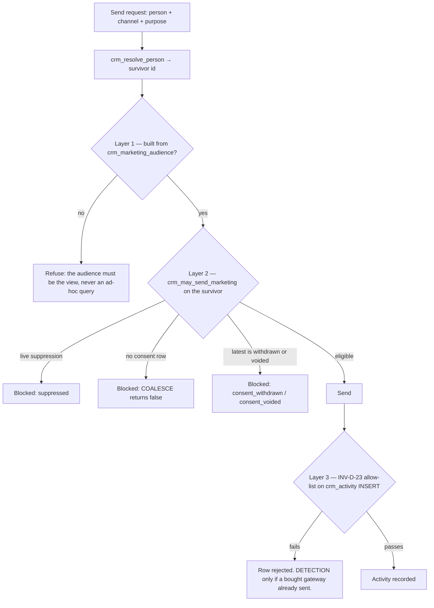
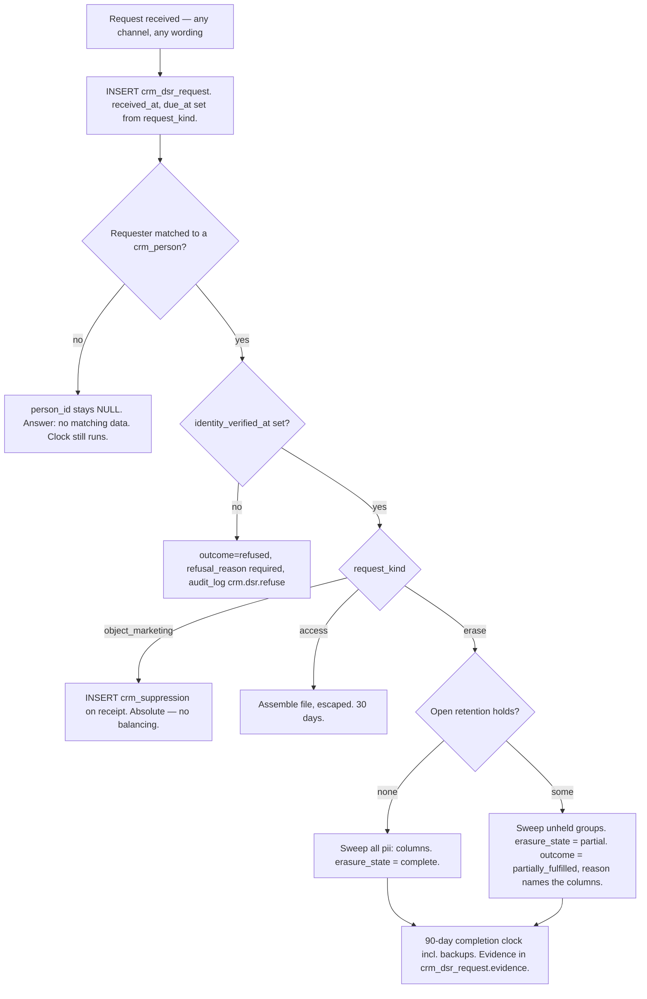

# Forever CRM — Privacy, Consent and Retention

Task ID: FOREVER-CRM-ARCH-001
Status: Proposed architecture — not approved, not scheduled, not authorized for implementation
Repository state of record: main @ 821b3c4e2f6f82e0d4ddce86199a8ff24b44a094
Risk class: R0 (documentation only)

> This document is a design record. It asserts no product truth, changes no active stage, and authorizes no implementation. The active stage remains FOREVER-STUDIO-001 (`docs/CURRENT_STAGE.md`), which lists "large CRM integration" as out of scope. Any implementing task is R2 under the shared-contract rule and requires an Architect-reviewed stage change plus Owner approval.

**This is architecture research, not legal advice.** Every statutory reading below is a working assumption recorded so that **qualified Thai counsel can correct it cheaply against a concrete schema**. The Thai text of the PDPA governs; section numbering here follows an unofficial English translation and secondary commentary and has not been reconciled against the official text. Nothing here states that Forever is or is not currently compliant.

## What this document decides

1. **Consent is evidence, not a boolean.** An append-only `crm_consent_event` log against hashed, versioned notice wording, with an **INSERT-only `voided` correction path** so the log is falsifiable in both directions.
2. **The marketing gate resolves the merge pointer first.** `crm_resolve_person` runs at the top of `crm_may_send_marketing`, `crm_marketing_block_reason`, `crm_marketing_audience` and the INV-D-23 trigger. Without it, merging a suppressed duplicate silently restores marketing eligibility on the one duty the PDPA treats as absolute.
3. **INV-D-23 is an allow-list, not a deny-list.** An automated outbound whose purpose is NULL, unknown or retired is refused, not waved through.
4. **Suppression outranks consent**, is a separate register, and is lifted only by naming a specific later `given` event.
5. **Erasure is derived from `pii:` column comments**, never hand-enumerated; the two columns that cannot be erased are held under a **declared `dispute_defence` retention hold**, so `erasure_state` reads `partial` truthfully rather than `complete` falsely.
6. **The s.25 notice is drainable by a human** — `s25_notice_method`, `s25_notice_sent_by`, one tap. A compliance counter that only goes up trains everyone to ignore the compliance surface.
7. **The unsubscribe token is an opaque stored random value.** No `person_id`, no HMAC, no identifier in any URL; individually revocable.
8. **The ROPA is a markdown table with a review trigger.** `crm_ropa_v1` and the blanket column census are cut.
9. **Minimisation is Path A**: a minimised capture writes `crm_enquiry` + `crm_person` + `crm_person_identifier` only, and touches neither `public.leads` DDL nor its public INSERT policy.
10. **GDPR stacking changes documents and contracts, not tables.**

---

## 1. Scope, phase placement, and what was cut

The corrected phasing (`docs/crm/CRM_IMPLEMENTATION_PLAN.md`) is: Slice 0 = 0 tables, Slice 1 = 0 tables, **Phase 1 = exactly eleven tables in three FK-ordered migrations**, Phase 2 ≈ 10, Phase 3 ≈ 15. Every privacy object below carries a phase or a named trigger.

| Object | Phase | Note |
|---|---|---|
| `crm_processing_purpose` | **Phase 1** — catalogue migration | The lawful-basis register. Seeded; not runtime-editable. |
| `crm_notice_version` | **Phase 1** — catalogue migration | Hashed, versioned wording. |
| `crm_source` (`is_third_party`, `requires_s25_notice`) | **Phase 1** — catalogue migration | Physical carrier of the s.25 duty. |
| `crm_channel` | **Phase 1** — catalogue migration | One channel vocabulary for identifier kinds, suppression, activity and marketing purposes. |
| `crm_consent_event` | **Phase 1** — timeline migration | After `crm_activity`, so `evidence_activity_id` resolves. |
| `crm_suppression` | **Phase 1** — timeline migration | The s.32(2) register. |
| `crm_enquiry.s25_notice_*` | **Phase 1** — identity migration | Columns on `crm_enquiry`. |
| `crm_person.erasure_state` | **Phase 1** — identity migration | A column the marketing gate reads; the machinery that *sets* it is Phase 3. |
| `crm_enquiry_attribution` | Phase 2 | Split off precisely so 13-month telemetry drops independently. |
| `crm_unsubscribe_token` | Trigger: the first outbound marketing send path exists | Requires a messaging gateway, which does not exist. |
| `crm_retention_hold`, `crm_dsr_request` | Phase 3 | Gate: first reservation or first DSR. |
| `public.privacy_breach_register` | Phase 3 | Interim: a dated markdown record with the same mandatory fields (§10). |

**Cut, permanently, and not retained "for completeness":**

| Cut | Why |
|---|---|
| `crm_ropa_v1` view | A generated column census whose legally load-bearing half — recipients, transfer instrument, data categories — stayed hand-maintained inside the view body. §13 replaces it. |
| The blanket `pii:` column census and its build-breaking test | 500+ mandatory comments for a register that drifts anyway. The `pii:` convention survives, **scoped to the columns the erasure sweep must reach** (§8.2). |
| `crm_record_history` | Cut package-wide. It was churn *and* the holder of un-erasable JSONB copies of every buyer's name. `public.audit_log` with `crm_*` action values and populated `old_values`/`new_values` is the reuse-map-directed replacement. |
| Any automation, policy or routing table | All fifteen cut. Sweeps are SQL functions; policy numbers are TypeScript constants. |

**Posture applied verbatim to every table named here** — no exceptions, and no new mechanism:

```sql
ALTER TABLE public.<t> ENABLE ROW LEVEL SECURITY;
-- RLS on, ZERO policies: internal-only (the audit_log pattern).
REVOKE ALL ON TABLE public.<t> FROM PUBLIC, anon, authenticated;
GRANT  ALL ON TABLE public.<t> TO service_role;   -- narrowed per table in §3.4
```

[Repository fact] The explicit `REVOKE` is mandatory: `supabase/migrations/20260721123000_studio_internal_acl_hardening.sql` exists solely because Supabase platform defaults leak `anon`/`authenticated` grants onto new public-schema tables. **No table, function or view in this document uses `auth.uid()`, `auth.jwt()`, `FORCE ROW LEVEL SECURITY`, column-level `GRANT UPDATE`, a second identity roster or a second service-role key path.** Per-person authorization stays in TypeScript at the app-server boundary running as `service_role` (`docs/crm/CRM_SECURITY_AND_RBAC.md`).

Migration numbering is owned by the single package register in `docs/crm/CRM_DOMAIN_MODEL.md`. Every Phase-1 file is numbered **above `20260728160000`**; this document allocates no number of its own. One ordering dependency is load-bearing and is stated there: **`crm_resolve_person` and `crm_may_send_marketing` must be created before the INV-D-23 trigger on `crm_activity`**, because a plpgsql body is not resolved at `CREATE` time — putting them later compiles cleanly and fails at the first send.

---

## 2. Lawful basis map

[Recommendation] Ten purposes. **Exactly two carry `requires_consent = true`**, and the entire sales pipeline runs without consent — which is what makes withdrawal cheap for the buyer *and* for Forever. A pipeline mis-based on consent would let a marketing withdrawal legally halt Forever's ability to answer the buyer's own enquiry.

[Web research] The July 2026 PDPC draft guidance cautions against treating consent as a default or catch-all basis — https://www.lexology.com/library/detail.aspx?g=27642f25-1b92-4c09-b8ff-b4b1c4f27467 · Primary text (unofficial English translation) — https://cc.kmutt.ac.th/Files/Act%20Eng/personal-data-protection-act-2019-en.pdf

| `key` | Plain English | PDPA basis | `requires_consent` | `channel` | s.25 notice | Proposed retention |
|---|---|---|---|---|---|---|
| `enquiry_response` | Contacting the person who enquired, about what they enquired about | s.24(3) pre-contractual | `false` | — | n/a | 24 mo from `crm_person.last_activity_at` |
| `advisory_service` | Producing and re-reading the NAV-001 decision profile and advisor prep | s.24(3); LIA for retention beyond the enquiry | `false` | — | n/a | with the person; free text 24 mo |
| `viewing_scheduling` | Arranging tours and developer meetings, **including disclosing name and phone to the developer's sales office** | s.24(3) | `false` | — | n/a for Forever | with the opportunity |
| `transaction_execution` | Reservation, deposit, SPA, handover | s.24(3) contract | `false` | — | n/a | 10 y from `crm_reservation.spa_signed_on` — **counsel blocking** |
| `aml_kyc` | Identity and source-of-funds checks | s.24(6) legal obligation | `false` | — | n/a | per AMLA — **counsel blocking** |
| `direct_marketing_email` | Newsletters and campaigns that answer no specific enquiry | **s.19 consent** | **`true`** | `email` | n/a | until withdrawal |
| `direct_marketing_whatsapp` | The same, on a messenger | **s.19 consent** | **`true`** | `whatsapp` | n/a | until withdrawal |
| `service_improvement` | Counts, stage ageing, coverage checks | s.24(5) legitimate interest, LIA | `false` | — | n/a | attribution 13 mo |
| `referral_intake` | Holding a referred person's details **before they ever contacted Forever** | s.24(5) LIA. **Never the referrer's consent.** | `false` | — | **Yes, always — 30 days** | 12 mo with no response |
| `dispute_defence` | Establishing or defending legal claims, chiefly commission disputes | s.24(5) LIA | `false` | — | n/a | 10 y — **counsel confirm** |

**Three decisions inside the map.**

**(a) Marketing is split by channel, and the split is a column, not a string.** A buyer who accepts a quarterly email has not accepted WhatsApp broadcasts. `crm_processing_purpose.channel TEXT REFERENCES public.crm_channel(key)` carries the axis. This replaces the earlier design's `'direct_marketing_' || p_channel` concatenation, which silently produced a NULL lookup whenever the suppression vocabulary and the identifier vocabulary disagreed — and they did, in three places. A missing purpose is now an empty join, not a silent NULL. [Web research] Meta places the opt-in determination on the business: "You are solely responsible for determining the method of opt-in" — https://whatsappbusiness.com/policy/

**(b) `referral_intake` is legitimate interest, never consent.** [Inference] A referrer cannot consent on behalf of the person they refer; such consent is defective and defective consent is void, so a referral processed "on the referrer's consent" is processed on no basis at all. The correct construction is s.24(5) plus the s.25 duty (§7).

**(c) The marketing test is `requires_consent = true`, and its fragility is caught by a test rather than a mechanism.** A migration-contract test pins the seed: **exactly two rows carry `requires_consent = true`, both keys begin `direct_marketing_`, and both carry a non-NULL `channel` that exists in `crm_channel`.** Seeding a third fails the build and forces the decision into review.

**Not created here:** no legitimate-interest assessment (three purposes need a written LIA this document does not supply; `crm_processing_purpose.description` carries its conclusion), and no automated decision — the package persists and renders **no numeric score, confidence, probability, rank or conversion rate anywhere**, so profiling with legal or similarly significant effects does not arise.

---

## 3. The consent data model

### 3.1 Why a boolean cannot discharge the s.19 burden

Under s.19 the burden of proving consent rests on the controller. That burden is evidential; a boolean is not evidence.

| What must be provable | `marketing_opt_in BOOLEAN` | `crm_consent_event` + `crm_notice_version` |
|---|---|---|
| That consent was given at all | current state only | one immutable row |
| **When**, and **against what exact wording** | absent | `captured_at`, `notice_version_id → body_sha256` |
| Through what channel, by whom | absent | `capture_channel`, `actor_kind`, `actor_user_id` |
| That it was **not** bundled | unprovable | one row per `purpose_key` |
| That it was withdrawn, and when | destroyed by the update | a second row, `action='withdrawn'` |
| That a **bad** row was corrected without deleting evidence | any writer can flip it | a third row, `action='voided'` (§3.3) |

[Repository fact] The repository's only existing consent concept is `consentAcceptedAt?: ISODateTime` at `src/features/navigator/domain/models/client.ts:17` (mirrored in `src/features/navigator/domain/schemas/navigator-schemas.ts:40`) on a model that is never persisted and maps to no column. Salvaged, it becomes `captured_at` **plus** `notice_version_id`; the timestamp alone was never the useful half.

### 3.2 DDL

```sql
-- Catalogue migration. Seeded; deliberately NOT runtime-editable, so it carries
-- created_at only and NO set_updated_at trigger (a trigger no grant can fire is dead code).
CREATE TABLE IF NOT EXISTS public.crm_processing_purpose (
  key              TEXT PRIMARY KEY,
  name             TEXT NOT NULL,
  lawful_basis     TEXT NOT NULL CHECK (lawful_basis IN (
                     'contract','pre_contractual','legitimate_interest',
                     'consent','legal_obligation','vital_interest','public_interest')),
  requires_consent BOOLEAN NOT NULL,
  channel          TEXT REFERENCES public.crm_channel(key),
  retention_months INTEGER CHECK (retention_months IS NULL OR retention_months > 0),
  description      TEXT NOT NULL,
  is_active        BOOLEAN NOT NULL DEFAULT true,
  created_at       TIMESTAMPTZ NOT NULL DEFAULT now(),
  CONSTRAINT crm_processing_purpose_consent_basis
    CHECK (requires_consent = (lawful_basis = 'consent')),
  CONSTRAINT crm_processing_purpose_consent_channel
    CHECK (NOT requires_consent OR channel IS NOT NULL)
);
```

`crm_processing_purpose_consent_basis` makes it structurally impossible to seed a purpose that says "consent" while `requires_consent` is `false` — which would let a marketing purpose escape both `crm_may_send_marketing` and the INV-D-23 trigger.

```sql
CREATE TABLE IF NOT EXISTS public.crm_notice_version (
  id             UUID PRIMARY KEY DEFAULT gen_random_uuid(),
  notice_key     TEXT NOT NULL,
  version        INTEGER NOT NULL CHECK (version >= 1),
  locale         TEXT NOT NULL,
  body_sha256    TEXT NOT NULL CHECK (body_sha256 ~ '^[0-9a-f]{64}$'),
  body_url       TEXT,
  effective_from TIMESTAMPTZ NOT NULL,
  retired_at     TIMESTAMPTZ,
  created_at     TIMESTAMPTZ NOT NULL DEFAULT now(),
  CONSTRAINT crm_notice_version_natural_key UNIQUE (notice_key, version, locale),
  CONSTRAINT crm_notice_version_retired_after
    CHECK (retired_at IS NULL OR retired_at >= effective_from)
);
```

**Why the hash.** To prove consent you must reproduce the exact words the person saw. Storing the body invites silent edits; storing only a URL invites a page that changed. A SHA-256 over a versioned file in the repository makes the wording diffable in git, servable at a stable path, and verifiable by checksum rather than in a hearing. **Locale is part of the natural key** because a person who consented against the Russian text consented to the Russian text.

```sql
-- Timeline migration, created AFTER crm_activity so evidence_activity_id resolves.
CREATE TABLE IF NOT EXISTS public.crm_consent_event (
  id                    UUID PRIMARY KEY DEFAULT gen_random_uuid(),
  person_id             UUID NOT NULL REFERENCES public.crm_person(id) ON DELETE CASCADE,
  purpose_key           TEXT NOT NULL REFERENCES public.crm_processing_purpose(key),
  notice_version_id     UUID REFERENCES public.crm_notice_version(id),
  action                TEXT NOT NULL CHECK (action IN ('given','withdrawn','refused','voided')),
  voids_consent_event_id UUID REFERENCES public.crm_consent_event(id),
  void_reason           TEXT,
  captured_at           TIMESTAMPTZ NOT NULL,
  capture_channel       TEXT NOT NULL CHECK (capture_channel IN (
                          'web_form','booth_tablet','whatsapp','email','phone','paper','import')),
  capture_context       JSONB NOT NULL DEFAULT '{}'::jsonb,
  actor_kind            TEXT NOT NULL CHECK (actor_kind IN ('contact','member','integration','system')),
  actor_user_id         UUID REFERENCES auth.users(id) ON DELETE SET NULL,
  actor_email           TEXT,
  evidence_activity_id  UUID REFERENCES public.crm_activity(id) ON DELETE SET NULL,
  created_at            TIMESTAMPTZ NOT NULL DEFAULT now(),
  CONSTRAINT crm_consent_event_given_needs_notice
    CHECK (action <> 'given' OR notice_version_id IS NOT NULL),
  CONSTRAINT crm_consent_event_void_needs_target
    CHECK ((action = 'voided') = (voids_consent_event_id IS NOT NULL)),
  CONSTRAINT crm_consent_event_void_needs_reason
    CHECK (action <> 'voided' OR length(btrim(void_reason)) > 0),
  CONSTRAINT crm_consent_event_booth_needs_actor
    CHECK (capture_channel <> 'booth_tablet' OR actor_user_id IS NOT NULL)
);

CREATE INDEX idx_crm_consent_event_state
  ON public.crm_consent_event (person_id, purpose_key, captured_at DESC);
CREATE UNIQUE INDEX idx_crm_consent_event_void_once
  ON public.crm_consent_event (voids_consent_event_id) WHERE voids_consent_event_id IS NOT NULL;
```

`crm_consent_event_given_needs_notice` makes "defective consent is void" a schema property: consent cannot be recorded without naming the wording it was given against. `crm_consent_event_booth_needs_actor` closes the attribution hole on the shared walk-in tablet — a booth capture with no authenticated member is refused rather than attributed to `system`.

**`capture_context` allow-list.** Permitted: the rendered checkbox label verbatim, the form or screen identifier, the notice version string as displayed, the locale actually rendered, and `ip_country_iso2` derived from Cloudflare's `CF-IPCountry` header. **Never the raw IP, never the full user-agent, never a session cookie.** A schemaless column is exactly where that discipline leaks, so the key allow-list is a contract test, not a convention (INV-P-6).

```sql
CREATE TABLE IF NOT EXISTS public.crm_suppression (
  person_id      UUID NOT NULL REFERENCES public.crm_person(id) ON DELETE CASCADE,
  channel        TEXT NOT NULL REFERENCES public.crm_channel(key),   -- 'all' is a seeded key
  scope          TEXT NOT NULL CHECK (scope IN ('marketing','all')),
  applied_at     TIMESTAMPTZ NOT NULL DEFAULT now(),
  applied_by     UUID REFERENCES auth.users(id) ON DELETE SET NULL,
  applied_by_email TEXT,
  source         TEXT NOT NULL CHECK (source IN
                   ('data_subject_request','bounce','complaint','internal','legacy_backfill')),
  note           TEXT,
  lifted_at      TIMESTAMPTZ,
  lifted_by      UUID REFERENCES auth.users(id) ON DELETE SET NULL,
  lifted_evidence_consent_event_id UUID REFERENCES public.crm_consent_event(id),
  created_at     TIMESTAMPTZ NOT NULL DEFAULT now(),
  updated_at     TIMESTAMPTZ NOT NULL DEFAULT now(),
  PRIMARY KEY (person_id, channel, scope),
  CONSTRAINT crm_suppression_lift_needs_evidence
    CHECK (lifted_at IS NULL OR lifted_evidence_consent_event_id IS NOT NULL),
  CONSTRAINT crm_suppression_lift_ordering
    CHECK (lifted_at IS NULL OR lifted_at >= applied_at)
);

CREATE INDEX idx_crm_suppression_live
  ON public.crm_suppression (person_id) WHERE lifted_at IS NULL;
```

**Merge survivorship, stated because the composite PK makes it mandatory.** [Repository fact — verified defect] Every legacy-backfilled person receives a suppression row (§5.2), so merging two legacy duplicates under a naive "repoint every child row" merge raises `unique_violation` 100% of the time. The rule is **union, not move**: on collision the survivor's row keeps the **earliest** `applied_at` and **no** `lifted_at` if either side is live; the loser's row is recorded in the merge record's `skipped` list with its reason, so unmerge restores rather than loses. Specified in full in `docs/crm/CRM_DOMAIN_MODEL.md`.

### 3.3 Append-only, and the `voided` correction path

`crm_notice_version` is append-only **except a single one-way `NULL → timestamp` transition on `retired_at`** — retiring a notice is a real later fact about an existing row. This is the same shape the domain model already accepts for the unmerge columns, so it introduces no new pattern.

```sql
CREATE OR REPLACE FUNCTION public.crm_notice_version_append_only()
RETURNS TRIGGER LANGUAGE plpgsql SET search_path = '' AS $$
BEGIN
  IF TG_OP = 'DELETE' THEN
    RAISE EXCEPTION 'crm_notice_version is append-only: notice wording is consent evidence';
  END IF;
  IF OLD.retired_at IS NOT NULL OR NEW.retired_at IS NULL THEN
    RAISE EXCEPTION 'crm_notice_version: only a one-way retired_at transition is permitted';
  END IF;
  IF ROW(NEW.notice_key, NEW.version, NEW.locale, NEW.body_sha256,
         NEW.body_url, NEW.effective_from, NEW.created_at)
     IS DISTINCT FROM
     ROW(OLD.notice_key, OLD.version, OLD.locale, OLD.body_sha256,
         OLD.body_url, OLD.effective_from, OLD.created_at) THEN
    RAISE EXCEPTION 'crm_notice_version: wording and effective date are immutable';
  END IF;
  RETURN NEW;
END;
$$;
```

`crm_consent_event` is append-only without qualification. **But an append-only log with no falsification path is unfalsifiable in both directions**, and the least-trusted principal in the system — a shared booth tablet — is the one that writes it. A forged or mistyped `given` row would otherwise read forever as genuine consent later withdrawn.

> **The correction path is an INSERT, never an UPDATE.** `action = 'voided'` with a mandatory `voids_consent_event_id` and a mandatory reason. `crm_may_send_marketing` ignores voided evidence; an auditor can distinguish a consent the buyer withdrew from a row that should never have existed. `idx_crm_consent_event_void_once` prevents a row being voided twice.

**INV-P-1**, one further guard: a `given` event whose `captured_at` precedes its notice's `effective_from` is proof the person was shown different wording from the one recorded. A constraint trigger `crm_consent_notice_effective_guard` rejects it.

### 3.4 Grants

[Repository fact] Column-level `GRANT UPDATE (…)` has **zero occurrences across all 24 migrations**; the precedent that does exist (`20260724090000`) is whole-table narrowing paired with claim-checked SECURITY DEFINER RPCs. This design uses the precedent as it actually exists.

| Table | Grant to `service_role` | Exceptions |
|---|---|---|
| `crm_processing_purpose`, `crm_notice_version`, `crm_source`, `crm_channel` | `SELECT` (seeded by migration) | `crm_notice_version` gains `INSERT` + the one-way `retired_at` `UPDATE`, policed by the guard trigger above |
| `crm_consent_event` | `REVOKE ALL; GRANT SELECT, INSERT` | none — corrections are inserts |
| `crm_suppression` | `GRANT ALL` | the lift path is policed by a constraint trigger, not a grant |
| `crm_activity` | `REVOKE ALL; GRANT SELECT, INSERT` | body redaction by guard trigger only |

Consequence, stated so nobody plans around it: because `crm_consent_event` has no `UPDATE` and no `DELETE` grant at all, `capture_context` is **structurally un-erasable**. §8.3 resolves that honestly rather than pretending otherwise.

---

## 4. The marketing gate

### 4.1 Resolve the merge pointer first — the load-bearing fix

[Repository fact — verified defect] The earlier design matched `crm_suppression.person_id` and `crm_consent_event.person_id` by exact equality and additionally required `merged_into_person_id IS NULL` on the person being checked. A suppression recorded against a merge **loser** was therefore never consulted for the **winner**: the pre-send check and the database backstop failed open together, in the same direction, **on the one duty this document calls absolute**.

```sql
CREATE OR REPLACE FUNCTION public.crm_resolve_person(p_person_id UUID)
RETURNS UUID LANGUAGE sql STABLE SET search_path = '' AS $$
  WITH RECURSIVE chain(id, merged_into_person_id, depth) AS (
      SELECT p.id, p.merged_into_person_id, 0
        FROM public.crm_person p
       WHERE p.id = p_person_id
    UNION ALL
      SELECT p.id, p.merged_into_person_id, c.depth + 1
        FROM chain c
        JOIN public.crm_person p ON p.id = c.merged_into_person_id
       WHERE c.depth < 16
  )
  SELECT id FROM chain WHERE merged_into_person_id IS NULL LIMIT 1;
$$;
```

The depth cap is deliberate: a pointer cycle returns `NULL`, every downstream `EXISTS` then fails, and the `COALESCE` in §4.2 renders the whole gate `false`. **A broken merge graph blocks marketing rather than releasing it.**

`crm_resolve_person` is called at the top of **`crm_may_send_marketing`, `crm_marketing_block_reason`, `crm_marketing_audience` and the INV-D-23 trigger** — all four, without exception. Pinned by a real-Postgres test under `npm run studio:pg-test`: suppress A, merge A into B, assert `crm_may_send_marketing(B, 'email') = false` **and** that the INV-D-23 trigger rejects the activity insert.

### 4.2 The eligibility function

```sql
CREATE OR REPLACE FUNCTION public.crm_may_send_marketing(p_person_id UUID, p_channel TEXT)
RETURNS BOOLEAN LANGUAGE sql STABLE SET search_path = '' AS $$
  WITH subject AS (SELECT public.crm_resolve_person(p_person_id) AS id)
  SELECT COALESCE(
    -- (1) no live suppression covering this channel, on the SURVIVOR
    NOT EXISTS (
      SELECT 1 FROM public.crm_suppression s, subject
      WHERE s.person_id = subject.id
        AND s.lifted_at IS NULL
        AND s.scope   IN ('marketing','all')
        AND s.channel IN (p_channel, 'all'))
    -- (2) the survivor is live and unerased
    AND EXISTS (
      SELECT 1 FROM public.crm_person p, subject
      WHERE p.id = subject.id
        AND p.deleted_at IS NULL
        AND p.erasure_state = 'none')
    -- (3) the latest non-voided event for this channel's consent purpose is 'given'
    AND (
      SELECT ce.action
      FROM   public.crm_consent_event ce
      JOIN   public.crm_processing_purpose pp ON pp.key = ce.purpose_key
      CROSS  JOIN subject
      WHERE  ce.person_id = subject.id
        AND  pp.requires_consent AND pp.is_active
        AND  pp.channel = p_channel
        AND  ce.action <> 'voided'
        AND  NOT EXISTS (SELECT 1 FROM public.crm_consent_event v
                          WHERE v.voids_consent_event_id = ce.id)
      ORDER  BY ce.captured_at DESC, ce.created_at DESC
      LIMIT  1) = 'given',
  false);   -- <-- the entire fail-closed guarantee lives here
$$;

REVOKE ALL ON FUNCTION public.crm_may_send_marketing(UUID, TEXT) FROM PUBLIC, anon, authenticated;
GRANT EXECUTE ON FUNCTION public.crm_may_send_marketing(UUID, TEXT) TO service_role;
```

**The `COALESCE` is not decoration (INV-P-2).** Clause (3) returns `NULL` for anyone who has never recorded a consent event — the overwhelmingly common case. `true AND NULL` is `NULL`, so a plpgsql caller writing `IF NOT crm_may_send_marketing(…) THEN RAISE` would evaluate `NOT NULL → NULL`, decline the branch, and send. That is a fail-**open** control that passes every happy-path test. The same three-valued-logic sweep is run over every other aggregate- or `NOT EXISTS`-based invariant in the package.

Note that clause (2) no longer tests `merged_into_person_id IS NULL` on the input; it tests the survivor, for whom the property holds by construction. That is the whole correction, in one line.

A companion `crm_marketing_block_reason(UUID, TEXT) RETURNS TEXT` returns exactly one of `suppressed`, `no_consent`, `consent_withdrawn`, `consent_voided`, `person_erased`, `unverified_channel`, or `NULL` (eligible), so the UI explains rather than silently omits.

### 4.3 Audience construction

Marketing recipient sets are never built by an ad-hoc query with a `WHERE NOT EXISTS` clause someone has to remember.

```sql
CREATE VIEW public.crm_marketing_audience
WITH (security_invoker = true) AS
SELECT p.id AS person_id, i.kind AS channel, i.canonical_value AS address,
       p.preferred_language, p.timezone
FROM   public.crm_person p
JOIN   public.crm_person_identifier i
       ON i.person_id = p.id AND i.deleted_at IS NULL AND i.verified_at IS NOT NULL
WHERE  p.deleted_at IS NULL
  AND  p.merged_into_person_id IS NULL
  AND  p.erasure_state = 'none'
  AND  public.crm_may_send_marketing(p.id, i.kind);

REVOKE ALL ON public.crm_marketing_audience FROM PUBLIC, anon, authenticated;
GRANT  SELECT ON public.crm_marketing_audience TO service_role;
```

`WITH (security_invoker = true)` is mandatory and is asserted by the contract test alongside the `REVOKE`. [Repository fact] Zero `CREATE VIEW` exists anywhere in the repository, so every CRM view is a first and the posture must be right the first time; the live PostgreSQL major version is confirmed in the read-only pre-apply check.

`i.verified_at IS NOT NULL` restricts marketing to channels that have demonstrably reached the person. An unverified address is a guess, and a guess sent to a stranger is the worst kind of marketing error.

### 4.4 INV-D-23 — the database backstop, inverted to an allow-list

[Repository fact — verified defect] `crm_activity.purpose_key` is nullable and caller-set, and the earlier trigger inspected only purposes already known to be marketing. An automated outbound written with a NULL or mislabelled purpose never reached the eligibility test at all — and `crm.activity.write` is granted to the Integration principal, with a bought gateway writing into `crm_activity`.

```sql
-- Table-level, on crm_activity:
CONSTRAINT crm_activity_automated_outbound_purpose
  CHECK (NOT (direction = 'outbound' AND is_automated) OR purpose_key IS NOT NULL)
```

```sql
-- BEFORE INSERT ON public.crm_activity. Allow-list, not deny-list.
IF NEW.direction = 'outbound' AND NEW.is_automated THEN
  IF NOT EXISTS (SELECT 1 FROM public.crm_processing_purpose pp
                  WHERE pp.key = NEW.purpose_key
                    AND pp.is_active
                    AND NOT pp.requires_consent) THEN
    -- marketing, unknown, or retired: all three must clear the gate
    IF NOT public.crm_may_send_marketing(
             public.crm_resolve_person(NEW.person_id), NEW.channel) THEN
      RAISE EXCEPTION 'INV-D-23: automated outbound refused for person % on channel %',
                      NEW.person_id, NEW.channel;
    END IF;
  END IF;
END IF;
```

Real-Postgres test: a NULL-purpose automated outbound insert for a **merged, suppressed** person is rejected. This is the layer the package claims "survives a service-role application bug"; as previously written it did not survive a forgotten field.



**The honest limitation.** [Inference] If Forever buys the messaging gateway — the package's recommendation — the gateway *sends first and writes to Supabase afterwards*. For that path Layer 3 is a **detection** control, not a prevention control. Prevention then rests entirely on Layer 1 plus a one-way mirror of `crm_suppression` into the gateway's own suppression list. **The gap is closed contractually with the gateway, not architecturally**, and a design claiming otherwise would be false.

---

## 5. The suppression register

### 5.1 Why a table, and why it outranks consent

[Web research] The s.32(2) direct-marketing objection is **absolute — no rebuttal, no legitimate-interest override, no balancing test** — and the Act requires the objected-to data to be immediately distinguished clearly from other matters. https://cc.kmutt.ac.th/Files/Act%20Eng/personal-data-protection-act-2019-en.pdf

That phrase is a data-architecture instruction. A column on `crm_person` would be one of nineteen on the busiest table in the CRM, would carry no provenance, would be cleared by any careless `UPDATE crm_person SET …`, and would be destroyed by anonymisation. A register whose entire population is objections is none of those things.

```
suppression (live)  >  consent (latest non-voided 'given')  >  no record
```

**INV-P-3.** A person who is suppressed and then ticks a marketing box is **still suppressed**. Only an explicit lift, referencing a specific `crm_consent_event` by id with `action='given'` and `captured_at > crm_suppression.applied_at`, clears it — the id reference by CHECK, the ordering and action by constraint trigger (a CHECK cannot reference another table). The asymmetry of harm decides it: a wrongly-lifted suppression sends marketing to someone who exercised an absolute right and cannot be un-sent; a wrongly-persisting suppression means one person misses a newsletter.

A lift writes `public.audit_log(action='crm.suppression.lift')` **inside the same transaction** — not through `recordAuditSafely`, which [Repository fact] swallows every failure post-commit and is inadequate for the record that proves why marketing resumed.

### 5.2 What creates a suppression row

| `source` | Trigger | Writer |
|---|---|---|
| `data_subject_request` | s.32(2) objection, any channel, any wording | the DSR path (Phase 3), linked to `crm_dsr_request(request_kind='object_marketing')` |
| `bounce` | hard bounce or invalid recipient | gateway ingest, `channel='email'` |
| `complaint` | spam complaint or messenger block | gateway ingest |
| `internal` | an advisor records a verbal request not to be marketed to | the CRM UI, `applied_by` recorded |
| `legacy_backfill` | **every person created from a `public.leads` backfill row** — automatic, `channel='all'`, `scope='marketing'` | the backfill RPC |

The last row is not optional. [Web research — descriptive only, not legal advice; qualified Thai counsel required] PDPA s.95 permits continued use for the **original stated purpose** with a published withdrawal method; migrating historic rows into new purposes without fresh consent is the classic failure, and suppression-by-default is what prevents it. https://cc.kmutt.ac.th/Files/Act%20Eng/personal-data-protection-act-2019-en.pdf · https://www.lexology.com/library/detail.aspx?g=27642f25-1b92-4c09-b8ff-b4b1c4f27467

---

## 6. Withdrawal at equal friction

[Owner requirement] Consent must be withdrawable at equal friction. Made concrete:

| Given by | Withdrawal must be |
|---|---|
| one tap on a booth tablet | one tap from any marketing message, no login |
| a checkbox on a web form | a link in every message, no login and no account |
| a reply on WhatsApp | a reply on WhatsApp, honoured by a human or by the gateway |

**The token is an opaque stored random value. There is no `person_id` in any URL, and no HMAC.**

```sql
-- Trigger: the first outbound marketing send path exists. Not Phase 1.
CREATE TABLE IF NOT EXISTS public.crm_unsubscribe_token (
  token_sha256 TEXT PRIMARY KEY CHECK (token_sha256 ~ '^[0-9a-f]{64}$'),
  person_id    UUID NOT NULL REFERENCES public.crm_person(id) ON DELETE CASCADE,
  purpose_key  TEXT NOT NULL REFERENCES public.crm_processing_purpose(key),
  issued_at    TIMESTAMPTZ NOT NULL DEFAULT now(),
  revoked_at   TIMESTAMPTZ,
  last_used_at TIMESTAMPTZ,
  UNIQUE (person_id, purpose_key, issued_at)
);
```

Five properties, each replacing a defect in the HMAC form:

1. **Opaque.** The URL carries a 256-bit random value and nothing else. It reveals no internal identifier through mail relays, browser history or `Referer` headers. Only the **hash** is stored, so a database read does not yield a working link.
2. **Individually revocable.** An HMAC with no TTL is revocable only by rotating the secret, which breaks every outstanding link ever sent — a secret with no incident response, which is itself the s.19 equal-friction failure.
3. **No expiry as a cryptographic constraint.** A marketing email may be opened a year later; an expired unsubscribe link makes withdrawal *harder* than consent. Expiry becomes policy, applied per row.
4. **`GET` renders, `POST` acts.** Mailbox security scanners follow links. A withdrawal performed on `GET` fires for messages nobody read, corrupting both the consent record and the marketing state. The visible link renders **one button and no name, address or identifier**; the button `POST`s. [Unverified assumption] The `List-Unsubscribe` / `List-Unsubscribe-Post` header pair (RFC 2369 / RFC 8058) would give a genuine one-click `POST` that scanners do not trigger; the exact semantics must be confirmed against the RFCs, as no citation in the approved research set covers them.
5. **A TanStack `createServerFn`, not a new database grant.** It validates the token then acts as `service_role` — no new RLS policy, no `anon` grant, no new PostgREST exposure. The same shape as the proven Studio endpoints in `src/features/forever-studio/studio.functions.ts`, minus the auth middleware and plus a token check.

The endpoint writes, in one transaction: `crm_consent_event(action='withdrawn')` and a `crm_suppression` row for the corresponding channel, `ON CONFLICT DO NOTHING`. Replay returns 200 and writes nothing new. No reason field, no confirmation loop, no preference-centre login.

**WhatsApp cannot carry a link on Forever's terms.** [Web research] Outside the 24-hour customer-service window only pre-approved templates may be sent, and template review takes up to 24 hours, so nothing can be authored mid-conversation — https://developers.facebook.com/docs/whatsapp/cloud-api/guides/send-messages The consequence is specific: **the withdrawal instruction must be baked into every approved marketing template at approval time.** Adding it later means re-approving every template.

---

## 7. Third-party leads and the s.25 notice

[Web research] Personal data not collected from the data subject carries a duty to notify that person within 30 days. https://cc.kmutt.ac.th/Files/Act%20Eng/personal-data-protection-act-2019-en.pdf

The clock lives on `crm_enquiry`, and only there.

| Column | Role |
|---|---|
| `crm_source.is_third_party`, `crm_source.requires_s25_notice` | catalogue facts |
| `crm_enquiry.s25_notice_required` | **snapshot**, copied from the catalogue on insert |
| `crm_enquiry.s25_notice_sent_at` | when the notice was actually given |
| `crm_enquiry.s25_notice_method` | `CHECK (… IN ('email','whatsapp','in_person','post'))` |
| `crm_enquiry.s25_notice_sent_by` | `UUID REFERENCES auth.users(id) ON DELETE SET NULL`, plus an email snapshot |

`CHECK ((s25_notice_sent_at IS NULL) = (s25_notice_method IS NULL))` pairs the nulls. The snapshot matters: if the catalogue is later corrected, historical enquiries keep the flag they were created under, because the duty attached at acquisition.

**The rule that makes the clock exist at all.** A referral creates a person who never contacted Forever, so there is no natural enquiry row. Therefore: **every third-party acquisition of a person creates a `crm_enquiry` row, whether or not that person made a request.** This refines the domain model's definition of `crm_enquiry` from "immutable evidence of a *request*" to "immutable evidence of an *acquisition event*", and costs nothing — the row already carries source, timestamp, person and triage state, which is precisely the tuple s.25 needs.

**One exception, and it is a correction.** Creating a `crm_person` for a developer's sales manager, a lawyer, a translator or a property manager does **not** mint an enquiry and does **not** start a statutory clock against a counterparty. `crm_person` creation without `crm_enquiry` is permitted when every role on the person is a non-buyer role (`developer_rep`, `lawyer`, `translator`, `property_manager`, `introducer`).

**`source_key` is resolved server-side, never from the client.** [Repository fact — verified defect] The unauthenticated capture endpoint mirrors `LeadFormValues` field-for-field and `public.leads.source` has no CHECK, so a statutory duty was being set from unvalidated client input, failing silently in the direction that matters. Corrected: the unauthenticated path resolves `source_key` from the request route or `Origin` against an allow-list of first-party owned-web keys; the client's claim is retained in `source_raw` as evidence only; **any key with `crm_source.is_third_party = true` requires an authenticated principal.** Contract test: no seeded source with `requires_s25_notice = false` is reachable from the unauthenticated path.

**Fail-closed seed.** `referral`, `portal`, `partner`, `import_legacy` and `other` are all `is_third_party = true, requires_s25_notice = true`. Being wrong in that direction costs one unnecessary notice; being wrong in the other is a missed statutory duty.

**The duty must be drainable by a human.** [Repository fact] Nothing on `main` sends anything — no provider client, no SMTP on Cloudflare Workers, no notification path. A queue clearable only by an automated send that cannot exist is a counter that rises forever, and a compliance surface that is always red trains everyone to ignore it — including the overdue-DSR count that will eventually live beside it.

> An advisor who says on the phone *"we got your details from Sergey, and here is our privacy notice"* has discharged the duty. **One tap records it**: `s25_notice_sent_at = now()`, `s25_notice_method = 'in_person'` or `'whatsapp'`, `s25_notice_sent_by = actor`. The recorded attestation is stronger evidence than a send log.

```sql
CREATE INDEX idx_crm_enquiry_s25_due
  ON public.crm_enquiry (received_at)
  WHERE s25_notice_required AND s25_notice_sent_at IS NULL;
```

The report **is** the index. It is rendered as a count and an oldest-age, never as a percentage.

---

## 8. Retention and erasure

### 8.1 Proposed retention per data class

**Every row is a proposal.** The Counsel column ranks consequence, not optionality.

| # | Data class | Where | Proposed period | Phase | Counsel |
|---|---|---|---|---|---|
| 1 | Web attribution — UTM, referrer, landing path, `ip_country_iso2` | `crm_enquiry_attribution` | **13 months** from `received_at` | 2 | Confirm |
| 2 | Spam-rejected enquiry, never linked to a person | `crm_enquiry` | **90 days**, then **hard delete** — the only hard delete in the design | 1 | Confirm |
| 3 | Unconverted enquiry | `crm_enquiry` (`unprocessed`, `duplicate`) | **24 months** | 1 | Confirm |
| 4 | Prospect person and identifiers, never transacted | `crm_person`, `crm_person_identifier` | **36 months** from `last_activity_at` | 1 | Confirm |
| 5 | Decision profile free text | `crm_decision_profile.guest_note`, `raw_answers` | **24 months**; the 28 categorical keys live with the person | 2 | Confirm |
| 6 | Communication content | `crm_activity.body_text` | **36 months** — body nulled, `redacted_at` stamped, **row retained** | 1 | Confirm |
| 7 | Transaction record | `crm_opportunity` (won), `crm_reservation` | **10 years** from `spa_signed_on` | 3 | **Blocking** |
| 8 | AML / KYC evidence | `crm_reservation_requirement` + `crm_retention_hold(basis='aml_kyc')` | per AMLA, from end of relationship | 3 | **Blocking** |
| 9 | Consent evidence | `crm_consent_event`, `crm_notice_version` | **relationship + 10 years** | 1 | Confirm |
| 10 | **Suppression** | `crm_suppression` | **Indefinite** — deleting it re-enables marketing | 1 | **Blocking** |
| 11 | DSR record | `crm_dsr_request` | **10 years** — the register must outlast the disputes it evidences | 3 | Confirm |
| 12 | Audit trail | `public.audit_log` with `crm_*` actions | **10 years** | existing | Confirm |
| 13 | Breach register | `public.privacy_breach_register` | **Indefinite** | 3 | Confirm |

Row 6 states the principle the whole table turns on: **the row is the evidence that contact occurred; the body is the personal data.** Deleting the row destroys the timeline. Rows 1–6 map to purposes and carry `crm_processing_purpose.retention_months`; rows 7–13 are records *about* processing and are documented in the purpose descriptions rather than swept.

**Application.** One idempotent, slice-bounded, non-throwing pass on the existing `cloudflare:scheduled` hook, yielding to the Studio tick, with a wall-clock deadline checked between every unit and a rendered `last_run_at`. Retention enforcement is **never** a `DELETE` from application code.

### 8.2 Erasure is derived, not enumerated

[Repository fact — verified defect] A hand-written anonymisation function enumerated roughly six columns and missed roughly fifteen holding personal data, while `erasure_state` would have read `complete`. A hand-maintained list drifts on the first migration that adds a column, with no compile-time signal.

> **The erasure field list is derived mechanically from `pii:` column comments.**

[Repository fact] `COMMENT ON COLUMN` already has precedent at `supabase/migrations/20260718113000_progressive_ingestion_v1.sql:50-54`, so this is an existing idiom used deliberately — **not** the cut blanket census. The convention is scoped to exactly the columns the erasure sweep must reach:

```sql
COMMENT ON COLUMN public.crm_person.given_name IS
  'pii:identity | Given name as supplied. Overwritten with ''[erased]'' unless an identity-group hold is open.';

COMMENT ON COLUMN public.crm_person_identifier.canonical_value IS
  'pii:contact | E.164 for phone/whatsapp, lowercased for email. DELETED on erasure — a hash is pseudonymisation, not anonymisation.';
```

Parse rule: the text before the first `|` is `pii:<category>` with category in `identity`, `contact`, `preference`, `communication`, `transaction`, `attribution`, `consent`. **INV-P-4**: a contract test asserts that every column carrying a `pii:` comment is **either swept by the erasure routine or mapped to a `crm_retention_hold.field_group` with a stated basis**. Columns with no comment are outside the sweep by declaration, and adding a personal-data column without one is caught in review rather than by a build-breaking census over every column in the schema.

**A repeated failure mode, restated because it is the commonest way anonymisation silently fails:** `crm_decision_profile.guest_note` exists **twice** — once as a column and once inside `raw_answers JSONB`. Nulling the column and leaving the JSONB has anonymised nothing.

`crm_anonymise_person` and `crm_purge_rejected_enquiries` are **SECURITY INVOKER**, not DEFINER. Every table they legitimately touch is already granted; escalating them would hand two evidence-destroying functions unrevocable `UPDATE` and `DELETE` on `crm_consent_event`, `crm_suppression` and `crm_person_merge`. If the erasure path later needs to reach an evidence table, the grant is added visibly in a migration — the grant statement is then the readable mutability contract.

### 8.3 Why erasure is honestly partial

`crm_retention_hold.field_group` is the whole mechanism, and it is why a single "do not delete" boolean would be wrong in both directions at once.

| `field_group` | Covers | Typical `basis` |
|---|---|---|
| `identity` | `crm_person.display_name`, `given_name`, `family_name`, `nationality_iso2` | `aml_kyc`, `litigation` |
| `contact` | `crm_person_identifier` rows | `aml_kyc`, `marketing_objection`, `litigation` |
| `transaction` | `crm_opportunity`, `crm_reservation`, `crm_reservation_requirement` | `contract`, `tax`, `litigation` |
| `communications` | `crm_activity.body_text`, `crm_enquiry.message_text`, `crm_decision_profile.guest_note` | `litigation`, `regulator_request` |
| `evidence` | **`crm_consent_event.capture_context`**, **`crm_person_merge.field_survivorship`** | **`dispute_defence`** |
| `all` | every group | `regulator_request` |

**The two columns that cannot be erased, and the declaration that makes `erasure_state` truthful.** `crm_consent_event` carries no `UPDATE` and no `DELETE` grant (§3.4); `crm_person_merge` is append-only except its unmerge columns. Both therefore survive any erasure sweep. The earlier design's third un-erasable holder, `crm_record_history`, is **cut outright**, which removes the worst of the three — full JSONB copies of every buyer's name on every tracked change.

For the remaining two the answer is not a workaround:

> Erasing a person opens a `crm_retention_hold(field_group='evidence', basis='dispute_defence')` with a stated reason, the sweep skips those two columns because they are mapped rather than swept, `crm_person.erasure_state` is set to **`partial`**, `crm_dsr_request.outcome` is `partially_fulfilled`, and `refusal_reason` names the specific columns and the obligation. **The data subject is told. Nothing is hidden, and `erasure_state` never reads `complete` over surviving data.**

`crm_retention_hold.basis` therefore reads `CHECK (basis IN ('aml_kyc','contract','tax','litigation','regulator_request','marketing_objection','dispute_defence'))`. Recording an evidence hold as `regulator_request` would make the hold register lie about why data is retained — precisely the defect a hold register exists to prevent.

**The suppression-versus-erasure conflict, named rather than engineered around.** `crm_suppression.person_id` FKs to a person row that is never deleted, so the suppression survives erasure. But erasure **deletes** `crm_person_identifier` rows. If that person is later re-imported from a portal or referred by a friend, they become a *new* person with new identifiers and the surviving suppression does not attach. **Forever would market to someone who exercised an absolute right.** Three options: (A) erase fully and accept the gap; (B) retain a hashed identifier — retention dressed as deletion; **(C) retain the minimum identifier under an explicit, disclosed `marketing_objection` hold — recommended.** [Inference] Option C rests on the reading that a controller cannot discharge an obligation whose means of performance it has destroyed, reasoned by analogy from GDPR Art 17(3)(b). **Whether that holds under PDPA s.33 is a question for qualified Thai counsel and is the single most consequential open item in this document.**

**Backups are a compliance parameter, not a schema problem.** [Web research] Erasure must complete within 90 days **including copies and backups** — https://www.lawplusltd.com/2024/08/rules-on-deletion-destruction-or-anonymization-of-personal-data/ Therefore: **if the Supabase PITR / backup retention window exceeds 90 days, erasure cannot be completed on time by waiting.** [Repository fact] The repository does not record it — `supabase/config.toml` contains only `project_id = "abtvsrcnfwlbawvrjeed"`. It is a plan-level and project-level setting (https://supabase.com/pricing) that **must be read off the live project as a read-only pre-apply check**. No schema decision changes this.

---

## 9. Data-subject rights

Phase 3. Until `crm_dsr_request` exists, a request is handled manually and recorded in `public.audit_log` with a `crm.dsr.*` action; the clocks below apply from the day the CRM holds a single buyer record, not from the day the table ships.

| `request_kind` | Hook | Response clock | Completion clock | Confidence |
|---|---|---|---|---|
| `access` | s.30 | **30 days** from a verified request | same | Stated in the Act |
| `port` | s.31 | 30 days (internal policy) | same | **Counsel confirm** |
| `object_marketing` | **s.32(2)** | **On receipt** — absolute | same | Stated in the Act |
| `restrict` / `rectify` | s.34 / s.35 | 30 days (internal policy) | same | **Counsel confirm** |
| `erase` | s.33 | **30 days** to respond | **90 days** to complete, **including copies and backups** | PDPC Notification effective 2024-11-11 — https://www.lawplusltd.com/2024/08/rules-on-deletion-destruction-or-anonymization-of-personal-data/ |
| `withdraw_consent` | s.19 | On receipt (§6) | same | Equal-friction rule |

**The response clock and the completion clock are different things, and only erasure separates them.** A 30-day reply saying "we have erased you" is not compliance if the data is still in a backup on day 120.

**Where the 90-day clock lives.** Not in a new column: the durable in-transaction record is the `public.audit_log` row written by `crm_anonymise_person` with `action='crm.person.erase'`. The backstop is a query over erasure requests with no matching audit row inside 90 days. Backup scrubbing cannot be evidenced by the database being scrubbed, so it goes in `crm_dsr_request.evidence` JSONB, which exists for exactly this class of out-of-band proof.

**Two CHECKs and one deliberate nullable.**

```sql
CONSTRAINT crm_dsr_request_fulfil_needs_identity
  CHECK (outcome IS DISTINCT FROM 'fulfilled' OR identity_verified_at IS NOT NULL),
CONSTRAINT crm_dsr_request_refusal_needs_reason
  CHECK (outcome IS DISTINCT FROM 'refused' OR refusal_reason IS NOT NULL)
```

The first is scoped to `fulfilled` and not to `responded_at`: a request **refused precisely because identity could not be verified** must remain recordable, and a stricter CHECK would make it unloggable — itself an s.39(7) failure. It closes two hostile cases. An **access** request answered without verification discloses a buyer's entire file to whoever sent the email; access is the most dangerous DSR, not the most benign. An **erasure** request answered without verification lets a third party destroy a live buyer's record mid-transaction.

`crm_dsr_request.person_id` is deliberately nullable: "we hold no personal data matching your request" is a response with its own 30-day clock, and an unlogged one is invisible to the refusal register. `partially_fulfilled` counts as a refusal for register purposes — the part that was refused is exactly the part a regulator will ask about.

**Export escaping.** The access export and every CSV surface quote every field and prefix any cell beginning `=`, `+`, `-`, `@`, TAB or CR with a single quote; prefer TSV or a text-typed XLSX for the DSR export. [Repository fact] `leads_name_not_empty CHECK (length(btrim(name)) > 0)` is the only constraint on a name populated from an unauthenticated public form. A formula-shaped-name fixture is a unit test.



---

## 10. Breach register

`public.privacy_breach_register` — **deliberately not prefixed `crm_`**, because a breach may involve `public.leads`, `public.studio_listing_contacts`, the private `studio-uploads` bucket or an auth account, none of which the CRM owns. Phase 3. **Interim, from today: a dated markdown record in `docs/` carrying the same mandatory fields**, because a breach obligation does not wait for a table.

Its defining property: **it records incidents that were assessed and correctly *not* notified, together with the assessment.** A register containing only notified breaches is a filing cabinet for the ones you lost.

[Web research] The 72-hour clock starts from **reasonable belief**, not from confirmation, with a 15-day backstop — https://privacymatters.dlapiper.com/2025/02/thailand-pdpcs-clarification-on-personal-data-breach-notification/

Mandatory fields and the three constraints that carry the design:

| Field group | Content |
|---|---|
| Clocks | `discovered_at`, `reasonable_belief_at`, `pdpc_due_at`, `pdpc_backstop_at` |
| Scope | `incident_kind ∈ (confidentiality, integrity, availability)`, `summary`, `affected_systems`, `affected_person_count`, `personal_data_categories`, `sensitive_data_involved` |
| Assessment | **`risk_assessment TEXT NOT NULL`**, `risk_conclusion ∈ (unlikely_to_result_in_risk, risk, high_risk)`, `assessed_by` |
| Disposition | `pdpc_notified_at`, `pdpc_notification_ref`, `pdpc_not_notified_reason`, `data_subjects_notified_at`, `data_subject_notification_waiver_reason` |
| Closure | `remedial_measures TEXT NOT NULL`, `notification_evidence JSONB`, `closed_at` |

```sql
-- INV-P-5: you cannot close an incident without either notifying or writing down why you did not.
CONSTRAINT pbr_close_requires_disposition
  CHECK (closed_at IS NULL OR pdpc_notified_at IS NOT NULL OR pdpc_not_notified_reason IS NOT NULL),
CONSTRAINT pbr_high_risk_subject_notice
  CHECK (closed_at IS NULL OR risk_conclusion <> 'high_risk'
         OR data_subjects_notified_at IS NOT NULL
         OR data_subject_notification_waiver_reason IS NOT NULL),
CONSTRAINT pbr_disposition_exclusive
  CHECK (pdpc_notified_at IS NULL OR pdpc_not_notified_reason IS NULL)
```

**No ordering constraint is asserted between `reasonable_belief_at` and `discovered_at`**, and a comment says why: an investigation legitimately reconstructs a belief time *earlier* than discovery. The earlier design carried `CHECK (a <= b OR a >= b)` over two `NOT NULL` columns — a tautology whose name claimed a guarantee it did not provide. It is deleted rather than repaired.

**Deadlines are set by a `BEFORE INSERT` trigger, not a generated column.** The obvious `GENERATED ALWAYS AS (reasonable_belief_at + INTERVAL '72 hours') STORED` **does not compile**: PostgreSQL requires an `IMMUTABLE` generation expression and `timestamptz + interval` is `STABLE`. [Repository fact] The repository contains zero `GENERATED ALWAYS` columns across all 24 migrations, so the trigger form is also the consistent one.

The register does not duplicate the audit trail. `public.audit_log` records what the system did; the register records what Forever concluded and told whom. `notification_evidence` carries the delivered text or reference, because a notification that cannot be produced later did not happen.

---

## 11. Pre-consent minimisation

### 11.1 What the code does today

[Repository fact, verified by direct file read] Today's capture is maximal and notice-free. This describes `main`; it is not a legal conclusion.

| Surface | Fields | Required | Consent control | Notice |
|---|---|---|---|---|
| `src/components/ContactForm.tsx` | firstName, lastName, email, phone, country, budget, interest, message | first/last/email/phone | **none** | **none** |
| `src/features/navigator/booth/BoothLeadForm.tsx` | firstName, lastName, email, phone, country, **staffNote** | first/last/email/phone | **none** | **none** |
| `public.leads` | 12 columns | `name`, `email`, `phone` all `NOT NULL` | no consent column | — |
| `src/routes/` | — | — | — | **no `/privacy` route exists** |

Three findings worth stating separately. **(1)** `leads.email NOT NULL` is *doubled* by the public policy: `"Anyone can submit a lead"` carries `WITH CHECK (status = 'new' AND length(btrim(name)) > 0 AND length(btrim(email)) > 0 AND length(btrim(phone)) > 0)`, so relaxing the column alone would not relax the contract. **(2)** `validateLead` requires all four of firstName, lastName, email, phone (`src/lib/lead-service.ts:42-53`) and both forms depend on it verbatim; that contract stays stable. **(3)** The booth's `staffNote` is a staff note about a guest — personal data about that guest — concatenated into `leads.message` with no visibility boundary, in a column the guest could plausibly request under s.30. It becomes `crm_activity(kind='note', visibility='internal')`.

### 11.2 The reconciliation: Path A

[Owner requirement] First name plus a confirmable WhatsApp number; email optional. Mapped onto CRM columns this is a **tier-0** capture: `crm_person.given_name` (also `display_name`, which is `NOT NULL` with a non-empty CHECK and which a single given name satisfies), `crm_person_identifier(kind='whatsapp')`, and `crm_person.residence_country_iso2`, which `canonicalisePhone(raw, regionIso2)` requires and for which there is no default region.

> **The CRM person model is already minimisation-compatible — no `crm_*` table requires an email — and the only `NOT NULL` email in the system belongs to `public.leads`, which is the website's public write contract, not the CRM's.**

| | **Path A — recommended** | Path B |
|---|---|---|
| Mechanism | The minimised capture writes `crm_enquiry` + `crm_person` + `crm_person_identifier` **only**; `legacy_lead_id` stays NULL | `ALTER TABLE public.leads ALTER COLUMN email DROP NOT NULL` **plus** `DROP`/`CREATE` of the public INSERT policy |
| DDL on `leads` | **none** | column + policy |
| Review | none — no public contract changes | **R2 security-boundary change**, DROP-then-CREATE, re-reviewed |
| Cost | `public.leads` stops being a complete journal of booth captures | the public form's own contract is weakened for an internal benefit |

Under Path A the capture RPC writes `public.leads` **only when the payload satisfies the existing `leads` contract**. `crm_enquiry` is the complete journal; `public.leads` is a mirror — and its `COMMENT ON TABLE` must say so: *"Public intake mirror. Not complete: the authoritative intake record is public.crm_enquiry."* [Repository fact] The reuse map marks `public.leads` `[extend]` with an instruction not to fork it; Path A deliberately deviates, on the ground that the anon INSERT policy makes every enrichment column publicly writable. **That deviation is recorded as a `docs/DECISIONS.md` entry in the repository's own `### YYYY-MM-DD — Title` format**, not assumed. A false table comment is the one piece of documentation that travels with the schema.

Choose Path A unless the Owner requires `public.leads` to remain a complete record of every capture; if that requirement exists, Path B is correct and is its own R2 packet alongside the PR #102 decision.

### 11.3 Capture tiers, and what the database cannot enforce

| Tier | Moment | May collect | Precondition |
|---|---|---|---|
| **0** | before anything | given name, one verified-capable identifier, residence country (ISO-3166 selector) | the s.23 notice is **displayed** — not accepted, displayed |
| **1** | enquiry recorded | family name, second identifier, project of interest, message text, decision profile, language, timezone | tier 0 + a `crm_enquiry` row with `s25_notice_required` resolved |
| **2** | opportunity opened | nationality, party-group membership, co-buyer identities, appointment details | tier 1 + a real pre-contractual relationship |
| **3** | reservation | AML/KYC evidence per `crm_reservation_requirement` | tier 2 + §14's tripwires assessed |

**Marketing consent is not a tier.** It is an orthogonal, optional, separately-rendered control that may be offered at tier 0 or never, and refusing it changes nothing about tiers 1–3. Because no pipeline purpose carries `requires_consent = true`, **the schema is physically incapable of gating an enquiry, a viewing or a reservation on consent** — the strongest compliance property in the model, and a by-product of §2 rather than a control.

| Enforceable in the database | Mechanism |
|---|---|
| No CRM column can hold a government identifier, date of birth, financial account, health, biometric or other s.26 category | **Minimisation by absence** + a greppable column-name contract test (INV-P-6) |
| No raw IP address anywhere | absence + `crm_enquiry_attribution.ip_country_iso2 CHECK (~ '^[A-Z]{2}$')` + a greppable test (INV-P-7) |
| An in-person capture collects no web telemetry | no attribution row where the parent `crm_enquiry.capture_mode IN ('booth','manual')` |
| A marketing send cannot precede consent | INV-D-23 (§4.4) |

| Not enforceable — tested instead | Test |
|---|---|
| One consent control per active consent-bearing purpose; no single "I agree to everything" tick | component test reading the same seed the migration writes |
| The s.23 notice is displayed before the first field | component test asserting DOM order |
| The tier-0 form renders only tier-0 fields | component test on the rendered input set |
| `verified_at` is set only from a real round trip | nightly coverage query surfacing any identifier with `verified_at` and no corresponding activity |

One inherited exposure is not a schema question at all. [Repository fact] `src/routes/booth.tsx` has **no `beforeLoad`, no loader and no session check** — only `robots: noindex, nofollow` — while its own comment calls it the staff tablet workflow. **Gating that route is a prerequisite to putting real personal data behind it**, and `src/routes/studio.tsx` already demonstrates the gate pattern. Paired with it: a short server-expiring booth session bound to `capture_session_id`, re-auth per guest, and local draft clearing on expiry.

### 11.4 PII separation — the `studio_listing_contacts` precedent does not transfer

[Repository fact, verified] `20260721120000_forever_studio_v1.sql` created `public.studio_listing_contacts`, copied the values across, then **`DROP COLUMN`**-ed `contact_name`/`contact_phone`/`contact_email` from `public.listings`. The operative word in its own comment is *anonymous*: `public.listings` carries `GRANT SELECT` to `anon`, and RLS decides which **rows** a public role sees, not which **columns** it receives. Dropping the columns made exposure structurally impossible.

**The principle is adopted verbatim and is already satisfied**: every `crm_*` table is internal-posture with `REVOKE ALL FROM PUBLIC, anon, authenticated`. There is no public surface to protect the columns *from*. Splitting `crm_person` into `crm_person` + `crm_person_pii` would add a join to every CRM read and buy **zero** protection, because both halves would sit behind the identical grant.

The **pattern** is applied twice, where it earns its keep for **retention granularity**: `crm_enquiry_attribution` is a separate table so 13-month telemetry drops independently of a 24-month enquiry, and `crm_activity.body_text` is nulled while the row survives. The rule, once: **separate personal data when it has a different lifetime or a different recipient — not when it merely feels sensitive.** Sensitivity is handled by the grant; lifetime is handled by the table boundary.

---

## 12. Cross-border transfers and GDPR stacking

[Web research] Transfers run on s.28 (adequacy, with derogations) and s.29 (safeguards). **No PDPC adequacy list existed as of late 2025**, so the adequacy route is unavailable in practice and every transfer runs on a derogation or a contractual safeguard. Standard contractual clauses including the EU SCCs are recognised as an acceptable contract form, so **one instrument serves both regimes** — https://www.dlapiperdataprotection.com/index.html?t=transfer&c=TH This is worth more than any schema decision here: the GDPR question does not double the contractual work.

| Recipient | Role | Instrument |
|---|---|---|
| Supabase | processor — hosting, storage, **backups** | DPA + SCCs; backup retention is also the §8.3 parameter |
| Cloudflare | processor — edge compute, TLS termination | DPA + SCCs |
| Developer sales offices | **separate controllers** | not a processor relationship; the developer needs its own basis and notice, and Forever's notice must disclose the disclosure |
| Messaging gateway (if bought) | processor — **and a second copy of communication content** | DPA + SCCs **plus a contractual erasure obligation with a clock inside Forever's 90 days** |

The last row is the sharpest operational risk in this document. [Inference] A gateway holding conversation history means the 90-day erasure duty spans a system Forever cannot query. **If the gateway's deletion SLA exceeds 90 days, Forever cannot comply by acting on its own database, and no schema change fixes it.** This belongs in the gateway selection criteria, weighted at least as heavily as price.

**Where the data physically is.** [Repository fact] The Supabase region is **not recorded in the repository** — `supabase/config.toml` carries only `project_id`, and `.env.example` gives a placeholder URL. It must be read off the live project. [Repository fact] `wrangler.jsonc` declares **no** `kv_namespaces`, `r2_buckets`, `d1_databases`, `durable_objects` or `queues`: **nothing persists at the edge**, and the Worker holds personal data for the lifetime of one request. That gives the existing "do not build Queues / Durable Objects / KV / R2 / D1" verdict a second, independent justification — edge persistence would create a distributed, multi-jurisdiction copy with no single deletion point, making the 90-day duty effectively unsatisfiable. **Introducing edge persistence is a privacy decision, not only an infrastructure one.**

**GDPR stacking is an Owner decision, and it changes documents, not tables.** [Web research] Art 3(2) attaches where a controller outside the Union offers goods or services to data subjects **in** the Union; the EDPB is explicit that the test is targeting, not nationality and not language alone — https://www.edpb.europa.eu/our-work-tools/our-documents/guidelines/guidelines-32018-territorial-scope-gdpr-article-3-version_en

[Repository fact, verified] `main` carries **no targeting signal**: budget bands are USD (`NAV001_BUDGET_CURRENCY = "USD"`, `src/features/navigator/core/decision-profile.ts:48`) and project prices THB; no `hreflang` and no locale routing in `src/routes/`; no `gtag`, `googletagmanager`, `fbq` or any third-party `<script src>` in `src/routes/__root.tsx` or `index.html`; no payment surface. **What the repository cannot show** is whether Forever buys EU-geotargeted advertising, runs EU-language landing pages off-repo, or attends EU exhibitions. Absence of evidence in the code is not evidence of absence in the business. Record the answer as a three-sentence `docs/DECISIONS.md` entry in the repository's own `### YYYY-MM-DD — Title` format, review trigger *the first EU-geotargeted ad spend, EU-language landing page, or EUR-denominated price*. [Repository fact] There is **no ADR numbering scheme anywhere in `docs/`** and none is invented here.

If the answer is yes: access, erasure, marketing objection, breach notification and transfers all carry **zero delta**, because the design already runs the stricter clock of each regime and EU SCCs are already the instrument. Two items remain. **Art 27 EU representative — yes**: appointed and **named in the notice**, which is a `crm_notice_version` body change and a new row, not a schema change. **Art 22 automated decisions — none, structurally**, because nothing persists or renders a score, confidence, probability or rank. One forward-looking item: [Web research] EU AI Act Article 50 transparency obligations apply from 2026-08-02, and the "human review or editorial control" exemption means a human-accept-before-send rule largely resolves it — https://artificialintelligenceact.eu/article/50/

**The schema is regime-neutral by construction.** Designing dual-regime machinery before the decision is made would be building for a branch that does not exist.

---

## 13. ROPA — a markdown table with a review trigger

[Web research] The 2024/2025 PDPC sub-regulation disapplies the small-business ROPA exemption where processing is not "occasional". [Inference] A CRM makes processing systematic by definition, so **the working assumption is that a ROPA is required**, subject to counsel.

**`crm_ropa_v1` is cut.** The generated half was a column census; the legally load-bearing half — recipients, transfer instrument, data categories — stayed a hand-maintained `VALUES` list inside the view body, and the convention that fed it demanded 500+ mandatory comments and a build-breaking test. That is a large authoring cost and a build-breaking test on every future CRM migration, for a register that still drifts where it matters.

> **The ROPA is a markdown table in `docs/`**, one row per `crm_processing_purpose` key, columns: purpose, lawful basis, categories of data subject, categories of personal data, recipients, transfer instrument, retention, tables implementing. **Review trigger: any change to the `crm_processing_purpose` seed, any new `crm_*` table, or counsel confirming the duty applies.** Reintroduce generation only if counsel confirms the duty **and** the table count is large enough to drift — eleven tables is not.

`crm_processing_purpose` remains the source of the first four columns and is not runtime-editable, so the markdown table and the seed can be diffed against each other in one migration review rather than trusted.

---

## 14. The DPO tripwire

[Web research] Two triggers, and only one has a volume threshold. Large-scale processing at roughly **100,000** data subjects is [Inference] very unlikely at Forever's scale. **Core activity being the collection, use or disclosure of s.26 sensitive data has no volume threshold at all** — it fires on the *nature* of the activity, and a ten-seat brokerage can cross it with a single product decision.

| Tripwire | Fires when | Status today |
|---|---|---|
| **1 — storing identity documents** | a passport image is stored in Forever's own storage rather than **sighted and attested** | [Repository fact] Structurally impossible: no CRM document table and no CRM bucket exists. `crm_reservation_requirement.requirement_key='passport_scan'` is satisfied by `satisfied_at` plus an `evidence_activity_id`. |
| **2 — automated identity or biometric verification** | any KYC vendor performing face matching, liveness detection or automated document authentication is switched on | Not present |
| **3 — volume** | `SELECT count(*) FROM public.crm_person WHERE deleted_at IS NULL AND merged_into_person_id IS NULL` crosses the threshold | Zero |

[Inference] The nuance matters: a passport number or scan is not automatically an s.26 category. What changes the analysis is **biometric processing**, which is squarely sensitive and which would also make identity verification a *core* activity rather than an incidental one. [Unverified assumption] The 100,000 figure and the meaning of "large scale" must be confirmed by counsel; the query is written so the number is at least honest whatever the threshold turns out to be — merged losers and soft-deleted rows are excluded, because counting them would inflate the figure the threshold turns on.

**Accountability without a mandatory DPO.** The ROPA, the breach register, the DSR clocks and the retention sweep all presuppose a named person who reads them. Name an accountable person — realistically the Owner — in the privacy notice, with a working contact address. That is a document change costing nothing before it is required. Review trigger: any of the three tripwires, or counsel advice, whichever comes first.

---

## 15. Invariants

Registered as **INV-P-n** in the flat allocation table in `docs/crm/CRM_DOMAIN_MODEL.md`. Cross-section citations use the prefixed id, because a bare "INV-27" was previously ambiguous between a consent-timestamp guard and a stage-transition guard, and no implementer can fix that downstream.

| # | Invariant | Enforced at | Phase |
|---|---|---|---|
| **INV-P-1** | A `given` consent event cannot predate the `effective_from` of the notice version it references. | **DB**: constraint trigger `crm_consent_notice_effective_guard` | 1 |
| **INV-P-2** | Marketing eligibility is fail-closed under three-valued logic **and resolves `merged_into_person_id` before every check**. | **DB**: `crm_resolve_person` + `COALESCE(…, false)` in `crm_may_send_marketing`; **real-Postgres test**: suppress A, merge A into B, assert `false` for B and that the INV-D-23 trigger rejects the insert | 1 |
| **INV-P-3** | Suppression outranks consent. A suppression is lifted only by referencing a specific later non-voided `action='given'` event. | **DB**: `crm_suppression_lift_needs_evidence` CHECK + constraint trigger asserting the action and `captured_at > applied_at` | 1 |
| **INV-P-4** | Consent evidence is append-only; a correction is an INSERT with `action='voided'`, a mandatory target and a mandatory reason, and each event may be voided at most once. | **DB**: no `UPDATE`/`DELETE` grant, guard trigger, three CHECKs, `idx_crm_consent_event_void_once` | 1 |
| **INV-P-5** | Every column carrying a `pii:` comment is either swept by the erasure routine or mapped to a `crm_retention_hold.field_group` with a stated basis; `erasure_state` reads `partial` whenever any mapped column survives. | **Contract test** over `pg_catalog.col_description` for the scoped column set + the erasure RPC | 3 (convention seeded from 1) |
| **INV-P-6** | No CRM column can hold a government identifier, date of birth, financial account, health, biometric or other s.26 category. | **Schema** (absence) + contract test: no `crm_*` column name matches `passport\|id_number\|national_id\|date_of_birth\|dob\|tax_id\|bank\|iban\|card_number\|health\|biometric\|religion\|ethnic` | 1 |
| **INV-P-7** | No raw IP address is stored anywhere, and `crm_consent_event.capture_context` carries only allow-listed keys. | **Schema** (absence) + `ip_country_iso2 CHECK (~ '^[A-Z]{2}$')` + contract tests on `ip_address\|remote_addr\|client_ip` and on the JSONB key allow-list | 1 |
| **INV-P-8** | A breach incident cannot be closed without either a PDPC notification timestamp or a recorded reason for not notifying. | **DB**: `pbr_close_requires_disposition` CHECK | 3 |

INV-P-2 is the one to guard in review. **A fail-open marketing gate does not throw, does not log, and does not fail any happy-path test — it just sends**, and it sends to the one population whose objection the Act treats as absolute.

---

## Appendix A — Proposed `crm_processing_purpose` seed

`key`, `lawful_basis`, `requires_consent`, `channel` and `retention_months` are given in §2's map and not repeated. The `description` column is the only field §2 does not carry, and it is load-bearing because it is where each LIA's *conclusion* is summarised for the ROPA:

| `key` | `description` (seeded verbatim) |
|---|---|
| `enquiry_response` | PDPA s.24(3): steps taken at the data subject's request prior to entering a contract. |
| `advisory_service` | s.24(3) for the session; retention beyond the enquiry requires a written LIA. No numeric score is produced or stored. |
| `viewing_scheduling` | s.24(3). Involves DISCLOSING the buyer's name and phone to the developer's sales office, a separate controller. The disclosure is stated in the privacy notice. |
| `transaction_execution` | s.24(3). Reservation, deposit, SPA, handover and the records that evidence them. Retention COUNSEL-BLOCKING. |
| `aml_kyc` | s.24(6). Retention is set by AMLA record-keeping rules, not by this table, and is expressed as `crm_retention_hold` rows. COUNSEL-BLOCKING. |
| `direct_marketing_email` | s.19 consent. Separable from messenger marketing because separability must match what the buyer experiences. Absolute objection under s.32(2) recorded in `crm_suppression`. |
| `direct_marketing_whatsapp` | s.19 consent. Meta places the opt-in determination on the business. Outside the 24-hour window only pre-approved templates may be sent, so the withdrawal instruction must be inside the approved template. |
| `service_improvement` | s.24(5); written LIA required. Counts, stage ageing, coverage checks, SLA breach counts. No conversion rate, per-agent rate or forecast weight is stored or rendered. |
| `referral_intake` | s.24(5); written LIA required. NEVER the referrer's consent — a third party cannot consent for the referred person and such consent would be void. Triggers the s.25 duty in every case. |
| `dispute_defence` | s.24(5); written LIA required. Also the declared basis for the evidence-group retention hold that makes erasure honestly partial. COUNSEL-CONFIRM. |

Ten rows. **Exactly two carry `requires_consent = true`**, both keys begin `direct_marketing_`, and both carry a `channel` present in `crm_channel` — pinned by a migration-contract test. The seed is `INSERT` only; there is no `set_updated_at` trigger, because a trigger no grant can ever fire is dead code and this table is the ROPA source.

---

## Appendix B — Open questions

| # | Question | For | Blocks |
|---|---|---|---|
| B1 | Are the proposed retention periods correct, in particular the 10-year transaction period and the AMLA period? | **Counsel** | §8 and the whole retention sweep |
| B2 | **Does retaining a minimum identifier in order to honour an absolute s.32(2) objection survive an s.33 erasure request?** | **Counsel** | §8.3 — a "no" makes the objection unenforceable against any re-acquisition |
| B3 | Is the small-business ROPA exemption available, given that a CRM makes processing systematic? | **Counsel** | §13 — assume "no" until answered |
| B4 | What purpose did each historic `public.leads` form actually state at collection, and has the s.95 withdrawal-method publication duty been discharged? | **Counsel + Owner** | the backfill; suppression-by-default is the interim answer only |
| B5 | Does Forever deliberately target data subjects in the EU? | **Owner** | §12 — a written `docs/DECISIONS.md` entry |
| B6 | What is the Supabase project's region, and its PITR / backup retention window? | **Owner / read-only pre-apply check** | §8.3, §12 — a window over 90 days makes erasure uncompletable by waiting |
| B7 | Path A or Path B for the `leads.email NOT NULL` reconciliation, and does it converge with Draft PR #102? | **Owner** | §11.2 |
| B8 | Which messaging gateway, and what is its contractual deletion SLA? | **Owner** | §12 — an SLA exceeding 90 days breaks §9 |
| B9 | Who is the named accountable person in the privacy notice? | **Owner** | §14 |
| B10 | Is the section-number formatting used here (`s.24(3)`, `s.32(2)`, `s.41(3)`) correct against the official Thai text? | **Counsel** | citation accuracy throughout |

Two of these are not questions but missing artefacts. [Repository fact] **There is no privacy notice** — no `/privacy` route in `src/routes/`, no notice text in the repository — and **there are no legitimate-interest assessments** for the three s.24(5) purposes. `crm_notice_version` cannot be seeded until the first notice exists, and `crm_consent_event_given_needs_notice` makes that a **hard blocker on recording any consent at all**. That is deliberate, and it means the consent machinery is inert until a document is written by someone other than an engineer.

---

## Appendix C — Files read

`supabase/migrations/20260704132000_create_leads.sql` · `20260704055333_812d2f26-ad80-4807-b51a-bd3622cd5224.sql` (`public.set_updated_at`, `units`) · `20260707100000_fdb001_core_extensions_sources_audit.sql` (`public.audit_log`) · `20260718113000_progressive_ingestion_v1.sql` (`COMMENT ON COLUMN` precedent, L50-54) · `20260721120000_forever_studio_v1.sql` (`studio_members` L84-86, `studio_listing_contacts` relocation) · `20260721123000_studio_internal_acl_hardening.sql` · `20260724090000_studio_large_archive_v1.sql` (whole-table narrowing + DEFINER RPC precedent) · `src/lib/lead-service.ts` · `src/components/ContactForm.tsx` · `src/features/navigator/booth/BoothLeadForm.tsx` · `src/features/navigator/core/questions.ts` · `src/features/navigator/core/decision-profile.ts` · `src/features/navigator/domain/models/client.ts:17` · `src/features/navigator/domain/schemas/navigator-schemas.ts:40` · `src/routes/` (inventory; absence of `/privacy`) · `src/routes/booth.tsx` · `src/routes/studio.tsx` · `src/routes/__root.tsx` and `index.html` · `wrangler.jsonc` · `supabase/config.toml` · `.env.example` · `docs/FOREVER_BRAIN_V1.md` §7.

Siblings: `docs/crm/CRM_DOMAIN_MODEL.md` (tables, invariant register, migration register) · `docs/crm/CRM_SECURITY_AND_RBAC.md` (grants, capabilities, contract tests) · `docs/crm/CRM_JOURNEYS_AND_STATE_MACHINES.md` (per-journey consent posture) · `docs/crm/CRM_INTEGRATION_AND_EVENTS.md` (capture path, gateway) · `docs/crm/CRM_IMPLEMENTATION_PLAN.md` (phasing, gates, kill triggers).
