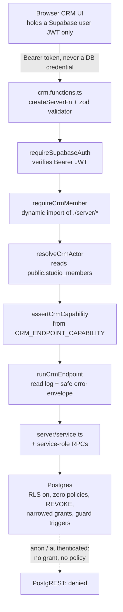

# Forever CRM — Security, Roles and Access Architecture

Task ID: FOREVER-CRM-ARCH-001
Status: Proposed architecture — not approved, not scheduled, not authorized for implementation
Repository state of record: main @ 82e2039270168df1043050204988fbd6c009ed0e
Risk class: R0 (documentation only)

> This document is a design record. It asserts no product truth, changes no active stage, and authorizes no implementation. The active stage remains FOREVER-STUDIO-001 (`docs/CURRENT_STAGE.md`), which lists "large CRM integration" as out of scope. Any implementing task is R2 under the shared-contract rule and requires an Architect-reviewed stage change plus Owner approval.

## What this document decides

1. **Three principals**, not eleven: Owner, Advisor, Booth Host. Sales director and team leader collapse; coordinator, marketing and external partner do not exist and each carries a named trigger.
2. **Six capabilities**, not twenty-six, bound to endpoints by a declarative `Record<CrmEndpointName, CrmCapability>` that the middleware reads and a test asserts is total.
3. **Transport is server functions running as `service_role`.** No `auth.uid()` / `auth.jwt()` RLS, no `FORCE ROW LEVEL SECURITY`, no second identity roster, no second service-role key path.
4. **The compensating control is whole-table grant narrowing plus guard triggers** — the precedent the repository actually proves. Column-level `GRANT UPDATE` is rejected outright: it has zero occurrences repo-wide and it is the mechanism that made merge inexecutable in the pre-review draft.
5. **Six `SECURITY DEFINER` routines repository-wide, in the target.** `crm_merge_person` / `crm_unmerge_person` are DEFINER because they cannot function otherwise; `crm_anonymise_person` / `crm_purge_rejected_enquiries` are INVOKER. Phase 1 adds none.
6. **Slice 1 gates on `actor.role === 'owner'`.** No `crm_role` column exists until Phase 1.
7. **Every CRM read is logged** — actor, endpoint, filter shape, row count, never row contents. There is **no** fail-closed read budget.
8. **`/booth` is the weakest access boundary in the repository** and is the one finding here that is true on `main` today, not a property of a proposal.
9. **`public.leads` never accretes a column.** Its `GRANT INSERT` carries no column list, so any column added later is anonymously writable the instant it exists — no grant statement, no diff, nothing to review. This package adds none; §4.6 turns that from a coincidence into a standing constraint, and §4.7 states why a posture must be observed on the live schema rather than read out of a migration file.

Companion records: `docs/crm/CRM_DOMAIN_MODEL.md` (entities, invariants, migration register), `docs/crm/CRM_PRIVACY_CONSENT_RETENTION.md` (consent, suppression, erasure), `docs/crm/CRM_INTEGRATION_AND_EVENTS.md` (capture path, webhooks), `docs/crm/CRM_IMPLEMENTATION_PLAN.md` (phasing and gates).

---

## 1. Roles and capabilities

### 1.1 The three principals

[Repository fact] The repository's entire authorization vocabulary is two values — `public.studio_members.role CHECK (role IN ('owner', 'trusted_publisher'))` at `supabase/migrations/20260721120000_forever_studio_v1.sql:86` — plus one per-record rule in `assertObjectAccess` (`src/features/forever-studio/server/service.ts:205-211`): owner passes, creator passes, everything else raises one stable `studio_access_denied`.

| Proposed role | Verdict | Where it goes |
|---|---|---|
| Owner | **Exists** | `studio_members.role = 'owner'` — already single-winner at the database |
| Sales director | **Collapsed into Owner** | At ten seats the Owner is the sales director. Its only distinct powers are "see the team's pipeline" (§5.1 gives that to every advisor) and "reassign" (Advisor-allowed, audited) |
| Team leader | **Collapsed into Advisor** | Not enough people to form teams |
| Advisor / Agent / Forever Guide | **Exists — one role** | Three words for one job. `crm_role = 'advisor'` |
| Booth Host | **Exists** | `crm_role = 'booth_host'`. The only thing that makes gating `/booth` (§10) safe on a shared device in a public place |
| CRM coordinator | **Deferred** | Its distinct powers are exactly the irreversible set §1.3 puts on the Owner. Trigger: the Owner delegating `crm.compliance` to a named non-Owner |
| Marketing staff | **Does not exist** | [Repository fact] No outbound messaging path of any kind exists on `main`. A role with no capability is a row in a CHECK constraint. Trigger: a signed gateway contract |
| Studio publisher | **Exists, zero CRM access** | `role = 'trusted_publisher'`, `crm_role = 'none'` — the migration default. Publishing a project has never implied reading a buyer |
| Approved partner / referral | **Rejected** | §1.4. An introducer is a *contact* (`crm_person_role`), not a principal |

Adding a value to a CHECK later is a one-line migration. Handing out an over-broad login now is not reversible.

### 1.2 Six capabilities

[Recommendation] The pre-review draft specified twenty-six capability strings across a 28 × 7 matrix — seventy-eight boolean decisions for a company whose real distinctions are three. Six is the corrected set. The exhaustive closed union and the static assertion test are kept; they are cheap and correct. A capability is split out only when a real delegation request arrives.

Principals: **O** Owner · **A** Advisor · **B** Booth Host · **P** Publisher-only · **S** System (scheduled sweep) · **I** Integration (verified webhook) · **N** Anonymous public web.

| Capability | Covers | O | A | B | P | S | I | N |
|---|---|:-:|:-:|:-:|:-:|:-:|:-:|:-:|
| `crm.intake.capture` | write one enquiry (+ decision profile, from Phase 2) from a capture session | A | A | A | D | A | A | D |
| `crm.read` | read persons, identifiers, enquiries, timeline, tasks, queues | A | A | **D** | D | A | D | D |
| `crm.write` | create/edit person, identifiers, enquiry triage, activities, tasks, assignment | A | A | C¹ | D | C² | C² | D |
| `crm.merge` | merge and unmerge two `crm_person` rows | A | A | D | D | D | D | D |
| `crm.compliance` | record consent, apply and lift suppression, retention holds, DSR, erasure, redaction | A | C³ | C³ | D | D | C³ | D |
| `crm.admin` | set another member's `crm_role`, read `public.audit_log`, bulk export | A | D | D | D | D | D | D |
| *(not a capability)* | insert into `public.leads` — the unchanged public write contract | A | A | A | A | A | A | **A** |
| *(not a capability)* | write any project, developer, location, unit, price or availability fact | **D** | D | D | D | D | D | D |

¹ Booth Host's `crm.write` is exactly one activity — the internal staff note for the session it just captured (`kind='note'`, `visibility='internal'`), written through the capture endpoint. It cannot address an arbitrary `person_id`.
² System and Integration may create a person only as the deterministic consequence of an inbound identifier, never by free-form edit, and always with `actor_kind IN ('system','integration')`.
³ `crm.compliance` is **directional**. Advisor, Booth Host and Integration may *apply* a suppression and *record* a consent event. Lifting a suppression, opening or closing a retention hold, deciding a DSR, redacting an activity and erasing a person are Owner-only. The split is expressed as a second argument to `assertCrmCapability`, not as a seventh capability string.

The last row is not a role rule. It is the `docs/FOREVER_BRAIN_V1.md` §7 must-not-own boundary, enforced structurally: no `crm_*` table has such a column, and `service_role` writes to `projects` / `units` only through the existing ingest and publish RPCs with `field_provenance` stamped.

### 1.3 The organising principle

**Capabilities are gated by reversibility and compliance exposure, never by seniority.**

| Class | Gate | Members |
|---|---|---|
| Reversible and operational | Advisor | stage changes, assignment, merge and unmerge, holds, notes, applying a suppression |
| Irreversible | Owner | erasure, redaction, requirement waiver |
| Compliance-bearing | Owner | suppression lift, retention holds, DSR decisions |
| Money-attributing | Owner | credit reallocation (`crm_opportunity_credit`, Phase 2) |
| Administrative | Owner | granting `crm_role`, reading `audit_log`, bulk export |

Two consequences are counter-intuitive and are therefore stated:

- **Merge is Advisor-allowed**, because `docs/crm/CRM_DOMAIN_MODEL.md` makes merge reversible by construction — per-table survivorship rules, `moved_rows` recording both moves and skipped rows with reasons, and unmerge as a replay. Gating a reversible operation buys nothing and guarantees advisors avoid it, which produces duplicate persons, which degrades every dedupe signal. The control is reversibility plus audit, not a permission. This argument is only valid because the merge routine actually executes; see §4.4.
- **Applying a suppression is Advisor-allowed; lifting is Owner-only.** Asymmetric on purpose. Suppressing is always protective; lifting is the only direction that can cause an unlawful send. [Web research — descriptive only, not legal advice; qualified Thai counsel must confirm] The PDPA s.32(2) direct-marketing objection is absolute with no rebuttal — https://cc.kmutt.ac.th/Files/Act%20Eng/personal-data-protection-act-2019-en.pdf (unofficial English translation; the Thai text governs).

### 1.4 No external partner principal

[Recommendation] An introducing agent, a referring buyer, a partner agency contact and a booth-hire host are all **contacts** — `crm_person` rows flagged with `crm_person_role` — and receive a generated document, never a login. Four reasons, in descending force: every external principal needs a per-record scope and §5.1 deliberately has none, so the first partner login forces either the repository's first `auth.uid()` row-scope or a bespoke scope filter on every endpoint; [Repository fact] there is no self-registration path anywhere, membership being created only by an Owner invite or the one-time DB-enforced bootstrap; denial would leak existence, since a partner-scoped surface must return the same code for "does not exist" and "exists but is not yours" on every endpoint, including list endpoints where a count leaks; and exposing buyer records to a third party is a disclosure with its own lawful-basis and notice consequences, for which `crm_processing_purpose` seeds no purpose. *Descriptive only, not legal advice; qualified Thai counsel required.*

**Trigger to revisit:** a signed partner agreement naming an individual, **and** an Owner decision to disclose buyer data outside the company, **and** a `crm_processing_purpose` row with a stated lawful basis. All three.

### 1.5 Slice 1 has no roles at all

[Recommendation] Slice 1 (`docs/crm/CRM_IMPLEMENTATION_PLAN.md`) adds zero tables, zero migrations and zero columns. Its three read endpoints therefore cannot consult a `crm_role` that does not exist, and `requireStudioMember` alone is **not sufficient**: [Repository fact] `studio_members.role CHECK (role IN ('owner','trusted_publisher'))` means every `trusted_publisher` passes that chain, and Slice 1 renders real buyer names, emails, phones and messages.

**`assertOwner` — every Slice 1 endpoint gates on `actor.role === 'owner'`.** Two lines, no schema change, and an acceptance test mirroring `src/features/forever-studio/tests/authorization.test.ts` asserting a `trusted_publisher` is denied with the same stable code as a missing record. The gate widens to advisors only when `studio_members.crm_role` actually exists — i.e. at Phase 1, behind a stage change.

---

## 2. Central decision A — the roster

[Recommendation] **The CRM reuses `public.studio_members` as its sole roster and adds exactly one column, `crm_role`, in Phase 1.** No sibling table, no widened `role` CHECK, no bag of booleans. The migration is allocated from the package register in `docs/crm/CRM_DOMAIN_MODEL.md`; every CRM migration filename is numbered above `20260728160000` to clear open Draft PRs #117 and #119.

```sql
ALTER TABLE public.studio_members
  ADD COLUMN IF NOT EXISTS crm_role TEXT NOT NULL DEFAULT 'none';

ALTER TABLE public.studio_members
  DROP CONSTRAINT IF EXISTS studio_members_crm_role_valid;
ALTER TABLE public.studio_members
  ADD CONSTRAINT studio_members_crm_role_valid
  CHECK (crm_role IN ('none', 'booth_host', 'advisor'));

-- Posture unchanged, restated so the contract test can pin it on this file.
REVOKE ALL ON TABLE public.studio_members FROM PUBLIC, anon, authenticated;
GRANT ALL ON TABLE public.studio_members TO service_role;
```

Three properties are load-bearing:

- `DEFAULT 'none'` is the fail-closed default, mirroring `studio_object_owners`' documented rule that an absent row is Owner-only, "never granted by omission".
- **Owner capability is deliberately not a `crm_role` value.** `role = 'owner'` implies CRM owner, resolved in one pure function (§3.5). No column edit can lock the Owner out, and "who is the Owner" keeps exactly one answer — the partial unique index `studio_members_single_bootstrap_owner`.
- The `role` CHECK is **not** widened. `role` is single-valued and already means publishing capability; adding `'advisor'` would make a senior advisor who also publishes project pages inexpressible and would assert the unstated negative fact "is not a publisher".

**Why not a sibling roster.** The decisive argument is offboarding: with one roster, `is_active = false` ends access everywhere; with two, access ends in one product while the other keeps working silently. There is also exactly one DB-enforced answer to "who is the Owner", one identity anchor, and one bootstrap surface. At ten seats with no HR process, a stale second roster is the most likely real security failure in this document, and it is prevented for free.

**On Draft PR #102's `can_access_booth` boolean.** [PROVISIONAL — open Draft PR #102, verified absent from `main`; its own body says "Draft — do not merge, do not deploy"] Not adopted, and not wrong: a boolean is correct for a capability genuinely orthogonal to the ladder and wrong for a ladder itself. Six booleans express 64 states, three intended and none of the other 61 prevented by any constraint. v1 has no orthogonal CRM capability, because `booth_host` is a strict subset of `advisor`.

---

## 3. Central decision B — how the CRM reaches its data

### 3.1 The decision

[Recommendation] **Server functions running as `service_role`, behind a mandatory middleware chain. The browser never receives a CRM row it did not ask a server function for, and never holds a credential that can read a CRM table.** No `auth.uid()` RLS is introduced. This is settled on the merits, not by house style — the ground truth names it the single largest unmade architectural decision.

### 3.2 Why not user-JWT PostgREST with `auth.uid()` RLS

The alternative is genuinely attractive: defence in depth, far less endpoint code, Supabase-idiomatic structure, and — the one benefit with no substitute — **Realtime subscriptions**, which respect RLS and would give a live shared board for free. It still loses.

| # | Reason |
|---|---|
| a | **The predicates the CRM needs are not row predicates.** Its rules are transitions and cross-row invariants — a suppression may be lifted only against a referenced consent event; an activity's context row must belong to the same person. None is expressible as `USING (…)`, so you get RLS governing reads and TypeScript governing writes: a seam through the middle of every operation |
| b | **The only useful predicate is unwritable.** `EXISTS (SELECT 1 FROM public.studio_members …)` fails because RLS predicates evaluate with the invoker's privileges and `authenticated` holds `REVOKE ALL` on that table. The fix is a `SECURITY DEFINER` helper any authenticated Supabase user may call, whose whole job is to answer questions about the staff roster. [Repository fact] Four such routines exist in 25 migrations (`20260715120000:1307`, `20260721120000:606`, `20260724090000:939`, `:1132`) |
| c | **Coarse visibility removes the benefit anyway.** §5.1 gives every member every record; a `USING (true)` policy denies nothing, so the marginal safety is one boolean at the cost of a parallel model |
| d | **Column privacy would need a third mechanism.** A table-level `GRANT SELECT` to `authenticated` hands over `crm_person_identifier.raw_value`, `crm_activity.body_text` and `crm_enquiry.raw_*` entirely. [Repository fact] The column-projection idiom's only carrier, `20260723130000_public_projection_privacy.sql`, declares itself intentionally **UNAPPLIED** and its column-less REVOKE strips later column grants if applied out of order |
| e | **Errors and enumeration.** An RLS write failure returns *"new row violates row-level security policy for table crm_person"*, disclosing that the table exists. And a browser holding a PostgREST-capable token can issue `?select=*&limit=100000` — a full export in one request, no cap, no audit row |
| f | **Typed actors become unenforceable.** If the browser writes rows, a client can claim `actor_kind='system'`. Under server functions the actor is derived from the verified JWT. Trivial now, impossible to retrofit once a cron has been writing for months |

**Realtime, honestly.** A real loss. At ten seats a polled server function is adequate. If a live board later earns its complexity, the correct move is Realtime over a purpose-built board projection table holding only board-safe columns, never over `crm_person` or `crm_activity` — a separate decision, foreclosed by nothing here.

### 3.3 What RLS protects, and what it does not

"RLS is enabled" is the sentence most likely to be mistaken for a security guarantee.

| Genuinely protected, absolutely | Why it holds |
|---|---|
| PostgREST reachability | `anon` and `authenticated` cannot read or write any `crm_*` table over REST, ever, whatever the application does |
| A leaked publishable key | Worthless against CRM data — it authenticates as `anon`, which has no grant and no policy |
| Accidental client-side access | `supabase.from("crm_person").select()` in a component fails loudly with a permission error, not silently with data |
| Supabase platform default grants | Neutralised by the explicit `REVOKE`. [Repository fact] `20260721123000_studio_internal_acl_hardening.sql` exists solely because that leak is real |

| Not protected | Because |
|---|---|
| Anything the app server does | `service_role` bypasses RLS. A missing capability check is a total bypass and RLS contributes nothing |
| A compromised `SUPABASE_SERVICE_ROLE_KEY` | Full read and write of every table, including `auth.users` |
| An over-broad endpoint | A person search with no cap and no capability check is a full export that looks like a feature |
| Cross-advisor access | Every advisor sees everything **by design** (§5.1). "RLS protects buyer data from staff" is false here |
| Lead-authored content | `crm_activity.body_text` is untrusted data. RLS has no opinion about injection |
| `/booth` | Today it authenticates nobody (§9). RLS cannot help a surface with no principal |

**The honest claim is narrow: internal-table RLS in Forever defends the network boundary, not the application boundary.** It is necessary, cheap, and applied verbatim to every CRM table — and it is not the control that protects buyer data from a bug.

### 3.4 The controls that carry the weight

| # | Control | Replaces | Survives an app bug? |
|---|---|---|---|
| C1 | **Whole-table narrowed `service_role` grants** on evidence and catalogue tables (§4.2) | RLS as a write gate | **Yes** — Postgres privileges |
| C2 | **Guard triggers** on the irreversible operations (§4.3) | RLS as an integrity gate | **Yes** — runs on every write regardless of caller |
| C3 | Mandatory `requireCrmMember`; no endpoint without it | RLS as an authn gate | No |
| C4 | **Declarative capability binding** + one pure `assertCrmCapability` (§3.5) | per-row policy | No |
| C5 | `public.audit_log` written in-transaction by the RPC for named commercial events (§7) | forensics after a bypass | **Yes** for the RPC path |
| C6 | Per-invocation read logging at `runCrmEndpoint` (§6) | detection of bulk read | No |
| C7 | Bundle-boundary twin (§8) | credential exfiltration | n/a — build time |
| C8 | Migration-contract twin (§10) | posture drift | n/a — build time |
| C9 | Safe error envelope `runCrmEndpoint`; one stable `crm_access_denied` | existence disclosure | No |
| C10 | R2 adversarial review plus Owner approval | everything | n/a — human |

**C1 and C2 follow the repository's own precedent, verbatim.** [Repository fact] `supabase/migrations/20260724090000_studio_large_archive_v1.sql:532-542` enables RLS on `public.studio_archive_entries`, revokes ALL from `PUBLIC`, `anon`, `authenticated` **and from `service_role`**, then grants `service_role` only `SELECT`; its guard trigger `studio_archive_entries_guard` (`:710-711`) runs `BEFORE INSERT OR UPDATE OR DELETE`; and the file's own header (`:90`) records that the application write path is two claim-checked `SECURITY DEFINER` RPCs. **That pairing — narrowed grant *plus* a definer RPC — is the whole precedent.** Copying the REVOKE and dropping the RPCs is what made merge inexecutable in the pre-review draft; §4.4 restores the other half.

The principle: **any rule expressible as a per-write invariant belongs in a trigger or a grant, not in TypeScript** — because TypeScript is exactly what fails in the scenario RLS cannot cover.

### 3.5 The chosen model, concretely



**One deliberate difference from Studio: there is no CRM bootstrap path.** `resolveStudioActor` contains `maybeBootstrapOwner`, matching `STUDIO_OWNER_USER_ID` or a confirmed `STUDIO_OWNER_EMAIL` while the roster is empty. `resolveCrmActor` has no equivalent and must never gain one — the roster is never empty by the time the CRM exists, and a second bootstrap path is a second way to mint a principal. It therefore never reads `claims.email`.

**The capability binding is declarative, not positional.** The pre-review draft asserted only that a handler *begins with* `assertCrmCapability`, which cannot verify the argument: a handler asserting `crm.intake.capture` and then selecting the whole person graph passes that test. One const fixes it, making a wrong pairing a reviewable diff rather than a call site.

```ts
// src/features/forever-crm/core/capabilities.ts — pure, total, I/O-free.
export type CrmLevel = "none" | "booth_host" | "advisor" | "owner";

/** The ONE place the two roster axes combine. Fail-closed on is_active. */
export function resolveCrmLevel(member: {
  role: "owner" | "trusted_publisher";
  crm_role: "none" | "booth_host" | "advisor";
  is_active: boolean;
}): CrmLevel {
  if (!member.is_active) return "none";
  if (member.role === "owner") return "owner";
  return member.crm_role;
}

export const CRM_CAPABILITIES = [
  "crm.intake.capture", "crm.read", "crm.write",
  "crm.merge", "crm.compliance", "crm.admin",
] as const;
export type CrmCapability = (typeof CRM_CAPABILITIES)[number];

/** Every exported endpoint appears here exactly once. The test asserts totality. */
export const CRM_ENDPOINT_CAPABILITY: Record<CrmEndpointName, CrmCapability> = {
  crmCaptureBoothSession: "crm.intake.capture",
  crmListQueue:           "crm.read",
  crmGetPerson:           "crm.read",
  crmLogActivity:         "crm.write",
  crmApplySuppression:    "crm.compliance",
  // …
};
```

`requireCrmMember` reads that map and calls `assertCrmCapability(actor, CRM_ENDPOINT_CAPABILITY[endpoint])` before the handler body runs. Server-side denial throws `CrmAccessError("crm_access_denied")` — **one code for every denial**, matching `assertObjectAccess`'s doctrine that a single stable denial discloses no existence, title, contact or metadata. There is no `crm_owner_required` and no `crm_booth_host_cannot_read`: those messages are an oracle.

The same pure function ships to the browser so the UI can hide buttons. Hiding a button grants and denies nothing — `src/features/forever-studio/studio-auth.ts` states the doctrine verbatim: *"the browser UI is presentation only."*

---

## 4. RLS, grants and functions

### 4.1 The universal posture

Applied verbatim to every CRM table, no exceptions. Identical to the audit_log pattern already used on `studio_members`, `studio_upload_jobs`, `studio_listing_contacts`, `studio_object_owners`, `studio_archives`, `ingestion_warnings`, `ingestion_batches` and `audit_log`.

```sql
ALTER TABLE public.crm_<t> ENABLE ROW LEVEL SECURITY;
-- RLS on, ZERO policies: internal-only (the audit_log pattern). Authorization
-- is enforced at the app-server boundary, never in the browser.
REVOKE ALL ON TABLE public.crm_<t> FROM PUBLIC, anon, authenticated;
```

`CREATE POLICY` appears zero times in every CRM migration. `auth.uid()`, `auth.jwt()`, `auth.role()`, `request.jwt` and `FORCE ROW LEVEL SECURITY` appear zero times; `auth.` appears only as `REFERENCES auth.users(id)`.

### 4.2 Three grant profiles over one unchanged posture

Only the width of the `service_role` grant varies. That variation is not a third posture — it is `20260724090000:541-542` generalised.

**Column-level `GRANT UPDATE (col, col)` is rejected.** [Repository fact] `GRANT UPDATE (` returns zero matches across all 25 migrations; the only column-level grant idiom in the repository is `GRANT SELECT (...)`, in two files, one of which is intentionally UNAPPLIED with a documented ordering hazard. Beyond having no precedent in the direction it was used, it fails silently: a column added by a later migration is ungranted with no compile-time signal, and it was the specific mechanism that denied `UPDATE person_id` to the merge routine. **The replacement is whole-table narrowing plus a guard trigger.** The trigger, not a grant list, is the readable mutability contract, and it runs on every write regardless of caller.

Phase 1's eleven tables, by profile:

| Profile | Phase-1 tables | Grant |
|---|---|---|
| **OPERATIONAL** | `crm_person`, `crm_person_identifier`, `crm_enquiry`, `crm_task` | `GRANT ALL ON TABLE public.crm_<t> TO service_role;` |
| **EVIDENCE** | `crm_activity`, `crm_consent_event`, `crm_suppression` | `REVOKE ALL … FROM service_role;` then a narrowed grant, below |
| **CATALOGUE** | `crm_channel`, `crm_source`, `crm_processing_purpose`, `crm_notice_version` | `REVOKE ALL … FROM service_role;` then `GRANT SELECT`, plus `UPDATE` only where a runtime field genuinely exists |

```sql
-- EVIDENCE. crm_consent_event: pure append. The s.19 burden of proof cannot
-- survive a table the application can UPDATE, and its correction path is an
-- INSERT (action = 'voided' + voids_consent_event_id), so no UPDATE is needed.
REVOKE ALL ON TABLE public.crm_consent_event FROM PUBLIC, anon, authenticated;
REVOKE ALL ON TABLE public.crm_consent_event FROM service_role;
GRANT SELECT, INSERT ON TABLE public.crm_consent_event TO service_role;

-- crm_activity: append-only in Phase 1. Redaction arrives in Phase 2 as
-- whole-table UPDATE + the guard trigger, never as a column grant.
REVOKE ALL ON TABLE public.crm_activity FROM PUBLIC, anon, authenticated;
REVOKE ALL ON TABLE public.crm_activity FROM service_role;
GRANT SELECT, INSERT ON TABLE public.crm_activity TO service_role;

-- crm_suppression: append plus a lift. A row can never be deleted to fake
-- consent. UPDATE is whole-table; crm_suppression_lift_only narrows it.
REVOKE ALL ON TABLE public.crm_suppression FROM PUBLIC, anon, authenticated;
REVOKE ALL ON TABLE public.crm_suppression FROM service_role;
GRANT SELECT, INSERT, UPDATE ON TABLE public.crm_suppression TO service_role;

-- CATALOGUE. crm_channel and crm_processing_purpose have no runtime-mutable
-- field: the purpose register is the lawful-basis proof and the ROPA source.
-- Neither carries a BEFORE UPDATE trigger, because no grant could ever fire one.
REVOKE ALL ON TABLE public.crm_channel FROM PUBLIC, anon, authenticated;
REVOKE ALL ON TABLE public.crm_channel FROM service_role;
GRANT SELECT ON TABLE public.crm_channel TO service_role;

-- crm_source and crm_notice_version do have runtime fields (activation, label,
-- retirement). UPDATE is whole-table; the guard trigger names the columns.
REVOKE ALL ON TABLE public.crm_source FROM PUBLIC, anon, authenticated;
REVOKE ALL ON TABLE public.crm_source FROM service_role;
GRANT SELECT, UPDATE ON TABLE public.crm_source TO service_role;
```

Every CATALOGUE table with a runtime field declares `created_at` / `updated_at` and carries `CREATE TRIGGER trg_<t>_updated_at BEFORE UPDATE … EXECUTE FUNCTION public.set_updated_at()`, reusing the existing helper rather than cloning it. The pre-review draft named an `updated_at` column on tables that did not declare one, which aborts the migration.

Three properties are provable only on a real cluster and are therefore `studio:pg-test` obligations (§12), not assertions here: that `ON DELETE CASCADE` still works with `DELETE` revoked (referential-action triggers are internal and not privilege-checked); that `ON CONFLICT DO NOTHING` needs only `INSERT`, leaving idempotency writes intact while making `DO UPDATE` structurally unavailable on EVIDENCE tables; and that `service_role` cannot re-grant itself, which depends on Supabase's role graph rather than on anything in this repository.

### 4.3 Guard triggers — the Phase-1 set

[Repository fact] The repository contains 27 `CREATE TRIGGER` statements in its entire history. The pre-review draft implied roughly seventy. Phase 1 caps at the guards that protect something irreversible, plus `set_updated_at`:

| Trigger | Table | Protects |
|---|---|---|
| `crm_person_no_delete` | `crm_person` | Unconditional `BEFORE DELETE` raise — stronger than a revoked privilege, because it also blocks the migration-time superuser path |
| `crm_activity_immutable` | `crm_activity` | `BEFORE UPDATE` raise; relaxed to redaction-only when redaction ships |
| `crm_suppression_lift_only` | `crm_suppression` | `BEFORE UPDATE` raise unless the changed columns are exactly `lifted_at`, `lifted_by`, `lifted_evidence_consent_event_id` |
| `crm_enquiry_evidence_frozen` | `crm_enquiry` | Evidence columns (`raw_*`, `source_key`, `received_at`, `external_id`, `capture_mode`) may only ever go to NULL, never to a different value |
| `crm_marketing_send_guard` | `crm_activity` | `BEFORE INSERT` deny of automated outbound whose purpose is not on an explicit non-marketing allow-list, resolving `merged_into_person_id` first — see `docs/crm/CRM_PRIVACY_CONSENT_RETENTION.md` |
| `leads_status_frozen` | `public.leads` | `BEFORE UPDATE` freeze of the public intake mirror |

Each guard function is `plpgsql`, `SET search_path = ''`, fully schema-qualified, no dynamic SQL, with `REVOKE ALL ON FUNCTION … FROM PUBLIC, anon, authenticated`.

### 4.4 Functions and the `SECURITY DEFINER` budget

Every CRM function follows the established idiom: `plpgsql` (or `LANGUAGE sql STABLE` for reads), `SET search_path = ''`, fully schema-qualified, no dynamic SQL, `SECURITY INVOKER` by default, with grants applied by a `DO … FOREACH fn IN ARRAY ARRAY[…]` block.

[Repository fact] Four `SECURITY DEFINER` routines exist today. **The target adds exactly two, taking the repository to six, and the count is pinned by the contract test so any future increase is a deliberate reviewed change.**

| Routine | Security | Reason | Phase |
|---|---|---|---|
| `crm_merge_person(uuid, uuid, jsonb, uuid)` | **DEFINER** | It must repoint `crm_activity.person_id`, `crm_consent_event` and `crm_suppression` rows, which the EVIDENCE profile denies to `service_role`. As INVOKER it aborts partway and orphans consent evidence — and §1.3's argument for delegating merge to Advisors depends on merge actually working | 2 |
| `crm_unmerge_person(uuid, uuid)` | **DEFINER** | Same privileges, in reverse. The replay order is part of the invariant: clear `merged_into_person_id` first, then repoint children, then stamp `unmerged_at` | 2 |
| `crm_anonymise_person(uuid, uuid)` | INVOKER | The stated DEFINER justification was false — every table it touches is OPERATIONAL with `GRANT ALL`. Escalation would have handed an evidence-destroying routine unrevocable `UPDATE`/`DELETE` on `crm_consent_event`, `crm_suppression` and the merge record | 3 |
| `crm_purge_rejected_enquiries(integer)` | INVOKER | Same | 1–2 |
| every other CRM routine | INVOKER | `service_role` already holds the privileges they need; DEFINER would be privilege without purpose | — |

Both DEFINER routines take an explicit `p_actor_user_id UUID NOT NULL`, write their own `audit_log` row in-transaction, and are named in the contract test. **If the erasure path later needs to reach an EVIDENCE table, widen that one table's grant visibly in the migration rather than escalating the whole function.** **Phase 1 introduces zero `SECURITY DEFINER` routines**, because merge is Phase 2; the budget above is the target decision, recorded now so it is not made under pressure later.

### 4.5 `public.leads` — unchanged, and one non-CRM hygiene item

Zero new columns, zero policy changes, zero grant changes. The existing `GRANT INSERT … TO anon, authenticated` and the single `"Anyone can submit a lead"` INSERT policy stay exactly as written. The only additions are the status-freeze trigger and two `COMMENT`s, specified in `docs/crm/CRM_DOMAIN_MODEL.md`. The reason a foreign key from `leads` to `crm_enquiry` is refused is a security reason, not a modelling one: such a column would be **anon-writable through the existing INSERT policy**, and a FK violation is distinguishable from a successful insert — an existence oracle over an internal table. Putting the pointer on the internal side (`crm_enquiry.legacy_lead_id`, no FK) removes the class entirely.

The existence oracle is one half of a larger finding reached from the other direction. The grant that makes such a column writable carries **no column list**, so *any* column ever added to `leads` becomes anonymously writable with no `GRANT` statement executed and nothing visible in the diff. §4.6 records that as a standing constraint on a table this package deliberately does not touch.

[Repository fact — new finding] `public.audit_log` (`20260707100000_fdb001_core_extensions_sources_audit.sql:119-140`) is created with `GRANT ALL … TO service_role` and `ENABLE ROW LEVEL SECURITY` but **no `REVOKE ALL … FROM PUBLIC, anon, authenticated`**; the same gap exists on `public.ingestion_warnings` and `public.ingestion_batches`, and `20260721123000_studio_internal_acl_hardening.sql` covered only the three Studio tables. RLS-on-zero-policies denies every command to `anon` and `authenticated` today, so this is idiom consistency, not an open data path. **It ships as a standalone R2 hygiene PR, not inside any CRM slice** — bundling it into Slice 1 would put a migration into a slice whose defining property is that it has none.

### 4.6 The column-widening privilege hole on `public.leads`

This package changes nothing on `leads` (§4.5), so nothing below is remediation work, and nothing below is an open data path on `main` today: the table's twelve columns are all intake columns, and the anonymous write surface is exactly them. This is a **latent** hazard that opens the moment a thirteenth column is added. It is recorded because the property that keeps the current position safe is a *construction*, and a construction is a decision a later contributor can reverse in one line without noticing — with no grant statement and no diff to notice it by.

**The verified fact.** [Repository fact] `supabase/migrations/20260704132000_create_leads.sql` is 46 lines. RLS is enabled at line 27, `GRANT ALL … TO service_role` is line 30, the single INSERT policy occupies lines 32–41, and line 29 is, verbatim:

```sql
GRANT INSERT ON public.leads TO anon, authenticated;
```

That grant carries **no column list**, and it is held by two roles — `anon` **and** `authenticated`. The policy's `WITH CHECK` constrains exactly four things (`status = 'new'` plus non-emptiness of `name`, `email`, `phone`) and names no other column. [Repository fact] The privilege is reachable from an untrusted client: `src/lib/lead-service.ts:92` executes `await supabase.from("leads").insert(payload)` **in the browser**, against PostgREST, under the publishable anon key. There is no server-side write path for leads today.

**The PostgreSQL semantics that make this a hole.**

| # | Mechanism | Consequence for `public.leads` |
|---|---|---|
| M1 | Table-level ACLs live in `pg_class.relacl`; column-level ACLs live separately in `pg_attribute.attacl`. A table-level grant is one entry on the *relation*, not an enumeration over the columns that existed when it was written | Line 29 is a fact about the relation. It does not encode the twelve columns of 2026-07-04 |
| M2 | A table-level privilege applies to every column, **including columns added later by `ALTER TABLE … ADD COLUMN`**. `ADD COLUMN` creates no column ACL and needs none — the relation entry already covers the new attribute | The instant a column is added, `anon` and `authenticated` may write it. No grant statement runs, no privilege syntax appears, no diff shows anything |
| M3 | RLS `WITH CHECK` is a row predicate, not a column allow-list. A column the predicate does not mention is unconstrained, not forbidden | The shipped policy is silent on every future column, so it constrains none of them |
| M4 | PostgREST accepts arbitrary column names in an insert body; the caller need not be the application's own payload builder | The write surface is every column the role holds `INSERT` on. Because the anon key ships in the browser bundle, the caller is anyone |
| M5 | `REVOKE` removes only grants made by the current role or by roles it can act for. A `REVOKE` issued by a non-grantor succeeds syntactically and removes nothing | A remediation `REVOKE` cannot be assumed effective. It must be observed |

[Web research] M1–M3, M5: <https://www.postgresql.org/docs/current/ddl-priv.html>, <https://www.postgresql.org/docs/current/sql-grant.html>, <https://www.postgresql.org/docs/current/sql-revoke.html>, <https://www.postgresql.org/docs/current/sql-altertable.html>. M4: <https://postgrest.org/en/stable/references/api/tables_views.html>.

**Why "we added no new `GRANT`" is not evidence.** [Inference] "No new grant" is a statement about the *text of a migration*. The security question is a statement about the *state of a database*. M2 is precisely where the two come apart, because privilege expansion becomes a silent side effect of a DDL statement containing no privilege syntax at all.

| Test | What it measures | Verdict |
|---|---|---|
| "The migration adds no `GRANT` statement" | Diff surface | **Insufficient** — true of every column-widening migration, including a hostile one |
| "The RLS policy is unchanged" | Diff surface | **Insufficient** — an unchanged predicate silently fails to constrain a column that did not exist when it was written |
| "The application's payload omits the new column" | Client behaviour | **Irrelevant** — M4: the attacker is not the application |
| **"What can `anon` write after this migration that it could not write before?"** | Database state | **The correct test.** Answerable only by probing privileges, never by reading a diff |

[Recommendation] A migration that adds columns to `leads` and calls itself "purely additive" is mislabelled: it is **additive columns plus an unstated privilege widening**. Whether the widening is then closed decides whether the honest label is "additive columns + privilege tightening" or "additive columns + privilege regression". One of the two must be written down.

**What the exposure would be.** [Inference] The severity is not that an anonymous caller can write *a* column; it is *which* columns a CRM would want on an intake row. Every candidate is a field whose entire value comes from it being server-asserted. These are the field classes `anon` must never be able to write:

| Class | Fields a CRM would want here | Why anonymous write destroys it |
|---|---|---|
| **Linkage** | a `contact_id`-style pointer to an internal person record | An anonymous caller attaches an authored enquiry to a real buyer's identity. If the column carries a FK it is also an existence oracle — a rejected insert distinguishes a valid internal id from an invalid one (§4.5) |
| **Provenance / lawful basis** | a tier or channel asserting *how* the row was collected | The row's own claim about its lawful basis becomes caller-controlled. A forged value is worse than a missing one, because it is believed |
| **Assignment** | assignee, claim state, queue position | An outsider assigns work inside the company |
| **Ownership / attribution** | originating owner, credit, source attribution | An outsider writes into a commercial credit record — the one record §1.3 puts behind the Owner |
| **Workflow** | stage, next action, timestamps, response markers | An outsider fabricates the operational history the funnel and response-time reporting read from |
| **Free-form** | any `JSONB` metadata column | Unbounded attacker-controlled storage in a table with no size ceiling |

**What a correct extension would have to do.** [Recommendation] If a future proposal — not this one — adds any column to `public.leads`, its migration performs all four of the following, in one file, in this order.

**(a) Revoke the table-level privilege before granting anything back.**

```sql
REVOKE INSERT ON public.leads FROM anon, authenticated;
```

Ordering is not cosmetic. Revoke-then-grant fails closed if the file is interrupted or applied non-transactionally; grant-then-revoke opens a window in which both privileges exist and then removes both.

**(b) Re-grant `INSERT` column-scoped, over the intake columns only.**

```sql
GRANT INSERT (name, email, phone, country, budget, interest,
              project_slug, message, status, source)
  ON public.leads TO anon, authenticated;
```

[Repository fact] This idiom is the repository's own, not an import: `20260723130000_public_projection_privacy.sql:19-29` runs `REVOKE SELECT ON TABLE public.projects FROM anon, authenticated;` followed by a column-enumerated `GRANT SELECT (…)`, and repeats the pattern for `developers`, `units`, `project_media`, `investment_data` and `unit_price_history`. Its own header declares it intentionally UNAPPLIED and its column-less `REVOKE` is an ordering hazard (§3.2 d) — the idiom is precedent, that file's applied state is not.

**(c) State honestly whether the re-grant preserves or narrows.** [Repository fact] `public.leads` has twelve columns: `id`, `created_at`, `name`, `email`, `phone`, `country`, `budget`, `interest`, `project_slug`, `message`, `status`, `source`. The ten-column re-grant above omits `id` and `created_at` and therefore **narrows** — today, under line 29, `anon` can supply its own primary key and its own `created_at`, overriding both defaults. Narrowing is the right choice, but the migration must not simultaneously claim that net anonymous capability is unchanged. Both cannot be true; pick one and write it down.

**(d) Restate the constraint in the policy as an independent backstop.** PostgreSQL has no `ALTER POLICY … ADD` for a `WITH CHECK` clause, so extending one means `DROP POLICY` + `CREATE POLICY` — the repository's own normalisation rule, recorded in `docs/crm/CRM_CURRENT_STATE_AUDIT.md` with the reason that a policy's post-migration state must be **exact, not merely present**. The replacement carries the original four conjuncts **verbatim** from `20260704132000_create_leads.sql:32-41`, plus one conjunct per new column requiring it to be absent or empty. The grant is the control; the predicate is the second, independent control, so a later migration that carelessly re-grants table-level `INSERT` still fails closed instead of silently reopening the hole.

[Recommendation] Column-level `GRANT INSERT` is a different statement from column-level `GRANT UPDATE`. §4.2 rejects the `GRANT UPDATE (` idiom outright and §12 pins `Zero occurrences of GRANT UPDATE (` as a greppable assertion. Nothing here proposes, requires or permits a column-level `GRANT UPDATE` on any table.

**How it must be PROVEN, not asserted.** [Inference] Text-pinning cannot reach this defect, because the defect is the *absence* of a statement rather than the presence of one. A contract test greps files; this must execute against a real PostgreSQL instance. [Repository fact] The repository has exactly one such harness — `npm run studio:pg-test` → `scripts/studio/run-postgres-tests.mjs` (`package.json:20`) — and no CI, so a result from it is an observation a named person made on a named date, never a gate that passed.

| Probe | Expected | What it catches |
|---|---|---|
| `has_column_privilege('anon','public.leads','<new_column>','INSERT')` | `false` | The core assertion. It is the right probe **because it returns true when the privilege is held at either the column level or the whole-table level** (<https://www.postgresql.org/docs/current/functions-info.html>), so it detects the silent table-level inheritance a column-ACL inspection would miss |
| `has_column_privilege('anon','public.leads','name','INSERT')` | `true` | That the tightening did not break the live public intake path |
| `has_table_privilege('anon','public.leads','INSERT')` | `false` | That the table-level grant is genuinely gone. True only when held for the whole table, so it distinguishes "revoked and re-granted narrowly" from "never revoked" — and it is the check that catches M5 |
| All three, repeated for role `authenticated` | identical | Line 29 grants to two roles; a test checking only `anon` proves half the statement |
| `pg_attribute.attacl` for the new column; `pg_class.relacl` for `public.leads` | column ACL names only the intended roles; relation ACL no longer carries `a` for `anon`/`authenticated` | Distinguishes the two ACL levels directly. **Not sufficient alone** — before remediation the new column's `attacl` is `NULL` while `anon` can still write it, which is exactly why the `has_column_privilege` probe leads and this one corroborates |
| Behavioural: as `anon`, insert the current production payload | succeeds | The live path is unbroken |
| Behavioural: as `anon`, insert setting the new column | fails, *permission denied* | End-to-end proof independent of catalogue introspection |
| Behavioural: as `anon`, insert with the policy backstop as the only barrier (grant temporarily broad inside a rolled-back transaction) | fails on the policy | Proves control (d) works independently of control (b) |
| `*-migration-contract.test.ts` twin pinning the resulting policy text | the original four conjuncts verbatim, plus the new ones | Pins that a later edit cannot loosen the predicate unnoticed |

**The standing constraint.** [Recommendation] Recorded as a rule, not as scheduled work:

1. `public.leads` is the intake log. It never accretes CRM state — no linkage, no provenance, no assignment, no ownership, no attribution, no workflow column. The one-directional `crm_enquiry.legacy_lead_id` pointer exists so that no such column is ever needed.
2. Any proposal to add **any** column to `public.leads` is a **privilege change**, is reviewed as one, and carries (a)–(d) and the probe table in the same migration. A proposal that omits them is rejected on that ground alone.
3. Neither structural control that makes this safe today — the one-way pointer with no FK, and the zero-column rule — may be relaxed without re-running this analysis.
4. The reverse direction is equally constrained. Reverting a tightening restores the table-level grant and reopens the hole for **every column added since**, so such a revert is never performed alone — only together with dropping the columns it protected.

### 4.7 A security boundary is verified against the live schema, never inferred from the migration file

[Repository fact] Several committed migrations declare themselves unapplied, and `docs/crm/CRM_IMPLEMENTATION_PLAN.md` already makes live ACL and ledger reconciliation a prerequisite task on that basis. This section states the security consequence, which is stronger than the planning one.

| # | Statement | Label |
|---|---|---|
| V1 | A `.sql` file under `supabase/migrations/` is a statement about a file, not about a running Postgres instance. The migration set is the design of record; it is not proof of live state | [Recommendation] |
| V2 | `supabase db push` applies pending migrations **in version order**, and the CLI ledger keys on the leading `YYYYMMDDHHMMSS` prefix, not on file content. Applying any one migration therefore necessarily applies **the entire pending backlog before it**, in one operation. [Repository fact] Nothing in this repository alters that: `supabase/config.toml` contains exactly one line, `project_id = "abtvsrcnfwlbawvrjeed"` | [Inference from the CLI's ordering, over a verified-empty local configuration] |
| V3 | Consequently **merge is not apply**. A CRM migration may merge to `main` while the backlog is unresolved; it may not be applied until that backlog is understood and cleared by its own owners, as a separately reviewed operation. Anyone describing the first CRM apply as "one migration" has not read the ledger | [Recommendation] |
| V4 | The size of the pending backlog is **not a documentable constant**. It is re-derived at apply time from a live read of `supabase_migrations.schema_migrations` diffed against `supabase/migrations/`. A row in the ledger with no matching file, or a file with no row, is a stop condition. Any count written into a document is stale the moment another migration lands | [Recommendation] |
| V5 | **The security consequence.** For any security-bearing migration — every RLS, `REVOKE`, `GRANT`, guard-trigger and `SECURITY DEFINER` statement in this package — the posture that is actually in force is the posture *observed on the live schema*, not the posture *read from the file*. A boundary inferred from migration text is an assumption, and §4.6 M2 is the proof that the two can differ without any diff at all | [Recommendation] |

**This is the same standard the repository already applies one level down.** [Repository fact] Policies are mutated by DROP-then-CREATE rather than by a `CREATE POLICY IF NOT EXISTS` guard, for the recorded reason that *a policy's post-migration state must be exact, not merely present* (`docs/crm/CRM_CURRENT_STATE_AUDIT.md`). V5 is that rule raised from the statement to the boundary: exactness of a policy's text is worth nothing if the file carrying it was never applied, was applied out of order behind an unapplied `REVOKE`, or was applied to a database that has since diverged. **Exact text, then observed state — both, or neither counts.**

Two operational corollaries follow and belong here rather than in the plan, because both are security failures rather than scheduling ones:

- **`--include-all` is never used to get past an out-of-order error.** It applies files *below* the recorded high-water mark, which can land a constraint relaxation or a destructive statement *after* objects created assuming the stricter contract. Reaching for it is a leading indicator that the ordering guarantee is about to be defeated rather than satisfied.
- **A database holding a back-dated or frozen migration is not a valid target for developing or verifying a CRM security migration.** The environment must have the full `main` backlog applied in version order first, or the posture it demonstrates is not the posture production will get.

---

## 5. Visibility, assignment, Owner boundaries and notes

### 5.1 Visibility: coarse, additive, most-permissive-wins

[Recommendation] **Every active member with `crm_role IN ('booth_host','advisor')` or `role = 'owner'` sees every CRM record their capability set allows. There is no per-record visibility group, no team scope, no sharing matrix, and no `is_private` flag anywhere in the schema.** Rejected: Pipedrive-style visibility groups, actively harmful when a booth host's walk-in must be instantly visible to the advisor who will work it; and the Salesforce sharing stack, the tell being that the vendor ships a troubleshooting guide for its own permission system. The additive trap is handled by `DEFAULT 'none'`: the default sits at the floor and every grant moves upward, so no grant silently no-ops.

**The one exception, and the only row-scope in the design: `booth_host` reads nothing.** It is not a narrower view of the buyer database; it is a write-only capability. Its endpoint accepts a capture payload and returns `{ enquiryId, capturedAt }` — never a `person_id`, never a list, never a search. This is enforceable precisely because it needs no predicate: the endpoint has no read path. Where `docs/crm/CRM_JOURNEYS_AND_STATE_MACHINES.md` previously had the same RPC return `person_id` and an entry stage, **this section is normative** — returning a person id would turn a write-only principal into a read oracle and silently bind a walk-in guest's session onto an existing buyer's record. A booth capture whose canonicalised identifier resolves to an existing live person lands at `crm_enquiry(triage_state='unprocessed', person_id = NULL)` for human triage, and the receipt does not reveal which branch was taken.

### 5.2 Assignment

`crm_person.relationship_owner_user_id` (who owns the relationship) and, from Phase 2, `crm_opportunity.owner_user_id` (who owns this process). Both are Advisor-writable and audited. Reassignment is an observability problem, not a permission problem: every change writes `crm_activity(kind='assignment', actor_kind='member', actor_user_id=…)` and an `audit_log` row. Preventing it would push advisors into creating duplicate records instead. Ownership is never inferred and never granted by omission — a NULL owner is unowned and appears in the coverage checks, exactly as `studio_object_owners` treats an absent row. **Commission attribution is separate and Owner-only**: credit is the commercially disputable record, `owner_user_id` is an operational pointer, and conflating them would make every routine reassignment a money event. That line is what eliminates the team-leader tier.

Staff foreign keys follow the full repository idiom, not half of it. [Repository fact, verified at `20260721120000:121-128`] `created_by` is nullable with `ON DELETE SET NULL` *and* a retained creator email and role snapshot, "so deleting an auth account never erases job history." CRM copies both halves: `crm_activity.actor_email` alongside `actor_user_id`, with the actor CHECK relaxed to accept either. **Offboarding is `studio_members.is_active = false`, never an `auth.users` delete.**

### 5.3 Owner access boundaries, stated honestly

The Owner can read and write everything. That is true today via `service_role` and cannot be changed by any control in this document, because the Owner holds and rotates `SUPABASE_SERVICE_ROLE_KEY`. Pretending otherwise would be theatre. The boundary is therefore **observability, not restriction**: every erasure, redaction, unmerge, suppression lift, `crm_role` grant and export writes an `audit_log` row with `old_values` and `new_values` populated, and no CRM endpoint deletes an audit row.

**Residual, accepted and named:** an Owner with direct database access can delete audit rows. The trail is evidence and a deterrent for the Owner, and a control for everyone else. Closing it would require shipping audit rows off-platform, for which the runtime has no seam — [Repository fact] `wrangler.jsonc` declares no queues, no R2 buckets and no declared egress.

### 5.4 Private notes do not exist

[Recommendation] **There is no note visible to its author and hidden from colleagues.** `crm_activity.visibility` has exactly two values: `internal` means "not shown to the buyer in any client-facing artifact" — not "hidden from colleagues" — and `client_visible` means "may appear in a buyer-facing document" — not "public".

1. **Coordination cost exceeds leakage benefit at ten seats.** A hidden note is a fact the next person to touch the buyer does not have.
2. **It would be unenforceable under the chosen transport.** Every read runs as `service_role`. "Private" would be a `WHERE author_id = $1` in one endpoint, defeated by any other endpoint that selects the timeline, and by any export. A control that one forgotten `SELECT *` defeats is a UI lie.
3. **It creates a false expectation against a real duty.** A note about a data subject is that data subject's personal data whatever a UI flag says, and is disclosable under an access request. Marking it "private" tells the advisor the opposite of the truth at exactly the moment they are deciding what to write. *Descriptive only, not legal advice; qualified Thai counsel required.*
4. **The real defect it is confused with is fixed elsewhere.** [Repository fact] Today the booth's internal staff note is concatenated into `leads.message` (`src/features/navigator/core/lead.ts:107-111`) with no boundary, so an internal note sits in the same column as guest-authored content, written from the browser under the anon key. `visibility='internal'` on a `crm_activity` row is that fix — a *buyer-facing* boundary, which is the one that was actually missing.

Three controls replace privacy: Owner-only redaction (`body_text → NULL`, `redacted_at` stamped, the row survives); the `internal` / `client_visible` boundary enforced at every client-facing artifact; and a written rule surfaced at the point of writing — notes are visible to every colleague and disclosable to the buyer. [Owner requirement] That last is a behavioural control and is recorded as one.

---

## 6. Read logging

[Recommendation] Every member reads every record (§5.1) and, in the pre-review draft, no read was recorded anywhere — the stated control for bulk read was "capped list endpoints". A phished session or an escalated booth tablet could page the entire buyer database indistinguishably from normal use.

**One `public.audit_log` row per list, search or detail invocation, written at the `runCrmEndpoint` wrapper**, which already wraps every call. The row carries:

| Recorded | Never recorded |
|---|---|
| `actor_id`, `actor_email` | Any row content |
| endpoint name | Any name, email, phone, message or note |
| **filter shape** — which filter keys were supplied, not their values | Filter values |
| **row count returned** | Row identifiers, except for a single-record detail read |

Anomalies surface on the operations panel next to the coverage checks (`docs/crm/CRM_ANALYTICS_AND_KPI.md`). Because the wrapper is the single choke point, a new endpoint is logged by construction rather than by remembering.

**There is no fail-closed per-actor read budget, deliberately.** At ten seats the realistic effect of a read cap is that an advisor working a three-day expo is locked out of the record for the buyer standing in front of them — a failure mode worse than the threat it mitigates, and a control that will be disabled within a week, taking the logging with it. The residual — an authorised advisor paging the database, or copying it by screenshot — is named in the threat model (§11, T13 and T24) and accepted, not solved.

---

## 7. Audit

[Repository fact] Three defects are present on `main`: there is **no audit trigger anywhere**; `old_values` and `new_values` exist and are **never populated** by any code path; and `recordAuditSafely` (`src/features/forever-studio/server/service.ts:712-718`) **swallows every failure** post-commit. The third is correct for a publishing action and inadequate as commission-dispute evidence.

`crm_record_history` is **cut permanently.** The reuse map already directs reusing `public.audit_log` with `crm_*` action values and populated `old_values` / `new_values`; a second history table was churn, and it was simultaneously the holder of un-erasable JSONB copies of every buyer's name — the worst offender in the erasure analysis.

**One tier, written where it counts.** A `public.audit_log` row per named commercial event, written **inside the same transaction** as the change by the plpgsql RPC that performs it — not by TypeScript, not post-commit, not swallowed. If the audit insert fails, the transaction rolls back and the operation did not happen. The named set: `crm.person.merge` / `crm.person.unmerge` (by `crm_merge_person` / `crm_unmerge_person`), `crm.person.erase` (`crm_anonymise_person`), `crm.suppression.apply` / `crm.suppression.lift`, `crm.activity.redact`, `crm.member.crm_role_change`, and `crm.read` from `runCrmEndpoint` (§6).

`recordAuditSafely` is **not** removed; it stays for low-stakes telemetry. The rule is explicit: **if the audit row is evidence, the RPC writes it; if it is telemetry, it may be written safely.**

**Actor propagation.** `docs/crm/CRM_DOMAIN_MODEL.md` flags the transaction-local GUC (`set_config('forever.actor_user_id', …, true)` read by a trigger) as an [Unverified assumption] pending confirmation that the Supabase connection pooler preserves it. [Recommendation] Take the stated fallback as the default: **every evidence-writing RPC takes `p_actor_user_id UUID NOT NULL` and writes its own row.** That depends on nothing unverified. Actor is never client-supplied; it is derived from the verified JWT in `resolveCrmActor` and passed down.

---

## 8. Service-role boundary and the bundle-boundary twin

The conventions are the repository's, restated as they apply to CRM files. `src/integrations/supabase/client.server.ts` is the **only** service-role entry point (its own header), and exactly one CRM module may import it — `src/features/forever-crm/server/deps.server.ts`, mirroring the Studio equivalent. Client-reachable modules reach `server/*` only through `await import()` inside a `.server()` or `.handler()` callback (`studio-auth.ts:21-23`; the 17 proven Studio endpoints). The `server-only` package is banned by `eslint.config.js:25-33`; the convention is the `*.server.ts` suffix. A top-level import of `client.server` never appears in a route file or a `*.functions.ts`, because those ship to the browser bundle.

[Recommendation] Create `src/features/forever-crm/tests/bundle-boundary.test.ts` rather than extending Studio's `CLIENT_REACHABLE` array — Studio's file is Studio-scoped by its own docblock and several of its assertions are about a different feature. The twin carries Studio's four prohibitions verbatim (`client.server`, `./server/*`, `SUPABASE_SERVICE_ROLE_KEY`, `supabaseAdmin`) plus four CRM-specific ones:

1. No client-reachable module may contain `.from(` or `.rpc(` with a **non-literal** argument, nor any literal beginning `crm_`. This compiles §3.1's transport decision into a mechanical check, so it cannot erode one convenient component at a time. Restricting the assertion to literal table names, as the pre-review draft did, is defeated by a variable.
2. A test **fails when a CRM component file is absent from `CLIENT_REACHABLE`**, so the list cannot silently fall behind the directory.
3. No CRM secret name appears in any client-reachable module. `CRM_SECRET_NAMES` lives in a `*.server.ts` module the test imports from there — **not** in `crm-types.ts`, which is client-reachable and would ship the enumeration of every server secret into the browser bundle, placing the oracle inside the artefact it protects.
4. `src/lib/lead-service.ts` never references a `crm_` table from the browser. Moving the public lead write behind a server function changes its line 92 and requires a deliberate update to `src/lib/lead-demo-mode-bundle-boundary.test.ts`, which pins the current call shape and asserts exactly one `from("leads")` call site — a deliberate test change in the same PR, with the `validateLead` / `hasLeadValidationErrors` / `LeadFormValues` contract left byte-stable.

---

## 9. Webhooks and secrets — target design, not a Phase-1 build

**No inbound webhook endpoint is proposed for construction.** [Repository fact] No provider exists, and it would be the repository's first unauthenticated route on a Worker whose deployment is unverified (`docs/CURRENT_STAGE.md` records rollout as BLOCKED under Cloudflare verdict E). The design below applies when a messaging gateway is bought, and not before. See `docs/crm/CRM_INTEGRATION_AND_EVENTS.md`.

**Per-provider route files. No wildcard `$provider`.** A wildcard route with no allow-list has no defined behaviour for an unknown provider or an absent secret, and the natural implementation derives a valid HMAC key from the literal string `"undefined"` — which anyone can compute. If a single route is kept, `$provider` resolves against a frozen const map and returns 404 **before** reading the body or touching `crypto`. **Assert at module load that every configured provider has a non-empty secret, and throw at startup otherwise.** A fail-open default is invisible in testing precisely because the happy path with a real provider works.

| Rule | Why |
|---|---|
| Verify over the **raw body bytes**, read once, before any `JSON.parse`; cap the body; reject before parse | A re-serialised body produces a different HMAC and never matches — the most common implementation bug. An unverified payload must never reach a parser, a validator or a log line |
| Use `crypto.subtle.verify`, never `===` on hex | Early-exit string comparison leaks the signature byte by byte. Node's `timingSafeEqual` is not reliably available on Workers |
| Missing, short or non-hex header rejects with the same code as a wrong signature; respond `401` with an **empty body** | No branch behaves differently for malformed versus wrong, and nothing echoes the payload, the expected signature or a reason |
| The `GET` verification handshake compares its token constant-time and uses a **different secret** from the app secret | A leaked verify token must not forge messages |
| Idempotency by `(channel, external_id)` partial unique plus `ON CONFLICT DO NOTHING`; zero rows means "already seen", never an error. Order the timeline by the provider's `occurred_at` | Providers retry by design and delivery order is not guaranteed |
| The webhook principal holds capability set **I** only (§1.2) | It may append and suppress; it may not read the person graph or lift a suppression |

**Secrets.** [Repository fact] `wrangler.jsonc` declares no `vars` — only `name` and `triggers.crons` — and its header states "nothing in this repository deploys it". There is no declared mechanism in the repository for delivering any secret to the deployed Worker.

1. CRM secrets are Cloudflare Secrets, never `vars`: `wrangler.jsonc` is committed plaintext.
2. **No CRM secret name may begin with `VITE_`.** Vite inlines `VITE_*` into the client bundle by design. The contract test asserts it. Secret **names** are declared once, in a `*.server.ts` module, so the tests have something to enumerate; `.env.example` gains commented-out entries.
3. Rotation is a deploy, not a user event, because no browser ever holds a CRM credential — a direct benefit of §3.1.
4. The four required environment scopes remain unverified in production. No claim is made here that they are satisfied.

---

## 10. The `/booth` exposure

**This is the only finding in this document that is true on `main` today rather than a property of a proposal.**

[Repository fact] `src/routes/booth.tsx` is 37 lines. It has **no `beforeLoad`, no `loader`, no session check, no membership check**. Its only security-adjacent content is `{ name: "robots", content: "noindex, nofollow" }`. Its own docblock calls it "the Forever employee tablet workflow" and says it is "staff-only".

Five facts compound it:

1. **`robots.txt` does not disallow it.** [Repository fact] `buildRobotsTxt` (`src/lib/sitemap.ts:61-64`) emits exactly `User-agent: *`, `Allow: /` and a `Sitemap:` line. The only signal is the per-page meta tag, which binds compliant crawlers and binds no human, no scraper and nobody who receives the URL in a message.
2. **`/studio` shows the pattern this route does not use** — it gates on `useStudioSession()` and renders a login when signed out.
3. **The booth is the richest intent source in the product**, producing the full NAV-001 answer set — exactly the data the CRM exists to keep.
4. **The internal staff note is in the guest-content blob** (`src/features/navigator/core/lead.ts:107-111`), submitted from the browser under the anon key with no visibility boundary.
5. **The tablet leaks between guests.** `deserializeSession` (`src/features/navigator/core/session.ts:214`) accepts any structurally plausible payload with no version and no staleness check, and the session is rehydrated unconditionally. On a shared walk-in tablet, guest B can be shown guest A's answers.

**The rule that follows: no CRM data may be reachable from `/booth` until B-1 and B-2 exist.** This is a prerequisite, not a nicety — any CRM surface reachable from this shell inherits its absent access control.

| # | Control | Kind | Blocking? |
|---|---|---|---|
| **B-1** | The booth capture write goes through `crmCaptureBoothSession`, a server function behind `requireCrmMember` requiring `crm.intake.capture` | **The actual control** | **Yes** |
| **B-2** | The booth endpoint has **no read path**: it accepts a payload and returns `{ enquiryId, capturedAt }`, never a `person_id`, never a list, never a search | **The actual control** | **Yes** |
| B-3 | `beforeLoad` on `src/routes/booth.tsx` mirroring `/studio`'s gate | Presentation | Yes (UX) |
| B-4 | The capture session id is **server-issued**. A client-generated id is not identity. (Harvested as a requirement from Draft PR #102, not built on that branch) | Integrity | Yes |
| B-5 | The local session becomes a **versioned, expiring, outcome-gated** draft buffer, cleared on capture, on reset and on expiry | Confidentiality | Yes |
| B-6 | A **short server-expiring booth session** bound to the capture session id, with re-auth per guest; `capture_channel='booth_tablet'` requires a non-null `actor_user_id` | Confidentiality | Yes |
| B-7 | The staff note leaves `leads.message` and becomes `crm_activity(kind='note', visibility='internal')` | Boundary | Yes |
| B-8 | `robots.txt` gains `Disallow: /booth` and `Disallow: /studio` | Hygiene | No |
| B-9 | [Owner requirement] Kiosk mode, screen lock and auto-logout on the physical tablet | Device | Out of software scope |

**B-3 is not the control, and saying so matters.** A TanStack `beforeLoad` runs in the browser; it hides a shell. The control is B-1 — the write requires a verified JWT plus an active roster row with `crm.intake.capture` — and B-2, that there is nothing to read even if the shell is reached.

Note what B-1 does **not** change: `public.leads` keeps its anonymous INSERT policy and the public web form keeps working exactly as it does. Booth capture becomes authenticated; public enquiry does not. Those are different surfaces with different principals, and conflating them would break the one public write contract the website depends on.

**A CSP is specified for every `/crm` and `/booth` route** — `img-src 'self' data:`, `connect-src 'self' <supabase origin>`, no inline handlers, `referrer-policy: no-referrer` — pinned by a route test. The plain-text rendering rule for untrusted columns is stated once, against a named column list, in `docs/crm/CRM_UX_INFORMATION_ARCHITECTURE.md`.

---

## 11. Threat model

Likelihood and impact are qualitative security judgements about this design. They are not measurements, are never rendered to a user, and are never persisted in any column.

| # | Threat | Likelihood | Impact | Control | Enforced where |
|---|---|---|---|---|---|
| T1 | `anon`/`authenticated` reads or writes a CRM table over PostgREST | Low with the posture; Certain without it | Critical | RLS on, zero policies, explicit `REVOKE` | Migration §4.1 |
| T2 | Supabase platform defaults silently grant `anon`/`authenticated` on a new CRM table | Medium | Critical | The explicit `REVOKE` is mandatory on every table; the contract test **discovers** tables by regex (§12) | Migration + contract test |
| T3 | A CRM server function is bound to the wrong capability, or to none | **High — the single most likely real failure** | High | `CRM_ENDPOINT_CAPABILITY` read by the middleware; test asserts totality over the exported set | §3.5 + `crm-authorization.test.ts` |
| T4 | A client-reachable module imports `client.server`; the service key ships to browsers | Medium | Critical | Bundle-boundary twin; ESLint; the `*.server.ts` convention | §8 |
| T5 | A stranger uses the ungated `/booth` shell | **High today** | High | B-1, B-2 | §10 |
| T6 | Guest B is shown guest A's answers on the booth tablet | High | Medium | B-5, B-6 | §10 |
| T7 | A departing advisor retains access through a forgotten second roster | Medium | High | One roster; `is_active` soft-deny; no sibling table | §2 |
| T8 | An application bug rewrites or deletes consent evidence | Medium | **Critical** — s.19 burden of proof | Whole-table narrowing: `service_role` holds no `UPDATE` or `DELETE` on `crm_consent_event` | Postgres privileges §4.2 |
| T9 | An application bug silently edits a timeline, or a runtime write invents a lead source | Medium | High | `GRANT SELECT, INSERT` plus `crm_activity_immutable`; CATALOGUE profile grants `service_role` no `INSERT` and no `DELETE` | Privileges + trigger §4.2 |
| T10 | Merge aborts partway and orphans consent and suppression rows | **High as previously specified** | High | Merge and unmerge are `SECURITY DEFINER` with per-table survivorship rules and a recorded skip list | §4.4 + `studio:pg-test` |
| T11 | A marketing send reaches a suppressed person | Medium | High — s.32(2) is absolute | Eligibility computed, never stored; `merged_into_person_id` resolved first in every caller; allow-list `BEFORE INSERT` guard; lift is Owner-only against a referenced consent event | Trigger + capability |
| T12 | Forged consent evidence that can never be corrected | Medium | High | INSERT-only `voided` correction path with a mandatory `voids_consent_event_id` — an append-only log with no falsification path is unfalsifiable in both directions | §4.2 + privacy record |
| T13 | Bulk read by an authorised or phished session | Medium | High | Per-invocation read log (§6); capped list endpoints; no bulk-export endpoint in v1. **Residual accepted: no fail-closed budget** | `runCrmEndpoint` |
| T14 | `SUPABASE_SERVICE_ROLE_KEY` compromise | Low | **Catastrophic** | Cloudflare Secrets; never `vars`; never `VITE_`-prefixed; never in the browser; rotation is a deploy | Deploy config + tests |
| T15 | Forged, fail-open or replayed webhook | Medium once a gateway exists | High | Per-provider routes; startup secret assertion; constant-time HMAC over raw bytes before parse; `(channel, external_id)` idempotency | §9 |
| T16 | A statutory notice duty is set from unvalidated client input | Medium | High | `source_key` resolved **server-side** from the route or Origin against a first-party allow-list; the client's claim kept in `source_raw` as evidence only | §9 + integration record |
| T17 | PII written to server logs | **High** without a control | Medium | A CRM `redactPersonal()` composed on the existing `redact()`, adding email and E.164 patterns; no payload logging | `server/errors.ts` |
| T18 | Error text discloses that a record or table exists | Medium | Low–Medium | One stable `crm_access_denied`; `runCrmEndpoint` envelope | `server/errors.ts` |
| T19 | The public form is abused to inject junk that becomes CRM records | High | Low | The `leads` INSERT policy pins `status='new'`; backfill creates enquiries at `triage_state='unprocessed'` with **no** person; a human triage step creates the person | Policy + ingest rule |
| T20 | A future writer rewrites `leads.status` and re-forks truth | Medium | Medium | `leads_status_frozen` `BEFORE UPDATE` trigger; the status CHECK deliberately not widened | Trigger §4.5 |
| T21 | A formula-shaped name is exported into a spreadsheet | Medium | Medium | One escaping rule on every export: quote every field, prefix any cell beginning `=`, `+`, `-`, `@`, TAB or CR with a single quote; prefer TSV or text-typed XLSX for the DSR export | Reporting record + unit test |
| T22 | Owner-level insider abuse | Low | Critical | In-transaction audit; no endpoint deletes `audit_log`. **Residual accepted: the Owner controls the key** | §5.3 |
| T23 | Someone later introduces `auth.uid()` RLS, `FORCE ROW LEVEL SECURITY` or a second roster | Medium | Medium | Contract-test assertions with stated reasons (§12) | `crm-migration-contract.test.ts` |
| T24 | Screenshot or copy-paste by an authorised advisor | Medium | High | Not mitigable in software. Named, not solved | accepted |
| T25 | A column added to `public.leads` becomes anonymously writable, silently — `20260704132000_create_leads.sql:29` grants `INSERT` at table level, so `ADD COLUMN` widens the anon write surface with no `GRANT` statement and no diff | **Medium — and invisible in review, which is what makes it dangerous** | High — linkage, provenance, assignment, ownership, attribution and workflow fields all become caller-asserted | Zero new columns on `leads` (§4.5); the standing constraint and the `REVOKE`-then-column-`GRANT` + policy-backstop requirement on any future column (§4.6); proof by `has_column_privilege` / `has_table_privilege` probes for **both** `anon` and `authenticated`, never by diff review | §4.6 + `studio:pg-test` |
| T26 | A security boundary is believed to be in force because a migration file contains it, while the live schema differs — the file is unapplied, applied out of order behind a column-less `REVOKE`, or the database has diverged | Medium | High — the whole §4.1 posture is assumed rather than held | Migration text is the design of record, not proof of live state; live ACL and ledger reconciliation before any apply; no `--include-all`; no back-dated or frozen database used to verify a security migration | §4.7 + `docs/crm/CRM_IMPLEMENTATION_PLAN.md` |

---

## 12. Test obligations

[Repository fact] Every security-bearing migration in the repository has a `*-migration-contract.test.ts` twin pinning RLS, GRANT, REVOKE and `search_path` text; a CRM migration without one would be the first unpinned security migration in Forever's history. All CRM tests live under `src/` and end in `.test.ts(x)`. No test touches a real database; real-Postgres behaviour is proven by `npm run studio:pg-test` (`scripts/studio/run-postgres-tests.mjs`, `package.json:20`). [Repository fact, verified read-only 2026-07-28] There is **no `.github/` directory and therefore no CI**: every check here runs only because a person chooses to run it, so a passing result is an observation by a named person on a named date, never a gate. A check nobody runs is not a control. `tsconfig.json` excludes `src/features/advisory/tests/**/*` — that exclusion must **not** be extended to CRM tests.

**`crm-migration-contract.test.ts` — it discovers, it never counts.** The pre-review draft hard-coded "all 33 tables"; a test written against a fixed number passes while covering none of the tables a later migration adds. The corrected test scans every CRM migration for `CREATE TABLE IF NOT EXISTS public\.(crm_\w+)` and, for each discovered name, asserts `ENABLE ROW LEVEL SECURITY`, `REVOKE ALL … FROM PUBLIC, anon, authenticated`, the correct grant profile, and **that the name appears in an exported profile map** — so a new table cannot be added without classifying it. It further asserts:

- `CREATE POLICY` count zero across all CRM migrations; zero occurrences of `auth.uid()`, `auth.jwt()`, `auth.role()`, `request.jwt`.
- Zero occurrences of `GRANT UPDATE (` — the column-grant idiom is prohibited, not merely unused.
- `expect(crmSql).not.toMatch(/FORCE ROW LEVEL SECURITY/i)` **with its reason recorded in the test**: FORCE RLS would apply the zero-policy posture to `service_role` itself and deny every CRM read. [Repository fact] The claim that adding it "would break a pinned contract" is **false** and is corrected here: `src/import/migration-security.test.ts` sets `MIGRATION_FILE = "20260715120000_rc55d_import_execution_boundary.sql"` at line 15, and its line-816 assertion tests that one file's text. There is no repository-wide guard, and a reviewer trusting the old claim would assume a control that does not exist.
- Exactly two new `SECURITY DEFINER` routines, both named, taking the repository to six. Every function carries `SET search_path = ''` and appears in the `REVOKE` / `GRANT EXECUTE` `DO` block.
- The `crm_role` CHECK text pinned verbatim; `studio_members.role` CHECK unchanged; no CRM secret name begins with `VITE_`.
- No column name matching `score|confidence|probability|rank|conversion_rate` on any `crm_*` table — the greppable form of the no-scoring rule.
- `ALTER TABLE public.leads ADD COLUMN` appears zero times across all CRM migrations — the greppable form of §4.6's standing constraint. It is a tripwire, not a proof: **grep can pin the presence of a statement and never the absence of a privilege.**

**Two obligations here are unreachable by any contract test, by construction.** §4.6's defect is the *absence* of a column list rather than the presence of a statement, and §4.7's is a divergence between file text and live schema. Neither is visible to a test that reads files. Both are discharged only by executing probes against a real cluster (`studio:pg-test`) and by a read-only reconciliation of `supabase_migrations.schema_migrations` and `information_schema.role_table_grants` against the repository — recorded as observations, with a name and a date.

| Test | Asserts |
|---|---|
| `crm-authorization.test.ts` | `resolveCrmLevel` total and fail-closed on `is_active`. The grant table covers every `CrmLevel` × `CrmCapability` with no default branch. `CRM_ENDPOINT_CAPABILITY` is **total over the exported endpoint set** — a missing or extra key fails. `booth_host` holds exactly `crm.intake.capture` and the one constrained write. No denial code other than `crm_access_denied` leaves the capability layer |
| `crm-public-endpoint.test.ts` | For the unauthenticated capture file: exactly one export, no membership middleware, no import of `server/service`, and **no `person_id` or `personId` anywhere in its validator schema** |
| `bundle-boundary.test.ts` | §8, including the non-literal `from(` / `rpc(` assertion and the "component absent from `CLIENT_REACHABLE`" failure |
| `webhook-signature.test.ts` | Rejects missing, wrong-prefix, wrong-length and non-hex headers; a valid HMAC over a *re-serialised* body; a signature made with the verify token; an **unknown provider**; and a **configured provider with an absent secret**. No `===` on signature strings anywhere in the module |
| `crm.postgres.sql` via `npm run studio:pg-test` | What text-pinning cannot prove: that `service_role` genuinely cannot `UPDATE crm_consent_event` or `INSERT INTO crm_source`; that `ON DELETE CASCADE` survives a revoked `DELETE`; that `set_updated_at` does not violate the narrowed grant; that every guard trigger raises; that merging two fully-populated legacy-backfilled persons succeeds; and that suppressing A, merging A into B, then checking B returns *not eligible* |
| `leads.postgres.sql` via the same harness — **only if a future proposal ever adds a column to `public.leads`** | The §4.6 probe table in full: `has_column_privilege` false for the new column and true for `name`, `has_table_privilege('anon','public.leads','INSERT')` false, each repeated for `authenticated`; the `pg_attribute.attacl` / `pg_class.relacl` corroboration; and the three behavioural inserts, including the one that must fail on the policy backstop alone |

Any CRM table also requires hand-added or regenerated `Row` / `Insert` / `Update` blocks in `src/integrations/supabase/types.ts` **in the same PR as the migration**. [Repository fact] That file contains 17 tables with `Views` and `Functions` both `[_ in never]: never`, and there is no generation script.

---

## 13. Deliberately not built

| Not built | Why | Trigger |
|---|---|---|
| `auth.uid()` / `auth.jwt()` RLS | §3.2. A second, parallel authorization model | A separately justified decision with its own `docs/DECISIONS.md` entry — never a CRM implementation detail |
| `FORCE ROW LEVEL SECURITY` | It would apply the zero-policy posture to `service_role` and deny every CRM read | Never, while the posture is service-role-only |
| Column-level `GRANT UPDATE` | Zero occurrences repo-wide; fails silently when a column is added later; it is what made merge inexecutable | Never. Whole-table narrowing plus a guard trigger |
| A second roster; a second service-role client or key path | §2 — the offboarding failure; and a second key path doubles the surface the bundle test must cover | Never |
| A fail-closed per-actor read budget | §6. A control nobody can tolerate is not a control | Never at this headcount |
| `crm_record_history` | §7. Churn, and the holder of un-erasable JSONB copies of every buyer's name | Never. `public.audit_log` with `crm_*` actions instead |
| Per-record visibility groups; author-private notes | §5.1, §5.4. Harmful when a walk-in must be instantly visible; unenforceable; a false expectation against a real disclosure duty | Never |
| An external partner principal | §1.4 | A signed agreement naming an individual **and** an Owner disclosure decision **and** a `crm_processing_purpose` row |
| A coordinator or director role | §1.1. Their distinct powers are exactly the irreversible set | The Owner delegating `crm.compliance` to a named non-Owner |
| A marketing role | No outbound path exists on `main` | A signed messaging-gateway contract |
| A bulk-export endpoint | The highest-impact exfiltration surface, and nothing needs it in v1 | A stated Owner need; then Owner-only, capped, audited |
| Any inbound webhook endpoint | No provider exists, and it would be the first unauthenticated route on a Worker whose deployment is unverified | A bought gateway. Then §9, per-provider, no wildcard |
| Realtime over CRM tables | §3.2 | A purpose-built board projection table with its own posture |
| Off-platform append-only audit shipping | Would close T22's residual; the runtime has no seam — no queues, no R2, no declared egress | A decision to treat Owner-level insider risk as in scope |
| Call recording or transcription | Highest legal risk, lowest certainty, two languages, cross-border | An explicit counsel opinion, nothing less |
| Any new column on `public.leads` | §4.6. The table-level `GRANT INSERT` widens to it silently, so an "additive" column change is an unstated privilege change. `crm_enquiry.legacy_lead_id` exists so none is ever needed | A stated need that the internal pointer genuinely cannot serve. Then §4.6 (a)–(d) and the probe table, in the same migration, reviewed as a privilege change |
| `supabase db push --include-all` | §4.7. It applies files below the recorded high-water mark, landing a relaxation after objects created under the stricter contract | Never. Fix the ordering, or fix the ledger |
| Any numeric score, confidence, probability, rank or conversion rate | No approved evidence-backed calculation rule exists; `docs/CURRENT_STAGE.md:221-222` places new scoring systems out of scope | Not applicable |
| Editing `docs/CURRENT_STAGE.md` | It lists "large CRM integration" as out of scope. An architecture record does not change the active stage | Never as part of this work |

---

## Appendix — repository files read

`supabase/migrations/`: `20260704132000_create_leads.sql:27,29,30,32-41` (46 lines) · `20260707100000_fdb001_core_extensions_sources_audit.sql:119-140` · `20260715120000_rc55d_import_execution_boundary.sql:1307` · `20260718113000_progressive_ingestion_v1.sql:351,384` · `20260721120000_forever_studio_v1.sql:86,121-128,606` · `20260721123000_studio_internal_acl_hardening.sql` · `20260723130000_public_projection_privacy.sql` · `20260724090000_studio_large_archive_v1.sql:90,532-542,710-711,939,1132`.

`src/`: `integrations/supabase/client.server.ts` · `features/forever-studio/{studio-auth.ts, studio.functions.ts, server/service.ts:205-211,712-718, server/errors.ts, server/deps.server.ts, tests/bundle-boundary.test.ts, tests/authorization.test.ts}` · `import/migration-security.test.ts:15,816` · `routes/{booth.tsx, studio.tsx}` · `lib/{sitemap.ts:61-64, lead-service.ts, lead-demo-mode-bundle-boundary.test.ts}` · `features/navigator/core/{lead.ts:107-111, session.ts:214}` · `server.ts`.

Also `eslint.config.js:25-33` · `wrangler.jsonc` · `.env.example` · `package.json:20` · `scripts/studio/run-postgres-tests.mjs` · `supabase/config.toml` · absence of `.github/` (verified read-only 2026-07-28) · `docs/FOREVER_BRAIN_V1.md` §7.

PostgreSQL and PostgREST references cited in §4.6: <https://www.postgresql.org/docs/current/ddl-priv.html> · <https://www.postgresql.org/docs/current/sql-grant.html> · <https://www.postgresql.org/docs/current/sql-revoke.html> · <https://www.postgresql.org/docs/current/sql-altertable.html> · <https://www.postgresql.org/docs/current/functions-info.html> · <https://postgrest.org/en/stable/references/api/tables_views.html>.

If this document is committed to `docs/`, `docs/FOREVER_DOC_INDEX.md` gains a row in the same change, with `Required-first-read = Conditional`.
