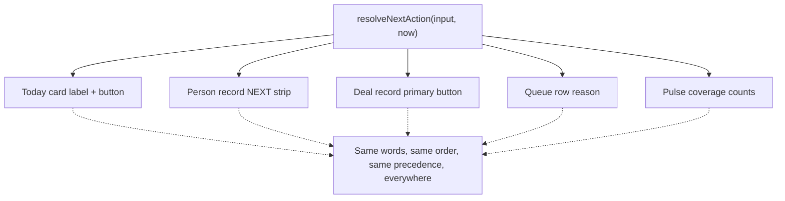
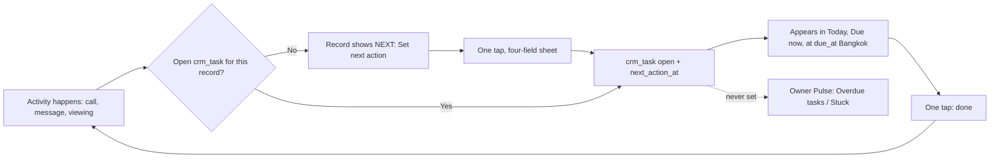
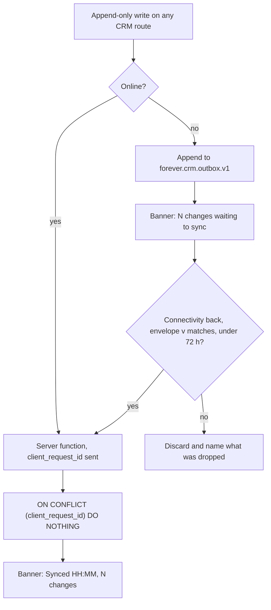

# Forever CRM — UX and Information Architecture

Task ID: FOREVER-CRM-ARCH-001
Status: Proposed architecture — not approved, not scheduled, not authorized for implementation
Repository state of record: main @ 821b3c4e2f6f82e0d4ddce86199a8ff24b44a094
Risk class: R0 (documentation only)

> This document is a design record. It asserts no product truth, changes no active stage, and authorizes no implementation. The active stage remains FOREVER-STUDIO-001 (`docs/CURRENT_STAGE.md`), which lists "large CRM integration" as out of scope. Any implementing task is R2 under the shared-contract rule and requires an Architect-reviewed stage change plus Owner approval.

## What this document decides

1. **Eleven routes, each carrying a phase.** Slice 1 is the `/crm` layout plus one list, nothing else.
2. **Five pure functions** in `src/features/forever-crm/core/` carry every rule that matters, so the Today card, both record headers, the queue reason and the Owner's counts are one computation and cannot drift.
3. **`resolveNextAction` has eleven rungs**, two of them commitments, ranked above routine hygiene.
4. **A WhatsApp tap is not a first response.** Only the returning outcome sheet — an attributed human confirmation — sets `crm_enquiry.first_response_at`.
5. **One Pulse tile set**, owned by `docs/crm/CRM_ANALYTICS_AND_KPI.md` §6.1; this document renders it and adds nothing to it.
6. **The offline outbox buffers three append-only entry kinds on every CRM route**, not one route.
7. **`/crm/queue` has a `Mine` view**, stale-first, which `/crm/find` also renders when its box is empty.
8. **Quiet hours changes the action, never removes it**, and never downgrades an asynchronous channel.
9. **Nothing renders a score, probability, rank, or a percentage below a denominator of 30.**
10. **A named list of untrusted columns renders as plain text**, under a CSP served on `/crm` and `/booth`.

Sibling documents are cited by path, never restated: `docs/crm/CRM_DOMAIN_MODEL.md` owns every table, column and enum; `docs/crm/CRM_ANALYTICS_AND_KPI.md` owns every metric key; `docs/crm/CRM_SECURITY_AND_RBAC.md` owns the actor roster and the endpoint boundary; `docs/crm/CRM_IMPLEMENTATION_PLAN.md` owns the phase gates. This document adds no entity, column or vocabulary of its own.

## 1. The behavioural test

[Web research] NAR's 2025 technology survey (n > 1,200): CRM is only the **#2 lead source at 23%**, behind social media at 39%, and does not appear in the most-used-technology list at all. Agents abandon CRMs that cost them time and return it to management; building instead of buying does not fix that. https://www.nar.realtor/research-and-statistics/research-reports/realtor-technology-survey

> **The reporting rule.** No advisor ever types anything whose only purpose is to feed a report. Every field the Owner's dashboard reads is a byproduct of an action the advisor took for their own benefit. §17.3 checks this field by field.

| Test | Discharged by |
|---|---|
| **T1 — No side spreadsheet.** No second surface is needed to know the day, the book, or what was promised. | §5 (the day), §6 (`Mine`, the book), §8 (the buyer), §17.3 |
| **T2 — Next action always known**, on any record, without deciding. | §4 — one function, five surfaces |
| **T3 — Owner spots neglect in seconds.** Counts with ages, above the fold, names not percentages. | §6 |

Rejected as a fourth test: "advisors enjoy using it." Unmeasurable, and the design would drift toward decoration.

> **One screen, one job.** Every route answers exactly one question and offers exactly one primary action. A screen needing a second primary action is two screens; a screen with no primary action is a list belonging inside another screen. There is no screen on which an advisor chooses between two equally weighted buttons — secondary operations live one level down, behind `⋯` or a bottom sheet, never competing for the thumb. Appendix A is the full per-screen contract.

## 2. Route map, phases and navigation

[Repository fact] The route convention is flat dotted filenames under `src/routes/`: `studio.tsx` is the layout with `<Outlet/>`, `studio.project.$slug.tsx` → `/studio/project/$slug`, and a trailing underscore (`advisory_.report.tsx`) escapes the parent layout.

| Proposed file | Path | Screen | **Phase / trigger** |
|---|---|---|---|
| `src/routes/crm.tsx` | `/crm` | Layout: session gate, `CrmShell`, `<Outlet/>`, one `<Toaster/>` | **Slice 1** |
| `src/routes/crm.index.tsx` | `/crm/` | Slice 1: Lead Response Baseline list. Phase 1: **My Work Today** | **Slice 1**, widened at Phase 1 |
| `src/routes/crm.queue.tsx` | `/crm/queue` | Unassigned · No reply yet · **Mine** | **Phase 1** |
| `src/routes/crm.person.$personId.tsx` | `/crm/person/$personId` | Person record and timeline | **Phase 1** |
| `src/routes/crm.enquiry.$enquiryId.tsx` | `/crm/enquiry/$enquiryId` | Untriaged enquiry | **Phase 1** |
| `src/routes/crm.opportunity.$opportunityId.tsx` | `/crm/opportunity/$opportunityId` | Deal record | **Phase 2** — needs `crm_opportunity` |
| `src/routes/crm.appointment.$appointmentId.tsx` | `/crm/appointment/$appointmentId` | Viewing: before · during · after | **Phase 2** — needs `crm_appointment` |
| `src/routes/crm.pulse.tsx` | `/crm/pulse` | Owner dashboard, Owner role only | Trigger: four of the six §6 tiles have a populated source |
| `src/routes/crm.find.tsx` | `/crm/find` | Search; renders `Mine` when empty | Trigger: ~200 live persons, or the first "I cannot find X" |
| `src/routes/crm.reports.tsx` | `/crm/reports` | Period reporting | Trigger: a full calendar month of Phase-1 data with `enquiries_received ≥ 30` in it |
| `src/routes/crm.more.tsx` | `/crm/more` | Locale, member, sign out | Trigger: the second locale ships, or the first non-Owner member |

**Eleven routes. No sub-tab is a route, no modal is a route, no wizard step is a route.**

**Slice 1 in full.** `/crm` plus `/crm/` only. Owner-gated on `actor.role === 'owner'`; reads `public.leads` through the service-role server-function boundary; **zero `crm_*` tables, zero migrations, R1**. It renders every lead newest-first with age, counts by month, source and status, the distinct-email count, the `project_slug IS NULL` count, the booth-sourced count, and the **un-ingested detector** — `public.leads` rows older than 15 minutes with no matching `crm_enquiry.legacy_lead_id`, computed on demand from the same read path. Nothing else. Deleting Slice 1 is deleting two files and one route.

[Recommendation] **`/crm` is a sibling of `/studio`, not a child.** Studio's vocabulary (`trusted_publisher`, `studio_object_owners`, publication workflows) is publication-specific; nesting the CRM under it would make every CRM screen inherit publishing semantics in navigation and in the reader's mental model. The actor-roster question belongs to `docs/crm/CRM_SECURITY_AND_RBAC.md`; its UX consequence is one conditional tab, and per `src/features/forever-studio/studio-auth.ts` doctrine that rendering grants nothing — `/crm/pulse` is re-authorized at the server boundary and returns the same non-enumerating denial for a non-owner as for a missing record.

[Repository fact] **No link may run from `/booth` into `/crm`.** `src/routes/booth.tsx` has no `beforeLoad`, no loader and no session check — only `robots: noindex, nofollow` — while its own comment calls it staff-only. Any CRM data reachable from that shell inherits its absent access control. The booth writes an enquiry and stops.

```
┌────────────────────────────────────────────────────┐
│                   ( screen )                       │
├────────────────────────────────────────────────────┤
│   ▣          ▢ ⑵        ▢          ▢               │
│ Today      Queue       Find       More             │
└────────────────────────────────────────────────────┘
     Owner sees a fifth tab between Queue and Find:
│   ▣          ▢ ⑵        ▢ ⑺        ▢         ▢     │
│ Today      Queue      Pulse       Find      More   │
```

| Rule | Statement |
|---|---|
| Tab bar | Fixed; reuses the shipped safe-area idiom `pb-[calc(34px+env(safe-area-inset-bottom))]` from `src/features/navigator/components/PrimaryActionBar.tsx` [Repository fact]. List routes only. |
| Record routes | **Hide the tab bar**; back chevron plus a sticky action bar. A record is a task you are mid-way through; a tab bar there invites abandonment. |
| Badges | Exactly two in the whole application: `Queue` and `Pulse`. No notification bell. |
| Desktop | At ≥ 768px (`MOBILE_BREAKPOINT`, `src/hooks/use-mobile.tsx` [Repository fact]) the tab bar becomes a left rail using the scaffolded `src/components/ui/sidebar.tsx`, which already carries the mobile-sheet fallback. |
| Width | `CrmShell` matches `StudioShell` exactly — sticky `h-14` header in `max-w-3xl`, body `max-w-3xl px-4 pb-24 pt-6` [Repository fact] — deviating to `max-w-5xl` only for `/crm/pulse` and `/crm/reports`. |
| Back and denial | Always a real history entry; no redirect-on-deny, no retry loop. `StudioRouteDenied` / `StudioRouteUnavailable` / `isStudioRouteDenial` are reused verbatim, including the rule that a network failure renders as *unavailable*, never as a fabricated permanent denial. |
| Deep links | Every record route is directly linkable and survives a cold load. That is what makes "look at Sergey" in a colleague's message a working handoff. |
| Modals and scroll | A bottom sheet may never open another bottom sheet: one layer, swipe-dismissible, never blocking. Lists page with an explicit "Load 25 more"; no infinite scroll. |

## 3. The rendering contract: five pure functions

[Recommendation] The rules below are not a style guide. Five pure, total, I/O-free functions carry them, in the idiom of `src/features/navigator/core/*` — deterministic, caller-supplied timestamps, unit-testable, importable by both the mobile shell and the server boundary. Location `src/features/forever-crm/core/`, matching the `forever-studio` precedent; exactly one CRM feature directory exists.

```ts
// src/features/forever-crm/core/next-action.ts
export type NextActionKind =
  | "assign_owner" | "reply" | "record_lost_reason"
  | "satisfy_requirement" | "commitment_deadline"
  | "record_outcome" | "open_appointment" | "do_task"
  | "set_next_action" | "advance_or_explain" | "nothing_due";

export interface NextAction {
  kind: NextActionKind;
  labelKey: CrmMessageKey;      // i18n key — never a rendered string
  href: string | null;          // null for an in-place write
  overdueHours: number | null;  // never a score; the unit is explicit
}

export function resolveNextAction(input: NextActionInput, now: Date): NextAction;
```

| # | Condition | `kind` | Live from |
|---|---|---|---|
| 1 | `crm_person.relationship_owner_user_id IS NULL` (P2: or `crm_opportunity.owner_user_id IS NULL`) | `assign_owner` | Phase 1 |
| 2 | `crm_enquiry.first_response_at IS NULL` | `reply` | Phase 1 |
| 3 | `crm_opportunity.status = 'lost'` and `lost_reason_key IS NULL` | `record_lost_reason` | Phase 2 |
| **4** | **An outstanding `crm_reservation_requirement` on a live reservation** | **`satisfy_requirement`** | Phase 3 |
| **5** | **A live reservation whose cooling-off or expiry falls within 7 days** | **`commitment_deadline`** | Phase 3 |
| 6 | Appointment today, `outcome='pending'`, `scheduled_start_at < now` | `record_outcome` | Phase 2 |
| 7 | Appointment today, `outcome='pending'`, `scheduled_start_at >= now` | `open_appointment` | Phase 2 |
| 8 | Open `crm_task` with `due_at <= now` | `do_task` (label = task title) | Phase 1 |
| 9 | `crm_opportunity.status='open'` and `next_action_at IS NULL` | `set_next_action` | Phase 2 |
| 10 | `now − stage_entered_at > target_time_in_status_hours`, **and `next_action_at` null or past** | `advance_or_explain` | Phase 2 |
| 11 | otherwise | `nothing_due` | Phase 1 |

**Rungs 4 and 5 are the commitment correction, and they outrank routine hygiene deliberately.** Before them, a reserved deal with a missing passport scan whose cooling-off ended tomorrow returned `nothing_due`. A lapsed cooling-off period is a forfeited deposit and a released unit, not a soft loss. Both carry `overdueHours`; neither adds a column — they read `reservations_requirements_outstanding` and `reservations_expiring_7d`, already defined in `docs/crm/CRM_ANALYTICS_AND_KPI.md`.

**`next_action_at` is the universal suppressor.** A future `next_action_at` means "deliberately waiting": it suppresses the silence flag, the stage-dwell rung, the overdue prompt and the 21-day claim check. [Owner requirement] A Phuket off-plan cycle runs 6–18 months; a buyer correctly left alone until October must not raise three flags and cost their advisor a claim.

**Rungs are phase-aware, not aspirational.** A rung whose table does not exist is not evaluated and not rendered, so `resolveNextAction` returns a real answer in Phase 1 on four live rungs. The ordering is a product judgement wearing the authority of a pure function: it must be reviewed by the Owner against real days of work, because an error propagates identically to all five surfaces by design.

```ts
// src/features/forever-crm/core/format.ts
export const MIN_RATE_DENOMINATOR = 30;

export type CountDisplay =
  | { kind: "rate"; numerator: number; denominator: number; percent: number }
  | { kind: "counts_only"; numerator: number; denominator: number };
/** Structurally cannot return a percent below MIN_RATE_DENOMINATOR. */
export function formatCountOrRate(numerator: number, denominator: number): CountDisplay;

export type OrderStatisticDisplay =
  | { kind: "values"; values: number[] }             // n < 5  — print every value
  | { kind: "p50"; p50: number }                     // 5 <= n < 12
  | { kind: "p50_p90"; p50: number; p90: number };   // n >= 12
/** The same refusal, applied to order statistics. A median over one deal is that deal. */
export function renderOrderStatistic(values: number[]): OrderStatisticDisplay;

export type FieldDisplay =
  | { kind: "value"; value: string }
  | { kind: "unknown" }   // "Not available" / "Нет данных"
  | { kind: "none" };     // "None" / "Нет" — we know it is zero
/** Fail-closed: undefined, null and "" all become `unknown`.
 *  Only an explicit empty collection becomes `none`. */
export function resolveFieldDisplay(value: unknown, isExplicitEmpty?: boolean): FieldDisplay;

/** The one predicate behind every ▲ in the product. */
export function needsAttention(oldestUntouchedHours: number | null, thresholdHours: number): boolean;
```

```ts
// src/features/forever-crm/core/buyer-time.ts
export const QUIET_HOURS_START_LOCAL = 20; // 20:00 buyer-local
export const QUIET_HOURS_END_LOCAL = 9;    // 09:00 buyer-local

export interface BuyerLocalTime {
  display: FieldDisplay;
  isQuietHours: boolean | null;  // null when unknown — Asia/Bangkok is never assumed
}
export function buyerLocalTime(instant: Date, ianaTimeZone: string | null, locale: CrmLocale): BuyerLocalTime;

/** Quiet hours CHANGES the action; it never removes it. Asynchronous channels are
 *  never downgraded — only `call` is. See §14. */
export function channelActionUnderQuietHours(
  channel: "whatsapp" | "telegram" | "email" | "call",
  isQuietHours: boolean | null,
): { emphasis: "filled" | "outline"; kindOverride: "queue_for_local_morning" | null };
```

Every threshold these functions read is a TypeScript constant in `src/features/forever-crm/core/policy.ts` with its review trigger in a comment — never a row in a policy table. The one this document owns is `OLDEST_UNTOUCHED_ATTENTION_HOURS = 336` (14 days), reviewed the first month more than a third of advisors carry a `▲`.

[Repository fact] `date-fns@^4.1.0` is a dependency but `@date-fns/tz` is not; `Intl.DateTimeFormat` with a `timeZone` option exists in browsers and in Cloudflare Workers, so buyer-timezone rendering needs **zero new dependencies**.



## 4. My Work Today (`/crm/`) — Phase 1

```
┌────────────────────────────────────────────────────┐
│ Forever CRM                     EN ▾    Anna P. ⌄  │  header  48
├────────────────────────────────────────────────────┤
│ Tue 28 Jul · Bangkok 09:12                         │  strip   24
│ ┌─────────┐┌─────────┐┌─────────┐┌───────────────┐ │
│ │  Reply  ││   Due   ││ Silent  ││   Viewings    │ │  tiles   64
│ │    2    ││    5    ││    1    ││       1       │ │
│ └─────────┘└─────────┘└─────────┘└───────────────┘ │
├────────────────────────────────────────────────────┤
│ REPLY FIRST · 2                                    │
│ ┌────────────────────────────────────────────────┐ │
│ │ Sergey V.                     RU · 14 min ago  │ │
│ │ Bangtao Beach Residence · website              │ │
│ │ "Interested in a 2-bed — what is the rental    │ │
│ │  potential there?"                             │ │
│ │ Their time 05:12 Moscow · quiet hours          │ │
│ │ ┌────────────────────┐┌────────┐┌────────────┐ │ │
│ │ │      WhatsApp      ││ Queue  ││     ⋯      │ │ │
│ │ │                    ││ 09:00  ││            │ │ │
│ │ └────────────────────┘└────────┘└────────────┘ │ │
│ └────────────────────────────────────────────────┘ │
│ ┌────────────────────────────────────────────────┐ │
│ │ Anna K.                        EN · 2 h ago    │ │
│ │ Project: Not available · website               │ │
│ │ Their time: Not available                      │ │
│ │ ┌────────────────────┐┌────────┐┌────────────┐ │ │
│ │ │ Confirm you        ││  Call  ││     ⋯      │ │ │
│ │ │ messaged Anna      ││        ││            │ │ │
│ │ └────────────────────┘└────────┘└────────────┘ │ │
│ └────────────────────────────────────────────────┘ │
│ ╌╌╌╌╌╌╌╌ fold · iPhone 14, 390×844 ╌╌╌╌╌╌╌╌╌╌╌╌╌╌╌ │
│ DUE NOW · 5                                        │
│ ┌────────────────────────────────────────────────┐ │
│ │ ☐ Send Bangtao price list      Sergey V.       │ │
│ │   Due 09:00 · 12 min late                      │ │
│ └────────────────────────────────────────────────┘ │
│                                                    │
│ TODAY'S VIEWINGS · 1                    (Phase 2)  │
│ ┌────────────────────────────────────────────────┐ │
│ │ 14:00  Site tour · Layan Green Park            │ │
│ │        Mikhail D. · EN                         │ │
│ │ ┌──────────────────────────────────────────┐   │ │
│ │ │             Prepare  ↓ offline           │   │ │
│ │ └──────────────────────────────────────────┘   │ │
│ └────────────────────────────────────────────────┘ │
│                                                    │
│ GOING SILENT · 1                                   │
│ ┌────────────────────────────────────────────────┐ │
│ │ Elena R.        RU · no contact for 19 days    │ │
│ │ No next action set                             │ │
│ │ ┌────────────────────┐┌────────┐┌────────────┐ │ │
│ │ │      WhatsApp      ││  Call  ││     ⋯      │ │ │
│ │ └────────────────────┘└────────┘└────────────┘ │ │
│ └────────────────────────────────────────────────┘ │
│                                                    │
│         Nothing else needs you today.              │
│         Team queue has 2 unclaimed.  →             │
├────────────────────────────────────────────────────┤
│   ▣ Today   ▢ Queue ⑵   ▢ Find   ▢ More            │
└────────────────────────────────────────────────────┘
```

**The channel-button contract.** [Repository fact] No outbound messaging, no SMTP and no provider client exists on `main`. The CRM does **not** send. `WhatsApp` opens `https://wa.me/<E.164 without +>`; `Call` opens `tel:<E.164>`; `Email` (behind `⋯`) opens `mailto:`. This works today on every phone, needs no gateway, and is the honest capability.

**A tap is an attempt, not a response.** It writes one `crm_activity(kind='message', channel='whatsapp', direction='outbound', is_automated=false, actor_kind='member', metadata->>'link_opened'='true')` and **does not set `crm_enquiry.first_response_at`**. The card stays in *Reply first* with its button relabelled **"Confirm you messaged Sergey"**. On `visibilitychange` back to the tab, one sheet asks one question:

```
┌────────────────────────────────────────────────────┐
│  Did you reach Sergey?                       ✕     │
│  ┌───────────┐ ┌────────────┐ ┌────────────────┐   │
│  │  Reached  │ │ No answer  │ │  Wrong number  │   │
│  └───────────┘ └────────────┘ └────────────────┘   │
│  Skip — I'll record it later                       │
└────────────────────────────────────────────────────┘
```

Only this sheet sets `first_response_at` — an attributed human confirmation, never a navigation event. `docs/crm/CRM_INTEGRATION_AND_EVENTS.md` §5.2 is normative on the predicate and `docs/crm/CRM_ANALYTICS_AND_KPI.md` §4.1 states it once. [Web research] The "unactioned" definition this satisfies is an outbound, non-automated contact from the **assigned** agent, with automated, marketing and batch sends excluded — https://help.followupboss.com/hc/en-us/articles/4402128249367-Dashboard

**`Reached` also emits the inbound half**, writing `crm_activity(kind='message', direction='inbound', actor_kind='member', occurred_at supplied)`. Without an inbound row nothing in the product can record that the buyer replied: the stage machine cannot pass `contacted`, and `crm_person.last_activity_at` ages every live WhatsApp conversation into `silent_persons_14d` within a fortnight. **Skipping is always allowed**, and skipping renders `Outcome not recorded`, never `Contacted`.

**No fifth tile.** A "no next action · N" tile scoped to the signed-in member was proposed and is rejected here: Today's contract is *what is due today*, and a count with no due semantics turns the advisor's action screen into a coverage report — the management-reporting surface the NAR abandonment finding is specifically about. The same records surface on `Mine` (§6), stale-first, on a screen the advisor opens voluntarily.

**Empty state.** Day strip with zeros and one line: *"Nothing needs you today. Team queue has N unclaimed."* No illustration, no confetti, no suggested actions. An honest empty day is the product working.

## 5. Owner Pulse (`/crm/pulse`)

**One tile set exists, and this document does not own it.** `docs/crm/CRM_ANALYTICS_AND_KPI.md` §2 is the metric authority and §6.1 is the tile set of record; the wireframe below is drawn from it tile for tile, each annotated with its metric key. Adding a tile here without adding it there is forbidden — two canonical specifications for one screen means a developer chooses silently.

[Web research] Wilson-interval evidence forbids the obvious design: 3 of 20 = 15% with a 95% interval of 5.2%–36.1%; 2/20 and 3/20 are indistinguishable; detecting a real 10%→15% lift needs roughly 1,400 leads. https://www.itl.nist.gov/div898/handbook/prc/section2/prc241.htm **No percentage, no trend line and no chart appears on this screen.** It is counts, each with an age, each a tap-through, sorted oldest first.

```
┌────────────────────────────────────────────────────┐
│ Forever CRM · Pulse              EN ▾   Owner ⌄    │
├────────────────────────────────────────────────────┤
│ Tue 28 Jul · Bangkok 09:12                         │
│ ┌─────────────────────────┐┌─────────────────────┐ │
│ │ 1 Unanswered            ││ 2 New today         │ │
│ │        3                ││        7            │ │
│ │ oldest 26 h             ││ 2 untriaged         │ │
│ └─────────────────────────┘└─────────────────────┘ │
│ ┌─────────────────────────┐┌─────────────────────┐ │
│ │ 3 Stuck                 ││ 4 Today's meetings  │ │
│ │   Not configured        ││        1            │ │
│ │   6 overdue actions     ││ 2 outcomes missing  │ │
│ └─────────────────────────┘└─────────────────────┘ │
│ ┌─────────────────────────┐┌─────────────────────┐ │
│ │ 5 Overdue tasks         ││ 6 Commitments at    │ │
│ │        9                ││   risk        0     │ │
│ │ oldest 11 d             ││ 0 outstanding · 0   │ │
│ └─────────────────────────┘└─────────────────────┘ │
│ ┌────────────────────────────────────────────────┐ │
│ │ ⚠ 2 leads not ingested — oldest 3 h        →   │ │
│ └────────────────────────────────────────────────┘ │
│ ╌╌╌╌╌╌╌╌ fold · iPhone 14 ╌╌╌╌╌╌╌╌╌╌╌╌╌╌╌╌╌╌╌╌╌╌╌ │
│ WHO IS CARRYING WHAT                               │
│ ┌────────────────────────────────────────────────┐ │
│ │ Anna P.     open 9   oldest untouched  3 d     │ │
│ │ Dmitri K.   open 14  oldest untouched 19 d  ▲  │ │
│ │ Nok S.      open 4   oldest untouched  1 d     │ │
│ │ Unassigned  open 2   oldest untouched  4 d     │ │
│ └────────────────────────────────────────────────┘ │
│  Workload, not performance. No conversion rates.   │
│  ▲ = oldest untouched over 14 days.                │
│                                                    │
│ PIPELINE NOW                             (Phase 2) │
│ ┌────────────────────────────────────────────────┐ │
│ │ new 4   contacted 7   qualified 6              │ │
│ │ viewing 3   reserved 1                         │ │
│ │ Open value  ฿ 184,500,000                      │ │
│ │             $   2,310,000                      │ │
│ │             € Not available                    │ │
│ │ 4 open deals carry no value                    │ │
│ └────────────────────────────────────────────────┘ │
│  Absolute value by currency. Never converted —     │
│  no FX rate of record exists.                      │
├────────────────────────────────────────────────────┤
│  ▣ Today  ▢ Queue ⑵  ▣ Pulse ⑺  ▢ Find  ▢ More     │
└────────────────────────────────────────────────────┘
```

| # | Tile | Metric keys (owned by `CRM_ANALYTICS_AND_KPI.md` §2) | Phase |
|---|---|---|---|
| 1 | Unanswered | `enquiries_unactioned` + oldest age | 1 |
| 2 | New today | `enquiries_received` (24 h) + `enquiries_untriaged` | 1 |
| 3 | Stuck | `stage_dwell_breaches` + `overdue_next_actions` | 2 |
| 4 | Today's meetings | appointments scheduled today + `appointments_outcome_unrecorded` | 2 |
| 5 | Overdue tasks | `overdue_tasks` by owner | 1 |
| 6 | **Commitments at risk** | `reservations_requirements_outstanding` + `reservations_expiring_7d` | 3 |

**Tile 3 fails closed, not open.** [Repository fact] `crm_pipeline_stage.target_time_in_status_hours` is nullable and nothing seeds it, so `stage_dwell_breaches` would return 0 and render a clean all-clear derived from missing evidence — the exact error §13 forbids everywhere else. Targets are seeded **NULL** for `qualified`, `viewing` and `reserved`; the tile renders **`Not configured`**, never `0`. The Owner sets them from observed `cycle_time_days` once twelve transitions exist, through a `crm_pipeline_stage` editor behind the Owner capability.

**A zero count is a fact and renders `0`;** a zero *ratio* renders `No data`. Tile 6 reading `0` is the reassurance it exists to give.

**One further count, and only when it can exist.** When a messaging gateway is bought and `crm_job` returns, `docs/crm/CRM_ANALYTICS_AND_KPI.md` adds a **Sends needing review** count — `needs_review` jobs plus terminal poison jobs — tapping through to a list whose one action per row is a two-way human resolution. A state whose whole purpose is a human decision, with no human able to make it, is write-only. It is not added before the gateway exists, and never unilaterally here.

**Why "workload, not performance" is printed on the screen.** [Inference] A table of names and numbers is read as a ranking whatever the header says. Three things keep it honest: the disclaimer inside the card, the `▲` threshold printed beside it, and the structural omission of any column that could be divided by another. Both columns shown are coverage facts — they say what needs help, not who is good.

## 6. Team queue (`/crm/queue`) — Phase 1

Three segmented views, one route. [Repository fact] `src/components/ui/tabs.tsx` is scaffolded and unused; these are view states, not routes, because they answer the same question.

```
┌────────────────────────────────────────────────────┐
│  ‹ Team queue                          EN ▾        │
├────────────────────────────────────────────────────┤
│ ┌───────────────┬──────────────────┬─────────────┐ │
│ │ Unassigned ⑵  │ No reply yet ⑶   │  Mine ⑼     │ │
│ └───────────────┴──────────────────┴─────────────┘ │
│ ┌────────────────────────────────────────────────┐ │
│ │ Sergey V.                    RU · 4 h ago      │ │
│ │ website · Bangtao Beach Residence              │ │
│ │ "Interested in a 2-bed — what is the rental…"  │ │
│ │ ┌────────────────────────┐┌──────────────────┐ │ │
│ │ │         Take           ││   Assign to…     │ │ │
│ │ └────────────────────────┘└──────────────────┘ │ │
│ └────────────────────────────────────────────────┘ │
│ ┌────────────────────────────────────────────────┐ │
│ │ Unknown caller               — · 40 min ago    │ │
│ │ WhatsApp inbound · +7 9•• ••• 41 22            │ │
│ │ Name: Not available                            │ │
│ │ Project: Not available                         │ │
│ │ ┌────────────────────────┐┌──────────────────┐ │ │
│ │ │         Take           ││   Assign to…     │ │ │
│ │ └────────────────────────┘└──────────────────┘ │ │
│ └────────────────────────────────────────────────┘ │
│ ╌╌╌╌╌ fold ╌╌╌╌╌╌╌╌╌╌╌╌╌╌╌╌╌╌╌╌╌╌╌╌╌╌╌╌╌╌╌╌╌╌╌╌╌╌ │
│  ⋯ 2 held in triage — spam or duplicate       →    │
├────────────────────────────────────────────────────┤
│  ▣ Today   ▣ Queue ⑵   ▢ Find   ▢ More             │
└────────────────────────────────────────────────────┘
```

| View | Contents | Order |
|---|---|---|
| **Unassigned** | Persons with no `relationship_owner_user_id`; Phase 2 also open opportunities with no `owner_user_id` | oldest first |
| **No reply yet** | `crm_enquiry.first_response_at IS NULL` | oldest first |
| **Mine** | Phase 1: persons where `relationship_owner_user_id = me`. Phase 2: open opportunities where `owner_user_id = me`, served by `idx_crm_opportunity_owner_open` | **stale-first** — `last_activity_at` ascending, then `stage_entered_at` ascending |

**`Mine` is the advisor's own book, and it is the anti-spreadsheet correction.** Without it an advisor has no view of their own coverage gaps: "no next action" was an Owner-only tile, so the fix mechanism was the Owner telling someone — precisely the management reporting §17.3 promises does not exist. "Let me list my deals and pick three" is the canonical spreadsheet trigger, and *Today is the whole day* does not answer it, because the whole day is not the whole book. Stale-first ordering makes the coverage prompt a property of a screen the advisor opens by choice.

**`/crm/find` renders `Mine` when its search box is empty**, which also solves the blank-box problem: a search screen showing nothing until you type teaches you it has nothing.

**Take** is one tap: it sets `crm_person.relationship_owner_user_id` (Phase 2: and `crm_opportunity.owner_user_id`) to the acting member, writes `crm_activity(kind='assignment')`, and removes the row. `Assign to…` is outline and server-authorized; taking is the behaviour the queue exists to produce. Phase 2 adds a **booth follow-up** line for `warm` and `browsing` walk-ins, which do not create opportunities.

**Fail-closed in the queue.** An inbound WhatsApp from an unknown number renders `Name: Not available` and a masked number (`+7 9•• ••• 41 22`) — never a guessed name, never a country flag inferred from the prefix. The mask is not security (the server reads everything); it is a shoulder-surfing courtesy on a phone in public, and one tap reveals it.

## 7. Person record and timeline (`/crm/person/$personId`) — Phase 1

The screen that must replace the spreadsheet.

```
┌────────────────────────────────────────────────────┐
│  ‹                                     ⋯           │
├────────────────────────────────────────────────────┤
│  Sergey Volkov                              RU     │
│  Owner Anna P. · first seen 12 Jun · website       │
│  Moscow 05:12 · quiet hours                        │
├────────────────────────────────────────────────────┤
│ ▍ NEXT   Confirm you messaged Sergey               │
│ ▍ DEAL   Bangtao Beach Residence · qualified 3 d   │
│ ▍ MKTG   Not permitted — no consent evidence       │
├────────────────────────────────────────────────────┤
│ ┌────────┬──────────┬───────────┬────────────────┐ │
│ │Timeline│  Profile │ Interests │     Deals ⑴    │ │
│ └────────┴──────────┴───────────┴────────────────┘ │
│  TODAY · Bangkok                                   │
│  ┌──────────────────────────────────────────────┐  │
│  │ ↗ 09:12  WhatsApp opened      Anna P.        │  │
│  │          Outcome not recorded         Record │  │
│  └──────────────────────────────────────────────┘  │
│ ╌╌╌ fold ╌╌╌╌╌╌╌╌╌╌╌╌╌╌╌╌╌╌╌╌╌╌╌╌╌╌╌╌╌╌╌╌╌╌╌╌╌╌╌╌ │
│  ┌──────────────────────────────────────────────┐  │
│  │ ↙ 08:58  Web enquiry          Sergey Volkov  │  │
│  │          "Interested in a 2-bed — what is    │  │
│  │           the rental potential there?"       │  │
│  └──────────────────────────────────────────────┘  │
│  YESTERDAY                                         │
│  ┌──────────────────────────────────────────────┐  │
│  │ ↙ 23:41  Telegram        Sergey Volkov       │  │
│  │          "Sent you the passport scan"        │  │
│  │          ⏱ recorded 07:02 today              │  │
│  └──────────────────────────────────────────────┘  │
│  ┌──────────────────────────────────────────────┐  │
│  │ ▌ 18:20  Internal note        Anna P.        │  │
│  │ ▌        Wife decides. Call after 8.         │  │
│  └──────────────────────────────────────────────┘  │
│  ┌────────┬──────────┬──────────┬──────────────┐   │
│  │  All   │ Messages │  Notes   │  Milestones  │   │
│  └────────┴──────────┴──────────┴──────────────┘   │
│                         Load 25 more               │
├────────────────────────────────────────────────────┤
│ ┌──────────────────┐┌────────┐┌────────┐┌────────┐ │
│ │     WhatsApp     ││  Call  ││  Note  ││   +    │ │
│ └──────────────────┘└────────┘└────────┘└────────┘ │
└────────────────────────────────────────────────────┘
```

**The three-line state strip is the whole design.** `NEXT` is `resolveNextAction`. `DEAL` is the open opportunity with days in stage (Phase 2; hidden before). `MKTG` is marketing eligibility **computed** from `crm_consent_event` and `crm_suppression` — the domain model stores no boolean, so the UI cannot render an optimistic default.

| Computed state | Rendered |
|---|---|
| No consent evidence, or a live suppression | `Not permitted — no consent evidence` |
| Consent given, not withdrawn or voided, no suppression | `Permitted · direct_marketing_whatsapp · notice v3 · 14 Jun` |
| Created by legacy backfill | `Not permitted — imported before consent capture` |

There is **no toggle**. Marketing permission changes only by recording a consent event, behind `⋯ → Record consent`, which requires naming the notice version actually shown. [Web research] The PDPC July 2026 draft guidance cautions against treating consent as a default or catch-all basis — https://www.lexology.com/library/detail.aspx?g=27642f25-1b92-4c09-b8ff-b4b1c4f27467 · primary text, unofficial English translation, the Thai text governs — https://cc.kmutt.ac.th/Files/Act%20Eng/personal-data-protection-act-2019-en.pdf **Descriptive only, not legal advice; qualified Thai counsel must confirm this model.**

**The sticky bar carries an inbound write.** `+` opens a six-item sheet whose first item is **Log message received**, writing `crm_activity(kind='message', direction='inbound', actor_kind='member', occurred_at supplied)`; then Task, Interest, Consent, Identifier, and **Notice given** — the s.25 one-tap recording `s25_notice_method` and `s25_notice_sent_by`. Without the first item there is no surface that can record the buyer saying anything, and every live conversation ages into the silence count. Without the last, the s.25 counter is monotonic and everyone learns to ignore the compliance section.

| Timeline rule | Rendering |
|---|---|
| Ordering | `occurred_at DESC` — the provider's timestamp, never `recorded_at`, never insertion order. [Web research] WhatsApp delivery order is not guaranteed — https://developers.facebook.com/docs/whatsapp/cloud-api/guides/send-messages |
| Late recording | When `recorded_at − occurred_at > 1 hour`, a muted `⏱ recorded HH:MM` line appears. Without it a backfilled message silently rewrites history and the advisor stops trusting the order. |
| Automated vs human | `is_automated = true` renders muted, no actor avatar, an explicit `⚙ Automated` chip. It must never read as advisor effort — that is the whole basis of the unactioned definition. |
| Internal notes | Left rule plus `visibility='internal'` styling. [Repository fact] This is the fix for the defect at `src/features/navigator/core/lead.ts:107-111`, where the booth's internal `staffNote` is concatenated into `leads.message` with no boundary. |
| Language | Buyer messages render in their original script; `Translate ▾` is manual, per message, opt-in. An auto-translation is an unlabelled claim about what the buyer said. |
| Timestamps | Day headers and times in **Asia/Bangkok**, labelled once per screen. Buyer local time appears only where a send decision is made (§14). |
| Filters | The four chips sit at the *bottom* of the first screenful — the default (All) is right almost always. Message metadata (thread id, external id, delivery state) is behind a long-press. |

**What the timeline proves.** Nothing is overwritten: `crm_activity` is append-only, a Navigator re-run supersedes rather than replaces, and a merge is reversible. The UI must *show* that — a superseded decision profile renders as a normal entry with a `Superseded 3 Aug` chip, still openable. An advisor who has once watched their own note vanish in another CRM will keep a spreadsheet forever.

## 8. Deal record (`/crm/opportunity/$opportunityId`) — Phase 2

```
┌────────────────────────────────────────────────────┐
│  ‹ Sergey Volkov                          ⋯        │
├────────────────────────────────────────────────────┤
│  Bangtao Beach Residence · Anna P.                 │
├────────────────────────────────────────────────────┤
│  new › contacted › ▛qualified▟ › viewing › reserved│
│  3 days in stage · target Not configured           │
├────────────────────────────────────────────────────┤
│ ▍ COMMITMENTS                            (Phase 3) │
│ ▍ Reservation · reserved 12 Jul                    │
│ ▍ Cooling-off ends tomorrow 17:00                  │
│ ▍ Outstanding: passport scan, source of funds      │
│ ┌────────────────────────────────────────────────┐ │
│ │              Chase passport scan               │ │
│ └────────────────────────────────────────────────┘ │
├────────────────────────────────────────────────────┤
│ ▍ NEXT ACTION                                      │
│ ▍ Send Bangtao price list — due today 09:00        │
│ ▍ 12 minutes late                          Done ✓  │
├────────────────────────────────────────────────────┤
│  Value           ฿ 14,500,000                      │
│  Expected close  Not available                     │
│  Unit            B-12 · hold verified 9 d ago      │
│  Contacts        Sergey (buyer) · Irina (spouse)   │
│ ╌╌╌ fold ╌╌╌╌╌╌╌╌╌╌╌╌╌╌╌╌╌╌╌╌╌╌╌╌╌╌╌╌╌╌╌╌╌╌╌╌╌╌╌╌ │
│  PROJECT CONTEXT                                   │
│  ┌──────────────────────────────────────────────┐  │
│  │ Bangtao Beach Residence                      │  │
│  │ Open Project Record                        ↗ │  │
│  └──────────────────────────────────────────────┘  │
│  THIS DEAL'S TIMELINE                       12 ›   │
├────────────────────────────────────────────────────┤
│ ┌───────────────────────┐┌─────────────────────┐   │
│ │   Move to viewing     ││    Mark lost        │   │
│ └───────────────────────┘└─────────────────────┘   │
└────────────────────────────────────────────────────┘
```

**The reservation block is promoted out of the overflow whenever one exists.** It sat behind `⋯` in the pre-review design, which is how the one deal with an external clock became the deal the product said nothing about. A reservation is the only state at which the deadline is not the advisor's to move; it therefore ranks above the routine next action, and rungs 4 and 5 of §3 fire from the same facts.

**The stage stepper is a horizontally scrollable chip row, not a Kanban column.** Tapping the next chip advances the stage and resets `stage_entered_at`, writing `crm_activity(kind='stage_change')`; a non-adjacent chip opens a confirm sheet. **No transition requires a value, a close date or a next action** — those surface as coverage counts instead. Inventing a close date to satisfy a constraint is how the stage data that six other metrics depend on becomes fiction.

`Mark lost` is outline and **requires** a `lost_reason_key` from the domain's CHECK vocabulary, rendered as chips. This is the one place in the entire UI that blocks, and it blocks because a lost deal with no reason is the most commonly and permanently lost fact in a CRM.

**Unit holds render with their verification age.** [Repository fact] The hold index delivers intra-Forever exclusivity only; the contention that happens weekly is the developer reallocating or repricing, about which the CRM is confidently stale. The hold therefore always prints `hold verified N d ago`, the conflict flag points at the **staler** side rather than asserting the unit table, and `⋯` carries a one-tap **"I verified this with the developer"** writing `developer_confirmed_at`.

**Currency** is rendered in the deal's own currency with the ISO symbol and never converted. [Repository fact] No FX rate of record exists in the repository; a converted figure would be fabricated. Multi-currency totals stack, never sum, and the count of valueless deals prints beside them.

## 9. Tasks — Phase 1

[Web research] Three states, no transitions, no sub-tasks, no dependencies, no recurrence — even HubSpot keeps task status at `COMPLETED` / `NOT_STARTED`. `crm_task.state IN ('open','done','cancelled')` is rendered literally.

```
┌────────────────────────────────────────────────────┐
│  Next action for Sergey                      ✕     │
│  ┌──────────────────────────────────────────────┐  │
│  │ Send the Bangtao price list                  │  │
│  └──────────────────────────────────────────────┘  │
│  When                                              │
│  ┌────────┐┌──────────┐┌──────┐┌──────┐┌────────┐  │
│  │ Today  ││ Tomorrow ││ +3 d ││ +1 w ││ Pick…  │  │
│  └────────┘└──────────┘└──────┘└──────┘└────────┘  │
│  Who     Anna P. (me) ▾                            │
│  Deal    Bangtao Beach Residence ▾                 │
│  ┌──────────────────────────────────────────────┐  │
│  │                    Add                       │  │
│  └──────────────────────────────────────────────┘  │
└────────────────────────────────────────────────────┘
```

**Completing** is one tap on the checkbox in Today or on the record — no confirmation, no completion note, no outcome modal. Undo for 5 seconds via the one toast in the application. [Repository fact] `sonner@^2.0.7` is a dependency and `src/components/ui/sonner.tsx` exists, but **no `<Toaster/>` is mounted anywhere in `src/`**; mounting exactly one in `crm.tsx` is a real, small addition.



There is **no reminder engine, no escalation ladder and no notification.** The loop closes because Today is the first screen an advisor opens and because the Owner's Pulse counts the gaps. [Repository fact] The only scheduled seam is the existing `*/5` cron with one hard-wired Studio consumer and no outbound channel; a notification feature would be a phantom.

## 10. Interests and project context — Phase 2

**The rule this screen makes visible: the CRM stores a pointer and a date, and nothing else.** `docs/FOREVER_BRAIN_V1.md` §7 forbids the CRM owning project facts.

```
┌────────────────────────────────────────────────────┐
│  Sergey Volkov › Interests                    +    │
├────────────────────────────────────────────────────┤
│  ┌──────────────────────────────────────────────┐  │
│  │ Bangtao Beach Residence          Shortlisted │  │
│  │ added 12 Jun · last seen 25 Jul              │  │
│  │ Open Project Record                        ↗ │  │
│  └──────────────────────────────────────────────┘  │
│  ┌──────────────────────────────────────────────┐  │
│  │ Kamala Hills                       Rejected  │  │
│  │ "Too far from the school"                    │  │
│  │ Open Project Record                        ↗ │  │
│  └──────────────────────────────────────────────┘  │
│  Prices, availability, plans and unit inventory    │
│  live in the Project Record. The CRM keeps only    │
│  what this buyer said about it.                    │
└────────────────────────────────────────────────────┘
```

[Recommendation] `Open Project Record ↗` targets the published page `/projects/$slug` via `projectPagePath(slug)` (`src/features/forever-studio/studio-types.ts:483`). It deliberately does **not** target `/internal/projects/$slug` — [Repository fact] that loader throws `notFound()` outside `import.meta.env.DEV`, so the route does not exist in production. A member needing the editable record follows `/studio/project/$slug`, separately membership-authorized.

**Adding an interest** uses a picker over `public.projects` applying `excludeKnownFictitiousProjects` (`src/lib/public-truth.ts:43`) [Repository fact], so a quarantined demo slug can never be shortlisted. The picker shows **name and area only** — no price, no availability, no thumbnail; rendering a price would create a second place a price appears, and prices change.

**On matching, stated plainly.** No numeric match score, confidence or ranking is rendered anywhere in the CRM. [Repository fact] `RecommendedProject.matchScore` and `.confidence` exist in `src/features/advisory/types.ts:63-67` with **no producer**, because no approved evidence-backed calculation rule exists in the repository. Where an ordering is unavoidable it uses the existing evidence-coverage ordering and is labelled **position, not quality**.

## 11. Viewing (`/crm/appointment/$appointmentId`) — Phase 2

One route, three states. The only screen designed for a specific physical situation: an advisor standing outside a villa in Layan on 3G.

```
BEFORE — from Today, still on wifi          DURING — on site, no signal
┌──────────────────────────────────┐  ┌──────────────────────────────────┐
│ ‹ Site tour · today 14:00     ⋯  │  │ ⚠ Offline · 2 changes waiting    │
├──────────────────────────────────┤  ├──────────────────────────────────┤
│ Layan Green Park                 │  │ Layan Green Park · Mikhail Dubov │
│ Mikhail Dubov · EN               │  │ 14:00 · site tour                │
│ Their time 09:12 Bangkok         │  ├──────────────────────────────────┤
├──────────────────────────────────┤  │  HOW DID IT GO?                  │
│ BEFORE YOU GO                    │  │  ┌──────────┐ ┌───────────────┐  │
│ ☑ Confirmed with buyer           │  │  │   Held   │ │   No show     │  │
│ ☐ Passport scan on file          │  │  └──────────┘ └───────────────┘  │
│ ☐ Units to show chosen           │  │  ┌──────────┐ ┌───────────────┐  │
├──────────────────────────────────┤  │  │Cancelled │ │  Rescheduled  │  │
│ THEY TOLD US                     │  │  └──────────┘ └───────────────┘  │
│ Investment · 500k–1m · 3–6 months│  │  NOTE                            │
│ Concerns: ownership, rental yield│  │  ┌────────────────────────────┐  │
│ "Wife decides. Call after 8."    │  │  │ Liked B-corner units.      │  │
├──────────────────────────────────┤  │  └────────────────────────────┘  │
│ ┌──────────────────────────────┐ │  │  UNITS SEEN  ┌────┐┌────┐┌────┐ │
│ │  Save for offline · ↓ 240 KB │ │  │              │B-12││B-14││ +  │ │
│ └──────────────────────────────┘ │  │              └────┘└────┘└────┘ │
│  Saved 09:12 · expires in 72 h   │  ├──────────────────────────────────┤
└──────────────────────────────────┘  │ ┌──────────────────────────────┐ │
                                      │ │            Save              │ │
AFTER — back in signal                │ └──────────────────────────────┘ │
┌──────────────────────────────────┐  │  Saved on this phone. Will sync. │
│ ✓ Synced 15:40 · 2 changes       │  └──────────────────────────────────┘
├──────────────────────────────────┤
│ Site tour · held · 14:00–15:10   │
│ ▍ NEXT ACTION — not set          │
│ ┌──────────────────────────────┐ │
│ │       Set next action        │ │
│ └──────────────────────────────┘ │
│ ┌─────────┐┌──────────┐┌───────┐ │
│ │Send info││Book again││Move to│ │
│ │tomorrow ││this week ││reserv.│ │
│ └─────────┘└──────────┘└───────┘ │
└──────────────────────────────────┘
```

During the viewing the four outcome buttons sit at the top with nothing above them — the phone may be in one hand — and the note is optional. `inspection_trip` is not an appointment type: a multi-day buyer visit is a container, not a meeting. When `crm_trip` arrives (Phase 3, triggered by the first visit spanning more than one day) the offline pack becomes a trip pack at the same time and this screen does not otherwise change.

Photo upload is refused: [Repository fact] Cloudflare Workers is memory-limited and no CRM media pipeline exists, and a half-working upload on 3G is worse than none. Two-way calendar sync is refused: [Web research] push notifications carry no body, channels have no auto-renewal, and Google states delivery is not 100% reliable — https://developers.google.com/workspace/calendar/api/guides/push An `.ics` link sits behind `⋯` instead.

## 12. The offline outbox — three entry kinds, every route

**The buffer follows the writes, not the route.** Scoping offline writing to the appointment screen disabled the two highest-frequency mobile writes — the contact attempt with its outcome, and the free note — in exactly the situation that produces them, and it defeated the anti-spreadsheet escape valve precisely when there is no signal, hands are full, and something is worth remembering.

| Element | Decision |
|---|---|
| Scope | `forever.crm.outbox.v1` accepts three **append-only** entry kinds — `contact_attempt`, `contact_outcome`, `note` — from **any** CRM route. Edits, stage changes and assignments are read-only offline. A strictly smaller rule than "one route only", on the same mechanism. |
| Storage | `localStorage`, versioned envelope `{ v, createdAt, expiresAt, entries[] }`. |
| Why not `sessionStorage` | [Repository fact] The booth uses `sessionStorage` (`forever.booth.session.v1`), which does not survive the OS killing a backgrounded browser — exactly what a two-hour site visit does. |
| Why `localStorage` is safe here | The CRM runs on a per-advisor authenticated device, not the shared unauthenticated booth tablet. Two non-negotiable obligations follow: the outbox is **cleared on sign-out**, and every envelope carries a **hard 72-hour expiry** checked on read. |
| Versioning | Rejected outright on a `v` mismatch. [Repository fact] `deserializeSession` (`src/features/navigator/core/session.ts:213`) accepts any structurally plausible payload with no version check and spreads unknown fields over a fresh base; that defect must not be copied. |
| Replay idempotency | Each queued write carries a client-generated UUID replayed as `client_request_id TEXT` on `crm_activity`, with its own partial unique index and `ON CONFLICT (client_request_id) DO NOTHING`. A dedicated column is required: a note carries no channel, so the `(channel, external_id)` index cannot deduplicate one against itself. |
| Appointment outcome | An UPDATE, not an activity row, so it replays through a service-role RPC that is a **no-op when `outcome <> 'pending'`** — idempotent by state rather than by index. |
| Not built | A service worker. An IndexedDB store. A two-way sync engine. Conflict resolution. Offline reads of anything not explicitly prefetched. |



## 13. Fail-closed display, and the five states

Every row is enforced by `resolveFieldDisplay`, `formatCountOrRate`, `renderOrderStatistic` or `needsAttention` — never by convention.

| Situation | Renders | Never renders |
|---|---|---|
| Value absent, null, empty string | `Not available` (muted) | `—`, `N/A`, blank, `0`, `Unknown` |
| Known-empty collection | `None` | `Not available` |
| Price, availability, size, completion date | *nothing at all* — the CRM does not hold them | Any cached or copied project fact |
| Marketing eligibility unresolvable | `Not permitted — no consent evidence` | `Permitted`, a toggle in the on position |
| Call or message outcome unrecorded | `Outcome not recorded` | `Contacted`, `Reached`, `Completed` |
| Buyer timezone unknown | `Their time: Not available`, button stays filled | Asia/Bangkok as a fallback |
| Project slug in the quarantine list | The row is **hidden**, and the excluded count is disclosed | The fictitious project |
| A denial that might be a network failure | `Temporarily unavailable · Retry` | `Access denied` |
| Any rate with denominator < 30 | `4 of 55` plus the refusal caption | `7.3%` |
| An order statistic below n = 5 | Every individual value | A median over one deal |
| **Stage dwell target NULL for every stage** | **`Not configured`** | `0`, or a green "on track" |
| Attention marker | `▲` only where `needsAttention(...)` is true, threshold printed in the caption | An undefined alarm beside a named colleague |

**The absence of evidence renders as absence, never as a positive default.** A green "on track" badge derived from a missing target is a fabricated reassurance, and it is exactly the class of error that makes an Owner stop trusting a dashboard.

| Route state | Rendering |
|---|---|
| **Loading** | `src/components/ui/skeleton.tsx` in the exact shape of the content. No full-page spinner; the layout must not jump. |
| **Empty** | One honest sentence and, where one exists, one action. No illustrations, no marketing copy. |
| **Error (transient)** | `Temporarily unavailable` plus `Retry`. Back stays a normal history entry. |
| **Denied** | The non-enumerating panel. Identical for missing, forbidden and legacy — it discloses nothing. |
| **Offline** | A persistent banner with the pending-write count. Append-only writes are buffered on every route (§12); edits, stage changes and assignments are read-only with a stated reason. |

## 14. Time, quiet hours, and the timezone that must actually exist

| Where | Clock shown | Rule |
|---|---|---|
| Every timestamp, day header, due date, report period | **Asia/Bangkok**, labelled once per screen | One operating clock. Two clocks everywhere is unreadable. |
| Beside a channel button, and in the appointment scheduler | **Buyer local**, from `crm_person.timezone` | The only places a send decision is made. |
| Everywhere else | Nothing | |

**Where the timezone comes from.** [Repository fact] `src/components/ContactForm.tsx:154` renders country as a free-text `<Input>` and `BoothLeadForm.tsx` does the same; nothing populates `crm_person.timezone`, so under a fail-closed rule quiet hours would never fire at all. The fix is one field: replace the free-text country with an **ISO-3166 selector** — `docs/crm/CRM_DOMAIN_MODEL.md` already requires one for E.164 parsing, so one control solves two problems — and derive `crm_person.timezone` from `residence_country_iso2`, advisor-overridable. [Unverified assumption] The derivation is ambiguous for multi-zone countries (Russia, the United States, Indonesia) and must be treated as a correctable default, never as a fact.

| Channel | Outside 09:00–20:00 buyer-local |
|---|---|
| `whatsapp`, `telegram`, `email` — **asynchronous** | **Never downgraded.** A WhatsApp message at 05:12 Moscow is read at 09:00 and is the correct action. |
| `call` — **synchronous** | The one action *changes* to **`Queue for 09:00 Moscow`**, writing a `crm_task` due at that instant. Not greyed out, not blocked. |
| Timezone unknown | Nothing changes; the button stays filled, `isQuietHours` is `null`, Asia/Bangkok is never assumed. |

Greying out every card was the pre-review behaviour, and it would have fired on the systematically most common morning queue — the Russian-evening enquiries arriving between 23:00 and 03:00 Phuket. [Web research] The skew is structural: Phuket is UTC+7, Moscow UTC+3. A single global wall-clock human-response SLA is unachievable and would be recorded as failed nightly, which is why §15 reports *Answered within 1 h* and *Never answered* and why no screen displays a countdown to a human-response deadline.

## 15. Reporting (`/crm/reports`)

Three tables, zero charts, one refusal printed on the page.

```
┌──────────────────────────────────────────────────────────────────────────┐
│  Reports          Period  ‹ July 2026 ›                     EN ▾         │
├──────────────────────────────────────────────────────────────────────────┤
│  WHERE THINGS ARE                                                        │
│  ┌────────────────────────────────────────────────────────────────────┐  │
│  │ Stage        Open   Median current age in stage   Over target      │  │
│  │ new             4   1, 1, 2, 4 d  (n<5)                     0      │  │
│  │ contacted       7   4 d (p50)                               1      │  │
│  │ qualified       6   11 d (p50)                              3   ▲  │  │
│  │ viewing         3   2, 6, 9 d  (n<5)                        1      │  │
│  │ reserved        1   9 d                                     0      │  │
│  │ Open total     21                                           5      │  │
│  └────────────────────────────────────────────────────────────────────┘  │
│  ⓘ Ages of deals still open — censored, not a completed cycle time.      │
│    Individual values below n=5; p50 from n=5; p90 from n=12.             │
│    ▲ = three or more over a configured target.                          │
│                                                                          │
│  WHAT CAME IN — first touch and last touch, side by side                 │
│  ┌────────────────────────────────────────────────────────────────────┐  │
│  │ Source           Enquiries   First touch of won   Last touch of won│  │
│  │ website                 34                    2                  1 │  │
│  │ booth                   11                    1                  2 │  │
│  │ referral                 4                    1                  1 │  │
│  │ whatsapp_inbound         6                    0                  0 │  │
│  │ Total                   55                    4                  4 │  │
│  └────────────────────────────────────────────────────────────────────┘  │
│  ⓘ 4 of 55. Too few to compute a rate — a percentage from this many      │
│    would swing more than the difference you are looking for.             │
│                                                                          │
│  WHAT WE DID                                                             │
│  ┌────────────────────────────────────────────────────────────────────┐  │
│  │                        Jul   Jun   May                             │  │
│  │ Enquiries received      55    41    38                             │  │
│  │ Answered within 1 h     29    18    16                             │  │
│  │ Never answered           3     6     9                             │  │
│  │ Viewings held           12     9     7                             │  │
│  │ Reservations             1     0     1                             │  │
│  └────────────────────────────────────────────────────────────────────┘  │
│                                              Export this period as CSV ↓ │
└──────────────────────────────────────────────────────────────────────────┘
```

**The refusal is a rendered element, not a policy in a document.** `formatCountOrRate` cannot return a percentage below `MIN_RATE_DENOMINATOR = 30`, and `renderOrderStatistic` cannot return a median below n = 5. The stage column is named **"Median current age in stage"** and declared censored, because it measures rows that are still open: their eventual cycle time is longer than shown by an unknown amount. A guard built for percentages alone is how an order statistic over one deal acquired the authority of a summary.

**The one-hour column, not five minutes.** [Web research] The "5-minute rule" traces to a single vendor study whose own author states the pattern appears only when data from several companies is combined; the vendor sold callback dialer software — https://www.onecavo.com/wp-content/uploads/2015/11/MIT-InsideSales.com_Lead-Response-Management.pdf The defensible threshold is one hour, and the useful finding is that the bar is on the floor: 23% of 2,241 audited companies never responded at all, average 42 hours — https://thedenmangroupselling.wordpress.com/wp-content/uploads/2011/03/the-short-life-of-online-sales-leads-harvard-business-review.pdf **Never answered** is the number worth putting in front of the Owner every month.

**Per-advisor splits** sit behind one toggle with the same "counts, not performance" caption as Pulse. They include `wins_by_credited_member` — a **count** of won deals per credited member, with no denominator, deliberately. The conversion ban is untouched: no stage-to-stage, per-agent or per-source ratio appears at any volume, and it lifts only at ≥ 30 matured opportunities per advisor **and** an assignment mechanism making lead mix comparable — both, not either.

**Export safety.** Every export from any CRM surface — this CSV and the DSR access export in `docs/crm/CRM_PRIVACY_CONSENT_RETENTION.md` — obeys one rule: quote every field; prefix any cell whose first character is `=`, `+`, `-`, `@`, TAB or CR with a single quote; prefer TSV or a text-typed XLSX for the DSR export; unit-test with a formula-shaped name fixture. [Repository fact] `leads_name_not_empty CHECK (length(btrim(name)) > 0)` is the only constraint on `public.leads.name`, and that column is populated from an unauthenticated public form. Formula injection is a well-known class, cheap to close, and triggered here by the most senior user in the organisation.

**Charts are refused.** [Repository fact] `recharts@^2.15.4` and `src/components/ui/chart.tsx` are present and unused; a chart implies a trend implies a rate, and there is no denominator for one.

## 16. Assignment and reassignment

Two levels, one owner each, no sharing matrix. [Web research] Attio's coarse, additive, most-permissive-wins model is the target — https://attio.com/help/reference/managing-your-data/objects/manage-access-to-objects — while Pipedrive's visibility groups (4 levels, up to 150 groups) are actively harmful when a booth host's walk-in must be instantly visible to the advisor — https://support.pipedrive.com/en/article/visibility-groups

```
┌────────────────────────────────────────────────────┐
│  Reassign                                    ✕     │
├────────────────────────────────────────────────────┤
│  Bangtao Beach Residence · Sergey Volkov           │
│  From   Anna P.                                    │
│  To     ┌────────────────────────────────────────┐ │
│         │ ○ Dmitri K.    open 14 · oldest 19 d ▲ │ │
│         │ ● Nok S.       open  4 · oldest  1 d   │ │
│         │ ○ Anna P.      open  9 · oldest  3 d   │ │
│         └────────────────────────────────────────┘ │
│  Why                                               │
│  ┌──────────┐┌──────────┐┌──────────┐┌──────────┐  │
│  │ Language ││ Workload ││  Leave   ││Buyer     │  │
│  │          ││          ││          ││asked     │  │
│  └──────────┘└──────────┘└──────────┘└──────────┘  │
│  ☑ Also move the relationship (all their deals)    │
│  ┌──────────────────────────────────────────────┐  │
│  │                  Reassign                    │  │
│  └──────────────────────────────────────────────┘  │
└────────────────────────────────────────────────────┘
```

| Element | Decision |
|---|---|
| Opens from | Three places, one sheet: the queue row (`Assign to…`), the record `⋯`, and a Pulse filtered list. |
| Writes | `crm_person.relationship_owner_user_id` (Phase 2: and `crm_opportunity.owner_user_id`) plus one `crm_activity(kind='assignment')` carrying the reason. [Repository fact] Reassignment is not a new table — the timeline *is* the routing log. |
| Reason | **Required.** Four chips, no free text. A required reason turns reassignment from an invisible reshuffle into evidence, and matters most when commission is later disputed. |
| Workload inline | Each member's open count and oldest untouched age, using the same `▲` predicate as Pulse, so the decision is informed without leaving the sheet. |
| Who may | Everyone may hand off their own; only the Owner may move someone else's. Rendered accordingly and re-authorized server-side — hiding the option grants nothing. |
| Bulk | Exists only as the Owner's *Move all N* on a member's Pulse row: the leaver scenario, and nothing else. |
| Refused | Round-robin; routing rules and their editor; working-hours and vacation configuration — [Web research] ordered first-match-wins rules with per-rule hours are the right eventual shape (https://help.lofty.com/hc/en-us/articles/360055177831-Lead-Routing-How-to-set-up-lead-routing-rules) but are pointless with one pipeline and a handful of advisors, and the domain does not model them. Co-owners, teams, territories. Approval workflows. A "request access" flow — everything is already visible to every member. |

**The 21-day claim check is `flag_only`.** No clock ever writes `owner_user_id` or `relationship_owner_user_id`. A lapse writes the Owner a `crm_task`; a human reassigns. A machine performing a commission-relevant write on a timer is not a feature.

## 17. Untrusted content, CSP, and why nobody keeps a spreadsheet

### 17.1 Untrusted text renders as text

Buyer-authored content renders as **plain text in a bounded container**: never interpreted as markdown, never rendered as HTML, and — stated here so it survives into any future feature — **data, never instructions**. The rule applies to a named list, not one example: `crm_enquiry.message_text`, `crm_activity.body_text`, `crm_activity.subject_text`, `crm_person.display_name`, `crm_decision_profile.guest_note`, any `summary_text`, and `public.leads.name` / `.message` wherever mirrored. The chain begins at an unauthenticated public form and ends in an authenticated advisor session, which is why the list is enumerated rather than exemplified.

### 17.2 Content-Security-Policy

Served on **all `/crm` and `/booth` routes**, pinned by a route test: `default-src 'self'`; `img-src 'self' data:`; `connect-src 'self' <supabase project origin>`; `object-src 'none'`; `frame-ancestors 'none'`; `base-uri 'self'`; `Referrer-Policy: no-referrer`; and no inline event handlers anywhere in CRM components. `/booth` is included because it is the unauthenticated shell rendering the same untrusted strings, and because it has no `beforeLoad` today.

### 17.3 The reporting rule, checked field by field

Advisors keep spreadsheets for six reasons, and each has a named countermeasure on a named screen: *the CRM cannot express something* — a free note on every entity, one tap from the sticky bar, no required fields, **buffered offline** (§7, §12); *the CRM is slower* — every routine write is one tap, no Save on the advisor path, a task is two taps and a phrase (§4, §9); *they cannot see the whole day* — Today is the whole day, one scroll, no filters (§4); *they cannot see their whole book* — `Mine`, stale-first, opened voluntarily (§6); *they cannot work where the work happens* — `tel:` / `wa.me` / `mailto:` needs no gateway and the viewing screen works with no signal (§4, §11); *data gets lost* — append-only timeline, supersede-not-overwrite profiles, reversible merge, and the UI *shows* it (§7). The sixth, the NAR one, is reporting overhead, and it is checked field by field:

| Owner metric | Derived from | Did an advisor type anything for it? |
|---|---|---|
| `enquiries_unactioned` | `first_response_at`, set by the outcome sheet the advisor uses to remember what happened | No |
| `enquiries_untriaged` | absence of triage | No |
| `overdue_tasks`, `overdue_next_actions` | tasks the advisor set **for themselves** | No |
| `stage_dwell_breaches` | `stage_entered_at`, moved so their own board stays honest | No |
| `appointments_outcome_unrecorded` | the outcome tap taken to close the viewing | No |
| `reservations_requirements_outstanding` | requirements chased for the advisor's own commission | No |
| `pipeline_value_open` | `expected_value_amount`, optional, entered once for the advisor's own recall | No — optional, and for themselves |

**Zero advisor-only-for-management fields.** That is the claim, and it is checkable against any future screen: a proposed field read only by Pulse or Reports violates the rule and does not ship.

### 17.4 Why this is not Salesforce

[Web research] The decisive tell: Salesforce ships a *troubleshooting guide for its own permission system* — OWD, role hierarchy, sharing rules, manual sharing, 5,000 roles, asynchronous recalculation — and requires an administrator function Forever does not have. https://trailhead.salesforce.com/content/learn/modules/data_security/data_security_records Five structural refusals remove whole categories rather than simplifying them: **no sharing UI** (every member sees every record, so OWD, role hierarchy, sharing rules and recalculation all vanish); **one layout per record type in TSX**; **fields are migrations**, not a field builder; **six fixed tiles and three fixed tables**, not a report builder; **no automation engine** — `resolveNextAction` is a pure function, not a rule set.

The measurable target: **an advisor's first useful action within 60 seconds of first sign-in, with no training and no configuration.** The first screen is Today, the first card has one filled button, and the button opens WhatsApp.

## 18. Components, accessibility and language

[Repository fact] `src/components/ui/` contains **46** shadcn primitives, of which only **eight** are imported anywhere outside that directory: `button` (26), `input` (7), `label` (6), `badge` (5), `textarea` (4), `tooltip`, `progress`, `hover-card`. The remaining 38 are Lovable-scaffolded and unexercised. They cost **no new dependency**, but each first use is effectively new code — Radix behaviour, focus traps and SSR characteristics that have never run in this codebase — and must be reviewed as such rather than waved through as "already present".

| Screen element | Primitive | Status |
|---|---|---|
| Every action; all chips; every text field | `button` (26), `badge` (5), `input` (7), `textarea` (4), `label` (6) | Proven |
| Loading | `skeleton.tsx` | Proven (1) |
| Cards, queue views, record tabs, report tables | `card`, `tabs`, `table` | Scaffolded |
| Task, reassign and outcome sheets; lost-reason confirmation; pickers; appointment date | `drawer` (vaul), `alert-dialog`, `select`, `radio-group`, `calendar` | Scaffolded |
| Desktop rail; `/crm/find` | `sidebar` (mobile-sheet fallback, uses `useIsMobile`); `command` (cmdk) | Scaffolded |
| Undo on task completion; failures only | `sonner` + **one** `<Toaster/>` in `crm.tsx` | No `<Toaster/>` exists in `src/` today |
| Icons | `lucide-react@^0.575.0` | Dependency present |
| **Deliberately unused** | `chart` / `recharts`, `carousel`, `menubar`, `navigation-menu`, `resizable`, `context-menu`, `breadcrumb`, `pagination`, `accordion`, `input-otp`, `slider`, `aspect-ratio` | — |

**Accessibility and performance floor**, stated once for all screens: 44×44px minimum touch targets; visible focus rings using the existing `focus-visible:ring-2` idiom; `prefers-reduced-motion` respected as `PrimaryActionBar.tsx` already does; an `aria-label` on every icon-only control; the RU/EN switch sets `lang` on the document; colour never the sole carrier of meaning (an over-target row gets `▲` as well as red); and `/crm/` renders its first card with no chart or table library in the bundle.

**RU and EN from day one, with no i18n dependency.** [Repository fact] There is no i18n library in `package.json` and no locale infrastructure in `src/`. [Recommendation] Do not add one — two locales and a few hundred strings do not justify a runtime. Proposed `src/features/forever-crm/i18n/messages.ts`: a flat `as const satisfies Record<string, Record<CrmLocale, string | PluralForms>>` record keyed the way `src/features/navigator/core/questions.ts` already keys questions — keys stored, never display labels — exporting `CrmMessageKey = keyof typeof CRM_MESSAGES`, which is the type `NextAction.labelKey` uses.

| Rule | Reason |
|---|---|
| A `crm-i18n-completeness.test.ts` asserts every key carries both locales and every RU plural carries `one`/`few`/`many`/`other` | The repo's contract-test culture makes this cheap; without it RU silently degrades to EN |
| Counts go through `Intl.PluralRules(locale)` | Russian has three plural forms — "2 заявки" vs "5 заявок". Platform built-in, zero dependencies |
| **UI locale ≠ buyer language.** The advisor's locale is a member preference; the buyer's is `crm_person.preferred_language`, shown as the `RU`/`EN` badge on every card | An RU-speaking advisor routinely works an EN-speaking buyer. Conflating them sends messages in the wrong language |
| Layout absorbs ~30% Cyrillic expansion: no fixed-width buttons, no truncation on primary actions, `min-w-0` on flex children | "Reply first" → "Сначала ответить" is 62% longer. A design tested only in English breaks in production |

## 19. The refusal list

| # | Refused | Why |
|---|---|---|
| 1 | Lead score, health score, temperature, engagement meter | No approved evidence-backed calculation rule exists; `docs/CURRENT_STAGE.md:221-222` places new scoring out of scope. A score is a fabricated claim wearing a number's authority |
| 2 | Probability %, weighted pipeline, forecast category | A second manually overridable forecast axis, and no denominator supports a probability |
| 3 | Stage-to-stage or per-agent conversion %, funnel charts | Uninterpretable at this volume and read as performance evidence regardless of the caption |
| 4 | Activity leaderboards and points | Dial-for-dollars culture rewarding activity theatre at high ticket values — https://help.lofty.com/hc/en-us/articles/360047876811-In-Depth-Round-Robin-Next-Up |
| 5 | Drag-and-drop Kanban; a separate "Deals" object; density toggle, column chooser, table sorting | Unusable one-handed; one table and one word; three settings producing three private views of one list |
| 6 | Custom fields, field builder, picklist manager; saved-view builder; dashboard-widget configurator | Forever owns its migrations. Every configuration surface produces divergent private views — spreadsheets inside the CRM |
| 7 | Bulk multi-select and bulk edit | The one legitimate case is the Owner's leaver action. General bulk edit is how data quality dies in one afternoon |
| 8 | In-app composer | Nothing on `main` can send; a composer over a phantom gateway is the worst possible affordance |
| 9 | Rich-text notes; free-text tags | Rich text is a stored-markup surface for untrusted content; ungoverned tags become a second, worse stage field within a month |
| 10 | @mentions, internal chat, comment threads; notification bell | At ~10 seats a second chat tool splits the conversation, and an unread inbox is a second to-do list competing with Today |
| 11 | Calendar month view and two-way calendar sync | An appointment list plus the record is the whole job; sync fails the complexity test (§11) |
| 12 | A merge wizard showing a similarity number | A confidence score by another name. There is no merge UI before Phase 2; when it comes it shows two records side by side and asks a human |
| 13 | Auto-translation of buyer messages | An unlabelled claim about what the buyer said |
| 14 | CSV import UI | Import carries consent, dedupe and PDPA s.95 consequences; an importer lets anyone poison the dedupe universe |
| 15 | Per-record visibility, private records, "request access" | Zero visibility controls, zero visibility bugs |
| 16 | Infinite scroll | "Load 25 more" instead. Infinite scroll makes "did I reach the end?" unanswerable — exactly what a coverage check must answer |
| 17 | Onboarding tour, empty-state illustrations with CTAs, confetti; success toasts on routine writes; dark mode at launch | If a screen needs a tour it is the wrong screen; the state change *is* the feedback; dark mode doubles visual QA for zero behavioural gain |
| 18 | Photo upload from the viewing screen | Workers is memory-limited and no CRM media pipeline exists |
| 19 | Any link from `/booth` into `/crm` | [Repository fact] `/booth` has no auth guard; CRM data reachable from that shell inherits its absent access control |

## 20. Owned elsewhere, deliberately

| Not decided here | Owned by |
|---|---|
| Every table, column, enum, index and invariant | `docs/crm/CRM_DOMAIN_MODEL.md`. `client_request_id` and the ISO-3166 country field are requests to that document, not decisions of this one |
| Every metric key, tile definition and statistical floor | `docs/crm/CRM_ANALYTICS_AND_KPI.md` §2 (authority) and §6.1 (tile set of record) |
| The actor roster, capabilities, endpoint boundary, booth session TTL | `docs/crm/CRM_SECURITY_AND_RBAC.md`. The UX consequence is one conditional tab |
| Server-function names, zod schemas, error envelopes | `docs/crm/CRM_INTEGRATION_AND_EVENTS.md`; this section assumes the `createServerFn(...).middleware(...).validator(zod).handler(...)` template |
| Phase gates, exit criteria, kill triggers | `docs/crm/CRM_IMPLEMENTATION_PLAN.md` |
| Legal sufficiency of any consent or notice wording shown | Qualified Thai counsel. Everything here is descriptive, **not legal advice** |
| An outbound messaging gateway UI | Deferred with a stated trigger. The `tel:` / `wa.me` / `mailto:` handoff is designed so a future gateway replaces the handoff without changing any other screen |

## Appendix A — The per-screen contract

| Screen | Above the fold | The one action | One level down | Deliberately absent | Phase |
|---|---|---|---|---|---|
| `/crm/` Slice 1 | Counts by month/source/status, newest leads with age, the un-ingested banner | Read | — | Any write, any `crm_*` table | Slice 1 |
| `/crm/` Today | Header, Bangkok clock, four-tile strip, both complete *Reply first* cards with buttons (≈544 of ≈724 px) | The primary button on the top card | Email, Log message received, Log a note, Snooze, Reassign, Open record | Scores, badges, search, filters, sort, a date picker, a "completed today" list, charts, a greeting, a fifth tile | 1 |
| `/crm/queue` | Three view counts and the two oldest unclaimed with **Take** | **Take** | Triage bucket (spam · duplicate); booth follow-up (P2); full payload at `/crm/enquiry/$id` | Round-robin, auto-assignment, routing rules, claim timers, per-agent capacity | 1 |
| `/crm/person/$id` | Name, buyer language, owner, buyer local time, the three-line state strip, tabs, first timeline entry | Sticky `WhatsApp`; `Note` is one tap from anywhere | Profile fields, decision answers, identifiers, party group, referral, merge history, DSR and retention state | Score, lead grade, engagement meter, completeness ring, avatar, free-text tags, "similar buyers", any project fact, per-field edit pencils | 1 |
| timeline | The three most recent entries and the day header | Scroll; `Record` on a null outcome | Filter chips at the foot of the first screenful; message metadata on long-press | Eight filter types, search-within, read receipts, typing indicators, reactions, an inline composer, threading | 1 |
| task sheet | Title focused, five When chips, `Add` | **Add** | Exact time (`Pick…`), reassigning, cancelling (long-press) | Priority, type, duration, sub-tasks, dependencies, recurrence, templates, a task-list route | 1 |
| `/crm/opportunity/$id` | Buyer, project, owner, stage stepper with days-in-stage vs target, the commitments block, the next-action line | The `resolveNextAction` button; `Set next action` when none | Credit split, party group, contact roles, attribution | Probability %, weighted value, forecast category, "health", mobile Kanban, line items, a quote builder, a second Deal object | 2 |
| `/crm/appointment/$id` | *Before:* buyer, time, checklist, what they told us, the offline button. *During:* banner and all four outcome buttons. *After:* outcome and next-action prompt | *Before:* Save for offline. *During:* one outcome tap. *After:* Set next action | Directions, full timeline, project media, reschedule | Maps, photo upload, check-in, geolocation, signature pad, timer, attendee lists, calendar sync | 2 |
| reassign sheet | The whole sheet — short enough to fit a phone without scrolling | **Reassign** | Bulk *Move all N*, Owner only | Round-robin, routing editor, working-hours config, co-owners, teams, territories, approvals | 2 |
| `/crm/pulse` | All six counts with ages, plus the un-ingested banner | Tap a count → filtered list; one action per row: **Assign to…** | Per-advisor breakdown, history (`/crm/reports`), record detail | Every chart, every percentage, conversion, forecast, quota bars, leaderboard, activity feed, date-range picker | trigger |
| `/crm/find` | Search box; `Mine` when it is empty | Open the record | — | Saved searches, filter builder, ranking by anything | trigger |
| `/crm/reports` | Period selector and the whole stage table | Change the period | CSV export; per-advisor toggle | Charts, conversion, funnels, forecasts, quotas, a report builder, scheduled email, year-over-year | trigger |
